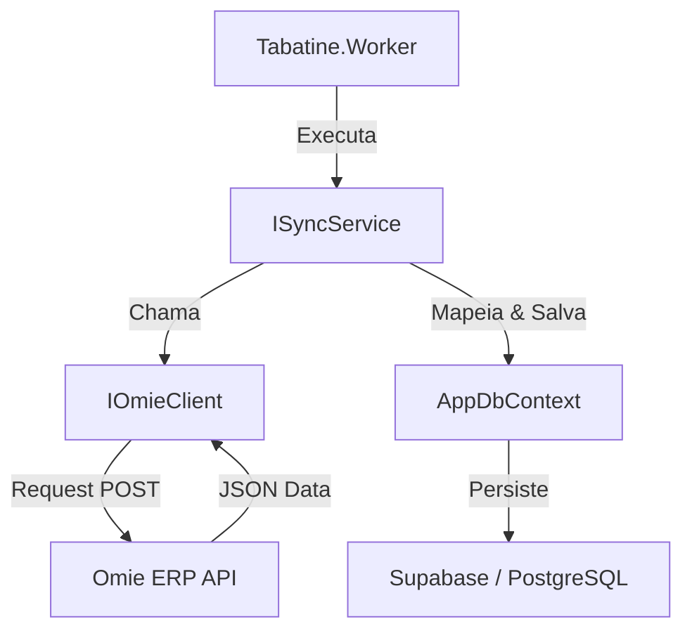

# Tabatine — Regras do Workspace (Engine)

## Visão Geral do Projeto

Tabatine Engine é uma solução de sincronização com o **Omie ERP** construída com **.NET 10**. O objetivo principal é manter um banco de dados local (Supabase/PostgreSQL) sincronizado com os dados do Omie para permitir consultas rápidas e integração com outros sistemas sem sobrecarregar a API do Omie ou sofrer com seus limites de taxa.

---

## Arquitetura da Solução

O projeto segue uma arquitetura limpa (Clean Architecture) e utiliza padrões **Antigravity** para garantir performance e manutenibilidade:

- **Tabatine.Core**: Contém as entidades de domínio, interfaces e lógica de negócio central. As entidades geralmente herdam de `OmieEntityBase`.
- **Tabatine.Infrastructure**: Implementação dos serviços de dados (EF Core), repositórios e integração com APIs externas.
- **Tabatine.Omie.Client**: Biblioteca cliente especializada para comunicação com a API REST/JSON do Omie, utilizando **Records** para DTOs.
- **Tabatine.Worker**: Host .NET que orquestra as tarefas de sincronização e processamento de webhooks.

### Pilares Arquiteturais (Obrigatórios)
1. **Memory Safety**: Uso de `IAsyncEnumerable<T>` com `yield return` para evitar estouros de memória em listagens massivas.
2. **Result Pattern**: Nunca use exceções para controle de fluxo de negócio. Utilize `Result<T>`.
3. **Primary Constructors**: Padrão C# obrigatório para Injeção de Dependência (.NET 10).
4. **Global Usings**: Uso de `GlobalUsings.cs` em cada projeto para manter as classes limpas.
5. **Snake Case Database**: O banco de dados (Supabase) deve seguir estritamente `snake_case`.
6. **Resiliência Nativa**: Implementar Circuit Breaker e Exponential Backoff em todas as chamadas Omie.

### Fluxo de Sincronização

---

## API Omie — Referência Rápida

### Protocolo de Comunicação
Todas as APIs do Omie usam **JSON via HTTP POST**. A `APP_KEY` e `APP_SECRET` são obrigatórias em todas as chamadas.

### Limites e Boas Práticas
- **Rate Limit**: Respeitar o limite de 240 req/min e bloqueio de 60s por registro (Consulte as **Skills** de API).
- **Paginação**: Usar `registros_por_pagina` (máximo 100) e iterar de forma assíncrona.

---

## Especialização de Documentos

Para detalhes específicos, consulte os documentos em `.agents/rules/`:
- `dot-net-standards.md`: Convenções de C# e estilos de codificação.
- `efcore-supabase-rules.md`: Regras de banco de dados e Fluent API.
- `omie-api-rules.md`: Integração técnica com APIs REST.

Para implementação de fluxos específicos, use as **Skills**:
- `omie-api-skills`: Validações de roteamento e payloads complexos.
- `omie-webhooks`: Processamento assíncrono de notificações push.