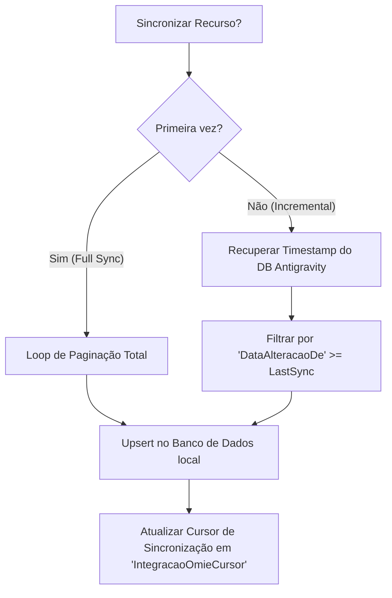

# Skill: Omie API Core Integration

## 1. Definition
Garante o consumo padronizado, escalável e seguro da API da Omie para o Tabatine Engine, provendo um HttpClient encapsulado, resiliência contra instabilidades de rede e abstração arquitetural para a paginação dos endpoints de listagem.

## 2. Capabilities & How-To Patterns

### [Pagination & Flow]: Memory Safety
> [!IMPORTANT] IAsyncEnumerable
> É **estritamente proibido** retornar `List<T>` ou alocar todos os registros na memória ao buscar dados massivos. Use fluxos assíncronos (`IAsyncEnumerable<T>` com `yield return`) para evitar pressão no LOH (Large Object Heap).

*   Implemente loops `while (paginaAtual <= totalPaginas)` utilizando a propriedade `total_de_paginas` da resposta da Omie.
*   Mantenha um `registros_por_pagina` fixo em **100** para máxima eficiência e estabilidade da API Omie.

### [Data Transfer Objects]: Records & JSON Mapping
*   **Padrão**: Utilize `record` C# com propriedades `{ get; init; }` para imutabilidade.
*   Explicite o mapeamento com `[JsonPropertyName("nome_campo_no_omie")]` em todos os campos para garantir compatibilidade com o RPC da Omie.

### [Error Handling]: Result Pattern
*   Evite exceções para controle de fluxo.
*   Encapsule retornos em um objeto `Result<T>` que contenha `Success`, `Data` e `ErrorMessage` (ou `ErrorCode`).
*   Reserve `try/catch` apenas para falhas críticas de infraestrutura (Socket, Timeout).

## 3. Decision Tree: API Sync Strategy
Escolha a abordagem correta para sincronização de dados:



## 4. Constraints (Antigravity Rules)
*   **Rate Limits**: Máximo de 240 reqs/minuto. Utilize `scripts/test-omie-connection.ps1` para validar o status.
*   **Isolamento**: Camada `Tabatine.Infrastructure` injeta `IOmieClient`. Nenhuma lógica do `Core` deve tocar no HTTP/OmieDTO.

## 5. Scripts (Black Boxes)
*   **`scripts/test-omie-connection.ps1`**: Testa as credenciais e o status de conectividade com a API.
    *   *Uso*: `pwsh scripts/test-omie-connection.ps1`

---
## 6. Implementation Reference (Agent Template)
```csharp
public async IAsyncEnumerable<ClienteDto> StreamClientesAsync(DateTime lastSync)
{
    int current = 1;
    int total = 1;
    while(current <= total) {
        var resp = await _client.PostAsync<Resp>("ListarClientes", new { pagina = current, datar_de = lastSync });
        total = resp.TotalPaginas;
        foreach(var item in resp.Items) yield return item;
        current++;
    }
}
```
