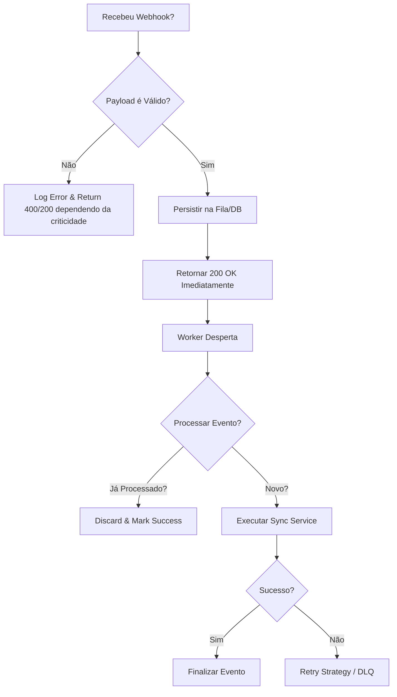

# Skill: Omie Webhook Integration

## 1. Definition
Esta skill foca no ciclo de vida de uma notificação Push enviada pelo ERP Omie: desde a recepção de alta performance até o processamento assíncrono garantindo idempotência e visibilidade.

## 2. Architecture Components (Focused)
Para uma implementação saudável, utilize os seguintes componentes:

*   **[Webhook Receiver]:** Endpoints de Ingestão que validam o payload e retornam HTTP 200 imediatamente (< 7s).
*   **[Event Queue]:** Mecanismo de persistência temporária (Fila/Tabela de Ingestão) para desacoplar o recebimento do processamento.
*   **[Background Processor]:** Worker assíncrono que consome a fila e executa a lógica de negócio (Upsert, Sync).
*   **[Idempotency Guard]:** Validador que utiliza o `message_id` ou timestamp do evento para evitar reprocessamento de duplicatas.

## 3. Decision Tree: Webhook Processing
Use este guia para decidir como agir ao receber um evento:

## 4. Required Implementation Rules (Antigravity Rules)
> [!IMPORTANT] Return Fast
> O endpoint DEVE retornar HTTP 2XX antes de qualquer processamento pesado. O timeout da Omie é de 7 segundos; se estourar, a Omie tentará novamente causando Head-of-Line Blocking.

> [!WARNING] Idempotency
> Como a Omie pode reenviar eventos (devido a falhas de rede ou DLQ), o processamento DEVE ser idempotente. Use o ID do recurso + Event Type ou o ID da mensagem como chave.

## 5. Scripts (Black Boxes)
Esta skill inclui scripts utilitários para facilitar o desenvolvimento:

*   **`scripts/gen-mock-webhook.ps1`**: Gera payloads JSON de exemplo para teste local.
    *   *Uso*: `pwsh scripts/gen-mock-webhook.ps1 -Event "produto.alterado"`

---
## 6. References
- Ver `references/omie_webhooks_api.md` para detalhes dos payloads.
- Ver `references/webhook-docs.md` para diagramas de sequência.
