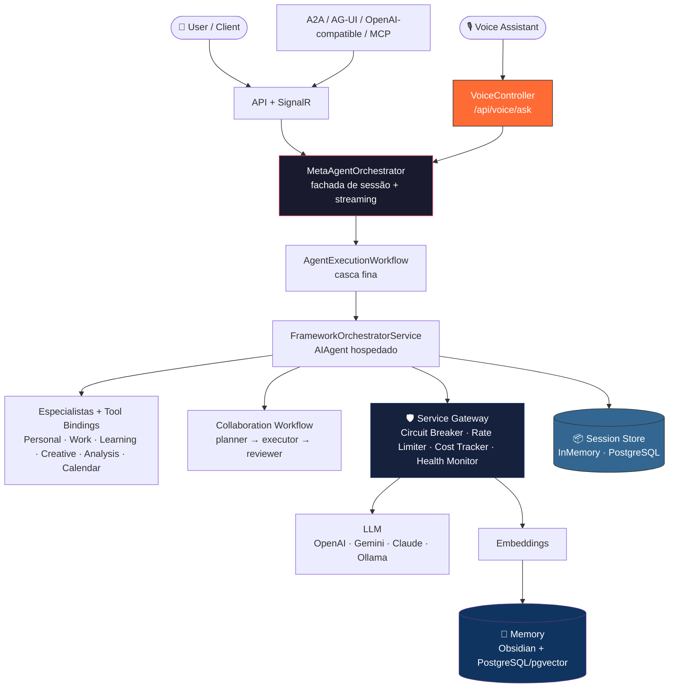

# 🤖 Sistema Agentic Generalista

> .NET 10 + Microsoft Agent Framework + Microsoft.Extensions.AI — orquestração framework-first hospedada, memória Obsidian + PostgreSQL/pgvector e superfícies A2A, AG-UI, MCP e OpenAI-compatible.

## Atualização Maio/2026 — Runtime V2

- Execução centralizada em `AgentExecutionWorkflow` (orquestração operacional fora do `MetaAgentOrchestrator`)
- Streaming fim a fim via SignalR (`ChatHub`) e SSE (`POST /api/chat/stream`)
- MCP server HTTP autenticado em `/mcp` com tools para listar agents, consultar RAG, inventariar tools e executar o MetaAgent
- Governança de tools com políticas de risco, aprovação e auditoria
- Artefatos operacionais persistidos por sessão (plan, steps, review, handoff, tool outputs)
- Human-in-the-loop para resposta final sensível (`final-approvals`)

Referências:
- [docs/INDEX.md](docs/INDEX.md)
- [docs/architecture/backend-architecture-explained.md](docs/architecture/backend-architecture-explained.md)
- [docs/USER-STORIES.md](docs/USER-STORIES.md)
- [docs/planejamento/AI_Advanced_Capabilities_Roadmap.md](docs/planejamento/AI_Advanced_Capabilities_Roadmap.md)

## 🧭 Governança de Escopo (Core x Laboratório)

### Core de Produto

O caminho padrão e estável do produto permanece:

- chat principal
- ciclo de vida de sessão
- streaming fim a fim
- um caminho principal de execução
- observabilidade mínima para operação

### Trilhas de Laboratório

Capacidades experimentais (como protocolos extras, plugins MCP, workflows colaborativos avançados, loops de self-improvement e superfícies administrativas especializadas) ficam fora do core por padrão e devem seguir:

- feature flag obrigatória
- módulo separado
- rollout opcional
- fallback explícito para o comportamento atual

### Critérios de incubação e descarte

Toda capacidade experimental precisa nascer com hipótese, critério de sucesso e critério de remoção. A promoção para o core só ocorre com ganho recorrente comprovado contra baseline e sem abrir um segundo caminho principal de execução. Sem ganho mensurável ou com aumento de risco/custo operacional, a diretriz é rollback ou descarte.

## 🚀 Quick Start

```bash
cp appsettings.example.json appsettings.json   # Configurar API keys
dotnet restore
dotnet run --project src/AgenticSystem.Api      # https://localhost:5001
dotnet test
```

```bash
curl -X POST https://localhost:5001/api/chat \
  -H "Content-Type: application/json" \
  -d '{"message": "Crie um lembrete para amanhã às 14h"}'
```

**MCP server**: `https://localhost:5001/mcp` via Streamable HTTP/SSE, protegido pela autenticação padrão da API.

## 🧠 O que este sistema faz?

O sistema expõe uma fachada de chat e protocolo que abre sessão, inicia streaming e delega a execução principal para um orquestrador hospedado no Microsoft Agent Framework. Esse orquestrador escolhe especialistas, tools auxiliares, RAG e workflow colaborativo conforme a necessidade:

- 📅 **Produtividade** — Calendário, tarefas, lembretes
- 💼 **Trabalho** — Email, documentos, reuniões
- 📚 **Aprendizado** — Pesquisa, resumos, explicações
- 🎨 **Criatividade** — Brainstorming, escrita, ideação
- 📊 **Análise** — Dados, insights, relatórios

## 🏗️ Arquitetura

> Diagramas Mermaid detalhados: [docs/architecture/diagrams.md](docs/architecture/diagrams.md)



## 🛠️ Stack Tecnológica

| Camada | Tecnologias |
|--------|-------------|
| **Core** | .NET 10, ASP.NET Core 10, SignalR 10, Microsoft.Extensions.AI |
| **Agent Runtime** | Microsoft Agent Framework 1.4 + hosting/workflows |
| **LLM** | OpenAI, Google Gemini, Anthropic Claude, Ollama, IChatClient contextual |
| **Embeddings** | OpenAI (text-embedding-3-small), Google (text-embedding-004), Ollama (nomic-embed-text), ML.NET+ONNX |
| **Memory** | Obsidian vault (human-readable), PostgreSQL + pgvector (semantic search) |
| **Protocols** | A2A, AG-UI, MCP HTTP, OpenAI-compatible |
| **Integrations** | MCP Plugins e superfícies administrativas do produto |
| **Document Pipeline** | Parsers (Markdown, PlainText, HTML), Hybrid Chunking, RAG + Re-Ranking |
| **Gateway** | Circuit Breaker (pure C#), Rate Limiter, Cost Tracker, Health Monitor |

## � Segurança & Resiliência

| Proteção | Implementação |
|----------|---------------|
| **Prompt Injection Protection** | Pré-processamento, quality gates e ferramentas auxiliares do orquestrador hospedado |
| **Rate Limiting per-Tenant** | Sliding window no `/api/chat` — retorna 429 Too Many Requests quando excedido |
| **Correlation ID** | Header `X-Correlation-Id` em error responses para rastreabilidade de incidentes |
| **Retry com Jitter Exponencial** | PostgresVectorStore e PostgresSessionStore — evita thundering herd |
| **JSON Corrupted Data Safety** | try/catch `JsonException` em `GetAsync`/`ReadSessionsAsync` — dados corrompidos não crasham o sistema |
| **Auth** | MultiAuth com API Key ou JWT via `PolicyScheme` |
| **Protocol Governance** | Rate limiting dedicado para superfícies A2A, AG-UI e compatibilidade OpenAI |

## �📂 Estrutura do Projeto

```
src/
├── AgenticSystem.Api/              # Web API + SignalR
│   ├── Auth/                       # MultiAuth (API Key + JWT)
│   ├── Controllers/                # REST endpoints (Chat, Agent, LLM, Voice...)
│   ├── Hubs/                       # SignalR real-time (ChatHub, GatewayHub)
│   └── Program.cs                  # Startup + DI
├── AgenticSystem.Core/             # Business Logic
│   ├── Interfaces/                 # Contracts (ISkill, ITool, ISessionStore)
│   ├── Models/                     # Domain models (SessionData, AgentResponse...)
│   ├── Services/                   # MetaAgentOrchestrator, AgentExecutionWorkflow, pipelines
│   └── LLM/                       # LLM abstraction layer
└── AgenticSystem.Infrastructure/   # External Services
  ├── AgentFramework/             # Hosted orchestrator + tool bindings + session adapter
  ├── LLM/                        # LLMManager, ContextAwareChatClient, providers e compatibilidade
    ├── Embeddings/Providers/       # OpenAI, Google, Ollama, ONNX
    ├── Persistence/                # PostgresSessionStore (produção)
    ├── Documents/                  # Parsers (Markdown, PlainText, HTML)
    ├── Chunking/                   # Hybrid chunking strategy
    ├── RAG/                        # RAG service + Heuristic Re-Ranker
    ├── Integrations/               # Conectores e superfícies externas compatíveis
    ├── Gateway/                    # External Service Gateway
    ├── Memory/                     # pgvector
    └── MCP/                        # MCP plugins
tests/
└── AgenticSystem.Tests/            # suíte automatizada do backend
docs/architecture/                  # Diagramas, pipeline, RAG flow
data/obsidian-vault/                # Obsidian notes
```

## 🤖 Agents

> Registry completo: [docs/architecture/agent-registry.md](docs/architecture/agent-registry.md) | Schema: [agent-registry.schema.json](docs/architecture/agent-registry.schema.json)

| Agent | Tier | Domínio | Temp | Função |
|-------|:----:|---------|:----:|--------|
| MetaAgent | 0 Chief | orchestration | 0.2 | Análise de contexto e roteamento |
| PersonalAgent | 1 Master | personal | 0.4 | Produtividade pessoal, calendário |
| WorkAgent | 1 Master | work | 0.3 | Email, documentos, reuniões |
| LearningAgent | 1 Master | learning | 0.6 | Pesquisa, ensino, explicações |
| CreativeAgent | 2 Specialist | creative | 0.9 | Brainstorming, escrita criativa |
| AnalysisAgent | 2 Specialist | analysis | 0.1 | Análise de dados, relatórios |
| CalendarAgent | 2 Specialist | scheduling | 0.0 | Agendamentos específicos |
| NotificationAgent | 3 Support | notifications | 0.2 | Alertas e lembretes |
| APIAgent | 3 Support | api-integration | 0.3 | Chamadas a APIs externas |

### 🔧 Skills vs Tools

> Contrato completo: [docs/architecture/skills-vs-tools.md](docs/architecture/skills-vs-tools.md)

- **Skill** = conhecimento passivo injetado no prompt (ex: `creative-writing`, `data-analysis`)
- **Tool** = capability ativa executável via Gateway (ex: `calendar-provider`, `email-sender`)

## ⚙️ Configuração LLM Providers

### 1. Configurar appsettings.json

A estrutura real de configuração usa `AgenticSystem` como seção raiz:

```json
{
  "AgenticSystem": {
    "Ollama": {
      "BaseUrl": "http://localhost:11434",
      "DefaultModel": "phi3",
      "EmbeddingModel": "nomic-embed-text",
      "Enabled": true,
      "Priority": 1
    },
    "OpenAI": {
      "ApiKey": "sk-proj-...",
      "BaseUrl": "https://api.openai.com/",
      "DefaultModel": "gpt-4o-mini",
      "Enabled": false,
      "Priority": 10
    },
    "Gemini": {
      "ApiKey": "AIza...",
      "Enabled": false,
      "Priority": 5
    },
    "Claude": {
      "ApiKey": "sk-ant-...",
      "Enabled": false,
      "Priority": 3
    },
    "Gateway": {
      "DefaultDailyBudget": 50.00,
      "DefaultFailureThreshold": 5
    },
    "Memory": {
      "ObsidianVaultPath": "",
      "VectorStoreType": "InMemory"
    },
    "RAG": {
      "ReRanking": { "Enabled": true, "UseDedicatedProvider": true }
    },
    "CollaborationWorkflow": {
      "EnableAdvancedWorkflow": false,
      "EnableConcurrentContextStage": true
    }
  },
  "ConnectionStrings": {
    "SessionStore": "Host=localhost;Port=5432;Database=agentic;Username=postgres;Password=..."
  },
  "ProtocolHosting": {
    "A2A": { "Enabled": true },
    "AgUI": { "Enabled": true },
    "OpenAICompatible": { "Enabled": true }
  }
}
```

> Veja `src/AgenticSystem.Api/appsettings.example.json` para o exemplo completo.

### 2. Variáveis de Ambiente (alternativa)

```bash
export OPENAI_API_KEY="sk-proj-..."
export GEMINI_API_KEY="AIza..."
export CLAUDE_API_KEY="sk-ant-..."
```

## 🎛️ External Service Gateway

Todo serviço externo passa pelo Gateway unificado com proteção e telemetria.

> Diagrama detalhado: [diagrams.md — External Service Gateway](docs/architecture/diagrams.md#3-external-service-gateway)

| Componente | Função |
|-----------|--------|
| **Circuit Breaker** (pure C#) | Proteção contra falhas em cascata |
| **Rate Limiter** | Controle de throughput por provider |
| **Cost Tracker** | Custo por serviço/agent/sessão + alertas de budget |
| **Health Monitor** | Health checks + auto-failover |

### Serviços Controlados

| Categoria | Providers | Interface |
|-----------|-----------|-----------|
| LLM | OpenAI, Gemini, Claude, Ollama | `ILLMProvider` + `IChatClient` contextual |
| Embedding | OpenAI, Google, Ollama, ONNX | `IEmbeddingProvider` |
| Tools locais | datetime, http, calculator, file-search | `ITool` |
| Memória | PostgreSQL + pgvector, Obsidian Vault | `IVectorStore`, `IObsidianSync` |
| Protocolos | MCP, A2A, AG-UI, OpenAI-compatible | Superfícies hospedadas |

### Admin API

> Endpoints administrativos seguem a autenticação padrão da API. O runtime suporta API Key e JWT via MultiAuth.

```bash
# Gateway
GET  /api/admin/gateway/dashboard              # Snapshot completo
GET  /api/admin/gateway/services?category=LLM  # Por categoria
POST /api/admin/gateway/services/OpenAI/enable  # Toggle runtime
POST /api/admin/gateway/categories/LLM/switch   # Trocar provider
GET  /api/admin/gateway/costs?range=7d          # Custos
GET  /api/admin/gateway/health                  # Health

# Voice (Alexa / Google Assistant ready)
POST /api/voice/ask                            # Text-in → clean text-out (7s timeout)

# LLM Providers
GET  /api/admin/llm/providers                  # Listar providers
PUT  /api/admin/llm/providers/{name}           # Atualizar provider (apiKey, model, enabled, priority)

# Settings (runtime)
GET  /api/admin/settings                       # Todas as configurações
PUT  /api/admin/settings/gateway               # Atualizar GatewaySettings
PUT  /api/admin/settings/memory                # Atualizar MemorySettings

# MCP Plugins
GET  /api/admin/mcp/plugins                    # Listar plugins
POST /api/admin/mcp/plugins                    # Registrar plugin
```

**MCP Server**: `/mcp` — expõe `list_agents`, `search_knowledge`, `list_runtime_tools` e `execute_agent`

**SignalR Hub**: `/hubs/gateway` — eventos: `ServiceStatusChanged`, `CostAlertTriggered`, `CircuitStateChanged`, `RateLimitWarning`

**Dashboard Web**: `https://localhost:5001/dashboard`

## 🗺️ Roadmap Q2 2026: Consolidação & Especialização

Estamos evoluindo de um núcleo agentic robusto para uma plataforma especializada, observável e interoperável.

| Track | Objetivo | Status |
|-------|----------|:------:|
| **1. Specialized Context** | Restringir conhecimento de agentes a salas específicas (RBAC + Precisão) | 🚧 Em Progresso (ADR-019, Entity + Migration criados) |
| **2. FinOps & Quotas** | Monitoramento em tempo real de custos e limites por tenant/agente | ⏳ Planejado |
| **3. Protocol Hosting** | Exposição padronizada via A2A e AgUI para ecossistemas externos | ⏳ Planejado |
| **4. Evaluation Suite** | Medição contínua de qualidade (Grounding, Fluency) via Golden Sets | ⏳ Planejado |

> Plano mestre detalhado: [plan/master-roadmap-2026.md](plan/master-roadmap-2026.md)

## 🗺️ Roadmap Histórico (ML Baseline)

| Domínio | Capacidade | Status |
|---------|------------|:------:|
| **Foundation** | Memory Chunking & Context Budgeting | ✅ |
| **Reasoning** | Adaptive Multi-step Planning | ✅ |
| **Quality** | Autonomous Reflection & Trust Scoring | ✅ |
| **Memory** | Semantic & Episodic Memory (Obsidian + pgvector) | ✅ |
| **Autonomy** | Native Handoffs & Dynamic Agent Creation | ✅ |
| **Persistence**| Unified Session Persistence (ISessionStore) | ✅ |
| **Protocols** | A2A, AG-UI, MCP & OpenAI Compatibility | ✅ |
| **Vision** | Multimodal Vision Processing | ✅ |

### Documentação

- [**Agentic Design Manifesto**](docs/agentic-design-manifesto.md) — Os 10 princípios que guiam o design do sistema
- [Extension Examples](docs/extension-examples.md) — Guia para criar novos Agents, Tools, Skills e Maturity Levels
- [Design Philosophy](docs/architecture/concepts.md) — Pilares arquiteturais do sistema (8 pilares + ML1-15)
- [Obsidian Vault](docs/obsidian-vault.md) — Memória episódica: interface, implementação, configuração e limitações

## 📄 Document Ingestion + RAG Pipeline

> Detalhes: [docs/architecture/document-pipeline.md](docs/architecture/document-pipeline.md) | [docs/architecture/rag-flow.md](docs/architecture/rag-flow.md)

Pipeline completo para ingestão de documentos, chunking inteligente e retrieval-augmented generation:

```
RawDocument → Parser → ParsedDocument → Chunking → Embedding → VectorStore
                                                                    ↓
                                          User Query → Search → Re-Rank → RAGContext
```

| Componente | Implementação | Função |
|-----------|---------------|--------|
| **Parsers** | `MarkdownParser`, `PlainTextParser`, `HtmlParser` | Extração estrutural por tipo de documento |
| **Chunking** | `HybridChunkingStrategy` | Chunking por seções com overlap, merge de chunks pequenos |
| **Re-Ranker** | `HeuristicReRanker` | TF + phrase match + metadata scoring via named constants (sem LLM) |
| **RAG Service** | `RAGService` | Retrieval agentic com query variants, merge distinto e compressão semântica sob pressão de contexto |
| **Pipeline** | `DocumentIngestionPipeline` | Orquestra parse → chunk → embed → upsert |

### Estratégias de Retrieval

| Strategy | Filtros | Uso |
|----------|---------|-----|
| `Default` | — | Busca geral |
| `RecentMemory` | `type=conversation` | Memória recente do agent |
| `DomainKnowledge` | `type=knowledge` | Base de conhecimento |
| `DecisionHistory` | `type=decision` | Histórico de decisões |
| `Episodic` | `session_id` | Contexto da sessão |
| `Targeted` | `agent_id` | Documentos do agent |

## 🎯 Casos de Uso Práticos

### 📅 Produtividade Pessoal
```bash
# "Agende reunião com João amanhã às 14h sobre projeto X"
# → Roteia para CalendarAgent (temp: 0.0) → Cria evento preciso
```

### 🎨 Brainstorming Criativo  
```bash
# "Ideias inovadoras para app de fitness"
# → Roteia para CreativeAgent (temp: 0.9) → Gera ideias variadas
```

### 📊 Análise de Dados
```bash
# "Analise o relatório em anexo e extraia insights"
# → Roteia para AnalysisAgent (temp: 0.1) → Análise precisa
```

### 🤔 Aprendizado
```bash
# "Explique machine learning de forma simples"
# → Roteia para LearningAgent (temp: 0.6) → Explicação didática
```

## 🚀 Deployment

### Docker

```dockerfile
# Dockerfile já configurado
docker build -t agentic-system .
docker run -p 8080:8080 \
  -e OPENAI_API_KEY="sk-..." \
  -e GEMINI_API_KEY="AIza..." \
  agentic-system
```

### Kubernetes

```yaml
# k8s/deployment.yaml incluído
kubectl apply -f k8s/
```

### Azure Container Apps

```bash
# Scripts de deploy incluídos
./scripts/deploy-azure.sh
```

## 📈 Monitoramento

- **Structured Logging**: eventos operacionais e auditoria do runtime
- **Gateway Dashboard**: custos, estado de circuit breaker e saúde dos serviços
- **SignalR**: eventos em tempo real via `GatewayHub`
- **Quality Score**: Score contínuo 0-1 com baseline histórico e AI evaluation (`Fluency` + `RTC`) quando há contexto de sessão

## 🧪 Testes

```bash
# Backend
dotnet test

# Frontend E2E
cd frontend && npx cypress run

# Load testing (K6)
k6 run frontend/k6/gateway-load-test.js
```

## 🤝 Contribuindo

1. **Fork** o repositório
2. **Branch** feature (`git checkout -b feature/nova-funcionalidade`)
3. **Commit** (`git commit -m 'feat: adiciona nova funcionalidade'`)
4. **Push** (`git push origin feature/nova-funcionalidade`)
5. **Pull Request**

### Adicionando Novo Agent

1. Criar classe agent em `src/AgenticSystem.Core/Agents/` ou projeto de extensão equivalente
2. Configurar perfil LLM em `appsettings.json`
3. Registrar no DI em `Program.cs` ou no bootstrap da infraestrutura
4. Adicionar testes em `tests/`

### Adicionando Novo Provider LLM

1. Implementar `ILLMProvider` em `src/Infrastructure/LLM/Providers/`
2. Configurar HttpClient e auth
3. Mapear request/response formats
4. Adicionar configuração em `appsettings.json`

**Via Microsoft.Extensions.AI**: use `AddAgenticSystemInfrastructure(configuration)` para registrar `LLMManager`, `ContextAwareChatClient` e o `IChatClient` governado. Para compatibilidade reversa, use `ProviderBackedChatClient` explicitamente.

## 🧬 Framework Baseline (MAF Native)

O sistema opera sobre uma baseline unificada baseada no **Microsoft Agent Framework**, onde as capacidades de inteligência, qualidade e autonomia são integradas nativamente, eliminando a necessidade de orquestração manual por níveis.

### Principais Capacidades Integradas

| Domínio | Serviço | Responsabilidade |
|:-----:|------|------------------|
| **Foundation** | `ContextBudget` | Controle rigoroso de tokens e ciclo de vida de memória. |
| **Reasoning** | `Native Workflows` | Orquestração via `AgentWorkflowBuilder` com suporte a Handoffs e Checkpointing. |
| **Quality** | `Trust & Reflection` | Score de confiança calibrado e auto-reflexão via Middleware `.Use()`. |
| **Autonomy** | `Native Delegation` | Delegação autônoma governada pelo LLM via Tool Bindings nativos. |
| **Ops** | `Native Hosting` | Hosting resiliente com persistência de sessão isolada (`AddAIAgent`). |

### Exemplo de Uso (Nativo)

```csharp
// Execução via Handoff Workflow (Adoção Agressiva)
var workflow = await hostBuilder.BuildHandoffWorkflowAsync(activeAgents);
await using var run = await InProcessExecution.RunAsync(workflow, messages, sessionId);
```

Todos os serviços são registrados via DI como Singleton e cobertos por **344 testes unitários** (xUnit + FluentAssertions + NSubstitute).

## 📜 Licença

MIT License - veja [LICENSE](LICENSE) para detalhes.

## 🙏 Inspiração

Baseado nos conceitos e arquitetura do **Labs** (Casas Bahia Tech):
- Tier System para hierarquia de agents
- Quality Gates para confiabilidade  
- Context Instructions para especialização
- Memory Architecture para conhecimento persistente

---

**"Automatizar o repetitivo para focar no criativo."** — Filosofia Labs

                         IMPLEMENTADO (ML1-ML10)          IMPLEMENTADO (ML11-ML15)
                    ┌──────────────────┐     ┌──────────────────────────┐
MetaAgent           │ Análise + Route  │────▶│ ✅ Handoffs + Multi-agent│
                    │ (1 agent por vez)│     │ (SingleDelegate/FanOut)  │
                    └──────────────────┘     └──────────────────────────┘

Agent Factory       ┌──────────────────┐     ┌──────────────────────────┐
                    │ 9 agents fixos   │────▶│ ✅ N agents dinâmicos    │
                    │ + CustomAgent API │     │ (criados por chat + LLM) │
                    └──────────────────┘     └──────────────────────────┘

Sessão              ┌──────────────────┐     ┌──────────────────────────┐
                    │ Events tracking  │────▶│ ✅ Consolidation + Recall│
                    │ (in-memory)      │     │ (resumo → memória LP)    │
                    └──────────────────┘     │ + ISessionStore + Postgres│
                                             └──────────────────────────┘

Routing             ┌──────────────────┐     ┌──────────────────────────┐
                    │ LLM context      │────▶│ ✅ + Performance history │
                    │ analysis         │     │ + User preferences       │
                    └──────────────────┘     └──────────────────────────┘

Onboarding          ┌──────────────────┐     ┌──────────────────────────┐
                    │ Manual config    │────▶│ ✅ Setup conversacional  │
                    │ (appsettings)    │     │ (wizard guiado 8 steps)  │
                    └──────────────────┘     └──────────────────────────┘

LLM Bridge          ┌──────────────────┐     ┌──────────────────────────┐
                    │ ILLMProvider     │────▶│ ✅ + M.E.AI IChatClient  │
                    │ (manual impl)    │     │ (ChatClientProviderAdptr)│
                    └──────────────────┘     └──────────────────────────┘

Voice               ┌──────────────────┐     ┌──────────────────────────┐
                    │ REST API only    │────▶│ ✅ Voice endpoint        │
                    │ (text/json)      │     │ (Alexa/Google ready, 7s) │
                    └──────────────────┘     └──────────────────────────┘

Multi-Tenant        ┌──────────────────┐     ┌──────────────────────────┐
                    │ Single tenant    │────▶│ ✅ ITenantStore +        │
                    │ (hardcoded)      │     │ TenantResolver + Context │
                    └──────────────────┘     └──────────────────────────┘