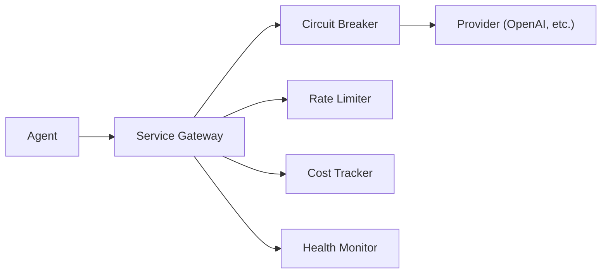
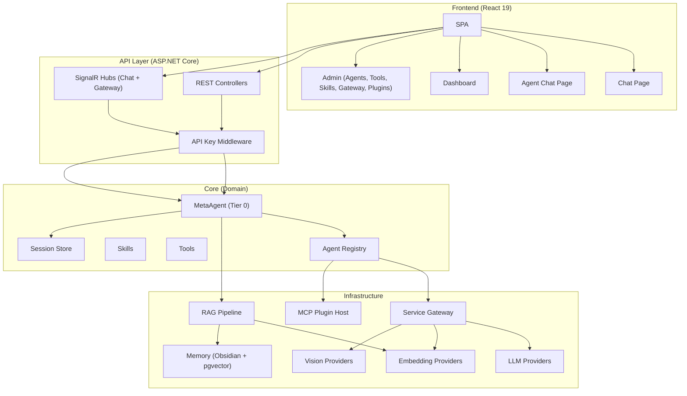

# DSA — Documento de Solução de Arquitetura

## AgenticSystem — Plataforma Multi-Agent com IA Generativa

| Campo | Valor |
|-------|-------|
| **Projeto** | AgenticSystem |
| **Versão** | 1.0 |
| **Data** | Maio/2026 |
| **Squad** | Agentic Platform |
| **Status** | Em desenvolvimento |

---

## 1. Objetivo

Plataforma de orquestração multi-agent com IA generativa que analisa contexto de solicitações, roteia para agentes especializados e executa tarefas com memória persistente, RAG e integrações externas — tudo controlado por um Service Gateway com proteção de custo, resiliência e observabilidade.

---

## 2. Escopo

### Incluso

- Orquestração de agentes hierárquicos (Tier 0–3) com roteamento inteligente
- Multi-provider LLM (OpenAI, Gemini, Claude, Ollama) com failover automático
- Pipeline RAG: ingestão de documentos, chunking, embeddings, retrieval + re-ranking
- Memória dual: Obsidian Vault (human-readable) + PostgreSQL/pgvector (semantic search)
- Service Gateway: Circuit Breaker, Rate Limiter, Cost Tracker, Health Monitor
- Frontend SPA: React 19 + SignalR real-time + gestão de agents/tools/skills
- MCP Plugins: carregamento dinâmico de ferramentas via Model Context Protocol
- Chat dedicado: roteamento direto a agents específicos

### Fora de Escopo

- Deploy em produção multi-tenant (escopo futuro)
- Integrações financeiras/pagamento
- Módulo de Voice Assistant em produção (experimental)

---

## 3. Decisões Arquiteturais

### 3.1 Estilo Arquitetural

**Clean Architecture** com separação em 3 camadas:

```
┌─────────────────────────────────────────────────────┐
│  AgenticSystem.Api (ASP.NET Core)                   │
│  Controllers · Hubs · Middleware · Auth             │
├─────────────────────────────────────────────────────┤
│  AgenticSystem.Core (Domain)                        │
│  Interfaces · Models · Services · Agents · Skills   │
├─────────────────────────────────────────────────────┤
│  AgenticSystem.Infrastructure (External)            │
│  LLM · Embeddings · Vision · Gateway · Persistence │
└─────────────────────────────────────────────────────┘
```

**Justificativa**: Inversão de dependência — Core não conhece Infrastructure. Facilita testes unitários e substituição de providers.

### 3.2 Hierarquia de Agentes

| Tier | Função | Exemplo | Regra |
|:----:|--------|---------|-------|
| 0 | Chief (orquestra, nunca executa) | MetaAgent | Analisa contexto → roteia |
| 1 | Master (executa tarefas atômicas) | PersonalAgent, WorkAgent | Sem delegação descendente |
| 2 | Specialist (domínio profundo) | CreativeAgent, AnalysisAgent | Pode usar Tools |
| 3 | Support (serviços auxiliares) | NotificationAgent, APIAgent | Chamado sob demanda |

**Regra fundamental**: Complexidade flui para baixo. Agents de tier inferior nunca chamam tiers superiores — evita ciclos e simplifica debugging.

### 3.3 Maturity Levels (ML1–ML21)

Sistema evolui em camadas incrementais sem quebrar capabilities anteriores:

| ML | Capability | Descrição |
|----|-----------|-----------|
| ML1 | Chunk Lifecycle | Aging/decay/promoção de chunks de memória |
| ML2 | Context Budget | Controle de tokens por contexto (custo previsível) |
| ML3 | Task Planning | Decomposição de tarefas complexas |
| ML4 | Reflection | Agents aprendem com erros |
| ML5 | Document Pipeline | Ingestão, parsing, chunking híbrido |
| ML6 | RAG + Re-Ranking | Retrieval semântico com re-rankeamento heurístico |
| ML7 | Multi-Provider LLM | Failover entre OpenAI/Gemini/Claude/Ollama |
| ML8 | External Service Gateway | Circuit Breaker + Rate Limiter + Cost Tracker |
| ML9 | Context Compression | Remove redundância antes do retrieval |
| ML10+ | Vision, MCP, Voice, etc. | Capabilities avançadas |

### 3.4 Service Gateway

Todo acesso a serviço externo passa pelo gateway unificado:



| Componente | Configuração Default |
|-----------|---------------------|
| Circuit Breaker | 5 falhas / 1min → break 30s |
| Rate Limiter | 60 req/min, 1000 req/h, 100k tokens/dia |
| Cost Tracker | Budget diário $10, alerta em 80% |
| Health Monitor | Check a cada 30s, failover em 3 falhas |

---

## 4. Stack Tecnológica

### Backend

| Componente | Tecnologia | Versão |
|-----------|-----------|--------|
| Runtime | .NET | 8.0 |
| Web Framework | ASP.NET Core | 8.x |
| Real-time | SignalR | 8.x |
| LLM Abstraction | Microsoft.Extensions.AI (IChatClient) | — |
| ORM/Data | Npgsql + pgvector | — |
| Testes | xUnit + Moq + FluentAssertions | — |
| Auth | API Key (middleware) | — |

### Frontend

| Componente | Tecnologia | Versão |
|-----------|-----------|--------|
| Framework | React | 19.x |
| Build | Vite | 8.x |
| Linguagem | TypeScript | 6.x |
| Estilo | TailwindCSS v4 | 4.x |
| Real-time | @microsoft/signalr | 10.x |
| Roteamento | react-router-dom | 7.x |
| Ícones | Lucide React | 1.x |

### Infraestrutura

| Componente | Tecnologia |
|-----------|-----------|
| Database | PostgreSQL + pgvector |
| Memory | Obsidian Vault (file-based) |
| Container | Docker (Dockerfile multi-stage) |
| Embeddings | OpenAI text-embedding-3-small / Google / Ollama / ONNX |
| LLM Providers | OpenAI GPT-4o, Google Gemini 1.5 Pro, Anthropic Claude, Ollama |

---

## 5. Diagrama de Componentes



---

## 6. Fluxos Principais

### 6.1 Chat com Roteamento Automático

```
1. User envia mensagem (SignalR ou REST)
2. ChatHub/ChatController → MetaAgent.ProcessAsync()
3. MetaAgent executa ContextAnalysis (classifica intenção)
4. MetaAgent seleciona Agent por capability matching
5. Agent selecionado processa com LLM via Gateway
6. Gateway aplica: Rate Limit → Circuit Breaker → Cost Track
7. Resposta retorna via SignalR (ReceiveMessage) ou HTTP 200
```

### 6.2 Chat Dedicado (sem roteamento)

```
1. User navega para /chat/{agentName}
2. Frontend envia mensagem com targetAgent = agentName
3. ChatHub → MetaAgent.ProcessDirectRequestAsync()
4. MetaAgent faz lookup direto no AgentRegistry (sem ContextAnalysis)
5. Agent processa diretamente
6. Resposta retorna ao chat dedicado
```

### 6.3 RAG Pipeline

```
1. Documento ingerido → Parser (Markdown/HTML/PlainText)
2. Chunking híbrido (semântico + fixo)
3. Embedding gerado via provider configurado
4. Armazenamento em pgvector
5. Na query: embedding da pergunta → similarity search
6. Re-ranking heurístico → Context Budget → Injeção no prompt
```

---

## 7. Segurança

| Aspecto | Implementação |
|---------|--------------|
| Autenticação | API Key via middleware (`X-Api-Key` header) |
| Secrets | Variáveis de ambiente ou appsettings.json (nunca em código) |
| HTTPS | Obrigatório em todos os endpoints |
| Rate Limiting | Por provider e por IP (Service Gateway) |
| Cost Control | Budget diário com alerta e bloqueio |
| Input Validation | FluentValidation em requests |
| CORS | Configurado para frontend origin |
| Análise Estática | Checkmarx (SAST) no pipeline CI |
| Scan de Vulnerabilidades | Qualys |

---

## 8. Observabilidade

| Pilar | Ferramenta | Implementação |
|-------|-----------|---------------|
| Logs | ELK (via FluentD) | Structured logging com Serilog |
| Métricas | Grafana + Dynatrace | Cost per agent, latency, token usage |
| Traces | Dynatrace APM | Distributed tracing por request |
| Dashboards | Grafana | Health, costs, throughput, circuit state |
| Alertas | Dynatrace | SLA/SLO: latency P95, error rate, budget |
| Real-time | SignalR (GatewayHub) | Status changes, cost alerts, circuit events |

### Health Check Endpoint

```
GET /health → 200 OK / 503 Unhealthy
```

Verifica: DB connectivity, LLM providers reachable, memory accessible.

---

## 9. Deployment

### Desenvolvimento Local

```bash
dotnet run --project src/AgenticSystem.Api    # Backend em https://localhost:5001
cd frontend && npm run dev                      # Frontend em http://localhost:5173
```

### Containers

```dockerfile
# Multi-stage build
FROM mcr.microsoft.com/dotnet/sdk:8.0 AS build
# ... build steps ...
FROM mcr.microsoft.com/dotnet/aspnet:8.0 AS runtime
```

### Ambientes

| Ambiente | Infraestrutura | LLM Provider |
|----------|---------------|-------------|
| Development | Docker local, PostgreSQL local | Ollama (local) |
| Homolog | Kubernetes, PostgreSQL managed | OpenAI (budget reduzido) |
| Production | Kubernetes HA, PostgreSQL + pgvector | OpenAI + Gemini (failover) |

### CI/CD

| Etapa | Ferramenta |
|-------|-----------|
| Build + Test | GitHub Actions (self-hosted: convair-actions) |
| SAST | Checkmarx |
| Quality Gate | SonarQube |
| Deploy | Merge na branch principal → pipeline automático |
| Canary | Spinnaker (opcional) |

---

## 10. Escalabilidade e Resiliência

| Aspecto | Estratégia |
|---------|-----------|
| Horizontal scaling | Stateless API — múltiplas réplicas atrás de load balancer |
| Session store | PostgreSQL (produção) ou InMemory (dev/test) |
| LLM failover | Multi-provider com prioridade e auto-failover |
| Circuit Breaker | Proteção contra cascading failures |
| Rate Limiting | Previne throttling upstream |
| Cost control | Budget diário impede gastos descontrolados |
| Health monitoring | Detecção proativa de degradação |

---

## 11. Testes

| Tipo | Quantidade | Ferramenta | Localização |
|------|:----------:|-----------|-------------|
| Unitários + Integração | 450 | xUnit | `tests/AgenticSystem.Tests/` |
| BDD (cenários) | 17 + 6 features | Gherkin | `docs/bdd/` |
| API E2E | 14 | Cypress | `frontend/cypress/e2e/` |
| Performance | 1 script | K6 | `frontend/k6/` |

---

## 12. Riscos e Mitigações

| Risco | Impacto | Mitigação |
|-------|---------|-----------|
| Custo LLM descontrolado | Alto | Cost Tracker com budget diário + alertas |
| Provider instável (OpenAI/Gemini) | Médio | Multi-provider failover + Circuit Breaker |
| Latência RAG em alto volume | Médio | Context Budget + caching de embeddings |
| Secrets expostos | Crítico | Env vars + Checkmarx SAST + secrets-scanner |
| Perda de contexto (memória) | Médio | Dual store: Obsidian (backup legível) + pgvector |

---

## 13. Próximos Passos

- [ ] Deploy em ambiente de homologação (Kubernetes)
- [ ] Integração com Dynatrace APM
- [ ] Testes de carga com K6 (validar Service Gateway sob stress)
- [ ] Feature flags via Consul para ML-levels
- [ ] PostgreSQL managed (RDS/Cloud SQL)
- [ ] Migração de InMemorySessionStore → PostgresSessionStore em produção

---

## Aprovações

| Papel | Nome | Data |
|-------|------|------|
| Arquiteto | | |
| Tech Lead | | |
| SRE | | |
| Segurança | | |
