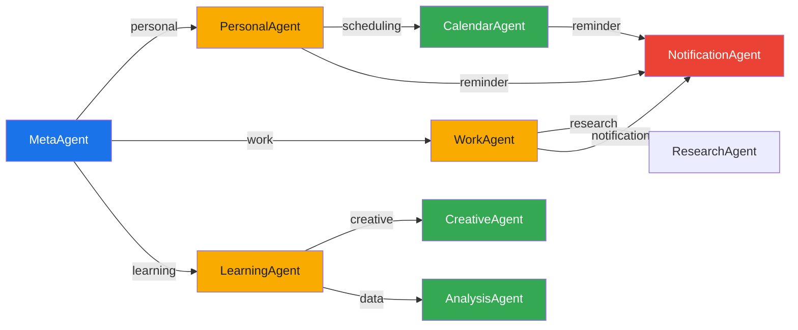

# Agent Registry — Referência

> Schema: [`agent-registry.schema.json`](agent-registry.schema.json) | Dados: [`agent-registry.json`](agent-registry.json)

## Estrutura do Registry

Cada agent é registrado com os seguintes campos:

| Campo | Tipo | Obrigatório | Descrição |
|-------|------|:-----------:|-----------|
| `id` | string | ✅ | Identificador kebab-case único |
| `name` | string | ✅ | Nome de exibição (PascalCase) |
| `tier` | object | ✅ | `{level: 0-3, label: Chief\|Master\|Specialist\|Support}` |
| `domain` | string | ✅ | Domínio funcional (orchestration, creative, analysis...) |
| `description` | string | | Descrição curta (max 500 chars) |
| `llmProfile` | object | ✅ | Modelo preferido + parâmetros por task type |
| `skills` | string[] | | Skills (conhecimento passivo) que o agent possui |
| `tools` | string[] | | Tools (capabilities ativas) que o agent pode invocar |
| `handoffs` | object[] | | Regras de delegação para outros agents |
| `qualityGates` | object | | Validações pré/pós execução |
| `routingHints` | object | | Keywords e patterns para o ContextAnalyzer |
| `isEnabled` | boolean | | Toggle de ativação (default: true) |

## Agents Registrados

| ID | Nome | Tier | Domínio | Modelo | Temp | Skills | Tools |
|----|------|------|---------|--------|:----:|:------:|:-----:|
| `meta-agent` | MetaAgent | 0 Chief | orchestration | gpt-4o | 0.2 | 3 | 3 |
| `personal-agent` | PersonalAgent | 1 Master | personal | gpt-4o | 0.4 | 2 | 3 |
| `work-agent` | WorkAgent | 1 Master | work | gpt-4o | 0.3 | 3 | 4 |
| `learning-agent` | LearningAgent | 1 Master | learning | gpt-4o | 0.6 | 3 | 3 |
| `creative-agent` | CreativeAgent | 2 Specialist | creative | gpt-4o | 0.9 | 3 | 2 |
| `analysis-agent` | AnalysisAgent | 2 Specialist | analysis | gpt-4o | 0.1 | 3 | 3 |
| `calendar-agent` | CalendarAgent | 2 Specialist | scheduling | gpt-4o | 0.0 | 2 | 1 |
| `notification-agent` | NotificationAgent | 3 Support | notifications | gpt-4o-mini | 0.2 | 1 | 2 |
| `api-agent` | APIAgent | 3 Support | api-integration | gpt-4o-mini | 0.3 | 2 | 2 |

### Dynamic Agents (ML11)

Além dos agents fixos acima, o sistema suporta criação dinâmica de agents via linguagem natural:

```bash
# "Crie um agente especialista em finanças"
# → DynamicAgentService detecta intent → Gera spec via LLM → Registra no factory
```

Agents dinâmicos herdam o mesmo contrato (`IAgent`) e são registrados em runtime no `HierarchicalAgentFactory`. Use `IDynamicAgentService.GetDynamicAgentsAsync()` para listar e `RemoveAgentAsync()` para remover.

### Delegation Strategies (ML12)

O orquestrador permite delegação mid-conversation entre agents por tool bindings e contexto de sessão compartilhado:

| Strategy | Comportamento |
|----------|--------------|
| `None` | Sem delegação — agent atual é suficiente |
| `SingleDelegate` | Delega para 1 agent e retorna resultado |
| `FanOut` | Delega para N agents em paralelo, combina resultados |
| `Chain` | Delega em sequência — output de um é input do próximo |

## Tier System

```
Tier 0 — Chief      │ MetaAgent — coordena, roteia, valida
Tier 1 — Master     │ Personal, Work, Learning — domínios de alto nível
Tier 2 — Specialist │ Calendar, Creative, Analysis — tarefas especializadas
Tier 3 — Support    │ Notification, API — operações utilitárias
```

**Regras de routing:**
- Tier 0 recebe todo input e decide para onde encaminhar
- Tier 0 → Tier 1 (sempre) — primeiro nível de delegação
- Tier 1 → Tier 2 (quando necessário) — especialização
- Tier 2 → Tier 3 (utilitário) — suporte a operações
- Retorno ao chamador preserva contexto da subtarefa na mesma sessão

## LLM Profile

Cada agent tem parâmetros otimizados para sua função:

```json
{
  "preferredModel": "gpt-4o",
  "fallbackModel": "gemini-1.5-pro",
  "defaultParameters": {
    "temperature": 0.2,
    "maxTokens": 800
  },
  "taskParameters": {
    "context-analysis": { "temperature": 0.1 },
    "agent-routing": { "temperature": 0.0 }
  }
}
```

**Filosofia de temperatura:**

| Faixa | Uso | Agents |
|-------|-----|--------|
| 0.0 – 0.2 | Determinístico, precisão máxima | MetaAgent, CalendarAgent, AnalysisAgent |
| 0.3 – 0.5 | Balanceado, tarefas estruturadas | WorkAgent, PersonalAgent |
| 0.6 – 0.8 | Exploratório, diversidade controlada | LearningAgent |
| 0.9 – 1.1 | Criativo, máxima variação | CreativeAgent |

## Delegation Paths



## Adicionando um Novo Agent

1. Adicionar entrada em `agent-registry.json`
2. Validar contra `agent-registry.schema.json`
3. Implementar classe C# herdando de `AgentBase`
4. Configurar LLM profile em `appsettings.json`
5. Registrar no DI container (`Program.cs`)
6. Adicionar testes unitários
