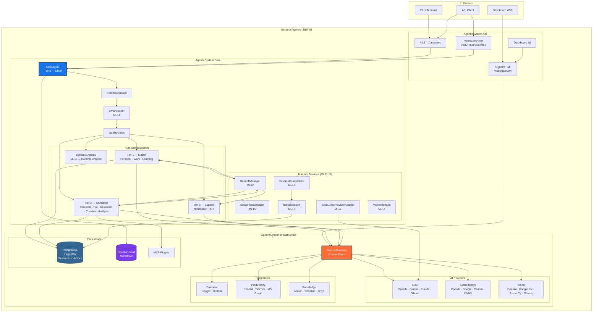
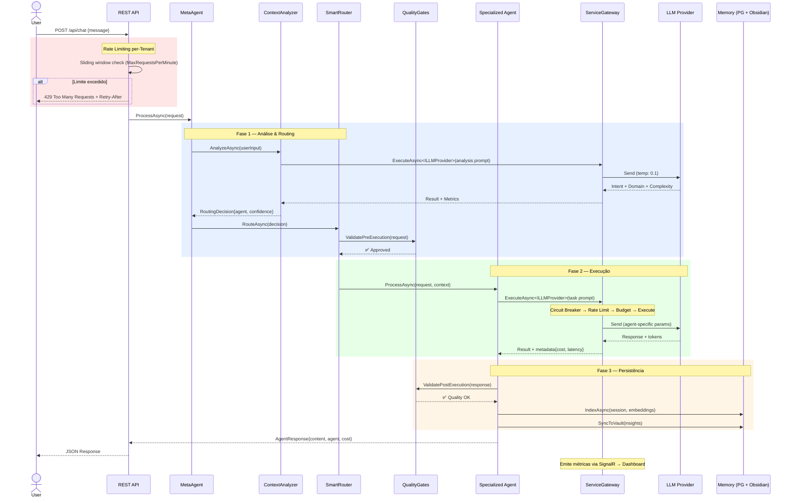
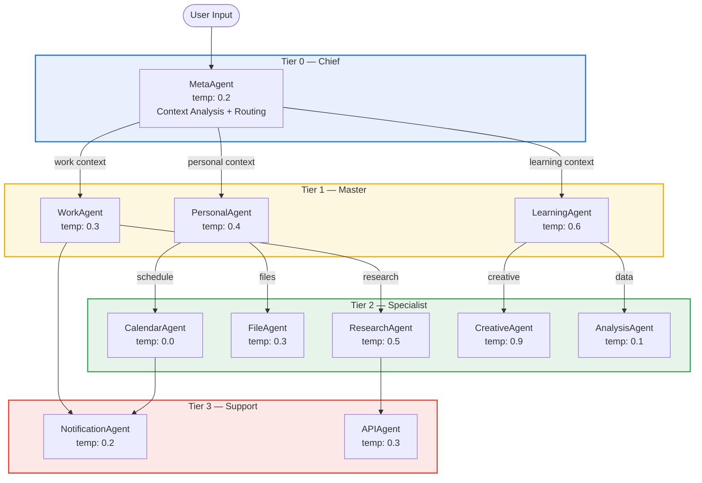
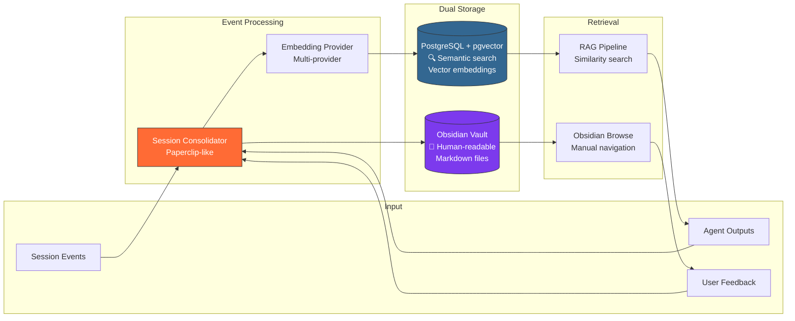
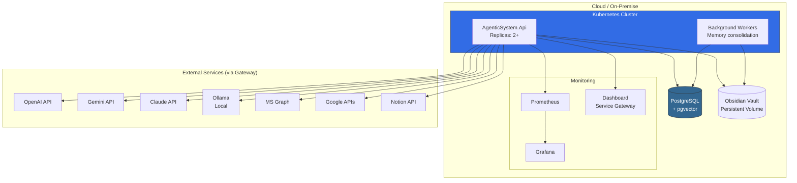
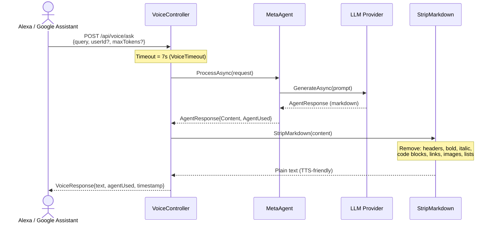
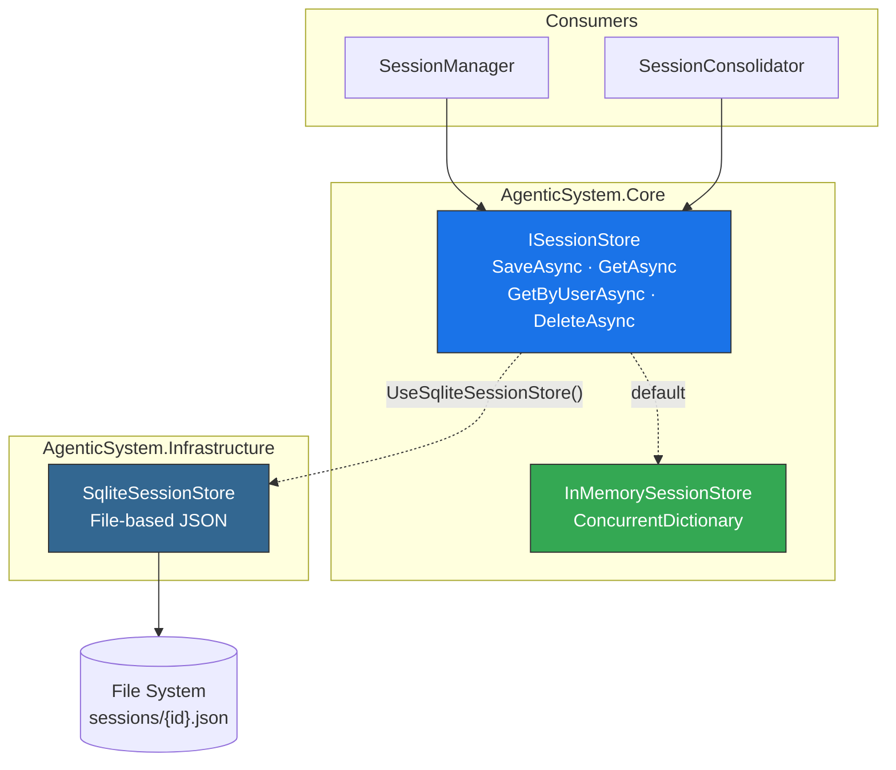
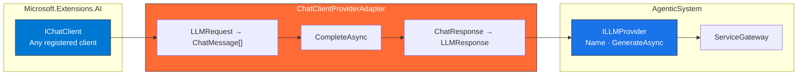

# Diagramas de Arquitetura — Sistema Agentic

## 1. Visão Geral (C4 — Container)

## 2. Pipeline de Request (Sequência)

## 3. External Service Gateway (Detalhe)

## 4. Tier System & Agent Routing

## 5. Memory Architecture

## 6. Deployment Architecture

## 7. Voice Pipeline (ML18)

## 8. Session Store Architecture (ML16)

## 9. M.E.AI Adapter (ML17)

