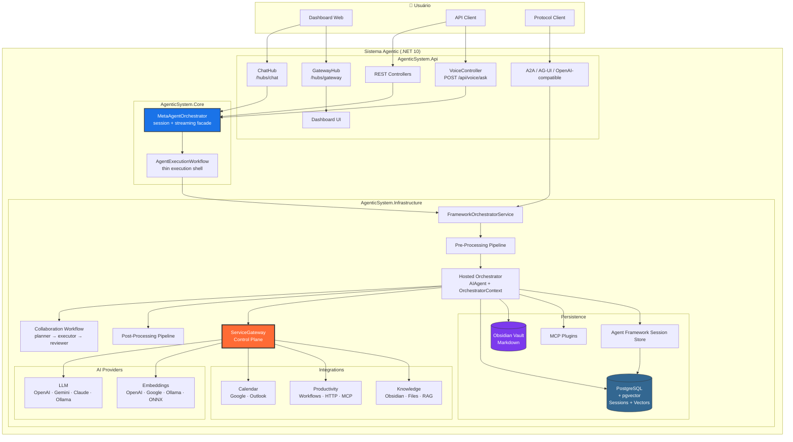
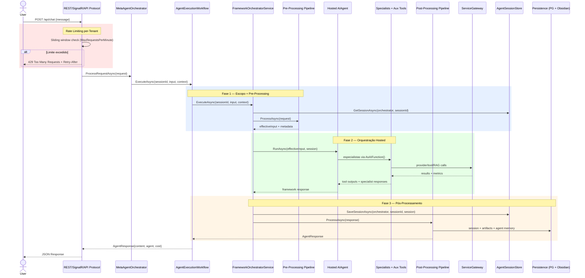
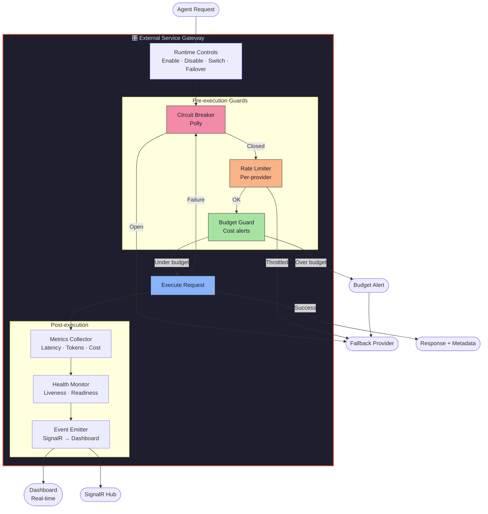
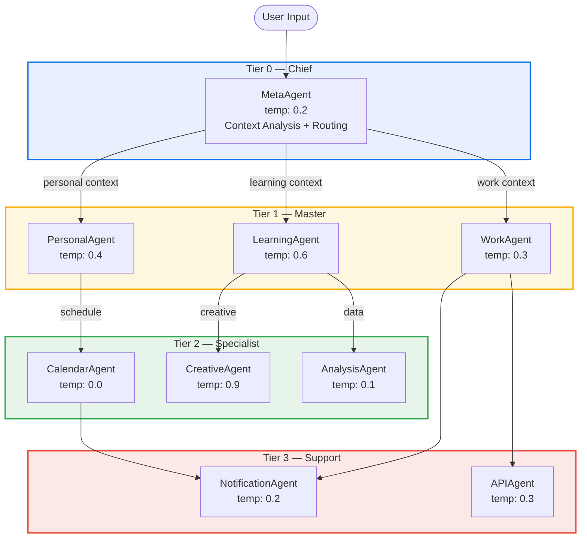
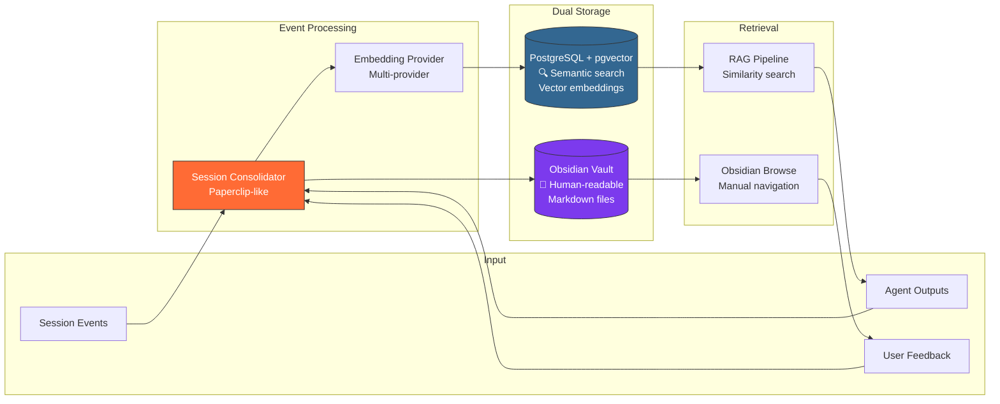
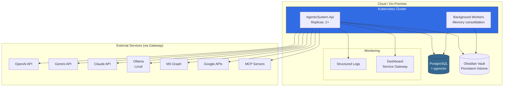
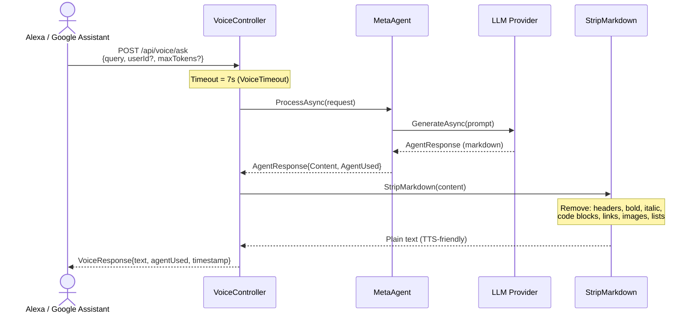
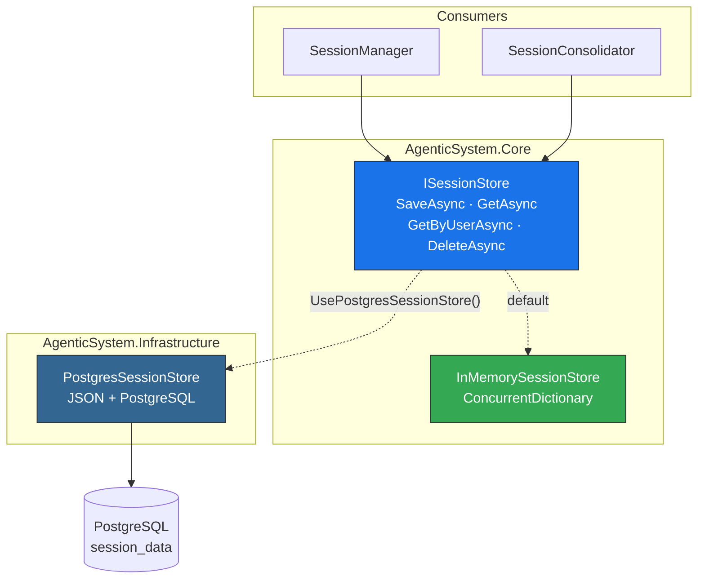
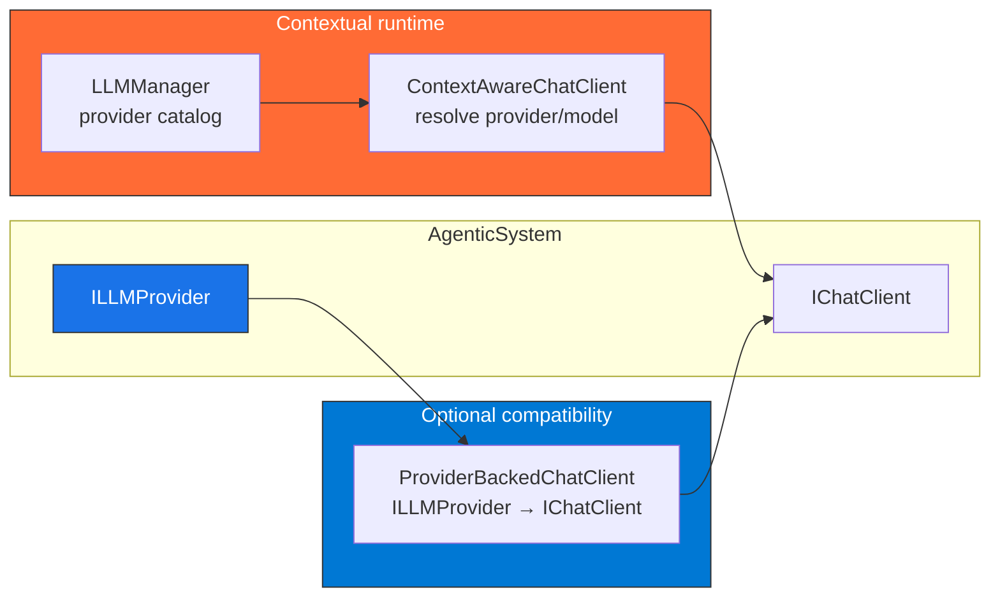

# Diagramas de Arquitetura — Sistema Agentic

> Diagramas alinhados ao runtime atual. Para a narrativa canônica da arquitetura backend, use [backend-architecture-explained.md](backend-architecture-explained.md).

## 1. Visão Geral (C4 — Container)

## 2. Pipeline de Request (Sequência)

## 3. External Service Gateway (Detalhe)

## 4. Tier System & Agent Routing

## 5. Memory Architecture

## 6. Deployment Architecture

## 7. Voice Pipeline (ML18)

## 8. Session Store Architecture (ML16)

## 9. IChatClient Compatibility (ML17)

