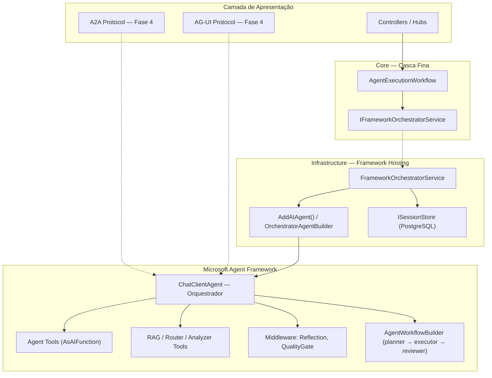

# Plano de Migração: Framework-First Orchestration

> **Criado:** 2026-05-05  
> **Status:** Fase 1 ✅ completa | Fase 2 🔲 pendente | Fase 3 🔲 pendente | Fase 4 🔲 pendente  
> **Escopo:** Inverter controle de orquestração do `AgentExecutionWorkflow` para o Microsoft Agent Framework  
> **Referências:** [TECHNICAL_ARCHITECTURE_GUIDE.md](../TECHNICAL_ARCHITECTURE_GUIDE.md), [AI_Capabilities_Gaps.md](../AI_Capabilities_Gaps.md), [design-philosophy.md](design-philosophy.md)

---

## Sumário

1. [Motivação e Objetivo](#1-motivação-e-objetivo)
2. [Estado Atual (AS-IS)](#2-estado-atual-as-is)
3. [Estado Alvo (TO-BE)](#3-estado-alvo-to-be)
4. [Estratégia de Migração](#4-estratégia-de-migração)
5. [Fase 1 — Centralizar Entrada no Framework](#5-fase-1--centralizar-entrada-no-framework)
6. [Fase 2 — Mover Cross-Cutting Concerns para o Framework](#6-fase-2--mover-cross-cutting-concerns-para-o-framework)
7. [Fase 3 — Remover Duplicidade Arquitetural](#7-fase-3--remover-duplicidade-arquitetural)
8. [Fase 4 — Protocol Hosting e Interoperabilidade](#8-fase-4--protocol-hosting-e-interoperabilidade)
9. [Grafo de Dependências](#9-grafo-de-dependências)
10. [Análise contra Documentação Oficial do MAF](#10-análise-contra-documentação-oficial-do-maf)
11. [Riscos e Mitigações](#11-riscos-e-mitigações)
12. [Critérios de Sucesso por Fase](#12-critérios-de-sucesso-por-fase)
13. [Decisões Globais](#13-decisões-globais)
14. [Análise de Dead Code, Duplicidades e Fluxos Não Utilizados](#14-análise-de-dead-code-duplicidades-e-fluxos-não-utilizados)

---

## 1. Motivação e Objetivo

### Problema

O `AgentExecutionWorkflow` é hoje o **cérebro** do sistema: ele decide qual agente chamar, quando buscar RAG, se faz handoff, se chama reflection. O Microsoft Agent Framework funciona como **subordinado** — apenas executa o agente já selecionado pelo workflow.

Isso gera:

- **Duplicidade de decisão** — o workflow decide routing, mas o framework também poderia decidir via tool bindings
- **Rigidez de pipeline** — 11 steps sequenciais hardcoded, difícil de reordenar ou condicionar
- **Subutilização do framework** — capabilities como agent-as-tool, sessões nativas e middleware não são usadas para orquestração
- **Complexidade crescente** — cada novo cross-cutting concern (reflection, correction, RAG, approval) adiciona mais dependências ao workflow

### Objetivo

Inverter a direção de controle: o **framework orquestrador** decide *qual agente chamar*, *quando buscar contexto*, *se precisa de handoff*. O `AgentExecutionWorkflow` vira **casca fina** (escopo, sessão, persistência, feature flag de rollback).

### Princípios

1. **Migração incremental** — 3 fases, cada uma independente e com rollback
2. **Zero breaking change externo** — `IAgentExecutionWorkflow` mantém sua interface; controllers e hubs não mudam
3. **Feature flag por design** — se `IFrameworkOrchestratorService` não estiver registrado, o fluxo legado continua funcionando
4. **`ExecuteDirectAsync` preservado** — seleção manual de agente pelo frontend continua via escape hatch

---

## 2. Estado Atual (AS-IS)

### Fluxo de Execução

```
User Input
    │
    ▼
MetaAgentOrchestrator (fachada de sessão/streaming)
    │
    ▼
AgentExecutionWorkflow.ExecuteAsync (cérebro)
    │
    ├─ 1. ContextAnalyzer.AnalyzeAsync()
    ├─ 2. QualityGateService.ValidateRequestAsync()
    ├─ 3. ToolAvailabilityGuard.CheckAsync()
    ├─ 4. DynamicAgentService.IsAgentCreationRequestAsync()
    ├─ 5. SmartRouter.RouteAsync()
    ├─ 6. AgentCollaborationWorkflow.ShouldRunAsync()
    ├─ 7. AgentFactory.GetOrCreateAgentAsync() + RAG + Correction + Handoff
    ├─ 8. QualityGateService + ReflectionEngine
    ├─ 9. ConfidenceScoreCalculator.Calculate()
    ├─ 10. FinalResponseApprovalService.EvaluateAsync()
    └─ 11. Persist Artifacts + Metrics
    │
    ▼
AgentFrameworkAdapter.ExecuteAsync (subordinado)
    │
    ▼
ChatClientAgent.RunAsync (framework)
```

### Responsabilidades do Workflow (19+ dependências)

| Responsabilidade | Ideal para workflow? |
|---|:---:|
| Escopo de execução (BeginScope, LLM context) | ✅ |
| Persistência de resultado | ✅ |
| Streaming coordination | ✅ |
| Seleção de agente | ❌ → framework |
| RAG enrichment | ❌ → framework tool |
| Handoff decision | ❌ → framework tool binding |
| Reflection | ❌ → framework pós-processamento |
| Correction loop | ❌ → framework tool |
| Smart routing | ❌ → framework tool |

---

## 3. Estado Alvo (TO-BE)

### Fluxo de Execução (Evolução em 4 estágios)

**Estágio atual (pós-Fase 1):** construção manual via `OrchestratorAgentBuilder`

```
User Input
    │
    ▼
MetaAgentOrchestrator (inalterado)
    │
    ▼
AgentExecutionWorkflow.ExecuteAsync (casca fina)
    ├─ BeginScope + LLM context
    ├─ Delega a IFrameworkOrchestratorService.ExecuteAsync()
    └─ Persist resultado
    │
    ▼
FrameworkOrchestratorService
    │
    ▼
OrchestratorAgentBuilder → ChatClientAgent (orquestrador)
    │
    ├─ System prompt: lista de especialistas + domínios + critérios
    ├─ Tool bindings: cada agente exposto via AsAIFunction()
    ├─ Tools auxiliares: RAG, SmartRouter, ContextAnalyzer
    ├─ Middleware: .UseReflection(), .UseQualityGates() (Fase 2+)
    ├─ ChatHistoryProvider: RAG injetado no histórico (Fase 2+)
    │
    ▼
ChatClientAgent.RunAsync() (framework decide)
    ├─ Chama tool do especialista quando apropriado
    ├─ Chama RAG quando precisa de contexto
    ├─ Chama routing quando ambíguo
    │
    ▼
Resposta + identificação do agente chamado
    │
    ▼
FrameworkOrchestratorService
    ├─ Publica AgentSelected event
    ├─ Persiste sessão do framework
    └─ Sincroniza resposta
```

**Estado alvo (pós-Fase 3):** hosting nativo via `AddAIAgent()` + `IHostedAgentBuilder`

```
User Input
    │
    ▼
MetaAgentOrchestrator (inalterado)
    │
    ▼
AgentExecutionWorkflow.ExecuteAsync (casca fina)
    ├─ BeginScope + LLM context
    ├─ Delega a IFrameworkOrchestratorService.ExecuteAsync()
    └─ Persist resultado
    │
    ▼
FrameworkOrchestratorService
    │
    ▼
AddAIAgent("orchestrator") → IHostedAgentBuilder
    ├─ .WithAITool(specialist_1)     ← AsAIFunction()
    ├─ .WithAITool(specialist_N)     ← AsAIFunction()
    ├─ .WithAITool(rag_enricher)     ← AIFunction ou ChatHistoryProvider
    ├─ .WithSessionStore(postgres)   ← ISessionStore nativo (elimina bridge)
    ├─ Middleware pipeline:          ← .UseReflection().UseQualityGates()
    │
    ▼
AddWorkflow("collaboration") → AgentWorkflowBuilder
    ├─ BuildSequential([planner, executor, reviewer])  ← substitui AgentCollaborationWorkflow
    └─ .AddAsAIAgent()               ← workflow exposto como agent tool do orquestrador
    │
    ▼
Protocol Hosting (Fase 4):
    ├─ AddA2AServer() / MapA2AServer()
    └─ AG-UI endpoints
```

### Diagrama de Componentes (TO-BE)



---

## 4. Estratégia de Migração

### Visão Geral das Fases

| Fase | Objetivo | Impacto no Workflow | Rollback |
|:---:|---|---|---|
| **1** | Centralizar entrada no framework | Delega para orquestrador; mantém fallback legado completo | `IFrameworkOrchestratorService == null` → fluxo legado |
| **2** | Mover cross-cutting concerns + hosting nativo | Remove RAG manual, handoff manual; migra para `AddAIAgent()` | Remover tools auxiliares do builder → volta a Fase 1 |
| **3** | Eliminar duplicidade | Simplifica Adapter, unifica sessão via `ISessionStore`, middleware nativo | Restaurar steps removidos do workflow |
| **4** | Protocol hosting e interoperabilidade | Expor agentes via A2A, AG-UI, OpenAI-compatible | Remover endpoints de protocolo |

### Premissas

- .NET 8 com Microsoft.Agents.AI 1.3.0+
- `IChatClient` configurado (registro condicional)
- Agentes já decorados com `AgentFrameworkAdapter` via `AgentFrameworkAgentFactory`
- `AgentSessionBridge` funcional para persistência de sessões do framework
- `CreateToolBindingAsync` já existe em `AgentFrameworkFactory`
- **`AddAIAgent()` + `IHostedAgentBuilder`** disponíveis no MAF 1.3.0+ para hosting nativo (DI, session store, tools, middleware resolvidos automaticamente)
- **`AgentWorkflowBuilder`** disponível para orquestração multi-agent (`.BuildSequential`, `.BuildConcurrent`)
- **`ChatHistoryProvider`** disponível como first-class concept para injeção de contexto no histórico
- **`ISessionStore`** nativo com `.WithInMemorySessionStore()` e suporte a stores customizados (PostgreSQL)

---

## 5. Fase 1 — Centralizar Entrada no Framework

> **Status: ✅ COMPLETA — compilando com 0 erros, 0 warnings**

### Objetivo

Toda execução passa por um agente orquestrador `ChatClientAgent` do framework. O workflow deixa de decidir "qual agente" e "qual contexto".

### Arquivos Criados

| Arquivo | Descrição |
|---|---|
| [`Core/Interfaces/IFrameworkOrchestratorService.cs`](../../src/AgenticSystem.Core/Interfaces/IFrameworkOrchestratorService.cs) | Interface com `ExecuteAsync(sessionId, input, context, ct)` → `AgentResponse` |
| [`Infrastructure/AgentFramework/OrchestratorAgentBuilder.cs`](../../src/AgenticSystem.Infrastructure/AgentFramework/OrchestratorAgentBuilder.cs) | Constrói e cacheia o `ChatClientAgent` orquestrador com tool bindings dos especialistas |
| [`Infrastructure/AgentFramework/FrameworkOrchestratorService.cs`](../../src/AgenticSystem.Infrastructure/AgentFramework/FrameworkOrchestratorService.cs) | Implementação: monta orquestrador → sessão → RunAsync → extrai conteúdo → identifica agente |

### Arquivos Modificados

| Arquivo | Mudança |
|---|---|
| [`Infrastructure/AgentFramework/AgentFrameworkFactory.cs`](../../src/AgenticSystem.Infrastructure/AgentFramework/AgentFrameworkFactory.cs) | Expôs `ChatClient`, `LoggerFactory`, `ServiceProvider` como propriedades `internal` |
| [`Core/Services/AgentExecutionWorkflow.cs`](../../src/AgenticSystem.Core/Services/AgentExecutionWorkflow.cs) | Adicionou `IFrameworkOrchestratorService?` opcional; `ExecuteAsync` delega quando disponível |
| [`Infrastructure/Extensions/ServiceCollectionExtensions.cs`](../../src/AgenticSystem.Infrastructure/Extensions/ServiceCollectionExtensions.cs) | Registra `OrchestratorAgentBuilder` + `IFrameworkOrchestratorService` no bloco `if (hasChatClient)` |

### Steps Detalhados

#### Step 1 — Interface `IFrameworkOrchestratorService`

```csharp
namespace AgenticSystem.Core.Interfaces;

public interface IFrameworkOrchestratorService
{
    Task<AgentResponse> ExecuteAsync(
        string sessionId, string input, UserContext context, CancellationToken ct);
}
```

- Fica no Core para que o workflow (também no Core) possa referenciar
- Retorna `AgentResponse` — mesma assinatura que `IAgent.ExecuteAsync`

#### Step 2 — `OrchestratorAgentBuilder`

Responsável por:

1. **Listar agentes ativos** via `IAgentFactory.GetAllAgentsAsync()`
2. **Criar tool bindings** para cada especialista via `AgentFrameworkFactory.CreateToolBindingAsync(agent, sessionId, ct)`
3. **Gerar system prompt dinâmico** descrevendo especialistas (nome, domínio, tier, descrição, tools)
4. **Montar `ChatClientAgent`** com `AsBuilder().UseLogging().UseOpenTelemetry().Build()`
5. **Cachear** o orquestrador (chave = hash dos nomes de agentes ativos), com `InvalidateCache()`

```
OrchestratorAgentBuilder
    ├─ GetOrCreateOrchestratorAsync(sessionId, ct)
    │   ├─ _agentFactory.GetAllAgentsAsync() → AgentInfo[]
    │   ├─ Para cada agente:
    │   │   ├─ AnalysisResult mock → _agentFactory.GetOrCreateAgentAsync(analysis) → IAgent
    │   │   ├─ Unwrap AgentFrameworkAdapter → IAgent inner
    │   │   └─ _frameworkFactory.CreateToolBindingAsync(inner, sessionId, ct) → AgentToolBinding
    │   ├─ Gera system prompt com lista de especialistas
    │   └─ Cria ChatClientAgent com tools = bindings + AIFunctions
    └─ InvalidateCache()
```

#### Step 3 — `FrameworkOrchestratorService`

Fluxo de execução:

```
ExecuteAsync(sessionId, input, context, ct)
    │
    ├─ builder.GetOrCreateOrchestratorAsync(sessionId, ct) → OrchestratorContext
    ├─ bridge.GetOrCreateFrameworkSessionAsync(sessionId, "orchestrator") → AgentSession
    ├─ coordinator.PublishRuntimeEventAsync("AgentSelected", ...)
    ├─ orchestrator.RunAsync(input, session)  ← 2 args, SEM CancellationToken
    ├─ ExtractContent(response) → string
    ├─ IdentifyCalledAgent(response, bindings) → agentName?
    ├─ bridge.PersistFrameworkSessionAsync(sessionId, "orchestrator", session)
    └─ bridge.SyncResponseAsync(sessionId, agentName, content)
```

**Pontos importantes:**
- `RunAsync` do MAF aceita apenas 2 argumentos: `(string input, AgentSession session)` — sem `CancellationToken`
- `ExtractContent` busca `TextContent` em mensagens `Assistant`; fallback para `.Text`
- `IdentifyCalledAgent` varre `FunctionCallContent` nas mensagens para mapear tool name → agent name via bindings

#### Step 4 — Reduzir `AgentExecutionWorkflow.ExecuteAsync`

```csharp
// Construtor: parâmetro opcional no final
public AgentExecutionWorkflow(
    ... 19 dependências existentes ...,
    IFrameworkOrchestratorService? frameworkOrchestrator = null)

// ExecuteAsync: delegação no início
public async Task<AgentResponse> ExecuteAsync(...)
{
    // Mantém: BeginScope, LLM context
    
    if (_frameworkOrchestrator is not null)
    {
        _logger.LogDebug("Delegating to Framework Orchestrator");
        return await _frameworkOrchestrator.ExecuteAsync(sessionId, input, context, ct);
    }
    
    // Fallback: fluxo legado completo (11 steps inalterados)
}
```

**`ExecuteDirectAsync` permanece intacto** — seleção manual de agente pelo frontend.

#### Step 5 — Registro DI

Em `ServiceCollectionExtensions.cs`, dentro de `if (hasChatClient)`:

```csharp
services.AddSingleton<OrchestratorAgentBuilder>();
services.AddSingleton<IFrameworkOrchestratorService, FrameworkOrchestratorService>();
```

Registros condicionais: se `IChatClient` não existir, `IFrameworkOrchestratorService` não é registrado → workflow usa fallback legado.

### Decisões Fase 1

| Decisão | Justificativa |
|---|---|
| Orquestrador é `ChatClientAgent` com system prompt de coordenação | Padrão supervisor-with-tools documentado no MAF |
| Especialistas expostos como `AIFunction` via `AsAIFunction()` | Base já existia em `CreateToolBindingAsync` |
| `IAgentExecutionWorkflow` mantém interface | Zero impacto em consumidores externos |
| Parâmetro opcional no construtor | Feature flag natural — sem `IFrameworkOrchestratorService`, usa legado |
| `ExecuteDirectAsync` continua bypassando orquestrador | Preserva seleção direta de agente pelo frontend |

### Débito Técnico Fase 1

> **Steps 2-3 usam construção manual do agente orquestrador.**
> O MAF oferece `AddAIAgent()` + `IHostedAgentBuilder` como modelo de hosting nativo que resolve DI, session store, tools e middleware automaticamente.
> A construção manual via `OrchestratorAgentBuilder` funciona e está comprovada, porém deve migrar para hosting nativo na **Fase 2** (Step 5b) para alinhar com a direção do framework.
>
> ```csharp
> // Fase 1 (atual — manual)
> var agent = new ChatClientAgent(chatClient, "orchestrator", options)
>     .AsBuilder().UseLogging().UseOpenTelemetry().Build();
>
> // Fase 2+ (alvo — hosting nativo)
> builder.Services.AddAIAgent("orchestrator", agentBuilder => {
>     agentBuilder
>         .WithAITool(specialist1)
>         .WithAITool(specialist2)
>         .WithSessionStore(postgresStore);
> });
> ```

---

## 6. Fase 2 — Mover Cross-Cutting Concerns para o Framework

> **Status: 🔲 Pendente**

### Objetivo

RAG vira tool do framework. Handoff vira delegação nativa via tool binding. O workflow não monta mais `enrichedInput` nem decide handoff manualmente.

### Steps

#### Step 5b — Migrar construção manual para `AddAIAgent()` hosting nativo

**Objetivo:** Substituir a construção manual em `OrchestratorAgentBuilder` pelo modelo de hosting nativo do MAF.

```csharp
// Em ServiceCollectionExtensions.cs (ou Program.cs)
builder.Services.AddAIAgent("orchestrator", agentBuilder => {
    agentBuilder
        .WithAITool(specialist1.AsAIFunction())
        .WithAITool(specialist2.AsAIFunction())
        .WithAITool(ragEnricher)
        .WithSessionStore(postgresSessionStore)
        .UseLogging()
        .UseOpenTelemetry()
        .UseReflection()        // ← middleware nativo
        .UseQualityGates();     // ← middleware nativo
});
```

**Benefícios:**
- DI, session store, tools e middleware resolvidos pelo framework
- `OrchestratorAgentBuilder` pode ser simplificado ou eliminado
- Preparação para Fase 3 (`ISessionStore` nativo) e Fase 4 (protocol hosting)

**Nota:** `AddAIAgent()` retorna `IHostedAgentBuilder`, que configura o agent dentro do hosting model do framework. Os agentes são resolvidos via DI e têm lifecycle gerenciado.

#### Step 6 — RAG via `ChatHistoryProvider` + AIFunction fallback *(paralelo com Step 7)*

**Arquivo:** `src/AgenticSystem.Infrastructure/AgentFramework/RAGChatHistoryProvider.cs`

O MAF oferece `ChatHistoryProvider` como conceito first-class para injetar contexto no chat history antes de cada request. Existem duas abordagens:

| Abordagem | Mecanismo | Quando usar |
|---|---|---|
| **`ChatHistoryProvider`** (recomendada) | Injeta contexto automaticamente a cada request | RAG reranqueado, contexto obrigatório em toda interação |
| **`AIFunction` tool** | LLM decide quando chamar | Contexto opcional, consulta sob demanda |

**Opção primária — `ChatHistoryProvider`:**

```csharp
public class RAGChatHistoryProvider : ChatHistoryProvider
{
    private readonly IRAGService _ragService;
    private readonly IContextBudgetManager _budgetManager;

    public override async Task<IEnumerable<ChatMessage>> GetHistoryAsync(
        AgentSession session, CancellationToken ct)
    {
        var lastUserMessage = session.Messages.LastOrDefault(m => m.Role == "user");
        if (lastUserMessage is null)
            return session.Messages;

        var context = await _ragService.RetrieveContextAsync(lastUserMessage.Text, ct);
        var trimmed = await _budgetManager.TrimContextToBudgetAsync(context, ct);

        // Injeta contexto RAG como mensagem system antes da mensagem do usuário
        var enrichedHistory = new List<ChatMessage>(session.Messages);
        enrichedHistory.Insert(enrichedHistory.Count - 1, new ChatMessage
        {
            Role = "system",
            Content = $"[Contexto Relevante]\n{trimmed}"
        });

        return enrichedHistory;
    }
}
```

**Registro:**
```csharp
agentBuilder.WithChatHistoryProvider<RAGChatHistoryProvider>();
```

**Opção secundária — AIFunction (mantida como fallback):**

```csharp
// RAGContextEnricher.cs — wrapper AIFunction
[AIFunction("retrieve_context", "Busca contexto relevante via RAG")]
public async Task<string> RetrieveContextAsync(string query, CancellationToken ct) { ... }
```

```
Antes: Workflow chama RAG → monta enrichedInput → passa ao agente
Depois (ChatHistoryProvider): RAG injetado automaticamente no histórico antes de cada RunAsync
Depois (AIFunction): Orquestrador chama tool "retrieve_context" → decide quando buscar
```

**Trade-off:**
- **Tool = LLM controla quando fetch** (não-determinístico, pode esquecer)
- **Provider = sempre injeta contexto** (determinístico, mais confiável para RAG reranqueado)
- **Recomendação: `ChatHistoryProvider` como primário**, AIFunction como complemento para buscas ad-hoc

#### Step 7 — Handoff como delegação via tool binding *(paralelo com Step 6)*

- O `HandoffManager` atual resolve agentes por `IAgentFactory` — essa resolução acontece automaticamente quando o orquestrador chama o tool binding do especialista
- Orquestrador recebe instructions:
  - Domínio do request fora do escopo → chamar tool do especialista
  - Múltiplos domínios → chamar múltiplos tools
- `IHandoffManager.EvaluateHandoffAsync` pode virar tool auxiliar `analyze_delegation_need` ou ser embutido nas instructions
- `IHandoffManager.RecordHandoffAsync` continua sendo chamado pelo `FrameworkOrchestratorService` para métricas

#### Step 8 — SmartRouter e ContextAnalyzer como tools do orquestrador

| Componente | Tool Name | Função |
|---|---|---|
| `ISmartRouter.RouteAsync` | `route_to_best_agent` | Retorna agente recomendado baseado em performance |
| `IContextAnalyzer.AnalyzeAsync` | `analyze_request` | Retorna domínio, intent, complexidade |

Duas abordagens possíveis:

- **Opção A (recomendada):** Expor como tools auxiliares que o orquestrador chama antes de decidir
- **Opção B (estado final):** Embutir nas instructions do orquestrador e deixar o LLM decidir com dados de performance

#### Step 9 — Remover montagem manual de `enrichedInput`

O `enrichedInput` hoje é montado em `AgentExecutionWorkflow.cs` (linhas ~144-153):

```
[Contexto Relevante]
{rag_context}

[Pergunta do Usuário]
{input}
```

Com RAG como tool do framework, o orquestrador decide quando buscar contexto. Remover:
- Concatenação de `[Contexto Relevante]` + `[Pergunta do Usuário]`
- Chamada direta a `RetrieveRAGContextAsync` no workflow

#### Step 10 — Registrar tools auxiliares no `OrchestratorAgentBuilder`

O builder passa a registrar:

```
OrchestratorAgentBuilder.GetOrCreateOrchestratorAsync()
    ├─ Tool bindings dos especialistas (via CreateToolBindingAsync) ← já existe
    ├─ RAGContextEnricher como AIFunction ← NOVO
    ├─ route_to_best_agent como AIFunction (wrapper SmartRouter) ← NOVO
    └─ analyze_request como AIFunction (wrapper ContextAnalyzer) ← NOVO
```

### Arquivos Impactados — Fase 2

| Arquivo | Ação |
|---|---|
| `Infrastructure/AgentFramework/RAGChatHistoryProvider.cs` | **Criar** — ChatHistoryProvider para RAG automático |
| `Infrastructure/AgentFramework/RAGContextEnricher.cs` | **Criar** — AIFunction wrapper do RAG (fallback/complemento) |
| `Infrastructure/AgentFramework/OrchestratorAgentBuilder.cs` | **Evoluir** — registrar tools auxiliares + ChatHistoryProvider; migrar para `AddAIAgent()` |
| `Core/Services/AgentExecutionWorkflow.cs` | **Remover** — `RetrieveRAGContextAsync`, `enrichedInput`, handoff manual |
| `Core/Services/HandoffManager.cs` | **Simplificar** — delegação agora é via framework |
| `Infrastructure/RAG/RAGService.cs` | **Manter** — chamado pelo `RAGChatHistoryProvider` e `RAGContextEnricher` |
| `Core/Services/SmartRouter.cs` | **Expor** como tool wrapper |
| `Core/Services/ContextAnalyzer.cs` | **Expor** como tool wrapper |
| `Infrastructure/Extensions/ServiceCollectionExtensions.cs` | **Evoluir** — registrar `AddAIAgent()` com hosting nativo |

### Decisões Fase 2

| Decisão | Justificativa |
|---|---|
| RAG como `ChatHistoryProvider` (primário) + AIFunction (complemento) | Provider = determinístico, sempre injeta contexto reranqueado. Tool = LLM decide quando buscar (não-determinístico, pode omitir). Provider mais confiável para RAG reranqueado |
| Migrar para `AddAIAgent()` hosting nativo | Resolve DI, session store, tools, middleware automaticamente; elimina construção manual |
| Handoff vira delegação natural do LLM | Tool bindings já representam os especialistas |
| SmartRouter e ContextAnalyzer como tools opcionais | Se não registrados, orquestrador decide sozinho |
| `RecordHandoffAsync` mantido | Necessário para métricas e rastreamento |

---

## 7. Fase 3 — Remover Duplicidade Arquitetural

> **Status: 🔲 Pendente**

### Objetivo

Eliminar caminhos paralelos. O framework é a autoridade de decisão. O `AgentExecutionWorkflow` contém apenas escopo e persistência.

### Steps

#### Step 11 — Simplificar `AgentFrameworkAdapter`

- Com o orquestrador no centro, `AgentFrameworkAdapter` perde o papel de wrapper de compatibilidade
- Especialistas são chamados diretamente como tool bindings — nunca como `IAgent.ExecuteAsync` pelo workflow
- Mantido apenas para `ExecuteDirectAsync` (chamada direta ao agente nomeado)
- Marcar como `[Obsolete]` os caminhos que não passam pelo orquestrador

#### Step 12 — Reflection e QualityGates via Middleware do Framework

O MAF oferece pipeline de middleware (`AsBuilder().Use*().Build()`) que já inclui extensões para reflection e quality gates. Em vez de chamar `ReflectionEngine` como pós-processamento manual no `FrameworkOrchestratorService`, utilizar middleware nativo:

```csharp
// Middleware nativo do MAF
var orchestrator = new ChatClientAgent(chatClient, "orchestrator", options)
    .AsBuilder()
    .UseLogging()
    .UseOpenTelemetry()
    .UseReflection()          // ← avalia qualidade da resposta
    .UseQualityGates()        // ← valida critérios mínimos antes de retornar
    .Build();

// Com AddAIAgent() (hosting nativo):
agentBuilder
    .UseReflection()
    .UseQualityGates(gates => {
        gates.MinConfidence = 0.7;
        gates.RequireSourceCitation = true;
    });
```

| Componente | Antes (workflow/service) | Depois (middleware) |
|---|---|---|
| `ReflectionEngine.ReflectAsync` | Chamado manualmente pós-resposta no `FrameworkOrchestratorService` | `.UseReflection()` no pipeline do agent |
| `CorrectionLoop.ApplyRulesToPromptAsync` | Altera `enrichedInput` no workflow | `.UseQualityGates()` no pipeline ou `ChatHistoryProvider` |
| `CorrectionLoop.AddRuleAsync` | Chamado quando reflection gera suggestion | Mantido como está |
| Quality gate check | Não existia | `.UseQualityGates()` valida resposta antes de retornar |

**Vantagem:** middleware intercepta a resposta de forma transparente, sem acoplamento no service. O `FrameworkOrchestratorService` fica mais limpo.

**CorrectionLoop como AIFunction (complemento):** `CorrectionLoop` pode ser exposta como `AIFunction` que o orquestrador chama para aplicar regras de correção antes de enviar ao especialista. Isso complementa (não substitui) o middleware.

#### Step 13 — Migrar `AgentCollaborationWorkflow` para `AgentWorkflowBuilder`

O fluxo planner-executor-reviewer hoje é custom. O MAF oferece `AgentWorkflowBuilder` com `BuildSequential` e `BuildConcurrent` como mecanismos nativos de orquestração multi-agent:

```csharp
// ANTES — Custom workflow
// AgentCollaborationWorkflow.cs
var plan = await _planner.PlanAsync(input);
foreach (var step in plan.Steps)
    await _executor.ExecuteStep(step);
await _reviewer.ReviewAsync(plan);

// DEPOIS — MAF AgentWorkflowBuilder
builder.AddWorkflow("collaboration", workflowBuilder => {
    workflowBuilder
        .BuildSequential([plannerAgent, executorAgent, reviewerAgent])
        .AddAsAIAgent();  // ← workflow exposto como agent tool do orquestrador
});
```

**Detalhamento:**

```
Antes:                                  Depois:
AgentCollaborationWorkflow              AgentWorkflowBuilder
  ├─ Planner.PlanAsync()                  ├─ BuildSequential([
  ├─ Executor.ExecuteStep()               │     plannerAgent,    ← ChatClientAgent
  └─ Reviewer.ReviewAsync()               │     executorAgent,   ← ChatClientAgent
                                          │     reviewerAgent    ← ChatClientAgent
                                          │   ])
                                          └─ .AddAsAIAgent()     ← expõe como tool do supervisor
```

**Benefícios vs tool calls manuais:**
- **Checkpointing** entre steps (resume em caso de falha)
- **Streaming nativo** (output de cada agent é streamado)
- **Paralelismo tipado** (`BuildConcurrent` para steps independentes)
- **Graph visualizável** (edges tipados entre agents)
- **HITL nativo** via `RequestInfoExecutor` (human-in-the-loop)

**Diferença conceitual — agent-as-tool vs workflow:**

| | Agent-as-tool (`AsAIFunction()`) | Workflow (`AgentWorkflowBuilder`) |
|---|---|---|
| Padrão | Supervisor + especialistas | Pipeline sequencial/paralelo |
| Decisão | LLM decide qual tool chamar | Grafo define a sequência |
| Melhor para | Orquestrador → especialistas (open-ended) | Planner → executor → reviewer (determinístico) |
| Usado em | Fases 1-2: supervisor-with-tools | Fase 3: collaboration pipeline |

**Recomendação:** manter `AsAIFunction()` para orquestrador → especialistas (supervisor-with-tools). Usar `AgentWorkflowBuilder.BuildSequential` para planner → executor → reviewer (fluxo determinístico). O workflow pode ser exposto como tool do orquestrador via `.AddAsAIAgent()`.

#### Step 14 — Unificar Sessão via `ISessionStore` Nativo

O MAF oferece `ISessionStore` como interface nativa para persistência de sessões, com `.WithInMemorySessionStore()` e suporte a stores customizados.

**Implementar `PostgresSessionStore` como `ISessionStore`:**

```csharp
public class PostgresSessionStore : ISessionStore
{
    private readonly IDbConnectionFactory _db;

    public async Task<AgentSession?> GetSessionAsync(string sessionId, CancellationToken ct)
    {
        // Busca sessão serializada no PostgreSQL
    }

    public async Task SaveSessionAsync(string sessionId, AgentSession session, CancellationToken ct)
    {
        // Persiste sessão serializada no PostgreSQL
    }
}

// Registro:
agentBuilder.WithSessionStore<PostgresSessionStore>();
```

| Aspecto | Antes | Depois |
|---|---|---|
| Sessão principal de conversa | `ISessionManager` (negócio) | `AgentSession` do framework via `ISessionStore` |
| Persistência de sessão framework | `AgentSessionBridge` (sync bidirecional) | `PostgresSessionStore` nativo (elimina bridge) |
| Persistência de negócio | `ISessionManager` | `ISessionManager` (mantido para eventos e consolidação) |
| Thread de chat history | Custom | Framework como fonte primária |

**Resultado:** `AgentSessionBridge` é **eliminada**. A persistência de sessões do framework é feita diretamente pelo `PostgresSessionStore` via `ISessionStore`. O `ISessionManager` continua existindo para lógica de negócio (eventos, consolidação, metadados).

**Importante:** doc oficial do MAF: "Sessions are agent/service-specific. Reusing a session with a different agent configuration or provider can lead to invalid context." → manter sessões separadas por agente no store.

#### Step 15 — Remover `IAgentFactory` como cérebro de seleção

- `IAgentFactory.GetOrCreateAgentAsync` perde o papel de "escolher agente baseado em analysis"
- Passa a ser apenas "criar agente dado nome/spec" — sem lógica de seleção
- A seleção é feita pelo LLM do orquestrador via tool bindings
- `HierarchicalAgentFactory` pode ser simplificado

### Arquivos Impactados — Fase 3

| Arquivo | Ação |
|---|---|
| `Infrastructure/AgentFramework/AgentFrameworkAdapter.cs` | Simplificar / deprecar |
| `Infrastructure/AgentFramework/ReflectionMiddleware.cs` | **Criar** — middleware wrapper para `ReflectionEngine` |
| `Infrastructure/AgentFramework/QualityGateMiddleware.cs` | **Criar** — middleware de quality gates |
| `Infrastructure/AgentFramework/PostgresSessionStore.cs` | **Criar** — `ISessionStore` implementação PostgreSQL |
| `Infrastructure/AI/AgentCollaborationWorkflow.cs` | Migrar para `AgentWorkflowBuilder` |
| `Infrastructure/AgentFramework/AgentSessionBridge.cs` | **Eliminar** — substituída por `PostgresSessionStore` |
| `Infrastructure/AgentFramework/AgentFrameworkAgentFactory.cs` | Pode ser removido quando adapter for obsoleto |
| `Core/Services/CorrectionLoopService.cs` | Reposicionar como AIFunction complementar |

---

## 8. Fase 4 — Protocol Hosting e Interoperabilidade

> **Status: 🔲 Pendente (pós-Fase 3)**

### Objetivo

Expor agentes via protocolos padronizados (A2A, AG-UI, OpenAI-compatible), permitindo que sistemas externos interajam com os agentes sem depender da API HTTP interna.

### Steps

#### Step 16 — Protocol Hosting (A2A, AG-UI, OpenAI-compatible)

O MAF oferece protocol hosting nativo via:

```csharp
// Program.cs ou ServiceCollectionExtensions.cs

// A2A (Agent-to-Agent protocol)
builder.Services.AddA2AServer();
app.MapA2AServer();

// AG-UI (Agent-UI protocol)
builder.Services.AddAgentUIServer();
app.MapAgentUIServer();

// OpenAI-compatible endpoints
builder.Services.AddOpenAIChatCompletionServer();
app.MapOpenAIChatCompletionServer();
```

**Benefícios:**
- Agentes do Agentic System acessíveis por outros sistemas via A2A
- Frontend pode interagir via AG-UI (streaming nativo, typed events)
- Compatibilidade com ferramentas que usam OpenAI API format
- Zero mudança na lógica dos agentes — apenas exposição de endpoints

**Requisitos:**
- Fase 3 completa (agents registrados via `AddAIAgent()`)
- `ISessionStore` implementado (sessões persistidas nativamente)
- Middleware pipeline configurado

### Arquivos Impactados — Fase 4

| Arquivo | Ação |
|---|---|
| `Api/Program.cs` | **Evoluir** — registrar e mapear protocol servers |
| `Api/appsettings.json` | **Evoluir** — configuração de endpoints de protocolo |
| `Infrastructure/Extensions/ServiceCollectionExtensions.cs` | **Evoluir** — `AddA2AServer()`, `AddAgentUIServer()` |

---

## 9. Grafo de Dependências

```
Step 1 — IFrameworkOrchestratorService interface
  │
  ▼
Step 2 — OrchestratorAgentBuilder ◄── Step 3 — FrameworkOrchestratorService
  │
  ▼
Step 4 — Reduzir AgentExecutionWorkflow
  │
  ▼
Step 5 — DI Registration
━━━━━━━━━━━━━━━━━━━━━━━━━━━━━━━━━ Fase 1 completa ━━━
  │
  ▼
Step 5b — Migrar para AddAIAgent() hosting nativo
  │
  ▼
Step 6 — RAG via ChatHistoryProvider ◄──► Step 7 — Handoff via tool binding  (paralelos)
  │
  ▼
Step 8 — Router/Analyzer como tools
  │
  ▼
Step 9 — Remover enrichedInput
  │
  ▼
Step 10 — Registrar tools no builder
━━━━━━━━━━━━━━━━━━━━━━━━━━━━━━━━━ Fase 2 completa ━━━
  │
  ▼
Step 11 — Simplificar AgentFrameworkAdapter
  │
  ▼
Step 12 — Reflection/QualityGates via middleware
  │
  ▼
Step 13 — Collaboration via AgentWorkflowBuilder ◄── Step 12
  │
  ▼
Step 14 — PostgresSessionStore (ISessionStore nativo) ← elimina AgentSessionBridge
  │
  ▼
Step 15 — Simplificar IAgentFactory
━━━━━━━━━━━━━━━━━━━━━━━━━━━━━━━━━ Fase 3 completa ━━━
  │
  ▼
Step 16 — Protocol Hosting (A2A, AG-UI, OpenAI-compatible)
━━━━━━━━━━━━━━━━━━━━━━━━━━━━━━━━━ Fase 4 completa ━━━
```

---

## 10. Análise contra Documentação Oficial do MAF

### Pontos Validados ✅

| Conceito | Validação |
|---|---|
| `AsAIFunction()` para agent-as-tool | Documentado em "Using an Agent as a Function Tool" |
| `ChatClientAgent` como tipo base | Agente padrão para qualquer `IChatClient` |
| `AgentSession` serialização/restauração | `SerializeSession` / `DeserializeSessionAsync` documentados |
| Pipeline `AsBuilder().UseLogging().UseOpenTelemetry().Build()` | Middleware pattern suportado |
| Especialistas como tool bindings do supervisor | "The inner agent is converted to a function tool and provided to the outer agent" |
| `RunAsync(string input, AgentSession session)` — 2 args | Confirmado: sem CancellationToken |
| `AddAIAgent()` + `IHostedAgentBuilder` | Hosting nativo que resolve DI, session store, tools, middleware |
| `ChatHistoryProvider` | First-class concept para injeção de contexto no histórico |
| `ISessionStore` | Interface nativa com `.WithInMemorySessionStore()` e stores customizados |
| `AgentWorkflowBuilder` | `.BuildSequential` / `.BuildConcurrent` para orquestração multi-agent |
| Protocol hosting (A2A, AG-UI) | `AddA2AServer()` / `MapA2AServer()` documentados |

### Correções Aplicadas (vs versão inicial do plano) 🔧

#### 1. Steps 2-3 ignoravam `AddAIAgent()` + `IHostedAgentBuilder`

- **Problema:** Fase 1 construiu o orquestrador manualmente via `new ChatClientAgent(...).AsBuilder().Build()`
- **Correção:** Documentado como débito técnico da Fase 1. Step 5b (Fase 2) migra para hosting nativo via `AddAIAgent()`
- **Impacto:** DI, session store, tools e middleware passam a ser resolvidos automaticamente pelo framework

#### 2. Step 6 (RAG) não considerava `ChatHistoryProvider`

- **Problema:** RAG estava planejado apenas como `AIFunction` (tool), onde o LLM decide quando buscar contexto
- **Correção:** `ChatHistoryProvider` agora é a opção primária. Provider injeta contexto automaticamente (determinístico); AIFunction mantida como complemento para buscas ad-hoc
- **Trade-off:** Tool = LLM controla (pode esquecer); Provider = sempre injeta (mais confiável para RAG reranqueado)

#### 3. Step 12 (Reflection) planejado como pós-processamento manual

- **Problema:** Reflection seria chamado manualmente no `FrameworkOrchestratorService` pós-resposta
- **Correção:** Usar middleware nativo do framework (`.UseReflection()`, `.UseQualityGates()`) no pipeline do agent
- **Impacto:** `FrameworkOrchestratorService` fica mais limpo; middleware intercepta de forma transparente

#### 4. Step 13 (Collaboration) planejado como tool calls do supervisor

- **Problema:** Planner/executor/reviewer seriam convertidos em tool calls do orquestrador
- **Correção:** Usar `AgentWorkflowBuilder.BuildSequential([planner, executor, reviewer])` com `.AddAsAIAgent()` para expor o workflow como tool
- **Impacto:** Checkpointing, streaming nativo, paralelismo tipado, graph visualizável

#### 5. Step 14 (Sessão) mantinha `AgentSessionBridge` simplificada

- **Problema:** Bridge seria simplificada para forward-only, mas continuava existindo
- **Correção:** Implementar `PostgresSessionStore` como `ISessionStore` nativo, eliminando a bridge completamente
- **Impacto:** Persistência de sessões do framework é feita diretamente; `ISessionManager` continua para lógica de negócio

#### 6. Protocol hosting não existia no plano

- **Problema:** Não havia previsão para expor agentes via protocolos padronizados
- **Correção:** Adicionada Fase 4 com A2A (`AddA2AServer()`), AG-UI, e OpenAI-compatible endpoints
- **Impacto:** Agentes acessíveis por sistemas externos sem depender da API HTTP interna

#### 7. Clarificação agent-as-tool vs workflow

- **Problema:** Não estava claro quando usar `AsAIFunction()` vs `AgentWorkflowBuilder`
- **Correção:** Documentado explicitamente:
  - `AsAIFunction()` → supervisor + especialistas (open-ended, LLM decide)
  - `AgentWorkflowBuilder` → planner → executor → reviewer (determinístico, grafo define)
  - Workflow pode ser exposto como tool do supervisor via `.AddAsAIAgent()`

### Pontos Críticos de Atenção ⚠️

#### 1. `AgentGroupChat` e `AgentOrchestrator` NÃO EXISTEM no MAF

O `AI_Capabilities_Gaps.md` referencia como backlog, mas são abstrações do Semantic Kernel/AutoGen não portadas. A decisão de usar agent-as-tool é a abordagem correta para o MAF atual.

#### 2. MAF Workflows é o mecanismo nativo de orquestração multi-agent

`AgentWorkflowBuilder` + executors + edges formam grafos tipados com checkpointing, human-in-the-loop (via `RequestInfoExecutor`), streaming e parallel execution. Usado na Fase 3 para substituir `AgentCollaborationWorkflow`.

#### 3. Sessões são agent-specific

Doc oficial: *"Sessions are agent/service-specific. Reusing a session with a different agent configuration or provider can lead to invalid context."* Confirma que sessões devem ser separadas por agente no `PostgresSessionStore`.

#### 4. Agent vs Workflow — trade-off fundamental

| | Agent (supervisor-with-tools) | Workflow (AgentWorkflowBuilder) |
|---|---|---|
| Melhor para | Open-ended, conversational, autonomous | Well-defined steps, explicit control |
| Decisão | LLM decide (não-determinístico) | Grafo decide (determinístico) |
| Uso no plano | Orquestrador → especialistas (Fases 1-2) | Planner → executor → reviewer (Fase 3) |
| Composição | Agentes expostos via `AsAIFunction()` | Agents em `BuildSequential`, workflow via `.AddAsAIAgent()` |

### Recomendação Consolidada

- **Fase 1:** supervisor-with-tools com construção manual (✅ implementado)
- **Fase 2:** migrar para `AddAIAgent()` hosting nativo + `ChatHistoryProvider` para RAG
- **Fase 3:** middleware nativo para reflection/quality + `AgentWorkflowBuilder` para collaboration + `ISessionStore` nativo
- **Fase 4:** protocol hosting (A2A, AG-UI) para interoperabilidade

---

## 11. Riscos e Mitigações

| # | Risco | Probabilidade | Impacto | Mitigação |
|:---:|---|:---:|:---:|---|
| 1 | System prompt do orquestrador mal calibrado → seleção incorreta de tools | Média | Alto | Testar com cenários existentes (domain mismatch, multi-domain, planning required) |
| 2 | Latência extra por camada de LLM na decisão de roteamento | Média | Médio | Cachear decisões de routing; usar model menor para orquestrador |
| 3 | Muitos tool bindings confundem o LLM | Baixa | Alto | Limitar tools visíveis por domínio; descriptions claras e concisas |
| 4 | Perda de determinismo no pipeline | Média | Médio | Supervisor-with-tools nas Fases 1-2; `AgentWorkflowBuilder` na Fase 3 para fluxos determinísticos |
| 5 | Sessão do orquestrador cresce demais | Baixa | Médio | Context budget management; truncar histórico do orquestrador |
| 6 | Reflection/CorrectionLoop perdem eficácia fora do workflow | Baixa | Baixo | Middleware nativo (`.UseReflection()`, `.UseQualityGates()`) na Fase 3 |
| 7 | `ChatHistoryProvider` injeta contexto excessivo | Média | Médio | Implementar budget/relevance filter no provider; monitorar token usage |
| 8 | Migração `AddAIAgent()` quebra construção manual existente | Baixa | Alto | Step 5b é opt-in; construção manual funciona como fallback durante migração |
| 9 | `ISessionStore` PostgreSQL performance com sessões grandes | Baixa | Médio | Serialização compacta; TTL para sessões inativas; índice por `sessionId` |
| 10 | Protocol hosting (A2A) expõe superfície de ataque | Média | Alto | Autenticação obrigatória em endpoints de protocolo; rate limiting; audit logging |

---

## 12. Critérios de Sucesso por Fase

### Fase 1 ✅

- [x] `AgentExecutionWorkflow.ExecuteAsync` não chama mais `_contextAnalyzer.AnalyzeAsync` nem `_agentFactory.GetOrCreateAgentAsync` diretamente (quando orquestrador disponível)
- [x] Toda requisição passa por `IFrameworkOrchestratorService.ExecuteAsync`
- [x] Feature flag permite rollback para caminho legado
- [x] `ExecuteDirectAsync` inalterado
- [x] Build compila sem erros

### Fase 2

- [ ] Não existe mais `enrichedInput` montado manualmente no workflow
- [ ] `ChatHistoryProvider` injeta contexto RAG automaticamente antes de cada request
- [ ] `AIFunction` RAG disponível como complemento para buscas ad-hoc
- [ ] Handoff acontece por tool binding, não por `HandoffManager.ExecuteHandoffAsync` chamado pelo workflow
- [ ] SmartRouter e ContextAnalyzer disponíveis como tools auxiliares
- [ ] Orquestrador registrado via `AddAIAgent()` (hosting nativo, Step 5b)
- [ ] Tests existentes continuam passando

### Fase 3

- [ ] O workflow não escolhe mais agente
- [ ] A sessão principal de conversa é a do framework via `ISessionStore` (`PostgresSessionStore`)
- [ ] `AgentSessionBridge` eliminada
- [ ] Especialistas são chamados pelo framework, não pelo workflow
- [ ] Reflection via middleware nativo (`.UseReflection()`)
- [ ] Quality gates via middleware nativo (`.UseQualityGates()`)
- [ ] `AgentCollaborationWorkflow` migrado para `AgentWorkflowBuilder.BuildSequential`
- [ ] `AgentFrameworkAdapter` é usado apenas para `ExecuteDirectAsync`

### Fase 4

- [ ] Agentes acessíveis via A2A protocol (`MapA2AServer()`)
- [ ] AG-UI endpoints ativos para frontend
- [ ] OpenAI-compatible endpoints para interoperabilidade
- [ ] Autenticação e rate limiting em endpoints de protocolo
- [ ] Tests de integração para cada protocolo

---

## 13. Decisões Globais

| Decisão | Detalhes |
|---|---|
| **Feature flag para rollback** | Fases 1 e 2 têm fallback para caminho legado (`if orchestratorService is null, use old workflow`) |
| **Escopo excluído** | Autenticação, controllers, telemetria cross-cutting, persistência EF — continuam fora do framework |
| **Interface pública inalterada** | `IAgentExecutionWorkflow` não muda — consumidores (controllers, hubs) não são afetados |
| **Testes devem continuar passando** | Behavior externo não muda em cada fase; apenas orquestração interna |
| **`ExecuteDirectAsync` preservado** | Escape hatch para seleção manual de agente pelo frontend |
| **Supervisor-with-tools para Fases 1-2** | Padrão documentado no MAF; simples de implementar e rollback |
| **`AddAIAgent()` como target de hosting** | Fase 2 migra de construção manual para hosting nativo do MAF |
| **`ChatHistoryProvider` para RAG** | Injeção automática e determinística de contexto; AIFunction como complemento |
| **Middleware nativo para reflection** | `.UseReflection()` e `.UseQualityGates()` substituem pós-processamento manual |
| **`AgentWorkflowBuilder` para collaboration** | `BuildSequential` para fluxos determinísticos; workflow exposto via `.AddAsAIAgent()` |
| **`ISessionStore` nativo** | `PostgresSessionStore` elimina `AgentSessionBridge`; `ISessionManager` mantido para negócio |
| **Protocol hosting na Fase 4** | A2A, AG-UI, OpenAI-compatible para interoperabilidade externa |

---

## 14. Análise de Dead Code, Duplicidades e Fluxos Não Utilizados

> **Data da análise:** 2026-05-05 (Pós-Fase 1)
> **Status:** 🔲 Deve ser refeita após implementação completa de todas as fases
>
> ⚠️ **Esta seção deve ser reavaliada ao final de cada fase da migração.**
> Muitos itens aqui listados são **consequência direta** da coexistência entre o fluxo legado e o framework — a migração completa eliminará a maioria deles. Após a conclusão da Fase 4, esta análise deve ser reexecutada para validar que todo dead code foi removido e nenhuma nova duplicidade foi introduzida.

### Resumo Executivo

| # | Item | Tipo | Severidade | Resolvido por |
|---|------|------|:----------:|:------------:|
| 1 | `EfSessionStore` + `UseEntityFramework()` | Dead code | 🔴 Alta | Fase 3 — `ISessionStore` nativo |
| 2 | `AgentSessionBridge` vs `ISessionStore` | Duplicidade ativa | 🟡 Média | Fase 3 — eliminar bridge |
| 3 | `ContextAnalyzer`, `SmartRouter`, `HandoffManager` (legado) | Dead code com framework ativo | 🔴 Alta | Fase 2/3 — tools ou remoção |
| 4 | Integration Providers (Calendar, Email, Notes, Storage, Vision) | Dead code — nunca injetados | 🔴 Alta | Manual — conectar ou remover |
| 5 | `ILLMManager` paralelo a `IChatClient` | Duplicidade de abstração LLM | 🟡 Média | Fase 3 — unificar em `IChatClient` |
| 6 | `FinalResponseApprovalService` | Dead code com framework ativo | 🟠 Média-Alta | Fase 2 — middleware `.UseQualityGates()` |
| 7 | `PersistentSmartRouter` + `SmartRouter` | Dead code com framework ativo | 🟠 Média-Alta | Fase 2 — tool `route_to_best_agent` ou remoção |
| 8 | `InMemory*` stores sem equivalente PostgreSQL | Gap de persistência | 🟡 Média | Fase 3 — criar PostgreSQL stores |
| 9 | `IRuntimeEvaluator` null em dev | Gap de ambiente | 🟡 Média | Fase 3 — registro incondicional |
| 10 | `InMemorySkillManager` / `InMemoryToolManager` | Sem persistência | 🟡 Média | Fase 3 — criar PostgreSQL stores |

### Detalhamento dos Findings

#### Finding 1 — 🔴 `EfSessionStore` + `UseEntityFramework()` — DEAD CODE ABSOLUTO

`EfSessionStore` (`Infrastructure/Persistence/EfSessionStore.cs`) implementa `ISessionStore` via Entity Framework, e `ServiceCollectionExtensions.UseEntityFramework()` expõe o registro. **Nenhum código chama esse método.** O pipeline real usa `UseLocalExecutionStorageMode()` → `UsePostgresSessionStore()` (Npgsql raw).

**Resolução esperada:** Fase 3 adota `ISessionStore` nativo do MAF com `PostgresSessionStore`. `EfSessionStore` e `UseEntityFramework()` devem ser removidos.

#### Finding 2 — 🟡 `AgentSessionBridge` vs `ISessionStore` — Duplicidade de Sessão

Duas camadas de persistência de sessão coexistem:

- **`ISessionStore`** (custom): `InMemorySessionStore`, `PostgresSessionStore` — gerencia sessões do sistema
- **`AgentSessionBridge`**: sincroniza `AgentSession` do MAF com `ISessionManager` via serialização de eventos

Ambas persistem estado de sessão, mas com modelos diferentes. A Fase 1 introduziu o bridge como necessidade de integração; a Fase 3 o elimina ao adotar `ISessionStore` nativo.

**Resolução esperada:** Fase 3 — `PostgresSessionStore` vira store nativo do MAF, `AgentSessionBridge` é removido.

#### Finding 3 — 🔴 Serviços Legados — Dead Code com Framework Ativo

Em `AgentExecutionWorkflow.ExecuteAsync()` (linhas 83-86), quando `_frameworkOrchestrator is not null`, o método retorna imediatamente, **ignorando completamente**:

| Serviço | Função | Status |
|---------|--------|--------|
| `ContextAnalyzer` | Análise de intent via `ILLMManager` | Bypassed |
| `SmartRouter` | Roteamento por performance em memória | Bypassed |
| `HandoffManager` | Delegação multi-estratégia (SingleDelegate, FanOut, Chain) | Bypassed |
| `ConfidenceScoreCalculator` | Cálculo de confiança | Bypassed |
| `IAgentCollaborationWorkflow` | Planner + colaboração multi-agente | Bypassed |

Todos continuam registrados no DI e instanciados, consumindo memória sem execução. O framework toma todas essas decisões via `ChatClientAgent` + tool bindings.

**Resolução esperada:** Fase 2 converte `SmartRouter` e `ContextAnalyzer` em tools opcionais do orquestrador. Fase 3 remove `HandoffManager` e `ConfidenceScoreCalculator` quando o framework assume handoff nativo. `AgentCollaborationWorkflow` é substituído por `AgentWorkflowBuilder.BuildSequential()`.

#### Finding 4 — 🔴 Integration Providers — Dead Code Absoluto (Nunca Injetados)

5 providers registrados no DI que **nenhum serviço, controller ou agent injeta**:

| Provider | Interface | Arquivo |
|----------|-----------|---------|
| `LocalCalendarProvider` | `ICalendarProvider` | `Infrastructure/Integrations/LocalCalendarProvider.cs` |
| `LocalEmailProvider` | `IEmailProvider` | `Infrastructure/Integrations/LocalEmailProvider.cs` |
| `LocalStorageProvider` | `IStorageProvider` | `Infrastructure/Integrations/LocalStorageProvider.cs` |
| `ObsidianNotesProvider` | `INotesProvider` | `Infrastructure/Integrations/ObsidianNotesProvider.cs` |
| `OpenAIVisionProvider` | `IVisionProvider` | `Infrastructure/Vision/OpenAIVisionProvider.cs` |

São interfaces e implementações completas, mas nenhum consumidor existe. Provável design preparatório que nunca foi conectado ao pipeline de execução.

**Resolução esperada:** Decisão manual — ou conectar como `AIFunction` tools dos especialistas (via `AsAIFunction()`) na Fase 2, ou remover na Fase 3 como dead code confirmado.

#### Finding 5 — 🟡 Dual LLM Abstractions — `ILLMManager` vs `IChatClient`

- **`ILLMManager`** (legado): usado por `BaseAgent`, `ContextAnalyzer`, `DynamicAgentService`, `LLMController`
- **`IChatClient`** (M.E.AI): usado por `RAGService`, `LlmReRanker`, `ChatClientPlanner`, framework orchestrator

Consumidores do `ILLMManager` **não passam** pelo pipeline `GovernedChatClient` (guardrails, rate limiting, governança). O `ProviderBackedChatClient` faz bridge interno, mas chamadas legadas contornam quality gates.

**Resolução esperada:** Fase 3 — migrar todos os consumidores de `ILLMManager` para `IChatClient`, garantindo passagem pelo pipeline unificado de governança. `ILLMManager` é mantido apenas como factory/configuração, não como interface de execução.

#### Finding 6 — 🟠 `FinalResponseApprovalService` — Dead Code com Framework

Registrado como Singleton, injetado como nullable em `AgentExecutionWorkflow`, mas completamente ignorado no early return do path framework (linhas 83-86). Instanciado sem utilidade quando framework está ativo.

**Resolução esperada:** Fase 2 — substituir por middleware `.UseQualityGates()` no `IHostedAgentBuilder`. Remover serviço custom na Fase 3.

#### Finding 7 — 🟠 `PersistentSmartRouter` + `SmartRouter` — Dead Code com Framework

`PersistentSmartRouter` é um decorator válido sobre `SmartRouter` (persiste métricas em PostgreSQL), mas ambos são dead code quando o framework orchestrator está ativo — o roteamento é feito pelo MAF `ChatClientAgent` com `AsAIFunction()`.

**Resolução esperada:** Fase 2 Step 8 — converter `SmartRouter.RouteAsync` em tool `route_to_best_agent` para o orquestrador consultar dados de performance antes de decidir. `PersistentSmartRouter` mantém a persistência de métricas. Fase 3 avalia se o LLM consegue tomar decisões equivalentes sem o tool.

#### Finding 8 — 🟡 InMemory Stores sem Equivalente PostgreSQL

| Store | Dados | Persistente? |
|-------|-------|:------------:|
| `InMemoryMigrationJobStore` | Jobs de migração de embeddings | ❌ |
| `InMemoryEmbeddingModelStore` | Modelos de embedding registrados | ❌ |

Diferente do `InMemorySessionStore` (que tem `PostgresSessionStore`), esses **não têm equivalente PostgreSQL**. Dados são perdidos no restart.

**Resolução esperada:** Fase 3 — criar `PostgresMigrationJobStore` e `PostgresEmbeddingModelStore` dentro de `UseLocalExecutionStorageMode()`.

#### Finding 9 — 🟡 `IRuntimeEvaluator` — Null em Dev

Só registrado via `UsePostgresOperationalStore()`. Em modo dev/in-memory, fica null, e qualquer feature que dependa dele silenciosamente não funciona.

**Resolução esperada:** Fase 3 — registrar `InMemoryRuntimeEvaluator` como fallback incondicional, ou tornar o registro obrigatório em `AddAgenticSystemCore()`.

#### Finding 10 — 🟡 `InMemorySkillManager` / `InMemoryToolManager` — Sem Persistência

Skills/tools built-in são re-seeded via `SeedAgenticDefaults()`, mas **custom skills/tools adicionados em runtime são perdidos no restart**. Sem equivalente PostgreSQL.

**Resolução esperada:** Fase 3 — criar `PostgresSkillStore` e `PostgresToolStore`, ou incorporar no `IOperationalStore` existente.

### Mapa de Resolução por Fase

```
Fase 2 — Mover Cross-Cutting Concerns
├─ Finding 3: ContextAnalyzer → tool "analyze_request"
├─ Finding 3: SmartRouter → tool "route_to_best_agent"
├─ Finding 4: Integration Providers → AIFunction tools (decisão)
├─ Finding 6: FinalResponseApprovalService → middleware .UseQualityGates()
└─ Finding 7: PersistentSmartRouter → métricas preservadas via tool

Fase 3 — Remover Duplicidade Arquitetural
├─ Finding 1: EfSessionStore → REMOVER
├─ Finding 2: AgentSessionBridge → REMOVER (ISessionStore nativo)
├─ Finding 3: HandoffManager, ConfidenceScoreCalculator → REMOVER
├─ Finding 5: ILLMManager consumers → migrar para IChatClient
├─ Finding 6: FinalResponseApprovalService → REMOVER
├─ Finding 7: SmartRouter (se tool não justificar) → REMOVER
├─ Finding 8: InMemoryMigrationJobStore, InMemoryEmbeddingModelStore → PostgreSQL
├─ Finding 9: IRuntimeEvaluator → registro incondicional
└─ Finding 10: InMemorySkillManager, InMemoryToolManager → PostgreSQL

Manual (qualquer momento):
└─ Finding 4: Integration Providers → conectar ou REMOVER
```

### Checklist de Revalidação

> 🔲 **Revalidar após Fase 2** — confirmar que findings 3, 6, 7 foram parcialmente resolvidos
> 🔲 **Revalidar após Fase 3** — confirmar remoção de findings 1, 2, 3, 5, 6, 7, 8, 9, 10
> 🔲 **Revalidar após Fase 4** — análise completa final: zero dead code, zero duplicidades

---

## Changelog

| Data | Fase | Ação |
|---|---|---|
| 2026-05-05 | Fase 1 | Implementação completa — 3 arquivos criados, 3 modificados, build ok |
| 2026-05-05 | Todas | Revisão completa contra doc oficial MAF 1.3.0+ — 7 correções aplicadas: `AddAIAgent()` hosting, `ChatHistoryProvider` para RAG, middleware para reflection, `AgentWorkflowBuilder` para collaboration, `ISessionStore` nativo, protocol hosting (Fase 4), clarificação agent-vs-workflow |
| 2026-05-05 | Seção 14 | Análise de dead code, duplicidades e fluxos não utilizados — 10 findings identificados com severidade e mapa de resolução por fase |
