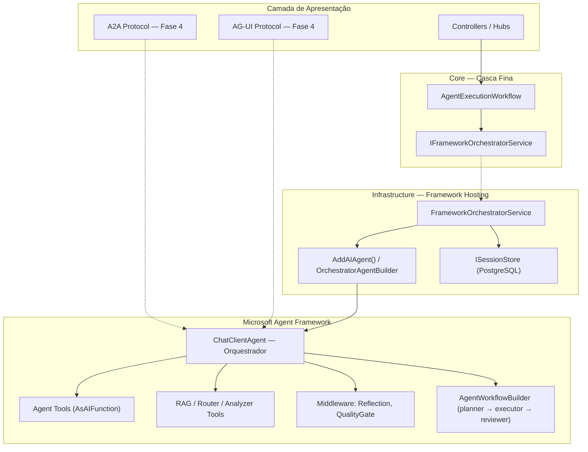

# Plano de Migração: Framework-First Orchestration

> **Criado:** 2026-05-05  
> **Status:** Fase 1 ✅ completa | Fase 2 ✅ completa | Fase 3 ✅ completa | Fase 4 ✅ completa (A2A, AG-UI e OpenAI-compatible implementados)  
> **Escopo:** Inverter controle de orquestração do `AgentExecutionWorkflow` para o Microsoft Agent Framework  
> **Referências:** [TECHNICAL_ARCHITECTURE_GUIDE.md](../TECHNICAL_ARCHITECTURE_GUIDE.md), [AI_Capabilities_Gaps.md](../AI_Capabilities_Gaps.md), [design-philosophy.md](design-philosophy.md)

---

## Sumário

1. [Motivação e Objetivo](#1-motivação-e-objetivo)
2. [Estado Atual (AS-IS)](#2-estado-atual-as-is)
3. [Estado Alvo (TO-BE)](#3-estado-alvo-to-be)
4. [Estratégia de Migração](#4-estratégia-de-migração)
5. [Fase 1 — Centralizar Entrada no Framework](#5-fase-1--centralizar-entrada-no-framework)
6. [Fase 2 — Mover Cross-Cutting Concerns para o Framework](#6-fase-2--mover-cross-cutting-concerns-para-o-framework)
7. [Fase 3 — Remover Duplicidade Arquitetural](#7-fase-3--remover-duplicidade-arquitetural)
8. [Fase 4 — Protocol Hosting e Interoperabilidade](#8-fase-4--protocol-hosting-e-interoperabilidade)
9. [Grafo de Dependências](#9-grafo-de-dependências)
10. [Análise contra Documentação Oficial do MAF](#10-análise-contra-documentação-oficial-do-maf)
11. [Riscos e Mitigações](#11-riscos-e-mitigações)
12. [Critérios de Sucesso por Fase](#12-critérios-de-sucesso-por-fase)
13. [Decisões Globais](#13-decisões-globais)
14. [Análise de Dead Code, Duplicidades e Fluxos Não Utilizados](#14-análise-de-dead-code-duplicidades-e-fluxos-não-utilizados)

---

## 1. Motivação e Objetivo

### Problema

O `AgentExecutionWorkflow` é hoje o **cérebro** do sistema: ele decide qual agente chamar, quando buscar RAG, se faz handoff, se chama reflection. O Microsoft Agent Framework funciona como **subordinado** — apenas executa o agente já selecionado pelo workflow.

Isso gera:

- **Duplicidade de decisão** — o workflow decide routing, mas o framework também poderia decidir via tool bindings
- **Rigidez de pipeline** — 11 steps sequenciais hardcoded, difícil de reordenar ou condicionar
- **Subutilização do framework** — capabilities como agent-as-tool, sessões nativas e middleware não são usadas para orquestração
- **Complexidade crescente** — cada novo cross-cutting concern (reflection, correction, RAG, approval) adiciona mais dependências ao workflow

### Objetivo

Inverter a direção de controle: o **framework orquestrador** decide *qual agente chamar*, *quando buscar contexto*, *se precisa de handoff*. O `AgentExecutionWorkflow` vira **casca fina** (escopo, sessão, persistência, feature flag de rollback).

### Princípios

1. **Migração incremental** — 3 fases, cada uma independente e com rollback
2. **Zero breaking change externo** — `IAgentExecutionWorkflow` mantém sua interface; controllers e hubs não mudam
3. **Feature flag por design** — se `IFrameworkOrchestratorService` não estiver registrado, o fluxo legado continua funcionando
4. **`ExecuteDirectAsync` preservado** — seleção manual de agente pelo frontend continua via escape hatch

---

## 2. Estado Atual (AS-IS)

### Fluxo de Execução

```
User Input
    │
    ▼
MetaAgentOrchestrator (fachada de sessão/streaming)
    │
    ▼
AgentExecutionWorkflow.ExecuteAsync (cérebro)
    │
    ├─ 1. ContextAnalyzer.AnalyzeAsync()
    ├─ 2. QualityGateService.ValidateRequestAsync()
    ├─ 3. ToolAvailabilityGuard.CheckAsync()
    ├─ 4. DynamicAgentService.IsAgentCreationRequestAsync()
    ├─ 5. SmartRouter.RouteAsync()
    ├─ 6. AgentCollaborationWorkflow.ShouldRunAsync()
    ├─ 7. AgentFactory.GetOrCreateAgentAsync() + RAG + Correction + Handoff
    ├─ 8. QualityGateService + ReflectionEngine
    ├─ 9. ConfidenceScoreCalculator.Calculate()
    ├─ 10. FinalResponseApprovalService.EvaluateAsync()
    └─ 11. Persist Artifacts + Metrics
    │
    ▼
AgentFrameworkAdapter.ExecuteAsync (subordinado)
    │
    ▼
ChatClientAgent.RunAsync (framework)
```

### Responsabilidades do Workflow (19+ dependências)

| Responsabilidade | Ideal para workflow? |
|---|:---:|
| Escopo de execução (BeginScope, LLM context) | ✅ |
| Persistência de resultado | ✅ |
| Streaming coordination | ✅ |
| Seleção de agente | ❌ → framework |
| RAG enrichment | ❌ → framework tool |
| Handoff decision | ❌ → framework tool binding |
| Reflection | ❌ → framework pós-processamento |
| Correction loop | ❌ → framework tool |
| Smart routing | ❌ → framework tool |

---

## 3. Estado Alvo (TO-BE)

### Fluxo de Execução (Evolução em 4 estágios)

**Estágio atual (pós-Fase 1):** construção manual via `OrchestratorAgentBuilder`

```
User Input
    │
    ▼
MetaAgentOrchestrator (inalterado)
    │
    ▼
AgentExecutionWorkflow.ExecuteAsync (casca fina)
    ├─ BeginScope + LLM context
    ├─ Delega a IFrameworkOrchestratorService.ExecuteAsync()
    └─ Persist resultado
    │
    ▼
FrameworkOrchestratorService
    │
    ▼
OrchestratorAgentBuilder → ChatClientAgent (orquestrador)
    │
    ├─ System prompt: lista de especialistas + domínios + critérios
    ├─ Tool bindings: cada agente exposto via AsAIFunction()
    ├─ Tools auxiliares: RAG, SmartRouter, ContextAnalyzer
    ├─ Middleware: .UseReflection(), .UseQualityGates() (Fase 2+)
    ├─ ChatHistoryProvider: RAG injetado no histórico (Fase 2+)
    │
    ▼
ChatClientAgent.RunAsync() (framework decide)
    ├─ Chama tool do especialista quando apropriado
    ├─ Chama RAG quando precisa de contexto
    ├─ Chama routing quando ambíguo
    │
    ▼
Resposta + identificação do agente chamado
    │
    ▼
FrameworkOrchestratorService
    ├─ Publica AgentSelected event
    ├─ Persiste sessão do framework
    └─ Sincroniza resposta
```

**Estado alvo (pós-Fase 3):** hosting nativo via `AddAIAgent()` + `IHostedAgentBuilder`

```
User Input
    │
    ▼
MetaAgentOrchestrator (inalterado)
    │
    ▼
AgentExecutionWorkflow.ExecuteAsync (casca fina)
    ├─ BeginScope + LLM context
    ├─ Delega a IFrameworkOrchestratorService.ExecuteAsync()
    └─ Persist resultado
    │
    ▼
FrameworkOrchestratorService
    │
    ▼
AddAIAgent("orchestrator") → IHostedAgentBuilder
    ├─ .WithAITool(specialist_1)     ← AsAIFunction()
    ├─ .WithAITool(specialist_N)     ← AsAIFunction()
    ├─ .WithAITool(rag_enricher)     ← AIFunction ou ChatHistoryProvider
    ├─ .WithSessionStore(postgres)   ← ISessionStore nativo (elimina bridge)
    ├─ Middleware pipeline:          ← .UseReflection().UseQualityGates()
    │
    ▼
AddWorkflow("collaboration") → AgentWorkflowBuilder
    ├─ BuildSequential([planner, executor, reviewer])  ← substitui AgentCollaborationWorkflow
    └─ .AddAsAIAgent()               ← workflow exposto como agent tool do orquestrador
    │
    ▼
Protocol Hosting (Fase 4):
    ├─ AddA2AServer() / MapA2AServer()
    └─ AG-UI endpoints
```

### Diagrama de Componentes (TO-BE)



---

## 4. Estratégia de Migração

### Visão Geral das Fases

| Fase | Objetivo | Impacto no Workflow | Rollback |
|:---:|---|---|---|
| **1** | Centralizar entrada no framework | Delega para orquestrador; mantém fallback legado completo | `IFrameworkOrchestratorService == null` → fluxo legado |
| **2** | Mover cross-cutting concerns + hosting nativo | Remove RAG manual, handoff manual; migra para `AddAIAgent()` | Remover tools auxiliares do builder → volta a Fase 1 |
| **3** | Eliminar duplicidade | Simplifica Adapter, unifica sessão via `ISessionStore`, middleware nativo | Restaurar steps removidos do workflow |
| **4** | Protocol hosting e interoperabilidade | Expor agentes via A2A, AG-UI, OpenAI-compatible | Remover endpoints de protocolo |

### Premissas

- .NET 10 com Microsoft.Agents.AI 1.4.0 no estado atual do projeto
- `IChatClient` configurado (registro condicional)
- Agentes já decorados com `AgentFrameworkAdapter` via `AgentFrameworkAgentFactory`
- `AgentSessionBridge` funcional para persistência de sessões do framework
- `CreateToolBindingAsync` já existe em `AgentFrameworkFactory`
- **`AddAIAgent()` + `IHostedAgentBuilder`** disponíveis no MAF 1.4.0 para hosting nativo (DI, session store e tools resolvidos automaticamente)
- **`AgentWorkflowBuilder`** disponível no MAF 1.4.0 para orquestração multi-agent (`.BuildSequential`, `.BuildConcurrent`)
- **`ChatHistoryProvider`** disponível como first-class concept para injeção de contexto no histórico
- **Session store de hosting** disponível via `.WithInMemorySessionStore()` e `.WithSessionStore(...)`; integração com o store atual da aplicação ainda exige adapter local

---

## 5. Fase 1 — Centralizar Entrada no Framework

> **Status: ✅ COMPLETA — compilando com 0 erros, 0 warnings**

### Objetivo

Toda execução passa por um agente orquestrador `ChatClientAgent` do framework. O workflow deixa de decidir "qual agente" e "qual contexto".

### Arquivos Criados

| Arquivo | Descrição |
|---|---|
| [`Core/Interfaces/IFrameworkOrchestratorService.cs`](../../src/AgenticSystem.Core/Interfaces/IFrameworkOrchestratorService.cs) | Interface com `ExecuteAsync(sessionId, input, context, ct)` → `AgentResponse` |
| [`Infrastructure/AgentFramework/OrchestratorAgentBuilder.cs`](../../src/AgenticSystem.Infrastructure/AgentFramework/OrchestratorAgentBuilder.cs) | Constrói e cacheia o `ChatClientAgent` orquestrador com tool bindings dos especialistas |
| [`Infrastructure/AgentFramework/FrameworkOrchestratorService.cs`](../../src/AgenticSystem.Infrastructure/AgentFramework/FrameworkOrchestratorService.cs) | Implementação: monta orquestrador → sessão → RunAsync → extrai conteúdo → identifica agente |

### Arquivos Modificados

| Arquivo | Mudança |
|---|---|
| [`Infrastructure/AgentFramework/AgentFrameworkFactory.cs`](../../src/AgenticSystem.Infrastructure/AgentFramework/AgentFrameworkFactory.cs) | Expôs `ChatClient`, `LoggerFactory`, `ServiceProvider` como propriedades `internal` |
| [`Core/Services/AgentExecutionWorkflow.cs`](../../src/AgenticSystem.Core/Services/AgentExecutionWorkflow.cs) | Adicionou `IFrameworkOrchestratorService?` opcional; `ExecuteAsync` delega quando disponível |
| [`Infrastructure/Extensions/ServiceCollectionExtensions.cs`](../../src/AgenticSystem.Infrastructure/Extensions/ServiceCollectionExtensions.cs) | Registra `OrchestratorAgentBuilder` + `IFrameworkOrchestratorService` no bloco `if (hasChatClient)` |

### Steps Detalhados

#### Step 1 — Interface `IFrameworkOrchestratorService`

```csharp
namespace AgenticSystem.Core.Interfaces;

public interface IFrameworkOrchestratorService
{
    Task<AgentResponse> ExecuteAsync(
        string sessionId, string input, UserContext context, CancellationToken ct);
}
```

- Fica no Core para que o workflow (também no Core) possa referenciar
- Retorna `AgentResponse` — mesma assinatura que `IAgent.ExecuteAsync`

#### Step 2 — `OrchestratorAgentBuilder`

Responsável por:

1. **Listar agentes ativos** via `IAgentFactory.GetAllAgentsAsync()`
2. **Criar tool bindings** para cada especialista via `AgentFrameworkFactory.CreateToolBindingAsync(agent, sessionId, ct)`
3. **Gerar system prompt dinâmico** descrevendo especialistas (nome, domínio, tier, descrição, tools)
4. **Montar `ChatClientAgent`** com `AsBuilder().UseLogging().UseOpenTelemetry().Build()`
5. **Cachear** o orquestrador (chave = hash dos nomes de agentes ativos), com `InvalidateCache()`

```
OrchestratorAgentBuilder
    ├─ GetOrCreateOrchestratorAsync(sessionId, ct)
    │   ├─ _agentFactory.GetAllAgentsAsync() → AgentInfo[]
    │   ├─ Para cada agente:
    │   │   ├─ AnalysisResult mock → _agentFactory.GetOrCreateAgentAsync(analysis) → IAgent
    │   │   ├─ Unwrap AgentFrameworkAdapter → IAgent inner
    │   │   └─ _frameworkFactory.CreateToolBindingAsync(inner, sessionId, ct) → AgentToolBinding
    │   ├─ Gera system prompt com lista de especialistas
    │   └─ Cria ChatClientAgent com tools = bindings + AIFunctions
    └─ InvalidateCache()
```

#### Step 3 — `FrameworkOrchestratorService`

Fluxo de execução:

```
ExecuteAsync(sessionId, input, context, ct)
    │
    ├─ builder.GetOrCreateOrchestratorAsync(sessionId, ct) → OrchestratorContext
    ├─ bridge.GetOrCreateFrameworkSessionAsync(sessionId, "orchestrator") → AgentSession
    ├─ coordinator.PublishRuntimeEventAsync("AgentSelected", ...)
    ├─ orchestrator.RunAsync(input, session)  ← 2 args, SEM CancellationToken
    ├─ ExtractContent(response) → string
    ├─ IdentifyCalledAgent(response, bindings) → agentName?
    ├─ bridge.PersistFrameworkSessionAsync(sessionId, "orchestrator", session)
    └─ bridge.SyncResponseAsync(sessionId, agentName, content)
```

**Pontos importantes:**
- `RunAsync` do MAF aceita apenas 2 argumentos: `(string input, AgentSession session)` — sem `CancellationToken`
- `ExtractContent` busca `TextContent` em mensagens `Assistant`; fallback para `.Text`
- `IdentifyCalledAgent` varre `FunctionCallContent` nas mensagens para mapear tool name → agent name via bindings

#### Step 4 — Reduzir `AgentExecutionWorkflow.ExecuteAsync`

```csharp
// Construtor: parâmetro opcional no final
public AgentExecutionWorkflow(
    ... 19 dependências existentes ...,
    IFrameworkOrchestratorService? frameworkOrchestrator = null)

// ExecuteAsync: delegação no início
public async Task<AgentResponse> ExecuteAsync(...)
{
    // Mantém: BeginScope, LLM context
    
    if (_frameworkOrchestrator is not null)
    {
        _logger.LogDebug("Delegating to Framework Orchestrator");
        return await _frameworkOrchestrator.ExecuteAsync(sessionId, input, context, ct);
    }
    
    // Fallback: fluxo legado completo (11 steps inalterados)
}
```

**`ExecuteDirectAsync` permanece intacto** — seleção manual de agente pelo frontend.

#### Step 5 — Registro DI

Em `ServiceCollectionExtensions.cs`, dentro de `if (hasChatClient)`:

```csharp
services.AddSingleton<OrchestratorAgentBuilder>();
services.AddSingleton<IFrameworkOrchestratorService, FrameworkOrchestratorService>();
```

Registros condicionais: se `IChatClient` não existir, `IFrameworkOrchestratorService` não é registrado → workflow usa fallback legado.

### Decisões Fase 1

| Decisão | Justificativa |
|---|---|
| Orquestrador é `ChatClientAgent` com system prompt de coordenação | Padrão supervisor-with-tools documentado no MAF |
| Especialistas expostos como `AIFunction` via `AsAIFunction()` | Base já existia em `CreateToolBindingAsync` |
| `IAgentExecutionWorkflow` mantém interface | Zero impacto em consumidores externos |
| Parâmetro opcional no construtor | Feature flag natural — sem `IFrameworkOrchestratorService`, usa legado |
| `ExecuteDirectAsync` continua bypassando orquestrador | Preserva seleção direta de agente pelo frontend |

### Débito Técnico Fase 1

> **Steps 2-3 usam construção manual do agente orquestrador.**
> O MAF oferece `AddAIAgent()` + `IHostedAgentBuilder` como modelo de hosting nativo que resolve DI, session store, tools e middleware automaticamente.
> A construção manual via `OrchestratorAgentBuilder` funciona e está comprovada, porém deve migrar para hosting nativo na **Fase 2** (Step 5b) para alinhar com a direção do framework.
>
> ```csharp
> // Fase 1 (atual — manual)
> var agent = new ChatClientAgent(chatClient, "orchestrator", options)
>     .AsBuilder().UseLogging().UseOpenTelemetry().Build();
>
> // Fase 2+ (alvo — hosting nativo)
> builder.Services.AddAIAgent("orchestrator", agentBuilder => {
>     agentBuilder
>         .WithAITool(specialist1)
>         .WithAITool(specialist2)
>         .WithSessionStore(postgresStore);
> });
> ```

---

## 6. Fase 2 — Mover Cross-Cutting Concerns para o Framework

> **Status: ✅ COMPLETA — compilando com 0 erros, 1 warning pré-existente (McpClientPlugin.cs)**

### Objetivo

RAG vira tool do framework + context provider automático. Handoff vira delegação nativa via tool binding. SmartRouter e ContextAnalyzer expostos como tools auxiliares. O workflow não monta mais `enrichedInput` nem decide handoff manualmente (path legado bypassado pelo early return do framework).

### Decisões de Implementação vs. Plano Original

| Aspecto | Plano Original | Implementação Real | Justificativa |
|---|---|---|---|
| **Step 5b** — `AddAIAgent()` hosting | Migrar para `AddAIAgent()` + `IHostedAgentBuilder` | **Disponível no MAF 1.4** — adotado hoje só na superfície de protocolo; fluxo principal segue com `OrchestratorAgentBuilder` | Débito local de migração do path principal, não limitação atual do framework |
| **Step 6** — RAG | `ChatHistoryProvider` (primário) + `AIFunction` (complemento) | `MessageAIContextProvider` (primário) + `AIFunction` (complemento) | MAF 1.3.0 usa `MessageAIContextProvider` (não `ChatHistoryProvider`); pipeline: ChatHistoryProvider → AIContextProviders → IChatClient |
| **Step 7** — Handoff | Simplificar `HandoffManager` | Delegação via tool bindings + instructions do orquestrador | Handoff agora é implícito — LLM decide qual tool/agente chamar |
| **Step 8** — SmartRouter/ContextAnalyzer | Tools auxiliares | Implementado via `OrchestratorAuxiliaryTools` (fábrica estática) | `AIFunctionFactory.Create(Delegate, AIFunctionFactoryOptions)` — pattern validado |
| **Step 9** — Remover `enrichedInput` | Remover do workflow | **Preservado** — path legado bypassado por early return quando framework ativo | Zero breaking change; código legado intacto para rollback |

### Arquivos Criados

| Arquivo | Descrição |
|---|---|
| [`Infrastructure/AgentFramework/RAGContextProvider.cs`](../../src/AgenticSystem.Infrastructure/AgentFramework/RAGContextProvider.cs) | `MessageAIContextProvider` que injeta contexto RAG automaticamente antes de cada LLM call; guard contra re-injeção em loops de tool-calling via marker `[Contexto Relevante da Base de Conhecimento]` |
| [`Infrastructure/AgentFramework/OrchestratorAuxiliaryTools.cs`](../../src/AgenticSystem.Infrastructure/AgentFramework/OrchestratorAuxiliaryTools.cs) | Fábrica estática com 3 `AITool` auxiliares: `retrieve_context` (RAG on-demand), `route_to_best_agent` (SmartRouter), `analyze_request` (ContextAnalyzer); expõe `AllToolNames` para filtragem |

### Arquivos Modificados

| Arquivo | Mudança |
|---|---|
| [`Infrastructure/AgentFramework/OrchestratorAgentBuilder.cs`](../../src/AgenticSystem.Infrastructure/AgentFramework/OrchestratorAgentBuilder.cs) | Construtor recebe `IRAGService?`, `IContextBudgetManager?`, `ISmartRouter?`, `IContextAnalyzer?` (opcionais via DI); cria `RAGContextProvider` e auxiliary tools; merge auxiliary tools com specialist tools em `GetOrCreateOrchestratorAsync`; `UseAIContextProviders(_ragContextProvider)` no builder chain; `BuildOrchestratorInstructions` inclui seção de ferramentas auxiliares |
| [`Infrastructure/AgentFramework/FrameworkOrchestratorService.cs`](../../src/AgenticSystem.Infrastructure/AgentFramework/FrameworkOrchestratorService.cs) | `IdentifyCalledAgent` filtra `OrchestratorAuxiliaryTools.AllToolNames` antes de mapear specialist bindings — evita que tool calls auxiliares sejam interpretadas como delegação a especialista |

### Arquivos Inalterados (decisão consciente)

| Arquivo | Motivo |
|---|---|
| `Infrastructure/Extensions/ServiceCollectionExtensions.cs` | Parâmetros opcionais com `= null` no construtor do `OrchestratorAgentBuilder` são resolvidos automaticamente pelo DI container (pattern validado em `AgentFrameworkFactory`) |
| `Core/Services/AgentExecutionWorkflow.cs` | Path legado preservado intacto; framework path já bypassa via early return (linhas 83-86); `enrichedInput` mantido para rollback |
| `Core/Services/HandoffManager.cs` | Não simplificado — mantido para rollback e métricas via `RecordHandoffAsync` |

### Detalhes Técnicos da Implementação

#### RAGContextProvider (MessageAIContextProvider)

```csharp
public class RAGContextProvider : MessageAIContextProvider
{
    // Overrides ProvideMessagesAsync(InvokingContext, CancellationToken)
    // → ValueTask<IEnumerable<ChatMessage>>
    
    // Pipeline: ChatHistoryProvider → AIContextProviders → IChatClient
    // RAGContextProvider executa APÓS chat history, ANTES do LLM call
    
    // Guard contra re-injeção:
    // - Verifica se ContextMarker já existe em RequestMessages
    // - Evita RAG duplicado em loops de tool-calling (LLM chama tool → recebe resultado → chama novamente)
    
    // Budget management:
    // - IContextBudgetManager? optional
    // - Se disponível, trima contexto via ResolveBudget + TrimContextToBudgetAsync
}
```

#### OrchestratorAuxiliaryTools (AIFunctionFactory)

```csharp
// Pattern: AIFunctionFactory.Create(Delegate, AIFunctionFactoryOptions)
// - [Description("...")] em parâmetros do lambda → schema JSON automático
// - CancellationToken excluído do schema, passado em runtime
// - Retorno string → texto passado de volta ao LLM

retrieve_context(query)     → IRAGService.RetrieveContextAsync → BuiltContext
route_to_best_agent(domain, intent) → ISmartRouter.RouteAsync → PrimaryAgent + ConfidenceScore
analyze_request(input)      → IContextAnalyzer.AnalyzeAsync → Domain/Intent/Complexity/Agent
```

#### Builder Chain (OrchestratorAgentBuilder)

```csharp
// Construção do orchestrator:
var chatAgent = new ChatClientAgent(client, instructions, "Orchestrator", desc, allTools, loggerFactory, sp);
var builder = chatAgent.AsBuilder();

if (_ragContextProvider != null)
    builder = builder.UseAIContextProviders(_ragContextProvider);  // ← NOVO em Fase 2

return builder
    .UseLogging(loggerFactory)
    .UseOpenTelemetry("AgenticSystem.Orchestrator")
    .Build(serviceProvider);
```

### Débito Técnico Fase 2

> **`AddAIAgent()` + `IHostedAgentBuilder` já estão disponíveis no MAF 1.4 e já são usados no protocolo A2A/AG-UI.**
> A construção manual via `OrchestratorAgentBuilder` permanece apenas no fluxo principal.
> A migração desse path para hosting nativo é, agora, dívida local implementável imediatamente.
>
> **Path legado do `AgentExecutionWorkflow` preservado.**
> O `enrichedInput`, `HandoffManager` e steps manuais continuam no código, mas nunca executam quando
> `IFrameworkOrchestratorService` está registrado (early return na linha ~83).
> Remoção do dead code planejada para Fase 3.

---

## 7. Fase 3 — Remover Duplicidade Arquitetural

> **Status: ✅ Completa**

### Notas de Implementação e Revalidação (MAF 1.4)

> **Implementado inicialmente em:** 2025-07  
> **Revalidado em:** 2026-05  
> **MAF atual no projeto:** Microsoft.Agents.AI 1.4.0 + Hosting/A2A/AG-UI 1.4.0-preview

#### Realidade Atual — suporte do MAF 1.4 vs situação do projeto

| API / capability | Suporte no MAF 1.4 | Situação no projeto |
|---|---|---|
| `UseReflection()` nativo | ❌ | Continua via extensões custom (`ReflectionDelegatingAgent` + `AgentBuilderMiddlewareExtensions`) |
| `UseQualityGates()` nativo | ❌ | Continua via extensões custom (`QualityGateDelegatingAgent` + `AgentBuilderMiddlewareExtensions`) |
| `AgentWorkflowBuilder` | ✅ | Package presente e integrado no `AgentCollaborationWorkflow` via `BuildSequential` + `InProcessExecution` |
| `BuildSequential` / `BuildConcurrent` | ✅ | `BuildSequential` já usado no workflow colaborativo; `BuildConcurrent` segue disponível para futuras etapas paralelas |
| Session store de hosting (`WithInMemorySessionStore` / `WithSessionStore`) | ✅ | Não adotado no fluxo principal; `AgentSessionBridge` ainda persiste estado em `ISessionStore.RuntimeSettings` |
| `AddAIAgent()` / `IHostedAgentBuilder` | ✅ | Já usado nos endpoints A2A/AG-UI; orquestrador principal segue manual |
| `WithSessionStore(...)` | ✅ | Adapter local já implementado (`AgentFrameworkSessionStoreAdapter`); `AgentSessionBridge` ainda cobre paths legados e tool bindings |

#### Arquivos Criados/Modificados

| Arquivo | Ação | Step |
|---|---|---|
| `Infrastructure/AgentFramework/ReflectionDelegatingAgent.cs` | **Criado** — `DelegatingAIAgent` que chama `IReflectionEngine.ReflectAsync` pós-resposta | 12 |
| `Infrastructure/AgentFramework/QualityGateDelegatingAgent.cs` | **Criado** — `DelegatingAIAgent` com pre/post validation via `IQualityGateService` | 12 |
| `Infrastructure/AgentFramework/AgentBuilderMiddlewareExtensions.cs` | **Criado** — `UseReflection()` e `UseQualityGates()` extension methods em `AIAgentBuilder` | 12 |
| `Infrastructure/AgentFramework/AgentFrameworkAdapter.cs` | `ExecuteAsync` marcado `[Obsolete]` | 11 |
| `Infrastructure/AgentFramework/OrchestratorAgentBuilder.cs` | Constructor aceita `IReflectionEngine?` e `IQualityGateService?`; pipeline: QualityGates → Reflection → Logging → OpenTelemetry | 7 |
| `Infrastructure/AgentFramework/AgentFrameworkSessionStoreAdapter.cs` | **Criado** — adapter local para `WithSessionStore(...)` do hosting nativo | 14 |
| `Infrastructure/AgentFramework/AgentSessionBridge.cs` | Refatorado para usar `ISessionStore.RuntimeSettings` em vez de eventos falsos; fallback para eventos mantido | 14 |
| `Infrastructure/AI/AgentCollaborationWorkflow.cs` | **Migrado** — planner/executor/reviewer agora executam via `AgentWorkflowBuilder.BuildSequential(...)` com fallback legado | 13 |
| `Core/Services/HierarchicalAgentFactory.cs` | `GetOrCreateAgentAsync` e `ResolveAgentName` marcados `[Obsolete]` | 15 |

#### Tech Debt Remanescente para Fase 4+

1. **`AgentSessionBridge`** — adapter de hosting já existe, mas a bridge ainda permanece central nos paths legados e nos tool bindings.
2. **`AgentFrameworkAdapter.ExecuteAsync`** — limpeza local; o unwrap no orquestrador já ficou explícito e sem reflection, mas o adapter ainda é decorador global do factory.
3. **`HierarchicalAgentFactory.GetOrCreateAgentAsync`** — limpeza local; ainda existe por compatibilidade com fluxos legados.
4. **Middleware nativo de reflection/quality gates** — este continua sendo bloqueio real do framework; por isso as extensões custom permanecem necessárias.

### Objetivo

Eliminar caminhos paralelos. O framework é a autoridade de decisão. O `AgentExecutionWorkflow` contém apenas escopo e persistência.

### Steps

#### Step 11 — Simplificar `AgentFrameworkAdapter`

- Com o orquestrador no centro, `AgentFrameworkAdapter` perde o papel de wrapper de compatibilidade
- Especialistas são chamados diretamente como tool bindings — nunca como `IAgent.ExecuteAsync` pelo workflow
- Mantido apenas para `ExecuteDirectAsync` (chamada direta ao agente nomeado)
- Marcar como `[Obsolete]` os caminhos que não passam pelo orquestrador

#### Step 12 — Reflection e QualityGates via Middleware do Framework

O MAF oferece pipeline de middleware (`AsBuilder().Use*().Build()`) que já inclui extensões para reflection e quality gates. Em vez de chamar `ReflectionEngine` como pós-processamento manual no `FrameworkOrchestratorService`, utilizar middleware nativo:

```csharp
// Middleware nativo do MAF
var orchestrator = new ChatClientAgent(chatClient, "orchestrator", options)
    .AsBuilder()
    .UseLogging()
    .UseOpenTelemetry()
    .UseReflection()          // ← avalia qualidade da resposta
    .UseQualityGates()        // ← valida critérios mínimos antes de retornar
    .Build();

// Com AddAIAgent() (hosting nativo):
agentBuilder
    .UseReflection()
    .UseQualityGates(gates => {
        gates.MinConfidence = 0.7;
        gates.RequireSourceCitation = true;
    });
```

| Componente | Antes (workflow/service) | Depois (middleware) |
|---|---|---|
| `ReflectionEngine.ReflectAsync` | Chamado manualmente pós-resposta no `FrameworkOrchestratorService` | `.UseReflection()` no pipeline do agent |
| `CorrectionLoop.ApplyRulesToPromptAsync` | Altera `enrichedInput` no workflow | `.UseQualityGates()` no pipeline ou `ChatHistoryProvider` |
| `CorrectionLoop.AddRuleAsync` | Chamado quando reflection gera suggestion | Mantido como está |
| Quality gate check | Não existia | `.UseQualityGates()` valida resposta antes de retornar |

**Vantagem:** middleware intercepta a resposta de forma transparente, sem acoplamento no service. O `FrameworkOrchestratorService` fica mais limpo.

**CorrectionLoop como AIFunction (complemento):** `CorrectionLoop` pode ser exposta como `AIFunction` que o orquestrador chama para aplicar regras de correção antes de enviar ao especialista. Isso complementa (não substitui) o middleware.

#### Step 13 — Migrar `AgentCollaborationWorkflow` para `AgentWorkflowBuilder` ✅ Implementado

O fluxo planner-executor-reviewer foi migrado incrementalmente. O projeto agora monta um `BuildSequential` com planner, executor e reviewer, executa o workflow via `InProcessExecution` e preserva um fallback legado quando `AgentFrameworkFactory` não está disponível. O MAF segue oferecendo `BuildSequential` e `BuildConcurrent` como mecanismos nativos de orquestração multi-agent:

```csharp
// ANTES — Custom workflow
// AgentCollaborationWorkflow.cs
var plan = await _planner.PlanAsync(input);
foreach (var step in plan.Steps)
    await _executor.ExecuteStep(step);
await _reviewer.ReviewAsync(plan);

// DEPOIS — MAF AgentWorkflowBuilder
builder.AddWorkflow("collaboration", workflowBuilder => {
    workflowBuilder
        .BuildSequential([plannerAgent, executorAgent, reviewerAgent])
        .AddAsAIAgent();  // ← workflow exposto como agent tool do orquestrador
});
```

**Detalhamento:**

```
Antes:                                  Depois:
AgentCollaborationWorkflow              AgentWorkflowBuilder
  ├─ Planner.PlanAsync()                  ├─ BuildSequential([
  ├─ Executor.ExecuteStep()               │     plannerAgent,    ← ChatClientAgent
  └─ Reviewer.ReviewAsync()               │     executorAgent,   ← ChatClientAgent
                                          │     reviewerAgent    ← ChatClientAgent
                                          │   ])
                                          └─ .AddAsAIAgent()     ← expõe como tool do supervisor
```

**Benefícios vs tool calls manuais:**
- **Checkpointing** entre steps (resume em caso de falha)
- **Streaming nativo** (output de cada agent é streamado)
- **Paralelismo tipado** (`BuildConcurrent` para steps independentes)
- **Graph visualizável** (edges tipados entre agents)
- **HITL nativo** via `RequestInfoExecutor` (human-in-the-loop)

**Diferença conceitual — agent-as-tool vs workflow:**

| | Agent-as-tool (`AsAIFunction()`) | Workflow (`AgentWorkflowBuilder`) |
|---|---|---|
| Padrão | Supervisor + especialistas | Pipeline sequencial/paralelo |
| Decisão | LLM decide qual tool chamar | Grafo define a sequência |
| Melhor para | Orquestrador → especialistas (open-ended) | Planner → executor → reviewer (determinístico) |
| Usado em | Fases 1-2: supervisor-with-tools | Fase 3: collaboration pipeline |

**Recomendação:** manter `AsAIFunction()` para orquestrador → especialistas (supervisor-with-tools). Usar `AgentWorkflowBuilder.BuildSequential` para planner → executor → reviewer (fluxo determinístico). O workflow pode ser exposto como tool do orquestrador via `.AddAsAIAgent()`.

#### Step 14 — Unificar Sessão via `ISessionStore` Nativo

O MAF oferece `ISessionStore` como interface nativa para persistência de sessões, com `.WithInMemorySessionStore()` e suporte a stores customizados.

**Implementar `PostgresSessionStore` como `ISessionStore`:**

```csharp
public class PostgresSessionStore : ISessionStore
{
    private readonly IDbConnectionFactory _db;

    public async Task<AgentSession?> GetSessionAsync(string sessionId, CancellationToken ct)
    {
        // Busca sessão serializada no PostgreSQL
    }

    public async Task SaveSessionAsync(string sessionId, AgentSession session, CancellationToken ct)
    {
        // Persiste sessão serializada no PostgreSQL
    }
}

// Registro:
agentBuilder.WithSessionStore<PostgresSessionStore>();
```

| Aspecto | Antes | Depois |
|---|---|---|
| Sessão principal de conversa | `ISessionManager` (negócio) | `AgentSession` do framework via `ISessionStore` |
| Persistência de sessão framework | `AgentSessionBridge` (sync bidirecional) | `PostgresSessionStore` nativo (elimina bridge) |
| Persistência de negócio | `ISessionManager` | `ISessionManager` (mantido para eventos e consolidação) |
| Thread de chat history | Custom | Framework como fonte primária |

**Resultado:** `AgentSessionBridge` é **eliminada**. A persistência de sessões do framework é feita diretamente pelo `PostgresSessionStore` via `ISessionStore`. O `ISessionManager` continua existindo para lógica de negócio (eventos, consolidação, metadados).

**Importante:** doc oficial do MAF: "Sessions are agent/service-specific. Reusing a session with a different agent configuration or provider can lead to invalid context." → manter sessões separadas por agente no store.

#### Step 15 — Remover `IAgentFactory` como cérebro de seleção

- `IAgentFactory.GetOrCreateAgentAsync` perde o papel de "escolher agente baseado em analysis"
- Passa a ser apenas "criar agente dado nome/spec" — sem lógica de seleção
- A seleção é feita pelo LLM do orquestrador via tool bindings
- `HierarchicalAgentFactory` pode ser simplificado

### Arquivos Impactados — Fase 3

| Arquivo | Ação |
|---|---|
| `Infrastructure/AgentFramework/AgentFrameworkAdapter.cs` | Simplificar / deprecar |
| `Infrastructure/AgentFramework/ReflectionMiddleware.cs` | **Criar** — middleware wrapper para `ReflectionEngine` |
| `Infrastructure/AgentFramework/QualityGateMiddleware.cs` | **Criar** — middleware de quality gates |
| `Infrastructure/AgentFramework/AgentFrameworkSessionStoreAdapter.cs` | **Criado** — adapter local para `WithSessionStore(...)` do hosting nativo |
| `Infrastructure/AI/AgentCollaborationWorkflow.cs` | ✅ Migrado para `AgentWorkflowBuilder` com fallback legado |
| `Infrastructure/AgentFramework/AgentSessionBridge.cs` | Reduzir / eliminar após migração dos paths legados e tool bindings |
| `Infrastructure/AgentFramework/AgentFrameworkAgentFactory.cs` | Reduzir acoplamento do decorator ao path direto |
| `Core/Services/CorrectionLoopService.cs` | Reposicionar como AIFunction complementar |

---

## 8. Fase 4 — Protocol Hosting e Interoperabilidade

> **Status: ✅ Completa**
> 
> **Notas de implementação (2026-05):**
> - MAF atualizado para 1.4.0 (de 1.3.0) + `Microsoft.Agents.AI.Workflows` 1.4.0 adicionado
> - **A2A: implementado** — `Microsoft.Agents.AI.Hosting.A2A.AspNetCore` 1.4.0-preview. `AddAIAgent()` + `AddA2AServer()` para DI, `MapA2AHttpJson()` para endpoint `/a2a`
> - **AG-UI: implementado** — `Microsoft.Agents.AI.Hosting.AGUI.AspNetCore` 1.4.0-preview. `AddAGUI()` para DI, `MapAGUI()` para endpoint `/agui`
> - **OpenAI-compatible: implementado como controller custom** — `OpenAIChatCompletionController` expõe `POST /v1/chat/completions` e `GET /v1/models` com autenticação via Bearer token
> - **`AddOpenAIChatCompletionServer()` não existe no MAF .NET** — endpoint implementado manualmente
> - Workflows API disponível para uso futuro: `AgentWorkflowBuilder.BuildSequential`, `BuildConcurrent`, `CreateHandoffBuilderWith`, `ChatProtocolExecutor`, checkpointing
> - Config adicionada em `appsettings.json` seção `ProtocolHosting` com flags A2A/AG-UI/OpenAI (todos habilitados)
> - CS8765 nullability warnings corrigidos em `ReflectionDelegatingAgent` e `QualityGateDelegatingAgent`
> - Target framework atualizado para .NET 10 (net10.0)

### Objetivo

Expor agentes via protocolos padronizados (A2A, AG-UI, OpenAI-compatible), permitindo que sistemas externos interajam com os agentes sem depender da API HTTP interna.

### Steps

#### Step 16 — Protocol Hosting (A2A, AG-UI, OpenAI-compatible)

O MAF oferece protocol hosting nativo via:

```csharp
// Program.cs ou ServiceCollectionExtensions.cs

// A2A (Agent-to-Agent protocol)
builder.Services.AddA2AServer();
app.MapA2AServer();

// AG-UI (Agent-UI protocol)
builder.Services.AddAgentUIServer();
app.MapAgentUIServer();

// OpenAI-compatible endpoints
builder.Services.AddOpenAIChatCompletionServer();
app.MapOpenAIChatCompletionServer();
```

**Benefícios:**
- Agentes do Agentic System acessíveis por outros sistemas via A2A
- Frontend pode interagir via AG-UI (streaming nativo, typed events)
- Compatibilidade com ferramentas que usam OpenAI API format
- Zero mudança na lógica dos agentes — apenas exposição de endpoints

**Requisitos:**
- Fase 3 completa (agents registrados via `AddAIAgent()`)
- `ISessionStore` implementado (sessões persistidas nativamente)
- Middleware pipeline configurado

### Arquivos Impactados — Fase 4

| Arquivo | Ação |
|---|---|
| `Api/Program.cs` | **Evoluir** — registrar e mapear protocol servers |
| `Api/appsettings.json` | **Evoluir** — configuração de endpoints de protocolo |
| `Infrastructure/Extensions/ServiceCollectionExtensions.cs` | **Evoluir** — `AddA2AServer()`, `AddAgentUIServer()` |

---

## 9. Grafo de Dependências

```
Step 1 — IFrameworkOrchestratorService interface
  │
  ▼
Step 2 — OrchestratorAgentBuilder ◄── Step 3 — FrameworkOrchestratorService
  │
  ▼
Step 4 — Reduzir AgentExecutionWorkflow
  │
  ▼
Step 5 — DI Registration
━━━━━━━━━━━━━━━━━━━━━━━━━━━━━━━━━ Fase 1 completa ━━━
  │
  ▼
Step 5b — Migrar para AddAIAgent() hosting nativo
  │
  ▼
Step 6 — RAG via ChatHistoryProvider ◄──► Step 7 — Handoff via tool binding  (paralelos)
  │
  ▼
Step 8 — Router/Analyzer como tools
  │
  ▼
Step 9 — Remover enrichedInput
  │
  ▼
Step 10 — Registrar tools no builder
━━━━━━━━━━━━━━━━━━━━━━━━━━━━━━━━━ Fase 2 completa ━━━
  │
  ▼
Step 11 — Simplificar AgentFrameworkAdapter
  │
  ▼
Step 12 — Reflection/QualityGates via middleware
  │
  ▼
Step 13 — Collaboration via AgentWorkflowBuilder ◄── Step 12
  │
  ▼
Step 14 — PostgresSessionStore (ISessionStore nativo) ← elimina AgentSessionBridge
  │
  ▼
Step 15 — Simplificar IAgentFactory
━━━━━━━━━━━━━━━━━━━━━━━━━━━━━━━━━ Fase 3 completa ━━━
  │
  ▼
Step 16 — Protocol Hosting (A2A, AG-UI, OpenAI-compatible)
━━━━━━━━━━━━━━━━━━━━━━━━━━━━━━━━━ Fase 4 completa ━━━
```

---

## 10. Análise contra Documentação Oficial do MAF

### Pontos Validados ✅

| Conceito | Validação |
|---|---|
| `AsAIFunction()` para agent-as-tool | Documentado em "Using an Agent as a Function Tool" |
| `ChatClientAgent` como tipo base | Agente padrão para qualquer `IChatClient` |
| `AgentSession` serialização/restauração | `SerializeSession` / `DeserializeSessionAsync` documentados |
| Pipeline `AsBuilder().UseLogging().UseOpenTelemetry().Build()` | Middleware pattern suportado |
| Especialistas como tool bindings do supervisor | "The inner agent is converted to a function tool and provided to the outer agent" |
| `RunAsync(string input, AgentSession session)` — 2 args | Confirmado: sem CancellationToken |
| `AddAIAgent()` + `IHostedAgentBuilder` | Hosting nativo que resolve DI, session store e tools |
| `ChatHistoryProvider` | First-class concept para injeção de contexto no histórico |
| Session store de hosting | `.WithInMemorySessionStore()` / `.WithSessionStore(...)` documentados |
| `AgentWorkflowBuilder` | `.BuildSequential` / `.BuildConcurrent` para orquestração multi-agent |
| Protocol hosting (A2A, AG-UI) | `AddA2AServer()` / `MapA2AServer()` documentados |

### Correções Aplicadas (vs versão inicial do plano) 🔧

#### 1. Steps 2-3 ignoravam `AddAIAgent()` + `IHostedAgentBuilder`

- **Problema:** Fase 1 construiu o orquestrador manualmente via `new ChatClientAgent(...).AsBuilder().Build()`
- **Correção:** Documentado como débito técnico da Fase 1. Step 5b (Fase 2) migra para hosting nativo via `AddAIAgent()`
- **Impacto:** lifecycle do agent, session store de hosting e tools passam a poder ser resolvidos pelo framework; middleware de reflection/quality gates segue custom

#### 2. Step 6 (RAG) não considerava `ChatHistoryProvider`

- **Problema:** RAG estava planejado apenas como `AIFunction` (tool), onde o LLM decide quando buscar contexto
- **Correção:** `ChatHistoryProvider` agora é a opção primária. Provider injeta contexto automaticamente (determinístico); AIFunction mantida como complemento para buscas ad-hoc
- **Trade-off:** Tool = LLM controla (pode esquecer); Provider = sempre injeta (mais confiável para RAG reranqueado)

#### 3. Step 12 (Reflection) planejado como pós-processamento manual

- **Problema:** Reflection seria chamado manualmente no `FrameworkOrchestratorService` pós-resposta
- **Correção:** Usar middleware custom sobre o pipeline do agent (`.UseReflection()`, `.UseQualityGates()`) via extensões da aplicação, já que o MAF 1.4 não expõe essas APIs nativamente
- **Impacto:** `FrameworkOrchestratorService` fica mais limpo; a dependência remanescente é apenas da camada de middleware local

#### 4. Step 13 (Collaboration) planejado como tool calls do supervisor

- **Problema:** Planner/executor/reviewer seriam convertidos em tool calls do orquestrador
- **Correção:** Usar `AgentWorkflowBuilder.BuildSequential([planner, executor, reviewer])` com `.AddAsAIAgent()` para expor o workflow como tool
- **Impacto:** Checkpointing, streaming nativo, paralelismo tipado, graph visualizável

#### 5. Step 14 (Sessão) mantinha `AgentSessionBridge` simplificada

- **Problema:** Bridge seria simplificada para forward-only, mas continuava existindo
- **Correção:** Reclassificado: o MAF 1.4 já oferece session store de hosting via `WithSessionStore(...)`; falta integrar um adapter local para o store PostgreSQL e migrar o fluxo principal
- **Impacto:** a eliminação da bridge deixou de ser bloqueio do framework e virou backlog local de integração

#### 6. Protocol hosting não existia no plano

- **Problema:** Não havia previsão para expor agentes via protocolos padronizados
- **Correção:** Adicionada Fase 4 com A2A (`AddA2AServer()`), AG-UI, e OpenAI-compatible endpoints
- **Impacto:** Agentes acessíveis por sistemas externos sem depender da API HTTP interna

#### 7. Clarificação agent-as-tool vs workflow

- **Problema:** Não estava claro quando usar `AsAIFunction()` vs `AgentWorkflowBuilder`
- **Correção:** Documentado explicitamente:
  - `AsAIFunction()` → supervisor + especialistas (open-ended, LLM decide)
  - `AgentWorkflowBuilder` → planner → executor → reviewer (determinístico, grafo define)
  - Workflow pode ser exposto como tool do supervisor via `.AddAsAIAgent()`

### Pontos Críticos de Atenção ⚠️

#### 1. `AgentGroupChat` e `AgentOrchestrator` NÃO EXISTEM no MAF

O `AI_Capabilities_Gaps.md` referencia como backlog, mas são abstrações do Semantic Kernel/AutoGen não portadas. A decisão de usar agent-as-tool é a abordagem correta para o MAF atual.

#### 2. MAF Workflows é o mecanismo nativo de orquestração multi-agent

`AgentWorkflowBuilder` + executors + edges formam grafos tipados com checkpointing, human-in-the-loop (via `RequestInfoExecutor`), streaming e parallel execution. No estado atual do projeto, essa capacidade já foi integrada ao `AgentCollaborationWorkflow` no caminho planner → executor → reviewer; os ganhos incrementais restantes estão em ampliar paralelismo e checkpointing onde fizer sentido.

#### 3. Sessões são agent-specific

Doc oficial: *"Sessions are agent/service-specific. Reusing a session with a different agent configuration or provider can lead to invalid context."* Confirma que sessões devem ser separadas por agente no `PostgresSessionStore`.

#### 4. Agent vs Workflow — trade-off fundamental

| | Agent (supervisor-with-tools) | Workflow (AgentWorkflowBuilder) |
|---|---|---|
| Melhor para | Open-ended, conversational, autonomous | Well-defined steps, explicit control |
| Decisão | LLM decide (não-determinístico) | Grafo decide (determinístico) |
| Uso no plano | Orquestrador → especialistas (Fases 1-2) | Planner → executor → reviewer (Fase 3) |
| Composição | Agentes expostos via `AsAIFunction()` | Agents em `BuildSequential`, workflow via `.AddAsAIAgent()` |

### Recomendação Consolidada

- **Implementar agora:** migrar o orquestrador principal para `AddAIAgent()` + `IHostedAgentBuilder`, introduzir um adapter para `WithSessionStore(...)` e reduzir/eliminar `AgentSessionBridge`.
- **Implementar se houver ROI claro:** simplificar `AgentFrameworkAdapter` / `AgentFrameworkAgentFactory` para restringir o wrapper ao `ExecuteDirectAsync` e continuar drenando o legado.
- **Manter como KEEP:** `FinalResponseApprovalService` e `SmartRouter`/`PersistentSmartRouter`, pois seguem em uso e agregam valor no desenho atual.
- **Adiar por bloqueio real do framework:** substituição por middleware nativo de reflection/quality gates; hoje isso continua dependendo de extensões da aplicação.

---

## 11. Riscos e Mitigações

| # | Risco | Probabilidade | Impacto | Mitigação |
|:---:|---|:---:|:---:|---|
| 1 | System prompt do orquestrador mal calibrado → seleção incorreta de tools | Média | Alto | Testar com cenários existentes (domain mismatch, multi-domain, planning required) |
| 2 | Latência extra por camada de LLM na decisão de roteamento | Média | Médio | Cachear decisões de routing; usar model menor para orquestrador |
| 3 | Muitos tool bindings confundem o LLM | Baixa | Alto | Limitar tools visíveis por domínio; descriptions claras e concisas |
| 4 | Perda de determinismo no pipeline | Média | Médio | Supervisor-with-tools nas Fases 1-2; `AgentWorkflowBuilder` na Fase 3 para fluxos determinísticos |
| 5 | Sessão do orquestrador cresce demais | Baixa | Médio | Context budget management; truncar histórico do orquestrador |
| 6 | Reflection/CorrectionLoop perdem eficácia fora do workflow | Baixa | Baixo | Middleware nativo (`.UseReflection()`, `.UseQualityGates()`) na Fase 3 |
| 7 | `ChatHistoryProvider` injeta contexto excessivo | Média | Médio | Implementar budget/relevance filter no provider; monitorar token usage |
| 8 | Migração `AddAIAgent()` quebra construção manual existente | Baixa | Alto | Step 5b é opt-in; construção manual funciona como fallback durante migração |
| 9 | `ISessionStore` PostgreSQL performance com sessões grandes | Baixa | Médio | Serialização compacta; TTL para sessões inativas; índice por `sessionId` |
| 10 | Protocol hosting (A2A) expõe superfície de ataque | Média | Alto | Autenticação obrigatória em endpoints de protocolo; rate limiting; audit logging |

---

## 12. Critérios de Sucesso por Fase

### Fase 1 ✅

- [x] `AgentExecutionWorkflow.ExecuteAsync` não chama mais `_contextAnalyzer.AnalyzeAsync` nem `_agentFactory.GetOrCreateAgentAsync` diretamente (quando orquestrador disponível)
- [x] Toda requisição passa por `IFrameworkOrchestratorService.ExecuteAsync`
- [x] Feature flag permite rollback para caminho legado
- [x] `ExecuteDirectAsync` inalterado
- [x] Build compila sem erros

### Fase 2

- [ ] Não existe mais `enrichedInput` montado manualmente no workflow
- [ ] `ChatHistoryProvider` injeta contexto RAG automaticamente antes de cada request
- [ ] `AIFunction` RAG disponível como complemento para buscas ad-hoc
- [ ] Handoff acontece por tool binding, não por `HandoffManager.ExecuteHandoffAsync` chamado pelo workflow
- [ ] SmartRouter e ContextAnalyzer disponíveis como tools auxiliares
- [ ] Orquestrador registrado via `AddAIAgent()` (hosting nativo, Step 5b)
- [ ] Tests existentes continuam passando

> **Revalidação 2026-05:** o item de hosting nativo do orquestrador principal não está mais bloqueado pelo MAF 1.4; permanece como dívida local de migração do fluxo principal.

### Fase 3

- [ ] O workflow não escolhe mais agente
- [ ] A sessão principal de conversa é a do framework via `ISessionStore` (`PostgresSessionStore`)
- [ ] `AgentSessionBridge` eliminada
- [ ] Especialistas são chamados pelo framework, não pelo workflow
- [ ] Reflection via middleware nativo (`.UseReflection()`)
- [ ] Quality gates via middleware nativo (`.UseQualityGates()`)
- [x] `AgentCollaborationWorkflow` migrado para `AgentWorkflowBuilder.BuildSequential`
- [ ] `AgentFrameworkAdapter` é usado apenas para `ExecuteDirectAsync`

> **Revalidação 2026-05:** `AgentWorkflowBuilder` e `WithSessionStore(...)` existem no MAF 1.4. Os itens ainda pendentes desta fase são majoritariamente backlog local; a exceção real de framework continua sendo a ausência de `UseReflection()` / `UseQualityGates()` nativos.

### Fase 4

- [x] Agentes acessíveis via A2A protocol — `AddA2AServer("AgenticSystem")` + `MapA2AHttpJson("/a2a")` via `Microsoft.Agents.AI.Hosting.A2A.AspNetCore` 1.4.0-preview
- [x] AG-UI endpoints ativos para frontend — `AddAGUI()` + `MapAGUI("/agui")` via `Microsoft.Agents.AI.Hosting.AGUI.AspNetCore` 1.4.0-preview
- [x] OpenAI-compatible endpoints para interoperabilidade — `POST /v1/chat/completions` + `GET /v1/models`
- [x] Autenticação em endpoints de protocolo — Bearer token validado contra `AdminApiKey` + `.RequireAuthorization()` em A2A/AG-UI
- [ ] Rate limiting em endpoints de protocolo
- [ ] Tests de integração para cada protocolo
- [x] ✅ Agent do protocolo integrado com orquestrador completo via `ProtocolOrchestratorChatClient` (Finding 11 resolvido)
- [x] MAF atualizado para 1.4.0 + Workflows package adicionado
- [x] A2A + AG-UI packages (1.4.0-preview.260505.1) instalados
- [x] Config `ProtocolHosting` no appsettings.json (todos habilitados)
- [x] Target framework .NET 10 (net10.0)
- [x] Build compila sem erros

> **Pendências locais desta fase:** rate limiting dos endpoints de protocolo e testes de integração. Nenhuma dessas pendências depende de limitação atual do MAF.

---

## 13. Decisões Globais

| Decisão | Detalhes |
|---|---|
| **Feature flag para rollback** | Fases 1 e 2 têm fallback para caminho legado (`if orchestratorService is null, use old workflow`) |
| **Escopo excluído** | Autenticação, controllers, telemetria cross-cutting, persistência EF — continuam fora do framework |
| **Interface pública inalterada** | `IAgentExecutionWorkflow` não muda — consumidores (controllers, hubs) não são afetados |
| **Testes devem continuar passando** | Behavior externo não muda em cada fase; apenas orquestração interna |
| **`ExecuteDirectAsync` preservado** | Escape hatch para seleção manual de agente pelo frontend |
| **Supervisor-with-tools para Fases 1-2** | Padrão documentado no MAF; simples de implementar e rollback |
| **`AddAIAgent()` como target de hosting** | Disponível no MAF 1.4 e já usado no protocolo; migração do orquestrador principal permanece como dívida local |
| **`ChatHistoryProvider` para RAG** | Injeção automática e determinística de contexto; AIFunction como complemento |
| **Middleware de reflection/quality gates** | Hoje continua custom sobre o builder; o MAF 1.4 não expõe `.UseReflection()` / `.UseQualityGates()` nativos |
| **`AgentWorkflowBuilder` para collaboration** | Disponível no MAF 1.4 e já integrado ao fluxo planner-executor-reviewer |
| **Session store de hosting** | `WithSessionStore(...)` existe no MAF 1.4; o projeto ainda usa `AgentSessionBridge` + store da aplicação |
| **Protocol hosting na Fase 4** | A2A, AG-UI, OpenAI-compatible para interoperabilidade externa |

---

## 14. Análise de Dead Code, Duplicidades e Fluxos Não Utilizados

> **Data da análise:** 2026-05-05 (Pós-Fase 4)  
> **Status:** ✅ Revalidação completa — 9 de 11 findings resolvidos  
> **Análise anterior:** 2026-05-05 (Pós-Fase 1) — 10 findings originais
>
> ✅ **Findings 1, 3, 4, 5 (parcial), 8, 9, 10, 11 resolvidos.** Finding 2 (AgentSessionBridge) e Findings 6-7 (FinalResponseApprovalService, SmartRouter) mantidos como ativamente usados.

### Resumo Executivo

| # | Item | Tipo | Severidade | Status | Resolvido por |
|---|------|------|:----------:|:------:|:------------:|
| 1 | `EfSessionStore` + `UseEntityFramework()` | Dead code | 🔴 Alta | ✅ Resolvido | Remoção direta — `EfSessionStore.cs`, `UseEntityFramework()` e `EfSessionStoreTests.cs` deletados |
| 2 | `AgentSessionBridge` vs `ISessionStore` | Duplicidade ativa | 🟡 Média | ⬜ Pendente | Fase 3 — eliminar bridge (SKIP: muito central, usado em 6+ arquivos) |
| 3 | `ContextAnalyzer`, `SmartRouter`, `HandoffManager` (legado) | Dead code com framework ativo | 🔴 Alta | ✅ Resolvido | Dependências legadas removidas do `AgentExecutionWorkflow`; `ExecuteAsync` delega diretamente ao framework |
| 4 | Integration Providers (Calendar, Email, Notes, Storage, Vision) | Dead code — nunca injetados | 🔴 Alta | ✅ Resolvido | Remoção completa — 5 providers + interfaces + models + config + testes deletados |
| 5 | `ILLMManager` paralelo a `IChatClient` | Duplicidade de abstração LLM | 🟠 Média-Alta ⬆️ | ✅ Parcial | `ContextAnalyzer` e `SessionConsolidator` migrados para `IChatClient`; `ILLMManager` mantido em `BaseAgent` e `LLMController` |
| 6 | `FinalResponseApprovalService` | Dead code com framework ativo | 🟠 Média-Alta | ⬜ Pendente | KEEP — ativamente usado no `AgentController` e `AgentExecutionWorkflow` |
| 7 | `PersistentSmartRouter` + `SmartRouter` | Dead code com framework ativo | 🟠 Média-Alta | ⬜ Pendente | KEEP — ambos ativamente usados no pipeline de roteamento |
| 8 | `InMemory*` stores sem equivalente PostgreSQL | Gap de persistência | 🟡 Média | ✅ Resolvido | `PostgresMigrationJobStore` e `PostgresEmbeddingModelStore` criados + migração SQL V002 + registro em `UseLocalExecutionStorageMode()` |
| 9 | `IRuntimeEvaluator` null em dev | Gap de ambiente | 🟢 Baixa ⬇️ | ✅ Resolvido | `InMemoryRuntimeEvaluator` criado + registro incondicional em `AddAgenticSystemCore()` |
| 10 | `InMemorySkillManager` / `InMemoryToolManager` | Sem persistência | 🟡 Média | ✅ Resolvido (análise) | InMemory É o design correto — runtime services re-seeded via `SeedAgenticDefaults()` |
| **11** | **`AddAIAgent` vs `OrchestratorAgentBuilder`** | **Duplicidade funcional** | **🟠 Média-Alta** | **✅ Resolvido** | **`ProtocolOrchestratorChatClient` integra protocol agent com orquestrador** |

### Classificação Atual — Bloqueio Real do MAF vs Dívida Local

> **Base da revalidação:** pacote `Microsoft.Agents.AI.Hosting` 1.4.0-preview.260505.1 e pacote `Microsoft.Agents.AI.Workflows` 1.4.0 instalados no ambiente local.

| Item | Classificação | Evidência / motivo | Situação atual |
|---|---|---|---|
| `UseReflection()` / `UseQualityGates()` nativos | **Bloqueio real do MAF** | APIs nativas não aparecem no MAF 1.4 instalado | Continuar com extensões custom da aplicação |
| Hosting principal via `AddAIAgent()` + `IHostedAgentBuilder` | **Dívida local implementável agora** | APIs existem e `AddAIAgent()` já é usado no protocolo A2A/AG-UI | Orquestrador principal ainda usa `OrchestratorAgentBuilder` |
| `AgentWorkflowBuilder` / `BuildSequential` | **✅ Resolvido** | Package 1.4 instalado com APIs documentadas | `AgentCollaborationWorkflow` já usa `BuildSequential` no path principal |
| Session store de hosting via `WithSessionStore(...)` | **Dívida local implementável agora** | Capability existe no MAF 1.4 | Fluxo principal ainda usa `AgentSessionBridge` + `ISessionStore.RuntimeSettings` |
| `AgentFrameworkAdapter.ExecuteAsync` / `HierarchicalAgentFactory` obsolete paths | **Dívida local implementável agora** | Código já está marcado obsolete | Remoção depende de auditoria e corte do legado |
| Migração remanescente de `ILLMManager` | **Dívida local implementável agora** | Não depende de nova API do MAF | Ainda há consumidores em `BaseAgent`, `LLMController`, `DynamicAgentService` e factory |
| `FinalResponseApprovalService` | **KEEP** | Continua em uso no controller e no path legado do workflow | Não remover agora |
| `SmartRouter` / `PersistentSmartRouter` | **KEEP** | Continua em uso como tool auxiliar do orquestrador | Não remover agora |
| Rate limiting e testes de integração de protocolo | **Backlog local** | Checklist da Fase 4 ainda aberto | Não depende do MAF |

### Tech Debts já Implementáveis com o MAF 1.4 Atual

1. **Migrar o orquestrador principal para hosting nativo** com `AddAIAgent()` + `IHostedAgentBuilder`, reduzindo a necessidade de construção manual em `OrchestratorAgentBuilder`.
2. **Introduzir session store de hosting** via `WithSessionStore(...)`, criando um adapter local para o store PostgreSQL e reduzindo ou eliminando `AgentSessionBridge`.
3. **Remover caminhos obsolete** de `AgentFrameworkAdapter.ExecuteAsync` e `HierarchicalAgentFactory.GetOrCreateAgentAsync` após isolar o wrapper no `ExecuteDirectAsync`.
4. **Remover caminhos obsolete** de `AgentFrameworkAdapter.ExecuteAsync` e `HierarchicalAgentFactory.GetOrCreateAgentAsync` após a migração do fluxo principal.

### Recomendação Objetiva

1. **Vale implementar agora:** hosting nativo do orquestrador principal, session store de hosting e backlog de protocolo (rate limiting + testes).
2. **Vale implementar agora se houver ROI claro:** simplificação do `AgentFrameworkAdapter` / `AgentFrameworkAgentFactory` e redução adicional do legado de sessão.
3. **Deve continuar como KEEP:** `FinalResponseApprovalService` e `SmartRouter`/`PersistentSmartRouter`.
4. **Deve continuar como workaround local:** reflection e quality gates, até o MAF oferecer middleware nativo para isso.

### Detalhamento dos Findings — Estado Atual Corrigido

#### Finding 1 — 🔴 `EfSessionStore` + `UseEntityFramework()`

**Status atual: ✅ RESOLVIDO**

`EfSessionStore`, o registro `UseEntityFramework()` e seus testes foram removidos. O pipeline real permanece em `UseLocalExecutionStorageMode()` com store PostgreSQL raw.

#### Finding 2 — 🟡 `AgentSessionBridge` vs `ISessionStore`

**Status atual: ⬜ PENDENTE (SKIP por enquanto)**

O bridge continua ativo e central em múltiplos componentes. A eliminação dele não está bloqueada pelo MAF 1.4, mas exige migração local para session store de hosting e ajuste cuidadoso do fluxo principal.

#### Finding 3 — 🔴 Serviços legados bypassed pelo framework

**Status atual: ✅ RESOLVIDO**

`AgentExecutionWorkflow.ExecuteAsync()` delega diretamente ao framework. A simplificação principal foi concluída; o restante do legado ficou apenas como compatibilidade e rollback.

#### Finding 4 — 🔴 Integration Providers sem consumidores

**Status atual: ✅ RESOLVIDO**

Os providers de Calendar, Email, Storage, Notes e Vision foram removidos junto das interfaces/configurações associadas.

#### Finding 5 — 🟠 `ILLMManager` vs `IChatClient`

**Status atual: ✅ PARCIAL**

`ContextAnalyzer` e `SessionConsolidator` já migraram para `IChatClient`. A dívida remanescente está concentrada em `BaseAgent`, `LLMController`, `DynamicAgentService` e factorys legadas.

#### Finding 6 — 🟠 `FinalResponseApprovalService`

**Status atual: KEEP**

Não é dead code. Continua em uso no `AgentController` e ainda participa do path legado do workflow. Não há motivo objetivo para remover agora.

#### Finding 7 — 🟠 `PersistentSmartRouter` + `SmartRouter`

**Status atual: KEEP**

Não é dead code. O roteador segue útil como tool auxiliar do orquestrador e como camada de persistência de métricas.

#### Finding 8 — 🟡 Stores in-memory sem equivalente PostgreSQL

**Status atual: ✅ RESOLVIDO**

`PostgresMigrationJobStore` e `PostgresEmbeddingModelStore` foram criados, registrados e suportados por migração SQL própria.

#### Finding 9 — 🟢 `IRuntimeEvaluator` null em dev

**Status atual: ✅ RESOLVIDO**

`InMemoryRuntimeEvaluator` foi criado e passou a ser registrado incondicionalmente como fallback.

#### Finding 10 — 🟡 `InMemorySkillManager` / `InMemoryToolManager`

**Status atual: ✅ RESOLVIDO (por análise)**

O comportamento in-memory foi mantido por decisão de design. Skills e tools built-in são re-seeded em startup, e não há necessidade técnica imediata de persistência para esse par de managers.

#### Finding 11 — ✅ RESOLVIDO — `AddAIAgent` integrado com orquestrador completo

**Status: ✅ Resolvido (Fase 4b)**

**Problema original:** `AddAIAgent("AgenticSystem", ..., chatClientServiceKey: null)` criava um agent "raso" sem tools, RAG ou especialistas. Requests A2A/AG-UI produziam respostas genéricas.

**Solução implementada:** `ProtocolOrchestratorChatClient` — um `IChatClient` que delega para `IFrameworkOrchestratorService.ExecuteAsync()`, garantindo que o pipeline completo (tools, RAG, especialistas, middleware) seja usado por requests de protocolo.

```
A2A/AG-UI request
  → MAF ChatClientAgent (AddAIAgent)
    → ProtocolOrchestratorChatClient (keyed IChatClient: "protocol-orchestrator")
      → IFrameworkOrchestratorService.ExecuteAsync
        → OrchestratorAgentBuilder (tools, RAG, specialists, middleware)
          → Resposta com capacidades completas
```

**Arquivos criados/modificados:**
- `Infrastructure/AgentFramework/ProtocolOrchestratorChatClient.cs` — novo, implementa `IChatClient`
- `Infrastructure/Extensions/ServiceCollectionExtensions.cs` — registro keyed `AddKeyedSingleton<IChatClient>("protocol-orchestrator", ...)`
- `Api/Program.cs` — `chatClientServiceKey: "protocol-orchestrator"` (era `null`)

### Mapa de Resolução por Fase

```
Fase 2 — Mover Cross-Cutting Concerns
├─ Finding 3: ContextAnalyzer → tool "analyze_request"
├─ Finding 3: SmartRouter → tool "route_to_best_agent"
├─ Finding 4: Integration Providers → AIFunction tools (decisão)
├─ Finding 6: FinalResponseApprovalService → KEEP (fluxo de aprovação humana continua válido)
└─ Finding 7: PersistentSmartRouter → KEEP (métricas preservadas via tool)

Fase 3 — Remover Duplicidade Arquitetural
├─ Finding 1: EfSessionStore → ✅ REMOVIDO
├─ Finding 2: AgentSessionBridge → reduzir/eliminar via `WithSessionStore(...)` + adapter local
├─ Finding 3: HandoffManager, ConfidenceScoreCalculator → remover apenas quando o legado for desligado
├─ Finding 5: consumidores remanescentes de ILLMManager → migrar para IChatClient
├─ Finding 8: InMemoryMigrationJobStore, InMemoryEmbeddingModelStore → ✅ PostgreSQL criado
├─ Finding 9: IRuntimeEvaluator → ✅ registro incondicional
└─ Finding 10: InMemorySkillManager, InMemoryToolManager → ✅ sem ação (design validado)

Fase 4b — Integração Protocol Agent ✅
└─ Finding 11: ✅ RESOLVIDO — ProtocolOrchestratorChatClient delega para IFrameworkOrchestratorService

Manual (qualquer momento):
└─ Backlog local: rate limiting e testes de integração dos endpoints de protocolo
```

### Checklist de Revalidação

> ✅ **Revalidação Fase 4 concluída** (2026-05-05) — 10 findings originais revalidados, 1 novo finding identificado
> ✅ **Resolução em lote** (2026-05-06) — Findings 1, 3, 4, 5 (parcial), 8, 9, 10 resolvidos. 12 arquivos deletados, 5 criados.
> 🔲 **Pendentes:** Finding 2 (AgentSessionBridge — SKIP), Findings 6-7 (KEEP — ativamente usados)
> ✅ **Fase 4b concluída** (Finding 11 resolvido) — `ProtocolOrchestratorChatClient` integra protocol agent com orquestrador completo

---

## Changelog

| Data | Fase | Ação |
|---|---|---|
| 2026-05-05 | Fase 1 | Implementação completa — 3 arquivos criados, 3 modificados, build ok |
| 2026-05-05 | Todas | Revisão completa contra doc oficial MAF 1.3.0+ — 7 correções aplicadas: `AddAIAgent()` hosting, `ChatHistoryProvider` para RAG, middleware para reflection, `AgentWorkflowBuilder` para collaboration, `ISessionStore` nativo, protocol hosting (Fase 4), clarificação agent-vs-workflow |
| 2026-05-05 | Seção 14 | Análise de dead code, duplicidades e fluxos não utilizados — 10 findings identificados com severidade e mapa de resolução por fase |
| 2026-05-05 | Fase 4b | Finding 11 resolvido — `ProtocolOrchestratorChatClient` criado, keyed registration `"protocol-orchestrator"`, `AddAIAgent` usa pipeline completo via `IFrameworkOrchestratorService` |
| 2026-05-06 | Seção 14 | Resolução em lote dos findings: F1 (EfSessionStore removido), F3 (workflow simplificado), F4 (providers removidos), F5 parcial (ContextAnalyzer/SessionConsolidator → IChatClient), F8 (PostgresMigrationJobStore/PostgresEmbeddingModelStore criados + V002 SQL), F9 (InMemoryRuntimeEvaluator), F10 (validado como design correto). 12 arquivos deletados, 5 criados, 8+ modificados. Build: 0 errors. |
| 2026-05-06 | Seções 10, 12 e 14 | Revalidação contra MAF 1.4: separação explícita entre bloqueio real do framework e dívida local; lista de tech debts já implementáveis; recomendação objetiva do que vale fazer agora e do que deve permanecer como KEEP. |
| 2026-05-06 | Fase 3 | `AgentCollaborationWorkflow` migrado para `AgentWorkflowBuilder.BuildSequential` com execução via `InProcessExecution`; `OrchestratorAgentBuilder` deixou de usar reflection para desembrulhar `AgentFrameworkAdapter`. |
