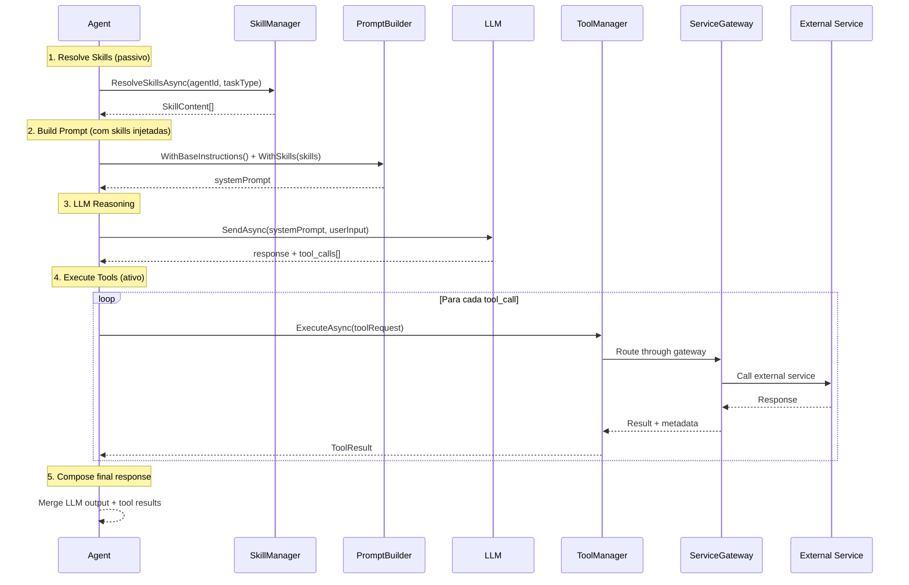

# Contrato: Skills vs Tools

> Definição formal da distinção entre **Skills** (conhecimento passivo) e **Tools** (capabilities ativas) no Sistema Agentic.

## TL;DR

| Aspecto | Skill | Tool |
|---------|-------|------|
| **Natureza** | Conhecimento / Instrução | Capability / Ação |
| **Tipo** | Passivo — informa decisões | Ativo — executa operações |
| **Analogia** | "Saber fazer" | "Fazer" |
| **Invocação** | Injetada no contexto do LLM | Chamada programática via interface |
| **Side effects** | Nenhum | Sim (I/O, APIs, DB) |
| **Exemplo** | "Como priorizar tarefas" | `ITool.ExecuteAsync(new ToolInput { ... })` |

---

## 1. Skill — Conhecimento Passivo

Uma **Skill** é um bloco de conhecimento ou instrução que **enriquece o contexto** do agent. Não executa nada — apenas informa como o agent deve se comportar ou raciocinar.

### Interface

```csharp
public interface ISkill
{
    string Id { get; }                    // "context-analysis", "creative-writing"
    string Name { get; }                  // Nome de exibição
    string Domain { get; }                // Domínio funcional
    SkillType Type { get; }               // Instruction, Knowledge, Template
    
    /// <summary>
    /// Retorna o conteúdo da skill para injeção no contexto LLM.
    /// Pode ser filtrado por taskType para relevância.
    /// </summary>
    Task<SkillContent> GetContentAsync(SkillContext context);
}

public enum SkillType
{
    Instruction,  // Regras de comportamento ("Sempre responda em JSON")
    Knowledge,    // Domínio de conhecimento ("Regras de priorização GTD")
    Template      // Templates reutilizáveis ("Formato de email profissional")
}

public record SkillContent
{
    public string SystemPromptFragment { get; init; }  // Injected into system prompt
    public string? FewShotExamples { get; init; }      // Optional few-shot examples
    public Dictionary<string, string>? Metadata { get; init; }
}

public record SkillContext
{
    public string AgentId { get; init; }
    public string? TaskType { get; init; }
    public string? UserInput { get; init; }
}
```

### Registro

```csharp
var skillManager = serviceProvider.GetRequiredService<ISkillManager>();
skillManager.RegisterSkill(new ContextAnalysisSkill());
skillManager.RegisterSkill(new CreativeWritingSkill());
skillManager.RegisterSkill(new EmailEtiquetteSkill());
```

### Uso pelo Agent

```csharp
public sealed class CreativeAgent : BaseAgent
{
    protected override async Task<string> BuildSystemPromptAsync(UserContext context, string currentInput)
    {
        return await _skillManager.BuildEnrichedPromptAsync(Name, Domain, Instructions);
    }
}
```

### Exemplos de Skills

| Skill ID | Tipo | Agents que usam | Conteúdo |
|----------|------|-----------------|----------|
| `context-analysis` | Instruction | MetaAgentOrchestrator / especialistas | Regras de classificação de intent |
| `intent-classification` | Knowledge | MetaAgentOrchestrator / especialistas | Taxonomia de intents conhecidos |
| `creative-writing` | Template | CreativeAgent | Técnicas e estruturas narrativas |
| `email-etiquette` | Instruction | WorkAgent | Tom, estrutura, formalidade |
| `data-analysis` | Knowledge | AnalysisAgent | Métodos estatísticos, visualização |
| `datetime-parsing` | Knowledge | CalendarAgent | Formatos, fusos, ambiguidades |
| `notification-templates` | Template | NotificationAgent | Templates de mensagem |

---

## 2. Tool — Capability Ativa

Uma **Tool** é uma capability executável que **realiza ações concretas** — chama APIs, lê/escreve dados, dispara processos. O contrato local é `ITool`; a governança e os eventos passam por `IToolManager` e pelo runtime quando configurados.

### Interface

```csharp
public interface ITool
{
    string Id { get; }
    string Name { get; }
    string Description { get; }
    ToolCategory Category { get; }
    bool RequiresAuth { get; }
    Task<ToolResult> ExecuteAsync(ToolInput input, CancellationToken ct = default);
    Task<bool> IsAvailableAsync(CancellationToken ct = default);
}

public enum ToolCategory
{
    Calendar,
    Email,
    Storage,
    Notes,
    Tasks,
    Search,
    Api,
    Database
}

public record ToolInput
{
    public string Action { get; init; } = string.Empty;
    public Dictionary<string, object> Parameters { get; init; } = new();
    public string? UserId { get; init; }
}

public record ToolResult
{
    public bool Success { get; init; }
    public object? Data { get; init; }
    public string? ErrorMessage { get; init; }
    public Dictionary<string, object>? Metadata { get; init; }
}
```

### Registro

```csharp
services.AddSingleton<ITool, DateTimeTool>();
services.AddSingleton<ITool, HttpTool>();
services.AddSingleton<ITool, CalculatorTool>();
services.AddSingleton<ITool, FileSearchTool>();
```

### Uso pelo Agent

```csharp
public sealed class CalendarAgent : BaseAgent
{
    public async Task<ToolResult> GetCurrentTimeAsync(string userId)
    {
        return await _toolManager.ExecuteToolAsync("datetime", new ToolInput
        {
            Action = "now",
            UserId = userId,
            Parameters = new()
            {
                ["timezone"] = "America/Sao_Paulo"
            }
        });
    }
}
```

### Exemplos de Tools

| Tool ID | Tipo | Category | Agents que usam | Ação |
|---------|------|----------|-----------------|------|
| `datetime` | Built-in | Calendar | CalendarAgent, PersonalAgent | Data, hora e cálculos temporais |
| `http` | Built-in | Api | APIAgent, WorkAgent | Requisições HTTP para serviços externos |
| `calculator` | Built-in | Database | AnalysisAgent | Cálculos numéricos e expressões simples |
| `file-search` | Built-in | Search | LearningAgent, CreativeAgent | Busca textual em arquivos locais |

---

## 3. Comparação Detalhada

```
                    SKILL                          TOOL
                ┌───────────┐                ┌───────────────┐
                │           │                │               │
  Input ───────►│  Context  │───► LLM        │   Execute     │───► External
                │  Enrich   │    Prompt      │   Action      │    Service
                │           │                │               │
                └───────────┘                └───────────────┘
                                                    │
                                             ┌──────▼──────┐
                                             │  Gateway    │
                                             │ CB · RL · $ │
                                             └─────────────┘

  Side effects?    ❌ Nenhum                    ✅ Sim (I/O, API, DB)
  Testável?        Unit test simples            Integration test + mocks
  Fallback?        N/A                          Via Gateway (próximo provider)
  Custo?           Zero (prompt injection)      Varia (API calls, tokens)
    Registro?        ISkill + SkillManager        ITool + DI + ToolManager
```

## 4. Resolução: SkillManager vs ToolManager

```csharp
// SkillManager — resolve skills relevantes para o contexto
public interface ISkillManager
{
    Task<IEnumerable<SkillContent>> GetSkillsForAgentAsync(string agentName, string domain);
    Task<string> BuildEnrichedPromptAsync(string agentName, string domain, string basePrompt);
    void RegisterSkill(ISkill skill);
}

// ToolManager — resolve e executa tools do runtime
public interface IToolManager
{
    Task<ToolResult> ExecuteToolAsync(string toolId, ToolInput input, CancellationToken ct = default);
    Task<IEnumerable<ITool>> GetAvailableToolsAsync(string? category = null);
    void RegisterTool(ITool tool);
}
```

## 5. Pipeline de Execução Completo



## 6. Regras de Governança

1. **Toda Tool passa pelo `IToolManager`** — o runtime aplica governança, eventos e políticas quando configurado.
2. **Skills são stateless** — não mantêm estado entre chamadas. Cada resolução é independente.
3. **Agent Registry define a binding** — o `agent-registry.json` declara quais skills e tools cada agent pode usar.
4. **Princípio do menor privilégio** — agents só têm acesso às tools declaradas no registry.
5. **Skills são composíveis** — um agent pode ter N skills, todas injetadas no prompt.
6. **Tools são substituíveis** — implementações podem trocar sem afetar o agent, desde que mantenham o mesmo `toolId` lógico.
