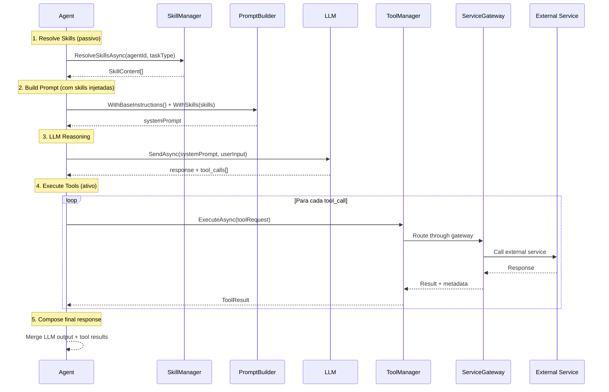

# Contrato: Skills vs Tools

> Definição formal da distinção entre **Skills** (conhecimento passivo) e **Tools** (capabilities ativas) no Sistema Agentic.

## TL;DR

| Aspecto | Skill | Tool |
|---------|-------|------|
| **Natureza** | Conhecimento / Instrução | Capability / Ação |
| **Tipo** | Passivo — informa decisões | Ativo — executa operações |
| **Analogia** | "Saber fazer" | "Fazer" |
| **Invocação** | Injetada no contexto do LLM | Chamada programática via interface |
| **Side effects** | Nenhum | Sim (I/O, APIs, DB) |
| **Exemplo** | "Como priorizar tarefas" | `ICalendarProvider.CreateEvent()` |

---

## 1. Skill — Conhecimento Passivo

Uma **Skill** é um bloco de conhecimento ou instrução que **enriquece o contexto** do agent. Não executa nada — apenas informa como o agent deve se comportar ou raciocinar.

### Interface

```csharp
public interface ISkill
{
    string Id { get; }                    // "context-analysis", "creative-writing"
    string Name { get; }                  // Nome de exibição
    string Domain { get; }                // Domínio funcional
    SkillType Type { get; }               // Instruction, Knowledge, Template
    
    /// <summary>
    /// Retorna o conteúdo da skill para injeção no contexto LLM.
    /// Pode ser filtrado por taskType para relevância.
    /// </summary>
    Task<SkillContent> GetContentAsync(SkillContext context);
}

public enum SkillType
{
    Instruction,  // Regras de comportamento ("Sempre responda em JSON")
    Knowledge,    // Domínio de conhecimento ("Regras de priorização GTD")
    Template      // Templates reutilizáveis ("Formato de email profissional")
}

public record SkillContent
{
    public string SystemPromptFragment { get; init; }  // Injected into system prompt
    public string? FewShotExamples { get; init; }      // Optional few-shot examples
    public Dictionary<string, string>? Metadata { get; init; }
}

public record SkillContext
{
    public string AgentId { get; init; }
    public string? TaskType { get; init; }
    public string? UserInput { get; init; }
}
```

### Registro

```csharp
// Em Program.cs ou via auto-discovery
services.AddSkill<ContextAnalysisSkill>();
services.AddSkill<CreativeWritingSkill>();
services.AddSkill<EmailEtiquetteSkill>();
```

### Uso pelo Agent

```csharp
public class CreativeAgent : AgentBase
{
    public override async Task<AgentResponse> ProcessAsync(AgentRequest request)
    {
        // Skills são injetadas automaticamente no prompt
        var skills = await _skillManager.ResolveSkillsAsync(
            agentId: this.Id,
            taskType: request.TaskType
        );
        
        var systemPrompt = _promptBuilder
            .WithBaseInstructions(this.SystemMessage)
            .WithSkills(skills)         // ← Skill content injected here
            .Build();
        
        return await _llm.SendAsync(new LLMRequest
        {
            SystemMessage = systemPrompt,
            UserMessage = request.Input,
            Parameters = this.LLMProfile.GetParameters(request.TaskType)
        });
    }
}
```

### Exemplos de Skills

| Skill ID | Tipo | Agents que usam | Conteúdo |
|----------|------|-----------------|----------|
| `context-analysis` | Instruction | MetaAgent | Regras de classificação de intent |
| `intent-classification` | Knowledge | MetaAgent | Taxonomia de intents conhecidos |
| `creative-writing` | Template | CreativeAgent | Técnicas e estruturas narrativas |
| `email-etiquette` | Instruction | WorkAgent | Tom, estrutura, formalidade |
| `data-analysis` | Knowledge | AnalysisAgent | Métodos estatísticos, visualização |
| `datetime-parsing` | Knowledge | CalendarAgent | Formatos, fusos, ambiguidades |
| `notification-templates` | Template | NotificationAgent | Templates de mensagem |

---

## 2. Tool — Capability Ativa

Uma **Tool** é uma capability executável que **realiza ações concretas** — chama APIs, lê/escreve dados, dispara processos. Sempre passa pelo ServiceGateway.

### Interface

```csharp
public interface ITool
{
    string Id { get; }                    // "calendar-provider", "email-sender"
    string Name { get; }                  // Nome de exibição
    string Category { get; }             // Calendar, Email, Storage, LLM...
    ToolType Type { get; }               // Provider, Utility, MCP
    
    /// <summary>
    /// Descreve os parâmetros que a tool aceita.
    /// Usado pelo LLM para decidir quando/como invocar.
    /// </summary>
    ToolSchema GetSchema();
    
    /// <summary>
    /// Executa a tool com os parâmetros fornecidos.
    /// Sempre passa pelo ServiceGateway (circuit breaker, rate limit, cost).
    /// </summary>
    Task<ToolResult> ExecuteAsync(ToolRequest request);
}

public enum ToolType
{
    Provider,   // Wraps an external service (Calendar, LLM, Vision)
    Utility,    // Internal utility (file parser, JSON transformer)
    MCP         // MCP plugin tool
}

public record ToolSchema
{
    public string Description { get; init; }
    public List<ToolParameter> Parameters { get; init; }
    public string ReturnType { get; init; }
}

public record ToolParameter
{
    public string Name { get; init; }
    public string Type { get; init; }           // "string", "int", "datetime"
    public bool Required { get; init; }
    public string Description { get; init; }
    public string? DefaultValue { get; init; }
}

public record ToolRequest
{
    public string ToolId { get; init; }
    public string AgentId { get; init; }        // Who is calling
    public string SessionId { get; init; }
    public Dictionary<string, object> Parameters { get; init; }
}

public record ToolResult
{
    public bool Success { get; init; }
    public object? Data { get; init; }
    public string? Error { get; init; }
    public ToolMetadata Metadata { get; init; }  // Cost, latency, provider used
}
```

### Registro

```csharp
// Registradas via DI e descobertas pelo ToolManager
services.AddTool<GoogleCalendarTool>();
services.AddTool<OutlookCalendarTool>();
services.AddTool<NotionNotesTool>();
services.AddTool<MCPPluginTool>();
```

### Uso pelo Agent

```csharp
public class CalendarAgent : AgentBase
{
    public override async Task<AgentResponse> ProcessAsync(AgentRequest request)
    {
        // 1. LLM interpreta intent e gera parâmetros
        var parsed = await _llm.SendAsync(new LLMRequest
        {
            SystemMessage = "Parse the scheduling request into structured params...",
            UserMessage = request.Input,
            Parameters = new() { Temperature = 0.0, ResponseFormat = "Json" }
        });
        
        // 2. Tool executa a ação (via Gateway)
        var result = await _toolManager.ExecuteAsync(new ToolRequest
        {
            ToolId = "calendar-provider",
            AgentId = this.Id,
            SessionId = request.SessionId,
            Parameters = parsed.AsParameters()  // ← Tool invoked here
        });
        
        return new AgentResponse
        {
            Content = $"Evento criado: {result.Data}",
            Metadata = result.Metadata
        };
    }
}
```

### Exemplos de Tools

| Tool ID | Tipo | Category | Agents que usam | Ação |
|---------|------|----------|-----------------|------|
| `calendar-provider` | Provider | Calendar | CalendarAgent, PersonalAgent | CRUD de eventos |
| `email-provider` | Provider | Email | WorkAgent, NotificationAgent | Enviar/ler emails |
| `storage-provider` | Provider | Storage | WorkAgent, LearningAgent | Upload/download arquivos |
| `notes-provider` | Provider | Knowledge | LearningAgent, CreativeAgent | CRUD Notion pages |
| `task-provider` | Provider | Tasks | PersonalAgent | CRUD Todoist/TickTick |
| `vision-provider` | Provider | Vision | AnalysisAgent | Análise de imagens |
| `notification-sender` | Utility | Notifications | NotificationAgent | Push notifications |
| `smart-router` | Utility | Orchestration | MetaAgent | Routing decision engine |
| `mcp-plugin-runner` | MCP | Plugin | APIAgent | Executa MCP plugins |

---

## 3. Comparação Detalhada

```
                    SKILL                          TOOL
                ┌───────────┐                ┌───────────────┐
                │           │                │               │
  Input ───────►│  Context  │───► LLM        │   Execute     │───► External
                │  Enrich   │    Prompt      │   Action      │    Service
                │           │                │               │
                └───────────┘                └───────────────┘
                                                    │
                                             ┌──────▼──────┐
                                             │  Gateway    │
                                             │ CB · RL · $ │
                                             └─────────────┘

  Side effects?    ❌ Nenhum                    ✅ Sim (I/O, API, DB)
  Testável?        Unit test simples            Integration test + mocks
  Fallback?        N/A                          Via Gateway (próximo provider)
  Custo?           Zero (prompt injection)      Varia (API calls, tokens)
  Registro?        ISkill + auto-discovery      ITool + DI + Gateway
```

## 4. Resolução: SkillManager vs ToolManager

```csharp
// SkillManager — resolve skills relevantes para o contexto
public interface ISkillManager
{
    Task<IReadOnlyList<SkillContent>> ResolveSkillsAsync(
        string agentId, 
        string? taskType = null);
    
    IReadOnlyList<ISkill> GetSkillsForAgent(string agentId);
    void RegisterSkill(ISkill skill);
}

// ToolManager — resolve e executa tools via Gateway
public interface IToolManager
{
    Task<ToolResult> ExecuteAsync(ToolRequest request);
    
    IReadOnlyList<ITool> GetToolsForAgent(string agentId);
    ToolSchema GetSchema(string toolId);
    void RegisterTool(ITool tool);
}
```

## 5. Pipeline de Execução Completo



## 6. Regras de Governança

1. **Toda Tool passa pelo Gateway** — sem exceções. Mesmo tools internas registram métricas.
2. **Skills são stateless** — não mantêm estado entre chamadas. Cada resolução é independente.
3. **Agent Registry define a binding** — o `agent-registry.json` declara quais skills e tools cada agent pode usar.
4. **Princípio do menor privilégio** — agents só têm acesso às tools declaradas no registry.
5. **Skills são composíveis** — um agent pode ter N skills, todas injetadas no prompt.
6. **Tools são substituíveis** — implementações podem trocar (ex: GoogleCalendar ↔ OutlookCalendar) sem afetar o agent.
