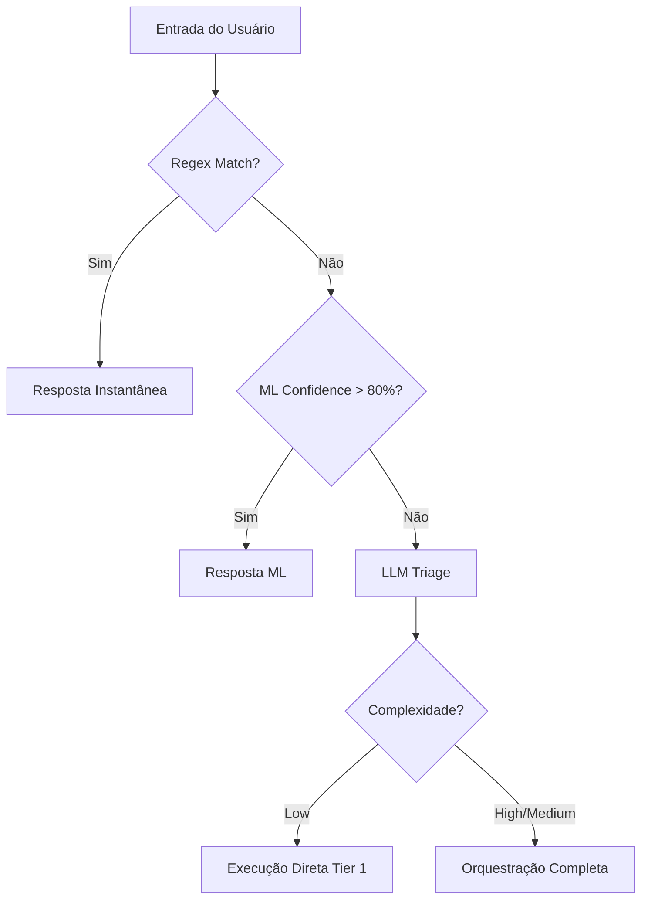

# 🧭 Smart Routing & Triage Architecture

## Overview
O **Smart Routing** é o mecanismo de roteamento inteligente do AgenticSystem, projetado para minimizar latência, reduzir custos de LLM e garantir que cada requisição seja tratada pelo agente mais adequado. Ele opera em um modelo de **múltiplas camadas (N-Tier Triage)**.

---

## 🏗️ As 3 Camadas de Triagem

O sistema processa a entrada do usuário através de três filtros sequenciais:

### 1. Camada 0: Regex Fast-Path (`ConversationalFastPathInterceptor`)
*   **Propósito**: Identificar saudações e interações triviais instantaneamente.
*   **Mecanismo**: Expressões regulares otimizadas e compiladas.
*   **Latência**: < 1ms.
*   **Exemplo**: "Oi", "Tudo bem?", "Bom dia".

### 2. Camada 0.5: ML Local Fast-Path (`MlFastPathInterceptor`)
*   **Propósito**: Classificar intenções simples que não exigem LLM, mas são variadas demais para Regex.
*   **Mecanismo**: Modelo **ML.NET (Multiclass Classification)** exportado para **ONNX**.
*   **Pipeline de Treino (Granular)**:
    1.  `TokenizeIntoWords`: Quebra o texto em tokens.
    2.  `MapValueToKey`: Mapeia tokens para chaves numéricas.
    3.  `ProduceNgrams`: Gera n-grams (unigrams/bigrams) para captura de contexto.
    4.  `OneHotHashEncoding`: Vetorização do texto.
    5.  `SdcaMaximumEntropy`: Algoritmo de classificação de alta performance.
*   **Exportação ONNX**: O pipeline utiliza apenas transformações compatíveis com o runtime ONNX, permitindo execução em cross-platform com latência mínima.
*   **Latência**: < 10ms (Local Inference).
*   **Exemplo**: Small talk variado, agradecimentos, perguntas sobre o estado do sistema.

### 3. Camada 1: LLM Triage (`TriageService`)
*   **Propósito**: Análise semântica profunda da complexidade e intenção.
*   **Mecanismo**: LLM de baixo custo (ex: `gpt-4o-mini` ou `gemini-1.5-flash`) com `ResponseFormat.Json`.
*   **Saída**: Objeto `QueryTriageResult` contendo:
    - `Intent`: (SmallTalk, DirectAnswer, ComplexReasoning)
    - `Complexity`: (Low, Medium, High)
    - `RequiresRAG`: Booleano
    - `RequiresTools`: Booleano
    - `RecommendedAgentTier`: Sugestão de especialista.

---

## 🎯 Fluxo de Decisão (Decision Tree)

---

## ⚙️ Configuração e Extensibilidade

### Adicionando Novos Interceptores
Novos interceptores podem ser adicionados implementando a interface `IFastPathInterceptor` e registrando-os no `IServiceCollection`. O `SmartRouter` os executará em ordem de registro.

### Otimização de Custos (FinOps)
Ao resolver requisições nas Camadas 0 e 0.5, o sistema evita chamadas de API externas, resultando em:
*   **Custo Zero** para interações básicas.
*   **Latência de UI** extremamente baixa.
*   **Resiliência**: O sistema responde saudações mesmo se o provedor de LLM estiver offline.
