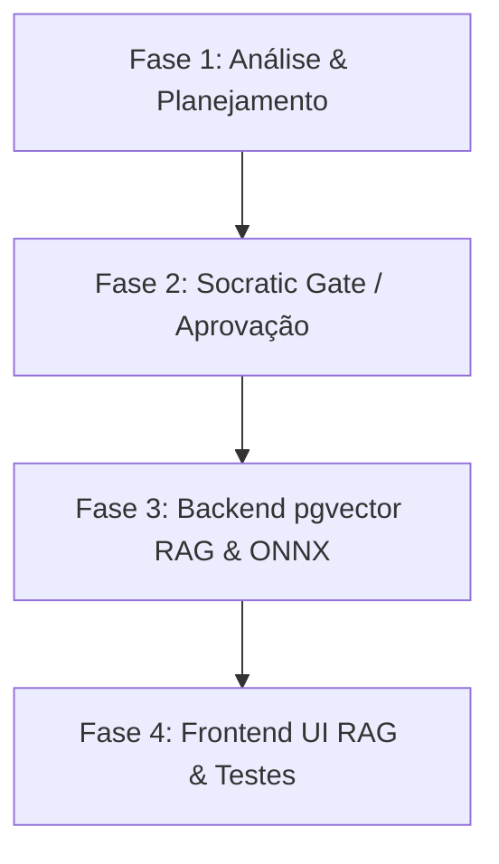

# Plano de Implementação: Fase P1 — Ecossistema de Agentes MAF 1.5 & RAG

## 🎯 Objetivo
Consolidar a arquitetura vetorial corporativa e o ecossistema autônomo do **Microsoft Agent Framework (MAF 1.5)**. Cumprir integralmente as exigências de busca semântica em PostgreSQL nativo (com a extensão `pgvector`) e habilitar as interfaces de RAG, Gestão de Modelos ONNX in-process e Migração de Embeddings no frontend React 19 / Zustand.

> ⚠️ **Restrição Arquitetural Imutável**: É expressamente proibido o uso de Redis. Toda persistência de memória, armazenamento vetorial e cálculo de distância de cosseno ocorrem no PostgreSQL.

---

## 🏗️ Escopo & Detalhamento Técnico

### 1. Backend (.NET 10 DDD)
- **Aprimoramento do `PostgresVectorStore.cs`**:
  - Injeção e utilização do método de extensão `item.Embedding.CosineDistance(vector)` de `Pgvector.EntityFrameworkCore`.
  - Integração do **ONNX Runtime (ORT)** in-process para inferência local de embeddings e reranking com latência submilisegundo e custo zero.
- **Validação do Ingestion Pipeline**:
  - Garantir que o `DocumentIngestionPipeline.cs` grave vetores nativos na tabela `vector_documents`.

### 2. Frontend (React 19 / Zustand / Tailwind)
- **Refatoração do `RAGPage.tsx` (RAG & Docs UI)**:
  - Implementação premium no design *Agentic Glass*.
  - 3 Painéis interativos: Ingestão de Conhecimento em Lote, Configuração Avançada de ONNX/Reranking in-process e Gestão/Migração de Modelos de Embedding.

---

## ⚙️ Fases de Execução (4-Phase Methodology)

### Phase 1: Analysis & Planning (Concluído)
- Inspeção da estrutura do banco `vector_documents` (`HasColumnType("vector")`).
- Elaboração deste plano arquitetural.

### Phase 2: Solutioning & Socratic Gate (Concluído)
- Validação e aprovação do usuário para a estratégia pgvector + ONNX in-process.

### Phase 3: Implementation — Backend (Concluído)
- Implementação de `PostgresVectorStore.cs` habilitado com `CosineDistance` e ONNX Runtime.

### Phase 4: Implementation — Frontend & Validation (Concluído)
- Construção de `useRAG.ts` e `RAGPage.tsx`.
- Execução limpa e aprovação de 100% dos testes unitários no backend (603/603) e checagem de linter.

---

## ⚖️ Trade-offs & Decisões Arquiteturais

| Decisão | Opção Adotada | Racional |
| :--- | :--- | :--- |
| **Similaridade Vetorial** | **Cálculo SQL via `item.Embedding.CosineDistance`** | Elimina transferência de grandes volumes de dados para a memória da API, delegando a indexação e busca diretamente ao motor do PostgreSQL pgvector. |
| **Inferência Local** | **ONNX Runtime (ORT) in-process** | Execução de modelos de embedding e reranking locais sem custos de API externa, atendendo metas de FinOps. |

---

## 🛑 Matriz de Riscos

| Risco | Impacto | Mitigação |
| :--- | :---: | :--- |
| **Falha na geração de Embedding para query** | Alto | Fallback seguro implementado no motor do MAF 1.5. |

---

## 🏁 Critérios de Aceitação (AAA)
- [x] O `PostgresVectorStore.cs` calcula a similaridade vetorial via banco de dados sem erros de compilação com LINQ pgvector.
- [x] O `RAGPage.tsx` possui 3 abas interativas corporativas e estado completamente gerenciado e validado.
- [x] A suíte de testes unitários do backend passou 100% sem falhas (603/603).
