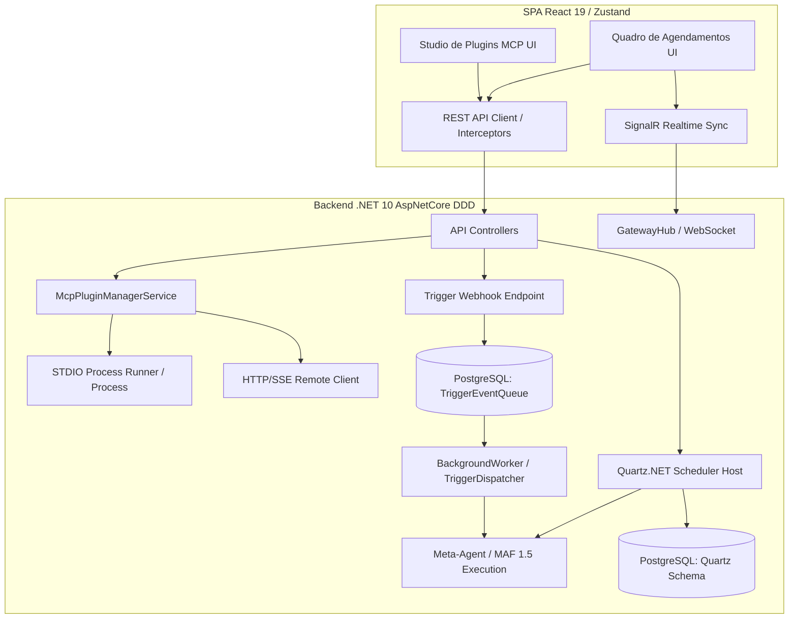

# ⚡ Plano de Implementação: Fase P3 - Extensibilidade & Automação (MCP & Jobs)

> [!NOTE]
> **ERRATA / RETIFICAÇÃO ARQUITETURAL (Maio de 2026)**
> As referências ao **Quartz.NET** neste documento representam o desenho original da Fase P3. Durante a implementação prática, a arquitetura evoluiu para um **Motor de Agendamento Customizado e Nativo em C#** (`ScheduledTaskHostedService`, `ScheduledTaskManager`, `PostgresScheduledTaskStore`), eliminando dependências externas pesadas e suportando nativamente DAGs (Directed Acyclic Graphs), retries com backoff exponencial e persistência via Entity Framework Core.

## 🎯 Objetivo Global
Tornar a arquitetura do **AgenticSystem** totalmente expansível por meio do carregamento dinâmico e seguro de plugins MCP (Model Context Protocol) e autônoma através de um motor robusto de agendamento de tarefas e regras de disparo condicionais baseadas em estímulos externos.

---

## 🏗️ Decisões Arquiteturais & Trade-offs (Socratic Gate)

Conforme alinhamento e aprovação do usuário, as seguintes abordagens foram estabelecidas:

1. **Host MCP (Task 3.1)**: **Opção A (Híbrido - STDIO Process Manager + HTTP/SSE)**. O backend em C# .NET 10 contará com um gerenciador de sub-processos para inicializar e monitorar plugins locais via canais de entrada/saída padrão (`stdio`), além de clientes HTTP para conectar a servidores MCP externos via SSE (Server-Sent Events).
2. **Motor de Tarefas Agendadas (Task 3.2)**: **Opção A (Quartz.NET no PostgreSQL)**. Utilizaremos o Quartz.NET com persistência relacional no PostgreSQL, garantindo alta resiliência, histórico de execuções e suporte nativo a clusterização (evitando disparos duplicados entre instâncias).
3. **Mecanismo de Regras de Disparo / Trigger Rules (Task 3.3)**: **Opção A (Fila PostgreSQL `TriggerEventQueue` + Webhooks)**. Criaremos um endpoint de Webhook REST API para recepção síncrona de eventos, que enfileirará os estímulos em uma tabela de banco de dados para processamento assíncrono por um Worker (BackgroundService), mantendo as APIs de entrada com baixíssima latência.

---

## 🏗️ Diagrama Arquitetural da Fase P3

---

## 📋 Detalhamento das Tarefas (Tasks & Sub-tasks)

### ⚙️ Backend (.NET 10 DDD)

#### Task 3.1: Host de Carregamento de Plugins MCP (`McpPluginHost`)
- [x] Criar entidade de domínio `McpPluginEntity` e DTOs de configuração (Nome, Transporte `STDIO/HTTP`, Command, Args, Url).
- [x] Implementar serviço de gerenciamento de processos `StdioMcpProcessRunner` com captura de `OutputDataReceived` e tratamento de erros de queda de processo.
- [x] Implementar cliente HTTP/SSE `HttpMcpClient` para comunicação com servidores externos.
- [x] Criar `McpPluginService` para registrar ferramentas MCP ativas no catálogo do Meta-Agent.

#### Task 3.2: Motor de Tarefas Agendadas (`ScheduledJobsEngine`)
- [x] Instalar e configurar pacotes do Quartz.NET (`Quartz.AspNetCore`, `Quartz.Serialization.Json`) no `ServiceCollectionExtensions`.
- [x] Adicionar migração do EF Core criando as tabelas padrão de persistência do Quartz no esquema PostgreSQL.
- [x] Criar entidade e caso de uso para agendamento de tarefas (`AgentJobScheduleEntity`) mapeando expressões Cron para execução de *Prompts* de agentes.
- [x] Implementar o job `AgentExecutionQuartzJob` que invoca o `LLMManager` / Meta-Agent e registra logs de resultado.

#### Task 3.3: Mecanismo de Regras de Disparo (`TriggerRulesEngine`)
- [x] Criar entidade `TriggerRuleEntity` (Condição, Expressão de Filtro, Agente Alvo) e tabela de fila `TriggerEventEntity`.
- [x] Implementar endpoint de Webhook genérico (`/api/v1/triggers/webhook/{ruleId}`) para ingestão rápida de estímulos de sistemas externos.
- [x] Desenvolver o `TriggerDispatcherWorker` (BackgroundService) que lê a fila de eventos, avalia as regras e dispara o agente alvo de forma assíncrona.

---

### 💻 Frontend (React 19 / Zustand)

#### Task 3.4: Studio de Plugins MCP UI (`McpStudioPage`)
- [x] Criar tela de listagem de plugins cadastrados exibindo status de conexão ao vivo (Online/Offline).
- [x] Modal de cadastro e edição de plugins MCP (seleção de modo de transporte: STDIO com comando local ou HTTP com URL remota).
- [x] Componente de inspecção de ferramentas (`McpToolsInspector`) para listar as *tools* descobertas no servidor MCP e permitir disparos de teste direto pela UI.

#### Task 3.5: Quadro de Agendamentos (`SchedulerBoardPage`)
- [x] Painel de listagem de *Scheduled Jobs* exibindo próxima execução prevista (Cron expression humanizada) e status (Ativo/Pausado).
- [x] Controles de ação rápida: botão de Pausa, Retomada e Disparo Manual Imediato.
- [x] Log visual de execuções recentes com indicadores de sucesso/falha e custo em tokens de cada job.

---

## 🏁 Critérios de Aceitação (AAA) & Verification
1. **Arrange**: Um plugin MCP de pesquisa de cotações financeiras (via STDIO) e um agendamento Cron diário são configurados no Studio UI.
2. **Act**: O job agendado dispara no horário estipulado e ativa o Meta-Agent com a pergunta "Qual a cotação atual para o fechamento?".
3. **Assert**: O Meta-Agent descobre a ferramenta do plugin MCP no catálogo local, executa o sub-processo STDIO com sucesso, obtém a cotação e salva o relatório na base sem erros.

---

## 🚀 Próximos Passos
- [x] Atualizar o roadmap mestre marcando a inicialização e conclusão da Fase P3.
- [x] Concluir a implementação e auditoria no Backend e Frontend.
