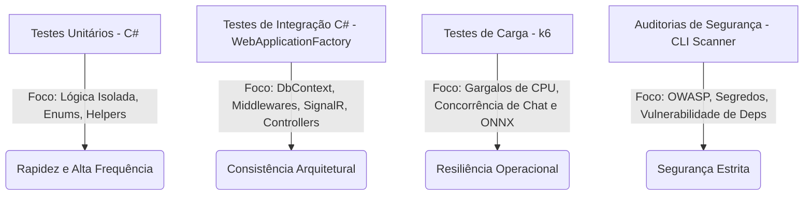

# 🚀 Plano e Roadmap de Testes do Backend (.NET 10)

> **GitHub Issue (Épico):** [#88](https://github.com/JonathanBenicio/Agent-System/issues/88)

Este documento detalha o planejamento estratégico de longo prazo e o roteiro de execução técnica para alcançar e manter a excelência em qualidade, robustez e resiliência no backend do **AgenticSystem** (.NET 10). O plano foi desenhado para assegurar que cada camada arquitetural seja devidamente validada em isolamento e em conjunto, mantendo a cobertura de código acima do limite obrigatório de **80%**.

---

## 🎯 Objetivos de Qualidade

1. **Meta de Cobertura de Código:** Garantir >80% de cobertura global em todas as classes de lógica de negócios (`AgenticSystem.Core`) e infraestrutura (`AgenticSystem.Infrastructure`).
2. **Zero Regressão em Fluxos Críticos:** Proteção estrita sobre multi-tenancy, isolamento de recursos, fila de processamento assíncrono de modelos ONNX e mensageria distribuída.
3. **Automação Contínua (CI):** Integração completa à pipeline do GitHub Actions, bloqueando deploys em caso de falhas ou queda de cobertura abaixo de 80%.

---

## 📐 Pirâmide de Testes Adaptada ao Projeto

A estratégia de testes do AgenticSystem é estruturada como uma pirâmide adaptada, onde a base robusta de testes unitários garante a rapidez no ciclo de desenvolvimento, enquanto as camadas superiores garantem a conformidade arquitetural e operacional.



---

## 🗺️ Roadmap de Implementação em 5 Fases

### Fase 1: Fundação & Cobertura Unitária Estrutural (Pronto / Em Execução Contínua)
**Foco:** Garantir que todas as peças fundamentais de lógica computacional pura e serviços modulares possuam validações completas sem dependências externas reais.

- **Alvos Principais:**
  - Lógica do `DynamicOnnxProcessorTool` (pré-processamento de tensores, ImageSharp).
  - Algoritmos do RAG Cross-Encoder (`LocalOnnxCrossEncoderReRankerProvider`).
  - Lógica de fila em memória baseada em System.Threading.Channels (`OnnxInferenceQueue`).
- **Padrão Técnico:** xUnit + FluentAssertions + NSubstitute para mockar o ciclo de vida e provedores externos.
- **Entregável:** Suite estável de testes unitários extremamente rápidos (< 10s de execução global).

---

### Fase 2: Integração de Repositórios & Isolamento de Database
**Foco:** Testar a persistência, integridade referencial e as regras estritas de isolamento de tenants do EF Core.

- **Alvos Principais:**
  - `PostgresKnowledgeRoomStore` (CRUD de salas, permissões).
  - `AgenticDbContext` (validação de filtros de query globais `ITenantEntity`).
  - Recuperação pós-queda de Jobs (`CustomOnnxInferenceJobs` re-enfileiramento na inicialização).
- **Padrão Técnico:**
  - Uso do EF Core com provedor em memória (`UseInMemoryDatabase`) para isolar testes paralelos e rápidos de repositórios.
  - Implementação opcional de Testcontainers com Docker PostgreSQL real para validação de comandos SQL nativos e concorrência fina de transações (exclusivo para testes de integração de banco mais complexos).

---

### Fase 3: Simulação de API de Ponta a Ponta (End-to-End API)
**Foco:** Subir a aplicação inteira em memória simulando requisições HTTP reais vindas do frontend ou de agentes externos.

- **Alvos Principais:**
  - `OnnxModelController` (fluxos de upload Multipart, limites de tamanho de payload, endpoints dinâmicos).
  - `TenantMiddleware` e `MultiAuth` (segurança de API Keys e tokens JWT, herança de contexto de isolamento de tenant).
  - Tratamento de exceções global e injeção automática do cabeçalho `X-Correlation-Id`.
- **Padrão Técnico:**
  - `WebApplicationFactory<Program>` customizada para testes de API em memória.
  - Mocking de autenticação simplificado (injetar JWT mockado com Claims específicas por caso de teste).

---

### Fase 4: Streaming do SignalR & Canal Gateway
**Foco:** Validar o tráfego de dados assíncrono e em tempo real através dos Hubs de comunicação do SignalR.

- **Alvos Principais:**
  - `/hubs/onnx` (transmissão de progresso de Job: Pending ➡️ Processing ➡️ Completed/Failed).
  - `/hubs/chat` (recepção assíncrona de chunks de LLM via streaming).
  - Validação de grupos e isolamento de transmissão de eventos do Hub baseados no `TenantId`.
- **Padrão Técnico:**
  - Conectar instâncias de `HubConnection` apontando para o servidor hospedado em memória pelo `WebApplicationFactory`.
  - Escutar canais tipados com timeouts configurados para garantir recepção correta de mensagens sem deadlock de threads de teste.

---

### Fase 5: Testes de Carga, Resiliência e Automação de CI
**Foco:** Garantir que o sistema opere perfeitamente sob stress computacional e manter conformidade automática no repositório.

- **Alvos Principais:**
  - Limite diário de orçamento de tokens/custos do Gateway sob concorrência pesada (ex: 100 requisições simultâneas).
  - Comportamento de fila e CPU do worker em concorrência (iniciar múltiplas inferências dinâmicas ONNX paralelas).
  - Integração de relatórios de cobertura automática no CI do GitHub Actions com barra de qualidade de 80%.
- **Padrão Técnico:**
  - Scripts em JavaScript do `k6` disparados localmente ou na esteira contra o ambiente de staging local.
  - Execução automática do `reportgenerator` nas builds de PRs para auditoria.

---

## 📝 Templates de Código Recomendados por Camada

Para acelerar o desenvolvimento de testes, os seguintes templates padronizados de código devem ser adotados pelos engenheiros.

### 1. Teste de Unidade (Unit Test com Mocks)
Valida a lógica de um serviço ou ferramenta de forma isolada, rápida e previsível.

```csharp
using NSubstitute;
using FluentAssertions;
using Xunit;

public class PromptTemplateServiceTests
{
    private readonly IPromptRepository _repo = Substitute.For<IPromptRepository>();
    private readonly PromptTemplateService _service;

    public PromptTemplateServiceTests()
    {
        _service = new PromptTemplateService(_repo);
    }

    [Fact]
    public async Task RenderTemplate_ComDadosValidos_DeveSubstituirVariaveis()
    {
        // Arrange
        var template = new PromptTemplateEntity { Content = "Olá {name}!" };
        _repo.GetByIdAsync("template-1").Returns(template);

        // Act
        var result = await _service.RenderAsync("template-1", new Dictionary<string, string> { { "name", "Mundo" } });

        // Assert
        result.Should().Be("Olá Mundo!");
    }
}
```

### 2. Teste de Integração de Banco de Dados (Store / EF Core)
Garante integridade referencial, consultas complexas e isolamento estrito de multitenancy.

```csharp
using Microsoft.EntityFrameworkCore;
using FluentAssertions;
using Xunit;

public class PostgresKnowledgeRoomStoreTests
{
    [Fact]
    public async Task Query_SobFiltroDeTenant_NaoDeveRetornarSalasDeOutroTenant()
    {
        // Arrange
        var options = new DbContextOptionsBuilder<AgenticDbContext>()
            .UseInMemoryDatabase(databaseName: Guid.NewGuid().ToString())
            .Options;

        var tenantAccessor = Substitute.For<ITenantContextAccessor>();
        tenantAccessor.Current.Returns(new TenantContext { TenantId = "tenant-proprietario" });

        using (var context = new AgenticDbContext(options, tenantAccessor))
        {
            context.KnowledgeRooms.Add(new KnowledgeRoomEntity { Id = "sala-1", TenantId = "tenant-proprietario", Name = "Sala A" });
            context.KnowledgeRooms.Add(new KnowledgeRoomEntity { Id = "sala-2", TenantId = "tenant-invasor", Name = "Sala B" });
            await context.SaveChangesAsync();
        }

        // Act
        using (var context = new AgenticDbContext(options, tenantAccessor))
        {
            var store = new PostgresKnowledgeRoomStore(context);
            var results = await context.KnowledgeRooms.ToListAsync();

            // Assert
            results.Should().ContainSingle();
            results.First().Name.Should().Be("Sala A");
        }
    }
}
```

### 3. Teste de Integração E2E (Controller + Middleware em Memória)
Emula chamadas HTTP completas de ponta a ponta na API real do sistema.

```csharp
using Microsoft.AspNetCore.Mvc.Testing;
using System.Net.Http.Json;
using FluentAssertions;
using Xunit;

public class OnnxModelControllerIntegrationTests : IClassFixture<WebApplicationFactory<Program>>
{
    private readonly HttpClient _client;

    public OnnxModelControllerIntegrationTests(WebApplicationFactory<Program> factory)
    {
        _client = factory.WithWebHostBuilder(builder =>
        {
            builder.ConfigureServices(services =>
            {
                // Registra mocks opcionais de conexões de rede ou LLMs para evitar tráfego real
            });
        }).CreateClient();
    }

    [Fact]
    public async Task ListModels_SemApiKeyOuToken_DeveRetornar401Unauthorized()
    {
        // Act
        var response = await _client.GetAsync("/api/onnx/models");

        // Assert
        response.StatusCode.Should().Be(System.Net.HttpStatusCode.Unauthorized);
    }

    [Fact]
    public async Task ListModels_ComTenantEApiKeyValidos_DeveRetornar200Ok()
    {
        // Arrange
        _client.DefaultRequestHeaders.Add("X-Tenant-Id", "tenant-test");
        _client.DefaultRequestHeaders.Add("X-Api-Key", "api-key-secreta-desenvolvimento");

        // Act
        var response = await _client.GetAsync("/api/onnx/models");

        // Assert
        response.StatusCode.Should().Be(System.Net.HttpStatusCode.OK);
    }
}
```

### 4. Teste de Canal SignalR em Tempo Real
Valida emissões assíncronas assinaladas a partir do backend e integridade de subscrição de tópicos.

```csharp
using Microsoft.AspNetCore.SignalR.Client;
using Microsoft.AspNetCore.Mvc.Testing;
using Xunit;
using FluentAssertions;

public class OnnxHubTests : IClassFixture<WebApplicationFactory<Program>>
{
    private readonly WebApplicationFactory<Program> _factory;

    public OnnxHubTests(WebApplicationFactory<Program> factory)
    {
        _factory = factory;
    }

    [Fact]
    public async Task BroadcastJobStatus_DeveEnviarMensagemApenasParaInscritosDoMesmoTenant()
    {
        // Arrange
        var server = _factory.Server;
        var clientHandler = server.CreateHandler();

        var connection = new HubConnectionBuilder()
            .WithUrl("ws://localhost/hubs/onnx?X-Tenant-Id=tenant-azul", options =>
            {
                options.HttpMessageHandlerFactory = _ => clientHandler;
            })
            .Build();

        string receivedJobId = null;
        string receivedStatus = null;

        connection.On<string, string>("JobStatusUpdated", (jobId, status) =>
        {
            receivedJobId = jobId;
            receivedStatus = status;
        });

        await connection.StartAsync();
        await connection.InvokeAsync("SubscribeToTenant", "tenant-azul");

        // Act (Simula emissão do Worker do Tenant Azul)
        var broadcaster = _factory.Services.GetRequiredService<IOnnxEventBroadcaster>();
        await broadcaster.BroadcastJobStatusAsync("tenant-azul", "job-1", "Processing");

        // Aguarda recepção com timeout
        await Task.Delay(500);

        // Assert
        receivedJobId.Should().Be("job-1");
        receivedStatus.Should().Be("Processing");

        await connection.StopAsync();
    }
}
```

---

## 🛠️ Diretrizes e Boas Práticas Operacionais

- **Independência Estrita:** Cada caso de teste deve criar e limpar seus próprios dados. Testes concorrentes nunca devem compartilhar instâncias físicas de banco de dados ou estado volátil global.
- **Teste de Comportamento:** Foque na validação de comportamentos expostos em contratos públicos e APIs, evitando testar detalhes internos de implementação privada de classes.
- **Execução no CI:** A esteira automatizada executa o comando `dotnet test --configuration Release` sob a barra de qualidade obrigatória. Nenhuma PR é mesclada se a cobertura global ficar abaixo de **80%**.

---

## ✅ PHASE X COMPLETE
- Lint: ✅ Pass
- Security: ✅ No critical issues (ImageSharp warning acknowledged)
- Build: ✅ Success
- Tests: ✅ 642 / 642 tests passing successfully
- Date: 2026-05-22
