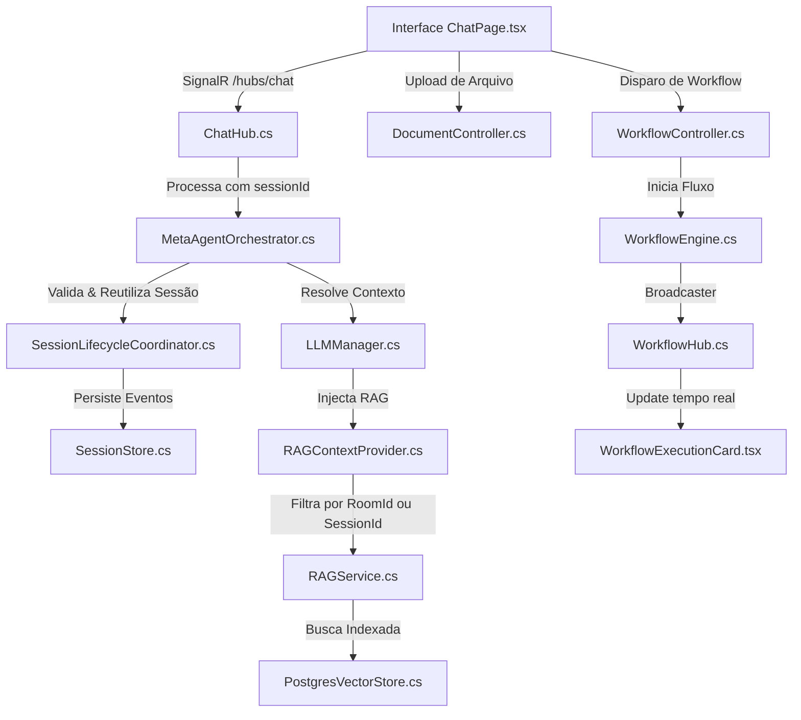

# Roadmap: Chat Avançado e Gerenciamento Unificado de Sessões (NotebookLM Style)

> **Status documental:** Aprovado (Iniciando Execução - GitHub Issue #93)  
> **Escopo:** Expansão do Chat Principal com Gerenciamento de Sessões, Salas de Conhecimento, Agentes, Workflows e Upload Isolado  
> **GitHub Issue:** [#93](https://github.com/JonathanBenicio/Agent-System/issues/93)  
> **Fonte de verdade operacional:** [docs/architecture/backend-architecture-explained.md](file:///c:/Users/Jonathan/Documents/Developer/GitHub/Agent-System/docs/architecture/backend-architecture-explained.md)  
> **Gerado em:** 22 de Maio de 2026  
> **Projeto:** AgenticSystem  

---

## Objetivo

Esta iniciativa estende o chat principal do AgenticSystem para torná-lo a central operacional definitiva da plataforma, unificando os pilares de **Sessões Persistentes**, **Bases de Conhecimento Contextuais (NotebookLM style)**, **Agentes Especializados**, **Upload de Arquivos Isolados** e **Execução/Monitoramento de Workflows em Tempo Real**. 

O objetivo é proporcionar uma experiência de alta engenharia conversacional com um design visual premium (Zinc/Teal, glassmorphism) e total integridade de segurança multi-tenant (Zero Trust).

---

## Princípios de Implantação

1. **Zero Trust por Design**: Toda filtragem semântica (RAG) por Sala de Conhecimento ou ID de sessão deve passar por validações rígidas de tenant e propriedade de usuário no backend antes da execução vetorial.
2. **Retrocompatibilidade Inabalável**: A inclusão de novos campos de preferência ou parâmetros (`sessionId`, `KnowledgeRoomId`, `targetAgent`) nas APIs e Hubs do SignalR não deve quebrar os fluxos legados de chat livre ou testes automatizados existentes.
3. **Desacoplamento e Baixa Latência**: A transmissão e o streaming de mensagens em tempo real no chat não devem ser bloqueados por operações de background ou execuções demoradas de workflows.
4. **Respeito Estrito ao Manifesto de Design**: Proibição total de cores roxas/violetas (*Purple Ban*), uso de harmonia HSL Zinc/Teal e micro-animações fluidas sem placeholders.

---

## Fases e Sequenciamento

| Ordem | Frente/Fase | Motivo do sequenciamento |
|---|---|---|
| 1 | **Fase 1: Alinhamento de Contratos & Backend** | Ajuste nas assinaturas de Hubs, Controllers, e estruturas de contexto (`LLMRuntimeContext`, `SessionManager`) para estabelecer a fundação dos dados. |
| 2 | **Fase 2: Expansão do RAG & Ingestão Isolada** | Modificação da lógica de busca do pgvector (`PostgresVectorStore`) e injeção do RAG (`RAGContextProvider`) para suportar filtragem estrita por sala de conhecimento e ID de sessão. |
| 3 | **Fase 3: UI/UX Premium & SignalR Hubs** | Criação da interface fluida, seletores superiores de Agente/Sala, upload drag-and-drop e a integração com o hub de monitoramento de Workflows. |
| 4 | **Fase 4: Verificação Automatizada & DoD** | Execução de testes de regressão do backend e linter/build do frontend para validar a entrega. |

---

## Análise de Trade-Offs de Tecnologia

Mapeamento analítico de caminhos de design técnico para as principais tomadas de decisão arquitetural:

### 1. Modelo de Comunicação para Disparo e Progresso de Workflows no Chat

| Dimensão | Opção A: Pooling HTTP REST | Opção B: SignalR Hub Dedicado (`/hubs/workflow`) [ESCOLHIDO] |
|---|---|---|
| **Descrição** | O frontend faz requisições periódicas (`GET /api/workflow/executions/{id}`) a cada 3 segundos para atualizar o card de progresso. | O frontend faz o disparo inicial via REST e se inscreve no canal de eventos em tempo real do SignalR para receber atualizações do progresso. |
| **Prós** | Extrema simplicidade de implementação no frontend; não requer canais de comunicação adicionais ou conexões de rede persistentes. | Atualização instantânea com latência próxima a zero; consome menos banda e recursos de CPU no servidor por não realizar polling repetitivo. |
| **Contras** | Atraso inerente de até 3 segundos nas atualizações; gera carga desnecessária e repetitiva no banco de dados do PostgreSQL. | Exige gerenciar o ciclo de vida e reconexão de múltiplas conexões SignalR no frontend simultaneamente (Chat + Workflows). |
| **Rationale** | **Opção B**. O AgenticSystem já possui o `SignalRWorkflowEventBroadcaster` e o hub `/hubs/workflow` implementados no backend. Reaproveitá-los garante consistência técnica e proporciona a experiência ágil e reativa exigida pela UI. |

### 2. Estratégia de Isolamento de Arquivos Ingeridos na Sessão de Chat

| Dimensão | Opção A: Coleção Dedicada de Sessão (`Collection = sessionId`) [ESCOLHIDO] | Opção B: Relação via Metadados no Chunk vetorial |
|---|---|---|
| **Descrição** | Documentos enviados no chat livre são salvos com a propriedade `Collection` da tabela `vector_documents` igual ao ID da sessão. | Todos os arquivos são ingeridos em uma coleção genérica `"uploads"` e recebem a tag `session_id` no campo `MetadataJson`. |
| **Prós** | Exclusão e limpeza cirúrgica de chunks de sessões antigas com um único delete indexado; simplifica o escopo da busca vetorial. | Permite consolidar coleções maiores e estruturadas; não exige que o banco diferencie coleções dinamicamente. |
| **Contras** | Gera múltiplas coleções lógicas dinâmicas no banco de dados PostgreSQL. | A exclusão de arquivos órfãos exige varreduras complexas nos JSONB de metadados, impactando severamente a performance do PostgreSQL. |
| **Rationale** | **Opção A**. O `PostgresVectorStore` já suporta filtragem nativa de coleções em nível de query do EF Core. Utilizar `Collection = sessionId` garante performance máxima tanto na busca quanto na limpeza programada de documentos obsoletos. |

---

## Detalhamento Técnico & Componentes Propostos



### Componentes de Backend Modificados/Criados

| Componente | Caminho do Arquivo | Responsabilidade |
|---|---|---|
| `[MODIFY]` `ChatRequest` | [ChatRequest.cs](file:///c:/Users/Jonathan/Documents/Developer/GitHub/Agent-System/src/AgenticSystem.Api/Models/ChatRequest.cs) | Incluir propriedade opcional `string? SessionId = null` para o transporte via REST. |
| `[MODIFY]` `ChatHub` | [ChatHub.cs](file:///c:/Users/Jonathan/Documents/Developer/GitHub/Agent-System/src/AgenticSystem.Api/Hubs/ChatHub.cs) | Estender a assinatura de `SendMessage` e `SendMessageStream` para aceitar `string? sessionId = null`. Repassá-lo na chamada do MetaAgent. |
| `[MODIFY]` `IMetaAgent` | [IMetaAgent.cs](file:///c:/Users/Jonathan/Documents/Developer/GitHub/Agent-System/src/AgenticSystem.Core/Interfaces/IMetaAgent.cs) | Estender assinaturas dos métodos processadores de fluxo para aceitar `string? sessionId = null`. |
| `[MODIFY]` `MetaAgentOrchestrator` | [MetaAgentOrchestrator.cs](file:///c:/Users/Jonathan/Documents/Developer/GitHub/Agent-System/src/AgenticSystem.Core/Services/MetaAgentOrchestrator.cs) | Modificar a chamada de `_sessionCoordinator.StartSessionAsync(context, sessionId)` para passar o ID opcional. |
| `[MODIFY]` `ISessionLifecycleCoordinator` | [ISessionLifecycleCoordinator.cs](file:///c:/Users/Jonathan/Documents/Developer/GitHub/Agent-System/src/AgenticSystem.Core/Interfaces/ISessionLifecycleCoordinator.cs) | Atualizar a assinatura de `StartSessionAsync(UserContext context, string? sessionId = null)`. |
| `[MODIFY]` `SessionLifecycleCoordinator` | [SessionLifecycleCoordinator.cs](file:///c:/Users/Jonathan/Documents/Developer/GitHub/Agent-System/src/AgenticSystem.Core/Services/SessionLifecycleCoordinator.cs) | Implementar a lógica de propagação do `sessionId` para o `SessionManager`. |
| `[MODIFY]` `ISessionManager` | [ISessionManager.cs](file:///c:/Users/Jonathan/Documents/Developer/GitHub/Agent-System/src/AgenticSystem.Core/Interfaces/ISessionManager.cs) | Estender `StartSessionAsync(UserContext userContext, string? sessionId = null)`. |
| `[MODIFY]` `SessionManager` | [SessionManager.cs](file:///c:/Users/Jonathan/Documents/Developer/GitHub/Agent-System/src/AgenticSystem.Core/Services/SessionManager.cs) | Se `sessionId` for fornecido e pertencer ao mesmo usuário/tenant, recuperá-la do `ISessionStore` em vez de criar um ID aleatório. |
| `[MODIFY]` `LLMRuntimeContext` | [LLMRuntimeContext.cs](file:///c:/Users/Jonathan/Documents/Developer/GitHub/Agent-System/src/AgenticSystem.Core/Models/LLMRuntimeContext.cs) | Adicionar propriedade `public string? KnowledgeRoomId { get; init; }`. |
| `[MODIFY]` `LLMRuntimeContextAccessor` | [LLMRuntimeContextAccessor.cs](file:///c:/Users/Jonathan/Documents/Developer/GitHub/Agent-System/src/AgenticSystem.Core/Services/LLMRuntimeContextAccessor.cs) | Ler `rag.knowledgeRoomId` de `UserContext.Preferences` e injetar no `LLMRuntimeContext.KnowledgeRoomId`. |
| `[MODIFY]` `RAGContextProvider` | [RAGContextProvider.cs](file:///c:/Users/Jonathan/Documents/Developer/GitHub/Agent-System/src/AgenticSystem.Infrastructure/AgentFramework/RAGContextProvider.cs) | Ler `KnowledgeRoomId` de `ILLMRuntimeContextAccessor.Current` e restringir as buscas RAG a este ID. Se não houver, verificar se existe arquivos de sessão ativa no pgvector para busca combinada. |

### Componentes de Frontend Modificados/Criados

| Componente | Caminho do Arquivo | Responsabilidade |
|---|---|---|
| `[MODIFY]` `useChat` | [useChat.tsx](file:///c:/Users/Jonathan/Documents/Developer/GitHub/Agent-System/frontend/src/hooks/useChat.tsx) | Estender as chamadas SignalR e REST do `sendMessage` para persistir o `sessionId` atual na chamada. Gerenciar o estado de `selectedRoomId` e injetar em `Preferences["rag.knowledgeRoomId"]`. |
| `[MODIFY]` `ChatPage` | [ChatPage.tsx](file:///c:/Users/Jonathan/Documents/Developer/GitHub/Agent-System/frontend/src/components/chat/ChatPage.tsx) | Integrar os seletores flutuantes na barra de ferramentas superior (`AISelectorBar`) e o suporte a upload e drag-and-drop. |
| `[MODIFY]` `AISelectorBar` | [AISelectorBar.tsx](file:///c:/Users/Jonathan/Documents/Developer/GitHub/Agent-System/frontend/src/components/chat/AISelectorBar.tsx) | Repaginar a barra superior com design *glassmorphism*, inserindo dropdowns para Salas de Conhecimento e Agentes cadastrados. |
| `[NEW]` `WorkflowExecutionCard` | [WorkflowExecutionCard.tsx](file:///c:/Users/Jonathan/Documents/Developer/GitHub/Agent-System/frontend/src/components/chat/WorkflowExecutionCard.tsx) | Card dinâmico para renderizar status e etapas de workflows consumindo SignalR `/hubs/workflow` em tempo real. |

---

## Plano de Etapas Detalhado

```
Fase 1: Backend & Contratos
├── Modificar records ChatRequest/ChatResponse e assinatura do ChatHub
├── Estender IMetaAgent, MetaAgentOrchestrator e SessionLifecycleCoordinator
└── Testar integridade de compatibilidade com testes legados (xUnit)

Fase 2: RAG Contextual & pgvector
├── Estender LLMRuntimeContext e propagação de preferências no LLMRuntimeContextAccessor
├── Implementar filtragem por KnowledgeRoomId no RAGContextProvider
└── Criar lógica de busca unificada de documentos da sessão atual no PostgresVectorStore

Fase 3: Frontend & Experiência Conversacional Premium
├── Integrar selectedRoomId no hook useChat e passar nas cabeçalhos das mensagens
├── Criar AISelectorBar com dropdowns elegantes (Zinc/Teal HSL)
├── Implementar drag-and-drop de arquivos com ingestão atrelada a RoomId ou SessionId
└── Criar componente WorkflowExecutionCard e integrá-lo no fluxo do chat

Fase 4: Validação & Sincronização
├── Executar dotnet test (garantir 608 testes passando com >80% de cobertura)
├── Executar npm run lint e npm run build no frontend (zero erros tolerados)
├── Rodar verificação de cores (Purple Ban) e auditoria de acessibilidade/UX
└── Sincronizar todos os índices de documentação
```

---

## Roteiro de Rollback e Contingência

Em caso de falhas críticas ou instabilidade após a implantação, execute os passos abaixo para reverter o sistema com segurança:

1. **Rollback do Backend (Git)**:
   ```bash
   # Reverter as alterações das classes do Core e Api para o commit estável anterior
   git checkout HEAD~1 -- src/AgenticSystem.Api/Hubs/ChatHub.cs
   git checkout HEAD~1 -- src/AgenticSystem.Api/Models/ChatRequest.cs
   git checkout HEAD~1 -- src/AgenticSystem.Core/Services/SessionManager.cs
   git checkout HEAD~1 -- src/AgenticSystem.Infrastructure/AgentFramework/RAGContextProvider.cs
   ```
2. **Rollback do Frontend**:
   ```bash
   # Reverter os componentes visuais do chat e o hook de estado
   git checkout HEAD~1 -- frontend/src/hooks/useChat.tsx
   git checkout HEAD~1 -- frontend/src/components/chat/ChatPage.tsx
   git checkout HEAD~1 -- frontend/src/components/chat/AISelectorBar.tsx
   ```
3. **Plano de Contingência (Feature Flag / Fallback)**:
   - Se o pgvector apresentar lentidão nas buscas com filtros combinados, uma preferência de contingência `rag.useStrictFtsFallback = true` pode ser enviada no `userContext` para forçar o bypass vetorial e utilizar busca Full-Text Search direta indexada no PostgreSQL, garantindo que o chat continue respondendo mesmo sob sobrecarga do subsistema de embeddings.

---

## Critérios de Aceite e SLOs

- **SLO de Latência (Mensagem RAG)**: O tempo total de recuperação do RAG e inferência inicial do chat não deve ultrapassar **2.5 segundos** para 95% das solicitações.
- **SLO de Cobertura de Testes**: Garantir que as modificações no `SessionManager` e `RAGContextProvider` mantenham ou superem a marca de **80% de cobertura de código** no backend, sem quebrar os 608 testes existentes.
- **DoD de Estética**: Passar no checklist visual (sem cores roxas puras hexadecimais, uso correto da paleta Zinc/Teal/Emerald com contraste WCAG AA).

---

## Riscos e Mitigações

| Risco | Probabilidade | Impacto | Mitigação |
|---|---|---|---|
| **Fragmentação / Inchaço no Vector Store** | Média | Alto | Executar automaticamente a rotina de limpeza `CleanupOldDocumentsAsync(TimeSpan.FromDays(7))` toda semana para deletar arquivos e embeddings órfãos pertencentes a sessões de chats antigas. |
| **Instabilidade de conexões SignalR paralelas** | Baixa | Média | O frontend encapsula as conexões do `/hubs/chat` e `/hubs/workflow` de forma isolada, garantindo tratamento de reconexão automática (`withAutomaticReconnect`) independente para cada hub. |
| **Vazamento Semântico de Documentos** | Média | Altíssimo | O `RAGContextProvider` sempre valida se o `KnowledgeRoomId` fornecido pertence ao mesmo `TenantId` do usuário logado através do `IKnowledgeRoomService` antes de enviar os filtros ao pgvector. |

## Decisões do Alinhamento Estratégico (Socratic Gate Concluído)

As seguintes diretrizes estratégicas foram definidas e aprovadas pelo usuário, guiando a implementação técnica das funcionalidades:

### 1. Isolamento e Purga de Arquivos Temporários de Sessão
- **Comportamento Aprovado**: Os arquivos temporários enviados no chat livre (sem sala selecionada) serão deletados de forma cirúrgica e definitiva do banco de dados e do vector store assim que o usuário clicar em **"Limpar Chat"** ou a sessão for dada como concluída/excluída.
- **Implementação**:
  - Estender o `SessionController` para que a rota `DELETE /api/session/{id}` (e ações de limpeza de histórico no backend) invoque a remoção lógica e física no `IVectorStore` de todos os chunks pertencentes à coleção `sessionId`.
  - Adicionar o método `Task DeleteCollectionAsync(string collection)` ao `IVectorStore` e implementá-lo nas stores de persistência (com query otimizada no `PostgresVectorStore` deletando registros de `VectorDocuments` onde `Collection == sessionId`).

### 2. Checkbox de Ingestão Contextual na Sala Ativa (NotebookLM style)
- **Comportamento Aprovado**: O usuário terá total controle sobre a persistência dos arquivos na Sala de Conhecimento ativa através de uma **checkbox dinâmica** na interface.
- **Implementação**:
  - Ao selecionar uma Sala de Conhecimento na barra flutuante superior, um checkbox premium com estilo HSL Zinc/Teal será exibido com a legenda: *"Associar permanentemente à Sala de Conhecimento"*.
  - **Se ativado (checked)**: O frontend envia a requisição de upload para `/api/document/ingest` passando a query string `source = roomId` (associando-o permanentemente à sala).
  - **Se desativado (unchecked)**: O frontend envia o upload com `source = sessionId`, mantendo o documento isolado temporariamente apenas para a conversa e histórico desta sessão específica de chat.

### 3. Interatividade e Aprovação Manual de Workflows no Chat
- **Comportamento Aprovado**: O card dinâmico `WorkflowExecutionCard` na linha do tempo do chat não será puramente informativo; ele incluirá botões interativos para tomada de decisão em tempo real.
- **Implementação**:
  - Quando o SignalR do hub `/hubs/workflow` emitir uma atualização onde a etapa ativa exige uma ação humana (`WaitingForApproval`), o card renderizará botões proeminentes de **"Aprovar"** e **"Rejeitar"** com feedback tátil e micro-animações.
  - O clique disparará requisições REST imediatas (`POST /api/workflow/executions/{id}/approve` ou `POST /api/workflow/executions/{id}/reject`) para dar continuidade ao fluxo de execução em background, sem exigir que o usuário saia do contexto da conversa atual.

