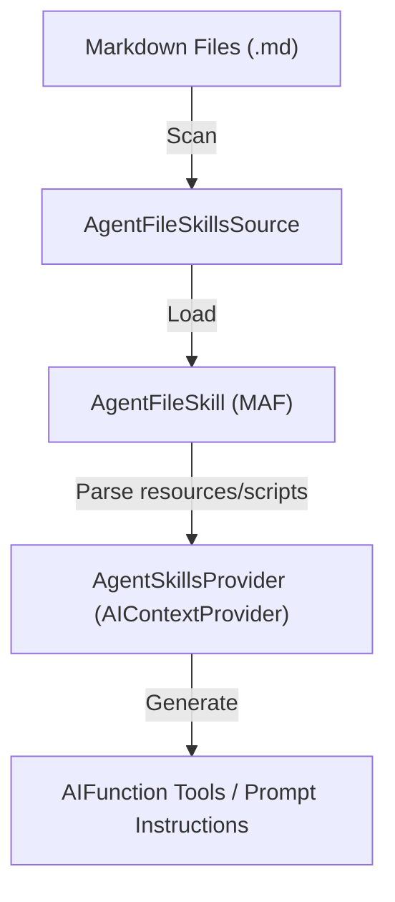

# Roadmap: Migração para Uso Nativo do Microsoft Agent Framework (MAF) 1.6.1

> **Status documental:** Planejamento Futuro / Proposta de Arquitetura
> **Escopo:** Substituição de middlewares, persistências e gerenciamentos customizados pelas implementações nativas do MAF .NET na versão 1.6.1.
> **Gerado em:** 2026-05-23
> **Projeto:** AgenticSystem (Backend .NET 10)

---

## 🎯 Objetivo

O objetivo deste roadmap é guiar a evolução arquitetural do **AgenticSystem** para alinhar-se 100% com o padrão oficial do **Microsoft Agent Framework (MAF) 1.6.1**. Atualmente, o projeto possui recursos de produção avançados (como RAG e isolamento por Tenant), porém implementados de forma proprietária. A transição para o uso nativo reduzirá o custo de manutenção de código customizado, padronizará o ecossistema com ferramentas corporativas da Microsoft e habilitará resiliência nativa com estado durável, auditorias semânticas e segurança label-based (FIDES).

---

## 🔌 Diagnóstico: O que JÁ usamos nativamente (Versão 1.5.0)

O sistema atual faz uso excelente das bases fundamentais do MAF no projeto `AgenticSystem.Infrastructure`:

1. **Agentes Core (`AIAgent` & `ChatClientAgent`):** Instanciação declarativa usando `ChatClientAgent` e envelopando o `IChatClient` do `Microsoft.Extensions.AI`.
2. **Histórico e Conversa (`AgentSession`):** A estrutura de sessão é passada nativamente para os fluxos do modelo, embora sua persistência física seja traduzida.
3. **Orquestração de Fluxo (`InProcessExecution` / `AgentWorkflowBuilder`):** A execução paralela e o roteamento inteligente (*handoff*) usam o grafo em processo oficial do MAF.
4. **Acoplamento de Ferramentas (`AITool` / `AgentToolBinding`):** Tradução nativa de métodos e especialistas em assinaturas de chamada de função da LLM.
5. **Interceptação de Contexto (`AIContextProvider`):** Nosso `RAGContextProvider` estende a classe abstrata oficial para modificar prompts dinamicamente.
6. **Protocolos de Hospedagem Web:** O projeto expõe endpoints compatíveis de AG-UI e A2A usando pacotes de pré-visualização oficiais (`Microsoft.Agents.AI.Hosting.A2A.AspNetCore` e `Microsoft.Agents.AI.Hosting.AGUI.AspNetCore`).

---

## 🏗️ Princípios de Implantação

Para garantir que a migração não impacte a operação atual e mantenha a estabilidade:

1. **Isolamento de Tenant Inegociável:** Qualquer substituição do gerenciador de sessão para soluções como *Durable Task* deve manter a barreira rígida de isolamento de dados baseada em `X-Tenant-Id`.
2. **Retrocompatibilidade de Agentes:** A introdução do parser YAML com *PowerFx* deve aceitar os arquivos de manifesto existentes sem quebrar o catálogo atual.
3. **Migração em Phased Parallelism:** As novas persistências de sessão durável devem rodar em paralelo com a persistência em banco atual antes do desligamento definitivo da antiga.
4. **Zero Impacto no Latency Budget:** Ferramentas de auditoria e segurança nativas (como FIDES e Evaluators) não podem adicionar mais de 50ms de overhead em requisições críticas de chat.

---

## 🗺️ Fases e Sequenciamento do Roadmap

| Ordem | Frente/Fase | Motivo do sequenciamento |
| :---: | :--- | :--- |
| **1** | **Upgrade de Infraestrutura (1.5.0 → 1.6.1)** | Alinhar dependências e NuGet packages para habilitar os novos namespaces oficiais. |
| **2** | **Padronização do Skills Framework** | Organizar o catálogo conceitual em structs oficiais do MAF antes de persistir estados duráveis. |
| **3** | **Persistência e Sessão Durável (Durable Task)** | Substituir a persistência customizada e viabilizar resiliência a falhas no backend. |
| **4** | **Configuração Declarativa Avançada (PowerFx)** | Integrar suporte dinâmico no carregamento de agentes de YAML sem código em C#. |
| **5** | **Segurança e Isolamento (FIDES & WASM Sandboxing)**| Elevar os critérios de conformidade e isolar execuções de ferramentas arbitrárias. |
| **6** | **Ecosystem & Observability (DevUI & Evaluation)**| Implantar ferramentas de análise visual e testes automatizados semânticos. |

---

## 🚀 Detalhamento das Fases

### Fase 1: Upgrade de Infraestrutura (1.5.0 → 1.6.1)
#### Por que implementar?
Preparar o ecossistema com as bibliotecas atualizadas e corrigir possíveis incompatibilidades de assinaturas introduzidas na versão 1.6.1.
#### Componentes propostos
* **`AgenticSystem.Infrastructure.csproj` / `AgenticSystem.Api.csproj`:** Atualizar referências NuGet do MAF de `1.5.0` para `1.6.1`.
#### Plano por etapas
1. Elevar as versões das dependências nos arquivos `.csproj` do backend.
2. Compilar a solução e corrigir quebras de assinatura em APIs de `AIAgentBuilder`, `InProcessExecution` e `ChatClientAgent`.
3. Executar o conjunto de testes unitários existente (608 testes) para garantir regressão zero.

---

### Fase 2: Padronização do Skills Framework (`Microsoft.Agents.AI.Skills`)
#### Por que implementar?
Padronizar a forma como habilidades baseadas em instruções e scripts são expostas aos agentes. Atualmente, Skills são tratadas de forma simples como prompts estáticos por banco.
#### Arquitetura-alvo

#### Componentes propostos
| Componente | Papel |
| :--- | :--- |
| `AgentFileSkillsSource` | Varre diretórios de recursos carregando definições markdown estruturadas. |
| `AgentSkillsProvider` | Atua como `AIContextProvider` nativo, injetando instruções e registrando funções delegadas dinamicamente na LLM. |
#### Plano por etapas
1. Adaptar o `ISkillManager` para servir como uma fonte de skills aderente à abstração `AgentSkillsSource` do MAF.
2. Implementar a transição das diretrizes de prompt das skills para markdown carregados por `AgentFileSkill`.
3. Integrar o `AgentSkillsProvider` no `AIAgentBuilder` para automatizar a geração de ferramentas com base no catálogo de habilidades ativas do agente.

---

### Fase 3: Persistência e Sessão Durável (`Microsoft.Agents.AI.DurableTask`)
#### Por que implementar?
Garantir resiliência completa para workflows de longa duração e interações que necessitam de intervenção humana (HITL).
#### Componentes propostos
| Componente | Papel |
| :--- | :--- |
| `DurableAIAgent` | Agente oficial executando sob contexto durável e replicável. |
| `AgentEntity` (`TaskEntity`) | Gerenciador do ciclo de vida da sessão persistente e aplicação de TTL automático para remoção de lixo. |
| `DurableAgentJsonUtilities` | Serialização altamente otimizada via *source generators* compatível com compilação AOT do .NET 10. |
#### Plano por etapas
1. Instalar o pacote NuGet `Microsoft.Agents.AI.DurableTask`.
2. Substituir a inicialização do `ChatClientAgent` pelo `DurableAIAgent` nos fluxos de background de longa duração.
3. Migrar a persistência do banco customizada no Postgres para rodar como o provedor oficial de persistência da sessão suportada pelo `AgentEntity`.
4. Utilizar `DurableAgentJsonUtilities` para mapear tipos complexos de estado nos *Source Generators* do projeto Api.

---

### Fase 4: Configuração Declarativa Avançada (`Microsoft.Agents.AI.Declarative` / PowerFx)
#### Por que implementar?
Remover código de configuração estática no C# permitindo que administradores escrevam manifestos YAML altamente dinâmicos com regras lógicas avançadas.
#### Componentes propostos
| Componente | Papel |
| :--- | :--- |
| `PromptAgentFactory` | Cria agentes a partir de metadados declarativos. |
| `RecalcEngine` (PowerFx) | Avalia expressões dinâmicas lógicas/matemáticas (ex: calcular orçamentos com base no tier) em runtime. |
#### Plano por etapas
1. Instalar o pacote `Microsoft.Agents.AI.Declarative` e a dependência `Microsoft.PowerFx`.
2. Integrar o `RecalcEngine` no ciclo de leitura do `AgentYamlValidator`.
3. Atualizar o modelo de manifestos YAML dos agentes para aceitar expressões como `BoolExpression` e `IntExpression` dinamicamente carregadas pelas variáveis de configuração do Tenant.

---

### Fase 5: Segurança e Sandbox (FIDES & WASM Sandboxing)
#### Por que implementar?
Mitigar riscos graves de vazamento de dados de Tenants e execução prejudicial de comandos na infraestrutura do servidor por agentes inteligentes.
#### Componentes propostos
| Componente | Papel |
| :--- | :--- |
| `FIDES Middleware` | Rastreamento e ocultação de variáveis baseado em etiquetas confidenciais de dados. |
| `HyperlightExecuteCodeTool` | Executor isolado de scripts arbitrários em ambiente WebAssembly de alta velocidade (WASM). |
#### Plano por etapas
1. Implementar o middleware FIDES no pipeline do `AIAgentBuilder` to monitorar e etiquetar a entrada de dados do usuário sensíveis.
2. Configurar regras de segurança determinísticas que bloqueiam vazamentos de dados rotulados antes que sejam transmitidos ao modelo.
3. Substituir qualquer execução local de linha de comando (`process.Start`) no backend pelo uso integrado de `HyperlightExecuteCodeTool` para isolar ferramentas de código em sandboxes nativas.

---

### Fase 6: Ecossistema e Observabilidade (DevUI & Evaluation)
#### Por que implementar?
Fornecer instrumentação semântica rica, dashboards de diagnóstico integrados e avaliação de qualidade contínua em produção.
#### Componentes propostos
| Componente | Papel |
| :--- | :--- |
| `DevUIMiddleware` | Expõe a interface visual de debug e teste local do MAF. |
| `LocalEvaluator` & `MeaiEvaluatorAdapter` | Subsistemas de avaliação contínua de groundness, acurácia e detecção de alucinações. |
#### Plano por etapas
1. Instalar o pacote `Microsoft.Agents.AI.DevUI` e mapear as rotas correspondentes no pipeline do `Program.cs` apenas sob a flag `#if DEBUG`.
2. Configurar o `DevUIAuthFilter` para garantir acesso estrito a conexões de desenvolvimento local.
3. Criar rotinas automatizadas de testes pós-ingestão usando o `SampleRunner` e o `SampleVerifier` para validar a taxa de acurácia de respostas semânticas sem depender de validação manual.

---

## ⚠️ Riscos e Mitigações

| Risco | Mitigação |
| :--- | :--- |
| **Quebras de Performance por Telemetria/FIDES:** O monitoramento contínuo de fluxo de informações pode gerar lentidão no processamento das threads de chat. | Executar testes de carga usando o script `tests/k6/load-test.js` após a implantação do FIDES, assegurando que o tempo de resposta permaneça abaixo de 300ms por token. |
| **Acoplamento do Durable Task à Infraestrutura:** O uso do Durable Task Framework pode exigir infraestrutura complexa de persistência. | Configurar o provedor do Durable Task para persistir os estados de orquestração na mesma base PostgreSQL já existente através de tabelas de orquestração, mantendo a simplicidade operacional do banco atual. |
| **Complexidade no PowerFx por Usuários:** Administradores podem errar a sintaxe ao escrever fórmulas do PowerFx nos YAMLs de agentes. | Implementar uma camada de validação estática no `AgentYamlValidator` que valida expressões lógicas em PowerFx *antes* do salvamento ou deploy do arquivo no sistema. |
