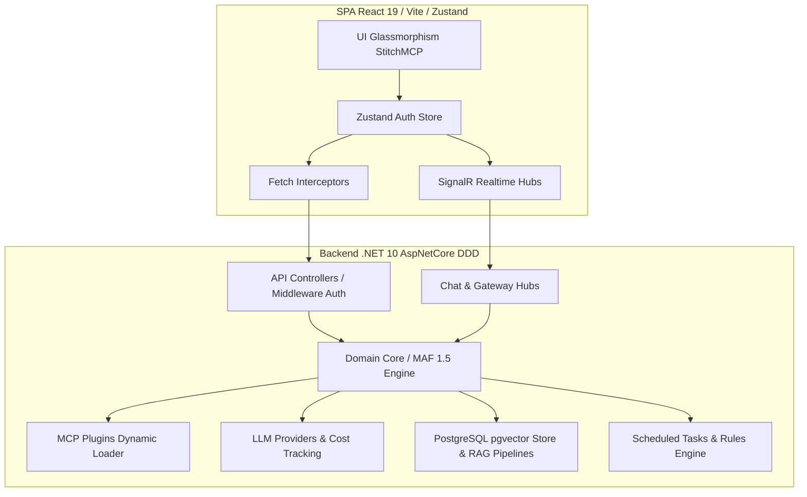

# Master Roadmap: Fullstack AgenticSystem

## 🎯 Objetivo Global
Estabelecer um plano estruturado e progressivo para a evolução completa do monorepo **AgenticSystem** (Backend em C# .NET 10 DDD e Frontend em React 19/Vite). O foco é garantir alta coesão, segurança corporativa, suporte robusto ao Microsoft Agent Framework (MAF 1.5), observabilidade avançada de IA e uma experiência de usuário de nível premium (Glassmorphism).

---

## 🏗️ Visão Arquitetural

---

## 🚀 Fases de Implementação

### 🛡️ Fase P0: Fundação de Segurança & Autenticação Avançada (✅ CONCLUÍDA)
**Objetivo**: Fortalecer a barreira de entrada e garantir comunicação inviolável entre Front e Back.

#### Backend (.NET 10)
- [x] **Task 0.1 (Auth Middlewares)**: Implementar esquema duplo de autenticação (`JwtBearer` e validação customizada de `X-Api-Key` via cabeçalho e query string para WebSockets).
- [x] **Task 0.2 (SignalR Security)**: Proteger os Hubs (`ChatHub`, `GatewayHub`) com autorização baseada em Claims e validação de token.
- [x] **Task 0.3 (Rate Limiting & CORS)**: Configurar políticas rígidas de CORS e controle de requisições por IP/Chave.

#### Frontend (React 19)
- [x] **Task 0.4 (Refresh Token Flow)**: Implementar interceptor para renovação ou interceptação de 401.
- [x] **Task 0.5 (Session Fallback)**: Sincronização multi-aba do estado de autenticação via `storage event` na `authStore`.

---

### 🤖 Fase P1: Ecossistema de Agentes MAF 1.5 & RAG
**Objetivo**: Consolidar o motor de IA baseado na versão 1.5 do Microsoft Agent Framework e fluxos de RAG.
> ⚠️ **Decisão de Infraestrutura Estrita**: É terminantemente proibido o uso de Redis. Toda persistência vetorial, busca semântica e armazenamento de embeddings em RAG utilizarão exclusivamente **PostgreSQL com extensão `pgvector`**.

#### Backend (.NET 10)
- [ ] **Task 1.1 (MAF 1.5 Core)**: Estruturar as especificações de agentes, catálogo de ferramentas e histórico de versões no domínio DDD.
- [ ] **Task 1.2 (PostgreSQL pgvector RAG)**: Construir serviços de ingestão de documentos, chunking e busca semântica em banco vetorial PostgreSQL.
- [ ] **Task 1.3 (Memory Management)**: Persistência de memória de curto e longo prazo para sessões de agentes.

#### Frontend (React 19)
- [ ] **Task 1.4 (RAG & Docs UI)**: Desenvolver a interface de gerenciamento de bases de conhecimento, upload de arquivos e teste de recuperação semântica.
- [ ] **Task 1.5 (Agent Chat Workbench)**: Painel interativo de chat exibindo a árvore de raciocínio do agente, ferramentas executadas e logs em tempo real.

---

### 📊 Fase P2: Gateway Observability & FinOps
**Objetivo**: Trazer total transparência operacional, telemetria e controle de custos de IA (FinOps).

#### Backend (.NET 10)
- [ ] **Task 2.1 (OpenTelemetry Integration)**: Rastreamento distribuído (Tracing) e métricas de tempo de resposta dos provedores de LLM.
- [ ] **Task 2.2 (Cost & Token Auditor)**: Registro centralizado de consumo de tokens (Prompt/Completion) por modelo e cálculo em tempo real de custos.
- [ ] **Task 2.3 (Health Monitoring)**: Verificação contínua de integridade (Health Checks) para serviços externos e banco de dados.

#### Frontend (React 19)
- [ ] **Task 2.4 (FinOps Dashboard)**: Telas de relatórios de custos com gráficos dinâmicos de consumo por agente/modelo.
- [ ] **Task 2.5 (Gateway Health Board)**: Status ao vivo dos serviços com indicadores de pulsação e latência.

---

### ⚡ Fase P3: Extensibilidade & Automação (MCP & Jobs)
**Objetivo**: Tornar o sistema autônomo, agendável e dinamicamente expansível via MCP (Model Context Protocol).

#### Backend (.NET 10)
- [ ] **Task 3.1 (MCP Plugin Host)**: Carregamento dinâmico de servidores MCP externos, registro de ferramentas e mapeamento de recursos.
- [ ] **Task 3.2 (Scheduled Tasks Engine)**: Motor de execução de tarefas agendadas em segundo plano via Cron/Quartz.
- [ ] **Task 3.3 (Trigger Rules)**: Mecanismo de avaliação de regras condicionais para disparo autônomo de fluxos de agentes.

#### Frontend (React 19)
- [ ] **Task 3.4 (Plugin & Studio UI)**: Interface de descoberta, conexão e teste de plugins MCP.
- [ ] **Task 3.5 (Task Scheduler Board)**: Gerenciador de tarefas agendadas com controle de pausa, retomada e logs de execução.

---

## ⚖️ Tabela de Trade-offs & Decisões Arquiteturais

| Decisão | Opção A (Adotada) | Opção B (Descartada) | Racional / Vantagem |
| :--- | :--- | :--- | :--- |
| **Comunicação Realtime** | **SignalR Hubs (.NET)** | WebSockets Puros / Socket.io | Integração nativa e tipada com .NET, fallback automático e reconexão eficiente. |
| **Armazenamento Vetorial RAG** | **PostgreSQL + pgvector** | Redis Vector / Pinecone | Consistência relacional e vetorial no mesmo banco, reduzindo complexidade e custos de infraestrutura separada. |
| **Estado Global SPA** | **Zustand + TanStack Query** | Redux Toolkit | Menor boilerplate, renderização otimizada sem re-renders desnecessários e cache de API robusto. |
| **Estilização UI** | **Tailwind CSS + Glassmorphism** | Componentes Material UI / AntD | Máxima flexibilidade estética corporativa, controle absoluto de design tokens via StitchMCP. |

---

## 🛑 Matriz de Riscos

| Risco | Probabilidade | Impacto | Estratégia de Mitigação |
| :--- | :---: | :---: | :--- |
| **Drift de Esquema de API** | Média | Alto | Utilizar geração estrita de tipos compartilhados e testes de contrato no pipeline CI/CD. |
| **Exaustão de Pool do SignalR** | Baixa | Alto | Implementar backoff exponencial no frontend e limite de conexões simultâneas no servidor. |
| **Sobrecarga de Custos LLM** | Média | Crítico | Trava automática de requisições no backend ao atingir o teto de orçamento configurado no FinOps. |

---

## 🏁 Critérios de Aceitação (AAA)
- [x] Todas as APIs REST e Hubs devem exigir autenticação válida (Token ou Key).
- [ ] O frontend deve exibir feedback em tempo real para mudanças de status e custos.
- [ ] Cobertura de testes unitários no backend (DDD) e componentes visuais críticos no frontend.
