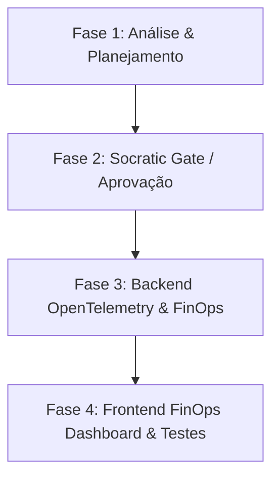

# Plano de Implementação: Fase P2 — Gateway Observability & FinOps

## 🎯 Objetivo
Trazer total transparência operacional, rastreabilidade ponta a ponta e governança financeira (FinOps) do consumo de modelos de Inteligência Artificial no Gateway de IA. Consolidar métricas de OpenTelemetry, auditoria exata de tokens (Prompt, Completion e Cached) e telemetria de disjuntores (Circuit Breakers) para os painéis executivos do frontend.

---

## 🏗️ Escopo & Detalhamento Técnico

### 1. Backend (.NET 10 DDD)
- **Task 2.1: Integração OpenTelemetry Distribuído**:
  - Habilitar `System.Diagnostics.ActivitySource` e métricas nativas (`Meter`) para monitorar latência, taxa de erro e tempo de resposta de provedores de LLM (OpenAI, Anthropic, Ollama, ONNX Local).
- **Task 2.2: Auditor de Tokens & FinOps de IA (`TokenAuditService.cs`)**:
  - Interceptar e registrar o consumo exato de tokens por requisição, tenant e agente.
  - Implementar tabela de precificação configurável no PostgreSQL para calcular em tempo real o custo fracionário (ex: $0.00015/1K tokens).
  - Publicar atualizações de custo ao vivo via `SignalR` para atualização instantânea dos dashboards.
- **Task 2.3: Monitoramento Contínuo de Saúde (Health Checks)**:
  - Adicionar endpoints de integridade nativos (`IHealthCheck`) avaliando conectividade com PostgreSQL, estado da memória para inferência do ONNX Runtime e latência de ping dos provedores externos.

### 2. Frontend (React 19 / Zustand / Tailwind)
- **Task 2.4: Dashboard Gráfico de FinOps**:
  - Construir painel de governança no design *Agentic Glass* exibindo gráficos dinâmicos de custos acumulados, projeção de gastos mensais e divisão de orçamento por agente/tenant.
- **Task 2.5: Quadro de Integridade do Gateway (Health Board)**:
  - Painel ao vivo de latência média, status dos Circuit Breakers, saturação de taxa (rate limits) e disponibilidade de serviços.

---

## ⚙️ Fases de Execução (4-Phase Methodology)

### Phase 1: Analysis & Planning (Atual)
- Estruturação do plano arquitetural e mapeamento das entidades de auditoria de consumo.
- Criação deste documento de planejamento.

### Phase 2: Solutioning & Socratic Gate
- Questionamento socrático com o usuário para definir trade-offs de armazenamento de métricas, retenção de histórico de custos e níveis de agregação.

### Phase 3: Implementation — Backend
- Modelagem de tabelas de precificação de LLM e interceptadores de atividade do OpenTelemetry.
- Criação dos serviços de auditoria e hub do SignalR.

### Phase 4: Implementation — Frontend & Validation
- Construção das telas de FinOps e Health Board.
- Validação total de testes unitários e auditoria de qualidade.

---

## ⚖️ Trade-offs & Decisões Arquiteturais

| Decisão | Opção Adotada | Racional |
| :--- | :--- | :--- |
| **Persistência de Logs de Custo** | **Gravação Assíncrona no PostgreSQL / Tabela de Fatos** | Evita concorrência e bloqueio no fluxo principal da chamada de LLM, mantendo o tempo de resposta do chat intocado. |
| **Streaming de Telemetria UI** | **SignalR / Server-Sent Events** | Garante que o painel de FinOps exiba os centavos consumidos instantaneamente sem sobrecarregar a API com long polling. |

---

## 🛑 Matriz de Riscos

| Risco | Impacto | Mitigação |
| :--- | :---: | :--- |
| **Sobrecarga de I/O por excesso de tracing** | Alto | Implementar amostragem configurável (sampling) para registrar 100% de erros, mas apenas uma fração de requisições de sucesso em produção intensa. |
| **Desatualização da Tabela de Preços de LLM** | Média | Estruturar a tabela com suporte a versionamento e datas de vigência por modelo/provedor. |

---

## 🏁 Critérios de Aceitação (AAA)
- [ ] **Arrange**: Um agente processa uma requisição complexa consumindo 1500 tokens de prompt e 500 de completion.
- [ ] **Act**: O serviço de auditoria intercepta a conclusão da chamada e calcula o custo baseado na tabela vigente.
- [ ] **Assert**: O custo exato é calculado em centavos, gravado no banco de dados e transmitido via SignalR para o painel de FinOps instantaneamente.
