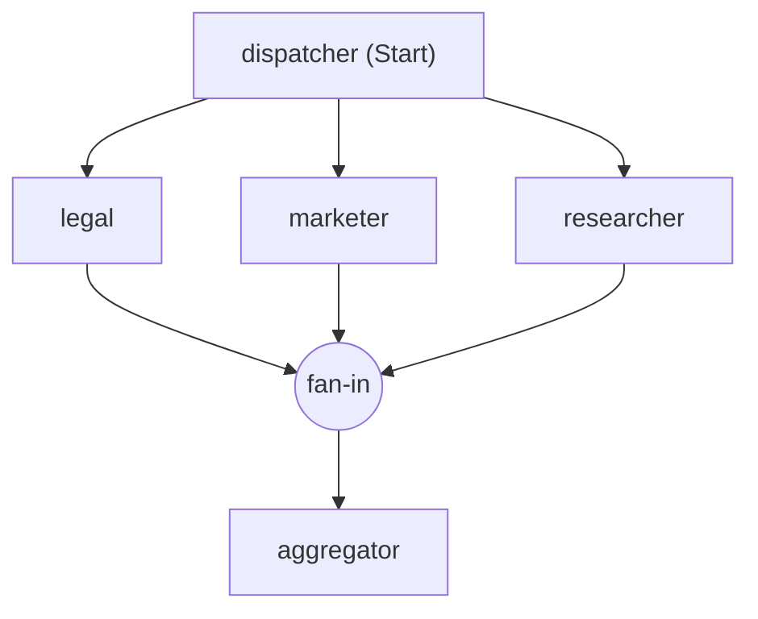

> **Status documental:** Referência externa do fornecedor.
> **Escopo:** material importado do Microsoft Agent Framework para consulta; não descreve a implementação específica do AgenticSystem.
> **Fonte de verdade do projeto:** [../architecture/backend-architecture-explained.md](../architecture/backend-architecture-explained.md).


---
layout: Conceptual
title: Visão geral do Microsoft Agent Framework | Microsoft Learn
canonicalUrl: https://learn.microsoft.com/pt-br/agent-framework/overview/
schema: Conceptual
author: moonbox3
breadcrumb_path: /agent-framework/breadcrumb/agent-framework/toc.json
depot_name: Learn.agent-framework
description: Crie agentes de IA e fluxos de trabalho de vários agentes em .NET e Python com o Microsoft Agent Framework.
document_id: f1fd729d-70b8-3f8d-a594-ec33b75fb7ad
document_version_independent_id: f1fd729d-70b8-3f8d-a594-ec33b75fb7ad
feedback_system: Standard
git_commit_id: 796ee8caeeda5bd0154cdfe419eb6daa43612fe7
gitcommit: https://github.com/MicrosoftDocs/semantic-kernel-pr/blob/796ee8caeeda5bd0154cdfe419eb6daa43612fe7/agent-framework/overview/index.md
locale: pt-br
ms.author: evmattso
ms.collection: ce-skilling-ai-copilot
ms.date: 2026-02-09T00:00:00.0000000Z
ms.reviewer: ssalgado
ms.service: agent-framework
ms.topic: overview
ms.update-cycle: 180-days
original_content_git_url: https://github.com/MicrosoftDocs/semantic-kernel-pr/blob/live/agent-framework/overview/index.md
permissioned-type: public
site_name: Docs
uhfHeaderId: MSDocsHeader-AgentFramework
updated_at: 2026-04-20T06:38:00.0000000Z
'zone_pivot_group_filename:': zone_pivot_group.json
zone_pivot_groups: programming-languages
ms.translationtype: MT
ms.contentlocale: pt-br
loc_version: 2026-04-06T21:43:02.6007247Z
loc_source_id: Github-590130205#live
loc_file_id: Github-590130205.live.Learn.agent-framework.overview/index.md
page_type: conceptual
toc_rel: ../toc.json
feedback_product_url: ''
feedback_help_link_type: ''
feedback_help_link_url: ''
word_count: 859
asset_id: overview/index
item_type: Content
platformId: 6a6ee138-ee25-17f1-7090-6028f757598c
---

# Visão geral do Microsoft Agent Framework | Microsoft Learn

O Agent Framework oferece duas categorias primárias de funcionalidades:

| - | DESCRIÇÃO |
| --- | --- |
| **[Agentes](../agents/)** | Agentes individuais que usam LLMs para processar entradas, chamar ferramentas e se conectar a servidores MCP, gerando respostas. Dá suporte a Microsoft Foundry, Antropic, Azure OpenAI, OpenAI, Ollama e [more](../agents/providers/). |
| **[Fluxos de Trabalho](../workflows/)** | Fluxos de trabalho baseados em grafo que conectam agentes e funções para tarefas de várias etapas com roteamento seguro de tipo, ponto de verificação e suporte humano no loop. |

A estrutura também fornece blocos de construção fundamentais, incluindo clientes de modelo (conclusões e respostas de chat), uma sessão de agente para gerenciamento de estado, provedores de contexto para memória do agente, middleware para interceptar ações do agente e clientes MCP para integração de ferramentas. Juntos, esses componentes oferecem flexibilidade e poder para criar aplicativos de IA interativos, robustos e seguros.

## Introdução

::: zone pivot="programming-language-csharp"

```dotnetcli
dotnet add package Microsoft.Agents.AI.Foundry --prerelease
```

```csharp
using System;
using Azure.AI.Projects;
using Azure.Identity;
using Microsoft.Agents.AI;

AIAgent agent = new AIProjectClient(
        new Uri("https://your-foundry-service.services.ai.azure.com/api/projects/your-foundry-project"),
        new AzureCliCredential())
    .AsAIAgent(
        model: "gpt-5.4-mini",
        instructions: "You are a friendly assistant. Keep your answers brief.");

Console.WriteLine(await agent.RunAsync("What is the largest city in France?"));
```

::: zone-end

::: zone pivot="programming-language-python"

```bash
pip install agent-framework
```

```python
    from agent_framework.foundry import FoundryChatClient
    from azure.identity import AzureCliCredential

    credential = AzureCliCredential()
    client = FoundryChatClient(
        project_endpoint="https://your-foundry-service.services.ai.azure.com/api/projects/your-foundry-project",
        model="gpt-5.4-mini",
        credential=credential,
    )

    agent = client.as_agent(
        name="HelloAgent",
        instructions="You are a friendly assistant. Keep your answers brief.",
    )
```

```python
    # Non-streaming: get the complete response at once
    result = await agent.run("What is the largest city in France?")
    print(f"Agent: {result}")
```

::: zone-end

É isso : um agente que chama uma LLM e retorna uma resposta. A partir daqui, você pode [adicionar ferramentas](../agents/tools/), [conversas de múltiplos turnos](../agents/conversations/session), [middleware](../agents/middleware/) e fluxos de trabalho para criar aplicações de produção.

::: zone pivot="programming-language-python"

Observação

O Agent Framework **não** carrega `.env` arquivos automaticamente. Para usar um `.env` arquivo, chame `load_dotenv()` no início do aplicativo ou defina variáveis de ambiente diretamente em seu shell ou IDE.

::: zone-end

## Quando usar agentes versus fluxos de trabalho

| Use um agente quando... | Use um fluxo de trabalho quando... |
| --- | --- |
| A tarefa é aberta e conversacional. | O processo tem etapas bem definidas |
| Você precisa de uso e planejamento de ferramentas autônomas | Você precisa de controle explícito sobre a ordem de execução |
| Uma única chamada LLM (possivelmente com ferramentas) é suficiente. | Vários agentes ou funções devem ser coordenadas |

*Se você puder escrever uma função para lidar com a tarefa, faça isso em vez de usar um agente de IA.*

## Por que o Agent Framework?

O Agent Framework combina abstrações de agente simples da AutoGen com os recursos corporativos da Kernel semântico — gerenciamento de estado baseado em sessão, segurança de tipo, middleware, telemetria — e adiciona fluxos de trabalho baseados em grafo para orquestração explícita de vários agentes.

[Kernel semântico](https://github.com/microsoft/semantic-kernel) e [AutoGen](https://github.com/microsoft/autogen) foi pioneiro nos conceitos de agentes de IA e orquestração multi-agente. O Agent Framework é o sucessor direto, criado pelas mesmas equipes. Ele combina as abstrações simples da AutoGen para padrões de agente único e múltiplo com os recursos de nível empresarial da Kernel semântico, como gerenciamento de estado baseado em sessão, segurança de tipo, filtros, telemetria e amplo suporte a modelos e inserção. Além de mesclar os dois, o Agent Framework apresenta fluxos de trabalho que dão aos desenvolvedores controle explícito sobre caminhos de execução de vários agentes, além de um sistema de gerenciamento de estado robusto para cenários de longa execução e humanos no loop. Em suma, o Agent Framework é a próxima geração de Kernel semântico e AutoGen.

Para saber mais sobre como migrar do Kernel semântico ou do AutoGen, consulte o [Guia de Migração de Kernel semântico](../migration-guide/from-semantic-kernel/) e o [Guia de Migração de AutoGen](../migration-guide/from-autogen/).

Tanto o Kernel semântico quanto o AutoGen se beneficiaram significativamente da comunidade de software livre e o mesmo é esperado para o Agent Framework. Microsoft Agent Framework recebe contribuições e continuará melhorando com novos recursos e capacidades.

Importante

Se você usar Microsoft Agent Framework para criar aplicativos que operam com servidores, agentes, código ou modelos diretos não Azure de terceiros ("Sistemas de Terceiros"), você o fará por sua conta e risco. Sistemas de terceiros são produtos não Microsoft sob os Termos do Produto Microsoft e são regidos por seus próprios termos de licença de terceiros. Você é responsável por qualquer uso e custos associados.

Recomendamos revisar todos os dados compartilhados e recebidos de sistemas de terceiros e estar ciente das práticas de terceiros para manipulação, compartilhamento, retenção e localização de dados. É sua responsabilidade gerenciar se seus dados fluirão fora dos limites de conformidade e geográficos do Azure da sua organização e quaisquer implicações relacionadas, e garantir que as permissões, limites e aprovações apropriados sejam estabelecidos.

Você é responsável por examinar e testar cuidadosamente os aplicativos que cria usando Microsoft Agent Framework no contexto de seus casos de uso específicos e tomar todas as decisões e personalizações apropriadas. \*\* Isso inclui implementar suas próprias mitigações de IA responsáveis, como metaprompt, filtros de conteúdo ou outros sistemas de segurança, e garantir que seus aplicativos atendam aos padrões apropriados de qualidade, confiabilidade, segurança e fidelidade. Veja também: [Perguntas frequentes sobre transparência](https://github.com/microsoft/agent-framework/blob/main/TRANSPARENCY_FAQS.md)

---
layout: Conceptual
title: Introdução ao Agent Framework | Microsoft Learn
canonicalUrl: https://learn.microsoft.com/pt-br/agent-framework/get-started/
schema: Conceptual
author: eavanvalkenburg
breadcrumb_path: /agent-framework/breadcrumb/agent-framework/toc.json
depot_name: Learn.agent-framework
description: Um tutorial passo a passo para criar seu primeiro agente e adicionar progressivamente ferramentas, conversas, memória, fluxos de trabalho e hospedagem.
document_id: edb30f4d-58e8-dd57-61de-8b44d3e54356
document_version_independent_id: edb30f4d-58e8-dd57-61de-8b44d3e54356
feedback_system: Standard
git_commit_id: 75beb14096ebae9a4bb167da7cee30a25b35760f
gitcommit: https://github.com/MicrosoftDocs/semantic-kernel-pr/blob/75beb14096ebae9a4bb167da7cee30a25b35760f/agent-framework/get-started/index.md
locale: pt-br
ms.author: edvan
ms.date: 2026-02-12T00:00:00.0000000Z
ms.service: agent-framework
ms.topic: tutorial
original_content_git_url: https://github.com/MicrosoftDocs/semantic-kernel-pr/blob/live/agent-framework/get-started/index.md
permissioned-type: public
site_name: Docs
uhfHeaderId: MSDocsHeader-AgentFramework
updated_at: 2026-04-01T17:40:00.0000000Z
'zone_pivot_group_filename:': zone_pivot_group.json
ms.translationtype: MT
ms.contentlocale: pt-br
loc_version: 2026-04-01T16:46:13.2293839Z
loc_source_id: Github-590130205#live
loc_file_id: Github-590130205.live.Learn.agent-framework.get-started/index.md
page_type: conceptual
toc_rel: ../toc.json
feedback_product_url: ''
feedback_help_link_type: ''
feedback_help_link_url: ''
word_count: 116
asset_id: get-started/index
item_type: Content
platformId: 3be922e6-9a7f-458f-38d9-8516eb280ae1
---

# Introdução ao Agent Framework | Microsoft Learn

Este tutorial explica como criar um agente de IA do zero, adicionando um conceito de cada vez. Cada etapa se baseia na anterior.

| Etapa | O que você aprenderá |
| --- | --- |
| [Etapa 1: Seu primeiro agente](your-first-agent) | Criar um agente, invocá-lo e transmitir a resposta |
| [Etapa 2: Adicionar Ferramentas](add-tools) | Dê ao agente uma ferramenta de função que ele pode chamar |
| [Etapa 3: Conversações de vários turnos](multi-turn) | Manter o estado da conversa com sessões |
| [Etapa 4: Memória &persistência](memory) | Injetar contexto persistente por meio de provedores de contexto |
| [Etapa 5: Fluxos de trabalho](workflows) | Compor um fluxo de trabalho de várias etapas |
| [Etapa 6: hospedar seu agente](hosting) | Expor o agente por meio da infraestrutura de hospedagem |

---
layout: Conceptual
title: 'Etapa 1: Seu primeiro agente | Microsoft Learn'
canonicalUrl: https://learn.microsoft.com/pt-br/agent-framework/get-started/your-first-agent
schema: Conceptual
author: eavanvalkenburg
breadcrumb_path: /agent-framework/breadcrumb/agent-framework/toc.json
depot_name: Learn.agent-framework
description: Crie e execute seu primeiro agente de IA com o Agent Framework em menos de 5 minutos.
document_id: 6558c300-f45b-5ccf-b928-c91c9275314d
document_version_independent_id: 6558c300-f45b-5ccf-b928-c91c9275314d
feedback_system: Standard
git_commit_id: cfcd7c755f7b38f588ea3a107cbcb1e37963259a
gitcommit: https://github.com/MicrosoftDocs/semantic-kernel-pr/blob/cfcd7c755f7b38f588ea3a107cbcb1e37963259a/agent-framework/get-started/your-first-agent.md
locale: pt-br
ms.author: edvan
ms.date: 2026-02-09T00:00:00.0000000Z
ms.service: agent-framework
ms.topic: tutorial
original_content_git_url: https://github.com/MicrosoftDocs/semantic-kernel-pr/blob/live/agent-framework/get-started/your-first-agent.md
permissioned-type: public
site_name: Docs
uhfHeaderId: MSDocsHeader-AgentFramework
updated_at: 2026-04-02T17:59:00.0000000Z
'zone_pivot_group_filename:': zone_pivot_group.json
zone_pivot_groups: programming-languages
ms.translationtype: MT
ms.contentlocale: pt-br
loc_version: 2026-04-02T17:02:19.5866333Z
loc_source_id: Github-590130205#live
loc_file_id: Github-590130205.live.Learn.agent-framework.get-started/your-first-agent.md
page_type: conceptual
toc_rel: ../toc.json
feedback_product_url: ''
feedback_help_link_type: ''
feedback_help_link_url: ''
word_count: 321
asset_id: get-started/your-first-agent
item_type: Content
platformId: 1bdcd82f-a051-cd2e-1846-f2f5b89562ac
---

# Etapa 1: Seu primeiro agente | Microsoft Learn

Crie um agente e obtenha uma resposta em apenas algumas linhas de código.

::: zone pivot="programming-language-csharp"

```dotnetcli
dotnet add package Azure.AI.Projects --prerelease
dotnet add package Azure.Identity
dotnet add package Microsoft.Agents.AI.Foundry --prerelease
```

Crie o agente:

```csharp
using System;
using Azure.AI.Projects;
using Azure.Identity;
using Microsoft.Agents.AI;

var endpoint = Environment.GetEnvironmentVariable("AZURE_OPENAI_ENDPOINT")
    ?? throw new InvalidOperationException("Set AZURE_OPENAI_ENDPOINT");
var deploymentName = Environment.GetEnvironmentVariable("AZURE_OPENAI_DEPLOYMENT_NAME") ?? "gpt-4o-mini";

AIAgent agent = new AIProjectClient(new Uri(endpoint), new DefaultAzureCredential())
    .AsAIAgent(
        model: deploymentName,
        instructions: "You are a friendly assistant. Keep your answers brief.",
        name: "HelloAgent");
```

Aviso

`DefaultAzureCredential` é conveniente para o desenvolvimento, mas requer uma consideração cuidadosa na produção. Em produção, considere o uso de uma credencial específica (por exemplo, `ManagedIdentityCredential`) para evitar problemas de latência, investigação de credenciais não intencionais e possíveis riscos de segurança de mecanismos de fallback.

Execute-o:

```csharp
Console.WriteLine(await agent.RunAsync("What is the largest city in France?"));
```

Ou transmita a resposta:

```csharp
await foreach (var update in agent.RunStreamingAsync("Tell me a one-sentence fun fact."))
{
    Console.Write(update);
}
```

Dica

Veja [aqui](https://github.com/microsoft/agent-framework/tree/main/dotnet/samples/01-get-started/01_hello_agent) um aplicativo de exemplo executável completo.

::: zone-end

::: zone pivot="programming-language-python"

```bash
pip install agent-framework
```

Crie e execute um agente:

```python
client = FoundryChatClient(
    project_endpoint="https://your-project.services.ai.azure.com",
    model="gpt-4o",
    credential=AzureCliCredential(),
)

agent = Agent(
    client=client,
    name="HelloAgent",
    instructions="You are a friendly assistant. Keep your answers brief.",
)
```

```python
# Non-streaming: get the complete response at once
result = await agent.run("What is the capital of France?")
print(f"Agent: {result}")
```

Ou transmita a resposta:

```python
# Streaming: receive tokens as they are generated
print("Agent (streaming): ", end="", flush=True)
async for chunk in agent.run("Tell me a one-sentence fun fact.", stream=True):
    if chunk.text:
        print(chunk.text, end="", flush=True)
print()
```

Observação

O Agent Framework **não** carrega `.env` arquivos automaticamente. Para usar um `.env` arquivo para configuração, chame `load_dotenv()` no início do script:

```python
from dotenv import load_dotenv
load_dotenv()
```

Como alternativa, defina variáveis de ambiente diretamente em seu shell ou IDE. Consulte a [nota de migração de configurações](../support/upgrade/python-2026-significant-changes#-pydantic-settings-replaced-with-typeddict--load_settings) para obter detalhes.

Dica

Consulte o [exemplo completo](https://github.com/microsoft/agent-framework/blob/main/python/samples/01-get-started/01_hello_agent.py) do arquivo executável completo.

::: zone-end

---
layout: Conceptual
title: 'Etapa 2: Adicionar Ferramentas | Microsoft Learn'
canonicalUrl: https://learn.microsoft.com/pt-br/agent-framework/get-started/add-tools
schema: Conceptual
author: eavanvalkenburg
breadcrumb_path: /agent-framework/breadcrumb/agent-framework/toc.json
depot_name: Learn.agent-framework
description: Dê ao agente a capacidade de chamar funções e interagir com o mundo.
document_id: 5e5afa2a-22d4-88b1-3b81-87bad807c64f
document_version_independent_id: 5e5afa2a-22d4-88b1-3b81-87bad807c64f
feedback_system: Standard
git_commit_id: 98b31c5aa8570a8ccc4c20b4729bf6080903f322
gitcommit: https://github.com/MicrosoftDocs/semantic-kernel-pr/blob/98b31c5aa8570a8ccc4c20b4729bf6080903f322/agent-framework/get-started/add-tools.md
locale: pt-br
ms.author: edvan
ms.date: 2026-02-09T00:00:00.0000000Z
ms.service: agent-framework
ms.topic: tutorial
original_content_git_url: https://github.com/MicrosoftDocs/semantic-kernel-pr/blob/live/agent-framework/get-started/add-tools.md
permissioned-type: public
site_name: Docs
uhfHeaderId: MSDocsHeader-AgentFramework
updated_at: 2026-04-02T17:57:00.0000000Z
'zone_pivot_group_filename:': zone_pivot_group.json
zone_pivot_groups: programming-languages
ms.translationtype: MT
ms.contentlocale: pt-br
loc_version: 2026-04-02T17:02:19.5866333Z
loc_source_id: Github-590130205#live
loc_file_id: Github-590130205.live.Learn.agent-framework.get-started/add-tools.md
page_type: conceptual
toc_rel: ../toc.json
feedback_product_url: ''
feedback_help_link_type: ''
feedback_help_link_url: ''
word_count: 327
asset_id: get-started/add-tools
item_type: Content
platformId: 7ae5ed51-08db-173b-2c4f-e7c9c750021c
---

# Etapa 2: Adicionar Ferramentas | Microsoft Learn

As ferramentas permitem que seu agente chame funções personalizadas , como buscar dados meteorológicos, consultar um banco de dados ou chamar uma API.

::: zone pivot="programming-language-csharp"

Defina uma ferramenta como qualquer método com um `[Description]` atributo:

```csharp
using System.ComponentModel;

[Description("Get the weather for a given location.")]
static string GetWeather([Description("The location to get the weather for.")] string location)
    => $"The weather in {location} is cloudy with a high of 15°C.";
```

Crie um agente com a ferramenta:

```csharp
using System;
using Azure.AI.Projects;
using Azure.Identity;
using Microsoft.Agents.AI;
using Microsoft.Extensions.AI;

var endpoint = Environment.GetEnvironmentVariable("AZURE_OPENAI_ENDPOINT")
    ?? throw new InvalidOperationException("Set AZURE_OPENAI_ENDPOINT");
var deploymentName = Environment.GetEnvironmentVariable("AZURE_OPENAI_DEPLOYMENT_NAME") ?? "gpt-4o-mini";

AIAgent agent = new AIProjectClient(new Uri(endpoint), new DefaultAzureCredential())
    .AsAIAgent(
        model: deploymentName,
        instructions: "You are a helpful assistant.",
        tools: [AIFunctionFactory.Create(GetWeather)]);
```

Aviso

`DefaultAzureCredential` é conveniente para o desenvolvimento, mas requer uma consideração cuidadosa na produção. Em produção, considere o uso de uma credencial específica (por exemplo, `ManagedIdentityCredential`) para evitar problemas de latência, investigação de credenciais não intencionais e possíveis riscos de segurança de mecanismos de fallback.

O agente chamará automaticamente sua ferramenta quando relevante:

```csharp
Console.WriteLine(await agent.RunAsync("What is the weather like in Amsterdam?"));
```

Dica

Veja [aqui](https://github.com/microsoft/agent-framework/tree/main/dotnet/samples/01-get-started/02_add_tools) um aplicativo de exemplo executável completo.

::: zone-end

::: zone pivot="programming-language-python"

Defina uma ferramenta com o `@tool` decorador:

```python
# NOTE: approval_mode="never_require" is for sample brevity.
# Use "always_require" in production for user confirmation before tool execution.
@tool(approval_mode="never_require")
def get_weather(
    location: Annotated[str, Field(description="The location to get the weather for.")],
) -> str:
    """Get the weather for a given location."""
    conditions = ["sunny", "cloudy", "rainy", "stormy"]
    return f"The weather in {location} is {conditions[randint(0, 3)]} with a high of {randint(10, 30)}°C."
```

Crie um agente com a ferramenta:

```python
agent = Agent(
    client=client,
    name="WeatherAgent",
    instructions="You are a helpful weather agent. Use the get_weather tool to answer questions.",
    tools=[get_weather],
)
```

Dica

Consulte o [exemplo completo](https://github.com/microsoft/agent-framework/blob/main/python/samples/01-get-started/02_add_tools.py) do arquivo executável completo.

::: zone-end

---
layout: Conceptual
title: 'Etapa 3: Conversas de múltiplos turnos | Microsoft Learn'
canonicalUrl: https://learn.microsoft.com/pt-br/agent-framework/get-started/multi-turn
schema: Conceptual
author: eavanvalkenburg
breadcrumb_path: /agent-framework/breadcrumb/agent-framework/toc.json
depot_name: Learn.agent-framework
description: Mantenha o contexto em múltiplas interações com a AgentSession.
document_id: 2cde473a-5a9d-4901-04e6-2a909eeec5b4
document_version_independent_id: 2cde473a-5a9d-4901-04e6-2a909eeec5b4
feedback_system: Standard
git_commit_id: 98b31c5aa8570a8ccc4c20b4729bf6080903f322
gitcommit: https://github.com/MicrosoftDocs/semantic-kernel-pr/blob/98b31c5aa8570a8ccc4c20b4729bf6080903f322/agent-framework/get-started/multi-turn.md
locale: pt-br
ms.author: edvan
ms.date: 2026-02-09T00:00:00.0000000Z
ms.service: agent-framework
ms.topic: tutorial
original_content_git_url: https://github.com/MicrosoftDocs/semantic-kernel-pr/blob/live/agent-framework/get-started/multi-turn.md
permissioned-type: public
site_name: Docs
uhfHeaderId: MSDocsHeader-AgentFramework
updated_at: 2026-04-02T17:59:00.0000000Z
'zone_pivot_group_filename:': zone_pivot_group.json
zone_pivot_groups: programming-languages
ms.translationtype: MT
ms.contentlocale: pt-br
loc_version: 2026-04-02T17:02:19.5866333Z
loc_source_id: Github-590130205#live
loc_file_id: Github-590130205.live.Learn.agent-framework.get-started/multi-turn.md
page_type: conceptual
toc_rel: ../toc.json
feedback_product_url: ''
feedback_help_link_type: ''
feedback_help_link_url: ''
word_count: 290
asset_id: get-started/multi-turn
item_type: Content
cmProducts: []
platformId: 2fe447db-0d3b-9d37-0d3a-b7da95b96c31
---

# Etapa 3: Conversas de múltiplos turnos | Microsoft Learn

Use uma sessão para manter o contexto da conversa para que o agente se lembre do que foi dito anteriormente.

::: zone pivot="programming-language-csharp"

Use `AgentSession` para manter o contexto em várias chamadas:

```csharp
using System;
using Azure.AI.Projects;
using Azure.Identity;
using Microsoft.Agents.AI;

var endpoint = Environment.GetEnvironmentVariable("AZURE_OPENAI_ENDPOINT")
    ?? throw new InvalidOperationException("Set AZURE_OPENAI_ENDPOINT");
var deploymentName = Environment.GetEnvironmentVariable("AZURE_OPENAI_DEPLOYMENT_NAME") ?? "gpt-4o-mini";

AIAgent agent = new AIProjectClient(new Uri(endpoint), new DefaultAzureCredential())
    .AsAIAgent(
        model: deploymentName,
        instructions: "You are a friendly assistant. Keep your answers brief.",
        name: "ConversationAgent");

// Create a session to maintain conversation history
AgentSession session = await agent.CreateSessionAsync();

// First turn
Console.WriteLine(await agent.RunAsync("My name is Alice and I love hiking.", session));

// Second turn — the agent remembers the user's name and hobby
Console.WriteLine(await agent.RunAsync("What do you remember about me?", session));
```

Aviso

`DefaultAzureCredential` é conveniente para o desenvolvimento, mas requer uma consideração cuidadosa na produção. Em produção, considere o uso de uma credencial específica (por exemplo, `ManagedIdentityCredential`) para evitar problemas de latência, investigação de credenciais não intencionais e possíveis riscos de segurança de mecanismos de fallback.

Dica

Veja [aqui](https://github.com/microsoft/agent-framework/tree/main/dotnet/samples/01-get-started/03_multi_turn) um aplicativo de exemplo executável completo.

::: zone-end

::: zone pivot="programming-language-python"

Use `AgentSession` para manter o contexto em várias chamadas:

```python
client = FoundryChatClient(
    project_endpoint="https://your-project.services.ai.azure.com",
    model="gpt-4o",
    credential=AzureCliCredential(),
)

agent = Agent(
    client=client,
    name="ConversationAgent",
    instructions="You are a friendly assistant. Keep your answers brief.",
)
```

```python
# Create a session to maintain conversation history
session = agent.create_session()

# First turn
result = await agent.run("My name is Alice and I love hiking.", session=session)
print(f"Agent: {result}\n")

# Second turn — the agent should remember the user's name and hobby
result = await agent.run("What do you remember about me?", session=session)
print(f"Agent: {result}")
```

Dica

Consulte o [exemplo completo](https://github.com/microsoft/agent-framework/blob/main/python/samples/01-get-started/03_multi_turn.py) do arquivo executável completo.

::: zone-end

---
layout: Conceptual
title: 'Etapa 4: Memória &persistência | Microsoft Learn'
canonicalUrl: https://learn.microsoft.com/pt-br/agent-framework/get-started/memory
schema: Conceptual
author: eavanvalkenburg
breadcrumb_path: /agent-framework/breadcrumb/agent-framework/toc.json
depot_name: Learn.agent-framework
description: Adicione provedores de contexto e memória persistente ao agente.
document_id: d780e260-9ab1-331e-6f8b-0dd93952611a
document_version_independent_id: d780e260-9ab1-331e-6f8b-0dd93952611a
feedback_system: Standard
git_commit_id: cfcd7c755f7b38f588ea3a107cbcb1e37963259a
gitcommit: https://github.com/MicrosoftDocs/semantic-kernel-pr/blob/cfcd7c755f7b38f588ea3a107cbcb1e37963259a/agent-framework/get-started/memory.md
locale: pt-br
ms.author: edvan
ms.date: 2026-02-09T00:00:00.0000000Z
ms.service: agent-framework
ms.topic: tutorial
original_content_git_url: https://github.com/MicrosoftDocs/semantic-kernel-pr/blob/live/agent-framework/get-started/memory.md
permissioned-type: public
site_name: Docs
uhfHeaderId: MSDocsHeader-AgentFramework
updated_at: 2026-04-02T17:59:00.0000000Z
'zone_pivot_group_filename:': zone_pivot_group.json
zone_pivot_groups: programming-languages
ms.translationtype: MT
ms.contentlocale: pt-br
loc_version: 2026-04-02T17:02:19.5866333Z
loc_source_id: Github-590130205#live
loc_file_id: Github-590130205.live.Learn.agent-framework.get-started/memory.md
page_type: conceptual
toc_rel: ../toc.json
feedback_product_url: ''
feedback_help_link_type: ''
feedback_help_link_url: ''
word_count: 774
asset_id: get-started/memory
item_type: Content
cmProducts: []
platformId: fe252c71-0f39-6222-aeb9-51a9e12a7801
---

# Etapa 4: Memória &persistência | Microsoft Learn

Adicione contexto ao agente para que ele possa se lembrar das preferências do usuário, das interações passadas ou do conhecimento externo.

::: zone pivot="programming-language-csharp"

Por padrão, os agentes armazenarão o histórico de chat em um `InMemoryChatHistoryProvider` ou no serviço de IA subjacente, dependendo do que o serviço subjacente requer.

O agente a seguir usa o Complemento de Chat da OpenAI, que não oferece suporte nem requer armazenamento de histórico de chat em serviço; portanto, cria e usa automaticamente um `InMemoryChatHistoryProvider`.

```csharp
using System;
using Azure.AI.Projects;
using Azure.Identity;
using Microsoft.Agents.AI;

var endpoint = Environment.GetEnvironmentVariable("AZURE_OPENAI_ENDPOINT")
    ?? throw new InvalidOperationException("Set AZURE_OPENAI_ENDPOINT");
var deploymentName = Environment.GetEnvironmentVariable("AZURE_OPENAI_DEPLOYMENT_NAME") ?? "gpt-4o-mini";

AIAgent agent = new AIProjectClient(new Uri(endpoint), new DefaultAzureCredential())
    .AsAIAgent(
        model: deploymentName,
        instructions: "You are a friendly assistant. Keep your answers brief.",
        name: "MemoryAgent");
```

Aviso

`DefaultAzureCredential` é conveniente para o desenvolvimento, mas requer uma consideração cuidadosa na produção. Em produção, considere o uso de uma credencial específica (por exemplo, `ManagedIdentityCredential`) para evitar problemas de latência, investigação de credenciais não intencionais e possíveis riscos de segurança de mecanismos de fallback.

Para usar um `ChatHistoryProvider` personalizado, você pode passá-lo para as opções do agente:

```csharp
using System;
using Azure.AI.Projects;
using Azure.Identity;
using Microsoft.Agents.AI;

var endpoint = Environment.GetEnvironmentVariable("AZURE_OPENAI_ENDPOINT")
    ?? throw new InvalidOperationException("Set AZURE_OPENAI_ENDPOINT");
var deploymentName = Environment.GetEnvironmentVariable("AZURE_OPENAI_DEPLOYMENT_NAME") ?? "gpt-4o-mini";

AIAgent agent = new AIProjectClient(new Uri(endpoint), new DefaultAzureCredential())
    .AsAIAgent(model: deploymentName, options: new ChatClientAgentOptions()
    {
        ChatOptions = new() { Instructions = "You are a helpful assistant." },
        ChatHistoryProvider = new CustomChatHistoryProvider()
    });
```

Use uma sessão para compartilhar o contexto entre execuções:

```csharp
AgentSession session = await agent.CreateSessionAsync();

Console.WriteLine(await agent.RunAsync("Hello! What's the square root of 9?", session));
Console.WriteLine(await agent.RunAsync("My name is Alice", session));
Console.WriteLine(await agent.RunAsync("What is my name?", session));
```

Dica

Veja [aqui](https://github.com/microsoft/agent-framework/tree/main/dotnet/samples/02-agents/Agents/Agent_Step04_3rdPartyChatHistoryStorage) um aplicativo de exemplo executável completo.

::: zone-end

::: zone pivot="programming-language-python"

Defina um provedor de contexto que armazena informações do usuário no estado da sessão e injeta instruções de personalização:

```python
class UserMemoryProvider(ContextProvider):
    """A context provider that remembers user info in session state."""

    DEFAULT_SOURCE_ID = "user_memory"

    def __init__(self):
        super().__init__(self.DEFAULT_SOURCE_ID)

    async def before_run(
        self,
        *,
        agent: Any,
        session: AgentSession | None,
        context: SessionContext,
        state: dict[str, Any],
    ) -> None:
        """Inject personalization instructions based on stored user info."""
        user_name = state.get("user_name")
        if user_name:
            context.extend_instructions(
                self.source_id,
                f"The user's name is {user_name}. Always address them by name.",
            )
        else:
            context.extend_instructions(
                self.source_id,
                "You don't know the user's name yet. Ask for it politely.",
            )

    async def after_run(
        self,
        *,
        agent: Any,
        session: AgentSession | None,
        context: SessionContext,
        state: dict[str, Any],
    ) -> None:
        """Extract and store user info in session state after each call."""
        for msg in context.input_messages:
            text = msg.text if hasattr(msg, "text") else ""
            if isinstance(text, str) and "my name is" in text.lower():
                state["user_name"] = text.lower().split("my name is")[-1].strip().split()[0].capitalize()
```

Crie um agente com o provedor de contexto:

```python
client = FoundryChatClient(
    project_endpoint="https://your-project.services.ai.azure.com",
    model="gpt-4o",
    credential=AzureCliCredential(),
)

agent = Agent(
    client=client,
    name="MemoryAgent",
    instructions="You are a friendly assistant.",
    context_providers=[UserMemoryProvider()],
)
```

Execute-o: o agente agora tem acesso ao contexto.

```python
session = agent.create_session()

# The provider doesn't know the user yet — it will ask for a name
result = await agent.run("Hello! What's the square root of 9?", session=session)
print(f"Agent: {result}\n")

# Now provide the name — the provider stores it in session state
result = await agent.run("My name is Alice", session=session)
print(f"Agent: {result}\n")

# Subsequent calls are personalized — name persists via session state
result = await agent.run("What is 2 + 2?", session=session)
print(f"Agent: {result}\n")

# Inspect session state to see what the provider stored
provider_state = session.state.get("user_memory", {})
print(f"[Session State] Stored user name: {provider_state.get('user_name')}")
```

Dica

Consulte o [exemplo completo](https://github.com/microsoft/agent-framework/blob/main/python/samples/01-get-started/04_memory.py) do arquivo executável completo.

Observação

No Python, a persistência/memória é tratada por implementações de `ContextProvider` e `HistoryProvider`. `BaseContextProvider` e `BaseHistoryProvider` permanecem como aliases obsoletos e `InMemoryHistoryProvider` é o provedor de histórico interno local na memória. `RawAgent` pode adicionar `InMemoryHistoryProvider()` automaticamente em casos específicos (por exemplo, ao usar uma sessão sem provedores de contexto configurados e sem indicadores de armazenamento do lado do serviço), mas isso não é garantido em todos os cenários. Se você sempre quiser persistência local, adicione uma `InMemoryHistoryProvider` explicitamente. Além disso, verifique se apenas um provedor de histórico tem `load_messages=True`, para que você não reproduza vários repositórios na mesma invocação.

Você também pode adicionar um repositório de auditoria acrescentando outro provedor de histórico no final da lista de `context_providers` com `store_context_messages=True`:

```python
from agent_framework import InMemoryHistoryProvider
from agent_framework.mem0 import Mem0ContextProvider

memory_store = InMemoryHistoryProvider(load_messages=True) # add a history provider for persistence across sessions
agent_memory = Mem0ContextProvider("user-memory", api_key=..., agent_id="my-agent")  # add Mem0 provider for agent memory
audit_store = InMemoryHistoryProvider(
    "audit",
    load_messages=False,
    store_context_messages=True,  # include context added by other providers
)

agent = client.as_agent(
    name="MemoryAgent",
    instructions="You are a friendly assistant.",
    context_providers=[memory_store, agent_memory, audit_store],  # audit store last
)
```

::: zone-end

---
layout: Conceptual
title: 'Etapa 5: Fluxos de trabalho | Microsoft Learn'
canonicalUrl: https://learn.microsoft.com/pt-br/agent-framework/get-started/workflows
schema: Conceptual
author: eavanvalkenburg
breadcrumb_path: /agent-framework/breadcrumb/agent-framework/toc.json
depot_name: Learn.agent-framework
description: Encadear várias etapas em um fluxo de trabalho sequencial.
document_id: 7943783d-e12d-fb2e-a5d2-f9a472402950
document_version_independent_id: 7943783d-e12d-fb2e-a5d2-f9a472402950
feedback_system: Standard
git_commit_id: 75beb14096ebae9a4bb167da7cee30a25b35760f
gitcommit: https://github.com/MicrosoftDocs/semantic-kernel-pr/blob/75beb14096ebae9a4bb167da7cee30a25b35760f/agent-framework/get-started/workflows.md
locale: pt-br
ms.author: edvan
ms.date: 2026-02-09T00:00:00.0000000Z
ms.service: agent-framework
ms.topic: tutorial
original_content_git_url: https://github.com/MicrosoftDocs/semantic-kernel-pr/blob/live/agent-framework/get-started/workflows.md
permissioned-type: public
site_name: Docs
uhfHeaderId: MSDocsHeader-AgentFramework
updated_at: 2026-04-24T16:28:00.0000000Z
'zone_pivot_group_filename:': zone_pivot_group.json
zone_pivot_groups: programming-languages
ms.translationtype: MT
ms.contentlocale: pt-br
loc_version: 2026-02-26T01:49:39.7906214Z
loc_source_id: Github-590130205#live
loc_file_id: Github-590130205.live.Learn.agent-framework.get-started/workflows.md
page_type: conceptual
toc_rel: ../toc.json
feedback_product_url: ''
feedback_help_link_type: ''
feedback_help_link_url: ''
word_count: 207
asset_id: get-started/workflows
item_type: Content
platformId: 0aca6d3c-ab67-f83a-dce2-b7da52f90c4b
---

# Etapa 5: Fluxos de trabalho | Microsoft Learn

Os fluxos de trabalho permitem encadear várias etapas juntas– cada etapa processa dados e os passa para o próximo.

::: zone pivot="programming-language-csharp"

Definir etapas de fluxo de trabalho (executores):

```csharp
using Microsoft.Agents.AI.Workflows;

// Step 1: Convert text to uppercase
Func<string, string> uppercaseFunc = s => s.ToUpperInvariant();
var uppercase = uppercaseFunc.BindAsExecutor("UppercaseExecutor");

// Step 2: Reverse the string and yield output
class ReverseTextExecutor() : Executor<string, string>("ReverseTextExecutor")
{
    public override ValueTask<string> HandleAsync(string message, IWorkflowContext context, CancellationToken cancellationToken = default)
    {
        return ValueTask.FromResult(string.Concat(message.Reverse()));
    }
}
ReverseTextExecutor reverse = new();
```

Crie e execute o fluxo de trabalho:

```csharp
WorkflowBuilder builder = new(uppercase);
builder.AddEdge(uppercase, reverse).WithOutputFrom(reverse);
var workflow = builder.Build();

await using Run run = await InProcessExecution.RunAsync(workflow, "Hello, World!");
foreach (WorkflowEvent evt in run.NewEvents)
{
    if (evt is ExecutorCompletedEvent executorComplete)
    {
        Console.WriteLine($"{executorComplete.ExecutorId}: {executorComplete.Data}");
    }
}
```

Dica

Veja [aqui](https://github.com/microsoft/agent-framework/tree/main/dotnet/samples/01-get-started/05_first_workflow) um aplicativo de exemplo executável completo.

::: zone-end

::: zone pivot="programming-language-python"

Defina as etapas de fluxo de trabalho (executores) e conecte-as com bordas:

Crie e execute o fluxo de trabalho:

Dica

Consulte o [exemplo completo](https://github.com/microsoft/agent-framework/blob/main/python/samples/01-get-started/05_first_workflow.py) do arquivo executável completo.

::: zone-end

---
layout: Conceptual
title: 'Etapa 6: hospedar seu agente | Microsoft Learn'
canonicalUrl: https://learn.microsoft.com/pt-br/agent-framework/get-started/hosting
schema: Conceptual
author: eavanvalkenburg
breadcrumb_path: /agent-framework/breadcrumb/agent-framework/toc.json
depot_name: Learn.agent-framework
description: Implante seu agente para que os usuários e outros agentes possam interagir com ele.
document_id: 3e310238-b17f-8253-1ba7-2842921aed24
document_version_independent_id: 3e310238-b17f-8253-1ba7-2842921aed24
feedback_system: Standard
git_commit_id: a28e1d7807fd54743a38ba0e361371ac259e38f1
gitcommit: https://github.com/MicrosoftDocs/semantic-kernel-pr/blob/a28e1d7807fd54743a38ba0e361371ac259e38f1/agent-framework/get-started/hosting.md
locale: pt-br
ms.author: edvan
ms.date: 2026-02-09T00:00:00.0000000Z
ms.service: agent-framework
ms.topic: tutorial
original_content_git_url: https://github.com/MicrosoftDocs/semantic-kernel-pr/blob/live/agent-framework/get-started/hosting.md
permissioned-type: public
site_name: Docs
uhfHeaderId: MSDocsHeader-AgentFramework
updated_at: 2026-04-02T18:00:00.0000000Z
'zone_pivot_group_filename:': zone_pivot_group.json
zone_pivot_groups: programming-languages
ms.translationtype: MT
ms.contentlocale: pt-br
loc_version: 2026-04-02T17:02:19.5866333Z
loc_source_id: Github-590130205#live
loc_file_id: Github-590130205.live.Learn.agent-framework.get-started/hosting.md
page_type: conceptual
toc_rel: ../toc.json
feedback_product_url: ''
feedback_help_link_type: ''
feedback_help_link_url: ''
word_count: 1062
asset_id: get-started/hosting
item_type: Content
platformId: e1c09083-fe74-f965-af0c-ed1c5d7be48f
---

# Etapa 6: hospedar seu agente | Microsoft Learn

Depois de criar seu agente, você precisará hospedá-lo para que os usuários e outros agentes possam interagir com ele.

## Opções de hospedagem

| Opção | DESCRIÇÃO | Mais Adequado Para |
| --- | --- | --- |
| [Protocolo A2A](../integrations/a2a) | Expor agentes por meio do protocolo Agente para Agente | Sistemas multiagente |
| [Endpoints compatíveis com OpenAI](../integrations/openai-endpoints) | Expor agentes por meio das APIs "Chat Completions" ou "Responses" | Clientes compatíveis com OpenAI |
| [Azure Functions (Durable)](../integrations/azure-functions) | Executar agentes como Durable Functions do Azure | Tarefas sem servidor e de execução longa |
| [Protocolo AG-UI](../integrations/ag-ui/) | Criar aplicativos de agente de IA baseados na Web | Front-ends de Web |

::: zone pivot="programming-language-csharp"

## Hospedagem no ASP.NET Core

O Agent Framework fornece bibliotecas de hospedagem que permitem integrar agentes de IA a aplicativos ASP.NET Core. Essas bibliotecas simplificam o registro, a configuração e a exposição de agentes por meio de vários protocolos.

Conforme descrito na [Visão Geral dos Agentes](../agents/), `AIAgent` é o conceito fundamental da Estrutura do Agente. Ele define um "wrapper LLM" que processa entradas do usuário, toma decisões, chama ferramentas e executa trabalho adicional para executar ações e gerar respostas. Expor agentes de IA de seu aplicativo ASP.NET Core não é trivial. As bibliotecas de hospedagem resolvem isso registrando agentes de IA em um contêiner de injeção de dependência, permitindo que você resolva e use-as em seus serviços de aplicativo. Eles também permitem que você gerencie dependências de agente, como ferramentas e armazenamento de sessão, do mesmo contêiner. Os agentes podem ser hospedados junto com sua infraestrutura de aplicativo, independentemente dos protocolos que eles usam. Da mesma forma, os fluxos de trabalho podem ser hospedados e aproveitar a infraestrutura comum do aplicativo.

### Biblioteca de hospedagem principal

A `Microsoft.Agents.AI.Hosting` biblioteca é a base para hospedar agentes de IA no ASP.NET Core. Ele fornece extensões para `IHostApplicationBuilder` registrar e configurar agentes de IA e fluxos de trabalho. No ASP.NET Core, `IHostApplicationBuilder` é o tipo fundamental que representa o construtor para aplicativos e serviços hospedados, gerenciando a configuração, o registro em log, o tempo de vida e muito mais.

Antes de configurar agentes ou fluxos de trabalho, registre um `IChatClient` no contêiner de injeção de dependência. Nos exemplos abaixo, está registrado como um singleton identificado por chave com o nome `chat-model`:

```csharp
// endpoint is your Microsoft Foundry project endpoint
// deploymentName is 'gpt-4o-mini' for example

IChatClient chatClient = new AIProjectClient(
        new Uri(endpoint),
        new DefaultAzureCredential())
    .GetProjectOpenAIClient()
    .GetProjectResponsesClient()
    .AsIChatClient(deploymentName);
builder.Services.AddSingleton(chatClient);
```

Aviso

`DefaultAzureCredential` é conveniente para o desenvolvimento, mas requer uma consideração cuidadosa na produção. Em produção, considere o uso de uma credencial específica (por exemplo, `ManagedIdentityCredential`) para evitar problemas de latência, investigação de credenciais não intencionais e possíveis riscos de segurança de mecanismos de fallback.

#### AddAIAgent

Registre um agente de IA com injeção de dependência:

```csharp
var pirateAgent = builder.AddAIAgent(
    "pirate",
    instructions: "You are a pirate. Speak like a pirate",
    description: "An agent that speaks like a pirate.",
    chatClientServiceKey: "chat-model");
```

`AddAIAgent()` método retorna um `IHostedAgentBuilder`, que fornece métodos de extensão para configurar o agente. Por exemplo, você pode adicionar ferramentas ao agente:

```csharp
var pirateAgent = builder.AddAIAgent("pirate", instructions: "You are a pirate. Speak like a pirate")
    .WithAITool(new MyTool()); // MyTool is a custom type derived from AITool
```

Você também pode configurar o repositório de sessão (armazenamento para dados de conversa):

```csharp
var pirateAgent = builder.AddAIAgent("pirate", instructions: "You are a pirate. Speak like a pirate")
    .WithInMemorySessionStore();
```

#### AddWorkflow

Registre fluxos de trabalho que coordenam vários agentes. Um fluxo de trabalho é essencialmente um "grafo" em que cada nó é um `AIAgent`, e os agentes se comunicam entre si.

Neste exemplo, dois agentes funcionam sequencialmente. A entrada do usuário é enviada primeiro para `agent-1`, o que produz uma resposta e a envia para `agent-2`. Em seguida, o fluxo de trabalho gera a resposta final. Há também um `BuildConcurrent` método que cria um fluxo de trabalho de agente simultâneo.

```csharp
builder.AddAIAgent("agent-1", instructions: "you are agent 1!");
builder.AddAIAgent("agent-2", instructions: "you are agent 2!");

var workflow = builder.AddWorkflow("my-workflow", (sp, key) =>
{
    var agent1 = sp.GetRequiredKeyedService<AIAgent>("agent-1");
    var agent2 = sp.GetRequiredKeyedService<AIAgent>("agent-2");
    return AgentWorkflowBuilder.BuildSequential(key, [agent1, agent2]);
});
```

#### Expor fluxo de trabalho como AIAgent

Para usar integrações de protocolo (como A2A ou OpenAI) com um fluxo de trabalho, converta-o em um agente autônomo. Atualmente, os fluxos de trabalho não fornecem recursos de integração semelhantes por conta própria, portanto, essa etapa de conversão é necessária:

```csharp
var workflowAsAgent = builder
    .AddWorkflow("science-workflow", (sp, key) => { ... })
    .AddAsAIAgent();  // Now the workflow can be used as an agent
```

### Detalhes da implementação

As bibliotecas de hospedagem atuam como adaptadores de protocolo que fazem a ponte entre os protocolos de comunicação externa e a implementação interna `AIAgent` do Agent Framework. Quando você usa uma biblioteca de integração de hospedagem, a biblioteca recupera o registrado `AIAgent` da injeção de dependência, encapsula-o com middleware específico do protocolo para traduzir as solicitações recebidas e as respostas enviadas, e invoca `AIAgent` para processar as solicitações. Essa arquitetura mantém a implementação do agente indiferente ao protocolo.

Por exemplo, usando a biblioteca de hospedagem do ASP.NET Core com o adaptador de protocolo A2A:

```csharp
// Register the agent
var pirateAgent = builder.AddAIAgent("pirate",
    instructions: "You are a pirate. Speak like a pirate",
    description: "An agent that speaks like a pirate.");

// Expose via a protocol (e.g. A2A)
builder.Services.AddA2AServer();
var app = builder.Build();
app.MapA2AServer();
app.Run();
```

Dica

Consulte os [exemplos do Durable Azure Functions para exemplos](https://github.com/microsoft/agent-framework/tree/main/dotnet/samples/04-hosting/DurableAgents/AzureFunctions) de hospedagem sem servidor.

::: zone-end

::: zone pivot="programming-language-python"

Instale o pacote de hospedagem do Azure Functions:

```bash
pip install agent-framework-azurefunctions --pre
```

Criar um agente:

```python
from typing import Any

from agent_framework import Agent
from agent_framework.azure import AgentFunctionApp
from agent_framework.foundry import FoundryChatClient
from azure.identity.aio import AzureCliCredential
from dotenv import load_dotenv

load_dotenv()

# 1. Instantiate the agent with the chosen deployment and instructions.
def _create_agent() -> Any:
    """Create the Joker agent."""
    return Agent(
```

Registre o agente com `AgentFunctionApp`:

```python
model=os.environ["FOUNDRY_MODEL"],
credential=AzureCliCredential(),
```

Execute localmente com as [Ferramentas Principais do Azure Functions](/pt-br/azure/azure-functions/functions-run-local):

```bash
func start
```

Em seguida, invoque:

```bash
curl -X POST http://localhost:7071/api/agents/Joker/run \
  -H "Content-Type: text/plain" \
  -d "Tell me a short joke about cloud computing."
```

Dica

Consulte o [exemplo completo](https://github.com/microsoft/agent-framework/blob/main/python/samples/04-hosting/azure_functions/01_single_agent/function_app.py) do arquivo executável completo e os [exemplos de hospedagem do Azure Functions](https://github.com/microsoft/agent-framework/tree/main/python/samples/04-hosting/azure_functions) para obter mais padrões.

::: zone-end

---
layout: Conceptual
title: 'Etapa 6: hospedar seu agente | Microsoft Learn'
canonicalUrl: https://learn.microsoft.com/pt-br/agent-framework/get-started/hosting
schema: Conceptual
author: eavanvalkenburg
breadcrumb_path: /agent-framework/breadcrumb/agent-framework/toc.json
depot_name: Learn.agent-framework
description: Implante seu agente para que os usuários e outros agentes possam interagir com ele.
document_id: 3e310238-b17f-8253-1ba7-2842921aed24
document_version_independent_id: 3e310238-b17f-8253-1ba7-2842921aed24
feedback_system: Standard
git_commit_id: a28e1d7807fd54743a38ba0e361371ac259e38f1
gitcommit: https://github.com/MicrosoftDocs/semantic-kernel-pr/blob/a28e1d7807fd54743a38ba0e361371ac259e38f1/agent-framework/get-started/hosting.md
locale: pt-br
ms.author: edvan
ms.date: 2026-02-09T00:00:00.0000000Z
ms.service: agent-framework
ms.topic: tutorial
original_content_git_url: https://github.com/MicrosoftDocs/semantic-kernel-pr/blob/live/agent-framework/get-started/hosting.md
permissioned-type: public
site_name: Docs
uhfHeaderId: MSDocsHeader-AgentFramework
updated_at: 2026-04-02T18:00:00.0000000Z
'zone_pivot_group_filename:': zone_pivot_group.json
zone_pivot_groups: programming-languages
ms.translationtype: MT
ms.contentlocale: pt-br
loc_version: 2026-04-02T17:02:19.5866333Z
loc_source_id: Github-590130205#live
loc_file_id: Github-590130205.live.Learn.agent-framework.get-started/hosting.md
page_type: conceptual
toc_rel: ../toc.json
feedback_product_url: ''
feedback_help_link_type: ''
feedback_help_link_url: ''
word_count: 1062
asset_id: get-started/hosting
item_type: Content
platformId: e1c09083-fe74-f965-af0c-ed1c5d7be48f
---

---
layout: Conceptual
title: Tipos de agente do Microsoft Agent Framework - Microsoft Foundry | Microsoft Learn
canonicalUrl: https://learn.microsoft.com/pt-br/agent-framework/agents/
schema: Conceptual
author: TaoChenOSU
breadcrumb_path: /agent-framework/breadcrumb/agent-framework/toc.json
depot_name: Learn.agent-framework
description: Conheça diferentes tipos de agente do Agent Framework.
document_id: f9735970-6dd8-bdda-91dc-011025581e88
document_version_independent_id: f9735970-6dd8-bdda-91dc-011025581e88
feedback_system: Standard
git_commit_id: 796ee8caeeda5bd0154cdfe419eb6daa43612fe7
gitcommit: https://github.com/MicrosoftDocs/semantic-kernel-pr/blob/796ee8caeeda5bd0154cdfe419eb6daa43612fe7/agent-framework/agents/index.md
locale: pt-br
ms.author: taochen
ms.date: 2026-04-01T00:00:00.0000000Z
ms.reviewer: ssalgado
ms.service: agent-framework
ms.topic: tutorial
original_content_git_url: https://github.com/MicrosoftDocs/semantic-kernel-pr/blob/live/agent-framework/agents/index.md
permissioned-type: public
site_name: Docs
uhfHeaderId: MSDocsHeader-AgentFramework
updated_at: 2026-04-26T17:00:00.0000000Z
'zone_pivot_group_filename:': zone_pivot_group.json
zone_pivot_groups: programming-languages
ms.translationtype: MT
ms.contentlocale: pt-br
loc_version: 2026-04-20T06:37:30.1545754Z
loc_source_id: Github-590130205#live
loc_file_id: Github-590130205.live.Learn.agent-framework.agents/index.md
page_type: conceptual
toc_rel: ../toc.json
feedback_product_url: ''
feedback_help_link_type: ''
feedback_help_link_url: ''
word_count: 2243
asset_id: agents/index
item_type: Content
cmProducts:
- https://microsoft-devrel.poolparty.biz/DevRelOfferingOntology/8a6e4dad-7050-4ce7-83f9-eb4123577a54
- https://microsoft-devrel.poolparty.biz/DevRelOfferingOntology/72ad50a6-e5d1-4f69-a932-f6e56b7c7fd2
- https://microsoft-devrel.poolparty.biz/DevRelOfferingOntology/cbd33d8f-e9af-440e-8f1e-fc69e07b902b
spProducts:
- https://microsoft-devrel.poolparty.biz/DevRelOfferingOntology/0a5fc323-00ce-4c20-9095-41948f54c83f
- https://microsoft-devrel.poolparty.biz/DevRelOfferingOntology/aea44af0-7df6-43cc-9752-e179f1a8a411
- https://microsoft-devrel.poolparty.biz/DevRelOfferingOntology/3820371b-086e-47fb-9d1f-b215f569127a
platformId: dc667cf8-96d3-b921-9a4b-dfd214181208
---

# Tipos de agente do Microsoft Agent Framework - Microsoft Foundry | Microsoft Learn

O Microsoft Agent Framework fornece suporte para vários tipos de agentes para acomodar diferentes casos de uso e requisitos.

::: zone pivot="programming-language-csharp"

Todos os agentes são derivados de uma classe base comum, `AIAgent`que fornece uma interface consistente para todos os tipos de agente. Isso permite a criação de funcionalidades comuns, independentes do agente e de nível superior, como orquestrações de vários agentes.

::: zone-end

::: zone pivot="programming-language-python"

Todos os agentes são derivados de uma classe base comum, `Agent`que fornece uma interface consistente para todos os tipos de agente. Isso permite a criação de funcionalidades comuns, independentes do agente e de nível superior, como orquestrações de vários agentes.

::: zone-end

## Modelo de execução de runtime do agente padrão

Todos os agentes no Microsoft Agent Framework são executados usando um modelo de runtime estruturado. Esse modelo coordena a interação do usuário, a inferência do modelo e a execução da ferramenta em um loop determinístico.


Importante

Se você usar Microsoft Agent Framework para criar aplicativos que operam com servidores, agentes, código ou modelos diretos não Azure de terceiros ("Sistemas de Terceiros"), você o fará por sua conta e risco. Sistemas de terceiros são produtos não Microsoft sob os Termos do Produto Microsoft e são regidos por seus próprios termos de licença de terceiros. Você é responsável por qualquer uso e custos associados.

Recomendamos revisar todos os dados compartilhados e recebidos de sistemas de terceiros e estar ciente das práticas de terceiros para manipulação, compartilhamento, retenção e localização de dados. É sua responsabilidade gerenciar se seus dados fluirão fora dos limites geográficos e de conformidade com o Azure da sua organização e quaisquer implicações relacionadas, e que as permissões, os limites e as aprovações apropriados sejam provisionados.

Você é responsável por examinar e testar cuidadosamente os aplicativos que cria usando Microsoft Agent Framework no contexto de seus casos de uso específicos e tomar todas as decisões e personalizações apropriadas. \*\* Isso inclui implementar suas próprias mitigações de IA responsáveis, como metaprompt, filtros de conteúdo ou outros sistemas de segurança, e garantir que seus aplicativos atendam aos padrões apropriados de qualidade, confiabilidade, segurança e fidelidade. Veja também: [Perguntas frequentes sobre transparência](https://github.com/microsoft/agent-framework/blob/main/TRANSPARENCY_FAQS.md)

::: zone pivot="programming-language-csharp"

## Agentes simples com base em serviços de inferência

O Agent Framework facilita a criação de agentes simples com base em muitos serviços de inferência diferentes. Qualquer serviço de inferência que forneça uma implementação [`Microsoft.Extensions.AI.IChatClient`](/pt-br/dotnet/ai/microsoft-extensions-ai#the-ichatclient-interface) pode ser usado para criar esses agentes. O `Microsoft.Agents.AI.ChatClientAgent` é a classe de agente usada para fornecer um agente para qualquer implementação [IChatClient](/pt-br/dotnet/api/microsoft.extensions.ai.ichatclient).

Esses agentes dão suporte a uma ampla gama de funcionalidades prontas para uso:

1. Chamada de função.
2. Conversas de vários turnos com gerenciamento de histórico de chat local ou gerenciamento de histórico de chat fornecido pelo serviço.
3. Ferramentas personalizadas fornecidas pelo serviço (por exemplo, MCP, Execução de Código).
4. Saídas estruturadas.

Para criar um desses agentes, basta construir um `ChatClientAgent` usando a `IChatClient` implementação de sua escolha.

```csharp
using Microsoft.Agents.AI;

var agent = new ChatClientAgent(chatClient, instructions: "You are a helpful assistant");
```

Para facilitar ainda mais a criação desses agentes, o Agent Framework fornece auxiliares para muitos serviços populares. Para obter mais informações, consulte a documentação de cada serviço.

| Serviço de inferência subjacente | DESCRIÇÃO | Armazenamento de histórico de chat do serviço é suportado | Armazenamento de histórico de chat personalizado/InMemory com suporte |
| --- | --- | --- | --- |
| [Microsoft Foundry Agent](providers/microsoft-foundry) | Um agente que utiliza o Serviço Foundry Agent como seu back-end. | Yes | Não |
| [Modelos Foundry ChatCompletion](providers/microsoft-foundry) | Um agente que usa qualquer um dos modelos implantados no Serviço Foundry como seu back-end por meio de ChatCompletion. | Não | Yes |
| [Respostas dos modelos Foundry](providers/microsoft-foundry) | Um agente que usa qualquer um dos modelos implantados no Foundry Service como seu backend por meio de Respostas. | Yes | Yes |
| [Foundry Anthropic](providers/anthropic) | Um agente que usa um modelo Claude por meio do Serviço Anthropic Foundry como seu back-end. | Não | Yes |
| [Azure OpenAI ChatCompletion](providers/azure-openai) | Um agente que usa o serviço Azure OpenAI ChatCompletion. | Não | Yes |
| [Respostas da Azure OpenAI](providers/azure-openai) | Um agente que usa o serviço Azure OpenAI Responses. | Yes | Yes |
| [Antrópico](providers/anthropic) | Um agente que usa um modelo Claude por meio do Anthropic Service como seu back-end. | Não | Yes |
| [OpenAI ChatCompletion](providers/openai) | Um agente que usa o serviço OpenAI ChatCompletion. | Não | Yes |
| [Respostas OpenAI](providers/openai) | Um agente que usa o serviço OpenAI Responses. | Yes | Yes |
| [Qualquer outro `IChatClient`](providers/custom) | Você também pode usar qualquer outra implementação de [`Microsoft.Extensions.AI.IChatClient`](/pt-br/dotnet/ai/microsoft-extensions-ai#the-ichatclient-interface) para criar um agente. | Varia | Varia |

## Agentes personalizados complexos

Também é possível criar agentes totalmente personalizados que não são apenas envoltórios em torno de um `IChatClient`. A estrutura do agente fornece o `AIAgent` tipo base. Esse tipo base é a abstração principal para todos os agentes, que, quando subclassificado, permite controle completo sobre o comportamento e as capacidades do agente.

Para obter mais informações, consulte a documentação dos [Agentes Personalizados](providers/custom).

## Proxies para agentes remotos

O Agent Framework fornece implementações prontas `AIAgent` para protocolos comuns de agente hospedado do serviço, como a A2A. Dessa forma, você pode se conectar facilmente e usar agentes remotos de seu aplicativo.

Consulte a documentação de cada tipo de agente para obter mais informações:

| Protocolo | DESCRIÇÃO |
| --- | --- |
| [A2A](../integrations/a2a) | Um agente que serve como um proxy para um agente remoto por meio do protocolo A2A. |

## Referência de opções do SDK do Azure e do OpenAI

Ao usar o Foundry, Azure OpenAI, serviços OpenAI ou serviços antropáticos, você tem várias opções de SDK para se conectar a esses serviços. Em alguns casos, é possível usar vários SDKs para se conectar ao mesmo serviço ou usar o mesmo SDK para se conectar a serviços diferentes. Aqui está uma lista das diferentes opções disponíveis com a URL que você deve usar ao se conectar a cada uma delas. Certifique-se de substituir `<resource>` e `<project>` por seus nomes de projeto e recursos reais.

| Serviço de IA | SDK | Nuget | URL |
| --- | --- | --- | --- |
| [Modelos Foundry](/pt-br/azure/ai-foundry/concepts/foundry-models-overview) | SDK do Azure OpenAI ^2^ | [Azure. IA. OpenAI](https://www.nuget.org/packages/Azure.AI.OpenAI) | https://ai-foundry-&lt;resource.services.ai.azure.com/&gt; |
| [Modelos Foundry](/pt-br/azure/ai-foundry/concepts/foundry-models-overview) | SDK do OpenAI ^3^ | [OpenAI](https://www.nuget.org/packages/OpenAI) | https://ai-foundry-&lt;resource.services.ai.azure.com/openai/v1/&gt; |
| [Modelos Foundry](/pt-br/azure/ai-foundry/concepts/foundry-models-overview) | Azure SDK de Inferência de IA ^2^ | [Azure.AI.Inferência](https://www.nuget.org/packages/Azure.AI.Inference) | https://ai-foundry-&lt;resource.services.ai.azure.com/models&gt; |
| [Agentes de fundição](/pt-br/azure/ai-foundry/agents/overview) | SDK de projetos de IA do Azure + Fábrica de IA de Agentes da Microsoft | [Azure.AI.Projetos](https://www.nuget.org/packages/Azure.AI.Projects) / [Microsoft.Agents.AI.Foundry](https://www.nuget.org/packages/Microsoft.Agents.AI.Foundry) | https://ai-foundry-&lt;resource.services.ai.azure.com/api/projects/ai-project-project&gt;&lt;&gt; |
| [Azure OpenAI](/pt-br/azure/ai-foundry/openai/overview)^1^ | SDK do Azure OpenAI ^2^ | [Azure. IA. OpenAI](https://www.nuget.org/packages/Azure.AI.OpenAI) | &lt;https:// resource.openai.azure.com/&gt; |
| [Azure OpenAI](/pt-br/azure/ai-foundry/openai/overview)^1^ | SDK de OpenAI | [OpenAI](https://www.nuget.org/packages/OpenAI) | &lt;https://resource.openai.azure.com/openai/v1/&gt; |
| OpenAI | SDK de OpenAI | [OpenAI](https://www.nuget.org/packages/OpenAI) | Nenhuma url necessária |
| [Microsoft Foundry Antropic](/pt-br/azure/ai-foundry/foundry-models/how-to/use-foundry-models-claude) | SDK do Antropic Foundry | [Antropic.Foundry](https://www.nuget.org/packages/Anthropic.Foundry) | Nome do recurso necessário |
| Anthropic | SDK antropático | [Antrópico](https://www.nuget.org/packages/Anthropic) | Nenhum nome de recurso ou URL necessário |

1. [Atualizando do Azure OpenAI para o Foundry](/pt-br/azure/ai-foundry/how-to/upgrade-azure-openai)
2. É recomendável usar o SDK do OpenAI.
3. Embora seja recomendável usar o SDK do OpenAI para acessar modelos do Foundry, o Foundry Models dá suporte a modelos de muitos fornecedores diferentes, não apenas ao OpenAI. Todos esses modelos têm suporte por meio do SDK do OpenAI.

### Usando o SDK do OpenAI

Conforme mostrado na tabela acima, o SDK do OpenAI pode ser usado para se conectar a vários serviços. Dependendo do serviço ao qual você está se conectando, talvez seja necessário definir uma URL personalizada ao criar o `OpenAIClient`. Você também pode usar mecanismos de autenticação diferentes dependendo do serviço.

Se uma URL personalizada for necessária (consulte a tabela acima), você poderá defini-la por meio do OpenAIClientOptions.

```csharp
var clientOptions = new OpenAIClientOptions() { Endpoint = new Uri(serviceUrl) };
```

É possível usar uma chave de API ao criar o cliente.

```csharp
OpenAIClient client = new OpenAIClient(new ApiKeyCredential(apiKey), clientOptions);
```

Ao usar um serviço de Azure, também é possível usar credenciais Azure em vez de uma chave de API.

```csharp
OpenAIClient client = new OpenAIClient(new BearerTokenPolicy(new DefaultAzureCredential(), "https://ai.azure.com/.default"), clientOptions)
```

Aviso

`DefaultAzureCredential` é conveniente para o desenvolvimento, mas requer uma consideração cuidadosa na produção. Em produção, considere o uso de uma credencial específica (por exemplo, `ManagedIdentityCredential`) para evitar problemas de latência, investigação de credenciais não intencionais e possíveis riscos de segurança de mecanismos de fallback.

Depois de criar o OpenAIClient, você pode obter um subcliente para o serviço específico que deseja usar e, em seguida, criar um `AIAgent` a partir dele.

```csharp
AIAgent agent = client
    .AsAIAgent(model: model, instructions: "You are good at telling jokes.", name: "Joker");
```

### Usando o SDK de projetos de IA do Azure

Esse SDK pode ser usado para se conectar aos serviços do Foundry. Você precisará fornecer a URL correta do ponto de extremidade do projeto ao criar a `AIProjectClient`. Consulte a tabela acima para obter a URL correta a ser usada.

```csharp
AIAgent agent = new AIProjectClient(
    new Uri(serviceUrl),
    new DefaultAzureCredential())
     .AsAIAgent(
         model: deploymentName,
         instructions: "You are good at telling jokes.",
         name: "Joker");
```

### Usando o SDK de projetos de IA Azure com o Foundry Agents

Esse SDK é usado para agentes baseados em API de Respostas e agentes Foundry versionados. Consulte a tabela acima para obter a URL correta a ser usada.

```csharp
var aiProjectClient = new AIProjectClient(new Uri(serviceUrl), new DefaultAzureCredential());
AIAgent agent = aiProjectClient.AsAIAgent(
    model: deploymentName,
    instructions: "You are good at telling jokes.",
    name: "Joker");
```

### Usando o SDK Foundry Anthropic

O recurso é o nome do subdomínio/nome que vem antes de '.services.ai.azure.com' no URI do endpoint.

Por exemplo: `https://(resource name).services.ai.azure.com/anthropic/v1/chat/completions`

```csharp
var client = new AnthropicFoundryClient(new AnthropicFoundryApiKeyCredentials(apiKey, resource));
AIAgent agent = client.AsAIAgent(
    model: deploymentName,
    instructions: "Joker",
    name: "You are good at telling jokes.");
```

### Usando o SDK Anthropic

```csharp
var client = new AnthropicClient() { ApiKey = apiKey };
AIAgent agent = client.AsAIAgent(
    model: deploymentName,
    instructions: "Joker",
    name: "You are good at telling jokes.");
```

::: zone-end

::: zone pivot="programming-language-python"

## Agentes simples com base em serviços de inferência

O Agent Framework facilita a criação de agentes simples com base em muitos serviços de inferência diferentes. Qualquer serviço de inferência que forneça uma implementação de cliente de chat pode ser usado para criar esses agentes. Isso pode ser feito usando o `SupportsChatGetResponse` protocolo, que define um padrão para os métodos que um cliente precisa dar suporte para serem usados com a classe padrão `Agent` .

Esses agentes dão suporte a uma ampla gama de funcionalidades prontas para uso:

1. Chamada de função
2. Conversas de vários turnos com gerenciamento de histórico de chat local ou gerenciamento de histórico de chat fornecido pelo serviço
3. Ferramentas personalizadas fornecidas pelo serviço (por exemplo, MCP, Execução de Código)
4. Saídas estruturadas
5. Respostas em streaming

Para criar um desses agentes, basta construir um cliente de chat com a implementação de sua escolha.

```python
import os
from agent_framework import Agent
from agent_framework.foundry import FoundryChatClient
from azure.identity.aio import DefaultAzureCredential

agent = Agent(
    client=FoundryChatClient(
        credential=DefaultAzureCredential(),
        project_endpoint=os.getenv("FOUNDRY_PROJECT_ENDPOINT"),
        model=os.getenv("FOUNDRY_MODEL"),
    ),
    instructions="You are a helpful assistant",
)
response = await agent.run("Hello!")
```

Como alternativa, você pode usar o método de conveniência no cliente de chat:

```python
from agent_framework.foundry import FoundryChatClient
from azure.identity.aio import DefaultAzureCredential

agent = FoundryChatClient(
    credential=DefaultAzureCredential(),
    project_endpoint=os.getenv("FOUNDRY_PROJECT_ENDPOINT"),
    model=os.getenv("FOUNDRY_MODEL"),
).as_agent(
    instructions="You are a helpful assistant"
)
```

Observação

Este exemplo mostra como usar o FoundryChatClient, mas o mesmo padrão se aplica a qualquer cliente de chat que implementa `SupportsChatGetResponse`, confira a [visão geral dos provedores](providers/) para obter mais detalhes sobre outros clientes.

Para obter exemplos detalhados, consulte as seções de documentação específicas do agente abaixo.

### Provedores de chat com suporte

| Serviço de Inferência Subjacente | DESCRIÇÃO | Suporte para armazenamento de histórico de chat do serviço |
| --- | --- | --- |
| [Agente de Fundimento](providers/microsoft-foundry) | Um agente que usa o Serviço de Agente como seu back-end. | Yes |
| [Azure OpenAI Completação de Chat](providers/azure-openai) | Um agente que usa o serviço de Conclusão de Chat do Azure OpenAI. | Não |
| [Respostas da Azure OpenAI](providers/azure-openai) | Um agente que usa o serviço Azure OpenAI Responses. | Yes |
| [Conclusão do chat do OpenAI](providers/openai) | Um agente que utiliza o serviço OpenAI de Conclusão de Chat. | Não |
| [Respostas OpenAI](providers/openai) | Um agente que usa o serviço OpenAI Responses. | Yes |
| [Anthropic Claude](providers/anthropic) | Um agente que usa modelos Anthropic Claude. | Não |
| [Amazon Bedrock](https://github.com/microsoft/agent-framework/tree/main/python/packages/bedrock) | Um agente que usa modelos da Amazon Bedrock por meio do cliente de chat do Agent Framework Bedrock. | Não |
| [GitHub Copilot](providers/github-copilot) | Um agente que usa o back-end do SDK GitHub Copilot. | Não |
| [Ollama (compatível com OpenAI)](providers/ollama) | Um agente que usa modelos Ollama hospedados localmente por meio de APIs compatíveis com OpenAI. | Não |
| [Qualquer outro ChatClient](providers/custom) | Você também pode usar qualquer outra implementação de `SupportsChatGetResponse` para criar um agente. | Varia |

O armazenamento de histórico de chat personalizado é suportado sempre que há suporte para o estado de conversa baseado em sessão.

### Respostas de transmissão contínua

Os agentes suportam respostas convencionais e de streaming.

```python
# Regular response (wait for complete result)
response = await agent.run("What's the weather like in Seattle?")
print(response.text)

# Streaming response (get results as they are generated)
async for chunk in agent.run("What's the weather like in Portland?", stream=True):
    if chunk.text:
        print(chunk.text, end="", flush=True)
```

Para obter exemplos de streaming, consulte:

- [Exemplos de streaming de foundry](https://github.com/microsoft/agent-framework/blob/main/python/samples/02-agents/providers/foundry/foundry_chat_client_basic.py)
- [Exemplos de streaming do Azure OpenAI Chat Completion](https://github.com/microsoft/agent-framework/blob/main/python/samples/02-agents/providers/azure/openai_chat_completion_client_basic.py)
- [Exemplos de streaming do Azure OpenAI Responses](https://github.com/microsoft/agent-framework/blob/main/python/samples/02-agents/providers/azure/openai_client_basic.py)
- [Exemplos de streaming de conclusão de chat do OpenAI](https://github.com/microsoft/agent-framework/blob/main/python/samples/02-agents/providers/openai/chat_completion_client_basic.py)
- [Exemplos de streaming de respostas da OpenAI](https://github.com/microsoft/agent-framework/blob/main/python/samples/02-agents/providers/openai/client_basic.py)

Para obter mais padrões de invocação, consulte [Agentes em Execução](running-agents).

### Ferramentas de Funções

Você pode fornecer ferramentas funcionais aos agentes para capacidades aprimoradas.

```python
import os
from typing import Annotated
from azure.identity.aio import DefaultAzureCredential
from agent_framework.foundry import FoundryChatClient

def get_weather(location: Annotated[str, "The location to get the weather for."]) -> str:
    """Get the weather for a given location."""
    return f"The weather in {location} is sunny with a high of 25°C."

async with DefaultAzureCredential() as credential:
    agent = FoundryChatClient(
        credential=credential,
        project_endpoint=os.getenv("FOUNDRY_PROJECT_ENDPOINT"),
        model=os.getenv("FOUNDRY_MODEL"),
    ).as_agent(
        instructions="You are a helpful weather assistant.",
        tools=get_weather,
    )
    response = await agent.run("What's the weather in Seattle?")
```

Para obter ferramentas e padrões de ferramenta, consulte [a visão geral das Ferramentas](tools/).

## Agentes personalizados

Para implementações totalmente personalizadas (por exemplo, agentes determinísticos ou agentes com suporte de API), consulte [Agentes Personalizados](providers/custom). Essa página aborda a implementação `SupportsAgentRun` ou a extensão `BaseAgent`, incluindo atualizações de streaming com `AgentResponseUpdate`.

## Outros tipos de agente

O Agent Framework também inclui agentes com suporte de protocolo, como:

| Tipo de agente | DESCRIÇÃO |
| --- | --- |
| [A2A](../integrations/a2a) | Um agente proxy que se conecta e invoca agentes remotos em conformidade com A2A. |

::: zone-end

---
layout: Conceptual
title: Agentes em execução | Microsoft Learn
canonicalUrl: https://learn.microsoft.com/pt-br/agent-framework/agents/running-agents
schema: Conceptual
author: moonbox3
breadcrumb_path: /agent-framework/breadcrumb/agent-framework/toc.json
depot_name: Learn.agent-framework
description: Saiba como executar agentes com o Agent Framework
document_id: 1a7fcc91-c89a-cc34-90c9-69d81d80ceb4
document_version_independent_id: 1a7fcc91-c89a-cc34-90c9-69d81d80ceb4
feedback_system: Standard
git_commit_id: 796ee8caeeda5bd0154cdfe419eb6daa43612fe7
gitcommit: https://github.com/MicrosoftDocs/semantic-kernel-pr/blob/796ee8caeeda5bd0154cdfe419eb6daa43612fe7/agent-framework/agents/running-agents.md
locale: pt-br
ms.author: evmattso
ms.date: 2026-03-31T00:00:00.0000000Z
ms.service: agent-framework
ms.topic: reference
original_content_git_url: https://github.com/MicrosoftDocs/semantic-kernel-pr/blob/live/agent-framework/agents/running-agents.md
permissioned-type: public
site_name: Docs
uhfHeaderId: MSDocsHeader-AgentFramework
updated_at: 2026-04-20T07:20:00.0000000Z
'zone_pivot_group_filename:': zone_pivot_group.json
zone_pivot_groups: programming-languages
ms.translationtype: MT
ms.contentlocale: pt-br
loc_version: 2026-04-20T06:37:30.1545754Z
loc_source_id: Github-590130205#live
loc_file_id: Github-590130205.live.Learn.agent-framework.agents/running-agents.md
page_type: conceptual
toc_rel: ../toc.json
feedback_product_url: ''
feedback_help_link_type: ''
feedback_help_link_url: ''
word_count: 1834
asset_id: agents/running-agents
item_type: Content
platformId: 32669d7e-d017-5560-6594-729cf2fb9edf
---

# Agentes em execução | Microsoft Learn

A abstração base do Agente expõe várias opções para executar o agente. Os chamadores podem optar por fornecer zero, um ou muitas mensagens de entrada. Os chamadores também podem escolher entre streaming e não streaming. Vamos nos aprofundar nos diferentes cenários de uso.

## Streaming e não streaming

Microsoft Agent Framework dá suporte a métodos de streaming e não streaming para executar um agente.

::: zone pivot="programming-language-csharp"

Para não streaming, use o `RunAsync` método.

```csharp
Console.WriteLine(await agent.RunAsync("What is the weather like in Amsterdam?"));
```

Para streaming, use o `RunStreamingAsync` método.

```csharp
await foreach (var update in agent.RunStreamingAsync("What is the weather like in Amsterdam?"))
{
    Console.Write(update);
}
```

::: zone-end

::: zone pivot="programming-language-python"

Para não streaming, use o `run` método.

```python
result = await agent.run("What is the weather like in Amsterdam?")
print(result.text)
```

Para streaming, use o `run` método com `stream=True`. Isso retorna um `ResponseStream` objeto que pode ser iterado de forma assíncrona:

```python
async for update in agent.run("What is the weather like in Amsterdam?", stream=True):
    if update.text:
        print(update.text, end="", flush=True)
```

### ResponseStream

O `ResponseStream` objeto retornado dá `run(..., stream=True)` suporte a dois padrões de consumo:

**Padrão 1: iteração assíncrona** – atualizações de processo à medida que chegam para exibição em tempo real:

```python
response_stream = agent.run("Tell me a story", stream=True)
async for update in response_stream:
    if update.text:
        print(update.text, end="", flush=True)
```

**Padrão 2: finalização direta** — ignore a iteração e obtenha a resposta completa:

```python
response_stream = agent.run("Tell me a story", stream=True)
final = await response_stream.get_final_response()
print(final.text)
```

**Padrão 3: combinado** — iterar para exibição em tempo real e obter o resultado agregado:

```python
response_stream = agent.run("Tell me a story", stream=True)

# First, iterate to display streaming output
async for update in response_stream:
    if update.text:
        print(update.text, end="", flush=True)

# Then get the complete response (uses already-collected updates, does not re-iterate)
final = await response_stream.get_final_response()
print(f"\n\nFull response: {final.text}")
print(f"Messages: {len(final.messages)}")
```

::: zone-end

## Opções de execução do agente

::: zone pivot="programming-language-csharp"

A abstração do agente base permite passar um objeto de opções para cada execução de agente, no entanto, a capacidade de personalizar uma execução no nível de abstração é bastante limitada. Os agentes podem variar significativamente e, portanto, não há opções de personalização realmente comuns.

Para casos em que o chamador sabe o tipo do agente com o qual está trabalhando, é possível passar opções específicas de tipo para permitir a personalização da execução.

Por exemplo, aqui o agente é um `ChatClientAgent` e é possível passar um `ChatClientAgentRunOptions` objeto que herda de `AgentRunOptions`. Isso permite que o chamador forneça um personalizado [ChatOptions](/pt-br/dotnet/api/microsoft.extensions.ai.chatoptions) que seja mesclado com todas as opções de nível de agente antes de ser passado para o `IChatClient` qual ele `ChatClientAgent` foi criado.

```csharp
var chatOptions = new ChatOptions() { Tools = [AIFunctionFactory.Create(GetWeather)] };
Console.WriteLine(await agent.RunAsync("What is the weather like in Amsterdam?", options: new ChatClientAgentRunOptions(chatOptions)));
```

::: zone-end

::: zone pivot="programming-language-python"

Python agentes dão suporte à personalização de cada execução por meio do parâmetro `options`. As opções são passadas como um TypedDict e podem ser definidas em tempo de construção (via `default_options`) e por execução (via `options`). Cada provedor tem sua própria classe TypedDict que fornece preenchimento automático de IDE completo e verificação de tipo para configurações específicas do provedor.

As opções comuns incluem:

- `max_tokens`: número máximo de tokens a serem gerados
- `temperature`: controla a aleatoriedade na geração de resposta
- `model`: substitua o modelo para esta execução específica
- `top_p`: parâmetro de amostragem do Nucleus
- `response_format`: especifique o formato de resposta (por exemplo, saídas estruturadas)

Observação

Os `tools` parâmetros e os `instructions` parâmetros permanecem como argumentos de palavra-chave diretos e não são passados por meio do `options` dicionário.

```python
from agent_framework.openai import OpenAIChatClient, OpenAIChatOptions

# Set default options at construction time
agent = OpenAIChatClient().as_agent(
    instructions="You are a helpful assistant",
    default_options={
        "temperature": 0.7,
        "max_tokens": 500
    }
)

# Run with custom options (overrides defaults)
# OpenAIChatOptions provides IDE autocomplete for all OpenAI-specific settings
options: OpenAIChatOptions = {
    "temperature": 0.3,
    "max_tokens": 150,
    "model": "gpt-4o",
    "presence_penalty": 0.5,
    "frequency_penalty": 0.3
}

result = await agent.run(
    "What is the weather like in Amsterdam?",
    options=options
)

# Streaming with custom options
async for update in agent.run(
    "Tell me a detailed weather forecast",
    stream=True,
    options={"temperature": 0.7, "top_p": 0.9},
    tools=[additional_weather_tool]  # tools is still a keyword argument
):
    if update.text:
        print(update.text, end="", flush=True)
```

Cada provedor tem sua própria classe TypedDict (por exemplo, `OpenAIChatOptions`, , `AnthropicChatOptions`, `OllamaChatOptions`) que expõe o conjunto completo de opções com suporte desse provedor.

Quando ambos e `default_options` por execução `options` são fornecidos, as opções por execução têm precedência e são mescladas com os padrões.

::: zone-end

## Tipos de resposta

As respostas de streaming e não streaming de agentes contêm todo o conteúdo produzido pelo agente. O conteúdo pode incluir dados que não são o resultado (ou seja, a resposta para a pergunta do usuário) do agente. Exemplos de outros dados retornados incluem chamadas de ferramenta de função, resultados de chamadas de ferramenta de função, texto de raciocínio, atualizações de status e muito mais.

Como nem todo o conteúdo retornado é o resultado, é importante procurar tipos de conteúdo específicos ao tentar isolar o resultado do outro conteúdo.

::: zone pivot="programming-language-csharp"

Para extrair o resultado do texto de uma resposta, todos os `TextContent` itens de todos os `ChatMessages` itens precisam ser agregados. Para simplificar isso, uma `Text` propriedade está disponível em todos os tipos de resposta que agregam todos `TextContent`.

Para o caso de não streaming, tudo é retornado em um `AgentResponse` objeto. `AgentResponse` permite o acesso às mensagens produzidas por meio da `Messages` propriedade.

```csharp
var response = await agent.RunAsync("What is the weather like in Amsterdam?");
Console.WriteLine(response.Text);
Console.WriteLine(response.Messages.Count);
```

Para o caso de streaming, `AgentResponseUpdate` os objetos são transmitidos conforme são produzidos. Cada atualização pode conter uma parte do resultado do agente e também vários outros itens de conteúdo. Semelhante ao caso de não streaming, é possível usar a `Text` propriedade para obter a parte do resultado contida na atualização e detalhar os detalhes por meio da `Contents` propriedade.

```csharp
await foreach (var update in agent.RunStreamingAsync("What is the weather like in Amsterdam?"))
{
    Console.WriteLine(update.Text);
    Console.WriteLine(update.Contents.Count);
}
```

::: zone-end

::: zone pivot="programming-language-python"

Para o caso de não streaming, tudo é retornado em um `AgentResponse` objeto. `AgentResponse` permite o acesso às mensagens produzidas por meio da `messages` propriedade.

Para extrair o resultado do texto de uma resposta, todos os `TextContent` itens de todos os `Message` itens precisam ser agregados. Para simplificar isso, uma `Text` propriedade está disponível em todos os tipos de resposta que agregam todos `TextContent`.

```python
response = await agent.run("What is the weather like in Amsterdam?")
print(response.text)
print(len(response.messages))

# Access individual messages
for message in response.messages:
    print(f"Role: {message.role}, Text: {message.text}")
```

Para o caso de streaming, `AgentResponseUpdate` os objetos são transmitidos conforme são produzidos por meio do `ResponseStream` .`run(..., stream=True)` Cada atualização pode conter uma parte do resultado do agente e também vários outros itens de conteúdo. Semelhante ao caso de não streaming, é possível usar a `text` propriedade para obter a parte do resultado contida na atualização e detalhar os detalhes por meio da `contents` propriedade.

```python
response_stream = agent.run("What is the weather like in Amsterdam?", stream=True)
async for update in response_stream:
    print(f"Update text: {update.text}")
    print(f"Content count: {len(update.contents)}")

    # Access individual content items
    for content in update.contents:
        if hasattr(content, 'text'):
            print(f"Content: {content.text}")

# Get the aggregated final response after streaming
final = await response_stream.get_final_response()
print(f"Complete text: {final.text}")
```

::: zone-end

## Tipos de Mensagem

A entrada e a saída dos agentes são representadas como mensagens. As mensagens são subdivididas em itens de conteúdo.

::: zone pivot="programming-language-csharp"

O Microsoft Agent Framework usa os tipos de mensagem e conteúdo fornecidos pelas abstrações [Microsoft.Extensions.AI](/pt-br/dotnet/api/microsoft.extensions.ai). As mensagens são representadas pela `ChatMessage` classe e todas as classes de conteúdo herdam da classe base `AIContent` .

Existem várias `AIContent` subclasses que são usadas para representar diferentes tipos de conteúdo. Alguns são fornecidos como parte da base [Microsoft.Extensions.AI](/pt-br/dotnet/api/microsoft.extensions.ai) abstrações, mas os provedores também podem adicionar seus próprios tipos, quando necessário.

Aqui estão alguns tipos populares de [Microsoft.Extensions.AI](/pt-br/dotnet/api/microsoft.extensions.ai):

| Tipo | DESCRIÇÃO |
| --- | --- |
| [TextContent](/pt-br/dotnet/api/microsoft.extensions.ai.textcontent) | Conteúdo textual que pode ser de entrada, por exemplo, de um usuário ou desenvolvedor e saída do agente. Normalmente, contém o resultado do texto de um agente. |
| [DataContent](/pt-br/dotnet/api/microsoft.extensions.ai.datacontent) | Conteúdo binário que pode ser de entrada e saída. Pode ser usado para passar dados de imagem, áudio ou vídeo de e para o agente (onde há suporte). |
| [UriContent](/pt-br/dotnet/api/microsoft.extensions.ai.uricontent) | Uma URL que normalmente aponta para o conteúdo hospedado, como uma imagem, áudio ou vídeo. |
| [FunctionCallContent](/pt-br/dotnet/api/microsoft.extensions.ai.functioncallcontent) | Uma solicitação por um serviço de inferência para invocar uma ferramenta de função. |
| [FunctionResultContent](/pt-br/dotnet/api/microsoft.extensions.ai.functionresultcontent) | O resultado de uma invocação de ferramenta de função. |

::: zone-end

::: zone pivot="programming-language-python"

O Python Agent Framework usa tipos de mensagens e conteúdo do pacote `agent_framework`. As mensagens são representadas pela `Message` classe e todos os itens de conteúdo são representados pela `Content` classe discriminada pela `type` propriedade.

Todo o conteúdo é representado pela classe unificada `Content` com métodos de fábrica para cada tipo de conteúdo. Use a `type` propriedade para verificar o tipo de conteúdo. Os seguintes tipos de conteúdo estão disponíveis:

| Tipo de conteúdo | Método de Fábrica | DESCRIÇÃO |
| --- | --- | --- |
| `"text"` | `Content.from_text()` | Conteúdo textual para entrada e saída. Normalmente, contém o resultado do texto de um agente. |
| `"text_reasoning"` | `Content.from_text_reasoning()` | Texto de raciocínio de modelos que dão suporte ao raciocínio de cadeia de pensamento. Pode incluir dados protegidos. |
| `"data"` | `Content.from_data()`, `Content.from_uri()` | Conteúdo binário codificado como um URI de dados. Usado para imagens, áudio, vídeo e documentos. |
| `"uri"` | `Content.from_uri()` | Uma URL que aponta para o conteúdo hospedado, como uma imagem, áudio ou vídeo. |
| `"error"` | `Content.from_error()` | Informações de erro ao processar falha. Inclui código de erro e detalhes opcionais. |
| `"function_call"` | `Content.from_function_call()` | Uma solicitação de um serviço de IA para invocar uma ferramenta de função. |
| `"function_result"` | `Content.from_function_result()` | O resultado de uma invocação de ferramenta de função. |
| `"usage"` | `Content.from_usage()` | Informações de uso e cobrança de token do serviço de IA. |
| `"hosted_file"` | `Content.from_hosted_file()` | Uma referência a um arquivo hospedado pelo provedor (por exemplo, carregado no OpenAI). |
| `"hosted_vector_store"` | `Content.from_hosted_vector_store()` | Uma referência a um repositório de vetores hospedado pelo provedor. |
| `"code_interpreter_tool_call"` | `Content.from_code_interpreter_tool_call()` | Uma solicitação do serviço de IA para executar o código por meio de um interpretador de código. |
| `"code_interpreter_tool_result"` | `Content.from_code_interpreter_tool_result()` | O resultado de uma execução do interpretador de código. |
| `"image_generation_tool_call"` | `Content.from_image_generation_tool_call()` | Uma solicitação do serviço de IA para gerar uma imagem. |
| `"image_generation_tool_result"` | `Content.from_image_generation_tool_result()` | O resultado de uma solicitação de geração de imagem. |
| `"mcp_server_tool_call"` | `Content.from_mcp_server_tool_call()` | Uma solicitação para invocar uma ferramenta em um servidor MCP. |
| `"mcp_server_tool_result"` | `Content.from_mcp_server_tool_result()` | O resultado de uma invocação da ferramenta de servidor MCP. |
| `"shell_tool_call"` | `Content.from_shell_tool_call()` | Uma solicitação do serviço de IA para executar comandos de shell. |
| `"shell_tool_result"` | `Content.from_shell_tool_result()` | O resultado agregado de uma chamada de ferramenta de shell. |
| `"shell_command_output"` | `Content.from_shell_command_output()` | A saída de uma única execução de comando do shell. |
| `"function_approval_request"` | `Content.from_function_approval_request()` | Uma solicitação de aprovação do usuário antes de executar uma chamada de função. |
| `"function_approval_response"` | `Content.from_function_approval_response()` | A resposta do usuário a uma solicitação de aprovação de função. |
| `"oauth_consent_request"` | `Content.from_oauth_consent_request()` | Uma solicitação para que o usuário conclua o consentimento do OAuth por meio de um link fornecido. |

Veja como trabalhar com diferentes tipos de conteúdo:

```python
from agent_framework import Message, Content

# Create a text message
text_message = Message(role="user", contents=["Hello!"])

# Create a message with multiple content types
image_data = b"..."  # your image bytes
mixed_message = Message(
    role="user",
    contents=[
        Content.from_text("Analyze this image:"),
        Content.from_data(data=image_data, media_type="image/png"),
    ]
)

# Access content from responses
response = await agent.run("Describe the image")
for message in response.messages:
    for content in message.contents:
        if content.type == "text":
            print(f"Text: {content.text}")
        elif content.type == "data":
            print(f"Data URI: {content.uri}")
        elif content.type == "uri":
            print(f"External URI: {content.uri}")
```

::: zone-end

---
layout: Conceptual
title: Arquitetura de pipeline do agente | Microsoft Learn
canonicalUrl: https://learn.microsoft.com/pt-br/agent-framework/agents/agent-pipeline
schema: Conceptual
author: eavanvalkenburg
breadcrumb_path: /agent-framework/breadcrumb/agent-framework/toc.json
depot_name: Learn.agent-framework
description: Entenda como os agentes criam seu pipeline interno de middleware, provedores de contexto e clientes de chat.
document_id: 35ef6f1c-1d99-ef95-dbd3-e7863a0caa3f
document_version_independent_id: 35ef6f1c-1d99-ef95-dbd3-e7863a0caa3f
feedback_system: Standard
git_commit_id: cfcd7c755f7b38f588ea3a107cbcb1e37963259a
gitcommit: https://github.com/MicrosoftDocs/semantic-kernel-pr/blob/cfcd7c755f7b38f588ea3a107cbcb1e37963259a/agent-framework/agents/agent-pipeline.md
locale: pt-br
ms.author: edvan
ms.date: 2026-04-02T00:00:00.0000000Z
ms.service: agent-framework
ms.topic: conceptual
original_content_git_url: https://github.com/MicrosoftDocs/semantic-kernel-pr/blob/live/agent-framework/agents/agent-pipeline.md
permissioned-type: public
site_name: Docs
uhfHeaderId: MSDocsHeader-AgentFramework
updated_at: 2026-04-02T18:00:00.0000000Z
'zone_pivot_group_filename:': zone_pivot_group.json
zone_pivot_groups: programming-languages
ms.translationtype: MT
ms.contentlocale: pt-br
loc_version: 2026-04-02T17:02:19.5866333Z
loc_source_id: Github-590130205#live
loc_file_id: Github-590130205.live.Learn.agent-framework.agents/agent-pipeline.md
page_type: conceptual
toc_rel: ../toc.json
feedback_product_url: ''
feedback_help_link_type: ''
feedback_help_link_url: ''
word_count: 1372
asset_id: agents/agent-pipeline
item_type: Content
platformId: fe6226a6-7f6d-1747-e297-c24c10bd3622
---

# Arquitetura de pipeline do agente | Microsoft Learn

Os agentes do Microsoft Agent Framework usam uma arquitetura de pipeline em camadas para processar solicitações. Entender essa arquitetura ajuda você a personalizar o comportamento do agente adicionando middleware, provedores de contexto ou modificações no nível do cliente na camada apropriada.

::: zone pivot="programming-language-csharp"

## ChatClientAgent Pipeline


`ChatClientAgent` constrói um pipeline com três camadas principais:

1. **Middleware do agente** – decoradores opcionais que encapsulam o agente para `.Use()` registro em log, validação ou transformação
2. **Camada de contexto** – gerencia o histórico de chat (`ChatHistoryProvider`) e injeta contexto adicional (`AIContextProviders`)
3. **Camada de cliente de chat** – O `IChatClient` com decoradores opcionais de middleware que lidam com a comunicação LLM

Quando você chama `RunAsync()`, sua solicitação flui por cada camada em sequência.

::: zone-end

::: zone pivot="programming-language-python"

## Pipeline do Agente


A classe `Agent` constrói um pipeline por meio da composição de classes com dois componentes principais:

**Agente** (componente externo):

1. **Middleware do Agente + Telemetria** – as classes `AgentMiddlewareLayer` e `AgentTelemetryLayer` lidam com a invocação de middleware e a instrumentação OpenTelemetry
2. **RawAgent** – Lógica do agente principal que invoca provedores de contexto e coleta middleware adicionado pelo provedor
3. **Provedores de Contexto** – Lista unificada `context_providers` gerencia histórico, contexto adicional e middleware para chat e funções em cada execução

**ChatClient** (componente separado e intercambiável):

1. **FunctionInvocation** – Manipula o loop de chamadas de ferramenta, invocando Middleware de Função + Telemetria por chamada de ferramenta
2. **Middleware de chat + Telemetria** – camadas opcionais de middleware e de cadeia de instrumentação, incluindo qualquer middleware de chat adicionado por fornecedores de contexto, executado por chamada de modelo
3. **RawChatClient** – Implementação específica do provedor (Azure OpenAI, OpenAI, Antropic etc.) que se comunica com o LLM

Quando você chama `run()`, sua solicitação flui pelas camadas do Agente e, em seguida, entra no pipeline do ChatClient para comunicação com LLM.

::: zone-end

### Camada de middleware do agente

O middleware do agente intercepta todas as chamadas para o método de execução do agente, permitindo que você inspecione ou modifique entradas e saídas.

::: zone pivot="programming-language-csharp"

Adicione middleware usando o padrão do construtor de agentes:

```csharp
var middlewareAgent = originalAgent
    .AsBuilder()
    .Use(runFunc: MyAgentMiddleware, runStreamingFunc: MyStreamingMiddleware)
    .Build();
```

Você também pode usar `MessageAIContextProvider` como middleware de agente para injetar mensagens adicionais na solicitação. Isso funciona com qualquer tipo de agente, não apenas `ChatClientAgent`:

```csharp
var contextAgent = originalAgent
    .AsBuilder()
    .UseAIContextProviders(new MyMessageContextProvider())
    .Build();
```

Essa camada encapsula toda a execução do agente, incluindo resolução de contexto e chamadas de cliente de chat. Isso tem benefícios, porque esses decoradores podem ser usados com qualquer tipo de agente, por exemplo `A2AAgent` , ou `GitHubCopilotAgent`, não apenas `ChatClientAgent`. Isso também significa que os decoradores nesse nível não podem necessariamente fazer suposições sobre o agente que eles estão decorando, o que significa que eles estão restritos a personalizar ou afetar a funcionalidade comum.

::: zone-end

::: zone pivot="programming-language-python"

Adicione middleware ao criar o agente:

```python
from agent_framework import Agent

agent = Agent(
    client=my_client,
    instructions="You are helpful.",
    middleware=[my_middleware_func],
)
```

A classe `Agent` herda de `AgentMiddlewareLayer`, que gerencia a invocação das funções de middleware antes de delegar para a lógica central do agente. Ele também herda do `AgentTelemetryLayer`, que lida com a emissão de intervalos, eventos e métricas para um back-end OpenTelemetry configurado. Essas duas camadas não fazem nada quando não estão configuradas.

::: zone-end

Para obter padrões detalhados de middleware e observabilidade, consulte [Middleware do Agente](middleware/) e [Observabilidade](observability).

### Camada de contexto

A camada de contexto é executada antes de cada chamada LLM para criar o histórico de mensagens completo e injetar contexto adicional.

::: zone pivot="programming-language-csharp"

`ChatClientAgent` tem dois tipos de provedor distintos:

- **`ChatHistoryProvider`** (único) – Gerencia o armazenamento e a recuperação do histórico de conversas
- **`AIContextProviders`** (lista) - Injeta contexto adicional, como memórias, documentos recuperados ou instruções dinâmicas

```csharp
var agent = new ChatClientAgent(chatClient, new ChatClientAgentOptions
{
    ChatHistoryProvider = new InMemoryChatHistoryProvider(),
    AIContextProviders = [new MyMemoryProvider(), new MyRagProvider()],
});
```

O agente invoca o método de cada provedor antes de enviar mensagens para o cliente de chat, fazendo com que a saída de cada provedor seja passada como entrada para o próximo provedor.

::: zone-end

::: zone pivot="programming-language-python"

A `Agent` classe usa uma lista unificada `context_providers` que pode incluir provedores de histórico e provedores de contexto:

```python
from agent_framework import Agent, InMemoryHistoryProvider

agent = Agent(
    client=my_client,
    context_providers=[
        InMemoryHistoryProvider(),
        MyMemoryProvider(),
        MyRagProvider(),
    ],
)
```

Os provedores de contexto também podem anexar o middleware de chat ou função a uma única invocação por meio de `SessionContext.extend_middleware()`. O agente nivela essas adições na ordem do provedor antes de entrar no pipeline do ChatClient.

::: zone-end

Para obter padrões detalhados do provedor de contexto, consulte [Provedores de Contexto](conversations/context-providers).

### Camada de cliente de chat

A camada de cliente de chat manipula a comunicação real com o serviço LLM.

::: zone pivot="programming-language-csharp"

`ChatClientAgent` usa uma `IChatClient` instância, que pode ser decorada com middleware adicional:

```csharp
var chatClient = new AIProjectClient(endpoint, credential)
    .GetProjectOpenAIClient()
    .GetProjectResponsesClient()
    .AsIChatClient(deploymentName)
    .AsBuilder()
    .Use(CustomChatClientMiddleware)
    .Build();

var agent = new ChatClientAgent(chatClient, instructions: "You are helpful.");
```

Você também pode usar `AIContextProvider` como middleware de cliente de chat para enriquecer mensagens, ferramentas e instruções no nível do cliente. Isso deve ser usado no contexto de um `AIAgent` em execução:

```csharp
var chatClient = new AIProjectClient(endpoint, credential)
    .GetProjectOpenAIClient()
    .GetProjectResponsesClient()
    .AsIChatClient(deploymentName)
    .AsBuilder()
    .UseAIContextProviders(new MyContextProvider())
    .Build();

var agent = new ChatClientAgent(chatClient, instructions: "You are helpful.");
```

Por padrão, `ChatClientAgent` encapsula o cliente de chat fornecido com suporte para chamadas de funções. Defina `UseProvidedChatClientAsIs = true` nas opções para ignorar esse encapsulamento padrão.

::: zone-end

::: zone pivot="programming-language-python"

A `Agent` classe aceita qualquer cliente que implemente `SupportsChatGetResponse`. O pipeline do ChatClient manipula middleware, telemetria, invocação de funções e comunicação específica do provedor.

```python
from agent_framework import Agent
from agent_framework.foundry import FoundryChatClient

client = FoundryChatClient(
    credential=credential,
    project_endpoint=endpoint,
    model=model,
)

agent = Agent(client=client, instructions="You are helpful.")
```

O `RawChatClient` do ChatClient implementa a lógica específica do provedor para se comunicar com diferentes serviços LLM.

::: zone-end

### Fluxo de execução

Quando você invoca um agente, a solicitação flui pelo pipeline:

::: zone pivot="programming-language-csharp"

1. **O middleware do agente** é executado (se configurado)
2. **ChatHistoryProvider** carrega o histórico de conversas na lista de mensagens de solicitação
3. **AIContextProviders** adicionam mensagens, ferramentas ou instruções à solicitação
4. **O middleware IChatClient** executa (caso esteja decorado)
5. **O IChatClient** envia a solicitação para a LLM
6. A resposta flui de volta pelas mesmas camadas
7. **ChatHistoryProvider** e **AIContextProviders** são notificados sobre novas mensagens

::: zone-end

::: zone pivot="programming-language-python"

**Pipeline do agente:**

1. **Middleware do Agente + Telemetria** executa o middleware (se configurado) e registra spans
2. **RawAgent** invoca provedores de contexto para carregar o histórico, adicionar contexto e coletar middleware de chat/função adicionado pelo provedor
3. A solicitação é passada para o ChatClient

**Pipeline do ChatClient:**

1. **FunctionInvocation**gerencia o loop de chamada da ferramenta
    - Para cada chamada de ferramenta, **o Middleware de Função + Telemetria** é executado, incluindo qualquer middleware de função adicionado por provedores de contexto
2. **Middleware de Chat + Telemetria** é executado a cada chamada de modelo (se configurado), incluindo middleware de chat que tenha sido adicionado por provedores de contexto.
3. **RawChatClient** gerencia a comunicação LLM específica do provedor
4. A resposta flui de volta pelas mesmas camadas
5. **Os provedores de contexto são notificados** sobre novas mensagens para armazenamento

Observação

Agentes especializados podem operar de forma diferente do pipeline descrito aqui.

::: zone-end

::: zone pivot="programming-language-csharp"

## Outros tipos de agente

Nem todos os agentes utilizam a totalidade do `ChatClientAgent` pipeline. Agentes como `A2AAgent`, `GitHubCopilotAgent`ou `CopilotStudioAgent` se comunicam com serviços remotos em vez de usar um local `IChatClient`. No entanto, eles ainda dão suporte ao middleware no nível do agente.


Como esses agentes derivam de `AIAgent`, você pode usar os mesmos padrões de middleware de agente:

```csharp
// Agent middleware works with any AIAgent
var a2aAgent = originalA2AAgent
    .AsBuilder()
    .Use(runFunc: LoggingMiddleware)
    .UseAIContextProviders(new MyMessageContextProvider())
    .Build();

// Same pattern works for GitHubCopilotAgent
var copilotAgent = originalCopilotAgent
    .AsBuilder()
    .Use(runFunc: AuditMiddleware)
    .Build();
```

Observação

Você não pode adicionar middleware de cliente de chat a esses agentes porque eles não usam `IChatClient`.

::: zone-end

::: zone pivot="programming-language-python"

## Outros tipos de agente

Nem todo agente do Python usa o pipeline completo `Agent` + `ChatClient` . `GitHubCopilotAgent`, por exemplo, envia solicitações por meio da CLI do GitHub Copilot em vez de um cliente de chat local.

Mesmo assim, o Python `GitHubCopilotAgent` ainda oferece suporte ao middleware do agente e agora executa `context_providers` em volta de cada invocação. As mensagens e instruções adicionadas pelo provedor são incluídas no prompt enviado ao Copilot e os provedores recebem o retorno de chamada correspondente `after_run` quando uma resposta está disponível.

Observação

Como `GitHubCopilotAgent` não usa um cliente de chat local, o middleware do cliente de chat ainda não se aplica.

::: zone-end

---
layout: Conceptual
title: Usando imagens com um agente | Microsoft Learn
canonicalUrl: https://learn.microsoft.com/pt-br/agent-framework/agents/multimodal
schema: Conceptual
author: westey-m
breadcrumb_path: /agent-framework/breadcrumb/agent-framework/toc.json
depot_name: Learn.agent-framework
description: Saiba como usar imagens com um agente
document_id: 67eccf56-a431-509b-d6aa-332435182bfd
document_version_independent_id: 67eccf56-a431-509b-d6aa-332435182bfd
feedback_system: Standard
git_commit_id: 796ee8caeeda5bd0154cdfe419eb6daa43612fe7
gitcommit: https://github.com/MicrosoftDocs/semantic-kernel-pr/blob/796ee8caeeda5bd0154cdfe419eb6daa43612fe7/agent-framework/agents/multimodal.md
locale: pt-br
ms.author: westey
ms.date: 2025-09-24T00:00:00.0000000Z
ms.service: agent-framework
ms.topic: tutorial
original_content_git_url: https://github.com/MicrosoftDocs/semantic-kernel-pr/blob/live/agent-framework/agents/multimodal.md
permissioned-type: public
site_name: Docs
uhfHeaderId: MSDocsHeader-AgentFramework
updated_at: 2026-04-20T07:30:00.0000000Z
'zone_pivot_group_filename:': zone_pivot_group.json
zone_pivot_groups: programming-languages
ms.translationtype: MT
ms.contentlocale: pt-br
loc_version: 2026-04-20T06:37:30.1545754Z
loc_source_id: Github-590130205#live
loc_file_id: Github-590130205.live.Learn.agent-framework.agents/multimodal.md
page_type: conceptual
toc_rel: ../toc.json
feedback_product_url: ''
feedback_help_link_type: ''
feedback_help_link_url: ''
word_count: 410
asset_id: agents/multimodal
item_type: Content
platformId: fb364f88-78dc-c637-05bc-f01dec50e01d
---

# Usando imagens com um agente | Microsoft Learn

Este tutorial mostra como usar imagens com um agente, permitindo que o agente analise e responda ao conteúdo da imagem.

::: zone pivot="programming-language-csharp"

## Passando imagens para o agente

Você pode enviar imagens para um agente criando um `ChatMessage` que inclua conteúdo de texto e imagem. Em seguida, o agente pode analisar a imagem e responder adequadamente.

Primeiro, crie um `AIAgent` que seja capaz de analisar imagens.

```csharp
AIAgent agent = new AIProjectClient(
    new Uri("<your-foundry-project-endpoint>"),
    new DefaultAzureCredential())
    .AsAIAgent(
        model: "gpt-4o",
        name: "VisionAgent",
        instructions: "You are a helpful agent that can analyze images");
```

Aviso

`DefaultAzureCredential` é conveniente para o desenvolvimento, mas requer uma consideração cuidadosa na produção. Em produção, considere o uso de uma credencial específica (por exemplo, `ManagedIdentityCredential`) para evitar problemas de latência, investigação de credenciais não intencionais e possíveis riscos de segurança de mecanismos de fallback.

Em seguida, crie um `ChatMessage` que contenha um prompt de texto e uma URL de imagem. Use `TextContent` para o texto e `UriContent` para a imagem.

```csharp
ChatMessage message = new(ChatRole.User, [
    new TextContent("What do you see in this image?"),
    new UriContent("https://upload.wikimedia.org/wikipedia/commons/thumb/d/dd/Gfp-wisconsin-madison-the-nature-boardwalk.jpg/2560px-Gfp-wisconsin-madison-the-nature-boardwalk.jpg", "image/jpeg")
]);
```

Execute o agente com a mensagem. Você pode usar o streaming para receber a resposta conforme ela é gerada.

```csharp
Console.WriteLine(await agent.RunAsync(message));
```

Isso imprimirá a análise da imagem do agente no console.

::: zone-end

::: zone pivot="programming-language-python"

## Passando imagens para o agente

Você pode enviar imagens para um agente criando um `Message` que inclua conteúdo de texto e imagem. Em seguida, o agente pode analisar a imagem e responder adequadamente.

Primeiro, crie um agente que possa analisar imagens.

```python
import asyncio
import os
from agent_framework.openai import OpenAIChatCompletionClient
from azure.identity import AzureCliCredential

agent = OpenAIChatCompletionClient(
    model=os.environ["AZURE_OPENAI_CHAT_COMPLETION_MODEL"],
    azure_endpoint=os.environ["AZURE_OPENAI_ENDPOINT"],
    api_version=os.getenv("AZURE_OPENAI_API_VERSION"),
    credential=AzureCliCredential(),
).as_agent(
    name="VisionAgent",
    instructions="You are a helpful agent that can analyze images"
)
```

Em seguida, crie um `Message` que contenha um prompt de texto e uma URL de imagem. Use `Content.from_text()` para o texto e `Content.from_uri()` para a imagem.

```python
from agent_framework import Message, Content

message = Message(
    role="user",
    contents=[
        Content.from_text(text="What do you see in this image?"),
        Content.from_uri(
            uri="https://upload.wikimedia.org/wikipedia/commons/thumb/d/dd/Gfp-wisconsin-madison-the-nature-boardwalk.jpg/2560px-Gfp-wisconsin-madison-the-nature-boardwalk.jpg",
            media_type="image/jpeg"
        )
    ]
)
```

Você também pode carregar uma imagem do sistema de arquivos local usando `Content.from_data()`:

```python
from agent_framework import Message, Content

# Load image from local file
with open("path/to/your/image.jpg", "rb") as f:
    image_bytes = f.read()

message = Message(
    role="user",
    contents=[
        Content.from_text(text="What do you see in this image?"),
        Content.from_data(
            data=image_bytes,
            media_type="image/jpeg"
        )
    ]
)
```

Execute o agente com a mensagem. Você pode usar o streaming para receber a resposta conforme ela é gerada.

```python
async def main():
    result = await agent.run(message)
    print(result.text)

asyncio.run(main())
```

Isso imprimirá a análise da imagem do agente no console.

::: zone-end

---
layout: Conceptual
title: Usando imagens com um agente | Microsoft Learn
canonicalUrl: https://learn.microsoft.com/pt-br/agent-framework/agents/multimodal
schema: Conceptual
author: westey-m
breadcrumb_path: /agent-framework/breadcrumb/agent-framework/toc.json
depot_name: Learn.agent-framework
description: Saiba como usar imagens com um agente
document_id: 67eccf56-a431-509b-d6aa-332435182bfd
document_version_independent_id: 67eccf56-a431-509b-d6aa-332435182bfd
feedback_system: Standard
git_commit_id: 796ee8caeeda5bd0154cdfe419eb6daa43612fe7
gitcommit: https://github.com/MicrosoftDocs/semantic-kernel-pr/blob/796ee8caeeda5bd0154cdfe419eb6daa43612fe7/agent-framework/agents/multimodal.md
locale: pt-br
ms.author: westey
ms.date: 2025-09-24T00:00:00.0000000Z
ms.service: agent-framework
ms.topic: tutorial
original_content_git_url: https://github.com/MicrosoftDocs/semantic-kernel-pr/blob/live/agent-framework/agents/multimodal.md
permissioned-type: public
site_name: Docs
uhfHeaderId: MSDocsHeader-AgentFramework
updated_at: 2026-04-20T07:30:00.0000000Z
'zone_pivot_group_filename:': zone_pivot_group.json
zone_pivot_groups: programming-languages
ms.translationtype: MT
ms.contentlocale: pt-br
loc_version: 2026-04-20T06:37:30.1545754Z
loc_source_id: Github-590130205#live
loc_file_id: Github-590130205.live.Learn.agent-framework.agents/multimodal.md
page_type: conceptual
toc_rel: ../toc.json
feedback_product_url: ''
feedback_help_link_type: ''
feedback_help_link_url: ''
word_count: 410
asset_id: agents/multimodal
item_type: Content
platformId: fb364f88-78dc-c637-05bc-f01dec50e01d
---

---
layout: Conceptual
title: Produzindo saídas estruturadas com agentes | Microsoft Learn
canonicalUrl: https://learn.microsoft.com/pt-br/agent-framework/agents/structured-outputs
schema: Conceptual
author: westey-m
breadcrumb_path: /agent-framework/breadcrumb/agent-framework/toc.json
depot_name: Learn.agent-framework
description: Saiba como usar saídas estruturadas com um agente
document_id: acb7dd96-2d2f-7cb9-ba08-380e6aa18cc8
document_version_independent_id: acb7dd96-2d2f-7cb9-ba08-380e6aa18cc8
feedback_system: Standard
git_commit_id: 796ee8caeeda5bd0154cdfe419eb6daa43612fe7
gitcommit: https://github.com/MicrosoftDocs/semantic-kernel-pr/blob/796ee8caeeda5bd0154cdfe419eb6daa43612fe7/agent-framework/agents/structured-outputs.md
locale: pt-br
ms.author: westey
ms.date: 2026-04-02T00:00:00.0000000Z
ms.service: agent-framework
ms.topic: tutorial
original_content_git_url: https://github.com/MicrosoftDocs/semantic-kernel-pr/blob/live/agent-framework/agents/structured-outputs.md
permissioned-type: public
site_name: Docs
uhfHeaderId: MSDocsHeader-AgentFramework
updated_at: 2026-04-20T07:30:00.0000000Z
'zone_pivot_group_filename:': zone_pivot_group.json
zone_pivot_groups: programming-languages
ms.translationtype: MT
ms.contentlocale: pt-br
loc_version: 2026-04-20T06:37:30.1545754Z
loc_source_id: Github-590130205#live
loc_file_id: Github-590130205.live.Learn.agent-framework.agents/structured-outputs.md
page_type: conceptual
toc_rel: ../toc.json
feedback_product_url: ''
feedback_help_link_type: ''
feedback_help_link_url: ''
word_count: 1807
asset_id: agents/structured-outputs
item_type: Content
platformId: cb7cc506-f12f-3c84-64fb-8ecd03fb3404
---

# Produzindo saídas estruturadas com agentes | Microsoft Learn

::: zone pivot="programming-language-csharp"

Esta etapa do tutorial mostra como produzir saídas estruturadas com um agente, em que o agente é criado no serviço de conclusão de chat do Azure OpenAI.

Importante

Nem todos os tipos de agente dão suporte a saídas estruturadas nativamente. O `ChatClientAgent` suporta saídas estruturadas quando usado com clientes de bate-papo compatíveis.

## Pré-requisitos

Para pré-requisitos e instalação de pacotes NuGet, consulte a etapa [Criar e executar um agente simples](running-agents) neste tutorial.

## Definir um tipo para saídas estruturadas

Primeiro, defina um tipo que represente a estrutura da saída desejada do agente.

```csharp
public class PersonInfo
{
    public string? Name { get; set; }
    public int? Age { get; set; }
    public string? Occupation { get; set; }
}
```

## Criar o agente

Crie um `ChatClientAgent` usando o cliente de projetos de IA Azure.

```csharp
using System;
using Azure.AI.Projects;
using Azure.Identity;
using Microsoft.Agents.AI;

AIAgent agent = new AIProjectClient(
    new Uri("<your-foundry-project-endpoint>"),
    new DefaultAzureCredential())
        .AsAIAgent(
            model: "gpt-4o-mini",
            name: "HelpfulAssistant",
            instructions: "You are a helpful assistant.");
```

Aviso

`DefaultAzureCredential` é conveniente para o desenvolvimento, mas requer uma consideração cuidadosa na produção. Em produção, considere o uso de uma credencial específica (por exemplo, `ManagedIdentityCredential`) para evitar problemas de latência, investigação de credenciais não intencionais e possíveis riscos de segurança de mecanismos de fallback.

## Saídas estruturadas com RunAsync&lt;T&gt;

O `RunAsync<T>` método está disponível na `AIAgent` classe base. Ele aceita um parâmetro de tipo genérico que especifica o tipo de saída estruturada. Essa abordagem é aplicável quando o tipo de saída estruturada é conhecido no momento de compilação e uma instância de resultado com tipagem é necessária. Ele dá suporte a primitivos, matrizes e tipos complexos.

```csharp
AgentResponse<PersonInfo> response = await agent.RunAsync<PersonInfo>("Please provide information about John Smith, who is a 35-year-old software engineer.");

Console.WriteLine($"Name: {response.Result.Name}, Age: {response.Result.Age}, Occupation: {response.Result.Occupation}");
```

## Saídas estruturadas com ResponseFormat

As saídas estruturadas podem ser configuradas definindo a propriedade `ResponseFormat` no `AgentRunOptions` no momento da invocação ou no momento da inicialização do agente para agentes que suportam esse recurso, como `ChatClientAgent` e o Foundry Agent.

Essa abordagem é aplicável quando:

- O tipo de saída estruturada não é conhecido no momento da compilação.
- O esquema é representado como JSON bruto.
- As saídas estruturadas só podem ser configuradas no momento da criação do agente.
- Somente o texto JSON bruto é necessário sem desserialização.
- A colaboração entre agentes é usada.

Várias opções `ResponseFormat` estão disponíveis.

- Uma propriedade interna [ChatResponseFormat.Text](/pt-br/dotnet/api/microsoft.extensions.ai.chatresponseformat.text#microsoft-extensions-ai-chatresponseformat-text): a resposta será texto sem formatação.
- Uma propriedade interna [ChatResponseFormat.Json](/pt-br/dotnet/api/microsoft.extensions.ai.chatresponseformat.json#microsoft-extensions-ai-chatresponseformat-json) : a resposta será um objeto JSON sem nenhum esquema específico.
- Uma instância personalizada [ChatResponseFormatJson](/pt-br/dotnet/api/microsoft.extensions.ai.chatresponseformatjson) : a resposta será um objeto JSON que está em conformidade com um esquema específico.

Observação

Primitivas e matrizes não são compatíveis com a `ResponseFormat` abordagem. Se você precisar trabalhar com primitivas ou matrizes, use a `RunAsync<T>` abordagem ou crie um tipo de wrapper.

```csharp
// Instead of using List<string> directly, create a wrapper type:
public class MovieListWrapper
{
    public List<string> Movies { get; set; }
}
```

```csharp
using System.Text.Json;
using Microsoft.Extensions.AI;

AgentRunOptions runOptions = new()
{
    ResponseFormat = ChatResponseFormat.ForJsonSchema<PersonInfo>()
};

AgentResponse response = await agent.RunAsync("Please provide information about John Smith, who is a 35-year-old software engineer.", options: runOptions);

PersonInfo personInfo = JsonSerializer.Deserialize<PersonInfo>(response.Text, JsonSerializerOptions.Web)!;

Console.WriteLine($"Name: {personInfo.Name}, Age: {personInfo.Age}, Occupation: {personInfo.Occupation}");
```

O `ResponseFormat` também pode ser especificado usando uma cadeia de caracteres de esquema JSON bruta, que é útil quando não há nenhum tipo de .NET correspondente disponível, como para agentes declarativos ou esquemas carregados da configuração externa:

```csharp
string jsonSchema = """
{
    "type": "object",
    "properties": {
        "name": { "type": "string" },
        "age": { "type": "integer" },
        "occupation": { "type": "string" }
    },
    "required": ["name", "age", "occupation"]
}
""";

AgentRunOptions runOptions = new()
{
    ResponseFormat = ChatResponseFormat.ForJsonSchema(JsonElement.Parse(jsonSchema), "PersonInfo", "Information about a person")
};

AgentResponse response = await agent.RunAsync("Please provide information about John Smith, who is a 35-year-old software engineer.", options: runOptions);

JsonElement result = JsonSerializer.Deserialize<JsonElement>(response.Text);

Console.WriteLine($"Name: {result.GetProperty("name").GetString()}, Age: {result.GetProperty("age").GetInt32()}, Occupation: {result.GetProperty("occupation").GetString()}");
```

## Saídas estruturadas com streaming

Ao transmitir, a resposta do agente é transmitida como uma série de atualizações e você só pode desserializar a resposta depois que todas as atualizações forem recebidas. Você deve agrupar todas as atualizações em uma única resposta antes de desserializá-la.

```csharp
using System.Text.Json;
using Microsoft.Extensions.AI;

AIAgent agent = new AIProjectClient(
    new Uri("<your-foundry-project-endpoint>"),
    new DefaultAzureCredential())
        .AsAIAgent(new ChatClientAgentOptions()
        {
            Name = "HelpfulAssistant",
            ChatOptions = new()
            {
                ModelId = "gpt-4o-mini",
                Instructions = "You are a helpful assistant.",
                ResponseFormat = ChatResponseFormat.ForJsonSchema<PersonInfo>()
            }
        });

> [!WARNING]
> `DefaultAzureCredential` is convenient for development but requires careful consideration in production. In production, consider using a specific credential (e.g., `ManagedIdentityCredential`) to avoid latency issues, unintended credential probing, and potential security risks from fallback mechanisms.

IAsyncEnumerable<AgentResponseUpdate> updates = agent.RunStreamingAsync("Please provide information about John Smith, who is a 35-year-old software engineer.");

AgentResponse response = await updates.ToAgentResponseAsync();

PersonInfo personInfo = JsonSerializer.Deserialize<PersonInfo>(response.Text)!;

Console.WriteLine($"Name: {personInfo.Name}, Age: {personInfo.Age}, Occupation: {personInfo.Occupation}");
```

## Saídas estruturadas com agentes que não possuem capacidades de saídas estruturadas

Alguns agentes não dão suporte nativo a saídas estruturadas, seja porque ela não faz parte do protocolo ou porque os agentes usam modelos de linguagem sem recursos de saída estruturados. Uma abordagem possível é criar um agente decorador de funções personalizado que encapsula qualquer `AIAgent` e usa uma chamada LLM adicional através de um cliente de chat para converter a resposta de texto do agente em JSON estruturado.

Observação

Como essa abordagem depende de uma chamada adicional de LLM para transformar a resposta, sua confiabilidade pode não ser adequada para todos os cenários.

Para obter uma implementação de referência desse padrão que você pode adaptar aos seus próprios requisitos, consulte o [exemplo StructuredOutputAgent](https://github.com/microsoft/agent-framework/blob/main/dotnet/samples/02-agents/Agents/Agent_Step02_StructuredOutput).

Tip

Consulte os exemplos [.NET](https://github.com/microsoft/agent-framework/tree/main/dotnet/samples) para obter exemplos executáveis completos.

### Exemplo de streaming

Tip

Consulte os exemplos [.NET](https://github.com/microsoft/agent-framework/tree/main/dotnet/samples) para obter exemplos executáveis completos.

::: zone-end

::: zone pivot="programming-language-python"

Esta etapa do tutorial mostra como produzir saídas estruturadas com um agente, em que o agente é criado no serviço de conclusão de chat do Azure OpenAI.

Importante

Nem todos os tipos de agente dão suporte a saídas estruturadas. O `Agent` suporta saídas estruturadas quando usado com clientes de chat compatíveis.

## Pré-requisitos

Para pré-requisitos e instalação de pacotes, consulte a etapa [Criar e executar um agente simples](running-agents) neste tutorial.

## Criar o agente com saídas estruturadas

`Agent` é baseado em qualquer implementação de cliente de chat que dê suporte a saídas estruturadas. O `Agent` usa a chave `response_format` no dicionário `options` para especificar o esquema de saída desejado.

Quando executar o agente, você pode fornecer:

- Um modelo Pydantic que define a estrutura da saída esperada.
- Um mapeamento de esquema JSON (`dict`) quando você deseja analisar JSON sem definir uma classe de modelo.

Você pode passar o `options` dicionário em tempo de execução via `agent.run(..., options={"response_format": ...})`, ou defini-lo no momento da criação do agente por meio do `default_options` dicionário.

Há suporte para vários formatos de resposta com base nos recursos subjacentes do cliente de chat.

O primeiro exemplo cria um agente que produz saídas estruturadas na forma de um objeto JSON que está em conformidade com um esquema de modelo Pydantic.

Primeiro, defina um modelo Pydantic que represente a estrutura da saída desejada do agente:

```python
from pydantic import BaseModel

class PersonInfo(BaseModel):
    """Information about a person."""
    name: str | None = None
    age: int | None = None
    occupation: str | None = None
```

Agora você pode criar um agente usando o cliente de chat Azure OpenAI:

```python
import os
from agent_framework.openai import OpenAIChatCompletionClient
from azure.identity import AzureCliCredential

# Create the agent using Azure OpenAI Chat Client
agent = OpenAIChatCompletionClient(
    model=os.environ["AZURE_OPENAI_CHAT_COMPLETION_MODEL"],
    azure_endpoint=os.environ["AZURE_OPENAI_ENDPOINT"],
    api_version=os.getenv("AZURE_OPENAI_API_VERSION"),
    credential=AzureCliCredential(),
).as_agent(
    name="HelpfulAssistant",
    instructions="You are a helpful assistant that extracts person information from text."
)
```

Agora você pode executar o agente com algumas informações textuais e especificar o formato de saídas estruturadas usando a chave `response_format` no dicionário `options`.

```python
response = await agent.run(
    "Please provide information about John Smith, who is a 35-year-old software engineer.",
    options={"response_format": PersonInfo},
)
```

Para um formato de resposta de modelo Pydantic, a resposta do agente contém as saídas estruturadas na propriedade `value` como uma instância de modelo.

```python
if response.value:
    person_info = response.value
    print(f"Name: {person_info.name}, Age: {person_info.age}, Occupation: {person_info.occupation}")
else:
    print("No structured data found in response")
```

### Usar um mapeamento de esquema JSON

Se você já tiver um esquema JSON como um mapeamento de Python, passe esse esquema diretamente como o valor `response_format` no ditado `options`. Nesse modo, `response.value` contém o valor JSON analisado (normalmente um `dict` ou `list`) em vez de uma instância de modelo Pydantic.

```python
person_info_schema = {
    "type": "object",
    "properties": {
        "name": {"type": "string"},
        "age": {"type": "integer"},
        "occupation": {"type": "string"},
    },
    "required": ["name", "age", "occupation"],
}

response = await agent.run(
    "Please provide information about John Smith, who is a 35-year-old software engineer.",
    options={"response_format": person_info_schema},
)

if response.value:
    person_info = response.value
    print(f"Name: {person_info['name']}, Age: {person_info['age']}, Occupation: {person_info['occupation']}")
```

Ao transmitir, `agent.run(..., stream=True)` retorna um `ResponseStream`. O finalizador interno do fluxo lida automaticamente com a análise de saídas estruturadas, para que você possa iterar para atualizações em tempo real e, em seguida, chamar `get_final_response()` para obter o resultado analisado:

```python
# Stream updates in real time, then get the structured result
stream = agent.run(query, stream=True, options={"response_format": PersonInfo})
async for update in stream:
    print(update.text, end="", flush=True)

# get_final_response() returns the AgentResponse with the parsed value
final_response = await stream.get_final_response()

if final_response.value:
    person_info = final_response.value
    print(f"Name: {person_info.name}, Age: {person_info.age}, Occupation: {person_info.occupation}")
```

A mesma regra se aplica quando `response_format` for um mapeamento de esquema JSON: `final_response.value` contém JSON analisado em vez de uma instância de modelo Pydantic.

Se você não precisar processar atualizações de streaming individuais, poderá ignorar totalmente a iteração – `get_final_response()` consumirá automaticamente o fluxo:

```python
stream = agent.run(query, stream=True, options={"response_format": PersonInfo})
final_response = await stream.get_final_response()

if final_response.value:
    person_info = final_response.value
    print(f"Name: {person_info.name}, Age: {person_info.age}, Occupation: {person_info.occupation}")
```

### Exemplo completo

```python
# Copyright (c) Microsoft. All rights reserved.

import asyncio

from agent_framework.openai import OpenAIChatClient
from pydantic import BaseModel

"""
OpenAI Responses Client with Structured Outputs Example

This sample demonstrates using structured outputs capabilities with OpenAI Responses Client,
showing Pydantic model integration for type-safe response parsing and data extraction.
"""

class OutputStruct(BaseModel):
    """A structured outputs model for testing purposes."""

    city: str
    description: str

async def non_streaming_example() -> None:
    print("=== Non-streaming example ===")

    agent = OpenAIChatClient().as_agent(
        name="CityAgent",
        instructions="You are a helpful agent that describes cities in a structured format.",
    )

    query = "Tell me about Paris, France"
    print(f"User: {query}")

    result = await agent.run(query, options={"response_format": OutputStruct})

    if structured_data := result.value:
        print("Structured Outputs Agent:")
        print(f"City: {structured_data.city}")
        print(f"Description: {structured_data.description}")
    else:
        print(f"Failed to parse response: {result.text}")

async def streaming_example() -> None:
    print("=== Streaming example ===")

    agent = OpenAIChatClient().as_agent(
        name="CityAgent",
        instructions="You are a helpful agent that describes cities in a structured format.",
    )

    query = "Tell me about Tokyo, Japan"
    print(f"User: {query}")

    # Stream updates in real time using ResponseStream
    stream = agent.run(query, stream=True, options={"response_format": OutputStruct})
    async for update in stream:
        if update.text:
            print(update.text, end="", flush=True)
    print()

    # get_final_response() returns the AgentResponse with structured outputs parsed
    result = await stream.get_final_response()

    if structured_data := result.value:
        print("Structured Outputs (from streaming with ResponseStream):")
        print(f"City: {structured_data.city}")
        print(f"Description: {structured_data.description}")
    else:
        print(f"Failed to parse response: {result.text}")

async def main() -> None:
    print("=== OpenAI Responses Agent with Structured Outputs ===")

    await non_streaming_example()
    await streaming_example()

if __name__ == "__main__":
    asyncio.run(main())
```

::: zone-end

---
layout: Conceptual
title: Respostas em segundo plano do agente | Microsoft Learn
canonicalUrl: https://learn.microsoft.com/pt-br/agent-framework/agents/background-responses
schema: Conceptual
author: SergeyMenshykh
breadcrumb_path: /agent-framework/breadcrumb/agent-framework/toc.json
depot_name: Learn.agent-framework
description: Saiba como lidar com operações de execução longa com respostas em segundo plano no Agent Framework
document_id: 19f79ec7-7c3c-4bbb-819c-aec83ebebe96
document_version_independent_id: 19f79ec7-7c3c-4bbb-819c-aec83ebebe96
feedback_system: Standard
git_commit_id: 98b31c5aa8570a8ccc4c20b4729bf6080903f322
gitcommit: https://github.com/MicrosoftDocs/semantic-kernel-pr/blob/98b31c5aa8570a8ccc4c20b4729bf6080903f322/agent-framework/agents/background-responses.md
locale: pt-br
ms.author: semenshi
ms.date: 2026-03-13T00:00:00.0000000Z
ms.service: agent-framework
ms.topic: reference
original_content_git_url: https://github.com/MicrosoftDocs/semantic-kernel-pr/blob/live/agent-framework/agents/background-responses.md
permissioned-type: public
site_name: Docs
uhfHeaderId: MSDocsHeader-AgentFramework
updated_at: 2026-04-02T17:02:00.0000000Z
'zone_pivot_group_filename:': zone_pivot_group.json
zone_pivot_groups: programming-languages
ms.translationtype: MT
ms.contentlocale: pt-br
loc_version: 2026-02-26T01:49:39.7906214Z
loc_source_id: Github-590130205#live
loc_file_id: Github-590130205.live.Learn.agent-framework.agents/background-responses.md
page_type: conceptual
toc_rel: ../toc.json
feedback_product_url: ''
feedback_help_link_type: ''
feedback_help_link_url: ''
word_count: 1451
asset_id: agents/background-responses
item_type: Content
platformId: 2bc274a8-58f8-a074-6cd4-0ed7b5708620
---

# Respostas em segundo plano do agente | Microsoft Learn

O Microsoft Agent Framework dá suporte a respostas em segundo plano para lidar com operações de longa execução que podem levar tempo para serem concluídas. Esse recurso permite que os agentes comecem a processar uma solicitação e retornem um token de continuação que pode ser usado para sondar resultados ou retomar fluxos interrompidos.

Dica

Para obter um exemplo de trabalho completo, consulte o [exemplo de Respostas em Segundo Plano](https://github.com/microsoft/agent-framework/blob/main/dotnet/samples/02-agents/Agents/Agent_Step14_BackgroundResponses/Program.cs).

## Quando usar respostas em segundo plano

As respostas em segundo plano são particularmente úteis para:

- Tarefas de raciocínio complexas que exigem um tempo de processamento significativo
- Operações que podem ser interrompidas por problemas de rede ou tempos limite do cliente
- Cenários em que você deseja iniciar uma tarefa de execução prolongada e fazer check-back mais tarde para obter resultados

## Como funcionam as respostas em segundo plano

As respostas em segundo plano usam um mecanismo de **token de continuação** para lidar com operações de execução longa. Quando você envia uma solicitação a um agente com respostas em segundo plano habilitadas, uma das duas coisas acontece:

1. **Conclusão imediata**: o agente conclui a tarefa rapidamente e retorna a resposta final sem um token de continuação
2. **Processamento em segundo plano**: o agente inicia o processamento em segundo plano e retorna um token de continuação em vez do resultado final

O token de continuação contém todas as informações necessárias para sondagem para conclusão usando a API do agente de não streaming ou retomar um fluxo interrompido com a API do agente de streaming. Quando o token de continuação é `null`, a operação é concluída - isso acontece quando uma resposta em segundo plano é concluída, falha ou não pode continuar (por exemplo, quando a entrada do usuário é necessária).

::: zone pivot="programming-language-csharp"

## Habilitando respostas em segundo plano

Para habilitar as respostas em segundo plano, defina a `AllowBackgroundResponses` propriedade `true` como:`AgentRunOptions`

```csharp
AgentRunOptions options = new()
{
    AllowBackgroundResponses = true
};
```

Observação

Atualmente, apenas os agentes que usam a API de Respostas OpenAI dão suporte a respostas em segundo plano: [o Agente de Respostas OpenAI](providers/openai) e o [Agente de Respostas do Azure OpenAI](providers/azure-openai).

Alguns agentes podem não permitir controle explícito sobre respostas em segundo plano. Esses agentes podem decidir de forma autônoma se devem iniciar uma resposta em segundo plano com base na complexidade da operação, independentemente da `AllowBackgroundResponses` configuração.

## Respostas em segundo plano sem streaming

Para cenários que não são de streaming, quando você executa inicialmente um agente, ele pode ou não retornar um token de continuação. Se nenhum token de continuação for retornado, isso significa que a operação foi concluída. Se um token de continuação for retornado, ele indicará que o agente iniciou uma resposta em segundo plano que ainda está sendo processada e exigirá sondagem para recuperar o resultado final:

```csharp
AIAgent agent = new AIProjectClient(
    new Uri("<your-foundry-project-endpoint>"),
    new DefaultAzureCredential())
    .AsAIAgent(model: "<deployment-name>", instructions: "You are a helpful assistant.");

AgentRunOptions options = new()
{
    AllowBackgroundResponses = true
};

AgentSession session = await agent.CreateSessionAsync();

// Get initial response - may return with or without a continuation token
AgentResponse response = await agent.RunAsync("Write a very long novel about otters in space.", session, options);

// Continue to poll until the final response is received
while (response.ContinuationToken is not null)
{
    // Wait before polling again.
    await Task.Delay(TimeSpan.FromSeconds(2));

    options.ContinuationToken = response.ContinuationToken;
    response = await agent.RunAsync(session, options);
}

Console.WriteLine(response.Text);
```

Aviso

`DefaultAzureCredential` é conveniente para o desenvolvimento, mas requer uma consideração cuidadosa na produção. Em produção, considere o uso de uma credencial específica (por exemplo, `ManagedIdentityCredential`) para evitar problemas de latência, investigação de credenciais não intencionais e possíveis riscos de segurança de mecanismos de fallback.

### Pontos principais:

- A chamada inicial pode ser concluída imediatamente (sem token de continuação) ou iniciar uma operação em segundo plano (com token de continuação)
- Se nenhum token de continuação for retornado, a operação será concluída e a resposta conterá o resultado final
- Se um token de continuação for retornado, o agente iniciará um processo em segundo plano que requer sondagem
- Usar o token de continuação da resposta anterior em chamadas de sondagem subsequentes
- Quando `ContinuationToken` estiver `null`, a operação será concluída

## Respostas em segundo plano de streaming

Em cenários de streaming, as respostas em segundo plano funcionam muito como respostas regulares de streaming - o agente transmite todas as atualizações de volta para os consumidores em tempo real. No entanto, a principal diferença é que, se o fluxo original for interrompido, os agentes darão suporte à retomada do fluxo por meio de tokens de continuação. Cada atualização inclui um token de continuação que captura o estado atual, permitindo que o fluxo seja retomado exatamente de onde parou passando esse token para chamadas de API de streaming subsequentes:

```csharp
AIAgent agent = new AIProjectClient(
    new Uri("<your-foundry-project-endpoint>"),
    new DefaultAzureCredential())
    .AsAIAgent(model: "<deployment-name>", instructions: "You are a helpful assistant.");

AgentRunOptions options = new()
{
    AllowBackgroundResponses = true
};

AgentSession session = await agent.CreateSessionAsync();

AgentResponseUpdate? latestReceivedUpdate = null;

await foreach (var update in agent.RunStreamingAsync("Write a very long novel about otters in space.", session, options))
{
    Console.Write(update.Text);

    latestReceivedUpdate = update;

    // Simulate an interruption
    break;
}

// Resume from interruption point captured by the continuation token
options.ContinuationToken = latestReceivedUpdate?.ContinuationToken;
await foreach (var update in agent.RunStreamingAsync(session, options))
{
    Console.Write(update.Text);
}
```

### Pontos principais:

- Cada `AgentResponseUpdate` um contém um token de continuação que pode ser usado para retomada
- Armazenar o token de continuação da última atualização recebida antes da interrupção
- Usar o token de continuação armazenado para retomar o fluxo do ponto de interrupção

Dica

Consulte os [exemplos do .NET para obter exemplos](https://github.com/microsoft/agent-framework/tree/main/dotnet/samples) executáveis completos.

::: zone-end

::: zone pivot="programming-language-python"

Dica

Para obter um exemplo de trabalho completo, consulte o [exemplo de Respostas em Segundo Plano](https://github.com/microsoft/agent-framework/blob/main/python/samples/02-agents/background_responses.py).

## Habilitando respostas em segundo plano

Para habilitar respostas em segundo plano, passe a opção `background` ao chamar `agent.run()`:

```python
session = agent.create_session()
response = await agent.run(
    messages="Your prompt here",
    session=session,
    options={"background": True},
)
```

Observação

Atualmente, apenas os agentes que usam a API de Respostas OpenAI dão suporte a respostas em segundo plano: [o Agente de Respostas OpenAI](providers/openai) e o [Agente de Respostas do Azure OpenAI](providers/azure-openai).

## Respostas em segundo plano sem streaming

Para cenários que não são de streaming, quando você executa inicialmente um agente com `background=True`, ele pode retornar imediatamente com um `continuation_token`. Se `continuation_token` for `None`, a operação foi concluída. Caso contrário, faça a sondagem passando o token novamente em chamadas subsequentes:

```python
import asyncio
from agent_framework import Agent
from agent_framework.openai import OpenAIChatClient

agent = Agent(
    name="researcher",
    instructions="You are a helpful research assistant.",
    client=OpenAIChatClient(model="o3"),
)

session = agent.create_session()

# Start a background run — returns immediately
response = await agent.run(
    messages="Briefly explain the theory of relativity in two sentences.",
    session=session,
    options={"background": True},
)

# Poll until the operation completes
while response.continuation_token is not None:
    await asyncio.sleep(2)
    response = await agent.run(
        session=session,
        options={"continuation_token": response.continuation_token},
    )

# Done — response.text contains the final result
print(response.text)
```

### Pontos Principais

- A chamada inicial pode ser concluída imediatamente (sem token de continuação) ou iniciar uma operação em segundo plano (com token de continuação)
- Use a `continuation_token` resposta anterior em chamadas de sondagem subsequentes
- Quando `continuation_token` estiver `None`, a operação será concluída

## Respostas em segundo plano de streaming

Em cenários de streaming, as respostas em segundo plano funcionam como streaming regular – o agente transmite as atualizações novamente em tempo real. A principal diferença é que cada atualização inclui uma `continuation_token`, habilitando a retomada do fluxo se a conexão for interrompida:

```python
session = agent.create_session()

# Start a streaming background run
last_token = None
stream = agent.run(
    messages="Briefly list three benefits of exercise.",
    stream=True,
    session=session,
    options={"background": True},
)

# Read chunks — each update carries a continuation_token
async for update in stream:
    last_token = update.continuation_token
    if update.text:
        print(update.text, end="", flush=True)
    # If interrupted (e.g., network issue), break and resume later
```

### Retomando um fluxo interrompido

Se o fluxo for interrompido, use o último `continuation_token` para retomar de onde parou:

```python
if last_token is not None:
    stream = agent.run(
        stream=True,
        session=session,
        options={"continuation_token": last_token},
    )
    async for update in stream:
        if update.text:
            print(update.text, end="", flush=True)
```

### Pontos Principais

- Cada `AgentResponseUpdate` um contém um `continuation_token` para retomada
- Armazene o token da última atualização recebida antes da interrupção
- Passar o token armazenado para `options={"continuation_token": token}` retomar

::: zone-end

## Práticas recomendadas

Ao trabalhar com respostas em segundo plano, considere as seguintes práticas recomendadas:

- **Implementar intervalos de sondagem apropriados** para evitar sobrecarregar o serviço
- Use a retirada **exponencial** para intervalos de sondagem se a operação estiver demorando mais do que o esperado
- **Sempre verifique se há `null` tokens de continuação** para determinar quando o processamento é concluído
- **Considere armazenar tokens de continuação persistentemente** para operações que podem abranger sessões de usuário

## Limitações e Considerações

- As respostas em segundo plano dependem do serviço de IA subjacente que dá suporte a operações de execução longa
- Nem todos os tipos de agente podem dar suporte a respostas em segundo plano
- Interrupções de rede ou reinicializações de cliente podem exigir tratamento especial para persistir tokens de continuação

---

---
layout: Conceptual
title: TRAPO | Microsoft Learn
canonicalUrl: https://learn.microsoft.com/pt-br/agent-framework/agents/rag
schema: Conceptual
author: westey-m
breadcrumb_path: /agent-framework/breadcrumb/agent-framework/toc.json
depot_name: Learn.agent-framework
description: Saiba como usar o RAG (Recuperação de Geração Aumentada) com o Agent Framework
document_id: 29f3d601-b44a-6b82-2343-7712336d3616
document_version_independent_id: 29f3d601-b44a-6b82-2343-7712336d3616
feedback_system: Standard
git_commit_id: 414b95e8527bf3f02c781ff4a5fd373aa005b732
gitcommit: https://github.com/MicrosoftDocs/semantic-kernel-pr/blob/414b95e8527bf3f02c781ff4a5fd373aa005b732/agent-framework/agents/rag.md
locale: pt-br
ms.author: westey
ms.date: 2025-11-11T00:00:00.0000000Z
ms.service: agent-framework
ms.topic: reference
original_content_git_url: https://github.com/MicrosoftDocs/semantic-kernel-pr/blob/live/agent-framework/agents/rag.md
permissioned-type: public
site_name: Docs
uhfHeaderId: MSDocsHeader-AgentFramework
updated_at: 2026-04-09T11:20:00.0000000Z
'zone_pivot_group_filename:': zone_pivot_group.json
zone_pivot_groups: programming-languages
ms.translationtype: MT
ms.contentlocale: pt-br
loc_version: 2026-04-09T10:36:32.4536741Z
loc_source_id: Github-590130205#live
loc_file_id: Github-590130205.live.Learn.agent-framework.agents/rag.md
page_type: conceptual
toc_rel: ../toc.json
feedback_product_url: ''
feedback_help_link_type: ''
feedback_help_link_url: ''
word_count: 1409
asset_id: agents/rag
item_type: Content
platformId: 8354ac5a-1cf1-220d-c15c-33bbf0186ebc
---

# TRAPO | Microsoft Learn

Microsoft Agent Framework dá suporte à adição de recursos de RAG (Geração Aumentada de Recuperação) aos agentes facilmente adicionando provedores de contexto de IA ao agente.

Para obter padrões de conversa/sessão juntamente com a recuperação, consulte [a visão geral de Conversas & Memória](conversations/).

::: zone pivot="programming-language-csharp"

## Usando TextSearchProvider

A `TextSearchProvider` classe é uma implementação pronta para uso de um provedor de contexto RAG. Ele dá suporte a diferentes modos de operação, por exemplo, fazer uma pesquisa para cada agente executado com o histórico de chat ou ferramentas de funções de publicidade para fazer pesquisas.

Ele pode ser facilmente anexado a uma `ChatClientAgent` opção usando a opção `AIContextProviders` .

```csharp
// Configure the options for the TextSearchProvider.
TextSearchProviderOptions textSearchOptions = new()
{
    SearchTime = TextSearchProviderOptions.TextSearchBehavior.BeforeAIInvoke,
};

// Create the AI agent with the TextSearchProvider.
AIAgent agent = azureOpenAIClient
    .GetChatClient(deploymentName)
    .AsAIAgent(new ChatClientAgentOptions
    {
        ChatOptions = new() { Instructions = "You are a helpful support specialist. Answer questions using the provided context and cite the source document when available." },
        AIContextProviders = [new TextSearchProvider(SearchAdapter, textSearchOptions)]
    });
```

A `TextSearchProvider` função requer uma função que fornece os resultados da pesquisa dada uma consulta. Isso pode ser implementado usando qualquer tecnologia de pesquisa, por exemplo, Pesquisa de IA do Azure ou um mecanismo de pesquisa na Web.

Dica

Consulte a documentação de [integração do Vector Stores](../integrations/#vector-stores) para obter mais informações sobre como usar um repositório de vetores para obter resultados de pesquisa.

Aqui está um exemplo de uma função de pesquisa simulada que retorna resultados predefinidos com base na consulta. `SourceName` e `SourceLink` são opcionais, mas se fornecidos serão usados pelo agente para citar a origem das informações ao responder à pergunta do usuário.

```csharp
static Task<IEnumerable<TextSearchProvider.TextSearchResult>> SearchAdapter(string query, CancellationToken cancellationToken)
{
    // The mock search inspects the user's question and returns pre-defined snippets
    // that resemble documents stored in an external knowledge source.
    List<TextSearchProvider.TextSearchResult> results = new();

    if (query.Contains("return", StringComparison.OrdinalIgnoreCase) || query.Contains("refund", StringComparison.OrdinalIgnoreCase))
    {
        results.Add(new()
        {
            SourceName = "Contoso Outdoors Return Policy",
            SourceLink = "https://contoso.com/policies/returns",
            Text = "Customers may return any item within 30 days of delivery. Items should be unused and include original packaging. Refunds are issued to the original payment method within 5 business days of inspection."
        });
    }

    return Task.FromResult<IEnumerable<TextSearchProvider.TextSearchResult>>(results);
}
```

### Opções textSearchProvider

Pode `TextSearchProvider` ser personalizado por meio da `TextSearchProviderOptions` classe. Aqui está um exemplo de como criar opções para executar a pesquisa antes de cada invocação de modelo e manter uma breve janela sem interrupção do histórico de chat para pesquisas.

```csharp
TextSearchProviderOptions textSearchOptions = new()
{
    // Run the search prior to every model invocation and keep a short rolling window of chat history for searches.
    SearchTime = TextSearchProviderOptions.TextSearchBehavior.BeforeAIInvoke,
    RecentMessageMemoryLimit = 6,
};
```

A `TextSearchProvider` classe dá suporte às seguintes opções por meio da `TextSearchProviderOptions` classe.

| Opção | Tipo | DESCRIÇÃO | Padrão |
| --- | --- | --- | --- |
| SearchTime | `TextSearchProviderOptions.TextSearchBehavior` | Indica quando a pesquisa deve ser executada. Há duas opções, cada vez que o agente é executado ou sob demanda por meio de chamada de função. | `TextSearchProviderOptions.TextSearchBehavior.BeforeAIInvoke` |
| FunctionToolName | `string` | O nome da ferramenta de pesquisa exposta ao operar no modo sob demanda. | "Pesquisar" |
| FunctionToolDescription | `string` | A descrição da ferramenta de pesquisa exposta ao operar no modo sob demanda. | "Permite pesquisar informações adicionais para ajudar a responder à pergunta do usuário." |
| ContextPrompt | `string` | O prompt de contexto prefixado nos resultados. | "## Contexto Adicional\nConsidere as seguintes informações de documentos de origem ao responder ao usuário:" |
| CitationsPrompt | `string` | A instrução acrescentada após os resultados para solicitar citações. | "Inclua citações ao documento de origem com o nome do documento e o link se o nome e o link do documento estiverem disponíveis." |
| ContextFormatter | `Func<IList<TextSearchProvider.TextSearchResult>, string>` | Delegado opcional para personalizar totalmente a formatação da lista de resultados. Se fornecido e `ContextPrompt``CitationsPrompt` ignorado. | `null` |
| RecentMessageMemoryLimit | `int` | O número de mensagens de conversa recentes (usuário e assistente) para manter na memória e incluir ao construir a entrada de pesquisa para `BeforeAIInvoke` pesquisas. | `0` (desabilitado) |
| RecentMessageRolesIncluded | `List<ChatRole>` | A lista de `ChatRole` tipos para os quais filtrar mensagens recentes ao decidir quais mensagens recentes incluir ao construir a entrada de pesquisa. | `ChatRole.User` |

Dica

Consulte os exemplos [.NET](https://github.com/microsoft/agent-framework/tree/main/dotnet/samples/02-agents/AgentWithRAG) para obter exemplos executáveis completos.

::: zone-end

::: zone pivot="programming-language-python"

O Agent Framework dá suporte ao uso das coleções VectorStore do Kernel semântico para fornecer recursos DE RAG aos agentes. Isso é obtido por meio da funcionalidade de ponte que converte Kernel semântico funções de pesquisa em ferramentas do Agent Framework.

### Criando uma ferramenta de pesquisa do VectorStore

O método `create_search_function` de uma coleção vectorStore Kernel semântico retorna um `KernelFunction` que pode ser convertido em uma ferramenta do Agent Framework usando `.as_agent_framework_tool()`. Use [a documentação de conectores do repositório de vetores](/pt-br/semantic-kernel/concepts/vector-store-connectors) para saber como configurar diferentes coleções de repositórios de vetores.

```python
from semantic_kernel.connectors.ai.open_ai import OpenAITextEmbedding
from semantic_kernel.connectors.azure_ai_search import AzureAISearchCollection
from semantic_kernel.functions import KernelParameterMetadata
from agent_framework.openai import OpenAIChatClient

# Define your data model
class SupportArticle:
    article_id: str
    title: str
    content: str
    category: str
    # ... other fields

# Create an Azure AI Search collection
collection = AzureAISearchCollection[str, SupportArticle](
    record_type=SupportArticle,
    embedding_generator=OpenAITextEmbedding()
)

async with collection:
    await collection.ensure_collection_exists()
    # Load your knowledge base articles into the collection
    # await collection.upsert(articles)

    # Create a search function from the collection
    search_function = collection.create_search_function(
        function_name="search_knowledge_base",
        description="Search the knowledge base for support articles and product information.",
        search_type="keyword_hybrid",
        parameters=[
            KernelParameterMetadata(
                name="query",
                description="The search query to find relevant information.",
                type="str",
                is_required=True,
                type_object=str,
            ),
            KernelParameterMetadata(
                name="top",
                description="Number of results to return.",
                type="int",
                default_value=3,
                type_object=int,
            ),
        ],
        string_mapper=lambda x: f"[{x.record.category}] {x.record.title}: {x.record.content}",
    )

    # Convert the search function to an Agent Framework tool
    search_tool = search_function.as_agent_framework_tool()

    # Create an agent with the search tool
    agent = OpenAIChatClient(model="gpt-4o").as_agent(
        instructions="You are a helpful support specialist. Use the search tool to find relevant information before answering questions. Always cite your sources.",
        tools=search_tool
    )

    # Use the agent with RAG capabilities
    response = await agent.run("How do I return a product?")
    print(response.text)
```

Importante

Esse recurso requer a `semantic-kernel` versão 1.38 ou superior.

### Personalizando o comportamento da pesquisa

Você pode personalizar a função de pesquisa com várias opções:

```python
# Create a search function with filtering and custom formatting
search_function = collection.create_search_function(
    function_name="search_support_articles",
    description="Search for support articles in specific categories.",
    search_type="keyword_hybrid",
    # Apply filters to restrict search scope
    filter=lambda x: x.is_published == True,
    parameters=[
        KernelParameterMetadata(
            name="query",
            description="What to search for in the knowledge base.",
            type="str",
            is_required=True,
            type_object=str,
        ),
        KernelParameterMetadata(
            name="category",
            description="Filter by category: returns, shipping, products, or billing.",
            type="str",
            type_object=str,
        ),
        KernelParameterMetadata(
            name="top",
            description="Maximum number of results to return.",
            type="int",
            default_value=5,
            type_object=int,
        ),
    ],
    # Customize how results are formatted for the agent
    string_mapper=lambda x: f"Article: {x.record.title}\nCategory: {x.record.category}\nContent: {x.record.content}\nSource: {x.record.article_id}",
)
```

Para obter detalhes completos sobre os parâmetros disponíveis para `create_search_function`, consulte a documentação [Kernel semântico](/pt-br/semantic-kernel/concepts/vector-store-connectors/).

### Usando várias funções de pesquisa

Você pode fornecer várias ferramentas de pesquisa a um agente para domínios de conhecimento diferentes:

```python
# Create search functions for different knowledge bases
product_search = product_collection.create_search_function(
    function_name="search_products",
    description="Search for product information and specifications.",
    search_type="semantic_hybrid",
    string_mapper=lambda x: f"{x.record.name}: {x.record.description}",
).as_agent_framework_tool()

policy_search = policy_collection.create_search_function(
    function_name="search_policies",
    description="Search for company policies and procedures.",
    search_type="keyword_hybrid",
    string_mapper=lambda x: f"Policy: {x.record.title}\n{x.record.content}",
).as_agent_framework_tool()

# Create an agent with multiple search tools
agent = chat_client.as_agent(
    instructions="You are a support agent. Use the appropriate search tool to find information before answering. Cite your sources.",
    tools=[product_search, policy_search]
)
```

Você também pode criar várias funções de pesquisa da mesma coleção com diferentes descrições e parâmetros para fornecer recursos de pesquisa especializados:

```python
# Create multiple search functions from the same collection
# Generic search for broad queries
general_search = support_collection.create_search_function(
    function_name="search_all_articles",
    description="Search all support articles for general information.",
    search_type="semantic_hybrid",
    parameters=[
        KernelParameterMetadata(
            name="query",
            description="The search query.",
            type="str",
            is_required=True,
            type_object=str,
        ),
    ],
    string_mapper=lambda x: f"{x.record.title}: {x.record.content}",
).as_agent_framework_tool()

# Detailed lookup for specific article IDs
detail_lookup = support_collection.create_search_function(
    function_name="get_article_details",
    description="Get detailed information for a specific article by its ID.",
    search_type="keyword",
    top=1,
    parameters=[
        KernelParameterMetadata(
            name="article_id",
            description="The specific article ID to retrieve.",
            type="str",
            is_required=True,
            type_object=str,
        ),
    ],
    string_mapper=lambda x: f"Title: {x.record.title}\nFull Content: {x.record.content}\nLast Updated: {x.record.updated_date}",
).as_agent_framework_tool()

# Create an agent with both search functions
agent = chat_client.as_agent(
    instructions="You are a support agent. Use search_all_articles for general queries and get_article_details when you need full details about a specific article.",
    tools=[general_search, detail_lookup]
)
```

Essa abordagem permite que o agente escolha a estratégia de pesquisa mais apropriada com base na consulta do usuário.

### Conectores VectorStore com suporte

Esse padrão funciona com qualquer conector vectorStore Kernel semântico, incluindo:

- Pesquisa de IA do Azure (`AzureAISearchCollection`)
- Qdrant (`QdrantCollection`)
- Pinecone (`PineconeCollection`)
- Redis (`RedisCollection`)
- Weaviate (`WeaviateCollection`)
- In-Memory (`InMemoryVectorStoreCollection`)
- E muito mais

Cada conector fornece o mesmo `create_search_function` método que pode ser conectado às ferramentas do Agent Framework, permitindo que você escolha o banco de dados vetor que melhor atenda às suas necessidades. Veja [a lista completa aqui](/pt-br/semantic-kernel/concepts/vector-store-connectors/out-of-the-box-connectors).

::: zone-end

## Graph RAG

Para GraphRAG usando a pesquisa enriquecida de grafo com consultas Cypher, consulte o [Provedor Do GraphRAG Neo4j](../integrations/neo4j-graphrag).

---
layout: Conceptual
title: Agentes Declarativos | Microsoft Learn
canonicalUrl: https://learn.microsoft.com/pt-br/agent-framework/agents/declarative
schema: Conceptual
author: eavanvalkenburg
breadcrumb_path: /agent-framework/breadcrumb/agent-framework/toc.json
depot_name: Learn.agent-framework
description: Saiba como definir agentes declarativamente usando arquivos de configuração no Agent Framework.
document_id: 22a90a13-44e5-0ab0-3831-8462b386ddc7
document_version_independent_id: 22a90a13-44e5-0ab0-3831-8462b386ddc7
feedback_system: Standard
git_commit_id: cfcd7c755f7b38f588ea3a107cbcb1e37963259a
gitcommit: https://github.com/MicrosoftDocs/semantic-kernel-pr/blob/cfcd7c755f7b38f588ea3a107cbcb1e37963259a/agent-framework/agents/declarative.md
locale: pt-br
ms.author: edvan
ms.date: 2026-02-09T00:00:00.0000000Z
ms.service: agent-framework
ms.topic: reference
original_content_git_url: https://github.com/MicrosoftDocs/semantic-kernel-pr/blob/live/agent-framework/agents/declarative.md
permissioned-type: public
site_name: Docs
uhfHeaderId: MSDocsHeader-AgentFramework
updated_at: 2026-04-02T17:46:00.0000000Z
'zone_pivot_group_filename:': zone_pivot_group.json
zone_pivot_groups: programming-languages
ms.translationtype: MT
ms.contentlocale: pt-br
loc_version: 2026-04-02T17:02:19.5866333Z
loc_source_id: Github-590130205#live
loc_file_id: Github-590130205.live.Learn.agent-framework.agents/declarative.md
page_type: conceptual
toc_rel: ../toc.json
feedback_product_url: ''
feedback_help_link_type: ''
feedback_help_link_url: ''
word_count: 455
asset_id: agents/declarative
item_type: Content
platformId: 8db7067b-49d7-acb4-24d5-593d58c2aa0f
---

# Agentes Declarativos | Microsoft Learn

Os agentes declarativos permitem definir a configuração do agente usando arquivos YAML ou JSON em vez de escrever código programático. Essa abordagem torna os agentes mais fáceis de definir, modificar e compartilhar entre equipes.

::: zone pivot="programming-language-csharp"

O exemplo a seguir mostra como criar um agente declarativo a partir de uma configuração yaml:

```csharp
using Azure.AI.Projects;
using Azure.Identity;
using Microsoft.Agents.AI;

// Create the chat client
IChatClient chatClient = new AIProjectClient(
    new Uri("<your-foundry-project-endpoint>"),
    new DefaultAzureCredential())
        .GetProjectOpenAIClient()
        .GetProjectResponsesClient()
        .AsIChatClient("gpt-4o-mini");

// Define the agent using a YAML definition.
var yamlDefinition =
    """
    kind: Prompt
    name: Assistant
    description: Helpful assistant
    instructions: You are a helpful assistant. You answer questions in the language specified by the user. You return your answers in a JSON format.
    model:
        options:
            temperature: 0.9
            topP: 0.95
    outputSchema:
        properties:
            language:
                type: string
                required: true
                description: The language of the answer.
            answer:
                type: string
                required: true
                description: The answer text.
    """;

// Create the agent from the YAML definition.
var agentFactory = new ChatClientPromptAgentFactory(chatClient);
var agent = await agentFactory.CreateFromYamlAsync(yamlDefinition);

// Invoke the agent and output the text result.
Console.WriteLine(await agent!.RunAsync("Tell me a joke about a pirate in English."));

// Invoke the agent with streaming support.
await foreach (var update in agent!.RunStreamingAsync("Tell me a joke about a pirate in French."))
{
    Console.WriteLine(update);
}
```

Aviso

`DefaultAzureCredential` é conveniente para o desenvolvimento, mas requer uma consideração cuidadosa na produção. Em produção, considere o uso de uma credencial específica (por exemplo, `ManagedIdentityCredential`) para evitar problemas de latência, investigação de credenciais não intencionais e possíveis riscos de segurança de mecanismos de fallback.

::: zone-end

::: zone pivot="programming-language-python"

### Definir um agente embutido com YAML

Você pode definir a especificação yaml completa como uma cadeia de caracteres diretamente em seu código:

```python
import asyncio

from agent_framework.declarative import AgentFactory
from azure.identity.aio import AzureCliCredential

async def main():
    """Create an agent from an inline YAML definition and run it."""
    yaml_definition = """kind: Prompt
name: DiagnosticAgent
displayName: Diagnostic Assistant
instructions: Specialized diagnostic and issue detection agent for systems with critical error protocol and automatic handoff capabilities
description: An agent that performs diagnostics on systems and can escalate issues when critical errors are detected.

model:
  id: =Env.AZURE_OPENAI_MODEL
  connection:
    kind: remote
    endpoint: =Env.FOUNDRY_PROJECT_ENDPOINT
"""
    async with (
        AzureCliCredential() as credential,
        AgentFactory(client_kwargs={"credential": credential}).create_agent_from_yaml(yaml_definition) as agent,
    ):
        response = await agent.run("What can you do for me?")
        print("Agent response:", response.text)

if __name__ == "__main__":
    asyncio.run(main())
```

### Carregar um agente de um arquivo YAML

Você também pode carregar a definição yaml de um arquivo:

```python
import asyncio
from pathlib import Path

from agent_framework.declarative import AgentFactory
from azure.identity import AzureCliCredential

async def main():
    """Create an agent from a declarative YAML file and run it."""
    yaml_path = Path(__file__).parent / "agent-config.yaml"

    with yaml_path.open("r") as f:
        yaml_str = f.read()

    agent = AgentFactory(client_kwargs={"credential": AzureCliCredential()}).create_agent_from_yaml(yaml_str)
    response = await agent.run("Why is the sky blue?")
    print("Agent response:", response.text)

if __name__ == "__main__":
    asyncio.run(main())
```

::: zone-end

---
layout: Conceptual
title: Observability | Microsoft Learn
canonicalUrl: https://learn.microsoft.com/pt-br/agent-framework/agents/observability
schema: Conceptual
author: eavanvalkenburg
breadcrumb_path: /agent-framework/breadcrumb/agent-framework/toc.json
depot_name: Learn.agent-framework
description: Saiba como usar a observabilidade com o Agent Framework
document_id: 1018f38c-7b3d-0fc2-e4d1-2e00e64a0150
document_version_independent_id: 1018f38c-7b3d-0fc2-e4d1-2e00e64a0150
feedback_system: Standard
git_commit_id: d886334b4141a475cb3fb644107151fe7e5d4e8c
gitcommit: https://github.com/MicrosoftDocs/semantic-kernel-pr/blob/d886334b4141a475cb3fb644107151fe7e5d4e8c/agent-framework/agents/observability.md
locale: pt-br
ms.author: edvan
ms.date: 2026-04-01T00:00:00.0000000Z
ms.service: agent-framework
ms.topic: reference
original_content_git_url: https://github.com/MicrosoftDocs/semantic-kernel-pr/blob/live/agent-framework/agents/observability.md
permissioned-type: public
site_name: Docs
uhfHeaderId: MSDocsHeader-AgentFramework
updated_at: 2026-04-07T01:42:00.0000000Z
'zone_pivot_group_filename:': zone_pivot_group.json
zone_pivot_groups: programming-languages
ms.translationtype: MT
ms.contentlocale: pt-br
loc_version: 2026-04-06T21:43:02.6007247Z
loc_source_id: Github-590130205#live
loc_file_id: Github-590130205.live.Learn.agent-framework.agents/observability.md
page_type: conceptual
toc_rel: ../toc.json
feedback_product_url: ''
feedback_help_link_type: ''
feedback_help_link_url: ''
word_count: 2618
asset_id: agents/observability
item_type: Content
platformId: ffaf4d8a-0421-e21a-d543-818df8ddd214
---

# Observability | Microsoft Learn

A observabilidade é um aspecto fundamental da criação de sistemas confiáveis e mantêveis. O Agent Framework fornece suporte interno para observabilidade, permitindo que você monitore o comportamento de seus agentes.

Este guia orientará você pelas etapas para habilitar a observabilidade com o Agent Framework para ajudá-lo a entender como seus agentes estão executando e diagnosticar quaisquer problemas que possam surgir.

## Integração do OpenTelemetry

O Agent Framework integra-se ao [OpenTelemetry](https://opentelemetry.io/) e, mais especificamente, o Agent Framework emite rastreamentos, logs e métricas de acordo com as [Convenções Semânticas do OpenTelemetry GenAI](https://opentelemetry.io/docs/specs/semconv/gen-ai/).

::: zone pivot="programming-language-csharp"

## Habilitar Observabilidade (C#)

Para habilitar a observabilidade para seu cliente de chat, você precisa criar o cliente de chat da seguinte maneira:

```csharp
// Using the AIProjectClient as an example
var instrumentedChatClient = new AIProjectClient(new Uri(endpoint), new DefaultAzureCredential())
    .GetProjectOpenAIClient()
    .GetProjectResponsesClient()
    .AsIChatClient(deploymentName) // Converts into a Microsoft.Extensions.AI.IChatClient
    .AsBuilder()
    .UseOpenTelemetry(sourceName: SourceName, configure: (cfg) => cfg.EnableSensitiveData = true)    // Enable OpenTelemetry instrumentation with sensitive data
    .Build();
```

Aviso

`DefaultAzureCredential` é conveniente para o desenvolvimento, mas requer uma consideração cuidadosa na produção. Em produção, considere o uso de uma credencial específica (por exemplo, `ManagedIdentityCredential`) para evitar problemas de latência, investigação de credenciais não intencionais e possíveis riscos de segurança de mecanismos de fallback.

Para habilitar a observabilidade do agente, você precisa criar o agente da seguinte maneira:

```csharp
var agent = new ChatClientAgent(
    instrumentedChatClient,
    name: "OpenTelemetryDemoAgent",
    instructions: "You are a helpful assistant that provides concise and informative responses.",
    tools: [AIFunctionFactory.Create(GetWeatherAsync)]
).WithOpenTelemetry(sourceName: SourceName, configure: (cfg) => cfg.EnableSensitiveData = true); // Enable OpenTelemetry instrumentation with sensitive data
```

Importante

Ao habilitar a observabilidade para seus clientes e agentes de chat, você poderá ver informações duplicadas, especialmente quando dados confidenciais estão habilitados. O contexto de chat (incluindo prompts e respostas) capturado pelo cliente de chat e pelo agente será incluído em ambos os intervalos. Dependendo de suas necessidades, você pode optar por habilitar a observabilidade somente no cliente de chat ou somente no agente para evitar a duplicação. Consulte as [Convenções Semânticas do GenAI](https://opentelemetry.io/docs/specs/semconv/gen-ai/) para obter mais detalhes sobre os atributos capturados para LLM e Agentes.

Aviso

Habilite apenas dados confidenciais em ambientes de desenvolvimento ou teste, pois eles podem expor informações do usuário em logs de produção e rastreamentos. Os dados confidenciais incluem prompts, respostas, argumentos de chamada de função e resultados.

### Configuração

Agora que seu cliente de chat e agente estão instrumentados, você pode configurar os exportadores OpenTelemetry para enviar os dados de telemetria para o back-end desejado.

#### Vestígios

Para exportar rastreamentos para o back-end desejado, você pode configurar o SDK do OpenTelemetry no código de inicialização do aplicativo. Por exemplo, para exportar rastreamentos para um recurso de Azure Monitor:

```csharp
using Azure.Monitor.OpenTelemetry.Exporter;
using OpenTelemetry;
using OpenTelemetry.Trace;
using OpenTelemetry.Resources;
using System;

// The source name under which all activities, metrics, and logs will be emitted.
const string SourceName = "MyApplication";
const string ServiceName = "AgentOpenTelemetry";

var applicationInsightsConnectionString = Environment.GetEnvironmentVariable("APPLICATION_INSIGHTS_CONNECTION_STRING")
    ?? throw new InvalidOperationException("APPLICATION_INSIGHTS_CONNECTION_STRING is not set.");

var resourceBuilder = ResourceBuilder
    .CreateDefault()
    .AddService(ServiceName);

using var tracerProvider = Sdk.CreateTracerProviderBuilder()
    .SetResourceBuilder(resourceBuilder)
    .AddSource(SourceName)
    .AddAzureMonitorTraceExporter(options => options.ConnectionString = applicationInsightsConnectionString)
    .Build();
```

Dica

O `AddSource` método é usado para especificar o nome de origem que o provedor ouvirá. Verifique se ele corresponde ao nome de origem usado no código de instrumentação (por exemplo, `UseOpenTelemetry(sourceName: SourceName)`). Se um nome de origem não for especificado no código de instrumentação, o padrão será `Experimental.Microsoft.Agents.AI`, nesse caso, você deverá usar `AddSource("Experimental.Microsoft.Agents.AI")` na configuração do provedor de rastreamento e do provedor de medidor.

Dica

Dependendo do seu back-end, você pode usar exportadores diferentes. Para obter mais informações, consulte a documentação [OpenTelemetry .NET](https://opentelemetry.io/docs/instrumentation/net/exporters/). Para o desenvolvimento local, considere usar o Painel do Aspire.

#### Métricas

Da mesma forma, para exportar métricas para o back-end desejado, você pode configurar o SDK do OpenTelemetry no código de inicialização do aplicativo. Por exemplo, para exportar métricas para um recurso de Azure Monitor:

```csharp
using Azure.Monitor.OpenTelemetry.Exporter;
using OpenTelemetry;
using OpenTelemetry.Metrics;
using OpenTelemetry.Resources;
using System;

var applicationInsightsConnectionString = Environment.GetEnvironmentVariable("APPLICATION_INSIGHTS_CONNECTION_STRING")
    ?? throw new InvalidOperationException("APPLICATION_INSIGHTS_CONNECTION_STRING is not set.");

var resourceBuilder = ResourceBuilder
    .CreateDefault()
    .AddService(ServiceName);

using var meterProvider = Sdk.CreateMeterProviderBuilder()
    .SetResourceBuilder(resourceBuilder)
    .AddSource(SourceName)
    .AddAzureMonitorMetricExporter(options => options.ConnectionString = applicationInsightsConnectionString)
    .Build();
```

#### Logs

Os logs são capturados por meio da estrutura de log que você está usando, por exemplo, `Microsoft.Extensions.Logging`. Para exportar logs para um recurso de Azure Monitor, você pode configurar o provedor de log no código de inicialização do aplicativo:

```csharp
using Azure.Monitor.OpenTelemetry.Exporter;
using Microsoft.Extensions.Logging;

var applicationInsightsConnectionString = Environment.GetEnvironmentVariable("APPLICATION_INSIGHTS_CONNECTION_STRING")
    ?? throw new InvalidOperationException("APPLICATION_INSIGHTS_CONNECTION_STRING is not set.");

using var loggerFactory = LoggerFactory.Create(builder =>
{
    // Add OpenTelemetry as a logging provider
    builder.AddOpenTelemetry(options =>
    {
        options.SetResourceBuilder(resourceBuilder);
        options.AddAzureMonitorLogExporter(options => options.ConnectionString = applicationInsightsConnectionString);
        // Format log messages. This is default to false.
        options.IncludeFormattedMessage = true;
        options.IncludeScopes = true;
    })
    .SetMinimumLevel(LogLevel.Debug);
});

// Create a logger instance for your application
var logger = loggerFactory.CreateLogger<Program>();
```

## Painel do Aspire

Considere usar o Painel do Aspire como uma maneira rápida de visualizar seus rastreamentos e métricas durante o desenvolvimento. Para saber mais, confira a [documentação do Painel do Aspire](/pt-br/dotnet/aspire/fundamentals/dashboard/overview). O Painel do Aspire recebe dados por meio de um Coletor OpenTelemetry, que você pode adicionar ao seu provedor de rastreamento da seguinte maneira:

```csharp
using var tracerProvider = Sdk.CreateTracerProviderBuilder()
    .SetResourceBuilder(resourceBuilder)
    .AddSource(SourceName)
    .AddOtlpExporter(options => options.Endpoint = new Uri("http://localhost:4317"))
    .Build();
```

## Como começar

Veja um exemplo completo de um agente com OpenTelemetry habilitado no [repositório do Agent Framework](https://github.com/microsoft/agent-framework/tree/main/dotnet/samples/02-agents/AgentOpenTelemetry).

Dica

Consulte os exemplos [.NET](https://github.com/microsoft/agent-framework/tree/main/dotnet/samples) para obter exemplos executáveis completos.

::: zone-end

::: zone pivot="programming-language-python"

## Dependências

### Pacotes incluídos

Para habilitar a observabilidade em seu aplicativo Python, os seguintes pacotes OpenTelemetry são instalados por padrão:

- [opentelemetry-api](https://pypi.org/project/opentelemetry-api/)
- [opentelemetry-sdk](https://pypi.org/project/opentelemetry-sdk/)
- [opentelemetry-semantic-conventions-ai](https://pypi.org/project/opentelemetry-semantic-conventions-ai/)

### Exportadores

Não *instalamos* exportadores por padrão para evitar dependências desnecessárias e possíveis problemas com a instrumentação automática. Há uma grande variedade de exportadores disponíveis para back-ends diferentes, para que você possa escolher os que melhor atendem às suas necessidades.

Alguns exportadores comuns que talvez você queira instalar com base em suas necessidades:

- Para obter suporte ao protocolo gRPC: instalar `opentelemetry-exporter-otlp-proto-grpc`
- Para suporte ao protocolo HTTP: instalar `opentelemetry-exporter-otlp-proto-http`
- Para Aplicativo Azure Insights: instalar `azure-monitor-opentelemetry`

Use o [Registro OpenTelemetry](https://opentelemetry.io/ecosystem/registry/?language=python&amp;component=instrumentation) para encontrar mais exportadores e pacotes de instrumentação.

## Habilitar a Observabilidade (Python)

### Cinco padrões para configurar a observabilidade

Identificamos várias maneiras de configurar a observabilidade em seu aplicativo, dependendo de suas necessidades:

#### 1. Variáveis de ambiente OpenTelemetry Padrão (Recomendado)

A abordagem mais simples – configurar tudo por meio de variáveis de ambiente:

```python
from agent_framework.observability import configure_otel_providers

# Reads OTEL_EXPORTER_OTLP_* environment variables automatically
configure_otel_providers()
```

Ou se você quiser apenas exportadores de console, defina a variável de `ENABLE_CONSOLE_EXPORTERS` ambiente:

```bash
ENABLE_CONSOLE_EXPORTERS=true
```

```python
from agent_framework.observability import configure_otel_providers

# Console exporters are enabled via the ENABLE_CONSOLE_EXPORTERS env var
configure_otel_providers()
```

#### 2. Exportadores Personalizados

Para obter mais controle sobre os exportadores, crie-os por conta própria e passe-os para `configure_otel_providers()`:

```python
from opentelemetry.exporter.otlp.proto.grpc.trace_exporter import OTLPSpanExporter
from opentelemetry.exporter.otlp.proto.grpc._log_exporter import OTLPLogExporter
from opentelemetry.exporter.otlp.proto.grpc.metric_exporter import OTLPMetricExporter
from agent_framework.observability import configure_otel_providers

# Create custom exporters with specific configuration
exporters = [
    OTLPSpanExporter(endpoint="http://localhost:4317", compression=Compression.Gzip),
    OTLPLogExporter(endpoint="http://localhost:4317"),
    OTLPMetricExporter(endpoint="http://localhost:4317"),
]

# These will be added alongside any exporters from environment variables
configure_otel_providers(exporters=exporters, enable_sensitive_data=True)
```

#### 3. Configuração de terceiros

Muitos pacotes OpenTelemetry de terceiros têm seus próprios métodos de instalação. Você pode usar esses métodos primeiro e, em seguida, chamar `enable_instrumentation()` para ativar caminhos de código de instrumentação do Agent Framework:

```python
from azure.monitor.opentelemetry import configure_azure_monitor
from agent_framework.observability import create_resource, enable_instrumentation

# Configure Azure Monitor first
configure_azure_monitor(
    connection_string="InstrumentationKey=...",
    resource=create_resource(),  # Uses OTEL_SERVICE_NAME, etc.
    enable_live_metrics=True,
)

# Then activate Agent Framework's telemetry code paths
# This is optional if ENABLE_INSTRUMENTATION and/or ENABLE_SENSITIVE_DATA are set in env vars
enable_instrumentation(enable_sensitive_data=False)
```

Para [Langfuse](https://langfuse.com/integrations/frameworks/microsoft-agent-framework):

```python
from agent_framework.observability import enable_instrumentation
from langfuse import get_client

langfuse = get_client()

# Verify connection
if langfuse.auth_check():
    print("Langfuse client is authenticated and ready!")

# Then activate Agent Framework's telemetry code paths
enable_instrumentation(enable_sensitive_data=False)
```

#### 4. Configuração manual

Para controle completo, você pode configurar manualmente exportadores, provedores e instrumentação. Use a função `create_resource()` auxiliar para criar um recurso com o nome e a versão de serviço apropriados. Consulte a documentação [OpenTelemetry Python](https://opentelemetry.io/docs/languages/python/instrumentation/) para obter diretrizes detalhadas sobre instrumentação manual.

#### 5. Instrumentação automática (código zero)

Use a [ferramenta CLI do OpenTelemetry](https://opentelemetry.io/docs/instrumentation/python/getting-started/#automatic-instrumentation) para instrumentar automaticamente seu aplicativo sem alterações de código:

```bash
opentelemetry-instrument \
    --traces_exporter console,otlp \
    --metrics_exporter console \
    --service_name your-service-name \
    --exporter_otlp_endpoint 0.0.0.0:4317 \
    python agent_framework_app.py
```

Consulte a documentação Python de código zero < Python >c0>OpenTelemetry para obter mais informações.

### Usando rastreamentos e medidores

Depois que a observabilidade estiver configurada, você poderá criar intervalos ou métricas personalizadas:

```python
from agent_framework.observability import get_tracer, get_meter

tracer = get_tracer()
meter = get_meter()
with tracer.start_as_current_span("my_custom_span"):
    # do something
    pass
counter = meter.create_counter("my_custom_counter")
counter.add(1, {"key": "value"})
```

Estes são wrappers da API OpenTelemetry que retornam um rastreador ou medidor do provedor global, com `agent_framework` definido como o nome da biblioteca de instrumentação por padrão.

### Variáveis de ambiente

As seguintes variáveis de ambiente controlam a observabilidade do Agent Framework:

- `ENABLE_INSTRUMENTATION` – O padrão é `false`, definido para habilitar a `true` instrumentação OpenTelemetry.
- `ENABLE_SENSITIVE_DATA` - O padrão é `false`, definido para habilitar o `true` registro em log de dados confidenciais (prompts, respostas, argumentos de chamada de função e resultados). Tenha cuidado com essa configuração, pois ela pode expor dados confidenciais.
- `ENABLE_CONSOLE_EXPORTERS` – O padrão é `false`, definido para habilitar a `true` saída do console para telemetria.
- `VS_CODE_EXTENSION_PORT` – Port for AI Toolkit ou Microsoft integração de extensão do VS Code do Foundry.

Aviso

Informações confidenciais incluem prompts, respostas e muito mais e só devem ser habilitadas em ambientes de desenvolvimento ou teste. Não é recomendável habilitar isso em produção, pois pode expor dados confidenciais.

#### Variáveis de ambiente OpenTelemetry Padrão

A `configure_otel_providers()` função lê automaticamente variáveis de ambiente OpenTelemetry padrão:

**Configuração OTLP** (para o Aspire Dashboard, Jaeger etc.):

- `OTEL_EXPORTER_OTLP_ENDPOINT` - Ponto de extremidade base para todos os sinais (por exemplo, `http://localhost:4317`)
- `OTEL_EXPORTER_OTLP_TRACES_ENDPOINT` - Ponto de extremidade específico de rastreamentos (substitui a base)
- `OTEL_EXPORTER_OTLP_METRICS_ENDPOINT` - Ponto de extremidade específico de métricas (substitui base)
- `OTEL_EXPORTER_OTLP_LOGS_ENDPOINT` - Ponto de extremidade específico de logs (substitui base)
- `OTEL_EXPORTER_OTLP_PROTOCOL` – Protocolo a ser usado (`grpc` ou `http`, padrão: `grpc`)
- `OTEL_EXPORTER_OTLP_HEADERS` - Cabeçalhos para todos os sinais (por exemplo, `key1=value1,key2=value2`)

**Identificação de serviço**:

- `OTEL_SERVICE_NAME` - Nome do serviço (padrão: `agent_framework`)
- `OTEL_SERVICE_VERSION` – Versão do serviço (padrão: versão do pacote)
- `OTEL_RESOURCE_ATTRIBUTES` - Atributos de recursos adicionais

Consulte a [especificação OpenTelemetry](https://opentelemetry.io/docs/specs/otel/configuration/sdk-environment-variables/) para obter mais detalhes.

### configuração do Microsoft Foundry

Microsoft Foundry tem suporte interno para rastreamento com visualização para seus intervalos.

Verifique se o Foundry está configurado com uma instância de Azure Monitor, consulte [details](/pt-br/azure/ai-foundry/how-to/monitor-applications)

#### Instalar o pacote `azure-monitor-opentelemetry`:

```bash
pip install azure-monitor-opentelemetry
```

#### Configurar a observabilidade diretamente do `FoundryChatClient`

Para projetos do Foundry, você pode configurar a observabilidade diretamente do `FoundryChatClient`:

```python
import os

from agent_framework.foundry import FoundryChatClient
from azure.identity.aio import AzureCliCredential

async def main():
    async with AzureCliCredential() as credential:
        client = FoundryChatClient(
            project_endpoint=os.environ["FOUNDRY_PROJECT_ENDPOINT"],
            model=os.environ["FOUNDRY_MODEL"],
            credential=credential,
        )

        # Automatically configures Azure Monitor with the connection string from the Foundry project
        await client.configure_azure_monitor(enable_live_metrics=True)
```

Dica

Os argumentos para `client.configure_azure_monitor()` são passados para a função `configure_azure_monitor()` subjacente do pacote `azure-monitor-opentelemetry`, consulte [documentation](/pt-br/python/api/overview/azure/monitor-opentelemetry-readme#usage) para obter detalhes, cuidamos da configuração do cadeia de conexão e do recurso.

#### Configurar o Azure Monitor e, opcionalmente, habilitar a instrumentação

Para projetos não foundry com o Application Insights, verifique se você configurou um agente personalizado no Foundry, confira [os detalhes](/pt-br/azure/ai-foundry/control-plane/register-custom-agent).

Em seguida, execute seu agente com a mesma *ID do agente OpenTelemetry* registrada no Foundry e configure o azure Monitor da seguinte maneira:

```python
from azure.monitor.opentelemetry import configure_azure_monitor
from agent_framework.observability import create_resource, enable_instrumentation

configure_azure_monitor(
    connection_string="InstrumentationKey=...",
    resource=create_resource(),
    enable_live_metrics=True,
)
# optional if you do not have ENABLE_INSTRUMENTATION in env vars
enable_instrumentation()

# Create your agent with the same OpenTelemetry agent ID as registered in Foundry
agent = Agent(
    client=...,
    name="My Agent",
    instructions="You are a helpful assistant.",
    id="<OpenTelemetry agent ID>"
)
# use the agent as normal
```

### Painel do Aspire

Para desenvolvimento local sem Azure configuração, você pode usar o painel [Aspire](/pt-br/dotnet/aspire/fundamentals/dashboard/standalone), que é executado localmente por meio do Docker e fornece uma excelente experiência de exibição de telemetria.

#### Configurando o Painel do Aspire com o Docker

```bash
# Pull and run the Aspire Dashboard container
docker run --rm -it -d \
    -p 18888:18888 \
    -p 4317:18889 \
    --name aspire-dashboard \
    mcr.microsoft.com/dotnet/aspire-dashboard:latest
```

Este comando iniciará o painel com:

- **Interface do usuário da Web**: disponível em http://localhost:18888
- **Ponto de extremidade OTLP**: disponível `http://localhost:4317` para seus aplicativos enviarem dados de telemetria

#### Configurando seu aplicativo

Defina as seguintes variáveis de ambiente:

```bash
ENABLE_INSTRUMENTATION=true
OTEL_EXPORTER_OTLP_ENDPOINT=http://localhost:4317
```

Ou inclua-os no `.env` arquivo e verifique se você chama `load_dotenv()` no início do aplicativo (o Agent Framework não carrega `.env` arquivos automaticamente).

Depois que o exemplo terminar de ser executado, navegue até http://localhost:18888 um navegador da Web para ver os dados de telemetria. Siga o [guia de exploração do Aspire Dashboard](/pt-br/dotnet/aspire/fundamentals/dashboard/explore) para autenticar no painel e começar a explorar seus rastreamentos, logs e métricas.

## Intervalos e métricas

Depois que tudo estiver configurado, você começará a ver intervalos e métricas sendo criados automaticamente para você, os intervalos são:

- `invoke_agent <agent_name>`: este é o intervalo de nível superior para cada invocação de agente, ele conterá todos os outros intervalos como crianças.
- `chat <model_name>`: esse intervalo é criado quando o agente chama o modelo de chat subjacente, ele conterá o prompt e a resposta como atributos, se `enable_sensitive_data` for definido `True`como .
- `execute_tool <function_name>`: esse intervalo é criado quando o agente chama uma ferramenta de função, ele conterá os argumentos de função e resultará como atributos, se `enable_sensitive_data` for definido como `True`.

As métricas criadas são:

- Para o cliente de chat e `chat` as operações:

    - `gen_ai.client.operation.duration` (histograma): essa métrica mede a duração de cada operação, em segundos.
    - `gen_ai.client.token.usage` (histograma): essa métrica mede o uso do token, em número de tokens.
- Para invocação de função durante as `execute_tool` operações:

    - `agent_framework.function.invocation.duration` (histograma): essa métrica mede a duração de cada execução de função, em segundos.

### Exemplo de saída de rastreamento

Ao executar um agente com a observabilidade habilitada, você verá dados de rastreamento semelhantes à seguinte saída do console:

```text
{
    "name": "invoke_agent Joker",
    "context": {
        "trace_id": "0xf2258b51421fe9cf4c0bd428c87b1ae4",
        "span_id": "0x2cad6fc139dcf01d",
        "trace_state": "[]"
    },
    "kind": "SpanKind.CLIENT",
    "parent_id": null,
    "start_time": "2025-09-25T11:00:48.663688Z",
    "end_time": "2025-09-25T11:00:57.271389Z",
    "status": {
        "status_code": "UNSET"
    },
    "attributes": {
        "gen_ai.operation.name": "invoke_agent",
        "gen_ai.system": "openai",
        "gen_ai.agent.id": "Joker",
        "gen_ai.agent.name": "Joker",
        "gen_ai.request.instructions": "You are good at telling jokes.",
        "gen_ai.response.id": "chatcmpl-CH6fgKwMRGDtGNO3H88gA3AG2o7c5",
        "gen_ai.usage.input_tokens": 26,
        "gen_ai.usage.output_tokens": 29
    }
}
```

Este rastreamento mostra:

- **Identificadores de rastreamento e intervalo**: para correlacionar operações relacionadas
- **Informações de tempo**: quando a operação foi iniciada e encerrada
- **Metadados** do agente: ID do agente, nome e instruções
- **Informações do modelo**: o sistema de IA usado (OpenAI) e a ID de resposta
- **Uso de token**: contagens de token de entrada e saída para acompanhamento de custos

## Samples

Há vários exemplos no `microsoft/agent-framework` repositório que demonstram essas funcionalidades. Para obter mais informações, consulte a [pasta de exemplos de observabilidade](https://github.com/microsoft/agent-framework/tree/main/python/samples/02-agents/observability). Essa pasta inclui exemplos para usar a telemetria de código zero também.

### Exemplo completo

```python
# Copyright (c) Microsoft. All rights reserved.

import asyncio
from random import randint
from typing import Annotated

from agent_framework import Agent, tool
from agent_framework.observability import configure_otel_providers, get_tracer
from agent_framework.openai import OpenAIChatClient
from opentelemetry.trace import SpanKind
from opentelemetry.trace.span import format_trace_id
from pydantic import Field

"""
This sample shows how you can observe an agent in Agent Framework by using the
same observability setup function.
"""

# NOTE: approval_mode="never_require" is for sample brevity. Use "always_require" in production; see samples/02-agents/tools/function_tool_with_approval.py and samples/02-agents/tools/function_tool_with_approval_and_sessions.py.
@tool(approval_mode="never_require")
async def get_weather(
    location: Annotated[str, Field(description="The location to get the weather for.")],
) -> str:
    """Get the weather for a given location."""
    await asyncio.sleep(randint(0, 10) / 10.0)  # Simulate a network call
    conditions = ["sunny", "cloudy", "rainy", "stormy"]
    return f"The weather in {location} is {conditions[randint(0, 3)]} with a high of {randint(10, 30)}°C."

async def main():
    # calling `configure_otel_providers` will *enable* tracing and create the necessary tracing, logging
    # and metrics providers based on environment variables.
    # See the .env.example file for the available configuration options.
    configure_otel_providers()

    questions = ["What's the weather in Amsterdam?", "and in Paris, and which is better?", "Why is the sky blue?"]

    with get_tracer().start_as_current_span("Scenario: Agent Chat", kind=SpanKind.CLIENT) as current_span:
        print(f"Trace ID: {format_trace_id(current_span.get_span_context().trace_id)}")

        agent = Agent(
            client=OpenAIChatClient(),
            tools=get_weather,
            name="WeatherAgent",
            instructions="You are a weather assistant.",
            id="weather-agent",
        )
        thread = agent.create_session()
        for question in questions:
            print(f"\nUser: {question}")
            print(f"{agent.name}: ", end="")
            async for update in agent.run(
                question,
                session=thread,
                stream=True,
            ):
                if update.text:
                    print(update.text, end="")

if __name__ == "__main__":
    asyncio.run(main())
```

::: zone-end

---
layout: Conceptual
title: Evaluation | Microsoft Learn
canonicalUrl: https://learn.microsoft.com/pt-br/agent-framework/agents/evaluation
schema: Conceptual
author: bentho
breadcrumb_path: /agent-framework/breadcrumb/agent-framework/toc.json
depot_name: Learn.agent-framework
description: Saiba como avaliar agentes e fluxos de trabalho no Agent Framework usando verificações locais, avaliadores personalizados e Fábrica de IA do Azure.
document_id: aa1a71da-bd7d-d49b-f2ae-f99e77bef2d8
document_version_independent_id: aa1a71da-bd7d-d49b-f2ae-f99e77bef2d8
feedback_system: Standard
git_commit_id: 4794dec9a94cbe4cdad6627b63ea1fc7cdcf6e79
gitcommit: https://github.com/MicrosoftDocs/semantic-kernel-pr/blob/4794dec9a94cbe4cdad6627b63ea1fc7cdcf6e79/agent-framework/agents/evaluation.md
locale: pt-br
ms.author: bentho
ms.date: 2026-03-26T00:00:00.0000000Z
ms.service: agent-framework
ms.topic: conceptual
original_content_git_url: https://github.com/MicrosoftDocs/semantic-kernel-pr/blob/live/agent-framework/agents/evaluation.md
permissioned-type: public
site_name: Docs
uhfHeaderId: MSDocsHeader-AgentFramework
updated_at: 2026-04-20T07:30:00.0000000Z
'zone_pivot_group_filename:': zone_pivot_group.json
zone_pivot_groups: programming-languages
ms.translationtype: MT
ms.contentlocale: pt-br
loc_version: 2026-04-20T06:37:30.1545754Z
loc_source_id: Github-590130205#live
loc_file_id: Github-590130205.live.Learn.agent-framework.agents/evaluation.md
page_type: conceptual
toc_rel: ../toc.json
feedback_product_url: ''
feedback_help_link_type: ''
feedback_help_link_url: ''
word_count: 2017
asset_id: agents/evaluation
item_type: Content
platformId: db094597-5ecd-0bcf-ca3e-d43452da261a
---

# Evaluation | Microsoft Learn

O Agent Framework inclui uma estrutura de avaliação interna que permite medir a qualidade, a segurança e a correção do agente. Você pode executar verificações locais rápidas durante o desenvolvimento, usar os avaliadores baseados em nuvem da Fábrica de IA do Azure para avaliação de nível de produção ou combinar ambos em uma única execução de avaliação.

A estrutura de avaliação foi projetada em torno de alguns princípios principais:

- **Agnóstico em relação ao provedor** — Tipos essenciais de avaliação e funções de orquestração funcionam com qualquer provedor de avaliação.
- **Atrito zero** – vá de "Tenho um agente" para "Tenho resultados de avaliação" com código mínimo.
- **Divulgação progressiva** – cenários simples exigem um código quase zero. Cenários avançados se baseiam nos mesmos primitivos.

## Conceitos principais

A estrutura de avaliação é criada em três tipos:

| Tipo | Propósito |
| --- | --- |
| **EvalItem** | Um único item a ser avaliado : encapsula a conversa completa e deriva a consulta/resposta por meio de uma estratégia dividida. |
| **Avaliador** | Um provedor que pontua itens – verificações locais, Fábrica de IA do Azure ou qualquer implementação personalizada. |
| **EvalResults** | Resultados agregados de um processo de avaliação — contagens de aprovação/falha, detalhes por item e links opcionais para o portal. |

::: zone pivot="programming-language-csharp"

Em .NET, a estrutura de avaliação baseia-se em [Microsoft. Extensions.AI.Evaluation](/pt-br/dotnet/api/microsoft.extensions.ai.evaluation). Os avaliadores implementam a interface `IAgentEvaluator`, e a orquestração é fornecida por meio de métodos de extensão em `AIAgent` e `Run`.

Os tipos principais residem no namespace `Microsoft.Agents.AI`:

```csharp
using Microsoft.Agents.AI;
```

::: zone-end

::: zone pivot="programming-language-python"

Em Python, a estrutura de avaliação faz parte do pacote principal `agent_framework`. Os avaliadores implementam o protocolo `Evaluator`, e a orquestração é fornecida por meio das funções `evaluate_agent()` e `evaluate_workflow()`.

```python
from agent_framework import (
    evaluate_agent,
    evaluate_workflow,
    EvalItem,
    EvalResults,
    LocalEvaluator,
)
```

::: zone-end

## Avaliadores locais

`LocalEvaluator` executa verificações localmente sem chamadas à API — ideal para desenvolvimento de loop interno, testes de fumaça de CI e iteração rápida. Ele aceita qualquer número de funções de verificação e aplica cada uma a cada item.

::: zone pivot="programming-language-csharp"

### Verificações integradas

O Agent Framework é fornecido com verificações internas para cenários comuns:

```csharp
using Microsoft.Agents.AI;

var local = new LocalEvaluator(
    EvalChecks.KeywordCheck("weather", "temperature"),  // Response must contain these keywords
    EvalChecks.ToolCalledCheck("get_weather")            // Agent must have called this tool
);
```

### Avaliadores de função personalizados

Use `FunctionEvaluator.Create()` para encapsular qualquer função como uma verificação do avaliador. Várias sobrecargas estão disponíveis dependendo de quais dados você precisa:

```csharp
using Microsoft.Agents.AI;

var local = new LocalEvaluator(
    // Simple: check only the response text
    FunctionEvaluator.Create("is_concise",
        (string response) => response.Split(' ').Length < 500),

    // With expected output: compare against ground truth
    FunctionEvaluator.Create("mentions_city",
        (string response, string? expectedOutput) =>
            expectedOutput != null && response.Contains(expectedOutput, StringComparison.OrdinalIgnoreCase)),

    // Full context: access the complete EvalItem
    FunctionEvaluator.Create("used_search",
        (EvalItem item) => item.Conversation.Any(m =>
            m.Text?.Contains("search", StringComparison.OrdinalIgnoreCase) == true))
);
```

::: zone-end

::: zone pivot="programming-language-python"

### Verificações integradas

O Agent Framework é fornecido com verificações internas para cenários comuns:

| Verificação | O que faz |
| --- | --- |
| `keyword_check(*keywords)` | A resposta deve conter todas as palavras-chave especificadas |
| `tool_called_check(*tool_names)` | O agente deve ter chamado as ferramentas especificadas |
| `tool_calls_present` | Todos os `expected_tool_calls` nomes aparecem na conversa (sem ordem específica, elementos extras OK) |
| `tool_call_args_match` | As chamadas de ferramenta esperadas correspondem ao nome e aos argumentos (correspondência de subconjunto em args) |

```python
from agent_framework import (
    LocalEvaluator,
    keyword_check,
    tool_called_check,
    tool_calls_present,
    tool_call_args_match,
)

local = LocalEvaluator(
    keyword_check("weather", "temperature"),  # Response must contain these keywords
    tool_called_check("get_weather"),          # Agent must have called this tool
    tool_calls_present,                        # All expected tool call names were made
    tool_call_args_match,                      # Expected tool calls match on name + args
)
```

### Avaliadores de função personalizados

Use o `@evaluator` decorador para encapsular qualquer função como uma verificação do avaliador. Os **nomes de parâmetro** da função determinam quais dados ele recebe do `EvalItem`:

```python
from agent_framework import evaluator, LocalEvaluator

@evaluator
def is_concise(response: str) -> bool:
    """Check response is under 500 words."""
    return len(response.split()) < 500

@evaluator
def mentions_city(response: str, expected_output: str) -> bool:
    """Check response contains the expected city name."""
    return expected_output.lower() in response.lower()

@evaluator
def used_tools(conversation: list, tools: list) -> float:
    """Score based on tool usage. Returns 0.0–1.0 (>= 0.5 passes)."""
    tool_calls = [c for m in conversation for c in (m.contents or []) if c.type == "function_call"]
    return min(len(tool_calls) / max(len(tools), 1), 1.0)

local = LocalEvaluator(is_concise, mentions_city, used_tools)
```

Nomes de parâmetros com suporte: `query`, , `response`, `expected_output`, `expected_tool_calls`, `conversation`, , `tools`. `context`

Tipos de retorno: `bool`, `float` (≥ 0,5 = aprovado), `dict` com a chave `score` ou `passed`, ou chave `CheckResult`. As funções assíncronas são tratadas automaticamente.

::: zone-end

## Avaliadores do Fábrica de IA do Azure

`FoundryEvals` conecta-se ao serviço de avaliação do [Fábrica de IA do Azure](/pt-br/azure/ai-foundry/concepts/evaluation-approach-gen-ai) para avaliação LLM-as-Judge em nuvem. Os resultados podem ser exibidos no portal do Foundry com painéis e exibições de comparação.

::: zone pivot="programming-language-csharp"

```csharp
using Microsoft.Agents.AI.AzureAI;

var foundry = new FoundryEvals(chatConfiguration, FoundryEvals.Relevance, FoundryEvals.Coherence);
```

::: zone-end

::: zone pivot="programming-language-python"

```python
from agent_framework_azure_ai import FoundryEvals

evals = FoundryEvals(
    project_client=project_client,
    model_deployment="gpt-4o",
    evaluators=[FoundryEvals.RELEVANCE, FoundryEvals.COHERENCE],
)
```

::: zone-end

Por padrão, `FoundryEvals` executa **avaliadores de relevância**, **coerência** e **adesão de tarefas** . Quando os itens contêm definições de ferramenta, ele adiciona automaticamente **a precisão da chamada de ferramenta**.

### Avaliadores disponíveis

`FoundryEvals` fornece constantes para todos os nomes internos do avaliador:

| Categoria | Avaliadores |
| --- | --- |
| **Comportamento do agente** | `intent_resolution`, `task_adherence`, , `task_completion``task_navigation_efficiency` |
| **Uso da ferramenta** | `tool_call_accuracy`, `tool_selection`, `tool_input_accuracy`, , `tool_output_utilization``tool_call_success` |
| **Quality** | `coherence`, `fluency`, `relevance`, `groundedness`, `response_completeness`, , `similarity` |
| **Safety** | `violence`, `sexual`, , `self_harm``hate_unfairness` |

Observação

`FoundryEvals` requer um projeto Fábrica de IA do Azure com uma implantação de modelo de IA. O `model_deployment` parâmetro especifica qual modelo usar como o juiz LLM.

## Avaliar um agente

O cenário de avaliação mais simples executa um agente em consultas de teste e pontua as respostas. Forneça várias consultas diversas para avaliação estatisticamente significativa.

::: zone pivot="programming-language-csharp"

```csharp
using Microsoft.Agents.AI;
using Microsoft.Agents.AI.Foundry;

var foundry = new FoundryEvals(chatConfiguration, FoundryEvals.Relevance, FoundryEvals.Coherence);

AgentEvaluationResults results = await agent.EvaluateAsync(
    new[]
    {
        "What's the weather in Seattle?",
        "Plan a weekend trip to Portland",
        "What restaurants are near Pike Place?",
    },
    foundry);

results.AssertAllPassed();  // Throws if any item failed
```

`EvaluateAsync` é um método de extensão em `AIAgent`. Ele executa o agente uma vez por consulta, converte cada interação em um `EvalItem`e passa o lote para o avaliador.

::: zone-end

::: zone pivot="programming-language-python"

```python
from agent_framework import evaluate_agent
from agent_framework_azure_ai import FoundryEvals

evals = FoundryEvals(
    project_client=project_client,
    model_deployment="gpt-4o",
    evaluators=[FoundryEvals.RELEVANCE, FoundryEvals.COHERENCE],
)

results = await evaluate_agent(
    agent=my_agent,
    queries=[
        "What's the weather in Seattle?",
        "Plan a weekend trip to Portland",
        "What restaurants are near Pike Place?",
    ],
    evaluators=evals,
)

for r in results:
    print(f"{r.provider}: {r.passed}/{r.total}")
    r.assert_passed()  # Raises AssertionError if any item failed
```

`evaluate_agent` executa o agente uma vez por consulta, converte cada interação em um `EvalItem`e passa o lote para o avaliador. Ele retorna um `EvalResults` por provedor avaliador.

::: zone-end

### Medir a consistência com repetições

Execute cada consulta várias vezes para detectar um comportamento não determinístico:

::: zone pivot="programming-language-csharp"

```csharp
AgentEvaluationResults results = await agent.EvaluateAsync(
    new[] { "What's the weather in Seattle?" },
    foundry,
    numRepetitions: 3);  // Each query runs 3 times independently
// Results contain 3 items (1 query × 3 repetitions)
```

::: zone-end

::: zone pivot="programming-language-python"

```python
results = await evaluate_agent(
    agent=my_agent,
    queries=["What's the weather in Seattle?"],
    evaluators=evals,
    num_repetitions=3,  # Each query runs 3 times independently
)
# Results contain 3 items (1 query × 3 repetitions)
```

::: zone-end

## Avaliar com saídas esperadas

Forneça respostas básicas esperadas para avaliar a correção. As saídas esperadas são emparelhadas posicionalmente com consultas:

::: zone pivot="programming-language-csharp"

```csharp
AgentEvaluationResults results = await agent.EvaluateAsync(
    new[] { "What's 2+2?", "Capital of France?" },
    foundry,
    expectedOutput: new[] { "4", "Paris" });
```

Você também pode especificar chamadas de ferramenta esperadas:

```csharp
AgentEvaluationResults results = await agent.EvaluateAsync(
    new[] { "What's the weather in NYC?" },
    new LocalEvaluator(EvalChecks.ToolCalledCheck("get_weather")),
    expectedToolCalls: new[]
    {
        new[] { new ExpectedToolCall("get_weather") },
    });
```

::: zone-end

::: zone pivot="programming-language-python"

```python
from agent_framework import evaluate_agent, ExpectedToolCall

results = await evaluate_agent(
    agent=my_agent,
    queries=["What's 2+2?", "Capital of France?"],
    expected_output=["4", "Paris"],
    evaluators=evals,
)
```

Você também pode especificar chamadas de ferramenta esperadas:

```python
results = await evaluate_agent(
    agent=my_agent,
    queries=["What's the weather in NYC?"],
    expected_tool_calls=[ExpectedToolCall("get_weather", {"location": "NYC"})],
    evaluators=local,
)
```

::: zone-end

## Avaliar respostas pré-existentes

Quando você já tiver respostas de agente a partir de logs ou execuções anteriores, avalie-as diretamente sem precisar executar novamente o agente.

::: zone pivot="programming-language-csharp"

```csharp
var response = await agent.RunAsync(new[] { new ChatMessage(ChatRole.User, "What's the weather?") });

AgentEvaluationResults results = await agent.EvaluateAsync(
    new[] { response },
    new[] { "What's the weather?" },
    foundry);
```

::: zone-end

::: zone pivot="programming-language-python"

```python
from agent_framework import Message, evaluate_agent

response = await agent.run([Message("user", ["What's the weather?"])])

results = await evaluate_agent(
    agent=agent,
    responses=response,
    queries="What's the weather?",
    evaluators=evals,
)
```

::: zone-end

## Estratégias de divisão de conversa

Conversas de vários turnos devem ser divididas em partes de consulta e resposta para avaliação. Como você divide determina *o que está avaliando*.

| Estratégia | Comportamento | Mais adequado para |
| --- | --- | --- |
| **Última curva** (padrão) | Divida na última mensagem do usuário. Tudo até este ponto é o contexto da consulta; tudo depois dele é a resposta. | Qualidade da resposta em um ponto específico |
| **Full** | A primeira mensagem do usuário é a consulta; todo o restante é a resposta. | Conclusão da tarefa e trajetória geral |
| **Por turno** | Cada troca de usuário para assistente é pontuada independentemente com o contexto cumulativo. | Análise refinada |

::: zone pivot="programming-language-csharp"

```csharp
// Full conversation as context
AgentEvaluationResults results = await agent.EvaluateAsync(
    new[] { "Plan a 3-day trip to Paris" },
    foundry,
    splitter: ConversationSplitters.Full);

// Per-turn: each exchange scored independently
var items = EvalItem.PerTurnItems(conversation);
var perTurnResults = await evaluator.EvaluateAsync(items);
```

Você também pode implementar um divisor personalizado implementando `IConversationSplitter`:

```csharp
public class SplitBeforeToolCall : IConversationSplitter
{
    public (IReadOnlyList<ChatMessage> QueryMessages, IReadOnlyList<ChatMessage> ResponseMessages) Split(
        IReadOnlyList<ChatMessage> conversation)
    {
        // Custom split logic
        for (int i = 0; i < conversation.Count; i++)
        {
            if (conversation[i].Text?.Contains("tool_call") == true)
                return (conversation.Take(i).ToList(), conversation.Skip(i).ToList());
        }
        return ConversationSplitters.LastTurn.Split(conversation);
    }
}
```

::: zone-end

::: zone pivot="programming-language-python"

```python
from agent_framework import evaluate_agent, ConversationSplit

# Full conversation as context
results = await evaluate_agent(
    agent=agent,
    queries=["Plan a 3-day trip to Paris"],
    evaluators=evals,
    conversation_split=ConversationSplit.FULL,
)

# Per-turn: each exchange scored independently
from agent_framework import EvalItem

items = EvalItem.per_turn_items(conversation)
# Pass items directly to an evaluator
per_turn_results = await evaluator.evaluate(items)
```

Você também pode fornecer um divisor personalizado – qualquer callable que aceita uma conversa e retorna `(query_messages, response_messages)`:

```python
def split_before_memory(conversation):
    """Split just before a memory-retrieval tool call."""
    for i, msg in enumerate(conversation):
        for c in msg.contents or []:
            if c.type == "function_call" and c.name == "retrieve_memory":
                return conversation[:i], conversation[i:]
    # Fallback to default
    return EvalItem._split_last_turn_static(conversation)

results = await evaluate_agent(
    agent=agent,
    queries=queries,
    evaluators=evals,
    conversation_split=split_before_memory,
)
```

::: zone-end

## Avaliar fluxos de trabalho

Avalie fluxos de trabalho de vários agentes com detalhamento por agente. A estrutura extrai as interações de cada sub-agente e as avalia individualmente, juntamente com a saída geral do fluxo de trabalho.

::: zone pivot="programming-language-csharp"

```csharp
using Microsoft.Agents.AI;
using Microsoft.Agents.AI.AzureAI;

Run run = await workflowRunner.RunAsync(workflow, "Plan a trip to Paris");

AgentEvaluationResults results = await run.EvaluateAsync(
    new FoundryEvals(chatConfiguration, FoundryEvals.Relevance));

Console.WriteLine($"Overall: {results.Passed}/{results.Total}");

// Per-agent breakdown
if (results.SubResults != null)
{
    foreach (var (name, sub) in results.SubResults)
    {
        Console.WriteLine($"  {name}: {sub.Passed}/{sub.Total}");
    }
}

results.AssertAllPassed();
```

::: zone-end

::: zone pivot="programming-language-python"

```python
from agent_framework import evaluate_workflow
from agent_framework_azure_ai import FoundryEvals

evals = FoundryEvals(project_client=project_client, model_deployment="gpt-4o")
result = await workflow.run("Plan a trip to Paris")

eval_results = await evaluate_workflow(
    workflow=workflow,
    workflow_result=result,
    evaluators=evals,
)

for r in eval_results:
    print(f"{r.provider}: {r.passed}/{r.total}")
    for name, sub in r.sub_results.items():
        print(f"  {name}: {sub.passed}/{sub.total}")
```

Você também pode passar `queries` diretamente e a estrutura executará o fluxo de trabalho para você:

```python
eval_results = await evaluate_workflow(
    workflow=workflow,
    queries=["Plan a trip to Paris", "Book a flight to London"],
    evaluators=evals,
)
```

::: zone-end

## Misturar vários avaliadores

Execute verificações locais e avaliadores baseados em nuvem em uma única avaliação. Cada avaliador produz seu próprio `EvalResults`.

::: zone pivot="programming-language-csharp"

```csharp
using Microsoft.Agents.AI;
using Microsoft.Agents.AI.AzureAI;

IReadOnlyList<AgentEvaluationResults> results = await agent.EvaluateAsync(
    new[] { "What's the weather in Seattle?" },
    evaluators: new IAgentEvaluator[]
    {
        new LocalEvaluator(
            EvalChecks.KeywordCheck("weather"),
            FunctionEvaluator.Create("is_helpful", (string r) => r.Split(' ').Length > 10)),
        new FoundryEvals(chatConfiguration, FoundryEvals.Relevance, FoundryEvals.Coherence),
    });

// results[0] = local evaluator results
// results[1] = Foundry evaluator results
foreach (var r in results)
{
    Console.WriteLine($"{r.Provider}: {r.Passed}/{r.Total}");
}
```

::: zone-end

::: zone pivot="programming-language-python"

```python
from agent_framework import evaluate_agent, evaluator, LocalEvaluator, keyword_check
from agent_framework_azure_ai import FoundryEvals

@evaluator
def is_helpful(response: str) -> bool:
    return len(response.split()) > 10

foundry = FoundryEvals(
    project_client=project_client,
    model_deployment="gpt-4o",
    evaluators=[FoundryEvals.RELEVANCE, FoundryEvals.COHERENCE],
)

results = await evaluate_agent(
    agent=agent,
    queries=["What's the weather in Seattle?"],
    evaluators=[
        LocalEvaluator(is_helpful, keyword_check("weather")),
        foundry,
    ],
)

# results[0] = local evaluator results
# results[1] = Foundry evaluator results
for r in results:
    print(f"{r.provider}: {r.passed}/{r.total}")
```

::: zone-end

::: zone pivot="programming-language-csharp"

## Avaliadores do MEAI

A estrutura de avaliação .NET integra-se diretamente aos avaliadores do [Microsoft.Extensions.AI.Evaluation](/pt-br/dotnet/api/microsoft.extensions.ai.evaluation). Os avaliadores de qualidade e segurança do MEAI funcionam sem nenhum adaptador:

```csharp
using Microsoft.Extensions.AI.Evaluation;
using Microsoft.Extensions.AI.Evaluation.Quality;
using Microsoft.Extensions.AI.Evaluation.Safety;

// Quality evaluators
AgentEvaluationResults results = await agent.EvaluateAsync(
    new[] { "What's the weather?" },
    new CompositeEvaluator(
        new RelevanceEvaluator(),
        new CoherenceEvaluator(),
        new GroundednessEvaluator()),
    chatConfiguration: new ChatConfiguration(evalClient));

// Safety evaluators
AgentEvaluationResults safetyResults = await agent.EvaluateAsync(
    new[] { "What's the weather?" },
    new ContentHarmEvaluator(),
    chatConfiguration: new ChatConfiguration(evalClient));
```

Tip

Ao usar avaliadores MEAI, forneça um `chatConfiguration` parâmetro com um cliente de chat configurado para o modelo de avaliação. Esse cliente é usado pelos avaliadores LLM-as-judge para pontuar respostas.

::: zone-end

---
layout: Conceptual
title: Habilidades do Agente | Microsoft Learn
canonicalUrl: https://learn.microsoft.com/pt-br/agent-framework/agents/skills
schema: Conceptual
author: SergeyMenshykh
breadcrumb_path: /agent-framework/breadcrumb/agent-framework/toc.json
depot_name: Learn.agent-framework
description: Saiba como estender os recursos do agente com as Habilidades do Agente – pacotes portáteis de instruções, scripts e recursos que os agentes descobrem e carregam sob demanda.
document_id: 0f66441b-215f-4061-40ad-0b00c34c7756
document_version_independent_id: 0f66441b-215f-4061-40ad-0b00c34c7756
feedback_system: Standard
git_commit_id: daf457b50945d18e199a497d85ac12a639918e76
gitcommit: https://github.com/MicrosoftDocs/semantic-kernel-pr/blob/daf457b50945d18e199a497d85ac12a639918e76/agent-framework/agents/skills.md
locale: pt-br
ms.author: semenshi
ms.date: 2026-04-10T00:00:00.0000000Z
ms.service: agent-framework
ms.topic: conceptual
original_content_git_url: https://github.com/MicrosoftDocs/semantic-kernel-pr/blob/live/agent-framework/agents/skills.md
permissioned-type: public
site_name: Docs
uhfHeaderId: MSDocsHeader-AgentFramework
updated_at: 2026-04-29T08:17:00.0000000Z
'zone_pivot_group_filename:': zone_pivot_group.json
zone_pivot_groups: programming-languages
ms.translationtype: MT
ms.contentlocale: pt-br
loc_version: 2026-04-29T04:51:37.8656341Z
loc_source_id: Github-590130205#live
loc_file_id: Github-590130205.live.Learn.agent-framework.agents/skills.md
page_type: conceptual
toc_rel: ../toc.json
feedback_product_url: ''
feedback_help_link_type: ''
feedback_help_link_url: ''
word_count: 4876
asset_id: agents/skills
item_type: Content
cmProducts:
- https://authoring-docs-microsoft.poolparty.biz/devrel/540ac133-a371-4dbb-8f94-28d6cc77a70b
- https://microsoft-devrel.poolparty.biz/DevRelOfferingOntology/12ed19f9-ebdf-4c8a-8bcd-7a681836774d
spProducts:
- https://authoring-docs-microsoft.poolparty.biz/devrel/60bfc045-f127-4841-9d00-ea35495a5800
- https://microsoft-devrel.poolparty.biz/DevRelOfferingOntology/3a764584-4f97-452b-8f1d-36f19b12f6ae
platformId: 54d445b2-8841-f1b1-1410-401a77a09131
---

# Habilidades do Agente | Microsoft Learn

[As Habilidades do Agente](https://agentskills.io/) são pacotes portáteis de instruções, scripts e recursos que fornecem aos agentes recursos especializados e experiência de domínio. As habilidades seguem uma especificação aberta e implementam um padrão de divulgação progressiva para que os agentes carreguem apenas o contexto necessário, quando precisarem.

Use as habilidades do agente quando quiser:

- **Empacotar expertise em domínio** – Capturar conhecimento especializado (políticas de despesas, fluxos de trabalho legais, pipelines de análise de dados) como pacotes reutilizáveis e portáteis.
- **Estender as funcionalidades do agente** – dê aos agentes novas habilidades sem alterar suas instruções principais.
- **Garantir a consistência** – transforme tarefas de várias etapas em fluxos de trabalho repetíveis e auditáveis.
- **Habilitar a interoperabilidade** — reutilize a mesma habilidade em diferentes produtos compatíveis com habilidades do agente.

## Estrutura de habilidades

Uma habilidade é um diretório que contém um `SKILL.md` arquivo com subdiretórios opcionais para recursos:

```
expense-report/
├── SKILL.md                          # Required — frontmatter + instructions
├── scripts/
│   └── validate.py                   # Executable code agents can run
├── references/
│   └── POLICY_FAQ.md                 # Reference documents loaded on demand
└── assets/
    └── expense-report-template.md    # Templates and static resources
```

### formato SKILL.md

O `SKILL.md` arquivo deve conter o frontmatter YAML seguido pelo conteúdo de markdown:

```yaml
---
name: expense-report
description: File and validate employee expense reports according to company policy. Use when asked about expense submissions, reimbursement rules, or spending limits.
license: Apache-2.0
compatibility: Requires python3
metadata:
  author: contoso-finance
  version: "2.1"
---
```

| Campo | Obrigatório | DESCRIÇÃO |
| --- | --- | --- |
| `name` | Yes | Máximo de 64 caracteres. Letras minúsculas, números e hifens somente. Não deve iniciar ou terminar com um hífen ou conter hifens consecutivos. Deve corresponder ao nome do diretório pai. |
| `description` | Yes | O que a habilidade faz e quando usá-la. Máximo de 1024 caracteres. Deve incluir palavras-chave que ajudam os agentes a identificar tarefas relevantes. |
| `license` | Não | Nome da licença ou referência a um arquivo de licença empacotado. |
| `compatibility` | Não | Máximo de 500 caracteres. Indica os requisitos de ambiente (produto pretendido, pacotes do sistema, acesso à rede etc.). |
| `metadata` | Não | Mapeamento arbitrário de chave-valor para metadados adicionais. |
| `allowed-tools` | Não | Lista delimitada por espaço de ferramentas pré-aprovadas que a habilidade pode usar. Experimental – o suporte pode variar entre implementações de agente. |

O corpo em linguagem de marcação (markdown) após o frontmatter contém instruções sobre como usar a habilidade – orientação passo a passo, exemplos de entradas e saídas, casos extremos comuns ou qualquer conteúdo que ajude o agente a executar a tarefa. Mantenha `SKILL.md` com menos de 500 linhas e transfira o material detalhado de referência para arquivos separados.

## Divulgação progressiva

As Habilidades do Agente usam um padrão de divulgação progressiva de quatro estágios para minimizar o uso de contexto:

1. **Anuncie** (aproximadamente 100 tokens por habilidade) — nomes de habilidade e descrições são injetados no prompt do sistema no início de cada execução, para que o agente saiba quais habilidades estão disponíveis.
2. **Carregar** (&lt; 5000 tokens recomendados) — Quando uma tarefa corresponde ao domínio de uma habilidade, o agente chama a ferramenta `load_skill` para recuperar o conteúdo completo do documento SKILL.md com instruções detalhadas.
3. **Ler recursos** (conforme necessário) — O agente chama a `read_skill_resource` ferramenta para buscar arquivos suplementares (referências, modelos, ativos) somente quando necessário.
4. **Executar scripts** (conforme necessário) — O agente chama a `run_skill_script` ferramenta para executar scripts agrupados com uma habilidade.

Esse padrão mantém a janela de contexto do agente enxuta, dando-lhe acesso ao conhecimento profundo do domínio sob demanda.

Observação

`load_skill` é sempre anunciado. `read_skill_resource` é anunciado somente quando pelo menos uma habilidade tem recursos. `run_skill_script` é anunciado somente quando pelo menos uma habilidade tem scripts.

## Fornecendo habilidades a um agente

`AgentSkillsProvider` (C#) e `SkillsProvider` (Python) são provedores de contexto que disponibilizam habilidades aos agentes. Eles dão suporte a três fontes de habilidade:

- **Baseado em arquivos** – habilidades descobertas a partir de arquivos em diretórios do `SKILL.md` sistema de arquivos
- **Definido em Código** — habilidades definidas diretamente no código usando `AgentInlineSkill` (C#) ou `Skill` (Python)
- **Baseado em classe** — habilidades encapsuladas em uma classe C# derivada de `AgentClassSkill<T>` (somente C#)

Para misturar várias fontes em um provedor, use `AgentSkillsProviderBuilder` (somente C# — consulte Builder: cenários avançados de várias fontes).

::: zone pivot="programming-language-csharp"

## Habilidades baseadas em arquivo

Crie um `AgentSkillsProvider` apontando para um diretório que contenha suas habilidades e adicione-o aos provedores de contexto do agente. Passe um executor de script para habilitar a execução de scripts baseados em arquivo encontrados em diretórios de habilidades:

```csharp
using Azure.AI.OpenAI;
using Azure.Identity;
using Microsoft.Agents.AI;
using OpenAI.Responses;

string endpoint = Environment.GetEnvironmentVariable("AZURE_OPENAI_ENDPOINT")!;
string deploymentName = Environment.GetEnvironmentVariable("AZURE_OPENAI_DEPLOYMENT_NAME") ?? "gpt-4o-mini";

// Discover skills from the 'skills' directory
var skillsProvider = new AgentSkillsProvider(
    Path.Combine(AppContext.BaseDirectory, "skills"));

// Create an agent with the skills provider
AIAgent agent = new AzureOpenAIClient(new Uri(endpoint), new DefaultAzureCredential())
    .GetResponsesClient()
    .AsAIAgent(new ChatClientAgentOptions
    {
        Name = "SkillsAgent",
        ChatOptions = new()
        {
            Instructions = "You are a helpful assistant.",
        },
        AIContextProviders = [skillsProvider],
    },
    model: deploymentName);
```

Aviso

`DefaultAzureCredential` é conveniente para o desenvolvimento, mas requer uma consideração cuidadosa na produção. Em produção, considere o uso de uma credencial específica (por exemplo, `ManagedIdentityCredential`) para evitar problemas de latência, investigação de credenciais não intencionais e possíveis riscos de segurança de mecanismos de fallback.

### Vários diretórios de habilidades

Você pode apontar o provedor para um único diretório pai – cada subdiretório que contém um `SKILL.md` é descoberto automaticamente como uma habilidade ("skill"):

```csharp
var skillsProvider = new AgentSkillsProvider(
    Path.Combine(AppContext.BaseDirectory, "all-skills"));
```

Ou passe uma lista de caminhos para pesquisar vários diretórios raiz:

```csharp
var skillsProvider = new AgentSkillsProvider(
    [
        Path.Combine(AppContext.BaseDirectory, "company-skills"),
        Path.Combine(AppContext.BaseDirectory, "team-skills"),
    ]);
```

O provedor pesquisa em até dois níveis de profundidade.

### Personalizando a descoberta de recursos

Por padrão, o provedor reconhece recursos com extensões `.md`, `.json`, `.yaml`, `.yml`, `.csv`, `.xml` e `.txt` em subdiretórios `references` e `assets`. Use `AgentFileSkillsSourceOptions` para alterar esses padrões:

```csharp
var fileOptions = new AgentFileSkillsSourceOptions
{
    AllowedResourceExtensions = [".md", ".txt"],
    ResourceDirectories = ["docs", "templates"],
};

var skillsProvider = new AgentSkillsProvider(
    Path.Combine(AppContext.BaseDirectory, "skills"),
    fileOptions: fileOptions);
```

### Execução do script

Passe `SubprocessScriptRunner.RunAsync` como o segundo argumento para `AgentSkillsProvider` habilitar a execução de scripts baseados em arquivos:

```csharp
var skillsProvider = new AgentSkillsProvider(
    Path.Combine(AppContext.BaseDirectory, "skills"),
    SubprocessScriptRunner.RunAsync);
```

`SubprocessScriptRunner.RunAsync` é aproximadamente equivalente ao seguinte:

```csharp
// Simplified equivalent of what SubprocessScriptRunner.RunAsync does internally
using System.Diagnostics;
using System.Text.Json;

static async Task<string> RunAsync(
    AgentFileSkill skill,
    AgentFileSkillScript script,
    JsonElement? args,
    IServiceProvider? serviceProvider)
{
    var psi = new ProcessStartInfo("python3")
    {
        RedirectStandardOutput = true,
        UseShellExecute = false,
    };
    psi.ArgumentList.Add(Path.Combine(skill.Path, script.Path));
    if (args is { ValueKind: JsonValueKind.Array } json)
    {
        foreach (var element in json.EnumerateArray())
        {
            psi.ArgumentList.Add(element.GetString()!);
        }
    }
    using var process = Process.Start(psi)!;
    string output = await process.StandardOutput.ReadToEndAsync();
    await process.WaitForExitAsync();
    return output.Trim();
}
```

O executor executa cada script descoberto como um subprocesso local. Scripts baseados em arquivo esperam argumentos como uma matriz JSON de cadeias de caracteres – cada elemento de matriz se torna um argumento de linha de comando posicional.

Aviso

`SubprocessScriptRunner` é fornecido **somente para fins de demonstração**. Para uso em produção, considere adicionar:

- Sandboxing (por exemplo, contêineres ou ambientes de execução isolados)
- Limites de recursos (CPU, memória, tempo limite do relógio de parede)
- Validação de entrada e lista de permissões de scripts executáveis
- Registros e trilhas de auditoria estruturadas

### Personalizando a descoberta de script

Por padrão, o provedor reconhece scripts com extensões`.py`, `.js`, `.sh`, , `.ps1`e `.cs``.csx` no `scripts` subdiretório. Use `AgentFileSkillsSourceOptions` para alterar esses padrões:

Passe `AgentFileSkillsSourceOptions` para o `AgentSkillsProvider` construtor ou para `UseFileSkill` / `UseFileSkills` o construtor:

```csharp
var fileOptions = new AgentFileSkillsSourceOptions
{
    AllowedScriptExtensions = [".py"],
    ScriptDirectories = ["scripts", "tools"],
};

// Via constructor
var skillsProvider = new AgentSkillsProvider(
    Path.Combine(AppContext.BaseDirectory, "skills"),
    fileOptions: fileOptions);

// Via builder
var skillsProvider = new AgentSkillsProviderBuilder()
    .UseFileSkill(Path.Combine(AppContext.BaseDirectory, "skills"), options: fileOptions)
    .Build();
```

::: zone-end

::: zone pivot="programming-language-python"

## Habilidades baseadas em arquivo

Crie um `SkillsProvider` apontando para um diretório que contenha suas habilidades e adicione-o aos provedores de contexto do agente.

```python
import os
from pathlib import Path
from agent_framework import SkillsProvider
from agent_framework.openai import OpenAIChatCompletionClient
from azure.identity.aio import AzureCliCredential

# Discover skills from the 'skills' directory
skills_provider = SkillsProvider(
    skill_paths=Path(__file__).parent / "skills"
)

# Create an agent with the skills provider
agent = OpenAIChatCompletionClient(
    model=os.environ["AZURE_OPENAI_CHAT_COMPLETION_MODEL"],
    azure_endpoint=os.environ["AZURE_OPENAI_ENDPOINT"],
    api_version=os.getenv("AZURE_OPENAI_API_VERSION"),
    credential=AzureCliCredential(),
).as_agent(
    name="SkillsAgent",
    instructions="You are a helpful assistant.",
    context_providers=[skills_provider],
)
```

### Vários diretórios de habilidades

Você pode apontar o provedor para uma única pasta pai – cada subpasta que contém uma `SKILL.md` é descoberta automaticamente como uma habilidade:

```python
skills_provider = SkillsProvider(
    skill_paths=Path(__file__).parent / "all-skills"
)
```

Ou passe uma lista de caminhos para pesquisar vários diretórios raiz:

```python
skills_provider = SkillsProvider(
    skill_paths=[
        Path(__file__).parent / "company-skills",
        Path(__file__).parent / "team-skills",
    ]
)
```

O provedor pesquisa em até dois níveis de profundidade.

### Personalizando a descoberta de recursos

Por padrão, `SkillsProvider` reconhece recursos com extensões`.md`, , `.json``.yaml`, , `.yml`, `.csv`, `.xml`e `.txt`. Ele examina todos os subdiretórios dentro de cada pasta de habilidade. Passe `resource_extensions` para alterar os tipos de arquivo reconhecidos:

```python
skills_provider = SkillsProvider(
    skill_paths=Path(__file__).parent / "skills",
    resource_extensions=(".md", ".txt"),
)
```

### Execução do script

Para habilitar a execução de scripts baseados em arquivo, passe um `script_runner` para `SkillsProvider`. Qualquer sincronização ou chamada assíncrona que atenda ao `SkillScriptRunner` protocolo pode ser usada:

```python
from pathlib import Path
from agent_framework import Skill, SkillScript, SkillsProvider

def my_runner(skill: Skill, script: SkillScript, args: dict | None = None) -> str:
    """Run a file-based script as a subprocess."""
    import subprocess, sys
    cmd = [sys.executable, str(Path(skill.path) / script.path)]
    if args:
        for key, value in args.items():
            if value is not None:
                cmd.extend([f"--{key}", str(value)])
    result = subprocess.run(cmd, capture_output=True, text=True, timeout=30)
    return result.stdout.strip()

skills_provider = SkillsProvider(
    skill_paths=Path(__file__).parent / "skills",
    script_runner=my_runner,
)
```

O corredor recebe o resolvido `Skill`, `SkillScript`, e um dicionário opcional `args`. Scripts baseados em arquivo são automaticamente descobertos a partir de arquivos `.py` em diretórios de skills.

Aviso

O executor acima é fornecido **somente para fins de demonstração**. Para uso em produção, considere adicionar:

- Sandboxing (por exemplo, contêineres `seccomp` ou `firejail`)
- Limites de recursos (CPU, memória, tempo limite do relógio de parede)
- Validação de entrada e lista de permissões de scripts executáveis
- Registros e trilhas de auditoria estruturadas

Observação

Se as habilidades baseadas em arquivos com scripts forem fornecidas, mas não estiver `script_runner` definido, `SkillsProvider` gerará um `ValueError`.

::: zone-end

## Habilidades definidas por código

::: zone pivot="programming-language-csharp"

Além das habilidades baseadas em arquivo descobertas nos `SKILL.md` arquivos, você pode definir habilidades inteiramente no código usando `AgentInlineSkill`. As habilidades definidas por código são úteis quando:

- O conteúdo da habilidade é gerado dinamicamente (por exemplo, leitura de um banco de dados ou ambiente).
- Você deseja manter definições de habilidade junto com o código do aplicativo que as usa.
- Você precisa de recursos que executem a lógica em tempo de leitura em vez de servir arquivos estáticos.

### Habilidade básica de código

Crie um `AgentInlineSkill` com um nome, uma descrição e instruções. Anexar recursos usando `.AddResource()`:

```csharp
using Microsoft.Agents.AI;

var codeStyleSkill = new AgentInlineSkill(
    name: "code-style",
    description: "Coding style guidelines and conventions for the team",
    instructions: """
        Use this skill when answering questions about coding style, conventions, or best practices for the team.
        1. Read the style-guide resource for the full set of rules.
        2. Answer based on those rules, quoting the relevant guideline where helpful.
        """)
    .AddResource(
        "style-guide",
        """
        # Team Coding Style Guide
        - Use 4-space indentation (no tabs)
        - Maximum line length: 120 characters
        - Use type annotations on all public methods
        """);

var skillsProvider = new AgentSkillsProvider(codeStyleSkill);
```

### Recursos dinâmicos

Passe um delegado de fábrica para `.AddResource()` calcular o conteúdo em runtime. O delegado é invocado sempre que o agente lê o recurso:

```csharp
var projectInfoSkill = new AgentInlineSkill(
    name: "project-info",
    description: "Project status and configuration information",
    instructions: """
        Use this skill for questions about the current project.
        1. Read the environment resource for deployment configuration details.
        2. Read the team-roster resource for information about team members.
        """)
    .AddResource("environment", () =>
    {
        string env = Environment.GetEnvironmentVariable("APP_ENV") ?? "development";
        string region = Environment.GetEnvironmentVariable("APP_REGION") ?? "us-east-1";
        return $"Environment: {env}, Region: {region}";
    })
    .AddResource(
        "team-roster",
        "Alice Chen (Tech Lead), Bob Smith (Backend Engineer)");
```

### Scripts definidos por código

Use `.AddScript()` para registrar um delegado como um script executável. Scripts definidos por código são executados **em processo** como chamadas de delegado direto. Nenhum executor de script é necessário. Os parâmetros digitados do delegado são automaticamente convertidos em um esquema JSON que o agente usa para passar argumentos:

```csharp
using System.Text.Json;

var unitConverterSkill = new AgentInlineSkill(
    name: "unit-converter",
    description: "Convert between common units using a conversion factor",
    instructions: """
        Use this skill when the user asks to convert between units.
        1. Review the conversion-table resource to find the correct factor.
        2. Use the convert script, passing the value and factor from the table.
        3. Present the result clearly with both units.
        """)
    .AddResource(
        "conversion-table",
        """
        # Conversion Tables
        Formula: **result = value × factor**
        | From       | To         | Factor   |
        |------------|------------|----------|
        | miles      | kilometers | 1.60934  |
        | kilometers | miles      | 0.621371 |
        | pounds     | kilograms  | 0.453592 |
        | kilograms  | pounds     | 2.20462  |
        """)
    .AddScript("convert", (double value, double factor) =>
    {
        double result = Math.Round(value * factor, 4);
        return JsonSerializer.Serialize(new { value, factor, result });
    });

var skillsProvider = new AgentSkillsProvider(unitConverterSkill);
```

Observação

Para combinar habilidades definidas por código com habilidades baseadas em arquivo ou baseadas em classe em um único provedor, use `AgentSkillsProviderBuilder` — consulte Builder: cenários avançados de várias fontes.

::: zone-end

::: zone pivot="programming-language-python"

Além das habilidades baseadas em arquivo descobertas de arquivos `SKILL.md`, você pode definir habilidades inteiramente em código Python. As habilidades definidas por código são úteis quando:

- O conteúdo da habilidade é gerado dinamicamente (por exemplo, leitura de um banco de dados ou ambiente).
- Você deseja manter definições de habilidade junto com o código do aplicativo que as usa.
- Você precisa de recursos que executem a lógica em tempo de leitura em vez de servir arquivos estáticos.

### Habilidade básica de código

Crie uma `Skill` instância com um nome, uma descrição e um conteúdo de instrução. Opcionalmente, anexe `SkillResource` instâncias com conteúdo estático:

```python
from textwrap import dedent
from agent_framework import Skill, SkillResource, SkillsProvider

code_style_skill = Skill(
    name="code-style",
    description="Coding style guidelines and conventions for the team",
    content=dedent("""\
        Use this skill when answering questions about coding style,
        conventions, or best practices for the team.
    """),
    resources=[
        SkillResource(
            name="style-guide",
            content=dedent("""\
                # Team Coding Style Guide
                - Use 4-space indentation (no tabs)
                - Maximum line length: 120 characters
                - Use type annotations on all public functions
            """),
        ),
    ],
)

skills_provider = SkillsProvider(skills=[code_style_skill])
```

### Recursos dinâmicos

Use o `@skill.resource` decorador para registrar uma função como um recurso. A função é chamada cada vez que o agente lê o recurso, para que possa retornar dados atualizados. Há suporte para funções de sincronização e assíncronas:

```python
import os
from agent_framework import Skill

project_info_skill = Skill(
    name="project-info",
    description="Project status and configuration information",
    content="Use this skill for questions about the current project.",
)

@project_info_skill.resource
def environment() -> Any:
    """Get current environment configuration."""
    env = os.environ.get("APP_ENV", "development")
    region = os.environ.get("APP_REGION", "us-east-1")
    return f"Environment: {env}, Region: {region}"

@project_info_skill.resource(name="team-roster", description="Current team members")
def get_team_roster() -> Any:
    """Return the team roster."""
    return "Alice Chen (Tech Lead), Bob Smith (Backend Engineer)"
```

Quando o decorador é usado sem argumentos (`@skill.resource`), o nome da função se torna o nome do recurso e o docstring se torna a descrição. Use `@skill.resource(name="...", description="...")` para defini-los explicitamente.

### Scripts definidos por código

Use o `@skill.script` decorador para registrar uma função como um script executável em uma habilidade. Scripts definidos por código são executados **em processo** e não exigem um executor de script. Há suporte para funções de sincronização e assíncronas:

```python
from agent_framework import Skill

unit_converter_skill = Skill(
    name="unit-converter",
    description="Convert between common units using a conversion factor",
    content="Use the convert script to perform unit conversions.",
)

@unit_converter_skill.script(name="convert", description="Convert a value: result = value × factor")
def convert_units(value: float, factor: float) -> str:
    """Convert a value using a multiplication factor."""
    import json
    result = round(value * factor, 4)
    return json.dumps({"value": value, "factor": factor, "result": result})
```

Quando o decorador é usado sem argumentos (`@skill.script`), o nome da função se torna o nome do script e o docstring se torna a descrição. Os parâmetros tipados da função são convertidos automaticamente num esquema JSON que o agente usa para passar argumentos.

### Combinando habilidades baseadas em arquivo e definidas por código

Passe ambos `skill_paths` e `skills` para um único `SkillsProvider`. As habilidades baseadas em arquivo são descobertas primeiro; se uma habilidade definida por código tiver o mesmo nome de uma habilidade baseada em arquivo existente, a habilidade definida por código será ignorada:

```python
from pathlib import Path
from agent_framework import Skill, SkillsProvider

my_skill = Skill(
    name="my-code-skill",
    description="A code-defined skill",
    content="Instructions for the skill.",
)

skills_provider = SkillsProvider(
    skill_paths=Path(__file__).parent / "skills",
    skills=[my_skill],
)
```

::: zone-end

::: zone pivot="programming-language-csharp"

## Habilidades baseadas em classe

As habilidades baseadas em classe permitem agrupar todos os componentes de habilidade — nome, descrição, instruções, recursos e scripts — em uma única classe C#. Derivar de `AgentClassSkill<T>` (onde `T` é sua classe), em seguida, anotar propriedades com `[AgentSkillResource]` e métodos com `[AgentSkillScript]` para descoberta automática.

```csharp
using System.ComponentModel;
using System.Text.Json;
using Microsoft.Agents.AI;

internal sealed class UnitConverterSkill : AgentClassSkill<UnitConverterSkill>
{
    public override AgentSkillFrontmatter Frontmatter { get; } = new(
        "unit-converter",
        "Convert between common units using a multiplication factor. Use when asked to convert miles, kilometers, pounds, or kilograms.");

    protected override string Instructions => """
        Use this skill when the user asks to convert between units.

        1. Review the conversion-table resource to find the correct factor.
        2. Use the convert script, passing the value and factor from the table.
        3. Present the result clearly with both units.
        """;

    [AgentSkillResource("conversion-table")]
    [Description("Lookup table of multiplication factors for common unit conversions.")]
    public string ConversionTable => """
        # Conversion Tables
        Formula: **result = value × factor**
        | From       | To         | Factor   |
        |------------|------------|----------|
        | miles      | kilometers | 1.60934  |
        | kilometers | miles      | 0.621371 |
        | pounds     | kilograms  | 0.453592 |
        | kilograms  | pounds     | 2.20462  |
        """;

    [AgentSkillScript("convert")]
    [Description("Multiplies a value by a conversion factor and returns the result as JSON.")]
    private static string ConvertUnits(double value, double factor)
    {
        double result = Math.Round(value * factor, 4);
        return JsonSerializer.Serialize(new { value, factor, result });
    }
}
```

Registre a habilidade baseada em classe com `AgentSkillsProvider`:

```csharp
var skill = new UnitConverterSkill();
var skillsProvider = new AgentSkillsProvider(skill);
```

Quando o `[AgentSkillResource]` atributo é aplicado a uma propriedade ou método, seu valor retornado é usado como o conteúdo do recurso quando o agente lê o recurso – use um método quando o conteúdo precisar ser computado em tempo de leitura. Quando `[AgentSkillScript]` é aplicado a um método, o método é invocado quando o agente chama o script. Use `[Description]` de `System.ComponentModel` para descrever cada recurso e script para o agente.

Observação

`AgentClassSkill<T>` também oferece suporte à substituição de `Resources` e `Scripts` como coleções para cenários em que a descoberta baseada em atributos não é adequada.

::: zone-end

::: zone pivot="programming-language-csharp"

## Gerador: cenários avançados de múltiplas fontes

Para cenários simples de origem única, use os `AgentSkillsProvider` construtores diretamente. Use `AgentSkillsProviderBuilder` quando precisar de qualquer um dos seguintes:

- **Tipos de habilidades mistas** – combinam habilidades baseadas em arquivo, definidas por código (`AgentInlineSkill`) e baseadas em classe (`AgentClassSkill`) em um único provedor.
- **Filtragem de habilidades** – incluir ou excluir habilidades usando um predicado.

### Tipos de habilidades mistas

Combine todos os três tipos de competência em um provedor encadeando `UseFileSkill`, `UseSkill` e `UseFileScriptRunner`:

```csharp
var skillsProvider = new AgentSkillsProviderBuilder()
    .UseFileSkill(Path.Combine(AppContext.BaseDirectory, "skills"))  // file-based skills
    .UseSkill(volumeConverterSkill)                                  // AgentInlineSkill
    .UseSkill(temperatureConverter)                                  // AgentClassSkill
    .UseFileScriptRunner(SubprocessScriptRunner.RunAsync)            // runner for file scripts
    .Build();
```

### Filtragem de habilidades

Use `UseFilter` para incluir apenas as habilidades que atendem aos seus critérios , por exemplo, para carregar habilidades de um diretório compartilhado, mas excluir as experimentais:

```csharp
var approvedSkillNames = new HashSet<string> { "expense-report", "code-style" };

var skillsProvider = new AgentSkillsProviderBuilder()
    .UseFileSkill(Path.Combine(AppContext.BaseDirectory, "skills"))
    .UseFilter(skill => approvedSkillNames.Contains(skill.Frontmatter.Name))
    .Build();
```

::: zone-end

## Aprovação de script

::: zone pivot="programming-language-csharp"

Use `AgentSkillsProviderOptions.ScriptApproval` para bloquear toda a execução de script por trás da aprovação humana. Quando habilitado, o agente pausa e retorna uma solicitação de aprovação em vez de executar imediatamente:

```csharp
var skillsProvider = new AgentSkillsProvider(
    skillPath: Path.Combine(AppContext.BaseDirectory, "skills"),
    options: new AgentSkillsProviderOptions
    {
        ScriptApproval = true,
    });
```

Para habilitar a aprovação de script em um provedor configurado pelo construtor, use `UseScriptApproval`:

```csharp
var skillsProvider = new AgentSkillsProviderBuilder()
    .UseFileSkill(Path.Combine(AppContext.BaseDirectory, "skills"))
    .UseScriptApproval(true)
    .Build();
```

::: zone-end

::: zone pivot="programming-language-python"

Use `require_script_approval=True` no `SkillsProvider` para condicionar toda a execução de script à aprovação humana. Em vez de executar imediatamente, o agente pausa e retorna solicitações de aprovação:

```python
from agent_framework import Agent, Skill, SkillsProvider

# Create provider with approval enabled
skills_provider = SkillsProvider(
    skills=[my_skill],
    require_script_approval=True,
)

# Run the agent — script calls pause for approval
result = await agent.run("Deploy version 2.5.0 to production", session=session)

# Handle approval requests
while result.user_input_requests:
    for request in result.user_input_requests:
        print(f"Script: {request.function_call.name}")
        print(f"Args: {request.function_call.arguments}")

        approval = request.to_function_approval_response(approved=True)
        result = await agent.run(approval, session=session)
```

Quando um script é rejeitado (`approved=False`), o agente é informado de que o usuário recusou e pode responder adequadamente.

::: zone-end

## Prompt personalizado do sistema

Por padrão, o provedor de habilidades injeta um prompt do sistema que lista as habilidades disponíveis e instrui o agente a usar `load_skill` e `read_skill_resource`. Você pode personalizar este prompt:

::: zone pivot="programming-language-csharp"

```csharp
var skillsProvider = new AgentSkillsProvider(
    skillPath: Path.Combine(AppContext.BaseDirectory, "skills"),
    options: new AgentSkillsProviderOptions
    {
        SkillsInstructionPrompt = """
            You have skills available. Here they are:
            {skills}
            {resource_instructions}
            {script_instructions}
            """
    });
```

Observação

O modelo personalizado deve conter os espaços reservados `{skills}` (lista de habilidades), `{resource_instructions}` (dica de ferramenta de recurso) e `{script_instructions}` (dica de ferramenta de script). Chaves literais devem ser escapadas como `{{` e `}}`.

::: zone-end

::: zone pivot="programming-language-python"

```python
skills_provider = SkillsProvider(
    skill_paths=Path(__file__).parent / "skills",
    instruction_template=(
        "You have skills available. Here they are:\n{skills}\n"
        "Use the `load_skill` function to get skill instructions.\n"
        "Use the `read_skill_resource` function to read skill files."
    ),
)
```

Observação

O modelo personalizado deve conter um `{skills}` espaço reservado onde a lista de habilidades é inserida e um `{runner_instructions}` espaço reservado em que as instruções relacionadas ao script são inseridas.

::: zone-end

::: zone pivot="programming-language-csharp"

## Comportamento de cache

Por padrão, as ferramentas de habilidade e as instruções são armazenadas em cache após o primeiro build. Defina `DisableCaching = true` em `AgentSkillsProviderOptions` para forçar uma recompilação a cada invocação:

```csharp
var skillsProvider = new AgentSkillsProvider(
    Path.Combine(AppContext.BaseDirectory, "skills"),
    options: new AgentSkillsProviderOptions
    {
        DisableCaching = true,
    });
```

Observação

Desabilitar o cache é útil durante o desenvolvimento quando o conteúdo da habilidade é alterado com frequência. Na produção, deixe o cache habilitado (o padrão) para melhorar o desempenho.

::: zone-end

## Injeção de dependência

::: zone pivot="programming-language-csharp"

Os representantes de script e recursos de habilidade podem declarar um `IServiceProvider` parâmetro que o Agent Framework injeta automaticamente. Isso permite que as habilidades resolvam os serviços de aplicativo , como clientes de banco de dados, configuração ou lógica de negócios, sem codificá-los na definição de habilidade.

### Configuração

Registre seus serviços de aplicativo e passe o compilado `IServiceProvider` para o agente por meio do `services` parâmetro:

```csharp
using Microsoft.Extensions.DependencyInjection;

// Register application services
ServiceCollection services = new();
services.AddSingleton<ConversionService>();
IServiceProvider serviceProvider = services.BuildServiceProvider();

// Create the agent and pass the service provider
AIAgent agent = new AzureOpenAIClient(new Uri(endpoint), new DefaultAzureCredential())
    .GetResponsesClient()
    .AsAIAgent(
        options: new ChatClientAgentOptions
        {
            Name = "ConverterAgent",
            ChatOptions = new() { Instructions = "You are a helpful assistant." },
            AIContextProviders = [skillsProvider],
        },
        model: deploymentName,
        services: serviceProvider);
```

### Habilidades definidas por código com DI

Declare `IServiceProvider` como um parâmetro em `AddResource` ou `AddScript` delegados – ele é resolvido e injetado automaticamente pelo framework quando o agente lê um recurso ou executa um script.

```csharp
var distanceSkill = new AgentInlineSkill(
    name: "distance-converter",
    description: "Convert between distance units (miles and kilometers).",
    instructions: """
        Use this skill when the user asks to convert between miles and kilometers.
        1. Read the distance-table resource for conversion factors.
        2. Use the convert script to compute the result.
        """)
    .AddResource("distance-table", (IServiceProvider sp) =>
    {
        return sp.GetRequiredService<ConversionService>().GetDistanceTable();
    })
    .AddScript("convert", (double value, double factor, IServiceProvider sp) =>
    {
        return sp.GetRequiredService<ConversionService>().Convert(value, factor);
    });
```

### Habilidades baseadas em classe com DI

Anotar métodos com `[AgentSkillResource]` ou `[AgentSkillScript]`, e declarar um `IServiceProvider` parâmetro – a estrutura descobre esses membros por meio de reflexão e injeta o provedor de serviços automaticamente.

```csharp
internal sealed class WeightConverterSkill : AgentClassSkill<WeightConverterSkill>
{
    public override AgentSkillFrontmatter Frontmatter { get; } = new(
        "weight-converter",
        "Convert between weight units (pounds and kilograms).");

    protected override string Instructions => """
        Use this skill when the user asks to convert between pounds and kilograms.
        1. Read the weight-table resource for conversion factors.
        2. Use the convert script to compute the result.
        """;

    [AgentSkillResource("weight-table")]
    [Description("Lookup table of multiplication factors for weight conversions.")]
    private static string GetWeightTable(IServiceProvider serviceProvider)
    {
        return serviceProvider.GetRequiredService<ConversionService>().GetWeightTable();
    }

    [AgentSkillScript("convert")]
    [Description("Multiplies a value by a conversion factor and returns the result as JSON.")]
    private static string Convert(double value, double factor, IServiceProvider serviceProvider)
    {
        return serviceProvider.GetRequiredService<ConversionService>().Convert(value, factor);
    }
}
```

Tip

As habilidades baseadas em classe também podem resolver dependências através de seu **construtor**. Registre a classe de habilidade no `ServiceCollection` contêiner e resolva-a em vez de chamar `new` diretamente:

```csharp
services.AddSingleton<WeightConverterSkill>();
var weightSkill = serviceProvider.GetRequiredService<WeightConverterSkill>();
```

Isso é útil quando a classe de habilidade em si precisa de serviços injetados além do que os delegados de script e de recurso usam.

::: zone-end

::: zone pivot="programming-language-python"

Funções de recurso e script que aceitam `**kwargs` recebem automaticamente argumentos de palavra-chave de tempo de execução passados para `agent.run()`. Isso permite que as funções de habilidade acessem o contexto do aplicativo , como configuração, identidade do usuário ou clientes de serviço, sem codificá-los na definição de habilidade.

### Passando argumentos de tempo de execução

Passe `function_invocation_kwargs` para `agent.run()` fornecer argumentos de palavra-chave que a estrutura encaminha para funções de recurso e script:

```python
response = await agent.run(
    "How many kilometers is 26.2 miles?",
    function_invocation_kwargs={"precision": 2, "user_id": "alice"},
)
```

### Funções de recurso com kwargs

Quando uma função de recurso é declarada `**kwargs`, a estrutura encaminha os argumentos de palavra-chave de runtime sempre que o agente lê o recurso:

```python
from typing import Any
from agent_framework import Skill

project_info_skill = Skill(
    name="project-info",
    description="Project status and configuration information",
    content="Use this skill for questions about the current project.",
)

@project_info_skill.resource(name="environment", description="Current environment configuration")
def environment(**kwargs: Any) -> Any:
    """Return environment config, optionally scoped to a user."""
    user_id = kwargs.get("user_id", "anonymous")
    env = os.environ.get("APP_ENV", "development")
    return f"Environment: {env}, Caller: {user_id}"
```

As funções de recurso sem `**kwargs` são chamadas sem argumentos e não recebem contexto de runtime.

### Funções de script com kwargs

Quando uma função de script é declarada `**kwargs`, a estrutura encaminha os argumentos de palavra-chave de runtime junto com o `args` fornecido pelo agente:

```python
import json
from typing import Any
from agent_framework import Skill

converter_skill = Skill(
    name="unit-converter",
    description="Convert between common units using a conversion factor",
    content="Use the convert script to perform unit conversions.",
)

@converter_skill.script(name="convert", description="Convert a value: result = value × factor")
def convert_units(value: float, factor: float, **kwargs: Any) -> str:
    """Convert a value using a multiplication factor.

    Args:
        value: The numeric value to convert (provided by the agent).
        factor: Conversion factor (provided by the agent).
        **kwargs: Runtime keyword arguments from agent.run().
    """
    precision = kwargs.get("precision", 4)
    result = round(value * factor, precision)
    return json.dumps({"value": value, "factor": factor, "result": result})
```

O agente fornece `value` e `factor` através da chamada de ferramenta `args`; o aplicativo fornece `precision` através do `function_invocation_kwargs`. Funções de script sem `**kwargs` recebem apenas os argumentos fornecidos pelo agente.

::: zone-end

## Melhores práticas de segurança

As habilidades do agente devem ser tratadas como qualquer código de terceiros que você colocar em seu projeto. Como as instruções de habilidade são injetadas no contexto do agente – e as habilidades podem incluir scripts – aplicar o mesmo nível de revisão e governança que você faria a uma dependência de software livre é essencial.

- **Revisão antes do uso** – leia todo o conteúdo de habilidade (`SKILL.md`, scripts e recursos) antes da implantação. Verifique se o comportamento real de um script corresponde à sua intenção declarada. Verifique se há instruções adversárias que tentam ignorar diretrizes de segurança, exfiltrar dados ou modificar arquivos de configuração do agente.
- **Confiança de origem** – instale apenas habilidades de autores confiáveis ou colaboradores internos examinados. Prefira habilidades com procedência clara, controle de versão e manutenção ativa. Fique atento aos nomes de funcionalidades com erros de digitação que imitam pacotes populares.
- **Sandboxing** – Executar habilidades que incluem scripts executáveis em ambientes isolados. Limite o sistema de arquivos, a rede e o acesso no nível do sistema apenas ao que a habilidade exige. Exigir confirmação explícita do usuário antes de executar operações potencialmente confidenciais.
- **Auditoria e registro de logs** – registre quais funcionalidades são carregadas, quais recursos são lidos e quais scripts são executados. Isso oferece uma trilha de auditoria para rastrear o comportamento do agente de volta ao conteúdo de habilidade específico se algo der errado.

## Quando usar habilidades versus fluxos de trabalho

As [habilidades do agente e os fluxos de trabalho do Agent Framework](../workflows/) estendem o que os agentes podem fazer, mas funcionam de maneiras fundamentalmente diferentes. Escolha a abordagem que melhor corresponda aos seus requisitos:

- **Controle** – Com uma habilidade, a IA decide como executar as instruções. Isso é ideal quando você deseja que o agente seja criativo ou adaptável. Com um fluxo de trabalho, você define explicitamente o caminho de execução. Use fluxos de trabalho quando precisar de um comportamento determinístico e previsível.
- **Resiliência** – uma habilidade ocorre em uma única rodada de agente. Se algo falhar, toda a operação deverá ser repetida. Os fluxos de trabalho dão suporte ao [ponto de verificação](../workflows/checkpoints), para que possam ser retomados da última etapa bem-sucedida após uma falha. Escolha fluxos de trabalho quando o custo de executar novamente todo o processo for alto.
- **Efeitos colaterais** – as habilidades são adequadas quando as operações são idempotentes ou de baixo risco. Prefira fluxos de trabalho quando as etapas produzem efeitos colaterais (enviar emails, cobrar pagamentos) que não devem ser repetidos na repetição.
- **Complexidade** – as habilidades são melhores para tarefas de domínio único e focadas que um agente pode lidar. Os fluxos de trabalho são mais adequados para processos de negócios de várias etapas que coordenam vários agentes, aprovações humanas ou integrações externas do sistema.

Tip

Como regra geral: se você quiser que a IA descubra *como* realizar uma tarefa, use uma habilidade. Se você precisar garantir *quais* etapas são executadas e em que ordem, use um fluxo de trabalho.

---
layout: Conceptual
title: Habilidades do Agente | Microsoft Learn
canonicalUrl: https://learn.microsoft.com/pt-br/agent-framework/agents/skills
schema: Conceptual
author: SergeyMenshykh
breadcrumb_path: /agent-framework/breadcrumb/agent-framework/toc.json
depot_name: Learn.agent-framework
description: Saiba como estender os recursos do agente com as Habilidades do Agente – pacotes portáteis de instruções, scripts e recursos que os agentes descobrem e carregam sob demanda.
document_id: 0f66441b-215f-4061-40ad-0b00c34c7756
document_version_independent_id: 0f66441b-215f-4061-40ad-0b00c34c7756
feedback_system: Standard
git_commit_id: daf457b50945d18e199a497d85ac12a639918e76
gitcommit: https://github.com/MicrosoftDocs/semantic-kernel-pr/blob/daf457b50945d18e199a497d85ac12a639918e76/agent-framework/agents/skills.md
locale: pt-br
ms.author: semenshi
ms.date: 2026-04-10T00:00:00.0000000Z
ms.service: agent-framework
ms.topic: conceptual
original_content_git_url: https://github.com/MicrosoftDocs/semantic-kernel-pr/blob/live/agent-framework/agents/skills.md
permissioned-type: public
site_name: Docs
uhfHeaderId: MSDocsHeader-AgentFramework
updated_at: 2026-04-29T08:17:00.0000000Z
'zone_pivot_group_filename:': zone_pivot_group.json
zone_pivot_groups: programming-languages
ms.translationtype: MT
ms.contentlocale: pt-br
loc_version: 2026-04-29T04:51:37.8656341Z
loc_source_id: Github-590130205#live
loc_file_id: Github-590130205.live.Learn.agent-framework.agents/skills.md
page_type: conceptual
toc_rel: ../toc.json
feedback_product_url: ''
feedback_help_link_type: ''
feedback_help_link_url: ''
word_count: 4876
asset_id: agents/skills
item_type: Content
cmProducts:
- https://authoring-docs-microsoft.poolparty.biz/devrel/540ac133-a371-4dbb-8f94-28d6cc77a70b
- https://microsoft-devrel.poolparty.biz/DevRelOfferingOntology/12ed19f9-ebdf-4c8a-8bcd-7a681836774d
spProducts:
- https://authoring-docs-microsoft.poolparty.biz/devrel/60bfc045-f127-4841-9d00-ea35495a5800
- https://microsoft-devrel.poolparty.biz/DevRelOfferingOntology/3a764584-4f97-452b-8f1d-36f19b12f6ae
platformId: 54d445b2-8841-f1b1-1410-401a77a09131
---


# CodeAct | Microsoft Learn

O CodeAct permite que um agente resolva uma tarefa escrevendo código e executando-a por meio de uma `execute_code` ferramenta. Em vez de solicitar que o modelo emita uma chamada de ferramenta de cada vez, o CodeAct fornece um local em área restrita para combinar fluxo de controle, transformação de dados e orquestração de ferramentas dentro de uma única etapa de execução.

No Agent Framework, CodeAct é exposto por meio de pacotes específicos de back-end em vez de um único tipo de núcleo interno. Um conector pode adicionar a ferramenta `execute_code`, injetar orientação de execução e, opcionalmente, expor ferramentas pertencentes ao provedor que podem ser chamadas de dentro do sandbox.

## Por que CodeAct

Os agentes de IA modernos geralmente não são limitados pela qualidade do modelo, mas pela sobrecarga de orquestração. Quando um agente une muitas chamadas de ferramentas pequenas, cada etapa geralmente requer outra virada de modelo, o que aumenta a latência e o uso do token.

CodeAct simplifica o ciclo modelo -&gt; ferramenta -&gt; modelo. Em vez de solicitar que o modelo escolha uma ferramenta de cada vez, o Agent Framework pode expor uma única `execute_code` ferramenta e permitir que o modelo expresse o plano completo como um programa curto. As ferramentas permanecem as mesmas, o modelo permanece o mesmo, e a principal alteração é que o plano é executado uma vez dentro de uma sandbox em vez de ser espalhado por várias chamadas de ferramenta.

Para cargas de trabalho pesadas de ferramentas, isso pode reduzir significativamente a latência de ponta a ponta e o uso de tokens, mantendo o plano compacto e auditável em um único bloco de código. A [amostra do benchmark Hyperlight](https://github.com/microsoft/agent-framework/blob/main/python/packages/hyperlight/samples/codeact_benchmark.py) compara essa forma diretamente.

## Quando CodeAct é uma boa opção

Use CodeAct quando uma tarefa se beneficiar de:

- combinando várias chamadas de ferramenta com loops, ramificação, filtragem ou agregação
- transformando resultados da ferramenta antes de retornar uma resposta final
- gerando saídas estruturadas ou artefatos maiores como parte de uma execução
- mantendo algumas ferramentas disponíveis somente dentro de um ambiente de execução controlada
- Agrupar muitas consultas pequenas e encadeáveis ou cálculos leves em uma etapa de processamento

Continue usando a chamada direta de ferramentas quando:

- a tarefa só precisa de uma ou duas chamadas de ferramenta, portanto, há pouca sobrecarga de orquestração para remover
- cada chamada tem efeitos colaterais que devem permanecer visíveis de forma individual para o modelo e o usuário
- você precisa de prompts de aprovação por chamada em vez de uma decisão de aprovação para toda a execução `execute_code`.

## Como o CodeAct se encaixa no Agent Framework

Um conector CodeAct normalmente faz quatro coisas para uma execução:

1. Adiciona uma `execute_code` ferramenta à superfície de ferramenta voltada para o modelo.
2. Fornece instruções para o tempo de execução do sandbox configurado.
3. Opcionalmente, expõe ferramentas de propriedade do provedor por meio de `call_tool(...)`.
4. Aplica limites de funcionalidade, como acesso ao sistema de arquivos ou listas de permissões de rede de saída.

Como o conector possui a configuração de runtime, os detalhes exatos da instalação dependem do back-end escolhido.

## Limitações atuais

CodeAct é ideal para fluxos de trabalho que exigem muitas ferramentas, mas há algumas restrições atuais a serem mantidas em mente.

- O conector documentado do Agent Framework hoje prioriza Python por meio do [CodeAct do Hyperlight](../integrations/hyperlight). A documentação do .NET ainda estará disponível em breve.
- As aprovações atualmente se aplicam à `execute_code` chamada como um todo. Se você precisar que as operações individuais sejam aprovadas uma a uma, mantenha essas operações como ferramentas de agente direto em vez de depender de `call_tool(...)`.
- As ferramentas ainda acessadas `call_tool(...)` são executadas no processo do host. Use ferramentas de host específicas e revisadas para E/S sensíveis em vez de ampliar o acesso ao sandbox desnecessariamente.
- CodeAct funciona melhor quando a sobrecarga de orquestração domina. Para tarefas pequenas com apenas uma ou duas chamadas de ferramenta, a abstração adicionada pode não trazer muitos benefícios.
- Nomes de ferramentas, metadados de parâmetro e formas de retorno importam mais aqui porque o modelo está escrevendo código em conformidade com esse contrato, em vez de selecionar uma chamada direta de ferramenta por vez.

::: zone pivot="programming-language-csharp"

## Introdução

Em breve.

::: zone-end

::: zone pivot="programming-language-python"

## Introdução

Para Python, o conector documentado hoje é [o CodeAct do Hyperlight](../integrations/hyperlight).

O pacote do Hyperlight fornece:

- `HyperlightCodeActProvider` para execuções baseadas em provedor de contexto
- `HyperlightExecuteCodeTool` quando você deseja conectar `execute_code` diretamente
- ferramentas gerenciadas pelo provedor que permanecem disponíveis dentro do sandbox por meio de `call_tool(...)`
- configuração opcional de sistema de arquivos e rede de saída para o sandbox runtime

Consulte [o CodeAct do Hyperlight](../integrations/hyperlight) para instalação, exemplos, diretrizes específicas do runtime, como quando usar `print(...)` e `/output/`e as limitações específicas do Hyperlight atuais.

::: zone-end

# Segurança do agente | Microsoft Learn

A criação de agentes de IA seguros é uma responsabilidade compartilhada entre o Agent Framework e os desenvolvedores de aplicativos. O Agent Framework fornece os blocos de construção — abstrações, provedores e orquestração — mas os desenvolvedores são responsáveis por validar entradas, proteger fluxos de dados e configurar as ferramentas adequadamente para seu cenário.

Este artigo descreve as práticas recomendadas para criar agentes seguros e seguros com o Agent Framework.

## Entender os limites de confiança

Os dados fluem por vários componentes quando um agente é executado: entrada do usuário, provedores de histórico de chat, provedores de contexto, serviço LLM e ferramentas de função. Cada limite em que os dados entram ou saem do aplicativo representa uma superfície de ataque potencial.

Principais limites de confiança a serem considerados:

- **Serviço de IA** — recebe mensagens de chat (que podem incluir PII e instruções do sistema) e retorna a saída gerada por LLM.
- **Armazenamento de histórico de chat** — os provedores podem carregar e persistir mensagens de conversa por meio do armazenamento externo.
- **Serviços de contexto** — os provedores de contexto podem recuperar ou armazenar dados de serviços externos (memórias, perfis de usuário, resultados de RAG).
- **Serviços acessados por ferramentas** – as ferramentas de função executam código fornecido pelo desenvolvedor que pode chamar APIs ou bancos de dados externos.

Toda a comunicação de serviço externo é tratada por SDKs de cliente escolhidos pelo desenvolvedor. O Agent Framework não gerencia detalhes de autenticação, criptografia ou conexão para esses serviços.

## Práticas recomendadas

### Validar entradas de função

A IA pode chamar qualquer função que você fornecer como uma ferramenta e escolher os argumentos. **Trate os argumentos fornecidos por LLM como entrada não confiável**, semelhante à entrada do usuário em uma API Web.

- **Usar a listagem de permissões** – validar entradas em relação a valores bons conhecidos em vez de tentar filtrar padrões conhecidos e ruins. Por exemplo, verifique se um caminho de arquivo está dentro de um diretório permitido, em vez de verificar a presença de sequências de travessia `..`.
- **Impor restrições de tipo e intervalo** — verifique se os argumentos são do tipo esperado e dentro de intervalos aceitáveis (limites numéricos, limites de comprimento de cadeia de caracteres, intervalos de data).
- **Limitar comprimentos de cadeia de caracteres** – imponha o máximo de comprimentos em argumentos de cadeia de caracteres para evitar ataques de esgotamento ou injeção de recursos.
- **Impedir traversão de diretório** — Quando as funções aceitam caminhos de arquivo, resolvê-los para caminhos absolutos e verificar se estão dentro dos diretórios permitidos.
- **Use consultas parametrizadas** — se os argumentos forem usados em consultas SQL, comandos de shell ou outros contextos interpretados, utilize consultas parametrizadas ou técnicas de escape — nunca concatenação de strings.

### Exigir aprovação para ferramentas de alto risco

Por padrão, todas as ferramentas fornecidas a um agente são invocadas sem aprovação do usuário. Use o mecanismo de [aprovação da ferramenta](tools/tool-approval) para bloquear operações de alto risco por trás da confirmação humana.

Ao decidir quais ferramentas exigem aprovação, considere:

- **Efeitos colaterais** – as ferramentas que modificam dados, enviam comunicações, fazem compras ou têm outros efeitos colaterais geralmente devem exigir aprovação.
- **Confidencialidade de dados** – as ferramentas que acessam ou retornam dados confidenciais (PII, dados financeiros, credenciais) justificam a aprovação.
- **Reversibilidade** — as operações irreversíveis (exclusão, envio de emails) são de maior risco do que as consultas somente leitura.
- **Escopo de impacto** — ferramentas com amplo impacto (operações em massa) devem exigir mais escrutínio do que as de escopo restrito.

### Manter mensagens do sistema controladas pelo desenvolvedor

As mensagens de chat carregam uma função (`system`, `user`, , `assistant`) `tool`que determina como o serviço de IA as interpreta. Entender essas funções é fundamental:

| Função | Nível de confiança |
| --- | --- |
| `system` | **Maior confiança** – forma diretamente o comportamento do LLM. Nunca deve conter entradas não confiáveis. |
| `user` | **Não confiável** – pode conter tentativas de injeção de prompt ou conteúdo mal-intencionado. |
| `assistant` | **Não confiável** – gerado pela LLM, que é um sistema externo. |
| `tool` | **Não confiável** – pode conter dados de sistemas externos ou conteúdo influenciado pelo usuário. |

**Não coloque a entrada do usuário final em mensagens com função `system`-role.** O Agent Framework usa o texto não tipado como padrão para a `user` função, mas tenha cuidado ao construir mensagens programaticamente.

### Provedores de extensão vet

[Provedores de contexto](conversations/context-providers) e [provedores de histórico](conversations/storage) podem injetar mensagens com qualquer função, incluindo `system`. Anexe apenas os provedores em que você confia.

Esteja ciente da **injeção de prompt indireto**: se o armazenamento de dados subjacente estiver comprometido, conteúdo adversário poderá influenciar o comportamento de LLM. Por exemplo, um documento recuperado via RAG pode conter instruções ocultas que fazem com que a LLM se desvie do comportamento pretendido ou exfiltrate dados por meio de chamadas de ferramenta.

### Validar e higienizar a saída do LLM

As respostas LLM devem ser tratadas como saída não confiável. O serviço de IA é um ponto de extremidade externo que o Agent Framework não controla. Esteja atento a:

- **Alucinação** – Os LLMs podem gerar informações plausíveis, mas incorretas em termos de fatos. Não trate a saída do LLM como confiável sem verificação.
- **Injeção de prompt indireto** — os dados recuperados por ferramentas, provedores de contexto ou provedores de histórico de chat podem conter conteúdo adversário projetado para influenciar a LLM.
- **Cargas úteis maliciosas** — O resultado do LLM pode conter conteúdo prejudicial se renderizado ou executado sem sanitização (HTML/JavaScript para XSS, SQL para injeção, comandos de shell).

**Sempre valide e sanifique a saída do LLM** antes de renderizá-la em HTML, executá-la como código, usá-la em consultas de banco de dados ou passá-la para qualquer contexto sensível à segurança.

### Proteger dados confidenciais em logs

O Agent Framework dá suporte a registro em log e telemetria por meio do [OpenTelemetry](observability). Os dados confidenciais só são registrados quando habilitados explicitamente:

- **Registro em log** — No nível `Trace` do log, a coleção completa `ChatMessages` é registrada em log. Isso pode incluir Informações Pessoais Identificáveis (PII). `Trace` o nível nunca deve ser habilitado na produção.
- **Telemetria** – Quando `EnableSensitiveData` está definida, a telemetria inclui o texto completo das mensagens de chat, incluindo chamadas de função e resultados. Não habilite isso em produção.

### Proteger dados de sessão

As sessões (`AgentSession`) representam o contexto da conversa e podem ser serializadas para persistência. Trate as sessões serializadas como dados confidenciais:

- As sessões podem referenciar o conteúdo da conversa ou os identificadores de sessão.
- **Restaurar uma sessão de uma fonte não confiável é equivalente a aceitar entradas não confiáveis.** Um back-end de armazenamento comprometido pode alterar as funções para aumentar a confiança.
- Armazene sessões no armazenamento seguro com os controles de acesso e a criptografia apropriados.

### Implementar limites de recursos

O Agent Framework não impõe restrições ao comprimento de entrada/saída ou às taxas de solicitação, pois não sabe o que é razoável para seu cenário. Você é responsável por:

- **Limites de comprimento de entrada** – restringir o comprimento de entrada para evitar estouro de contexto ou ataques do DoS.
- **Limites de comprimento de saída** — use limites fornecidos pelo serviço (por exemplo, `MaxOutputTokens` em opções de chat).
- **Limitação de taxa de requisições** – use mecanismos de limitação de taxa para evitar custos excessivos e o abuso de requisições simultâneas.

---

---
layout: Conceptual
title: Copilot Studio | Microsoft Learn
canonicalUrl: https://learn.microsoft.com/pt-br/agent-framework/agents/providers/copilot-studio
schema: Conceptual
author: eavanvalkenburg
breadcrumb_path: /agent-framework/breadcrumb/agent-framework/toc.json
depot_name: Learn.agent-framework
description: Saiba como usar o Copilot Studio com o Agent Framework.
document_id: e79cf3d3-f16b-e469-efa3-7086a6bc73be
document_version_independent_id: e79cf3d3-f16b-e469-efa3-7086a6bc73be
feedback_system: Standard
git_commit_id: 470661f2984f65d75cc5069759e211307d7eae28
gitcommit: https://github.com/MicrosoftDocs/semantic-kernel-pr/blob/470661f2984f65d75cc5069759e211307d7eae28/agent-framework/agents/providers/copilot-studio.md
locale: pt-br
ms.author: edvan
ms.date: 2026-02-09T00:00:00.0000000Z
ms.service: agent-framework
ms.topic: reference
original_content_git_url: https://github.com/MicrosoftDocs/semantic-kernel-pr/blob/live/agent-framework/agents/providers/copilot-studio.md
permissioned-type: public
site_name: Docs
uhfHeaderId: MSDocsHeader-AgentFramework
updated_at: 2026-04-01T17:30:00.0000000Z
'zone_pivot_group_filename:': zone_pivot_group.json
zone_pivot_groups: programming-languages
ms.translationtype: MT
ms.contentlocale: pt-br
loc_version: 2026-04-01T16:46:13.2293839Z
loc_source_id: Github-590130205#live
loc_file_id: Github-590130205.live.Learn.agent-framework.agents/providers/copilot-studio.md
page_type: conceptual
toc_rel: ../../toc.json
feedback_product_url: ''
feedback_help_link_type: ''
feedback_help_link_url: ''
word_count: 200
asset_id: agents/providers/copilot-studio
item_type: Content
platformId: 4cd2b1fa-3408-6d7e-3911-6c187409da0a
---

---
layout: Conceptual
title: CodeAct | Microsoft Learn
canonicalUrl: https://learn.microsoft.com/pt-br/agent-framework/agents/code_act
schema: Conceptual
author: eavanvalkenburg
breadcrumb_path: /agent-framework/breadcrumb/agent-framework/toc.json
depot_name: Learn.agent-framework
description: Saiba o que é CodeAct e quando usá-lo com o Agent Framework.
document_id: ac3b8eec-deed-3edb-0d9a-575e51607898
document_version_independent_id: ac3b8eec-deed-3edb-0d9a-575e51607898
feedback_system: Standard
git_commit_id: 1d70dfe1d741dcce74ab47fafeba34ac7ce439e8
gitcommit: https://github.com/MicrosoftDocs/semantic-kernel-pr/blob/1d70dfe1d741dcce74ab47fafeba34ac7ce439e8/agent-framework/agents/code_act.md
locale: pt-br
ms.author: edvan
ms.date: 2026-04-21T00:00:00.0000000Z
ms.service: agent-framework
ms.topic: conceptual
original_content_git_url: https://github.com/MicrosoftDocs/semantic-kernel-pr/blob/live/agent-framework/agents/code_act.md
permissioned-type: public
site_name: Docs
uhfHeaderId: MSDocsHeader-AgentFramework
updated_at: 2026-04-22T20:43:00.0000000Z
'zone_pivot_group_filename:': zone_pivot_group.json
zone_pivot_groups: programming-languages
ms.translationtype: MT
ms.contentlocale: pt-br
loc_version: 2026-04-22T06:27:20.2677969Z
loc_source_id: Github-590130205#live
loc_file_id: Github-590130205.live.Learn.agent-framework.agents/code_act.md
page_type: conceptual
toc_rel: ../toc.json
feedback_product_url: ''
feedback_help_link_type: ''
feedback_help_link_url: ''
word_count: 795
asset_id: agents/code_act
item_type: Content
platformId: 272e894c-f384-3096-74b9-672663401ad1
---


---
layout: Conceptual
title: Descrição Geral das Ferramentas | Microsoft Learn
canonicalUrl: https://learn.microsoft.com/pt-br/agent-framework/agents/tools/
schema: Conceptual
author: eavanvalkenburg
breadcrumb_path: /agent-framework/breadcrumb/agent-framework/toc.json
depot_name: Learn.agent-framework
description: Visão geral dos tipos de ferramentas disponíveis no Agent Framework e na matriz de suporte do provedor.
document_id: 84d60d78-9de4-3d3f-a39e-f21c6acdb0aa
document_version_independent_id: 84d60d78-9de4-3d3f-a39e-f21c6acdb0aa
feedback_system: Standard
git_commit_id: 5985036f855d87b40df98815aa95dce6b58ec0ff
gitcommit: https://github.com/MicrosoftDocs/semantic-kernel-pr/blob/5985036f855d87b40df98815aa95dce6b58ec0ff/agent-framework/agents/tools/index.md
locale: pt-br
ms.author: edvan
ms.date: 2026-02-09T00:00:00.0000000Z
ms.service: agent-framework
ms.topic: reference
original_content_git_url: https://github.com/MicrosoftDocs/semantic-kernel-pr/blob/live/agent-framework/agents/tools/index.md
permissioned-type: public
site_name: Docs
uhfHeaderId: MSDocsHeader-AgentFramework
updated_at: 2026-04-24T17:10:00.0000000Z
'zone_pivot_group_filename:': zone_pivot_group.json
zone_pivot_groups: programming-languages
ms.translationtype: MT
ms.contentlocale: pt-br
loc_version: 2026-04-24T16:28:30.3131377Z
loc_source_id: Github-590130205#live
loc_file_id: Github-590130205.live.Learn.agent-framework.agents/tools/index.md
page_type: conceptual
toc_rel: ../../toc.json
feedback_product_url: ''
feedback_help_link_type: ''
feedback_help_link_url: ''
word_count: 832
asset_id: agents/tools/index
item_type: Content
cmProducts:
- https://microsoft-devrel.poolparty.biz/DevRelOfferingOntology/12ed19f9-ebdf-4c8a-8bcd-7a681836774d
- https://authoring-docs-microsoft.poolparty.biz/devrel/540ac133-a371-4dbb-8f94-28d6cc77a70b
- https://microsoft-devrel.poolparty.biz/DevRelOfferingOntology/8a6e4dad-7050-4ce7-83f9-eb4123577a54
spProducts:
- https://microsoft-devrel.poolparty.biz/DevRelOfferingOntology/3a764584-4f97-452b-8f1d-36f19b12f6ae
- https://authoring-docs-microsoft.poolparty.biz/devrel/60bfc045-f127-4841-9d00-ea35495a5800
- https://microsoft-devrel.poolparty.biz/DevRelOfferingOntology/0a5fc323-00ce-4c20-9095-41948f54c83f
platformId: fc35aa27-df0a-d3f6-e14a-8b953af3388b
---

# Descrição Geral das Ferramentas | Microsoft Learn

O Agent Framework dá suporte a muitos tipos diferentes de ferramentas que estendem os recursos do agente. As ferramentas permitem que os agentes interajam com sistemas externos, executem código, pesquisem dados e muito mais.

## Tipos de ferramentas

| Tipo de Ferramenta | DESCRIÇÃO |
| --- | --- |
| [Ferramentas de Funções](function-tools) | Código personalizado que os agentes podem chamar durante as conversas |
| [Aprovação da ferramenta](tool-approval) | Aprovação humana no loop para invocações de ferramentas |
| [Interpretador de códigos](code-interpreter) | Executar código em um ambiente em área restrita |
| [Pesquisa de Arquivos](file-search) | Pesquisar por meio de arquivos carregados |
| [Pesquisa na Web](web-search) | Pesquisar informações na Web |
| [Ferramentas MCP hospedadas](hosted-mcp-tools) | Ferramentas MCP hospedadas pelo Microsoft Foundry |
| [Ferramentas MCP locais](local-mcp-tools) | Ferramentas MCP em execução local ou em servidores personalizados |
| [Caixas de ferramentas de pesquisa](../providers/microsoft-foundry#toolboxes) | Pacotes nomeados e com versão de configurações de ferramentas hospedadas gerenciadas em um projeto do Foundry |

::: zone pivot="programming-language-csharp"

## Matriz de suporte do provedor

Os provedores OpenAI e Azure OpenAI oferecem vários tipos de cliente com recursos de ferramentas diferentes. Os clientes do Azure OpenAI espelham seus equivalentes openai.

| Tipo de Ferramenta | [Conclusão do chat](../providers/azure-openai) | [Respostas](../providers/azure-openai) | [Assistentes](../providers/azure-openai) | [Fundição](../providers/microsoft-foundry) | [Antrópico](../providers/anthropic) | [Ollama](../providers/ollama) | [Copiloto do GitHub](../providers/github-copilot) | [Copilot Studio](../providers/copilot-studio) |
| --- | --- | --- | --- | --- | --- | --- | --- | --- |
| [Ferramentas de Funções](function-tools) | ✅ | ✅ | ✅ | ✅ | ✅ | ✅ | ✅ | ✅ |
| [Aprovação da ferramenta](tool-approval) | ❌ | ✅ | ❌ | ✅ | ❌ | ❌ | ❌ | ❌ |
| [Interpretador de códigos](code-interpreter) | ❌ | ✅ | ✅ | ✅ | ❌ | ❌ | ❌ | ❌ |
| [Pesquisa de Arquivos](file-search) | ❌ | ✅ | ✅ | ✅ | ❌ | ❌ | ❌ | ❌ |
| [Pesquisa na Web](web-search) | ✅ | ✅ | ❌ | ❌ | ❌ | ❌ | ❌ | ❌ |
| [Ferramentas MCP hospedadas](hosted-mcp-tools) | ❌ | ✅ | ❌ | ✅ | ✅ | ❌ | ❌ | ❌ |
| [Ferramentas MCP locais](local-mcp-tools) | ✅ | ✅ | ✅ | ✅ | ✅ | ✅ | ✅ | ❌ |

Observação

As **colunas** **Conclusão de Chat**, **Respostas e Assistentes** se aplicam ao OpenAI e ao Azure OpenAI — as variantes do Azure espelham o mesmo suporte de ferramenta que seus equivalentes openai.

::: zone-end

::: zone pivot="programming-language-python"

## Matriz de suporte do provedor

Os provedores OpenAI e Azure OpenAI oferecem vários tipos de cliente com recursos de ferramentas diferentes. Os clientes do Azure OpenAI espelham seus equivalentes openai.

| Tipo de Ferramenta | [Conclusão do chat](../providers/azure-openai) | [Respostas](../providers/azure-openai) | [Assistentes](../providers/azure-openai) | [Fundição](../providers/microsoft-foundry) | [Antrópico](../providers/anthropic) | [Agente Claude](../providers/anthropic) | [Ollama](../providers/ollama) | [Copiloto do GitHub](../providers/github-copilot) |
| --- | --- | --- | --- | --- | --- | --- | --- | --- |
| [Ferramentas de Funções](function-tools) | ✅ | ✅ | ✅ | ✅ | ✅ | ✅ | ✅ | ✅ |
| [Aprovação da ferramenta](tool-approval) | ❌ | ✅ | ❌ | ✅ | ❌ | ❌ | ❌ | ❌ |
| [Interpretador de códigos](code-interpreter) | ❌ | ✅ | ✅ | ✅ | ✅ | ❌ | ❌ | ❌ |
| [Pesquisa de Arquivos](file-search) | ❌ | ✅ | ✅ | ✅ | ❌ | ❌ | ❌ | ❌ |
| [Pesquisa na Web](web-search) | ✅ | ✅ | ❌ | ✅ | ✅ | ❌ | ❌ | ❌ |
| [Geração de Imagem](code-interpreter) | ❌ | ❌ | ❌ | ✅ | ❌ | ❌ | ❌ | ❌ |
| [Ferramentas MCP hospedadas](hosted-mcp-tools) | ❌ | ✅ | ❌ | ✅ | ✅ | ❌ | ❌ | ❌ |
| [Ferramentas MCP locais](local-mcp-tools) | ✅ | ✅ | ✅ | ✅ | ✅ | ✅ | ✅ | ✅ |

Observação

As **colunas** **Conclusão de Chat**, **Respostas e Assistentes** se aplicam ao OpenAI e ao Azure OpenAI — as variantes do Azure espelham o mesmo suporte de ferramenta que seus equivalentes openai. As Ferramentas MCP locais funcionam com qualquer provedor que dê suporte a ferramentas de função.

::: zone-end

## Usando um agente como uma ferramenta de função

Você pode usar um agente como uma ferramenta de função para outro agente, habilitando a composição do agente e fluxos de trabalho mais avançados. O agente interno é convertido em uma ferramenta de função e fornecido para o agente externo, que pode chamá-lo conforme necessário.

::: zone pivot="programming-language-csharp"

Chame `.AsAIFunction()` um `AIAgent` para convertê-lo em uma ferramenta de função que pode ser fornecida para outro agente:

```csharp
// Create the inner agent with its own tools
AIAgent weatherAgent = new AIProjectClient(
    new Uri("<your-foundry-project-endpoint>"),
    new DefaultAzureCredential())
     .AsAIAgent(
        model: "gpt-4o-mini",
        instructions: "You answer questions about the weather.",
        name: "WeatherAgent",
        description: "An agent that answers questions about the weather.",
        tools: [AIFunctionFactory.Create(GetWeather)]);

// Create the main agent and provide the inner agent as a function tool
AIAgent agent = new AIProjectClient(
    new Uri("<your-foundry-project-endpoint>"),
    new DefaultAzureCredential())
     .AsAIAgent(
        model: "gpt-4o-mini",
        instructions: "You are a helpful assistant.",
        tools: [weatherAgent.AsAIFunction()]);

// The main agent can now call the weather agent as a tool
Console.WriteLine(await agent.RunAsync("What is the weather like in Amsterdam?"));
```

Aviso

`DefaultAzureCredential` é conveniente para o desenvolvimento, mas requer uma consideração cuidadosa na produção. Em produção, considere o uso de uma credencial específica (por exemplo, `ManagedIdentityCredential`) para evitar problemas de latência, investigação de credenciais não intencionais e possíveis riscos de segurança de mecanismos de fallback.

::: zone-end

::: zone pivot="programming-language-python"

Chame `.as_tool()` um agente para convertê-lo em uma ferramenta de função que pode ser fornecida a outro agente:

```python
import os
from agent_framework.openai import OpenAIChatCompletionClient
from azure.identity import AzureCliCredential

# Create the inner agent with its own tools
weather_agent = OpenAIChatCompletionClient(
    model=os.environ["AZURE_OPENAI_CHAT_COMPLETION_MODEL"],
    azure_endpoint=os.environ["AZURE_OPENAI_ENDPOINT"],
    api_version=os.getenv("AZURE_OPENAI_API_VERSION"),
    credential=AzureCliCredential(),
).as_agent(
    name="WeatherAgent",
    description="An agent that answers questions about the weather.",
    instructions="You answer questions about the weather.",
    tools=get_weather
)

# Create the main agent and provide the inner agent as a function tool
main_agent = OpenAIChatCompletionClient(
    model=os.environ["AZURE_OPENAI_CHAT_COMPLETION_MODEL"],
    azure_endpoint=os.environ["AZURE_OPENAI_ENDPOINT"],
    api_version=os.getenv("AZURE_OPENAI_API_VERSION"),
    credential=AzureCliCredential(),
).as_agent(
    instructions="You are a helpful assistant.",
    tools=weather_agent.as_tool()
)

# The main agent can now call the weather agent as a tool
result = await main_agent.run("What is the weather like in Amsterdam?")
print(result.text)
```

Você também pode personalizar o nome da ferramenta, a descrição e o nome do argumento:

```python
weather_tool = weather_agent.as_tool(
    name="WeatherLookup",
    description="Look up weather information for any location",
    arg_name="query",
    arg_description="The weather query or location"
)
```

::: zone-end


---
layout: Conceptual
title: Usando ferramentas de funções com um agente | Microsoft Learn
canonicalUrl: https://learn.microsoft.com/pt-br/agent-framework/agents/tools/function-tools
schema: Conceptual
author: westey-m
breadcrumb_path: /agent-framework/breadcrumb/agent-framework/toc.json
depot_name: Learn.agent-framework
description: Saiba como usar ferramentas de função com um agente
document_id: aea4c086-444f-4e79-cea3-d610138ab170
document_version_independent_id: aea4c086-444f-4e79-cea3-d610138ab170
feedback_system: Standard
git_commit_id: cfcd7c755f7b38f588ea3a107cbcb1e37963259a
gitcommit: https://github.com/MicrosoftDocs/semantic-kernel-pr/blob/cfcd7c755f7b38f588ea3a107cbcb1e37963259a/agent-framework/agents/tools/function-tools.md
locale: pt-br
ms.author: westey
ms.date: 2026-03-16T00:00:00.0000000Z
ms.service: agent-framework
ms.topic: tutorial
original_content_git_url: https://github.com/MicrosoftDocs/semantic-kernel-pr/blob/live/agent-framework/agents/tools/function-tools.md
permissioned-type: public
site_name: Docs
uhfHeaderId: MSDocsHeader-AgentFramework
updated_at: 2026-04-02T17:03:00.0000000Z
'zone_pivot_group_filename:': zone_pivot_group.json
zone_pivot_groups: programming-languages
ms.translationtype: MT
ms.contentlocale: pt-br
loc_version: 2026-03-17T11:10:42.1523779Z
loc_source_id: Github-590130205#live
loc_file_id: Github-590130205.live.Learn.agent-framework.agents/tools/function-tools.md
page_type: conceptual
toc_rel: ../../toc.json
feedback_product_url: ''
feedback_help_link_type: ''
feedback_help_link_url: ''
word_count: 1564
asset_id: agents/tools/function-tools
item_type: Content
platformId: f4be1508-d643-b0ca-20cc-3eab5e6336c5
---

# Usando ferramentas de funções com um agente | Microsoft Learn

Esta etapa do tutorial mostra como usar ferramentas de funções com um agente, no qual o agente é criado no serviço de Conclusão de Conversa do Azure OpenAI.

::: zone pivot="programming-language-csharp"

Importante

Nem todos os tipos de agente dão suporte a ferramentas funcionais. Alguns só podem dar suporte a ferramentas internas personalizadas, sem permitir que o chamador forneça suas próprias funções. Esta etapa usa um `ChatClientAgent`, que dá suporte a ferramentas funcionais.

## Pré-requisitos

Para pré-requisitos e instalação de pacotes NuGet, consulte a etapa [Criar e executar um agente simples](../running-agents) neste tutorial.

## Criar o agente com ferramentas funcionais

As ferramentas de função são simplesmente códigos personalizados que você deseja que o agente possa chamar quando for necessário. Você pode transformar qualquer método C# em uma ferramenta de função usando o `AIFunctionFactory.Create` método para criar uma `AIFunction` instância a partir do método.

Se você precisar fornecer descrições adicionais sobre a função ou seus parâmetros para o agente, para que ele possa escolher com mais precisão entre diferentes funções, você poderá usar o `System.ComponentModel.DescriptionAttribute` atributo no método e seus parâmetros.

Aqui está um exemplo de uma ferramenta de função simples que falsifica a obtenção do clima para um determinado local. Ele é decorado com atributos de descrição para fornecer descrições adicionais sobre si mesmo e seu parâmetro de localização para o agente.

```csharp
using System.ComponentModel;

[Description("Get the weather for a given location.")]
static string GetWeather([Description("The location to get the weather for.")] string location)
    => $"The weather in {location} is cloudy with a high of 15°C.";
```

Ao criar o agente, agora você pode fornecer a ferramenta de função para o agente, passando uma lista de ferramentas para o `AsAIAgent` método.

```csharp
using System;
using Azure.AI.Projects;
using Azure.Identity;
using Microsoft.Agents.AI;
using Microsoft.Extensions.AI;

AIAgent agent = new AIProjectClient(
    new Uri("<your-foundry-project-endpoint>"),
    new DefaultAzureCredential())
     .AsAIAgent(
        model: "gpt-4o-mini",
        instructions: "You are a helpful assistant",
        tools: [AIFunctionFactory.Create(GetWeather)]);
```

Aviso

`DefaultAzureCredential` é conveniente para o desenvolvimento, mas requer uma consideração cuidadosa na produção. Em produção, considere o uso de uma credencial específica (por exemplo, `ManagedIdentityCredential`) para evitar problemas de latência, investigação de credenciais não intencionais e possíveis riscos de segurança de mecanismos de fallback.

Agora você pode executar o agente como de costume, e o agente poderá chamar a ferramenta de função `GetWeather` quando necessário.

```csharp
Console.WriteLine(await agent.RunAsync("What is the weather like in Amsterdam?"));
```

Dica

Consulte os [exemplos do .NET para obter exemplos](https://github.com/microsoft/agent-framework/tree/main/dotnet/samples) executáveis completos.

::: zone-end

::: zone pivot="programming-language-python"

Importante

Nem todos os tipos de agente dão suporte a ferramentas funcionais. Alguns só podem dar suporte a ferramentas internas personalizadas, sem permitir que o chamador forneça suas próprias funções. Esta etapa usa agentes criados por meio de clientes de chat, que dão suporte a ferramentas funcionais.

## Pré-requisitos

Para pré-requisitos e instalação de pacotes do Python, consulte a etapa [Criar e executar um agente simples](../running-agents) neste tutorial.

## Criar o agente com ferramentas funcionais

As ferramentas de função são simplesmente códigos personalizados que você deseja que o agente possa chamar quando for necessário. Você pode transformar qualquer função Python em uma ferramenta de funções passando-a para o parâmetro `tools` do agente ao criar o agente.

Se você precisar fornecer descrições adicionais sobre a função ou seus parâmetros para o agente, para que ele possa escolher com mais precisão entre diferentes funções, você poderá usar anotações de tipo do Python com `Annotated` e Pydantic `Field` para fornecer descrições.

Aqui está um exemplo de uma ferramenta de função simples que falsifica a obtenção do clima para um determinado local. Ele usa anotações de tipo para fornecer descrições adicionais sobre a função e seu parâmetro de localização para o agente.

```python
from typing import Annotated
from pydantic import Field

def get_weather(
    location: Annotated[str, Field(description="The location to get the weather for.")],
) -> str:
    """Get the weather for a given location."""
    return f"The weather in {location} is cloudy with a high of 15°C."
```

Você também pode usar o `@tool` decorador para especificar explicitamente o nome e a descrição da função:

```python
from typing import Annotated
from pydantic import Field
from agent_framework import tool

@tool(name="weather_tool", description="Retrieves weather information for any location")
def get_weather(
    location: Annotated[str, Field(description="The location to get the weather for.")],
) -> str:
    return f"The weather in {location} is cloudy with a high of 15°C."
```

Se você não especificar os parâmetros `name` e `description` no decorador `@tool`, o framework usará automaticamente o nome e o docstring da função como padrões de substituição.

### Usar esquemas explícitos com `@tool`

Quando precisar de controle total sobre o esquema exposto ao modelo, passe o `schema` parâmetro para `@tool`. Você pode fornecer um modelo Pydantic ou um dicionário de esquema JSON bruto.

```python
# Load environment variables from .env file
load_dotenv()

# Approach 1: Pydantic model as explicit schema
class WeatherInput(BaseModel):
    """Input schema for the weather tool."""

    location: Annotated[str, Field(description="The city name to get weather for")]
    unit: Annotated[str, Field(description="Temperature unit: celsius or fahrenheit")] = "celsius"

@tool(
    name="get_weather",
    description="Get the current weather for a given location.",
    schema=WeatherInput,
    approval_mode="never_require",
    """Get the current weather for a location."""
    return f"The weather in {location} is 22 degrees {unit}."

# Approach 2: JSON schema dictionary as explicit schema
get_current_time_schema = {
    "type": "object",
    "properties": {
        "timezone": {"type": "string", "description": "The timezone to get the current time for", "default": "UTC"},
    },
}

@tool(
    name="get_current_time",
    description="Get the current time in a given timezone.",
```

### Passar somente o contexto de tempo de execução para uma ferramenta

Use parâmetros de função normais para valores que o modelo deve fornecer. Use `FunctionInvocationContext` para valores somente de runtime, como `function_invocation_kwargs` ou a sessão atual. O parâmetro de contexto injetado está oculto do esquema exposto ao modelo.

```python
import asyncio
from typing import Annotated

from agent_framework import Agent, FunctionInvocationContext, tool
from agent_framework.openai import OpenAIChatClient
from dotenv import load_dotenv
from pydantic import Field
# Define the function tool with explicit invocation context.
# The context parameter can also be declared as an untyped ``ctx`` parameter.
@tool(approval_mode="never_require")
def get_weather(
    location: Annotated[str, Field(description="The location to get the weather for.")],
    ctx: FunctionInvocationContext,
) -> str:
    """Get the weather for a given location."""
    # Extract the injected argument from the explicit context
    user_id = ctx.kwargs.get("user_id", "unknown")

    # Simulate using the user_id for logging or personalization
    print(f"Getting weather for user: {user_id}")

    return f"The weather in {location} is cloudy with a high of 15°C."

async def main() -> None:
    agent = Agent(
        client=OpenAIChatClient(),
        name="WeatherAgent",
        instructions="You are a helpful weather assistant.",
        tools=[get_weather],
    )

    # Pass the runtime context explicitly when running the agent.
    response = await agent.run(
        "What is the weather like in Amsterdam?",
        function_invocation_kwargs={"user_id": "user_123"},
```

Para obter mais detalhes sobre `ctx.kwargs`, `ctx.session` e middleware de função, consulte [Contexto de Tempo de Execução](../middleware/runtime-context).

### Criar ferramentas de declaração apenas

Se uma ferramenta for implementada fora da estrutura (por exemplo, lado do cliente em uma interface do usuário), você poderá declará-la sem uma implementação usando `FunctionTool(..., func=None)`. O modelo ainda pode raciocinar e chamar a ferramenta, e seu aplicativo pode fornecer o resultado posteriormente.

```python

# Load environment variables from .env file
load_dotenv()

# A declaration-only tool: the schema is sent to the LLM, but the framework
# has no implementation to execute. The caller must supply the result.
get_user_location = FunctionTool(
    name="get_user_location",
    func=None,
    description="Get the user's current city. Only the client application can resolve this.",
    input_model={
        "type": "object",
        "properties": {
            "reason": {"type": "string", "description": "Why the location is needed"},
```

Ao criar o agente, agora você pode fornecer a ferramenta de função para o agente, passando-a para o `tools` parâmetro.

```python
import asyncio
import os
from agent_framework.openai import OpenAIChatCompletionClient
from azure.identity import AzureCliCredential

agent = OpenAIChatCompletionClient(
    model=os.environ["AZURE_OPENAI_CHAT_COMPLETION_MODEL"],
    azure_endpoint=os.environ["AZURE_OPENAI_ENDPOINT"],
    api_version=os.getenv("AZURE_OPENAI_API_VERSION"),
    credential=AzureCliCredential(),
).as_agent(
    instructions="You are a helpful assistant",
    tools=get_weather
)
```

Agora você pode executar o agente como de costume, e o agente poderá chamar a ferramenta de função `get_weather` quando necessário.

```python
async def main():
    result = await agent.run("What is the weather like in Amsterdam?")
    print(result.text)

asyncio.run(main())
```

## Criar uma classe com várias ferramentas de função

Quando várias ferramentas compartilham dependências ou estado mutável, encapsulam-nas em uma classe e passam métodos associados ao agente. Use atributos de classe para valores que o modelo não deve fornecer, como clientes de serviço, sinalizadores de recursos ou estado armazenado em cache.

```python
import asyncio
from typing import Annotated

from agent_framework import Agent, tool
from agent_framework.openai import OpenAIChatClient
from dotenv import load_dotenv
class MyFunctionClass:
    def __init__(self, safe: bool = False) -> None:
        """Simple class with two tools: divide and add.

        The safe parameter controls whether divide raises on division by zero or returns `infinity` for divide by zero.
        """
        self.safe = safe

    def divide(
        self,
        a: Annotated[int, "Numerator"],
        b: Annotated[int, "Denominator"],
    ) -> str:
        """Divide two numbers, safe to use also with 0 as denominator."""
        result = "∞" if b == 0 and self.safe else a / b
        return f"{a} / {b} = {result}"

    def add(
        self,
        x: Annotated[int, "First number"],
        y: Annotated[int, "Second number"],
    ) -> str:
        return f"{x} + {y} = {x + y}"

async def main():
    # Creating my function class with safe division enabled
    tools = MyFunctionClass(safe=True)
    # Applying the tool decorator to one of the methods of the class
    add_function = tool(description="Add two numbers.")(tools.add)

    agent = Agent(
        client=OpenAIChatClient(),
        name="ToolAgent",
        instructions="Use the provided tools.",
    )
    print("=" * 60)
    print("Step 1: Call divide(10, 0) - tool returns infinity")
    query = "Divide 10 by 0"
    response = await agent.run(
        query,
        tools=[add_function, tools.divide],
    )
    print(f"Response: {response.text}")
    print("=" * 60)
    print("Step 2: Call set safe to False and call again")
    # Disabling safe mode to allow exceptions
    tools.safe = False
```

Esse padrão é uma boa opção para o estado persistente da ferramenta. Em vez disso, use `FunctionInvocationContext` quando o valor for alterado por invocação.

::: zone-end

---
layout: Conceptual
title: Usando ferramentas de função com aprovações humanas integradas | Microsoft Learn
canonicalUrl: https://learn.microsoft.com/pt-br/agent-framework/agents/tools/tool-approval
schema: Conceptual
author: westey-m
breadcrumb_path: /agent-framework/breadcrumb/agent-framework/toc.json
depot_name: Learn.agent-framework
description: Saiba como usar ferramentas de função com aprovações humanas no loop
document_id: 04037701-a875-4958-ebfc-0b7d3837b3bf
document_version_independent_id: 04037701-a875-4958-ebfc-0b7d3837b3bf
feedback_system: Standard
git_commit_id: cfcd7c755f7b38f588ea3a107cbcb1e37963259a
gitcommit: https://github.com/MicrosoftDocs/semantic-kernel-pr/blob/cfcd7c755f7b38f588ea3a107cbcb1e37963259a/agent-framework/agents/tools/tool-approval.md
locale: pt-br
ms.author: westey
ms.date: 2026-04-01T00:00:00.0000000Z
ms.service: agent-framework
ms.topic: tutorial
original_content_git_url: https://github.com/MicrosoftDocs/semantic-kernel-pr/blob/live/agent-framework/agents/tools/tool-approval.md
permissioned-type: public
site_name: Docs
uhfHeaderId: MSDocsHeader-AgentFramework
updated_at: 2026-04-02T17:59:00.0000000Z
'zone_pivot_group_filename:': zone_pivot_group.json
zone_pivot_groups: programming-languages
ms.translationtype: MT
ms.contentlocale: pt-br
loc_version: 2026-04-02T17:02:19.5866333Z
loc_source_id: Github-590130205#live
loc_file_id: Github-590130205.live.Learn.agent-framework.agents/tools/tool-approval.md
page_type: conceptual
toc_rel: ../../toc.json
feedback_product_url: ''
feedback_help_link_type: ''
feedback_help_link_url: ''
word_count: 1975
asset_id: agents/tools/tool-approval
item_type: Content
platformId: a4d59a7a-2cb8-766d-9b53-1de2e5d91241
---

# Usando ferramentas de função com aprovações humanas integradas | Microsoft Learn

::: zone pivot="programming-language-csharp"

Esta etapa do tutorial mostra como usar ferramentas de funcionalidade que exigem aprovação humana com um agente, onde o agente é criado no Serviço de Conclusão de Bate-papo do Azure OpenAI.

Quando os agentes exigem qualquer entrada do usuário, por exemplo, para aprovar uma chamada de função, isso é conhecido como um padrão humano no loop. Uma execução de agente que requer entrada do usuário será concluída com uma resposta que indica qual entrada é necessária do usuário, em vez de concluir com uma resposta final. O chamador do agente é então responsável por obter a entrada necessária do usuário e passá-la de volta para o agente como parte de uma nova execução do agente.

## Pré-requisitos

Para pré-requisitos e instalação de pacotes NuGet, consulte a etapa [Criar e executar um agente simples](../running-agents) neste tutorial.

## Criar o agente com ferramentas funcionais

Ao usar funções, é possível indicar para cada função se ela requer aprovação humana antes de ser executada. Isso é feito encapsulando a `AIFunction` instância em uma `ApprovalRequiredAIFunction` instância.

Aqui está um exemplo de uma ferramenta de função simples que falsifica a obtenção do clima para um determinado local.

```csharp
using System;
using System.ComponentModel;
using System.Linq;
using Azure.AI.Projects;
using Azure.Identity;
using Microsoft.Agents.AI;
using Microsoft.Extensions.AI;

[Description("Get the weather for a given location.")]
static string GetWeather([Description("The location to get the weather for.")] string location)
    => $"The weather in {location} is cloudy with a high of 15°C.";
```

Para criar um `AIFunction` e, em seguida, embrulhá-lo em um `ApprovalRequiredAIFunction`, você pode fazer o seguinte:

```csharp
AIFunction weatherFunction = AIFunctionFactory.Create(GetWeather);
AIFunction approvalRequiredWeatherFunction = new ApprovalRequiredAIFunction(weatherFunction);
```

Ao criar o agente, agora você pode fornecer ao agente a ferramenta de função que exige aprovação, passando uma lista de ferramentas para o método `AsAIAgent`.

```csharp
AIAgent agent = new AIProjectClient(
    new Uri("<your-foundry-project-endpoint>"),
    new DefaultAzureCredential())
     .AsAIAgent(
        model: "gpt-4o-mini",
        instructions: "You are a helpful assistant",
        tools: [approvalRequiredWeatherFunction]);
```

Aviso

`DefaultAzureCredential` é conveniente para o desenvolvimento, mas requer uma consideração cuidadosa na produção. Em produção, considere o uso de uma credencial específica (por exemplo, `ManagedIdentityCredential`) para evitar problemas de latência, investigação de credenciais não intencionais e possíveis riscos de segurança de mecanismos de fallback.

Como agora você tem uma função que requer aprovação, o agente pode responder com uma solicitação de aprovação em vez de executar a função diretamente e retornar o resultado. Você pode verificar o conteúdo da resposta para qualquer `FunctionApprovalRequestContent` instância, o que indica que o agente requer aprovação do usuário para uma função.

```csharp
AgentSession session = await agent.CreateSessionAsync();
AgentResponse response = await agent.RunAsync("What is the weather like in Amsterdam?", session);

var functionApprovalRequests = response.Messages
    .SelectMany(x => x.Contents)
    .OfType<FunctionApprovalRequestContent>()
    .ToList();
```

Se houver solicitações de aprovação de função, os detalhes da chamada de função, incluindo nome e argumentos, poderão ser encontrados na `FunctionCall` propriedade na `FunctionApprovalRequestContent` instância. Isso pode ser mostrado ao usuário, para que ele possa decidir se aprova ou rejeita a chamada de função. Para este exemplo, suponha que haja uma solicitação.

```csharp
FunctionApprovalRequestContent requestContent = functionApprovalRequests.First();
Console.WriteLine($"We require approval to execute '{requestContent.FunctionCall.Name}'");
```

Depois que o usuário tiver fornecido sua entrada, você poderá criar uma `FunctionApprovalResponseContent` instância usando o `CreateResponse` método no `FunctionApprovalRequestContent`. Passe `true` para aprovar a chamada de função ou `false` rejeitá-la.

O conteúdo da resposta pode então ser passado para o agente em um novo `User``ChatMessage`, juntamente com o mesmo objeto de sessão para obter de volta do agente o resultado.

```csharp
var approvalMessage = new ChatMessage(ChatRole.User, [requestContent.CreateResponse(true)]);
Console.WriteLine(await agent.RunAsync(approvalMessage, session));
```

Sempre que você estiver usando ferramentas de função com aprovações humanas no loop, lembre-se de verificar se há `FunctionApprovalRequestContent` instâncias na resposta, após cada execução do agente, até que todas as chamadas de função tenham sido aprovadas ou rejeitadas.

Dica

Consulte a [Etapa 01 dos Agentes do .NET: usando ferramentas de função com exemplo de aprovações](https://github.com/microsoft/agent-framework/tree/main/dotnet/samples/02-agents/Agents/Agent_Step01_UsingFunctionToolsWithApprovals) para obter um exemplo completo e executável.

::: zone-end

::: zone pivot="programming-language-python"

Esta etapa do tutorial mostra como usar ferramentas de função que exigem aprovação humana com um agente.

Quando os agentes exigem qualquer entrada do usuário, por exemplo, para aprovar uma chamada de função, isso é conhecido como um padrão humano no loop. Uma execução de agente que requer entrada do usuário será concluída com uma resposta que indica qual entrada é necessária do usuário, em vez de concluir com uma resposta final. O chamador do agente é então responsável por obter a entrada necessária do usuário e passá-la de volta para o agente como parte de uma nova execução do agente.

## Pré-requisitos

Para pré-requisitos e instalação de pacotes do Python, consulte a etapa [Criar e executar um agente simples](../running-agents) neste tutorial.

## Criar o agente com ferramentas funcionais que exigem aprovação

Ao usar funções, é possível indicar para cada função se ela requer aprovação humana antes de ser executada. Isso é feito definindo o parâmetro `approval_mode` para `"always_require"`, ao usar o decorador `@tool`.

Aqui está um exemplo de uma ferramenta de função simples que falsifica a obtenção do clima para um determinado local.

```python
from typing import Annotated
from agent_framework import tool

@tool
def get_weather(location: Annotated[str, "The city and state, e.g. San Francisco, CA"]) -> str:
    """Get the current weather for a given location."""
    return f"The weather in {location} is cloudy with a high of 15°C."
```

Para criar uma função que requer aprovação, você pode usar o `approval_mode` parâmetro:

```python
@tool(approval_mode="always_require")
def get_weather_detail(location: Annotated[str, "The city and state, e.g. San Francisco, CA"]) -> str:
    """Get detailed weather information for a given location."""
    return f"The weather in {location} is cloudy with a high of 15°C, humidity 88%."
```

Ao criar o agente, agora você pode fornecer a ferramenta de função que requer aprovação para o agente, passando uma lista de ferramentas para o construtor `Agent`.

```python
from agent_framework import Agent
from agent_framework.openai import OpenAIChatClient

async with Agent(
    client=OpenAIChatClient(),
    name="WeatherAgent",
    instructions="You are a helpful weather assistant.",
    tools=[get_weather, get_weather_detail],
) as agent:
    # Agent is ready to use
```

Como agora você tem uma função que requer aprovação, o agente pode responder com uma solicitação de aprovação em vez de executar a função diretamente e retornar o resultado. Você pode verificar a resposta de solicitações de entrada do usuário, o que indica que o agente requer aprovação do usuário para uma função.

```python
result = await agent.run("What is the detailed weather like in Amsterdam?")

if result.user_input_requests:
    for user_input_needed in result.user_input_requests:
        print(f"Function: {user_input_needed.function_call.name}")
        print(f"Arguments: {user_input_needed.function_call.arguments}")
```

Se houver solicitações de aprovação de função, os detalhes da chamada de função, incluindo nome e argumentos, poderão ser encontrados na `function_call` propriedade na solicitação de entrada do usuário. Isso pode ser mostrado ao usuário, para que ele possa decidir se aprova ou rejeita a chamada de função.

Depois que o usuário tiver fornecido sua entrada, você poderá criar uma resposta usando o `create_response` método na solicitação de entrada do usuário. Passe `True` para aprovar a chamada de função ou `False` rejeitá-la.

Em seguida, a resposta pode ser passada em um novo `Message` para o agente, a fim de obter o resultado de volta.

```python
from agent_framework import Message

# Get user approval (in a real application, this would be interactive)
user_approval = True  # or False to reject

# Create the approval response
approval_message = Message(
    role="user",
    contents=[user_input_needed.create_response(user_approval)]
)

# Continue the conversation with the approval
final_result = await agent.run([
    "What is the detailed weather like in Amsterdam?",
    Message(role="assistant", contents=[user_input_needed]),
    approval_message
])
print(final_result.text)
```

## Manipulando aprovações em um loop

Ao trabalhar com várias chamadas de função que exigem aprovação, talvez seja necessário lidar com aprovações em um loop até que todas as funções sejam aprovadas ou rejeitadas:

```python
async def handle_approvals(query: str, agent) -> str:
    """Handle function call approvals in a loop."""
    current_input = query

    while True:
        result = await agent.run(current_input)

        if not result.user_input_requests:
            # No more approvals needed, return the final result
            return result.text

        # Build new input with all context
        new_inputs = [query]

        for user_input_needed in result.user_input_requests:
            print(f"Approval needed for: {user_input_needed.function_call.name}")
            print(f"Arguments: {user_input_needed.function_call.arguments}")

            # Add the assistant message with the approval request
            new_inputs.append(Message(role="assistant", contents=[user_input_needed]))

            # Get user approval (in practice, this would be interactive)
            user_approval = True  # Replace with actual user input

            # Add the user's approval response
            new_inputs.append(
                Message(role="user", contents=[user_input_needed.create_response(user_approval)])
            )

        # Continue with all the context
        current_input = new_inputs

# Usage
result_text = await handle_approvals("Get detailed weather for Seattle and Portland", agent)
print(result_text)
```

Sempre que você estiver usando ferramentas de função com aprovações humanas no loop, lembre-se de verificar se há solicitações de entrada do usuário na resposta, após cada execução do agente, até que todas as chamadas de função tenham sido aprovadas ou rejeitadas.

### Exemplo completo

```python
# Copyright (c) Microsoft. All rights reserved.

import asyncio
from random import randrange
from typing import TYPE_CHECKING, Annotated, Any

from agent_framework import Agent, AgentResponse, Message, tool
from agent_framework.openai import OpenAIChatClient

if TYPE_CHECKING:
    from agent_framework import SupportsAgentRun

"""
Demonstration of a tool with approvals.

This sample demonstrates using AI functions with user approval workflows.
It shows how to handle function call approvals without using threads.
"""

conditions = ["sunny", "cloudy", "raining", "snowing", "clear"]

# NOTE: approval_mode="never_require" is for sample brevity. Use "always_require" in production; see samples/02-agents/tools/function_tool_with_approval.py and samples/02-agents/tools/function_tool_with_approval_and_sessions.py.
@tool(approval_mode="never_require")
def get_weather(location: Annotated[str, "The city and state, e.g. San Francisco, CA"]) -> str:
    """Get the current weather for a given location."""
    # Simulate weather data
    return f"The weather in {location} is {conditions[randrange(0, len(conditions))]} and {randrange(-10, 30)}°C."

# Define a simple weather tool that requires approval
@tool(approval_mode="always_require")
def get_weather_detail(location: Annotated[str, "The city and state, e.g. San Francisco, CA"]) -> str:
    """Get the current weather for a given location."""
    # Simulate weather data
    return (
        f"The weather in {location} is {conditions[randrange(0, len(conditions))]} and {randrange(-10, 30)}°C, "
        "with a humidity of 88%. "
        f"Tomorrow will be {conditions[randrange(0, len(conditions))]} with a high of {randrange(-10, 30)}°C."
    )

async def handle_approvals(query: str, agent: "SupportsAgentRun") -> AgentResponse:
    """Handle function call approvals.

    When we don't have a thread, we need to ensure we include the original query,
    the approval request, and the approval response in each iteration.
    """
    result = await agent.run(query)
    while len(result.user_input_requests) > 0:
        # Start with the original query
        new_inputs: list[Any] = [query]

        for user_input_needed in result.user_input_requests:
            print(
                f"\nUser Input Request for function from {agent.name}:"
                f"\n  Function: {user_input_needed.function_call.name}"
                f"\n  Arguments: {user_input_needed.function_call.arguments}"
            )

            # Add the assistant message with the approval request
            new_inputs.append(Message("assistant", [user_input_needed]))

            # Get user approval
            user_approval = await asyncio.to_thread(input, "\nApprove function call? (y/n): ")

            # Add the user's approval response
            new_inputs.append(
                Message("user", [user_input_needed.to_function_approval_response(user_approval.lower() == "y")])
            )

        # Run again with all the context
        result = await agent.run(new_inputs)

    return result

async def handle_approvals_streaming(query: str, agent: "SupportsAgentRun") -> None:
    """Handle function call approvals with streaming responses.

    When we don't have a thread, we need to ensure we include the original query,
    the approval request, and the approval response in each iteration.
    """
    current_input: str | list[Any] = query
    has_user_input_requests = True
    while has_user_input_requests:
        has_user_input_requests = False
        user_input_requests: list[Any] = []

        # Stream the response
        async for chunk in agent.run(current_input, stream=True):
            if chunk.text:
                print(chunk.text, end="", flush=True)

            # Collect user input requests from the stream
            if chunk.user_input_requests:
                user_input_requests.extend(chunk.user_input_requests)

        if user_input_requests:
            has_user_input_requests = True
            # Start with the original query
            new_inputs: list[Any] = [query]

            for user_input_needed in user_input_requests:
                print(
                    f"\n\nUser Input Request for function from {agent.name}:"
                    f"\n  Function: {user_input_needed.function_call.name}"
                    f"\n  Arguments: {user_input_needed.function_call.arguments}"
                )

                # Add the assistant message with the approval request
                new_inputs.append(Message("assistant", [user_input_needed]))

                # Get user approval
                user_approval = await asyncio.to_thread(input, "\nApprove function call? (y/n): ")

                # Add the user's approval response
                new_inputs.append(
                    Message("user", [user_input_needed.to_function_approval_response(user_approval.lower() == "y")])
                )

            # Update input with all the context for next iteration
            current_input = new_inputs

async def run_weather_agent_with_approval(stream: bool) -> None:
    """Example showing AI function with approval requirement."""
    print(f"\n=== Weather Agent with Approval Required ({'Streaming' if stream else 'Non-Streaming'}) ===\n")

    async with Agent(
        client=OpenAIChatClient(),
        name="WeatherAgent",
        instructions=("You are a helpful weather assistant. Use the get_weather tool to provide weather information."),
        tools=[get_weather, get_weather_detail],
    ) as agent:
        query = "Can you give me an update of the weather in LA and Portland and detailed weather for Seattle?"
        print(f"User: {query}")

        if stream:
            print(f"\n{agent.name}: ", end="", flush=True)
            await handle_approvals_streaming(query, agent)
            print()
        else:
            result = await handle_approvals(query, agent)
            print(f"\n{agent.name}: {result}\n")

async def main() -> None:
    print("=== Demonstration of a tool with approvals ===\n")

    await run_weather_agent_with_approval(stream=False)
    await run_weather_agent_with_approval(stream=True)

if __name__ == "__main__":
    asyncio.run(main())
```

::: zone-end


# Interpretador de Código | Microsoft Learn

O Interpretador de Código permite que os agentes escrevam e executem código em um ambiente em área restrita. Isso é útil para análise de dados, cálculos matemáticos, processamento de arquivos e outras tarefas que se beneficiam da execução de código.

Observação

A disponibilidade do Interpretador de Código depende do provedor de agente subjacente. Consulte [a Visão geral dos provedores](../providers/) para obter suporte específico ao provedor.

::: zone pivot="programming-language-csharp"

O exemplo a seguir mostra como criar um agente com a ferramenta Interpretador de Código e ler a saída gerada:

### Criar um agente com o Interpretador de Código

```csharp
using System;
using Azure.AI.Projects;
using Azure.Identity;
using Microsoft.Agents.AI;
using Microsoft.Extensions.AI;

// Requires: dotnet add package Microsoft.Agents.AI.Foundry --prerelease
var endpoint = Environment.GetEnvironmentVariable("AZURE_OPENAI_ENDPOINT")
    ?? throw new InvalidOperationException("AZURE_OPENAI_ENDPOINT is not set.");
var deploymentName = Environment.GetEnvironmentVariable("AZURE_OPENAI_DEPLOYMENT_NAME") ?? "gpt-4o-mini";

// Create an agent with the code interpreter hosted tool
AIAgent agent = new AIProjectClient(new Uri(endpoint), new DefaultAzureCredential())
    .AsAIAgent(
        model: deploymentName,
        instructions: "You are a helpful assistant that can write and execute Python code.",
        tools: [new CodeInterpreterToolDefinition()]);

var response = await agent.RunAsync("Calculate the factorial of 100 using code.");
Console.WriteLine(response);
```

Aviso

`DefaultAzureCredential` é conveniente para o desenvolvimento, mas requer uma consideração cuidadosa na produção. Em produção, considere o uso de uma credencial específica (por exemplo, `ManagedIdentityCredential`) para evitar problemas de latência, investigação de credenciais não intencionais e possíveis riscos de segurança de mecanismos de fallback.

### Ler a saída do código

```csharp
// Inspect code interpreter output from the response
foreach (var message in response.Messages)
{
    foreach (var content in message.Contents)
    {
        if (content is CodeInterpreterContent codeContent)
        {
            Console.WriteLine($"Code:\n{codeContent.Code}");
            Console.WriteLine($"Output:\n{codeContent.Output}");
        }
    }
}
```

::: zone-end

::: zone pivot="programming-language-python"

O exemplo a seguir mostra como criar um agente com a ferramenta Interpretador de Código:

```python
# Copyright (c) Microsoft. All rights reserved.

import asyncio

from agent_framework import (
    Agent,
    Content,
)
from agent_framework.openai import OpenAIChatClient

"""
OpenAI Chat Client with Code Interpreter Example

This sample demonstrates using get_code_interpreter_tool() with OpenAI Chat Client
for Python code execution and mathematical problem solving.
"""

async def main() -> None:
    """Example showing how to use the code interpreter tool with OpenAI Chat."""
    print("=== OpenAI Chat Client Agent with Code Interpreter Example ===")

    client = OpenAIChatClient()
    agent = Agent(
        client=client,
        instructions="You are a helpful assistant that can write and execute Python code to solve problems.",
        tools=client.get_code_interpreter_tool(),
    )

    query = "Use code to get the factorial of 100?"
    print(f"User: {query}")
    result = await agent.run(query)
    print(f"Result: {result}\n")

    for message in result.messages:
        code_blocks = [c for c in message.contents if c.type == "code_interpreter_tool_call"]
        outputs = [c for c in message.contents if c.type == "code_interpreter_tool_result"]

        if code_blocks:
            code_inputs = code_blocks[0].inputs or []
            for content in code_inputs:
                if isinstance(content, Content) and content.type == "text":
                    print(f"Generated code:\n{content.text}")
                    break
        if outputs:
            print("Execution outputs:")
            for out in outputs[0].outputs or []:
                if isinstance(out, Content) and out.type == "text":
                    print(out.text)

if __name__ == "__main__":
    asyncio.run(main())
```

### Exemplo de interpretador de código OpenAI atual

O exemplo atual do interpretador de código OpenAI no repositório de código usa `OpenAIChatClient` e mostra como inspecionar o código gerado mais a saída de execução final:

```python
async def main() -> None:
    """Example showing how to use the code interpreter tool with OpenAI Chat."""
    print("=== OpenAI Chat Client Agent with Code Interpreter Example ===")

    client = OpenAIChatClient()
    agent = Agent(
        client=client,
        instructions="You are a helpful assistant that can write and execute Python code to solve problems.",
        tools=client.get_code_interpreter_tool(),
    )

    query = "Use code to get the factorial of 100?"
    print(f"User: {query}")
    result = await agent.run(query)
    print(f"Result: {result}\n")

    for message in result.messages:
        code_blocks = [c for c in message.contents if c.type == "code_interpreter_tool_call"]
        outputs = [c for c in message.contents if c.type == "code_interpreter_tool_result"]

        if code_blocks:
            code_inputs = code_blocks[0].inputs or []
            for content in code_inputs:
                if isinstance(content, Content) and content.type == "text":
                    print(f"Generated code:\n{content.text}")
                    break
        if outputs:
            print("Execution outputs:")
            for out in outputs[0].outputs or []:
                if isinstance(out, Content) and out.type == "text":
                    print(out.text)

if __name__ == "__main__":
    asyncio.run(main())
```

::: zone-end

---
layout: Conceptual
title: Pesquisa de Arquivo | Microsoft Learn
canonicalUrl: https://learn.microsoft.com/pt-br/agent-framework/agents/tools/file-search
schema: Conceptual
author: eavanvalkenburg
breadcrumb_path: /agent-framework/breadcrumb/agent-framework/toc.json
depot_name: Learn.agent-framework
description: Saiba como usar a ferramenta Pesquisa de Arquivos com agentes do Agent Framework.
document_id: b405b706-d5f8-39ab-5597-9ac99e08e8e4
document_version_independent_id: b405b706-d5f8-39ab-5597-9ac99e08e8e4
feedback_system: Standard
git_commit_id: 98b31c5aa8570a8ccc4c20b4729bf6080903f322
gitcommit: https://github.com/MicrosoftDocs/semantic-kernel-pr/blob/98b31c5aa8570a8ccc4c20b4729bf6080903f322/agent-framework/agents/tools/file-search.md
locale: pt-br
ms.author: edvan
ms.date: 2026-02-09T00:00:00.0000000Z
ms.service: agent-framework
ms.topic: reference
original_content_git_url: https://github.com/MicrosoftDocs/semantic-kernel-pr/blob/live/agent-framework/agents/tools/file-search.md
permissioned-type: public
site_name: Docs
uhfHeaderId: MSDocsHeader-AgentFramework
updated_at: 2026-04-02T17:46:00.0000000Z
'zone_pivot_group_filename:': zone_pivot_group.json
zone_pivot_groups: programming-languages
ms.translationtype: MT
ms.contentlocale: pt-br
loc_version: 2026-04-02T17:02:19.5866333Z
loc_source_id: Github-590130205#live
loc_file_id: Github-590130205.live.Learn.agent-framework.agents/tools/file-search.md
page_type: conceptual
toc_rel: ../../toc.json
feedback_product_url: ''
feedback_help_link_type: ''
feedback_help_link_url: ''
word_count: 456
asset_id: agents/tools/file-search
item_type: Content
platformId: 30f59dcc-aa59-0857-2d92-94f5396a533b
---

# Pesquisa de Arquivo | Microsoft Learn

A Pesquisa de Arquivos permite que os agentes pesquisem por meio de arquivos carregados para encontrar informações relevantes. Essa ferramenta é particularmente útil para criar agentes que podem responder perguntas sobre documentos, analisar o conteúdo do arquivo e extrair informações.

Observação

A disponibilidade da Pesquisa de Arquivos depende do provedor de agente subjacente. Consulte [a Visão geral dos provedores](../providers/) para obter suporte específico ao provedor.

::: zone pivot="programming-language-csharp"

O exemplo a seguir mostra como criar um agente com a ferramenta Pesquisa de Arquivos:

```csharp
using System;
using Azure.AI.Projects;
using Azure.Identity;
using Microsoft.Agents.AI;
using Microsoft.Extensions.AI;

// Requires: dotnet add package Microsoft.Agents.AI.Foundry --prerelease
var endpoint = Environment.GetEnvironmentVariable("AZURE_OPENAI_ENDPOINT")
    ?? throw new InvalidOperationException("AZURE_OPENAI_ENDPOINT is not set.");
var deploymentName = Environment.GetEnvironmentVariable("AZURE_OPENAI_DEPLOYMENT_NAME") ?? "gpt-4o-mini";

// Create an agent with the file search hosted tool
// Provide vector store IDs containing your uploaded documents
AIAgent agent = new AIProjectClient(new Uri(endpoint), new DefaultAzureCredential())
    .AsAIAgent(
        model: deploymentName,
        instructions: "You are a helpful assistant that searches through files to find information.",
        tools: [new FileSearchToolDefinition(vectorStoreIds: ["<your-vector-store-id>"])]);

Console.WriteLine(await agent.RunAsync("What does the document say about today's weather?"));
```

Aviso

`DefaultAzureCredential` é conveniente para o desenvolvimento, mas requer uma consideração cuidadosa na produção. Em produção, considere o uso de uma credencial específica (por exemplo, `ManagedIdentityCredential`) para evitar problemas de latência, investigação de credenciais não intencionais e possíveis riscos de segurança de mecanismos de fallback.

::: zone-end

::: zone pivot="programming-language-python"

O exemplo a seguir mostra como criar um agente com a ferramenta pesquisa de arquivos e documentos de exemplo:

### Exemplo da Ferramenta de Pesquisa de Arquivo

```python
# Copyright (c) Microsoft. All rights reserved.

import asyncio

from agent_framework import Agent, Content
from agent_framework.openai import OpenAIChatClient

"""
OpenAI Responses Client with File Search Example

This sample demonstrates using get_file_search_tool() with OpenAI Responses Client
for direct document-based question answering and information retrieval.
"""

# Helper functions

async def create_vector_store(client: OpenAIChatClient) -> tuple[str, Content]:
    """Create a vector store with sample documents."""
    file = await client.client.files.create(
        file=("todays_weather.txt", b"The weather today is sunny with a high of 75F."), purpose="user_data"
    )
    vector_store = await client.client.vector_stores.create(
        name="knowledge_base",
        expires_after={"anchor": "last_active_at", "days": 1},
    )
    result = await client.client.vector_stores.files.create_and_poll(vector_store_id=vector_store.id, file_id=file.id)
    if result.last_error is not None:
        raise Exception(f"Vector store file processing failed with status: {result.last_error.message}")

    return file.id, Content.from_hosted_vector_store(vector_store_id=vector_store.id)

async def delete_vector_store(client: OpenAIChatClient, file_id: str, vector_store_id: str) -> None:
    """Delete the vector store after using it."""
    await client.client.vector_stores.delete(vector_store_id=vector_store_id)
    await client.client.files.delete(file_id=file_id)

async def main() -> None:
    client = OpenAIChatClient()

    message = "What is the weather today? Do a file search to find the answer."

    stream = False
    print(f"User: {message}")
    file_id, vector_store_id = await create_vector_store(client)

    agent = Agent(
        client=client,
        instructions="You are a helpful assistant that can search through files to find information.",
        tools=[client.get_file_search_tool(vector_store_ids=[vector_store_id])],
    )

    if stream:
        print("Assistant: ", end="")
        async for chunk in agent.run(message, stream=True):
            if chunk.text:
                print(chunk.text, end="")
        print("")
    else:
        response = await agent.run(message)
        print(f"Assistant: {response}")
    await delete_vector_store(client, file_id, vector_store_id)

if __name__ == "__main__":
    asyncio.run(main())
```

::: zone-end

---
layout: Conceptual
title: Pesquisa na Web | Microsoft Learn
canonicalUrl: https://learn.microsoft.com/pt-br/agent-framework/agents/tools/web-search
schema: Conceptual
author: eavanvalkenburg
breadcrumb_path: /agent-framework/breadcrumb/agent-framework/toc.json
depot_name: Learn.agent-framework
description: Saiba como usar a ferramenta de Pesquisa na Web com agentes do Agent Framework.
document_id: f9d8aad8-e23f-02c1-fb7c-cfa5f79c5fa3
document_version_independent_id: f9d8aad8-e23f-02c1-fb7c-cfa5f79c5fa3
feedback_system: Standard
git_commit_id: 98b31c5aa8570a8ccc4c20b4729bf6080903f322
gitcommit: https://github.com/MicrosoftDocs/semantic-kernel-pr/blob/98b31c5aa8570a8ccc4c20b4729bf6080903f322/agent-framework/agents/tools/web-search.md
locale: pt-br
ms.author: edvan
ms.date: 2026-02-09T00:00:00.0000000Z
ms.service: agent-framework
ms.topic: reference
original_content_git_url: https://github.com/MicrosoftDocs/semantic-kernel-pr/blob/live/agent-framework/agents/tools/web-search.md
permissioned-type: public
site_name: Docs
uhfHeaderId: MSDocsHeader-AgentFramework
updated_at: 2026-04-02T17:48:00.0000000Z
'zone_pivot_group_filename:': zone_pivot_group.json
zone_pivot_groups: programming-languages
ms.translationtype: MT
ms.contentlocale: pt-br
loc_version: 2026-04-02T17:02:19.5866333Z
loc_source_id: Github-590130205#live
loc_file_id: Github-590130205.live.Learn.agent-framework.agents/tools/web-search.md
page_type: conceptual
toc_rel: ../../toc.json
feedback_product_url: ''
feedback_help_link_type: ''
feedback_help_link_url: ''
word_count: 355
asset_id: agents/tools/web-search
item_type: Content
platformId: 1c58281f-e228-f83e-4716-6efebbcbde53
---

# Pesquisa na Web | Microsoft Learn

A Pesquisa na Web permite que os agentes pesquisem informações de data up-tona Web. Essa ferramenta permite que os agentes respondam a perguntas sobre eventos atuais, encontrem documentação e acessem informações além de seus dados de treinamento.

Observação

A disponibilidade da Pesquisa na Web depende do provedor de agente subjacente. Consulte [a Visão geral dos provedores](../providers/) para obter suporte específico ao provedor.

::: zone pivot="programming-language-csharp"

O exemplo a seguir mostra como criar um agente com a ferramenta de Pesquisa na Web:

```csharp
using System;
using Azure.AI.Projects;
using Azure.Identity;
using Microsoft.Agents.AI;
using Microsoft.Extensions.AI;

// Requires: dotnet add package Microsoft.Agents.AI.Foundry --prerelease
var endpoint = Environment.GetEnvironmentVariable("AZURE_OPENAI_ENDPOINT")
    ?? throw new InvalidOperationException("AZURE_OPENAI_ENDPOINT is not set.");
var deploymentName = Environment.GetEnvironmentVariable("AZURE_OPENAI_DEPLOYMENT_NAME") ?? "gpt-4o-mini";

// Create an agent with the web search (Bing grounding) tool
AIAgent agent = new AIProjectClient(new Uri(endpoint), new DefaultAzureCredential())
    .AsAIAgent(
        model: deploymentName,
        instructions: "You are a helpful assistant that can search the web for current information.",
        tools: [new WebSearchToolDefinition()]);

Console.WriteLine(await agent.RunAsync("What is the current weather in Seattle?"));
```

Aviso

`DefaultAzureCredential` é conveniente para o desenvolvimento, mas requer uma consideração cuidadosa na produção. Em produção, considere o uso de uma credencial específica (por exemplo, `ManagedIdentityCredential`) para evitar problemas de latência, investigação de credenciais não intencionais e possíveis riscos de segurança de mecanismos de fallback.

::: zone-end

::: zone pivot="programming-language-python"

O exemplo a seguir mostra como criar um agente com a ferramenta de Pesquisa na Web:

```python
# Copyright (c) Microsoft. All rights reserved.

import asyncio

from agent_framework import Agent
from agent_framework.openai import OpenAIChatClient

"""
OpenAI Responses Client with Web Search Example

This sample demonstrates using get_web_search_tool() with OpenAI Responses Client
for direct real-time information retrieval and current data access.
"""

async def main() -> None:
    client = OpenAIChatClient()

    # Create web search tool with location context
    web_search_tool = client.get_web_search_tool(
        user_location={"city": "Seattle", "region": "US"},
    )

    agent = Agent(
        client=client,
        instructions="You are a helpful assistant that can search the web for current information.",
        tools=[web_search_tool],
    )

    message = "What is the current weather? Do not ask for my current location."
    stream = False
    print(f"User: {message}")

    if stream:
        print("Assistant: ", end="")
        async for chunk in agent.run(message, stream=True):
            if chunk.text:
                print(chunk.text, end="")
        print("")
    else:
        response = await agent.run(message)
        print(f"Assistant: {response}")

if __name__ == "__main__":
    asyncio.run(main())
```

::: zone-end

---
layout: Conceptual
title: Pesquisa na Web | Microsoft Learn
canonicalUrl: https://learn.microsoft.com/pt-br/agent-framework/agents/tools/web-search
schema: Conceptual
author: eavanvalkenburg
breadcrumb_path: /agent-framework/breadcrumb/agent-framework/toc.json
depot_name: Learn.agent-framework
description: Saiba como usar a ferramenta de Pesquisa na Web com agentes do Agent Framework.
document_id: f9d8aad8-e23f-02c1-fb7c-cfa5f79c5fa3
document_version_independent_id: f9d8aad8-e23f-02c1-fb7c-cfa5f79c5fa3
feedback_system: Standard
git_commit_id: 98b31c5aa8570a8ccc4c20b4729bf6080903f322
gitcommit: https://github.com/MicrosoftDocs/semantic-kernel-pr/blob/98b31c5aa8570a8ccc4c20b4729bf6080903f322/agent-framework/agents/tools/web-search.md
locale: pt-br
ms.author: edvan
ms.date: 2026-02-09T00:00:00.0000000Z
ms.service: agent-framework
ms.topic: reference
original_content_git_url: https://github.com/MicrosoftDocs/semantic-kernel-pr/blob/live/agent-framework/agents/tools/web-search.md
permissioned-type: public
site_name: Docs
uhfHeaderId: MSDocsHeader-AgentFramework
updated_at: 2026-04-02T17:48:00.0000000Z
'zone_pivot_group_filename:': zone_pivot_group.json
zone_pivot_groups: programming-languages
ms.translationtype: MT
ms.contentlocale: pt-br
loc_version: 2026-04-02T17:02:19.5866333Z
loc_source_id: Github-590130205#live
loc_file_id: Github-590130205.live.Learn.agent-framework.agents/tools/web-search.md
page_type: conceptual
toc_rel: ../../toc.json
feedback_product_url: ''
feedback_help_link_type: ''
feedback_help_link_url: ''
word_count: 355
asset_id: agents/tools/web-search
item_type: Content
platformId: 1c58281f-e228-f83e-4716-6efebbcbde53
---

---
layout: Conceptual
title: MCP e Agentes Foundry | Microsoft Learn
canonicalUrl: https://learn.microsoft.com/pt-br/agent-framework/agents/tools/hosted-mcp-tools
schema: Conceptual
author: moonbox3
breadcrumb_path: /agent-framework/breadcrumb/agent-framework/toc.json
depot_name: Learn.agent-framework
description: Usando o MCP com agentes de fundimento
document_id: 0f98cbec-2fd0-d756-038e-f0d4e54ddb13
document_version_independent_id: 0f98cbec-2fd0-d756-038e-f0d4e54ddb13
feedback_system: Standard
git_commit_id: 5985036f855d87b40df98815aa95dce6b58ec0ff
gitcommit: https://github.com/MicrosoftDocs/semantic-kernel-pr/blob/5985036f855d87b40df98815aa95dce6b58ec0ff/agent-framework/agents/tools/hosted-mcp-tools.md
locale: pt-br
ms.author: evmattso
ms.date: 2026-04-01T00:00:00.0000000Z
ms.service: agent-framework
ms.topic: reference
original_content_git_url: https://github.com/MicrosoftDocs/semantic-kernel-pr/blob/live/agent-framework/agents/tools/hosted-mcp-tools.md
permissioned-type: public
site_name: Docs
uhfHeaderId: MSDocsHeader-AgentFramework
updated_at: 2026-04-24T17:10:00.0000000Z
'zone_pivot_group_filename:': zone_pivot_group.json
zone_pivot_groups: programming-languages
ms.translationtype: MT
ms.contentlocale: pt-br
loc_version: 2026-04-24T16:28:30.3131377Z
loc_source_id: Github-590130205#live
loc_file_id: Github-590130205.live.Learn.agent-framework.agents/tools/hosted-mcp-tools.md
page_type: conceptual
toc_rel: ../../toc.json
feedback_product_url: ''
feedback_help_link_type: ''
feedback_help_link_url: ''
word_count: 1382
asset_id: agents/tools/hosted-mcp-tools
item_type: Content
cmProducts:
- https://microsoft-devrel.poolparty.biz/DevRelOfferingOntology/de19c5b8-e208-412e-9238-db3f631dea5b
spProducts:
- https://microsoft-devrel.poolparty.biz/DevRelOfferingOntology/ea7bf5d6-7154-4ba9-8ebc-59117ccacd49
platformId: b914d01d-6ef1-ea69-80c5-3b4b6d4e46b9
---

# MCP e Agentes Foundry | Microsoft Learn

Você pode estender os recursos do seu agente do Microsoft Foundry conectando-o a ferramentas hospedadas em servidores [remotos do PROTOCOLO MCP (](/pt-br/azure/ai-foundry/agents/how-to/tools/model-context-protocol) traga seu próprio ponto de extremidade de servidor MCP).

## Como usar a ferramenta Protocolo de Contexto de Modelo

Esta seção explica como criar um agente Python com suporte do Microsoft Foundry com uma integração de servidor do MCP (Protocolo de Contexto de Modelo) hospedada. O agente pode utilizar ferramentas MCP gerenciadas e executadas pelo serviço Foundry, permitindo acesso seguro e controlado a recursos externos.

### Principais características

- **Servidor MCP hospedado**: o servidor MCP é hospedado e gerenciado pelo Foundry, eliminando a necessidade de gerenciar a infraestrutura do servidor
- **Agentes Persistentes**: os agentes são criados e armazenados no lado do servidor, permitindo conversas com estado
- **Fluxo de trabalho de aprovação da ferramenta**: mecanismos de aprovação configuráveis para invocações da ferramenta MCP

### Como funciona

::: zone pivot="programming-language-csharp"

#### 1. Configuração do ambiente

O exemplo requer duas variáveis de ambiente:

- `AZURE_FOUNDRY_PROJECT_ENDPOINT`: URL do endpoint do projeto Foundry
- `AZURE_FOUNDRY_PROJECT_MODEL_ID`: o nome da implantação do modelo (padrão é "gpt-4.1-mini")

```csharp
var endpoint = Environment.GetEnvironmentVariable("AZURE_FOUNDRY_PROJECT_ENDPOINT")
    ?? throw new InvalidOperationException("AZURE_FOUNDRY_PROJECT_ENDPOINT is not set.");
var model = Environment.GetEnvironmentVariable("AZURE_FOUNDRY_PROJECT_MODEL_ID") ?? "gpt-4.1-mini";
```

#### 2. Configuração do agente

O agente é configurado com instruções e metadados específicos:

```csharp
const string AgentName = "MicrosoftLearnAgent";
const string AgentInstructions = "You answer questions by searching the Microsoft Learn content only.";
```

Isso cria um agente especializado para responder perguntas usando a documentação do Microsoft Learn.

#### 3. Definição da ferramenta MCP

O exemplo cria uma definição de ferramenta MCP que aponta para um servidor MCP hospedado:

```csharp
var mcpTool = new MCPToolDefinition(
    serverLabel: "microsoft_learn",
    serverUrl: "https://learn.microsoft.com/api/mcp");
mcpTool.AllowedTools.Add("microsoft_docs_search");
```

**Componentes principais:**

- **serverLabel**: um identificador exclusivo para a instância do servidor MCP
- **serverUrl**: a URL do servidor MCP hospedado
- **AllowedTools**: especifica quais ferramentas do servidor MCP o agente pode usar

#### 4. Criação de agente

O agente é criado no lado do servidor usando o SDK de Projetos de IA do Azure:

```csharp
var aiProjectClient = new AIProjectClient(new Uri(endpoint), new DefaultAzureCredential());

var agentVersion = await aiProjectClient.AgentAdministrationClient.CreateAgentVersionAsync(
    AgentName,
    new ProjectsAgentVersionCreationOptions(
        new DeclarativeAgentDefinition(model)
        {
            Instructions = AgentInstructions,
            Tools = { mcpTool }
        }));
```

Aviso

`DefaultAzureCredential` é conveniente para o desenvolvimento, mas requer uma consideração cuidadosa na produção. Em produção, considere o uso de uma credencial específica (por exemplo, `ManagedIdentityCredential`) para evitar problemas de latência, investigação de credenciais não intencionais e possíveis riscos de segurança de mecanismos de fallback.

Isso cria um agente com versão que:

- Vive no serviço Foundry
- Tem acesso às ferramentas MCP especificadas
- Pode manter o estado da conversa em várias interações

#### 5. Recuperação e execução do agente

O agente criado é recuperado como uma `AIAgent` instância:

```csharp
AIAgent agent = aiProjectClient.AsAIAgent(agentVersion);
```

#### 6. Configuração de Recursos da Ferramenta

O exemplo configura os recursos da ferramenta com configurações de aprovação:

```csharp
var runOptions = new ChatClientAgentRunOptions()
{
    ChatOptions = new()
    {
        RawRepresentationFactory = (_) => new ThreadAndRunOptions()
        {
            ToolResources = new MCPToolResource(serverLabel: "microsoft_learn")
            {
                RequireApproval = new MCPApproval("never"),
            }.ToToolResources()
        }
    }
};
```

**Configuração da chave:**

- **MCPToolResource**: vincula a instância do servidor MCP à execução do agente
- **RequireApproval**: controles quando a aprovação do usuário é necessária para invocações de ferramentas
    - `"never"`: ferramentas são executadas automaticamente sem aprovação
    - `"always"`: todas as invocações de ferramenta exigem aprovação do usuário
    - Regras de aprovação personalizadas também podem ser configuradas

#### 7. Execução do agente

O agente é invocado com uma pergunta e é executado usando as ferramentas MCP configuradas:

```csharp
AgentSession session = await agent.CreateSessionAsync();
var response = await agent.RunAsync(
    "Please summarize the Azure AI Agent documentation related to MCP Tool calling?",
    session,
    runOptions);
Console.WriteLine(response);
```

#### 8. Limpeza

O exemplo demonstra a limpeza de recursos adequada:

```csharp
await aiProjectClient.AgentAdministrationClient.DeleteAgentAsync(agent.Id);
```

Dica

Consulte o exemplo [de MCP hospedado do .NET Foundry Agent](https://github.com/microsoft/agent-framework/tree/main/dotnet/samples/02-agents/ModelContextProtocol/FoundryAgent_Hosted_MCP) para obter um exemplo completo executável.

::: zone-end

::: zone pivot="programming-language-python"

O Foundry fornece integração perfeita com servidores MCP (Model Context Protocol) por meio do Python Agent Framework. O serviço gerencia a hospedagem e a execução do servidor MCP, eliminando o gerenciamento de infraestrutura, ao mesmo tempo em que fornece acesso seguro e controlado a ferramentas externas.

### Configuração do ambiente

Configure suas credenciais de projeto do Foundry por meio de variáveis de ambiente:

```python
import os
from azure.identity.aio import AzureCliCredential
from agent_framework.foundry import FoundryChatClient

# Required environment variables
os.environ["FOUNDRY_PROJECT_ENDPOINT"] = "https://<your-project>.services.ai.azure.com/api/projects/<project-id>"
os.environ["FOUNDRY_MODEL"] = "gpt-4o-mini"
```

### Integração básica do MCP

Crie um agente do Foundry com ferramentas MCP hospedadas:

```python
import asyncio
from agent_framework import Agent
from agent_framework.foundry import FoundryChatClient
from azure.identity.aio import AzureCliCredential

async def basic_foundry_mcp_example():
    """Basic example of Foundry agent with hosted MCP tools."""
    async with AzureCliCredential() as credential:
        client = FoundryChatClient(credential=credential)
        # Create a hosted MCP tool using the client method
        learn_mcp = client.get_mcp_tool(
            name="Microsoft Learn MCP",
            url="https://learn.microsoft.com/api/mcp",
        )

        # Create agent with hosted MCP tool
        async with Agent(
            client=client,
            name="MicrosoftLearnAgent",
            instructions="You answer questions by searching Microsoft Learn content only.",
            tools=[learn_mcp],
        ) as agent:
            # Simple query without approval workflow
            result = await agent.run(
                "Please summarize the Azure AI Agent documentation related to MCP tool calling?"
            )
            print(result.text)

if __name__ == "__main__":
    asyncio.run(basic_foundry_mcp_example())
```

### Configuração do MCP de várias ferramentas

Use várias ferramentas MCP hospedadas com um único agente:

```python
async def multi_tool_mcp_example():
    """Example using multiple hosted MCP tools."""
    async with AzureCliCredential() as credential:
        client = FoundryChatClient(credential=credential)
        # Create multiple MCP tools using the client method
        learn_mcp = client.get_mcp_tool(
            name="Microsoft Learn MCP",
            url="https://learn.microsoft.com/api/mcp",
            approval_mode="never_require",  # Auto-approve documentation searches
        )
        github_mcp = client.get_mcp_tool(
            name="GitHub MCP",
            url="https://api.githubcopilot.com/mcp/",
            approval_mode="always_require",  # Require approval for GitHub operations
            headers={"Authorization": "Bearer github-token"},
        )

        # Create agent with multiple MCP tools
        async with Agent(
            client=client,
            name="MultiToolAgent",
            instructions="You can search documentation and access GitHub repositories.",
            tools=[learn_mcp, github_mcp],
        ) as agent:
            result = await agent.run(
                "Find Azure documentation and also check the latest commits in microsoft/semantic-kernel"
            )
            print(result.text)

if __name__ == "__main__":
    asyncio.run(multi_tool_mcp_example())
```

O Python Agent Framework fornece integração perfeita com os recursos mcp hospedados do Foundry, permitindo acesso seguro e escalonável a ferramentas externas, mantendo a flexibilidade e o controle necessários para aplicativos de produção.

Dica

As ferramentas MCP também podem ser agrupadas em **caixas de ferramentas do Foundry** — coleções nomeadas, com controle de versão do lado do servidor de configurações de ferramentas hospedadas. As caixas de ferramentas permitem gerenciar a configuração da ferramenta uma vez e reutilizá-la entre agentes. Consulte a [seção Caixas de Ferramentas na página do provedor microsoft Foundry](../providers/microsoft-foundry#toolboxes) para obter detalhes sobre como buscar caixas de ferramentas e o caminho de consumo do MCP.

### Exemplo completo

```python
# Copyright (c) Microsoft. All rights reserved.

import asyncio
import os

from agent_framework import Agent
from agent_framework.foundry import FoundryChatClient
from azure.identity import AzureCliCredential
from dotenv import load_dotenv

"""
MCP GitHub Integration with Personal Access Token (PAT)

This example demonstrates how to connect to GitHub's remote MCP server using a Personal Access
Token (PAT) for authentication. The agent can use GitHub operations like searching repositories,
reading files, creating issues, and more depending on how you scope your token.

Prerequisites:
1. A GitHub Personal Access Token with appropriate scopes
   - Create one at: https://github.com/settings/tokens
   - For read-only operations, you can use more restrictive scopes
2. Environment variables:
   - GITHUB_PAT: Your GitHub Personal Access Token (required)
   - FOUNDRY_PROJECT_ENDPOINT: Your Foundry project endpoint (required)
   - FOUNDRY_MODEL: Your Foundry model deployment name (required)
"""

async def github_mcp_example() -> None:
    """Example of using GitHub MCP server with PAT authentication."""
    # 1. Load environment variables from .env file if present
    load_dotenv()

    # 2. Get configuration from environment
    github_pat = os.getenv("GITHUB_PAT")
    if not github_pat:
        raise ValueError(
            "GITHUB_PAT environment variable must be set. Create a token at https://github.com/settings/tokens"
        )

    # 3. Create authentication headers with GitHub PAT
    auth_headers = {
        "Authorization": f"Bearer {github_pat}",
    }

    # 4. Create agent with the GitHub MCP tool using instance method
    # The MCP tool manages the connection to the MCP server and makes its tools available
    # Set approval_mode="never_require" to allow the MCP tool to execute without approval
    client = FoundryChatClient(credential=AzureCliCredential())
    github_mcp_tool = client.get_mcp_tool(
        name="GitHub",
        url="https://api.githubcopilot.com/mcp/",
        headers=auth_headers,
        approval_mode="never_require",
    )

    # 5. Create agent with the GitHub MCP tool
    async with Agent(
        client=client,
        name="GitHubAgent",
        instructions=(
            "You are a helpful assistant that can help users interact with GitHub. "
            "You can search for repositories, read file contents, check issues, and more. "
            "Always be clear about what operations you're performing."
        ),
        tools=github_mcp_tool,
    ) as agent:
        # Example 1: Get authenticated user information
        query1 = "What is my GitHub username and tell me about my account?"
        print(f"\nUser: {query1}")
        result1 = await agent.run(query1)
        print(f"Agent: {result1.text}")

        # Example 2: List my repositories
        query2 = "List all the repositories I own on GitHub"
        print(f"\nUser: {query2}")
        result2 = await agent.run(query2)
        print(f"Agent: {result2.text}")

if __name__ == "__main__":
    asyncio.run(github_mcp_example())
```

::: zone-end

---
layout: Conceptual
title: Usando ferramentas do MCP | Microsoft Learn
canonicalUrl: https://learn.microsoft.com/pt-br/agent-framework/agents/tools/local-mcp-tools
schema: Conceptual
author: moonbox3
breadcrumb_path: /agent-framework/breadcrumb/agent-framework/toc.json
depot_name: Learn.agent-framework
description: Usando ferramentas MCP com agentes
document_id: 5ab30471-55dd-973e-0214-4d66a7221ed1
document_version_independent_id: 5ab30471-55dd-973e-0214-4d66a7221ed1
feedback_system: Standard
git_commit_id: 796ee8caeeda5bd0154cdfe419eb6daa43612fe7
gitcommit: https://github.com/MicrosoftDocs/semantic-kernel-pr/blob/796ee8caeeda5bd0154cdfe419eb6daa43612fe7/agent-framework/agents/tools/local-mcp-tools.md
locale: pt-br
ms.author: evmattso
ms.date: 2026-04-01T00:00:00.0000000Z
ms.service: agent-framework
ms.topic: reference
original_content_git_url: https://github.com/MicrosoftDocs/semantic-kernel-pr/blob/live/agent-framework/agents/tools/local-mcp-tools.md
permissioned-type: public
site_name: Docs
uhfHeaderId: MSDocsHeader-AgentFramework
updated_at: 2026-04-20T06:38:00.0000000Z
'zone_pivot_group_filename:': zone_pivot_group.json
zone_pivot_groups: programming-languages
ms.translationtype: MT
ms.contentlocale: pt-br
loc_version: 2026-04-02T17:02:19.5866333Z
loc_source_id: Github-590130205#live
loc_file_id: Github-590130205.live.Learn.agent-framework.agents/tools/local-mcp-tools.md
page_type: conceptual
toc_rel: ../../toc.json
feedback_product_url: ''
feedback_help_link_type: ''
feedback_help_link_url: ''
word_count: 1829
asset_id: agents/tools/local-mcp-tools
item_type: Content
platformId: 98f1dbe8-94a6-780c-f903-3c527d6883eb
---

# Usando ferramentas do MCP | Microsoft Learn

O Protocolo de Contexto de Modelo é um padrão aberto que define como os aplicativos fornecem ferramentas e dados contextuais para LLMs (modelos de linguagem grande). Ele permite uma integração consistente e escalonável de ferramentas externas em fluxos de trabalho de modelo.

O Microsoft Agent Framework dá suporte à integração com servidores MCP (Model Context Protocol), permitindo que seus agentes acessem ferramentas e serviços externos. Este guia mostra como se conectar a um servidor MCP e usar suas ferramentas em seu agente.

## Considerações sobre como usar servidores MCP de terceiros

O uso de servidores de Protocolo de Contexto de Modelo está sujeito aos termos entre você e o provedor de serviços. Quando você se conecta a um serviço que não é da Microsoft, alguns de seus dados (como conteúdo de prompt) são passados para o serviço que não é da Microsoft ou seu aplicativo pode receber dados do serviço que não é da Microsoft. Você é responsável pelo uso de serviços e dados que não são da Microsoft, juntamente com quaisquer encargos associados a esse uso.

Os servidores MCP remotos que você decide usar com a ferramenta MCP descrita neste artigo foram criados por terceiros, não pela Microsoft. A Microsoft não testou nem verificou esses servidores. A Microsoft não tem nenhuma responsabilidade com você ou com outras pessoas em relação ao uso de servidores MCP remotos.

Recomendamos que você examine e acompanhe cuidadosamente quais servidores MCP você adiciona aos seus aplicativos baseados no Agent Framework. Também recomendamos que você confie em servidores hospedados por provedores de serviços confiáveis em vez de proxies.

A ferramenta MCP permite passar cabeçalhos personalizados, como chaves de autenticação ou esquemas, que um servidor MCP remoto pode precisar. Recomendamos que você examine todos os dados compartilhados com servidores MCP remotos e registre os dados para fins de auditoria. Esteja ciente das práticas que não são da Microsoft para retenção e localização de dados.

Importante

Você pode especificar cabeçalhos apenas incluindo-os em tool\_resources em cada execução. Dessa forma, você pode colocar chaves de API, tokens de acesso OAuth ou outras credenciais diretamente em sua solicitação. Os cabeçalhos que você passa estão disponíveis apenas para a execução atual e não são persistidos.

Para obter mais informações sobre a segurança do MCP, consulte:

- [Práticas recomendadas de segurança](https://modelcontextprotocol.io/specification/draft/basic/security_best_practices) no site do Protocolo de Contexto de Modelo.
- [Noções básicas e atenuantes dos riscos de segurança nas implementações do MCP](https://techcommunity.microsoft.com/blog/microsoft-security-blog/understanding-and-mitigating-security-risks-in-mcp-implementations/4404667) no Blog da Comunidade de Segurança da Microsoft.

::: zone pivot="programming-language-csharp"

A versão do .NET do Agent Framework pode ser usada junto com o [SDK oficial do MCP C#](https://github.com/modelcontextprotocol/csharp-sdk) para permitir que seu agente chame ferramentas MCP.

O exemplo a seguir mostra como:

1. Configurar e servidor MCP
2. Recuperar a lista de ferramentas disponíveis do servidor MCP
3. Converter as ferramentas MCP em 's para `AIFunction`que elas possam ser adicionadas a um agente
4. Invocar as ferramentas de um agente usando a chamada de função

### Configurando um cliente MCP

Primeiro, crie um cliente MCP que se conecte ao servidor MCP desejado:

```csharp
// Create an MCPClient for the GitHub server
await using var mcpClient = await McpClientFactory.CreateAsync(new StdioClientTransport(new()
{
    Name = "MCPServer",
    Command = "npx",
    Arguments = ["-y", "--verbose", "@modelcontextprotocol/server-github"],
}));
```

Neste exemplo:

- **Nome**: um nome amigável para a conexão do servidor MCP
- **Comando**: o executável para executar o servidor MCP (aqui usando npx para executar um pacote de Node.js)
- **Argumentos**: argumentos de linha de comando passados para o servidor MCP

### Recuperando ferramentas disponíveis

Depois de conectado, recupere a lista de ferramentas disponíveis no servidor MCP:

```csharp
// Retrieve the list of tools available on the GitHub server
var mcpTools = await mcpClient.ListToolsAsync().ConfigureAwait(false);
```

O `ListToolsAsync()` método retorna uma coleção de ferramentas que o servidor MCP expõe. Essas ferramentas são convertidas automaticamente em objetos AITool que podem ser usados pelo agente.

### Criar um agente com ferramentas mcp

Crie seu agente e forneça as ferramentas mcp durante a inicialização:

```csharp
AIAgent agent = new AIProjectClient(
    new Uri(endpoint),
    new DefaultAzureCredential())
     .AsAIAgent(
         model: deploymentName,
         instructions: "You answer questions related to GitHub repositories only.",
         tools: [.. mcpTools.Cast<AITool>()]);

```

Aviso

`DefaultAzureCredential` é conveniente para o desenvolvimento, mas requer uma consideração cuidadosa na produção. Em produção, considere o uso de uma credencial específica (por exemplo, `ManagedIdentityCredential`) para evitar problemas de latência, investigação de credenciais não intencionais e possíveis riscos de segurança de mecanismos de fallback.

Pontos principais:

- **Instruções**: forneça instruções claras que se alinhem aos recursos das ferramentas do MCP
- **Ferramentas**: converter as ferramentas MCP em `AITool` objetos e espalhá-las para a matriz de ferramentas
- O agente terá acesso automático a todas as ferramentas fornecidas pelo servidor MCP

### Usando o agente

Depois de configurado, o agente pode usar automaticamente as ferramentas do MCP para atender às solicitações do usuário:

```csharp
// Invoke the agent and output the text result
Console.WriteLine(await agent.RunAsync("Summarize the last four commits to the microsoft/semantic-kernel repository?"));
```

O agente:

1. Analisar a solicitação do usuário
2. Determinar quais ferramentas MCP são necessárias
3. Chamar as ferramentas apropriadas por meio do servidor MCP
4. Sintetizar os resultados em uma resposta coerente

### Configuração do Ambiente

Certifique-se de configurar as variáveis de ambiente necessárias:

```csharp
var endpoint = Environment.GetEnvironmentVariable("AZURE_OPENAI_ENDPOINT") ??
    throw new InvalidOperationException("AZURE_OPENAI_ENDPOINT is not set.");
var deploymentName = Environment.GetEnvironmentVariable("AZURE_OPENAI_DEPLOYMENT_NAME") ?? "gpt-4o-mini";
```

### Gerenciamento de Recursos

Sempre descarte corretamente os recursos do cliente MCP:

```csharp
await using var mcpClient = await McpClientFactory.CreateAsync(...);
```

O uso `await using` garante que a conexão do cliente MCP seja fechada corretamente quando ela sair do escopo.

### Servidores MCP comuns

Os servidores MCP populares incluem:

- `@modelcontextprotocol/server-github`: acessar os repositórios e dados do GitHub
- `@modelcontextprotocol/server-filesystem`: operações do sistema de arquivos
- `@modelcontextprotocol/server-sqlite`: acesso ao banco de dados SQLite

Cada servidor fornece diferentes ferramentas e recursos que estendem a funcionalidade do agente. Essa integração permite que seus agentes acessem perfeitamente dados e serviços externos, mantendo os benefícios de segurança e padronização do Protocolo de Contexto do Modelo.

Dica

O código-fonte completo e as instruções para executar este exemplo estão disponíveis em https://github.com/microsoft/agent-framework/tree/main/dotnet/samples/02-agents/ModelContextProtocol/Agent_MCP_Server.

::: zone-end

::: zone pivot="programming-language-python"

Isso permite que seus agentes acessem diretamente ferramentas e serviços externos.

Observação

Em instalações mínimas do Python, o suporte ao MCP pode precisar ser instalado manualmente. Instalar `mcp --pre` para usar `MCPStdioTool`, `MCPStreamableHTTPTool`ou `Agent.as_mcp_server()`. Instale `mcp[ws] --pre` se você também precisar `MCPWebsocketTool`.

## Tipos de ferramentas MCP

O Agent Framework dá suporte a três tipos de conexões MCP:

### MCPStdioTool – Servidores MCP locais

Use `MCPStdioTool` para se conectar a servidores MCP que são executados como processos locais usando entrada/saída padrão:

```python
import asyncio
from agent_framework import Agent, MCPStdioTool
from agent_framework.openai import OpenAIChatClient

async def local_mcp_example():
    """Example using a local MCP server via stdio."""
    async with (
        MCPStdioTool(
            name="calculator",
            command="uvx",
            args=["mcp-server-calculator"]
        ) as mcp_server,
        Agent(
            client=OpenAIChatClient(),
            name="MathAgent",
            instructions="You are a helpful math assistant that can solve calculations.",
        ) as agent,
    ):
        result = await agent.run(
            "What is 15 * 23 + 45?",
            tools=mcp_server
        )
        print(result)

if __name__ == "__main__":
    asyncio.run(local_mcp_example())
```

### MCPStreamableHTTPTool – Servidores MCP HTTP/SSE

Use `MCPStreamableHTTPTool` para se conectar a servidores MCP por HTTP com eventos Server-Sent:

```python
import asyncio
from agent_framework import Agent, MCPStreamableHTTPTool
from agent_framework.foundry import FoundryChatClient
from azure.identity.aio import AzureCliCredential

async def http_mcp_example():
    """Example using an HTTP-based MCP server."""
    async with AzureCliCredential() as credential:
        client = FoundryChatClient(credential=credential)
        async with (
            MCPStreamableHTTPTool(
                name="Microsoft Learn MCP",
                url="https://learn.microsoft.com/api/mcp",
            ) as mcp_server,
            Agent(
                client=client,
                name="DocsAgent",
                instructions="You help with Microsoft documentation questions.",
            ) as agent,
        ):
            result = await agent.run(
                "How to create an Azure storage account using az cli?",
                tools=mcp_server
            )
            print(result)

if __name__ == "__main__":
    asyncio.run(http_mcp_example())
```

Para pontos de extremidade HTTP autenticados, prefira `header_provider` que os `function_invocation_kwargs` segredos permaneçam no contexto de runtime em vez de serem inseridos em um cliente HTTP compartilhado.

### MCPWebsocketTool – Servidores MCP WebSocket

Use `MCPWebsocketTool` para se conectar a servidores MCP por meio de conexões WebSocket:

```python
import asyncio
from agent_framework import Agent, MCPWebsocketTool
from agent_framework.openai import OpenAIChatClient

async def websocket_mcp_example():
    """Example using a WebSocket-based MCP server."""
    async with (
        MCPWebsocketTool(
            name="realtime-data",
            url="wss://api.example.com/mcp",
        ) as mcp_server,
        Agent(
            client=OpenAIChatClient(),
            name="DataAgent",
            instructions="You provide real-time data insights.",
        ) as agent,
    ):
        result = await agent.run(
            "What is the current market status?",
            tools=mcp_server
        )
        print(result)

if __name__ == "__main__":
    asyncio.run(websocket_mcp_example())
```

## Servidores MCP populares

Servidores MCP comuns que você pode usar com o Python Agent Framework:

- **Calculadora**: `uvx mcp-server-calculator` – Cálculos matemáticos
- **Sistema de arquivos**: `uvx mcp-server-filesystem` – Operações do sistema de arquivos
- **GitHub**: `npx @modelcontextprotocol/server-github` – Acesso ao repositório GitHub
- **SQLite**: `uvx mcp-server-sqlite` – Operações de banco de dados

Cada servidor fornece diferentes ferramentas e funcionalidades que estendem a funcionalidade do agente, mantendo os benefícios de segurança e padronização do Protocolo de Contexto de Modelo.

### Exemplo completo

```python
# Copyright (c) Microsoft. All rights reserved.

import asyncio
import os

from agent_framework import Agent, MCPStreamableHTTPTool
from agent_framework.openai import OpenAIChatClient

"""
MCP Authentication Example

This example demonstrates the runtime `header_provider` pattern for authenticating with MCP servers.

For more authentication examples including OAuth 2.0 flows, see:
- https://github.com/modelcontextprotocol/python-sdk/tree/main/examples/clients/simple-auth-client
- https://github.com/modelcontextprotocol/python-sdk/tree/main/examples/servers/simple-auth
"""

async def api_key_auth_example() -> None:
    """Example of using API key authentication with MCP server."""
    mcp_server_url = os.getenv("MCP_SERVER_URL", "your-mcp-server-url")
    api_key = os.getenv("MCP_API_KEY")
    if not api_key:
        raise ValueError("MCP_API_KEY environment variable must be set.")

    async with Agent(
        client=OpenAIChatClient(),
        name="Agent",
        instructions="You are a helpful assistant.",
        tools=MCPStreamableHTTPTool(
            name="MCP tool",
            description="MCP tool description",
            url=mcp_server_url,
            header_provider=lambda kwargs: {"Authorization": f"Bearer {kwargs['mcp_api_key']}"},
        ),
    ) as agent:
        query = "What tools are available to you?"
        print(f"User: {query}")
        result = await agent.run(
            query,
            function_invocation_kwargs={"mcp_api_key": api_key},
        )
        print(f"Agent: {result.text}")

if __name__ == "__main__":
    asyncio.run(api_key_auth_example())
```

::: zone-end

## Expondo um agente como um servidor MCP

Você pode expor um agente como um servidor MCP, permitindo que ele seja usado como uma ferramenta por qualquer cliente compatível com MCP (como agentes do GitHub Copilot do VS Code ou outros agentes). O nome e a descrição do agente tornam-se metadados do servidor MCP.

::: zone pivot="programming-language-csharp"

Encapsular o agente em uma ferramenta de função usando `.AsAIFunction()`, criar um `McpServerTool`e registrá-lo com um servidor MCP:

```csharp
using System;
using Azure.AI.Projects;
using Azure.Identity;
using Microsoft.Agents.AI;
using Microsoft.Extensions.DependencyInjection;
using Microsoft.Extensions.Hosting;
using ModelContextProtocol.Server;

// Create the agent
AIAgent agent = new AIProjectClient(
    new Uri("<your-foundry-project-endpoint>"),
    new DefaultAzureCredential())
        .AsAIAgent(
            model: "gpt-4o-mini",
            instructions: "You are good at telling jokes.",
            name: "Joker");

// Convert the agent to an MCP tool
McpServerTool tool = McpServerTool.Create(agent.AsAIFunction());

// Set up the MCP server over stdio
HostApplicationBuilder builder = Host.CreateEmptyApplicationBuilder(settings: null);
builder.Services
    .AddMcpServer()
    .WithStdioServerTransport()
    .WithTools([tool]);

await builder.Build().RunAsync();
```

Aviso

`DefaultAzureCredential` é conveniente para o desenvolvimento, mas requer uma consideração cuidadosa na produção. Em produção, considere o uso de uma credencial específica (por exemplo, `ManagedIdentityCredential`) para evitar problemas de latência, investigação de credenciais não intencionais e possíveis riscos de segurança de mecanismos de fallback.

Instale os pacotes NuGet necessários:

```dotnetcli
dotnet add package Microsoft.Extensions.Hosting --prerelease
dotnet add package ModelContextProtocol --prerelease
```

::: zone-end

::: zone pivot="programming-language-python"

Chame `.as_mcp_server()` um agente para expô-lo como um servidor MCP:

Observação

O Python `agent.as_mcp_server()` também depende do pacote opcional `mcp` . Se você usar uma instalação baseada em núcleo/slim, execute `pip install mcp --pre` primeiro.

```python
from agent_framework.openai import OpenAIChatClient
from typing import Annotated

def get_specials() -> Annotated[str, "Returns the specials from the menu."]:
    return "Special Soup: Clam Chowder, Special Salad: Cobb Salad"

# Create an agent with tools
agent = OpenAIChatClient().as_agent(
    name="RestaurantAgent",
    description="Answer questions about the menu.",
    tools=[get_specials],
)

# Expose the agent as an MCP server
server = agent.as_mcp_server()
```

Configure o servidor MCP para escutar a entrada/saída padrão:

```python
import anyio
from mcp.server.stdio import stdio_server

async def run():
    async with stdio_server() as (read_stream, write_stream):
        await server.run(read_stream, write_stream, server.create_initialization_options())

if __name__ == "__main__":
    anyio.run(run)
```

::: zone-end

# Visão geral de conversas e memória no Agent Framework | Microsoft Learn

Use `AgentSession` para manter o contexto de conversa entre invocações.

## Padrão de uso principal

A maioria dos aplicativos segue o mesmo fluxo:

::: zone pivot="programming-language-csharp"

1. Criar uma sessão (`CreateSessionAsync()`)
2. Passe essa sessão para cada `RunAsync(...)`
3. Reidratar do estado serializado (`DeserializeSessionAsync(...)`)
4. Continuar com uma ID de conversa de serviço (varia de acordo com o agente, por exemplo `myChatClientAgent.CreateSessionAsync("existing-id")`)

::: zone-end

::: zone pivot="programming-language-python"

1. Criar uma sessão (`create_session()`)
2. Passe essa sessão para cada `run(...)`
3. Reidratar por ID de conversa de serviço (`get_session(...)`) ou de estado serializado

::: zone-end

::: zone pivot="programming-language-csharp"

```csharp
// Create and reuse a session
AgentSession session = await agent.CreateSessionAsync();

var first = await agent.RunAsync("My name is Alice.", session);
var second = await agent.RunAsync("What is my name?", session);

// Persist and restore later
var serialized = agent.SerializeSession(session);
AgentSession resumed = await agent.DeserializeSessionAsync(serialized);
```

::: zone-end

::: zone pivot="programming-language-python"

```python
# Create and reuse a session
session = agent.create_session()

first = await agent.run("My name is Alice.", session=session)
second = await agent.run("What is my name?", session=session)

# Rehydrate by service conversation ID when needed
service_session = agent.get_session(service_session_id="<service-conversation-id>")

# Persist and restore later
serialized = session.to_dict()
resumed = AgentSession.from_dict(serialized)
```

::: zone-end

## Mapa de guias

| Página | Foco |
| --- | --- |
| [Sessão](session) | `AgentSession` estrutura e serialização |
| [Provedores de contexto](context-providers) | Padrões de fornecedor de contexto/histórico incorporados e personalizados |
| [Compactação de contexto](compaction) | Gerenciar com eficiência o crescimento da conversa |
| Armazenamento | Modos de armazenamento internos e estratégias de persistência externa |

---
layout: Conceptual
title: Session | Microsoft Learn
canonicalUrl: https://learn.microsoft.com/pt-br/agent-framework/agents/conversations/session
schema: Conceptual
author: eavanvalkenburg
breadcrumb_path: /agent-framework/breadcrumb/agent-framework/toc.json
depot_name: Learn.agent-framework
description: Saiba o que o AgentSession contém e como criar, restaurar e serializar sessões.
document_id: c840f3b5-ff60-e129-01df-9d69d1a464c9
document_version_independent_id: c840f3b5-ff60-e129-01df-9d69d1a464c9
feedback_system: Standard
git_commit_id: 331860574f1c940c2444e7c15ab3d42976951367
gitcommit: https://github.com/MicrosoftDocs/semantic-kernel-pr/blob/331860574f1c940c2444e7c15ab3d42976951367/agent-framework/agents/conversations/session.md
locale: pt-br
ms.author: edvan
ms.date: 2026-02-13T00:00:00.0000000Z
ms.service: agent-framework
ms.topic: conceptual
original_content_git_url: https://github.com/MicrosoftDocs/semantic-kernel-pr/blob/live/agent-framework/agents/conversations/session.md
permissioned-type: public
site_name: Docs
uhfHeaderId: MSDocsHeader-AgentFramework
updated_at: 2026-02-20T16:33:00.0000000Z
'zone_pivot_group_filename:': zone_pivot_group.json
zone_pivot_groups: programming-languages
ms.translationtype: MT
ms.contentlocale: pt-br
loc_version: 2026-02-20T15:39:07.4618976Z
loc_source_id: Github-590130205#live
loc_file_id: Github-590130205.live.Learn.agent-framework.agents/conversations/session.md
page_type: conceptual
toc_rel: ../../toc.json
feedback_product_url: ''
feedback_help_link_type: ''
feedback_help_link_url: ''
word_count: 268
asset_id: agents/conversations/session
item_type: Content
cmProducts: []
platformId: ff0b6a0b-863a-96ab-f1b3-dacbece0da23
---

# Session | Microsoft Learn

`AgentSession` é o contêiner de estado de conversa usado em rodadas de execução do agente.

## O que `AgentSession` contém

::: zone pivot="programming-language-csharp"

| Campo | Propósito |
| --- | --- |
| `StateBag` | Contêiner de estado arbitrário para esta sessão |

O C# `AgentSession` é uma classe base abstrata. Implementações concretas (criadas via `CreateSessionAsync()`) podem adicionar um estado adicional, por exemplo, uma ID para armazenamento de histórico de chat remoto, quando o histórico gerenciado pelo serviço é usado.

::: zone-end

::: zone pivot="programming-language-python"

| Campo | Propósito |
| --- | --- |
| `session_id` | Identificador exclusivo local para esta sessão |
| `service_session_id` | Identificador de conversa de serviço remoto (quando é usado o histórico gerenciado pelo serviço) |
| `state` | Dicionário mutável compartilhado com provedores de contexto/histórico |

::: zone-end

## Padrão de uso interno

::: zone pivot="programming-language-csharp"

```csharp
AgentSession session = await agent.CreateSessionAsync();

var first = await agent.RunAsync("My name is Alice.", session);
var second = await agent.RunAsync("What is my name?", session);
```

::: zone-end

::: zone pivot="programming-language-python"

```python
session = agent.create_session()

first = await agent.run("My name is Alice.", session=session)
second = await agent.run("What is my name?", session=session)
```

::: zone-end

## Criando uma sessão a partir de uma ID de conversa de serviço existente

::: zone pivot="programming-language-csharp"

Criar uma nova sessão de uma ID de conversa existente varia de acordo com o tipo de agente. Aqui estão alguns exemplos.

Ao usar `ChatClientAgent`

```csharp
AgentSession session = await chatClientAgent.CreateSessionAsync(conversationId);
```

Ao usar um `A2AAgent`

```csharp
AgentSession session = await a2aAgent.CreateSessionAsync(contextId, taskId);
```

::: zone-end

::: zone pivot="programming-language-python"

Use isso quando o serviço de backup já tiver estado de conversa.

```python
session = agent.get_session(service_session_id="<service-conversation-id>")
response = await agent.run("Continue this conversation.", session=session)
```

::: zone-end

## Serialização e restauração

::: zone pivot="programming-language-csharp"

```csharp
var serialized = agent.SerializeSession(session);
AgentSession resumed = await agent.DeserializeSessionAsync(serialized);
```

::: zone-end

::: zone pivot="programming-language-python"

```python
serialized = session.to_dict()
resumed = AgentSession.from_dict(serialized)
```

::: zone-end

Importante

As sessões são específicas para o agente/serviço. Reutilização de uma sessão com uma configuração ou provedor de agente diferente pode levar a um contexto inválido.

---
layout: Conceptual
title: Session | Microsoft Learn
canonicalUrl: https://learn.microsoft.com/pt-br/agent-framework/agents/conversations/session
schema: Conceptual
author: eavanvalkenburg
breadcrumb_path: /agent-framework/breadcrumb/agent-framework/toc.json
depot_name: Learn.agent-framework
description: Saiba o que o AgentSession contém e como criar, restaurar e serializar sessões.
document_id: c840f3b5-ff60-e129-01df-9d69d1a464c9
document_version_independent_id: c840f3b5-ff60-e129-01df-9d69d1a464c9
feedback_system: Standard
git_commit_id: 331860574f1c940c2444e7c15ab3d42976951367
gitcommit: https://github.com/MicrosoftDocs/semantic-kernel-pr/blob/331860574f1c940c2444e7c15ab3d42976951367/agent-framework/agents/conversations/session.md
locale: pt-br
ms.author: edvan
ms.date: 2026-02-13T00:00:00.0000000Z
ms.service: agent-framework
ms.topic: conceptual
original_content_git_url: https://github.com/MicrosoftDocs/semantic-kernel-pr/blob/live/agent-framework/agents/conversations/session.md
permissioned-type: public
site_name: Docs
uhfHeaderId: MSDocsHeader-AgentFramework
updated_at: 2026-02-20T16:33:00.0000000Z
'zone_pivot_group_filename:': zone_pivot_group.json
zone_pivot_groups: programming-languages
ms.translationtype: MT
ms.contentlocale: pt-br
loc_version: 2026-02-20T15:39:07.4618976Z
loc_source_id: Github-590130205#live
loc_file_id: Github-590130205.live.Learn.agent-framework.agents/conversations/session.md
page_type: conceptual
toc_rel: ../../toc.json
feedback_product_url: ''
feedback_help_link_type: ''
feedback_help_link_url: ''
word_count: 268
asset_id: agents/conversations/session
item_type: Content
cmProducts: []
platformId: ff0b6a0b-863a-96ab-f1b3-dacbece0da23
---


---
layout: Conceptual
title: Provedores de contexto | Microsoft Learn
canonicalUrl: https://learn.microsoft.com/pt-br/agent-framework/agents/conversations/context-providers
schema: Conceptual
author: eavanvalkenburg
breadcrumb_path: /agent-framework/breadcrumb/agent-framework/toc.json
depot_name: Learn.agent-framework
description: Aprenda sobre padrões integrados e personalizados de provedores de contexto, incluindo as orientações para provedores de histórico.
document_id: e90534ed-46d4-f92f-ec92-576562f9ff56
document_version_independent_id: e90534ed-46d4-f92f-ec92-576562f9ff56
feedback_system: Standard
git_commit_id: 5985036f855d87b40df98815aa95dce6b58ec0ff
gitcommit: https://github.com/MicrosoftDocs/semantic-kernel-pr/blob/5985036f855d87b40df98815aa95dce6b58ec0ff/agent-framework/agents/conversations/context-providers.md
locale: pt-br
ms.author: edvan
ms.date: 2026-02-13T00:00:00.0000000Z
ms.service: agent-framework
ms.topic: conceptual
original_content_git_url: https://github.com/MicrosoftDocs/semantic-kernel-pr/blob/live/agent-framework/agents/conversations/context-providers.md
permissioned-type: public
site_name: Docs
uhfHeaderId: MSDocsHeader-AgentFramework
updated_at: 2026-04-24T17:20:00.0000000Z
'zone_pivot_group_filename:': zone_pivot_group.json
zone_pivot_groups: programming-languages
ms.translationtype: MT
ms.contentlocale: pt-br
loc_version: 2026-04-24T16:28:30.3131377Z
loc_source_id: Github-590130205#live
loc_file_id: Github-590130205.live.Learn.agent-framework.agents/conversations/context-providers.md
page_type: conceptual
toc_rel: ../../toc.json
feedback_product_url: ''
feedback_help_link_type: ''
feedback_help_link_url: ''
word_count: 1778
asset_id: agents/conversations/context-providers
item_type: Content
platformId: 5a600228-21e8-1b73-6959-77e6ff81ca96
---

# Provedores de contexto | Microsoft Learn

Os provedores de contexto são executados em torno de cada invocação para adicionar contexto antes da execução e processar dados após a execução.

Observação

Para obter uma lista de provedores de contexto pré-criados que você pode usar com seu agente, consulte [Integrações](../../integrations/)

## Padrão embutido

::: zone pivot="programming-language-csharp"

Configure provedores por meio de opções de construtor ao criar um agente. `AIContextProvider` é o ponto de extensão embutido para o enriquecimento de memória/contexto.

```csharp
AIAgent agent = new OpenAIClient("<your_api_key>")
    .GetChatClient(modelName)
    .AsAIAgent(new ChatClientAgentOptions()
    {
        ChatOptions = new() { Instructions = "You are a helpful assistant." },
        AIContextProviders = [
            new MyCustomMemoryProvider()
        ],
    });

AgentSession session = await agent.CreateSessionAsync();
Console.WriteLine(await agent.RunAsync("Remember my name is Alice.", session));
```

Dica

Para obter uma lista de implementações pré-criadas `AIContextProvider` , consulte [Integrações](../../integrations/)

::: zone-end

::: zone pivot="programming-language-python"

O padrão regular é configurar provedores `context_providers=[...]` ao criar um agente.

`InMemoryHistoryProvider` é o provedor de histórico interno usado para memória conversacional local.

```python
from agent_framework import InMemoryHistoryProvider
from agent_framework.openai import OpenAIChatClient

agent = OpenAIChatClient().as_agent(
    name="MemoryBot",
    instructions="You are a helpful assistant.",
    context_providers=[InMemoryHistoryProvider("memory", load_messages=True)],
)

session = agent.create_session()
await agent.run("Remember that I prefer vegetarian food.", session=session)
```

`RawAgent` pode adicionar `InMemoryHistoryProvider("memory")` automaticamente em casos específicos, mas adicioná-lo explicitamente quando desejar um comportamento determinístico de memória local.

::: zone-end

## Provedor de contexto personalizado

Use provedores de contexto personalizados quando precisar injetar instruções dinâmicas/mensagens/ferramentas ou extrair o estado após a execução.

::: zone pivot="programming-language-csharp"

A classe base para provedores de contexto é `Microsoft.Agents.AI.AIContextProvider`. Os provedores de contexto participam do pipeline do agente, podendo contribuir para ou substituir mensagens de entrada do agente, além de extrair informações de novas mensagens. `AIContextProvider` tem vários métodos virtuais que podem ser substituídos para implementar seu próprio provedor de contexto personalizado. Consulte as diferentes opções de implementação abaixo para obter mais informações sobre o que substituir.

### `AIContextProvider` Estado

Uma `AIContextProvider` instância é anexada a um agente e a mesma instância seria usada para todas as sessões. Isso significa que o estado específico da `AIContextProvider` sessão não deve ser armazenado na instância do provedor. Pode `AIContextProvider` ter uma referência a um cliente de serviço de memória em um campo, mas não deve ter uma ID para o conjunto específico de memórias em um campo.

Em vez disso, `AIContextProvider` pode armazenar quaisquer valores específicos da sessão `AgentSession`, como IDs de memória, mensagens ou qualquer outra coisa que seja relevante na própria `AgentSession`. Todos os métodos virtuais em `AIContextProvider` recebem uma referência para o atual `AIAgent` e `AgentSession`.

Para facilitar o armazenamento do estado tipado no `AgentSession`, é fornecida uma classe utilitária.

```csharp
// First define a type containing the properties to store in state
internal class MyCustomState
{
    public string? MemoryId { get; set; }
}

// Create the helper
var sessionStateHelper = new ProviderSessionState<MyCustomState>(
    // stateInitializer is called when there is no state in the session for this AIContextProvider yet
    stateInitializer: currentSession => new MyCustomState() { MemoryId = Guid.NewGuid().ToString() },
    // The key under which to store state in the session for this provider. Make sure it does not clash with the keys of other providers.
    stateKey: this.GetType().Name,
    // An optional jsonSerializerOptions to control the serialization/deserialization of the custom state object
    jsonSerializerOptions: myJsonSerializerOptions);

// Using the helper you can read state:
MyCustomState state = sessionStateHelper.GetOrInitializeState(session);
Console.WriteLine(state.MemoryId);

// And write state:
sessionStateHelper.SaveState(session, state);
```

### Implementação simples `AIContextProvider`

A implementação mais simples `AIContextProvider` normalmente substituiria dois métodos:

- **AIContextProvider.ProvideAIContextAsync** – Carregar dados relevantes e retornar instruções, mensagens ou ferramentas adicionais.
- **AIContextProvider.StoreAIContextAsync** – extraia quaisquer dados relevantes de novas mensagens e armazene.

Aqui está um exemplo de um simples `AIContextProvider` que se integra a um serviço de memória.

```csharp
internal sealed class SimpleServiceMemoryProvider : AIContextProvider
{
    private readonly ProviderSessionState<State> _sessionState;
    private readonly ServiceClient _client;

    public SimpleServiceMemoryProvider(ServiceClient client, Func<AgentSession?, State>? stateInitializer = null)
        : base(null, null)
    {
        this._sessionState = new ProviderSessionState<State>(
            stateInitializer ?? (_ => new State()),
            this.GetType().Name);
        this._client = client;
    }

    public override string StateKey => this._sessionState.StateKey;

    protected override ValueTask<AIContext> ProvideAIContextAsync(InvokingContext context, CancellationToken cancellationToken = default)
    {
        var state = this._sessionState.GetOrInitializeState(context.Session);

        if (state.MemoriesId == null)
        {
            // No stored memories yet.
            return new ValueTask<AIContext>(new AIContext());
        }

        // Find memories that match the current user input.
        var memories = this._client.LoadMemories(state.MemoriesId, string.Join("\n", context.AIContext.Messages?.Select(x => x.Text) ?? []));

        // Return a new message that contains the text from any memories that were found.
        return new ValueTask<AIContext>(new AIContext
        {
            Messages = [new ChatMessage(ChatRole.User, "Here are some memories to help answer the user question: " + string.Join("\n", memories.Select(x => x.Text)))]
        });
    }

    protected override async ValueTask StoreAIContextAsync(InvokedContext context, CancellationToken cancellationToken = default)
    {
        var state = this._sessionState.GetOrInitializeState(context.Session);
        // Create a memory container in the service for this session
        // and save the returned id in the session.
        state.MemoriesId ??= this._client.CreateMemoryContainer();
        this._sessionState.SaveState(context.Session, state);

        // Use the service to extract memories from the user input and agent response.
        await this._client.StoreMemoriesAsync(state.MemoriesId, context.RequestMessages.Concat(context.ResponseMessages ?? []), cancellationToken);
    }

    public class State
    {
        public string? MemoriesId { get; set; }
    }
}
```

### Implementação avançada `AIContextProvider`

Uma implementação mais avançada poderia optar por substituir os seguintes métodos:

- **AIContextProvider.InvokingCoreAsync** - Chamado antes que o agente invoque o LLM e permita que a lista de mensagens de solicitação, ferramentas e instruções seja modificada.
- **AIContextProvider.InvokedCoreAsync** - Chamado depois que o agente invocou o LLM e permite o acesso a todas as mensagens de solicitação e resposta.

`AIContextProvider` fornece implementações base de `InvokingCoreAsync` e `InvokedCoreAsync`.

A `InvokingCoreAsync` implementação base faz o seguinte:

- filtra a lista de mensagens de entrada para incluir apenas mensagens passadas para o agente pelo chamador. Observe que esse filtro pode ser substituído por meio do `provideInputMessageFilter` parâmetro no `AIContextProvider` construtor.
- chamadas `ProvideAIContextAsync` com as mensagens de solicitação filtradas, ferramentas e instruções existentes.
- carimba todas as mensagens retornadas `ProvideAIContextAsync` com informações de origem, indicando que essas mensagens são provenientes desse provedor de contexto.
- mescla as mensagens, as ferramentas e as instruções retornadas por `ProvideAIContextAsync` com as existentes, para produzir a entrada que será usada pelo agente. Mensagens, ferramentas e instruções são acrescentadas às existentes.

A `InvokedCoreAsync` base faz o seguinte:

- verifica se a execução falhou e, em caso afirmativo, retorna sem fazer nenhum processamento adicional.
- filtra a lista de mensagens de entrada para incluir apenas mensagens passadas para o agente pelo chamador. Observe que esse filtro pode ser substituído por meio do `storeInputMessageFilter` parâmetro no `AIContextProvider` construtor.
- passa as mensagens de solicitação filtradas e todas as mensagens de resposta para `StoreAIContextAsync` o armazenamento.

É possível sobrescrever esses métodos para implementar um `AIContextProvider`, no entanto, isso requer que o responsável desenvolva a funcionalidade básica conforme necessário. Aqui está um exemplo de tal implementação.

```csharp
internal sealed class AdvancedServiceMemoryProvider : AIContextProvider
{
    private readonly ProviderSessionState<State> _sessionState;
    private readonly ServiceClient _client;

    public AdvancedServiceMemoryProvider(ServiceClient client, Func<AgentSession?, State>? stateInitializer = null)
        : base(null, null)
    {
        this._sessionState = new ProviderSessionState<State>(
            stateInitializer ?? (_ => new State()),
            this.GetType().Name);
        this._client = client;
    }

    public override string StateKey => this._sessionState.StateKey;

    protected override async ValueTask<AIContext> InvokingCoreAsync(InvokingContext context, CancellationToken cancellationToken = default)
    {
        var state = this._sessionState.GetOrInitializeState(context.Session);

        if (state.MemoriesId == null)
        {
            // No stored memories yet.
            return new AIContext();
        }

        // We only want to search for memories based on user input, and exclude chat history or other AI context provider messages.
        var filteredInputMessages = context.AIContext.Messages?.Where(m => m.GetAgentRequestMessageSourceType() == AgentRequestMessageSourceType.External);

        // Find memories that match the current user input.
        var memories = this._client.LoadMemories(state.MemoriesId, string.Join("\n", filteredInputMessages?.Select(x => x.Text) ?? []));

        // Create a message for the memories, and stamp it to indicate where it came from.
        var memoryMessages =
            [new ChatMessage(ChatRole.User, "Here are some memories to help answer the user question: " + string.Join("\n", memories.Select(x => x.Text)))]
            .Select(m => m.WithAgentRequestMessageSource(AgentRequestMessageSourceType.AIContextProvider, this.GetType().FullName!));

        // Return a new merged AIContext.
        return new AIContext
        {
            Instructions = context.AIContext.Instructions,
            Messages = context.AIContext.Messages.Concat(memoryMessages),
            Tools = context.AIContext.Tools
        };
    }

    protected override async ValueTask InvokedCoreAsync(InvokedContext context, CancellationToken cancellationToken = default)
    {
        if (context.InvokeException is not null)
        {
            return;
        }

        var state = this._sessionState.GetOrInitializeState(context.Session);
        // Create a memory container in the service for this session
        // and save the returned id in the session.
        state.MemoriesId ??= this._client.CreateMemoryContainer();
        this._sessionState.SaveState(context.Session, state);

        // We only want to store memories based on user input and agent output, and exclude messages from chat history or other AI context providers to avoid feedback loops.
        var filteredRequestMessages = context.RequestMessages.Where(m => m.GetAgentRequestMessageSourceType() == AgentRequestMessageSourceType.External);

        // Use the service to extract memories from the user input and agent response.
        await this._client.StoreMemoriesAsync(state.MemoriesId, filteredRequestMessages.Concat(context.ResponseMessages ?? []), cancellationToken);
    }

    public class State
    {
        public string? MemoriesId { get; set; }
    }
}
```

::: zone-end

::: zone pivot="programming-language-python"

```python
from typing import Any

from agent_framework import AgentSession, ContextProvider, SessionContext

class UserPreferenceProvider(ContextProvider):
    def __init__(self) -> None:
        super().__init__("user-preferences")

    async def before_run(
        self,
        *,
        agent: Any,
        session: AgentSession,
        context: SessionContext,
        state: dict[str, Any],
    ) -> None:
        if favorite := state.get("favorite_food"):
            context.extend_instructions(self.source_id, f"User's favorite food is {favorite}.")

    async def after_run(
        self,
        *,
        agent: Any,
        session: AgentSession,
        context: SessionContext,
        state: dict[str, Any],
    ) -> None:
        for message in context.input_messages:
            text = (message.text or "") if hasattr(message, "text") else ""
            if isinstance(text, str) and "favorite food is" in text.lower():
                state["favorite_food"] = text.split("favorite food is", 1)[1].strip().rstrip(".")
```

Observação

`ContextProvider` e `HistoryProvider` são as classes base de Python canônicas. `BaseContextProvider` e `BaseHistoryProvider` ainda existem como aliases obsoletos para compatibilidade, mas novos provedores devem herdar destes novos nomes.

Os provedores de contexto também podem adicionar funcionalidades de chat ou middleware de função para a invocação atual chamando `context.extend_middleware(self.source_id, middleware)`. O agente aplana essas adições com `context.get_middleware()` e as aplica na ordem do provedor antes de invocar o cliente de chat.

### Seleção de ferramentas dinâmicas com caixas de ferramentas do Foundry

Os provedores de contexto podem adicionar ou remover dinamicamente ferramentas em cada turno. Para obter um exemplo que usa uma caixa de ferramentas do Foundry para selecionar ferramentas por turno com base na mensagem do usuário, consulte o [exemplo de foundry_toolbox_context_provider](https://github.com/microsoft/agent-framework/tree/main/python/samples/02-agents/context_providers/foundry_toolbox_context_provider.py). Para obter mais informações sobre caixas de ferramentas, consulte [Caixas de ferramentas do Foundry](../providers/microsoft-foundry#toolboxes).

::: zone-end

::: zone pivot="programming-language-python"

## Provedor de histórico personalizado

Os provedores de histórico são provedores de contexto especializados para carregar/armazenar mensagens.

```python
from collections.abc import Sequence
from typing import Any

from agent_framework import HistoryProvider, Message

class DatabaseHistoryProvider(HistoryProvider):
    def __init__(self, db: Any) -> None:
        super().__init__("db-history", load_messages=True)
        self._db = db

    async def get_messages(
        self,
        session_id: str | None,
        *,
        state: dict[str, Any] | None = None,
        **kwargs: Any,
    ) -> list[Message]:
        key = (state or {}).get(self.source_id, {}).get("history_key", session_id or "default")
        rows = await self._db.load_messages(key)
        return [Message.from_dict(row) for row in rows]

    async def save_messages(
        self,
        session_id: str | None,
        messages: Sequence[Message],
        *,
        state: dict[str, Any] | None = None,
        **kwargs: Any,
    ) -> None:
        if not messages:
            return
        if state is not None:
            key = state.setdefault(self.source_id, {}).setdefault("history_key", session_id or "default")
        else:
            key = session_id or "default"
        await self._db.save_messages(key, [m.to_dict() for m in messages])
```

Importante

Em Python, você pode configurar vários provedores de histórico, mas ** apenas um** deve usar `load_messages=True`. Use provedores adicionais para diagnósticos/avaliações com `load_messages=False` e `store_context_messages=True` para que capturem o contexto de outros provedores junto com a entrada/saída. Se você precisar que o histórico local persista em torno de cada chamada de modelo em um loop de ferramentas, consulte [Armazenamento](storage#per-service-call-local-history-persistence).

Padrão de exemplo:

```python
primary = DatabaseHistoryProvider(db)
audit = InMemoryHistoryProvider("audit", load_messages=False, store_context_messages=True)
agent = OpenAIChatClient().as_agent(context_providers=[primary, audit])
```

::: zone-end

---
layout: Conceptual
title: Armazenamento | Microsoft Learn
canonicalUrl: https://learn.microsoft.com/pt-br/agent-framework/agents/conversations/storage
schema: Conceptual
author: eavanvalkenburg
breadcrumb_path: /agent-framework/breadcrumb/agent-framework/toc.json
depot_name: Learn.agent-framework
description: Aprenda os modos de armazenamento internos e como persistir o estado da sessão ou conectar o armazenamento externo.
document_id: 43090edb-9655-e7ba-5f43-36e192879b11
document_version_independent_id: 43090edb-9655-e7ba-5f43-36e192879b11
feedback_system: Standard
git_commit_id: cfcd7c755f7b38f588ea3a107cbcb1e37963259a
gitcommit: https://github.com/MicrosoftDocs/semantic-kernel-pr/blob/cfcd7c755f7b38f588ea3a107cbcb1e37963259a/agent-framework/agents/conversations/storage.md
locale: pt-br
ms.author: edvan
ms.date: 2026-02-13T00:00:00.0000000Z
ms.service: agent-framework
ms.topic: conceptual
original_content_git_url: https://github.com/MicrosoftDocs/semantic-kernel-pr/blob/live/agent-framework/agents/conversations/storage.md
permissioned-type: public
site_name: Docs
uhfHeaderId: MSDocsHeader-AgentFramework
updated_at: 2026-04-02T18:00:00.0000000Z
'zone_pivot_group_filename:': zone_pivot_group.json
zone_pivot_groups: programming-languages
ms.translationtype: MT
ms.contentlocale: pt-br
loc_version: 2026-04-02T17:02:19.5866333Z
loc_source_id: Github-590130205#live
loc_file_id: Github-590130205.live.Learn.agent-framework.agents/conversations/storage.md
page_type: conceptual
toc_rel: ../../toc.json
feedback_product_url: ''
feedback_help_link_type: ''
feedback_help_link_url: ''
word_count: 1743
asset_id: agents/conversations/storage
item_type: Content
cmProducts: []
platformId: dda91a8e-81fe-447b-2b6c-44c72ced97e8
---

# Armazenamento | Microsoft Learn

Controles de armazenamento determinam onde o histórico de conversas reside, quanto do histórico é carregado e quão confiavelmente as sessões podem ser retomadas.

## Modos de armazenamento internos

O Agent Framework dá suporte a dois modos de armazenamento regulares:

| Modo | O que é armazenado | Uso típico |
| --- | --- | --- |
| Estado da sessão local | Histórico de chat completo em `AgentSession.state` (por exemplo, via `InMemoryHistoryProvider`) | Serviços que não exigem persistência de conversa do lado do servidor |
| Armazenamento gerenciado pelo serviço | Estado da conversa no serviço; `AgentSession.service_session_id` aponta para ele | Serviços com suporte de conversa persistente nativa |

## Armazenamento de histórico de chat na memória

Quando um provedor não requer o histórico de chat do lado do servidor, o Agent Framework mantém o histórico localmente na sessão e envia mensagens relevantes em cada execução.

::: zone pivot="programming-language-csharp"

```csharp
AIAgent agent = new OpenAIClient("<your_api_key>")
    .GetChatClient(modelName)
    .AsAIAgent(instructions: "You are a helpful assistant.", name: "Assistant");

AgentSession session = await agent.CreateSessionAsync();
Console.WriteLine(await agent.RunAsync("Tell me a joke about a pirate.", session));

// When in-memory chat history storage is used, it's possible to access the chat history
// that is stored in the session via the provider attached to the agent.
var provider = agent.GetService<InMemoryChatHistoryProvider>();
List<ChatMessage>? messages = provider?.GetMessages(session);
```

::: zone-end

::: zone pivot="programming-language-python"

```python
from agent_framework import InMemoryHistoryProvider
from agent_framework.openai import OpenAIChatClient

agent = OpenAIChatClient().as_agent(
    name="StorageAgent",
    instructions="You are a helpful assistant.",
    context_providers=[InMemoryHistoryProvider("memory", load_messages=True)],
)

session = agent.create_session()
await agent.run("Remember that I like Italian food.", session=session)
```

::: zone-end

## Reduzindo o tamanho do histórico na memória

Se o histórico crescer além dos limites do modelo, aplique um redutor.

::: zone pivot="programming-language-csharp"

```csharp
AIAgent agent = new OpenAIClient("<your_api_key>")
    .GetChatClient(modelName)
    .AsAIAgent(new ChatClientAgentOptions
    {
        Name = "Assistant",
        ChatOptions = new() { Instructions = "You are a helpful assistant." },
        ChatHistoryProvider = new InMemoryChatHistoryProvider(new InMemoryChatHistoryProviderOptions
        {
            ChatReducer = new MessageCountingChatReducer(20)
        })
    });
```

::: zone-end

Observação

A configuração do redutor se aplica a provedores de histórico na memória. Para o histórico gerenciado pelo serviço, o comportamento de redução é específico do provedor/serviço.

## Armazenamento gerenciado pelo serviço

Quando o serviço gerencia o histórico de conversas, a sessão armazena um identificador de conversa remota.

::: zone pivot="programming-language-csharp"

```csharp
AIAgent agent = new OpenAIClient("<your_api_key>")
    .GetOpenAIResponseClient(modelName)
    .AsAIAgent(instructions: "You are a helpful assistant.", name: "Assistant");

AgentSession session = await agent.CreateSessionAsync();
Console.WriteLine(await agent.RunAsync("Tell me a joke about a pirate.", session));

// In this case, since we know we are working with a ChatClientAgent, we can cast
// the AgentSession to a ChatClientAgentSession to retrieve the remote conversation
// identifier.
ChatClientAgentSession typedSession = (ChatClientAgentSession)session;
Console.WriteLine(typedSession.ConversationId);
```

::: zone-end

::: zone pivot="programming-language-python"

```python
# Rehydrate when the service already has the conversation state.
session = agent.get_session(service_session_id="<service-conversation-id>")
response = await agent.run("Continue this conversation.", session=session)
```

::: zone-end

## Persistência do histórico local por chamada de serviço

A execução de chamada de ferramenta pode fazer várias chamadas de modelo antes de uma única `agent.run()` concluir. Por padrão, os provedores de histórico local persistem uma vez após a execução completa. Se você quiser que o histórico local espelhe mais de perto as conversas gerenciadas pelo serviço, defina `require_per_service_call_history_persistence=True` para que os provedores de histórico executem em torno de cada chamada de modelo.

::: zone pivot="programming-language-python"

```python
from agent_framework import Agent, InMemoryHistoryProvider
from agent_framework.openai import OpenAIChatClient

agent = Agent(
    client=OpenAIChatClient(),
    name="StorageAgent",
    instructions="You are a helpful assistant.",
    context_providers=[InMemoryHistoryProvider("memory", load_messages=True)],
    require_per_service_call_history_persistence=True,
)
```

Importante

Use esse modo somente para o histórico local gerenciado pela estrutura. Se a execução já estiver associada a uma conversa gerenciada por serviço (por exemplo, via `session.service_session_id` ou `options={"conversation_id": ...}`), o Agent Framework gerará um erro em vez de misturar os dois modelos de persistência.

Esse modo é especialmente útil quando o middleware pode ser encerrado imediatamente após uma chamada de ferramenta: persistir por chamada de modelo mantém o histórico local alinhado com o que uma conversa gerenciada pelo serviço manteria.

::: zone-end

## Padrão de armazenamento personalizado/de terceiros

Para um histórico suportado por banco de dados/Redis/blob, implemente um provedor de histórico personalizado.

Diretrizes principais:

- Armazene mensagens em uma chave com escopo de sessão.
- Mantenha o histórico retornado dentro dos limites de contexto do modelo.
- Persista identificadores específicos do provedor no estado da sessão.

::: zone pivot="programming-language-csharp"

A classe base para provedores de histórico é `Microsoft.Agents.AI.ChatHistoryProvider`. Os provedores de histórico participam do pipeline do agente, têm a capacidade de contribuir ou substituir mensagens de entrada do agente e podem armazenar novas mensagens. `ChatHistoryProvider` tem vários métodos virtuais que podem ser substituídos para implementar seu próprio provedor de histórico personalizado. Consulte as diferentes opções de implementação abaixo para obter mais informações sobre o que substituir.

### `ChatHistoryProvider` Estado

Uma `ChatHistoryProvider` instância é anexada a um agente e a mesma instância seria usada para todas as sessões. Isso significa que o estado específico da `ChatHistoryProvider` sessão não deve ser armazenado na instância do provedor. Pode `ChatHistoryProvider` ter uma referência a um cliente de banco de dados em um campo, mas não deve ter no campo uma chave de banco de dados para o histórico de chat.

Em vez disso, o `ChatHistoryProvider` pode armazenar quaisquer valores específicos de sessão, como chaves de banco de dados, mensagens ou qualquer outra coisa que seja relevante no próprio `AgentSession`. Todos os métodos virtuais em `ChatHistoryProvider` recebem uma referência para o atual `AIAgent` e `AgentSession`.

Para facilitar o armazenamento do estado tipado no `AgentSession`, é fornecida uma classe utilitária.

```csharp
// First define a type containing the properties to store in state
internal class MyCustomState
{
    public string? DbKey { get; set; }
}

// Create the helper
var sessionStateHelper = new ProviderSessionState<MyCustomState>(
    // stateInitializer is called when there is no state in the session for this ChatHistoryProvider yet
    stateInitializer: currentSession => new MyCustomState() { DbKey = Guid.NewGuid().ToString() },
    // The key under which to store state in the session for this provider. Make sure it does not clash with the keys of other providers.
    stateKey: this.GetType().Name,
    // An optional jsonSerializerOptions to control the serialization/deserialization of the custom state object
    jsonSerializerOptions: myJsonSerializerOptions);

// Using the helper you can read state:
MyCustomState state = sessionStateHelper.GetOrInitializeState(session);
Console.WriteLine(state.DbKey);

// And write state:
sessionStateHelper.SaveState(session, state);
```

### Implementação simples `ChatHistoryProvider`

A implementação mais simples `ChatHistoryProvider` normalmente substituiria dois métodos:

- **ChatHistoryProvider.ProvideChatHistoryAsync** – Carregar o histórico de chat relevante e retornar as mensagens carregadas.
- **ChatHistoryProvider.StoreChatHistoryAsync** – Armazenar mensagens de solicitação e resposta, todas as quais devem ser novas.

Aqui está um exemplo de um simples `ChatHistoryProvider` que armazena o histórico de chat diretamente no estado da sessão.

```csharp
public sealed class SimpleInMemoryChatHistoryProvider : ChatHistoryProvider
{
    private readonly ProviderSessionState<State> _sessionState;

    public SimpleInMemoryChatHistoryProvider(
        Func<AgentSession?, State>? stateInitializer = null,
        string? stateKey = null)
    {
        this._sessionState = new ProviderSessionState<State>(
            stateInitializer ?? (_ => new State()),
            stateKey ?? this.GetType().Name);
    }

    public override string StateKey => this._sessionState.StateKey;

    protected override ValueTask<IEnumerable<ChatMessage>> ProvideChatHistoryAsync(InvokingContext context, CancellationToken cancellationToken = default) =>
        // return all messages in the session state
        new(this._sessionState.GetOrInitializeState(context.Session).Messages);

    protected override ValueTask StoreChatHistoryAsync(InvokedContext context, CancellationToken cancellationToken = default)
    {
        var state = this._sessionState.GetOrInitializeState(context.Session);

        // Add both request and response messages to the session state.
        var allNewMessages = context.RequestMessages.Concat(context.ResponseMessages ?? []);
        state.Messages.AddRange(allNewMessages);

        this._sessionState.SaveState(context.Session, state);

        return default;
    }

    public sealed class State
    {
        [JsonPropertyName("messages")]
        public List<ChatMessage> Messages { get; set; } = [];
    }
}
```

### Implementação avançada `ChatHistoryProvider`

Uma implementação mais avançada poderia optar por substituir os seguintes métodos:

- **ChatHistoryProvider.InvokingCoreAsync** - Chamado antes que o agente invoque o LLM, permitindo que a lista de mensagens de solicitação seja modificada.
- **ChatHistoryProvider.InvokedCoreAsync** - Chamado depois que o agente invocou o LLM e permite acesso a todas as mensagens de solicitação e resposta.

`ChatHistoryProvider` fornece implementações base de `InvokingCoreAsync` e `InvokedCoreAsync`.

A `InvokingCoreAsync` implementação base faz o seguinte:

- chamadas `ProvideChatHistoryAsync` para obter as mensagens que devem ser usadas como histórico de chat para a execução
- executa um filtro `Func``provideOutputMessageFilter` opcional em mensagens retornadas por `ProvideChatHistoryAsync`. Esse filtro `Func` pode ser fornecido por meio do `ChatHistoryProvider` construtor.
- mescla as mensagens filtradas retornadas por `ProvideChatHistoryAsync` com as mensagens passadas para o agente pelo chamador, para produzir as mensagens de solicitação do agente. O histórico de chat é anexado às mensagens de entrada do agente.
- carimba todas as mensagens filtradas retornadas `ProvideChatHistoryAsync` com informações de origem, indicando que essas mensagens são provenientes do histórico de chat.

A `InvokedCoreAsync` base faz o seguinte:

- verifica se a execução falhou e, em caso afirmativo, retorna sem fazer nenhum processamento adicional.
- filtra as mensagens de solicitação do agente para excluir mensagens que foram produzidas por um `ChatHistoryProvider`, já que queremos armazenar apenas novas mensagens e não aquelas que foram produzidas pelo `ChatHistoryProvider` em primeiro lugar. Observe que esse filtro pode ser substituído por meio do `storeInputMessageFilter` parâmetro no `ChatHistoryProvider` construtor.
- passa as mensagens de solicitação filtradas e todas as mensagens de resposta para `StoreChatHistoryAsync` o armazenamento.

É possível sobrescrever esses métodos para implementar um `ChatHistoryProvider`, no entanto, isso requer que o responsável desenvolva a funcionalidade básica conforme necessário. Aqui está um exemplo de tal implementação.

```csharp
public sealed class AdvancedInMemoryChatHistoryProvider : ChatHistoryProvider
{
    private readonly ProviderSessionState<State> _sessionState;

    public AdvancedInMemoryChatHistoryProvider(
        Func<AgentSession?, State>? stateInitializer = null,
        string? stateKey = null)
    {
        this._sessionState = new ProviderSessionState<State>(
            stateInitializer ?? (_ => new State()),
            stateKey ?? this.GetType().Name);
    }

    public override string StateKey => this._sessionState.StateKey;

    protected override ValueTask<IEnumerable<ChatMessage>> InvokingCoreAsync(InvokingContext context, CancellationToken cancellationToken = default)
    {
        // Retrieve the chat history from the session state.
        var chatHistory = this._sessionState.GetOrInitializeState(context.Session).Messages;

        // Stamp the messages with this class as the source, so that they can be filtered out later if needed when storing the agent input/output.
        var stampedChatHistory = chatHistory.Select(message => message.WithAgentRequestMessageSource(AgentRequestMessageSourceType.ChatHistory, this.GetType().FullName!));

        // Merge the original input with the chat history to produce a combined agent input.
        return new(stampedChatHistory.Concat(context.RequestMessages));
    }

    protected override ValueTask InvokedCoreAsync(InvokedContext context, CancellationToken cancellationToken = default)
    {
        if (context.InvokeException is not null)
        {
            return default;
        }

        // Since we are receiving all messages that were contributed earlier, including those from chat history, we need to filter out the messages that came from chat history
        // so that we don't store message we already have in storage.
        var filteredRequestMessages = context.RequestMessages.Where(m => m.GetAgentRequestMessageSourceType() != AgentRequestMessageSourceType.ChatHistory);

        var state = this._sessionState.GetOrInitializeState(context.Session);

        // Add both request and response messages to the state.
        var allNewMessages = filteredRequestMessages.Concat(context.ResponseMessages ?? []);
        state.Messages.AddRange(allNewMessages);

        this._sessionState.SaveState(context.Session, state);

        return default;
    }

    public sealed class State
    {
        [JsonPropertyName("messages")]
        public List<ChatMessage> Messages { get; set; } = [];
    }
}
```

::: zone-end

::: zone pivot="programming-language-python"

- No Python, apenas um provedor de histórico deve usar `load_messages=True`.

```python
from agent_framework.openai import OpenAIChatClient

history = DatabaseHistoryProvider(db_client)
agent = OpenAIChatClient().as_agent(
    name="StorageAgent",
    instructions="You are a helpful assistant.",
    context_providers=[history],
)

session = agent.create_session()
await agent.run("Store this conversation.", session=session)
```

::: zone-end

## Persistência de sessões entre reinicializações

Persista o conteúdo completo do `AgentSession`, não apenas o texto da mensagem.

::: zone pivot="programming-language-csharp"

```csharp
JsonElement serialized = agent.SerializeSession(session);
// Store serialized payload in durable storage.
AgentSession resumed = await agent.DeserializeSessionAsync(serialized);
```

::: zone-end

::: zone pivot="programming-language-python"

```python
serialized = session.to_dict()
# Store serialized payload in durable storage.
resumed = AgentSession.from_dict(serialized)
```

::: zone-end

Importante

Trate `AgentSession` como um objeto de estado opaco e restaure-o com a mesma configuração de agente/provedor que o criou.

::: zone pivot="programming-language-python"

Dica

Use um provedor de histórico de auditoria/avaliação adicional (`load_messages=False`, `store_context_messages=True`) para capturar contexto enriquecido mais entrada/saída sem afetar o carregamento do histórico primário.

::: zone-end

# Compactação | Microsoft Learn

À medida que as conversas crescem, a contagem de tokens do histórico de chat pode exceder as janelas de contexto do modelo ou aumentar os custos. As estratégias de compactação reduzem o tamanho do histórico de conversas, preservando o contexto importante, para que os agentes possam continuar funcionando em interações de longa execução.

::: zone pivot="programming-language-csharp"

Importante

A estrutura de compactação é atualmente experimental. Para usá-lo, você precisará adicionar `#pragma warning disable MAAI001`.

::: zone-end

::: zone pivot="programming-language-python"

Importante

A estrutura de compactação atualmente é experimental no Python. Importar estratégias de `agent_framework._compaction`.

::: zone-end

## Por que a compactação importa

Cada chamada para uma LLM inclui o histórico completo da conversa. Sem compactação:

- **Limites de token** — as conversas eventualmente excedem a janela de contexto do modelo, causando erros.
- **Custo** – prompts maiores consomem mais tokens, aumentando os custos da API.
- **Latência** – mais tokens de entrada significa tempos de resposta mais lentos.

A compactação resolve esses problemas removendo, colapsando ou resumindo seletivamente partes mais antigas da conversa.

## Conceitos principais

### Aplicação: apenas para agentes de histórico em memória

A compactação se aplica somente a agentes que gerenciam seu próprio histórico de conversas na memória. Os agentes que dependem do contexto gerenciado pelo serviço ou do estado de conversa não se beneficiam da compactação porque o serviço já lida com o gerenciamento de contexto. Exemplos de agentes gerenciados pelo serviço incluem:

- **Foundry Agents** – o contexto é gerenciado do lado do servidor pelo serviço Microsoft Foundry.
- **API de respostas com o repositório habilitado** (o padrão) – o estado da conversa é armazenado e gerenciado pelo serviço OpenAI.
- **Agentes do Copilot Studio** – o contexto de conversa é mantido pelo serviço Copilot Studio.

Para esses tipos de agente, a configuração de uma estratégia de compactação não tem efeito. A compactação só é relevante quando o agente mantém sua própria lista de mensagens na memória e passa o histórico completo para o modelo em cada chamada.

::: zone pivot="programming-language-csharp"

A compactação opera em uma **`MessageIndex`** exibição estruturada da lista de mensagens simples que agrupa mensagens em unidades atômicas chamadas **`MessageGroup`** instâncias. Cada grupo controla sua contagem de mensagens, contagem de bytes e contagem de tokens estimada.

### Grupos de mensagens

Um `MessageGroup` representa mensagens logicamente relacionadas que devem ser mantidas ou removidas juntas. Por exemplo, uma mensagem de assistente que contém chamadas de ferramenta e suas mensagens de resultado de ferramenta correspondentes formam um grupo atômico, e remover uma sem a outra causaria erros de API LLM.

Cada grupo tem um `MessageGroupKind`:

| Variante | Descrição |
| --- | --- |
| `System` | Uma ou mais mensagens do sistema. Sempre preservados durante a compactação. |
| `User` | Uma única mensagem de usuário que inicia um novo turno. |
| `AssistantText` | Uma resposta de texto de assistente sem formatação (nenhuma chamada de ferramenta). |
| `ToolCall` | Uma mensagem de assistente com chamadas de ferramenta e as mensagens de resultado da ferramenta correspondentes, tratadas como uma unidade atômica. |
| `Summary` | Uma mensagem condensada produzida pela compactação de resumo. |

### Gatilhos

Um `CompactionTrigger` é um delegado que avalia se a compactação deve continuar com base nas métricas atuais `MessageIndex` :

```csharp
public delegate bool CompactionTrigger(MessageIndex index);
```

A `CompactionTriggers` classe fornece métodos comuns de fábrica:

| Disparador | Acionado quando |
| --- | --- |
| `CompactionTriggers.Always` | Todas as vezes (incondicionalmente). |
| `CompactionTriggers.Never` | Nunca (desabilita a compactação). |
| `CompactionTriggers.TokensExceed(maxTokens)` | A contagem de tokens incluída excede o limite. |
| `CompactionTriggers.MessagesExceed(maxMessages)` | A contagem de mensagens incluídas excede o limite. |
| `CompactionTriggers.TurnsExceed(maxTurns)` | A contagem de turnos de usuário incluída excede o limite. |
| `CompactionTriggers.GroupsExceed(maxGroups)` | A contagem de grupos já incluídos excede o limite máximo. |
| `CompactionTriggers.HasToolCalls()` | Existe pelo menos um grupo de chamadas de ferramentas não excluído. |

Combinar gatilhos com `CompactionTriggers.All(...)` (AND lógico) ou `CompactionTriggers.Any(...)` (OR lógico):

```csharp
// Compact only when there are tool calls AND tokens exceed 2000
CompactionTrigger trigger = CompactionTriggers.All(
    CompactionTriggers.HasToolCalls(),
    CompactionTriggers.TokensExceed(2000));
```

### Gatilho versus alvo

Cada estratégia tem dois predicados:

- **Gatilho** – Controla *quando* a compactação começa. Se o gatilho retornar `false`, a estratégia será totalmente ignorada.
- **Destino** – Controla *quando* a compactação é interrompida. As estratégias excluem incrementalmente grupos e reavaliam o alvo após cada etapa, parando assim que o alvo retornar `true`.

Quando nenhum destino é especificado, ele usa como padrão o inverso do gatilho – a compactação é interrompida assim que a condição de gatilho não é mais disparada.

::: zone-end

::: zone pivot="programming-language-python"

A compactação opera em uma lista simples de `Message` objetos. As mensagens são anotadas com metadados de grupo leves e as estratégias modificam essas anotações em vigor para marcar grupos como excluídos antes que a lista de mensagens seja projetada para o modelo.

### Grupos de mensagens

As mensagens são agrupadas em unidades atômicas. Cada grupo recebe um `GroupKind`:

| Variante | Descrição |
| --- | --- |
| `system` | Mensagens do sistema. Sempre preservados durante a compactação. |
| `user` | Uma única mensagem de usuário. |
| `assistant_text` | Uma resposta de texto simplificada de um assistente, sem chamadas de função. |
| `tool_call` | Uma mensagem de assistente com chamadas de função mais as mensagens de resultado da ferramenta correspondente, tratadas como uma unidade atômica. |

### Estratégias de compactação

Um `CompactionStrategy` é um protocolo - qualquer `async` chamável que aceite um `list[Message]` e o altere no local, retornando `True` quando tenha mudado qualquer coisa:

```python
class CompactionStrategy(Protocol):
    async def __call__(self, messages: list[Message]) -> bool: ...
```

### Gerador de token

Estratégias com reconhecimento de tokens aceitam uma `TokenizerProtocol` implementação. O interno `CharacterEstimatorTokenizer` usa uma heurística de 4 caracteres por token:

```python
from agent_framework._compaction import CharacterEstimatorTokenizer

tokenizer = CharacterEstimatorTokenizer()
```

Passe um tokenizador personalizado quando for necessário obter contagens precisas de tokens para a codificação de um modelo específico.

::: zone-end

## Estratégias de compactação

::: zone pivot="programming-language-csharp"

Todas as estratégias herdam da classe base abstrata `CompactionStrategy` . Cada estratégia preserva as mensagens do sistema e mantém uma base `MinimumPreserved` que protege os grupos não-sistêmicos mais recentes contra remoção.

::: zone-end

::: zone pivot="programming-language-python"

As estratégias de compressão são importadas de `agent_framework._compaction`.

::: zone-end

::: zone pivot="programming-language-csharp"

### TruncationCompactionStrategy

::: zone-end

::: zone pivot="programming-language-python"

### TruncationStrategy (EstratégiaDeTruncamento)

::: zone-end

A abordagem mais simples: remove os grupos de mensagens mais antigos que não sejam do sistema até que a condição de destino seja atendida.

- Respeita os limites dos grupos atômicos (as mensagens de chamada e os resultados da ferramenta são removidos juntos).
- Melhor para backstops de orçamento de token rígido.

::: zone pivot="programming-language-csharp"

- `MinimumPreserved` usa como padrão `32`.

```csharp
// Drop oldest groups when tokens exceed 32K, keeping at least 10 recent groups
TruncationCompactionStrategy truncation = new(
    trigger: CompactionTriggers.TokensExceed(0x8000),
    minimumPreserved: 10);
```

::: zone-end

::: zone pivot="programming-language-python"

- Quando uma `tokenizer` é fornecida, a métrica é a contagem de tokens; caso contrário, ela está incluída na contagem de mensagens.
- `preserve_system` usa como padrão `True`.

```python
from agent_framework._compaction import CharacterEstimatorTokenizer, TruncationStrategy

# Exclude oldest groups when tokens exceed 32 000, trimming to 16 000
truncation = TruncationStrategy(
    max_n=32_000,
    compact_to=16_000,
    tokenizer=CharacterEstimatorTokenizer(),
)
```

::: zone-end

::: zone pivot="programming-language-csharp"

### Estratégia de Compactação Janela Deslizante

::: zone-end

::: zone pivot="programming-language-python"

### Estratégia de Janela Deslizante

::: zone-end

Remove o conteúdo da conversa mais antigo para manter apenas a janela mais recente de trocas, respeitando unidades de conversa lógica em vez de contagens arbitrárias de mensagens. As mensagens do sistema são preservadas em todo o mundo.

- Melhor para controlar o comprimento da conversa de forma previsível.

::: zone pivot="programming-language-csharp"

Remove os **turnos** de usuário mais antigos e seus grupos de resposta associados, operando em limites lógicos de turnos em vez de em grupos individuais.

- Um turno começa com uma mensagem do usuário e inclui todos os grupos de assistente e chamadas de ferramenta subsequentes até a próxima mensagem do usuário.
- `MinimumPreserved` é definido como `1` (preserva, pelo menos, o grupo não-sistema mais recente).

```csharp
// Keep only the last 4 user turns
SlidingWindowCompactionStrategy slidingWindow = new(
    trigger: CompactionTriggers.TurnsExceed(4));
```

::: zone-end

::: zone pivot="programming-language-python"

Mantém apenas os grupos não-sistema mais recentes `keep_last_groups` , excluindo tudo o que é mais antigo.

- `preserve_system` usa como padrão `True`.

```python
from agent_framework._compaction import SlidingWindowStrategy

# Keep only the last 20 non-system groups
sliding_window = SlidingWindowStrategy(keep_last_groups=20)
```

::: zone-end

### Estratégia de Compactação de Resultados da Ferramenta

Recolhe grupos de chamadas de ferramentas mais antigos em mensagens de resumo compactas, preservando um rastreamento legível sem a sobrecarga completa da mensagem.

- Não toca em mensagens do usuário ou respostas diretas de assistente.
- Melhor como uma estratégia inicial para recuperar espaço dos resultados excessivamente detalhados da ferramenta.

::: zone pivot="programming-language-csharp"

- Substitui grupos de chamadas de ferramentas que envolvem várias mensagens (incluindo chamada de assistente e resultados da ferramenta) por um resumo conciso, como `[Tool calls: get_weather, search_docs]`.
- O padrão do `MinimumPreserved` é `2`, garantindo que as interações de ferramenta do turno atual permaneçam visíveis.

```csharp
// Collapse old tool results when tokens exceed 512
ToolResultCompactionStrategy toolCompaction = new(
    trigger: CompactionTriggers.TokensExceed(0x200));
```

::: zone-end

::: zone pivot="programming-language-python"

- Colapse em mensagens de resumo compactas, como `[Tool results: get_weather: sunny, 18°C]`.
- Os grupos de chamadas de ferramentas mais recentes `keep_last_tool_call_groups` permanecem inalterados.

```python
from agent_framework._compaction import ToolResultCompactionStrategy

# Collapse all but the newest tool-call group
tool_result = ToolResultCompactionStrategy(keep_last_tool_call_groups=1)
```

::: zone-end

::: zone pivot="programming-language-csharp"

### SummarizationCompactionStrategy

::: zone-end

::: zone pivot="programming-language-python"

### Estratégia de Resumir

::: zone-end

Usa uma LLM para resumir partes mais antigas da conversa, substituindo-as por uma única mensagem de resumo.

- Um prompt padrão preserva os principais fatos, decisões, preferências do usuário e resultados de chamadas de ferramenta.
- Requer um cliente LLM separado para resumo – é recomendável um modelo menor e mais rápido.
- Melhor para preservar o contexto de conversa e reduzir significativamente a contagem de tokens.
- Você pode fornecer um prompt de resumo personalizado.

::: zone pivot="programming-language-csharp"

- Protege as mensagens do sistema e os grupos não-sistema mais recentes `MinimumPreserved` (padrão: `4`).
- Envia as mensagens mais antigas para um local separado `IChatClient` com um prompt de resumo e, em seguida, insere o resumo como `MessageGroupKind.Summary` grupo.

```csharp
// Summarize older messages when tokens exceed 1280, keeping the last 4 groups
SummarizationCompactionStrategy summarization = new(
    chatClient: summarizerChatClient,
    trigger: CompactionTriggers.TokensExceed(0x500),
    minimumPreserved: 4);
```

Você pode fornecer um prompt de resumo personalizado:

```csharp
SummarizationCompactionStrategy summarization = new(
    chatClient: summarizerChatClient,
    trigger: CompactionTriggers.TokensExceed(0x500),
    summarizationPrompt: "Summarize the key decisions and user preferences only.");
```

::: zone-end

::: zone pivot="programming-language-python"

- Dispara quando a contagem de mensagens não sistêmicas incluídas excede `target_count + threshold`.
- Retém as mensagens mais recentes `target_count`; resume tudo que é mais antigo.
- Requer um `SupportsChatGetResponse` cliente.

```python
from agent_framework._compaction import SummarizationStrategy

# Summarize when non-system message count exceeds 6, retaining the 4 newest
summarization = SummarizationStrategy(
    client=summarizer_client,
    target_count=4,
    threshold=2,
)
```

Forneça um prompt de resumo personalizado:

```python
summarization = SummarizationStrategy(
    client=summarizer_client,
    target_count=4,
    prompt="Summarize the key decisions and user preferences only.",
)
```

::: zone-end

::: zone pivot="programming-language-csharp"

### PipelineCompactionStrategy

Compõe várias estratégias em um pipeline sequencial. Cada estratégia opera com base no resultado da anterior, permitindo uma compactação em camadas que vai de leve a agressiva.

- O próprio gatilho do pipeline é `CompactionTriggers.Always`, cada estratégia filha avalia seu próprio gatilho de forma independente.
- As estratégias são executadas em ordem, portanto, coloque as estratégias mais suaves em primeiro lugar.

```csharp
PipelineCompactionStrategy pipeline = new(
    new ToolResultCompactionStrategy(CompactionTriggers.TokensExceed(0x200)),
    new SummarizationCompactionStrategy(summarizerChatClient, CompactionTriggers.TokensExceed(0x500)),
    new SlidingWindowCompactionStrategy(CompactionTriggers.TurnsExceed(4)),
    new TruncationCompactionStrategy(CompactionTriggers.TokensExceed(0x8000)));
```

Este pipeline (fluxo de processo):

1. Recolhe resultados antigos da ferramenta (com delicadeza).
2. Resume intervalos de conversa mais antigos (moderado).
3. Mantém apenas as últimas 4 voltas de usuário (agressivas).
4. Descarta os grupos mais antigos se ainda estiver acima do orçamento (backstop de emergência).

::: zone-end

::: zone pivot="programming-language-python"

### SelectiveToolCallCompactionStrategy

Exclui totalmente grupos de chamadas de ferramentas mais antigos, mantendo apenas o último `keep_last_tool_call_groups`.

- Não toca mensagens de usuário ou mensagens de assistente simples.
- Melhor quando as conversas de ferramentas dominam o uso de token e o histórico completo de ferramentas não é necessário.

```python
from agent_framework._compaction import SelectiveToolCallCompactionStrategy

# Keep only the most recent tool-call group
selective_tool = SelectiveToolCallCompactionStrategy(keep_last_tool_call_groups=1)
```

### TokenBudgetComposedStrategy

Compõe várias estratégias em um pipeline sequencial impulsionado por um orçamento de tokens. Cada estratégia filial é executada em ordem, parando mais cedo quando o orçamento for atendido. Um recurso interno de reserva exclui os grupos mais antigos se as estratégias por si só não puderem atingir o destino.

- As estratégias devem ser executadas em ordem; coloque primeiro as estratégias menos agressivas.
- `early_stop=True` (o padrão) para assim que o limite de tokens é atingido.

```python
from agent_framework._compaction import (
    CharacterEstimatorTokenizer,
    SelectiveToolCallCompactionStrategy,
    SlidingWindowStrategy,
    SummarizationStrategy,
    TokenBudgetComposedStrategy,
    ToolResultCompactionStrategy,
)

tokenizer = CharacterEstimatorTokenizer()

pipeline = TokenBudgetComposedStrategy(
    token_budget=16_000,
    tokenizer=tokenizer,
    strategies=[
        ToolResultCompactionStrategy(keep_last_tool_call_groups=1),
        SummarizationStrategy(client=summarizer_client, target_count=4, threshold=2),
        SlidingWindowStrategy(keep_last_groups=20),
    ],
)
```

Este pipeline (fluxo de processo):

1. Recolhe resultados antigos da ferramenta (com delicadeza).
2. Resume intervalos de conversa mais antigos (moderado).
3. Mantém apenas os últimos 20 grupos (agressivos).
4. Volta à exclusão mais antiga se ainda estiver acima do orçamento (backstop de emergência).

::: zone-end

## Usando compactação com um agente

::: zone pivot="programming-language-csharp"

Encapsular uma estratégia de compactação em uma `CompactionProvider` e registrá-la como um `AIContextProvider`. Passe uma única estratégia ou um `PipelineCompactionStrategy` ao construtor.

### Registrando-se com a API do construtor

Registre o provedor no `ChatClientBuilder` usando `UseAIContextProviders`. O provedor é executado dentro do loop de chamada da ferramenta, compactando mensagens antes de cada chamada ao LLM.

```csharp
IChatClient agentChatClient = openAIClient.GetChatClient(deploymentName).AsIChatClient();
IChatClient summarizerChatClient = openAIClient.GetChatClient(deploymentName).AsIChatClient();

PipelineCompactionStrategy compactionPipeline =
    new(
        new ToolResultCompactionStrategy(CompactionTriggers.TokensExceed(0x200)),
        new SummarizationCompactionStrategy(summarizerChatClient, CompactionTriggers.TokensExceed(0x500)),
        new SlidingWindowCompactionStrategy(CompactionTriggers.TurnsExceed(4)),
        new TruncationCompactionStrategy(CompactionTriggers.TokensExceed(0x8000)));

AIAgent agent =
    agentChatClient
        .AsBuilder()
        .UseAIContextProviders(new CompactionProvider(compactionPipeline))
        .BuildAIAgent(
            new ChatClientAgentOptions
            {
                Name = "ShoppingAssistant",
                ChatOptions = new()
                {
                    Instructions = "You are a helpful shopping assistant.",
                    Tools = [AIFunctionFactory.Create(LookupPrice)],
                },
            });

AgentSession session = await agent.CreateSessionAsync();
Console.WriteLine(await agent.RunAsync("What's the price of a laptop?", session));
```

Dica

Use um modelo menor e mais barato (como `gpt-4o-mini`) para o cliente de chat de resumo para reduzir os custos, mantendo a qualidade resumida.

Se apenas uma estratégia for necessária, passe-a diretamente para `CompactionProvider` sem envolvê-la em um `PipelineCompactionStrategy`.

```csharp
agentChatClient
    .AsBuilder()
    .UseAIContextProviders(new CompactionProvider(
        new SlidingWindowCompactionStrategy(CompactionTriggers.TurnsExceed(20))))
    .BuildAIAgent(...);
```

### Registrando-se por meio `ChatClientAgentOptions`

O provedor também pode ser especificado diretamente em `ChatClientAgentOptions.AIContextProviders`:

```csharp
AIAgent agent = agentChatClient
    .AsBuilder()
    .BuildAIAgent(new ChatClientAgentOptions
    {
        AIContextProviders = [new CompactionProvider(compactionPipeline)]
    });
```

Observação

Quando registrado por meio de `ChatClientAgentOptions`, o `CompactionProvider`**não** é ativado durante o loop de chamada de ferramentas. Os provedores de contexto no nível do agente são executados antes que o histórico de chat seja armazenado; portanto, quaisquer mensagens de resumo sintéticas produzidas por `CompactionProvider` podem se tornar parte do histórico persistente ao usar `ChatHistoryProvider`. Para compactar apenas o contexto de solicitação em andamento, preservando o histórico armazenado original, registre o provedor no `ChatClientBuilder` usando `UseAIContextProviders(...)`.

### Compactação ad hoc

`CompactionProvider.CompactAsync` aplica uma estratégia a uma lista de mensagens arbitrárias sem uma sessão de agente ativo:

```csharp
IEnumerable<ChatMessage> compacted = await CompactionProvider.CompactAsync(
    new TruncationCompactionStrategy(CompactionTriggers.TokensExceed(8000)),
    existingMessages);
```

::: zone-end

::: zone pivot="programming-language-python"

`CompactionProvider` é um provedor de contexto que aplica estratégias de compactação antes e depois da execução de cada agente. Adicione-o juntamente com um provedor de histórico na lista do agente `context_providers`.

- **`before_strategy`** — é executado antes da chamada de modelo, compactando mensagens já carregadas no contexto.
- **`after_strategy`** — é executado após a chamada do modelo, compactando as mensagens armazenadas pelo provedor de histórico para que a próxima interação comece de forma mais compacta.
- **`history_source_id`** — o `source_id` provedor de histórico cujas mensagens `after_strategy` armazenadas devem ser compactadas (o padrão é `"in_memory"`).

### Registrando-se com um agente

```python
from agent_framework import Agent, CompactionProvider, InMemoryHistoryProvider
from agent_framework._compaction import (
    CharacterEstimatorTokenizer,
    SlidingWindowStrategy,
    SummarizationStrategy,
    TokenBudgetComposedStrategy,
    ToolResultCompactionStrategy,
)

tokenizer = CharacterEstimatorTokenizer()

pipeline = TokenBudgetComposedStrategy(
    token_budget=16_000,
    tokenizer=tokenizer,
    strategies=[
        ToolResultCompactionStrategy(keep_last_tool_call_groups=1),
        SummarizationStrategy(client=summarizer_client, target_count=4, threshold=2),
        SlidingWindowStrategy(keep_last_groups=20),
    ],
)

history = InMemoryHistoryProvider()
compaction = CompactionProvider(
    before_strategy=pipeline,
    history_source_id=history.source_id,
)

agent = Agent(
    client=client,
    name="ShoppingAssistant",
    instructions="You are a helpful shopping assistant.",
    context_providers=[history, compaction],
)

session = agent.create_session()
print(await agent.run("What's the price of a laptop?", session=session))
```

Dica

Use um modelo menor e mais barato (como `gpt-4o-mini`) para o cliente de resumo para reduzir os custos, mantendo a qualidade resumida.

Se apenas uma estratégia for necessária, passe-a diretamente como `before_strategy`:

```python
compaction = CompactionProvider(
    before_strategy=SlidingWindowStrategy(keep_last_groups=20),
    history_source_id=history.source_id,
)
```

### Compactação do histórico persistente após cada execução

Use `after_strategy` para compactar as mensagens armazenadas pelo provedor de histórico para que as voltas futuras comecem com um contexto reduzido:

```python
compaction = CompactionProvider(
    before_strategy=SlidingWindowStrategy(keep_last_groups=20),
    after_strategy=ToolResultCompactionStrategy(keep_last_tool_call_groups=1),
    history_source_id=history.source_id,
)
```

### Compactação ad hoc

`apply_compaction` aplica uma estratégia a uma lista de mensagens arbitrária fora de uma sessão de agente ativo:

```python
from agent_framework._compaction import apply_compaction, TruncationStrategy, CharacterEstimatorTokenizer

tokenizer = CharacterEstimatorTokenizer()

compacted = await apply_compaction(
    messages,
    strategy=TruncationStrategy(
        max_n=8_000,
        compact_to=4_000,
        tokenizer=tokenizer,
    ),
    tokenizer=tokenizer,
)
```

::: zone-end

## Escolhendo uma estratégia

::: zone pivot="programming-language-csharp"

| Estratégia | Agressividade | Preserva o contexto | Requer Modelo de Linguagem (LLM) | Mais adequado para |
| --- | --- | --- | --- | --- |
| `ToolResultCompactionStrategy` | Baixo | Alta – recolhe apenas os resultados da ferramenta | No | Recuperando espaço da saída verbosa da ferramenta |
| `SummarizationCompactionStrategy` | Medium | Médio – substitui o histórico por um resumo | Sim | Conversas longas em que o contexto importa |
| `SlidingWindowCompactionStrategy` | Alto | Baixo – descarta turnos inteiros | No | Limites de contagem de turnos rígidos |
| `TruncationCompactionStrategy` | Alto | Baixo – descarta grupos mais antigos | No | Sustentação de orçamento de tokens de emergência |
| `PipelineCompactionStrategy` | Configurable | Depende de estratégias filho | Depende | Compactação em camadas com várias alternativas |

::: zone-end

::: zone pivot="programming-language-python"

| Estratégia | Agressividade | Preserva o contexto | Requer Modelo de Linguagem (LLM) | Mais adequado para |
| --- | --- | --- | --- | --- |
| `ToolResultCompactionStrategy` | Baixo | Nível alto — compacta os resultados da ferramenta em mensagens resumidas | No | Recuperando espaço da saída verbosa da ferramenta |
| `SelectiveToolCallCompactionStrategy` | Baixo–Médio | Médio – exclui totalmente grupos de chamadas de ferramentas antigos | No | Removendo o histórico de ferramentas quando os resultados não são mais necessários |
| `SummarizationStrategy` | Medium | Médio – substitui o histórico por um resumo | Sim | Conversas longas em que o contexto importa |
| `SlidingWindowStrategy` | Alto | Baixo – descarta grupos mais antigos | No | Rígidos limites de contagem de grupos |
| `TruncationStrategy` | Alto | Baixo – descarta grupos mais antigos | No | Mecanismos de proteção de mensagens de emergência ou de limite de token |
| `TokenBudgetComposedStrategy` | Configurable | Depende de estratégias filho | Depende | Compactação em camadas com uma meta de orçamento de tokens e várias alternativas |

::: zone-end

# Agente Middleware | Microsoft Learn

O Middleware no Agent Framework fornece uma maneira poderosa de interceptar, modificar e aprimorar as interações do agente em vários estágios de execução. Você pode usar o middleware para implementar preocupações de corte cruzado, como registro em log, validação de segurança, tratamento de erros e transformação de resultados sem modificar seu agente principal ou lógica de função.

::: zone pivot="programming-language-csharp"

O Agent Framework pode ser personalizado usando três tipos diferentes de middleware:

1. Middleware de execução do agente: permite a interceptação de todas as execuções do agente, de modo que a entrada e a saída possam ser inspecionadas e/ou modificadas conforme necessário.
2. Middleware de chamada de função: permite a interceptação de todas as chamadas de função executadas pelo agente, para que a entrada e a saída possam ser inspecionadas e modificadas conforme necessário.
3. [IChatClient](/pt-br/dotnet/api/microsoft.extensions.ai.ichatclient) middleware: permite a interceptação de chamadas para uma implementação `IChatClient` , em que um agente está usando `IChatClient` para chamadas de inferência, por exemplo, ao usar `ChatClientAgent`.

Todos os tipos de middleware são implementados por meio de um retorno de chamada de função e, quando várias instâncias de middleware do mesmo tipo são registradas, formam uma cadeia, em que cada instância de middleware deve chamar a próxima na cadeia, por meio de uma fornecida `next``Func`.

Os tipos de middleware de chamada de função e execução de agente podem ser registrados em um agente usando o construtor de agentes com um objeto de agente existente.

```csharp
var middlewareEnabledAgent = originalAgent
    .AsBuilder()
        .Use(runFunc: CustomAgentRunMiddleware, runStreamingFunc: CustomAgentRunStreamingMiddleware)
        .Use(CustomFunctionCallingMiddleware)
    .Build();
```

Importante

O ideal é que ambos `runFunc` sejam `runStreamingFunc` fornecidos. Ao fornecer apenas o middleware que não é streaming, o agente o usará para invocações de streaming e não streaming. O streaming só será executado no modo não streaming para bastar as expectativas do middleware.

Observação

Há uma sobrecarga adicional, `Use(sharedFunc: ...)`que permite que você forneça o mesmo middleware para não streaming e streaming sem bloquear o streaming. No entanto, o middleware compartilhado não poderá interceptar ou substituir a saída. Essa sobrecarga deve ser usada para cenários em que você só precisa inspecionar ou modificar a entrada antes que ela chegue ao agente.

`IChatClient` o middleware pode ser registrado em um `IChatClient` antes de ser usado com um `ChatClientAgent`, usando o padrão do construtor de clientes de chat.

```csharp
var chatClient = new AIProjectClient(
    new Uri("<your-foundry-project-endpoint>"),
    new DefaultAzureCredential())
        .GetProjectOpenAIClient()
        .GetProjectResponsesClient()
        .AsIChatClient(deploymentName);

var middlewareEnabledChatClient = chatClient
    .AsBuilder()
        .Use(getResponseFunc: CustomChatClientMiddleware, getStreamingResponseFunc: null)
    .Build();

var agent = new ChatClientAgent(middlewareEnabledChatClient, instructions: "You are a helpful assistant.");
```

Aviso

`DefaultAzureCredential` é conveniente para o desenvolvimento, mas requer uma consideração cuidadosa na produção. Em produção, considere o uso de uma credencial específica (por exemplo, `ManagedIdentityCredential`) para evitar problemas de latência, investigação de credenciais não intencionais e possíveis riscos de segurança de mecanismos de fallback.

`IChatClient` o middleware também pode ser registrado usando um método de fábrica ao construir um agente por meio de um dos métodos auxiliares em clientes SDK.

```csharp
var agent = new AIProjectClient(
    new Uri("<your-foundry-project-endpoint>"),
    new DefaultAzureCredential())
        .AsAIAgent(
            model: deploymentName,
            instructions: "You are a helpful assistant.",
            clientFactory: (chatClient) => chatClient
                .AsBuilder()
                    .Use(getResponseFunc: CustomChatClientMiddleware, getStreamingResponseFunc: null)
                .Build());
```

## Middleware de execução do agente

Aqui está um exemplo de middleware de execução do agente, que pode inspecionar e/ou modificar a entrada e a saída da execução do agente.

```csharp
async Task<AgentResponse> CustomAgentRunMiddleware(
    IEnumerable<ChatMessage> messages,
    AgentSession? session,
    AgentRunOptions? options,
    AIAgent innerAgent,
    CancellationToken cancellationToken)
{
    Console.WriteLine(messages.Count());
    var response = await innerAgent.RunAsync(messages, session, options, cancellationToken).ConfigureAwait(false);
    Console.WriteLine(response.Messages.Count);
    return response;
}
```

## Middleware de streaming de execução do agente

Aqui está um exemplo de middleware de streaming de execução do agente, que pode inspecionar e/ou modificar a entrada e a saída da execução de streaming do agente.

```csharp
    async IAsyncEnumerable<AgentResponseUpdate> CustomAgentRunStreamingMiddleware(
    IEnumerable<ChatMessage> messages,
    AgentSession? session,
    AgentRunOptions? options,
    AIAgent innerAgent,
    [EnumeratorCancellation] CancellationToken cancellationToken)
{
    Console.WriteLine(messages.Count());
    List<AgentResponseUpdate> updates = [];
    await foreach (var update in innerAgent.RunStreamingAsync(messages, session, options, cancellationToken))
    {
        updates.Add(update);
        yield return update;
    }

    Console.WriteLine(updates.ToAgentResponse().Messages.Count);
}
```

## Middleware de chamada de função

Observação

Atualmente, só há suporte para o middleware de chamada de funções com um `AIAgent` que usa [FunctionInvokingChatClient](/pt-br/dotnet/api/microsoft.extensions.ai.functioninvokingchatclient), por exemplo, `ChatClientAgent`.

Aqui está um exemplo de middleware de chamada de funções, que pode inspecionar e/ou modificar a função sendo chamada e o resultado da chamada de função.

```csharp
async ValueTask<object?> CustomFunctionCallingMiddleware(
    AIAgent agent,
    FunctionInvocationContext context,
    Func<FunctionInvocationContext, CancellationToken, ValueTask<object?>> next,
    CancellationToken cancellationToken)
{
    Console.WriteLine($"Function Name: {context!.Function.Name}");
    var result = await next(context, cancellationToken);
    Console.WriteLine($"Function Call Result: {result}");

    return result;
}
```

É possível encerrar o loop de chamada de função com o middleware de chamada de função definindo o fornecido `FunctionInvocationContext.Terminate` como true. Isso impedirá que o loop de chamada de função emitisse uma solicitação para o serviço de inferência que contém os resultados da chamada de função após a invocação da função. Se houvesse mais de uma função disponível para invocação durante essa iteração, ela também poderia impedir que quaisquer funções restantes fossem executadas.

Aviso

Encerrar o loop de chamada de função pode fazer com que seu histórico de chat seja deixado em um estado inconsistente, por exemplo, contendo conteúdo de chamada de função sem conteúdo de resultado de função. Isso pode fazer com que o histórico de chat seja inutilizável para execuções adicionais.

## Middleware IChatClient

Aqui está um exemplo de middleware do cliente de chat, que pode inspecionar e/ou modificar a entrada e a saída da solicitação para o serviço de inferência que o cliente de chat fornece.

```csharp
async Task<ChatResponse> CustomChatClientMiddleware(
    IEnumerable<ChatMessage> messages,
    ChatOptions? options,
    IChatClient innerChatClient,
    CancellationToken cancellationToken)
{
    Console.WriteLine(messages.Count());
    var response = await innerChatClient.GetResponseAsync(messages, options, cancellationToken);
    Console.WriteLine(response.Messages.Count);

    return response;
}
```

Dica

Consulte os [exemplos do .NET para obter exemplos](https://github.com/microsoft/agent-framework/tree/main/dotnet/samples) executáveis completos.

Observação

Para obter mais informações sobre o `IChatClient` middleware, consulte [Custom IChatClient middleware](/pt-br/dotnet/ai/microsoft-extensions-ai#custom-ichatclient-middleware).

::: zone-end

::: zone pivot="programming-language-python"

O Agent Framework pode ser personalizado usando três tipos diferentes de middleware:

1. **Middleware do agente**: intercepta a execução da execução do agente, permitindo que você inspecione e modifique entradas, saídas e fluxo de controle.
2. **Middleware de função**: intercepta chamadas de função (ferramenta) feitas durante a execução do agente, habilitando a validação de entrada, a transformação de resultados e o controle de execução.
3. **Middleware de chat**: intercepta as solicitações de chat subjacentes enviadas aos modelos de IA, fornecendo acesso às mensagens brutas, opções e respostas.

Todos os tipos dão suporte a implementações baseadas em função e de classe. Quando vários middlewares do mesmo tipo são registrados, eles formam uma cadeia em que cada um chama o `call_next` retorno de chamada para continuar o processamento. `call_next` não usa o contexto como um argumento; o middleware modifica diretamente o objeto de contexto compartilhado e aguarda `call_next()`.

Observação

Ordem do middleware com escopos de registro mistos:

- O middleware no nível do agente encapsula o middleware de nível de execução.
- Para middleware de agente `[A1, A2]` e middleware `[R1, R2]`de execução, a ordem de execução é: `A1 -> A2 -> R1 -> R2 -> Agent -> R2 -> R1 -> A2 -> A1`.
- O middleware de função/chat segue o mesmo princípio de encapsulamento na hora da chamada de chat/ferramenta.

## Agente Middleware

O middleware do agente intercepta e modifica a execução da execução do agente. Ele usa o `AgentContext` que contém:

- `agent`: o agente que está sendo invocado
- `messages`: lista de mensagens de chat na conversa
- `session`: a sessão do agente atual, se houver
- `options`: opções de execução do agente para esta invocação
- `stream`: booliano indicando se a resposta é streaming
- `metadata`: dicionário para armazenar dados adicionais entre middleware
- `result`: a resposta do agente (pode ser modificada)
- `kwargs`: argumentos de palavra-chave de runtime herdados passados para o método de execução do agente
- `client_kwargs`: valores de runtime específicos do cliente para clientes de chat downstream
- `function_invocation_kwargs`: valores de runtime que serão encaminhados para ferramentas

O `call_next` retorno de chamada continua a cadeia de middleware ou executa o agente se for o último middleware.

### Baseado em função

```python
async def inject_tool_runtime_defaults(
    context: AgentContext,
    call_next: Callable[[], Awaitable[None]],
) -> None:
    """Agent middleware that sets tool-only runtime defaults."""
    print("[Agent] Starting execution")
    context.function_invocation_kwargs.setdefault("tenant", "contoso")
    context.function_invocation_kwargs.setdefault("request_source", "agent-middleware")

    await call_next()

    print("[Agent] Execution completed")
```

### Baseado em classe

O middleware de agente baseado em classe usa um `process` método que tem a mesma assinatura e comportamento que o middleware baseado em função.

```python
from agent_framework import AgentMiddleware, AgentContext

class LoggingAgentMiddleware(AgentMiddleware):
    """Agent middleware that logs execution."""

    async def process(
        self,
        context: AgentContext,
        call_next: Callable[[], Awaitable[None]],
    ) -> None:
        print("[Agent Class] Starting execution")
        await call_next()
        print("[Agent Class] Execution completed")
```

## Middleware de função

O middleware de função intercepta chamadas de função dentro de agentes. Ele usa o `FunctionInvocationContext` que contém:

- `function`: a função que está sendo invocada
- `arguments`: os argumentos validados para a função
- `session`: a sessão do agente atual, se houver
- `metadata`: dicionário para armazenar dados adicionais entre middleware
- `result`: o valor retornado da função (pode ser modificado)
- `kwargs`: argumentos de palavra-chave de runtime que serão encaminhados para a invocação da ferramenta

O `call_next` retorno de chamada continua para o próximo middleware ou executa a função real.

### Baseado em função

```python
async def inject_function_kwargs(
    context: FunctionInvocationContext,
    call_next: Callable[[], Awaitable[None]],
) -> None:
    """Function middleware that enriches tool runtime values."""
    context.kwargs.setdefault("tenant", "contoso")
    context.kwargs.setdefault("request_source", "function-middleware")

    await call_next()
```

### Baseado em classe

```python
from agent_framework import FunctionMiddleware, FunctionInvocationContext

class LoggingFunctionMiddleware(FunctionMiddleware):
    """Function middleware that logs function execution."""

    async def process(
        self,
        context: FunctionInvocationContext,
        call_next: Callable[[], Awaitable[None]],
    ) -> None:
        print(f"[Function Class] Calling {context.function.name}")
        await call_next()
        print(f"[Function Class] {context.function.name} completed")
```

## Chat Middleware

O middleware de chat intercepta solicitações de chat enviadas a modelos de IA. Ele usa o `ChatContext` que contém:

- `chat_client`: o cliente de chat que está sendo invocado
- `messages`: lista de mensagens que estão sendo enviadas para o serviço de IA
- `options`: as opções para a solicitação de chat
- `stream`: booliano indicando se esta é uma invocação de streaming
- `metadata`: dicionário para armazenar dados adicionais entre middleware
- `result`: a resposta de chat da IA (pode ser modificada)
- `kwargs`: argumentos de palavra-chave adicionais passados para o cliente de chat
- `function_invocation_kwargs`: valores de runtime somente ferramentas que serão encaminhados pela camada de chat

O `call_next` retorno de chamada continua para o próximo middleware ou envia a solicitação para o serviço de IA.

Observação

O middleware de chat é executado dentro do loop de invocação de função. Isso significa que ele é executado para **cada chamada de modelo**, incluindo chamadas que enviam resultados da ferramenta de volta para o modelo durante uma sequência de chamadas de ferramenta de várias voltas.

### Baseado em função

```python
async def logging_chat_middleware(
    context: ChatContext,
    call_next: Callable[[], Awaitable[None]],
) -> None:
    """Chat middleware that logs AI interactions."""
    # Pre-processing: Log before AI call
    print(f"[Chat] Sending {len(context.messages)} messages to AI")

    # Continue to next middleware or AI service
    await call_next()

    # Post-processing: Log after AI response
    print("[Chat] AI response received")
```

### Baseado em classe

```python
from agent_framework import ChatMiddleware, ChatContext

class LoggingChatMiddleware(ChatMiddleware):
    """Chat middleware that logs AI interactions."""

    async def process(
        self,
        context: ChatContext,
        call_next: Callable[[], Awaitable[None]],
    ) -> None:
        print(f"[Chat Class] Sending {len(context.messages)} messages to AI")
        await call_next()
        print("[Chat Class] AI response received")
```

## Decoradores de middleware

Os decoradores fornecem uma declaração de tipo de middleware explícita sem a necessidade de anotações de tipo. Elas são úteis quando você não usa anotações de tipo ou deseja evitar incompatibilidades de tipo:

```python
from agent_framework import agent_middleware, function_middleware, chat_middleware

@agent_middleware
async def simple_agent_middleware(context, call_next):
    print("Before agent execution")
    await call_next()
    print("After agent execution")

@function_middleware
async def simple_function_middleware(context, call_next):
    print(f"Calling function: {context.function.name}")
    await call_next()
    print("Function call completed")

@chat_middleware
async def simple_chat_middleware(context, call_next):
    print(f"Processing {len(context.messages)} chat messages")
    await call_next()
    print("Chat processing completed")
```

## Registro do Middleware

O middleware pode ser registrado em dois níveis com escopos e comportamentos diferentes.

### middleware Agent-Level vs Run-Level

```python
from agent_framework import Agent
from agent_framework.foundry import FoundryChatClient
from azure.identity.aio import AzureCliCredential

# Agent-level middleware: Applied to ALL runs of the agent
async with Agent(
    client=FoundryChatClient(credential=credential),
    name="WeatherAgent",
    instructions="You are a helpful weather assistant.",
    tools=get_weather,
    middleware=[
        SecurityAgentMiddleware(),  # Applies to all runs
        TimingFunctionMiddleware(),  # Applies to all runs
    ],
) as agent:

    # This run uses agent-level middleware only
    result1 = await agent.run("What's the weather in Seattle?")

    # This run uses agent-level + run-level middleware
    result2 = await agent.run(
        "What's the weather in Portland?",
        middleware=[  # Run-level middleware (this run only)
            logging_chat_middleware,
        ]
    )

    # This run uses agent-level middleware only (no run-level)
    result3 = await agent.run("What's the weather in Vancouver?")
```

**Principais diferenças:**

- **Nível do agente**: persistente em todas as execuções, configurada uma vez ao criar o agente
- **Nível de** execução: aplicado somente a execuções específicas, permite a personalização por solicitação
- **Ordem de Execução**: middleware do agente (externo) → Executar middleware (mais interno) → Execução do Agente

## Término do middleware

O middleware pode encerrar a execução antecipadamente definindo `context.result` e elevando `MiddlewareTermination`. Isso é útil para verificações de segurança, limitação de taxa ou falhas de validação.

```python
from agent_framework import AgentContext, AgentResponse, Message, MiddlewareTermination

async def blocking_middleware(
    context: AgentContext,
    call_next: Callable[[], Awaitable[None]],
) -> None:
    """Middleware that blocks execution based on conditions."""
    # Check for blocked content
    last_message = context.messages[-1] if context.messages else None
    if last_message and last_message.text:
        if "blocked" in last_message.text.lower():
            print("Request blocked by middleware")
            context.result = AgentResponse(
                messages=[Message(role="assistant", contents=["This request was blocked by middleware."])]
            )
            raise MiddlewareTermination(result=context.result)

    # If no issues, continue normally
    await call_next()
```

**O que significa terminação:**

- Definir `context.result` antes de gerar `MiddlewareTermination` se você quiser retornar uma resposta personalizada
- A elevação `MiddlewareTermination` interrompe o restante da cadeia de middleware e ignora o caminho de execução normal
- Esse padrão funciona para o middleware de agente, função e chat

## Substituição de resultados do middleware

O middleware pode substituir os resultados em cenários de streaming e não streaming, permitindo que você modifique ou substitua completamente as respostas do agente.

O tipo `context.result` de resultado depende se a invocação do agente é streaming ou não streaming:

- **Não streaming**: `context.result` contém uma `AgentResponse` resposta com a resposta completa
- **Streaming**: `context.result` contém um gerador assíncrono `AgentResponseUpdate` que produz partes

Você pode usar `context.stream` para diferenciar esses cenários e manipular as substituições de resultados adequadamente.

```python
async def weather_override_middleware(
    context: AgentContext,
    call_next: Callable[[], Awaitable[None]]
) -> None:
    """Middleware that overrides weather results for both streaming and non-streaming."""

    # Execute the original agent logic
    await call_next()

    # Override results if present
    if context.result is not None:
        custom_message_parts = [
            "Weather Override: ",
            "Perfect weather everywhere today! ",
            "22°C with gentle breezes. ",
            "Great day for outdoor activities!"
        ]

        if context.stream:
            # Streaming override
            async def override_stream() -> AsyncIterable[AgentResponseUpdate]:
                for chunk in custom_message_parts:
                    yield AgentResponseUpdate(contents=[Content.from_text(text=chunk)])

            context.result = override_stream()
        else:
            # Non-streaming override
            custom_message = "".join(custom_message_parts)
            context.result = AgentResponse(
                messages=[Message(role="assistant", contents=[custom_message])]
            )
```

Essa abordagem de middleware permite que você implemente uma transformação de resposta sofisticada, filtragem de conteúdo, aprimoramento de resultados e personalização de streaming, mantendo a lógica do agente limpa e focada.

### Exemplos completos de middleware

#### Middleware baseado em classe

```python
# Copyright (c) Microsoft. All rights reserved.

import asyncio
import time
from collections.abc import Awaitable, Callable
from random import randint
from typing import Annotated

from agent_framework import (
    AgentContext,
    AgentMiddleware,
    AgentResponse,
    FunctionInvocationContext,
    FunctionMiddleware,
    Message,
    tool,
)
from agent_framework import Agent
from agent_framework.foundry import FoundryChatClient
from azure.identity.aio import AzureCliCredential
from pydantic import Field

"""
Class-based MiddlewareTypes Example

This sample demonstrates how to implement middleware using class-based approach by inheriting
from AgentMiddleware and FunctionMiddleware base classes. The example includes:

- SecurityAgentMiddleware: Checks for security violations in user queries and blocks requests
  containing sensitive information like passwords or secrets
- LoggingFunctionMiddleware: Logs function execution details including timing and parameters

This approach is useful when you need stateful middleware or complex logic that benefits
from object-oriented design patterns.
"""

# NOTE: approval_mode="never_require" is for sample brevity. Use "always_require" in production; see samples/02-agents/tools/function_tool_with_approval.py and samples/02-agents/tools/function_tool_with_approval_and_sessions.py.
@tool(approval_mode="never_require")
def get_weather(
    location: Annotated[str, Field(description="The location to get the weather for.")],
) -> str:
    """Get the weather for a given location."""
    conditions = ["sunny", "cloudy", "rainy", "stormy"]
    return f"The weather in {location} is {conditions[randint(0, 3)]} with a high of {randint(10, 30)}°C."

class SecurityAgentMiddleware(AgentMiddleware):
    """Agent middleware that checks for security violations."""

    async def process(
        self,
        context: AgentContext,
        call_next: Callable[[], Awaitable[None]],
    ) -> None:
        # Check for potential security violations in the query
        # Look at the last user message
        last_message = context.messages[-1] if context.messages else None
        if last_message and last_message.text:
            query = last_message.text
            if "password" in query.lower() or "secret" in query.lower():
                print("[SecurityAgentMiddleware] Security Warning: Detected sensitive information, blocking request.")
                # Override the result with warning message
                context.result = AgentResponse(
                    messages=[Message("assistant", ["Detected sensitive information, the request is blocked."])]
                )
                # Simply don't call call_next() to prevent execution
                return

        print("[SecurityAgentMiddleware] Security check passed.")
        await call_next()

class LoggingFunctionMiddleware(FunctionMiddleware):
    """Function middleware that logs function calls."""

    async def process(
        self,
        context: FunctionInvocationContext,
        call_next: Callable[[], Awaitable[None]],
    ) -> None:
        function_name = context.function.name
        print(f"[LoggingFunctionMiddleware] About to call function: {function_name}.")

        start_time = time.time()

        await call_next()

        end_time = time.time()
        duration = end_time - start_time

        print(f"[LoggingFunctionMiddleware] Function {function_name} completed in {duration:.5f}s.")

async def main() -> None:
    """Example demonstrating class-based middleware."""
    print("=== Class-based MiddlewareTypes Example ===")

    # For authentication, run `az login` command in terminal or replace AzureCliCredential with preferred
    # authentication option.
    async with (
        AzureCliCredential() as credential,
        Agent(
            client=FoundryChatClient(credential=credential),
            name="WeatherAgent",
            instructions="You are a helpful weather assistant.",
            tools=get_weather,
            middleware=[SecurityAgentMiddleware(), LoggingFunctionMiddleware()],
        ) as agent,
    ):
        # Test with normal query
        print("\n--- Normal Query ---")
        query = "What's the weather like in Seattle?"
        print(f"User: {query}")
        result = await agent.run(query)
        print(f"Agent: {result.text}\n")

        # Test with security-related query
        print("--- Security Test ---")
        query = "What's the password for the weather service?"
        print(f"User: {query}")
        result = await agent.run(query)
        print(f"Agent: {result.text}\n")

if __name__ == "__main__":
    asyncio.run(main())
```

#### Middleware baseado em função

```python
# Copyright (c) Microsoft. All rights reserved.

import asyncio
import time
from collections.abc import Awaitable, Callable
from random import randint
from typing import Annotated

from agent_framework import (
    AgentContext,
    AgentMiddleware,
    AgentResponse,
    FunctionInvocationContext,
    FunctionMiddleware,
    Message,
    tool,
)
from agent_framework import Agent
from agent_framework.foundry import FoundryChatClient
from azure.identity.aio import AzureCliCredential
from pydantic import Field

"""
Class-based MiddlewareTypes Example

This sample demonstrates how to implement middleware using class-based approach by inheriting
from AgentMiddleware and FunctionMiddleware base classes. The example includes:

- SecurityAgentMiddleware: Checks for security violations in user queries and blocks requests
  containing sensitive information like passwords or secrets
- LoggingFunctionMiddleware: Logs function execution details including timing and parameters

This approach is useful when you need stateful middleware or complex logic that benefits
from object-oriented design patterns.
"""

# NOTE: approval_mode="never_require" is for sample brevity. Use "always_require" in production; see samples/02-agents/tools/function_tool_with_approval.py and samples/02-agents/tools/function_tool_with_approval_and_sessions.py.
@tool(approval_mode="never_require")
def get_weather(
    location: Annotated[str, Field(description="The location to get the weather for.")],
) -> str:
    """Get the weather for a given location."""
    conditions = ["sunny", "cloudy", "rainy", "stormy"]
    return f"The weather in {location} is {conditions[randint(0, 3)]} with a high of {randint(10, 30)}°C."

class SecurityAgentMiddleware(AgentMiddleware):
    """Agent middleware that checks for security violations."""

    async def process(
        self,
        context: AgentContext,
        call_next: Callable[[], Awaitable[None]],
    ) -> None:
        # Check for potential security violations in the query
        # Look at the last user message
        last_message = context.messages[-1] if context.messages else None
        if last_message and last_message.text:
            query = last_message.text
            if "password" in query.lower() or "secret" in query.lower():
                print("[SecurityAgentMiddleware] Security Warning: Detected sensitive information, blocking request.")
                # Override the result with warning message
                context.result = AgentResponse(
                    messages=[Message("assistant", ["Detected sensitive information, the request is blocked."])]
                )
                # Simply don't call call_next() to prevent execution
                return

        print("[SecurityAgentMiddleware] Security check passed.")
        await call_next()

class LoggingFunctionMiddleware(FunctionMiddleware):
    """Function middleware that logs function calls."""

    async def process(
        self,
        context: FunctionInvocationContext,
        call_next: Callable[[], Awaitable[None]],
    ) -> None:
        function_name = context.function.name
        print(f"[LoggingFunctionMiddleware] About to call function: {function_name}.")

        start_time = time.time()

        await call_next()

        end_time = time.time()
        duration = end_time - start_time

        print(f"[LoggingFunctionMiddleware] Function {function_name} completed in {duration:.5f}s.")

async def main() -> None:
    """Example demonstrating class-based middleware."""
    print("=== Class-based MiddlewareTypes Example ===")

    # For authentication, run `az login` command in terminal or replace AzureCliCredential with preferred
    # authentication option.
    async with (
        AzureCliCredential() as credential,
        Agent(
            client=FoundryChatClient(credential=credential),
            name="WeatherAgent",
            instructions="You are a helpful weather assistant.",
            tools=get_weather,
            middleware=[SecurityAgentMiddleware(), LoggingFunctionMiddleware()],
        ) as agent,
    ):
        # Test with normal query
        print("\n--- Normal Query ---")
        query = "What's the weather like in Seattle?"
        print(f"User: {query}")
        result = await agent.run(query)
        print(f"Agent: {result.text}\n")

        # Test with security-related query
        print("--- Security Test ---")
        query = "What's the password for the weather service?"
        print(f"User: {query}")
        result = await agent.run(query)
        print(f"Agent: {result.text}\n")

if __name__ == "__main__":
    asyncio.run(main())
```

#### Middleware baseado em decorador

```python
# Copyright (c) Microsoft. All rights reserved.

import asyncio
import time
from collections.abc import Awaitable, Callable
from random import randint
from typing import Annotated

from agent_framework import (
    AgentContext,
    AgentMiddleware,
    AgentResponse,
    FunctionInvocationContext,
    FunctionMiddleware,
    Message,
    tool,
)
from agent_framework import Agent
from agent_framework.foundry import FoundryChatClient
from azure.identity.aio import AzureCliCredential
from pydantic import Field

"""
Class-based MiddlewareTypes Example

This sample demonstrates how to implement middleware using class-based approach by inheriting
from AgentMiddleware and FunctionMiddleware base classes. The example includes:

- SecurityAgentMiddleware: Checks for security violations in user queries and blocks requests
  containing sensitive information like passwords or secrets
- LoggingFunctionMiddleware: Logs function execution details including timing and parameters

This approach is useful when you need stateful middleware or complex logic that benefits
from object-oriented design patterns.
"""

# NOTE: approval_mode="never_require" is for sample brevity. Use "always_require" in production; see samples/02-agents/tools/function_tool_with_approval.py and samples/02-agents/tools/function_tool_with_approval_and_sessions.py.
@tool(approval_mode="never_require")
def get_weather(
    location: Annotated[str, Field(description="The location to get the weather for.")],
) -> str:
    """Get the weather for a given location."""
    conditions = ["sunny", "cloudy", "rainy", "stormy"]
    return f"The weather in {location} is {conditions[randint(0, 3)]} with a high of {randint(10, 30)}°C."

class SecurityAgentMiddleware(AgentMiddleware):
    """Agent middleware that checks for security violations."""

    async def process(
        self,
        context: AgentContext,
        call_next: Callable[[], Awaitable[None]],
    ) -> None:
        # Check for potential security violations in the query
        # Look at the last user message
        last_message = context.messages[-1] if context.messages else None
        if last_message and last_message.text:
            query = last_message.text
            if "password" in query.lower() or "secret" in query.lower():
                print("[SecurityAgentMiddleware] Security Warning: Detected sensitive information, blocking request.")
                # Override the result with warning message
                context.result = AgentResponse(
                    messages=[Message("assistant", ["Detected sensitive information, the request is blocked."])]
                )
                # Simply don't call call_next() to prevent execution
                return

        print("[SecurityAgentMiddleware] Security check passed.")
        await call_next()

class LoggingFunctionMiddleware(FunctionMiddleware):
    """Function middleware that logs function calls."""

    async def process(
        self,
        context: FunctionInvocationContext,
        call_next: Callable[[], Awaitable[None]],
    ) -> None:
        function_name = context.function.name
        print(f"[LoggingFunctionMiddleware] About to call function: {function_name}.")

        start_time = time.time()

        await call_next()

        end_time = time.time()
        duration = end_time - start_time

        print(f"[LoggingFunctionMiddleware] Function {function_name} completed in {duration:.5f}s.")

async def main() -> None:
    """Example demonstrating class-based middleware."""
    print("=== Class-based MiddlewareTypes Example ===")

    # For authentication, run `az login` command in terminal or replace AzureCliCredential with preferred
    # authentication option.
    async with (
        AzureCliCredential() as credential,
        Agent(
            client=FoundryChatClient(credential=credential),
            name="WeatherAgent",
            instructions="You are a helpful weather assistant.",
            tools=get_weather,
            middleware=[SecurityAgentMiddleware(), LoggingFunctionMiddleware()],
        ) as agent,
    ):
        # Test with normal query
        print("\n--- Normal Query ---")
        query = "What's the weather like in Seattle?"
        print(f"User: {query}")
        result = await agent.run(query)
        print(f"Agent: {result.text}\n")

        # Test with security-related query
        print("--- Security Test ---")
        query = "What's the password for the weather service?"
        print(f"User: {query}")
        result = await agent.run(query)
        print(f"Agent: {result.text}\n")

if __name__ == "__main__":
    asyncio.run(main())
```

::: zone-end

---
layout: Conceptual
title: Agente Middleware | Microsoft Learn
canonicalUrl: https://learn.microsoft.com/pt-br/agent-framework/agents/middleware/
schema: Conceptual
author: dmytrostruk
breadcrumb_path: /agent-framework/breadcrumb/agent-framework/toc.json
depot_name: Learn.agent-framework
description: Saiba como criar middleware com o Agent Framework
document_id: d88cb8a1-1b19-1bb9-0825-75e75cdd84e1
document_version_independent_id: d88cb8a1-1b19-1bb9-0825-75e75cdd84e1
feedback_system: Standard
git_commit_id: cfcd7c755f7b38f588ea3a107cbcb1e37963259a
gitcommit: https://github.com/MicrosoftDocs/semantic-kernel-pr/blob/cfcd7c755f7b38f588ea3a107cbcb1e37963259a/agent-framework/agents/middleware/index.md
locale: pt-br
ms.author: dmytrostruk
ms.date: 2026-04-01T00:00:00.0000000Z
ms.service: agent-framework
ms.topic: reference
original_content_git_url: https://github.com/MicrosoftDocs/semantic-kernel-pr/blob/live/agent-framework/agents/middleware/index.md
permissioned-type: public
site_name: Docs
uhfHeaderId: MSDocsHeader-AgentFramework
updated_at: 2026-04-02T17:02:00.0000000Z
'zone_pivot_group_filename:': zone_pivot_group.json
zone_pivot_groups: programming-languages
ms.translationtype: MT
ms.contentlocale: pt-br
loc_version: 2026-03-26T02:10:06.1925427Z
loc_source_id: Github-590130205#live
loc_file_id: Github-590130205.live.Learn.agent-framework.agents/middleware/index.md
page_type: conceptual
toc_rel: ../../toc.json
feedback_product_url: ''
feedback_help_link_type: ''
feedback_help_link_url: ''
word_count: 3683
asset_id: agents/middleware/index
item_type: Content
platformId: 31c2c1a8-67ed-4c56-3cbe-f060bf7883d2
---


---
layout: Conceptual
title: Adicionando middleware aos agentes | Microsoft Learn
canonicalUrl: https://learn.microsoft.com/pt-br/agent-framework/agents/middleware/defining-middleware
schema: Conceptual
author: dmytrostruk
breadcrumb_path: /agent-framework/breadcrumb/agent-framework/toc.json
depot_name: Learn.agent-framework
description: Como adicionar middleware a um agente
document_id: abe6a974-4613-641a-38e7-2a46dc706dce
document_version_independent_id: abe6a974-4613-641a-38e7-2a46dc706dce
feedback_system: Standard
git_commit_id: cfcd7c755f7b38f588ea3a107cbcb1e37963259a
gitcommit: https://github.com/MicrosoftDocs/semantic-kernel-pr/blob/cfcd7c755f7b38f588ea3a107cbcb1e37963259a/agent-framework/agents/middleware/defining-middleware.md
locale: pt-br
ms.author: dmytrostruk
ms.date: 2026-04-01T00:00:00.0000000Z
ms.service: agent-framework
ms.topic: tutorial
original_content_git_url: https://github.com/MicrosoftDocs/semantic-kernel-pr/blob/live/agent-framework/agents/middleware/defining-middleware.md
permissioned-type: public
site_name: Docs
uhfHeaderId: MSDocsHeader-AgentFramework
updated_at: 2026-04-02T17:02:00.0000000Z
'zone_pivot_group_filename:': zone_pivot_group.json
zone_pivot_groups: programming-languages
ms.translationtype: MT
ms.contentlocale: pt-br
loc_version: 2026-04-01T16:46:13.2293839Z
loc_source_id: Github-590130205#live
loc_file_id: Github-590130205.live.Learn.agent-framework.agents/middleware/defining-middleware.md
page_type: conceptual
toc_rel: ../../toc.json
feedback_product_url: ''
feedback_help_link_type: ''
feedback_help_link_url: ''
word_count: 2475
asset_id: agents/middleware/defining-middleware
item_type: Content
platformId: 121b095e-c1cb-19d5-d02a-51fbe111cc91
---

# Adicionando middleware aos agentes | Microsoft Learn

Saiba como adicionar middleware aos seus agentes em algumas etapas simples. O Middleware permite que você intercepte e modifique as interações do agente para registro, segurança e outras preocupações transversais.

::: zone pivot="programming-language-csharp"

## Pré-requisitos

Para pré-requisitos e instalação de pacotes NuGet, consulte a etapa [Criar e executar um agente simples](../running-agents) neste tutorial.

## Etapa 1: Criar um agente simples

Primeiro, crie um agente básico com uma ferramenta de função.

```csharp
using System;
using System.ComponentModel;
using Azure.AI.Projects;
using Azure.Identity;
using Microsoft.Agents.AI;
using Microsoft.Extensions.AI;

[Description("The current datetime offset.")]
static string GetDateTime()
    => DateTimeOffset.Now.ToString();

AIAgent baseAgent = new AIProjectClient(
    new Uri("<your-foundry-project-endpoint>"),
    new DefaultAzureCredential())
        .AsAIAgent(
            model: "gpt-4o-mini",
            instructions: "You are an AI assistant that helps people find information.",
            tools: [AIFunctionFactory.Create(GetDateTime, name: nameof(GetDateTime))]);
```

Aviso

`DefaultAzureCredential` é conveniente para o desenvolvimento, mas requer uma consideração cuidadosa na produção. Em produção, considere o uso de uma credencial específica (por exemplo, `ManagedIdentityCredential`) para evitar problemas de latência, investigação de credenciais não intencionais e possíveis riscos de segurança de mecanismos de fallback.

## Etapa 2: criar o middleware de execução do agente

Em seguida, crie uma função que será invocada para cada execução de agente. Ele permite inspecionar a entrada e a saída do agente.

A menos que a intenção seja usar o middleware para parar a execução do processo, a função deve chamar `RunAsync` no objeto fornecido `innerAgent`.

Este middleware de exemplo apenas inspeciona a entrada e a saída da execução do agente e gera o número de mensagens passadas para dentro e para fora do agente.

```csharp
using System.Collections.Generic;
using System.Linq;
using System.Threading;
using System.Threading.Tasks;

async Task<AgentResponse> CustomAgentRunMiddleware(
    IEnumerable<ChatMessage> messages,
    AgentSession? session,
    AgentRunOptions? options,
    AIAgent innerAgent,
    CancellationToken cancellationToken)
{
    Console.WriteLine($"Input: {messages.Count()}");
    var response = await innerAgent.RunAsync(messages, session, options, cancellationToken).ConfigureAwait(false);
    Console.WriteLine($"Output: {response.Messages.Count}");
    return response;
}
```

## Etapa 3: Adicionar middleware de execução do agente ao seu agente

Para adicionar essa função de middleware à `baseAgent` que você criou na etapa 1, use o padrão Builder. Isso cria um novo agente que tem o middleware aplicado. O original `baseAgent` não foi modificado.

```csharp
var middlewareEnabledAgent = baseAgent
    .AsBuilder()
        .Use(runFunc: CustomAgentRunMiddleware, runStreamingFunc: null)
    .Build();
```

Agora, ao executar o agente com uma consulta, o middleware deve ser invocado, gerando o número de mensagens de entrada e o número de mensagens de resposta.

```csharp
Console.WriteLine(await middlewareEnabledAgent.RunAsync("What's the current time?"));
```

## Etapa 4: Criar middleware para invocação de função

Observação

Atualmente, só há suporte para o middleware de chamada de funções com um `AIAgent` que usa [FunctionInvokingChatClient](/pt-br/dotnet/api/microsoft.extensions.ai.functioninvokingchatclient), por exemplo, `ChatClientAgent`.

Você também pode criar um middleware que é chamado para cada ferramenta de funções que é invocada. Aqui está um exemplo de middleware de chamada de função que pode inspecionar e/ou modificar a função que está sendo chamada e o resultado da chamada de função.

A menos que a intenção seja usar o middleware para não executar a ferramenta de função, o middleware deve chamar a função fornecida `next``Func`.

```csharp
using System.Threading;
using System.Threading.Tasks;

async ValueTask<object?> CustomFunctionCallingMiddleware(
    AIAgent agent,
    FunctionInvocationContext context,
    Func<FunctionInvocationContext, CancellationToken, ValueTask<object?>> next,
    CancellationToken cancellationToken)
{
    Console.WriteLine($"Function Name: {context!.Function.Name}");
    var result = await next(context, cancellationToken);
    Console.WriteLine($"Function Call Result: {result}");

    return result;
}
```

## Etapa 5: Adicionar middleware de chamada de função ao seu agente

Da mesma forma que com a adição de middleware gerenciado por agente, é possível adicionar middleware de chamada de função da seguinte maneira:

```csharp
var middlewareEnabledAgent = baseAgent
    .AsBuilder()
        .Use(CustomFunctionCallingMiddleware)
    .Build();
```

Agora, ao executar o agente com uma consulta que invoca uma função, o middleware deve ser invocado, gerando o nome da função e o resultado da chamada.

```csharp
Console.WriteLine(await middlewareEnabledAgent.RunAsync("What's the current time?"));
```

## Etapa 6: Criar middleware de cliente de chat

Para agentes criados usando [IChatClient](/pt-br/dotnet/api/microsoft.extensions.ai.ichatclient), talvez você queira interceptar chamadas que vão do agente para o `IChatClient`. Nesse caso, é possível usar middleware para o `IChatClient`.

Aqui está um exemplo de middleware do cliente de chat que pode inspecionar e/ou modificar a entrada e a saída da solicitação para o serviço de inferência que o cliente de chat fornece.

```csharp
using System.Collections.Generic;
using System.Linq;
using System.Threading;
using System.Threading.Tasks;

async Task<ChatResponse> CustomChatClientMiddleware(
    IEnumerable<ChatMessage> messages,
    ChatOptions? options,
    IChatClient innerChatClient,
    CancellationToken cancellationToken)
{
    Console.WriteLine($"Input: {messages.Count()}");
    var response = await innerChatClient.GetResponseAsync(messages, options, cancellationToken);
    Console.WriteLine($"Output: {response.Messages.Count}");

    return response;
}
```

Observação

Para obter mais informações sobre o `IChatClient` middleware, consulte [Custom IChatClient middleware](/pt-br/dotnet/ai/microsoft-extensions-ai#custom-ichatclient-middleware).

## Etapa 7: Adicionar o middleware de cliente de chat a um `IChatClient`

Para adicionar middleware ao seu [IChatClient](/pt-br/dotnet/api/microsoft.extensions.ai.ichatclient), você pode usar o padrão builder. Depois de adicionar o middleware, você pode usar o `IChatClient` com seu agente como de costume.

```csharp
var chatClient = new AIProjectClient(
    new Uri("<your-foundry-project-endpoint>"),
    new DefaultAzureCredential())
        .GetProjectOpenAIClient()
        .GetProjectResponsesClient()
        .AsIChatClient("gpt-4o-mini");

var middlewareEnabledChatClient = chatClient
    .AsBuilder()
        .Use(getResponseFunc: CustomChatClientMiddleware, getStreamingResponseFunc: null)
    .Build();

var agent = new ChatClientAgent(middlewareEnabledChatClient, instructions: "You are a helpful assistant.");
```

`IChatClient` o middleware também pode ser registrado usando um método de fábrica ao construir um agente por meio de um dos métodos auxiliares em clientes SDK.

```csharp
var agent = new AIProjectClient(
    new Uri("<your-foundry-project-endpoint>"),
    new DefaultAzureCredential())
        .AsAIAgent(
            model: "gpt-4o-mini",
            instructions: "You are a helpful assistant.",
            clientFactory: (chatClient) => chatClient
                .AsBuilder()
                    .Use(getResponseFunc: CustomChatClientMiddleware, getStreamingResponseFunc: null)
                .Build());
```

::: zone-end

::: zone pivot="programming-language-python"

## Etapa 1: Criar um agente simples

Primeiro, crie um agente básico:

```python
import asyncio
from agent_framework import Agent
from agent_framework.foundry import FoundryChatClient
from azure.identity.aio import AzureCliCredential

async def main():
    credential = AzureCliCredential()

    async with Agent(

        client=FoundryChatClient(credential=credential),
        name="GreetingAgent",
        instructions="You are a friendly greeting assistant.",
    ) as agent:
        result = await agent.run("Hello!")
        print(result.text)

if __name__ == "__main__":
    asyncio.run(main())
```

## Etapa 2: Criar seu middleware

Crie um middleware de log simples para ver quando o agente é executado:

```python
from collections.abc import Awaitable, Callable

from agent_framework import AgentContext

async def logging_agent_middleware(
    context: AgentContext,
    call_next: Callable[[], Awaitable[None]],
) -> None:
    """Simple middleware that logs agent execution."""
    print("Agent starting...")

    # Continue to agent execution
    await call_next()

    print("Agent finished!")
```

## Etapa 3: Adicionar middleware ao seu agente

Adicione o middleware ao criar seu agente:

```python
async def main():
    credential = AzureCliCredential()

    async with Agent(

        client=FoundryChatClient(credential=credential),
        name="GreetingAgent",
        instructions="You are a friendly greeting assistant.",
        middleware=[logging_agent_middleware],  # Add your middleware here
    ) as agent:
        result = await agent.run("Hello!")
        print(result.text)
```

## Etapa 4: Criar middleware de funções

Se o agente usar funções, você poderá interceptar chamadas de função e definir valores de tempo de execução exclusivos para a ferramenta antes que a ferramenta seja executada.

```python
from collections.abc import Awaitable, Callable

from agent_framework import FunctionInvocationContext

def get_time(ctx: FunctionInvocationContext) -> str:
    """Get the current time."""
    from datetime import datetime
    source = ctx.kwargs.get("request_source", "direct")
    return f"[{source}] {datetime.now().strftime('%H:%M:%S')}"

async def inject_function_kwargs(
    context: FunctionInvocationContext,
    call_next: Callable[[], Awaitable[None]],
) -> None:
    """Middleware that adds tool-only runtime values before execution."""
    context.kwargs.setdefault("request_source", "middleware")

    await call_next()

# Add both the function and middleware to your agent
async with Agent(
    client=FoundryChatClient(credential=credential),
    name="TimeAgent",
    instructions="You can tell the current time.",
    tools=[get_time],
    middleware=[inject_function_kwargs],
) as agent:
    result = await agent.run("What time is it?")
```

## Etapa 5: Usar o middleware Run-Level

Você também pode adicionar middleware para execuções específicas:

```python
# Use middleware for this specific run only
result = await agent.run(
    "This is important!",
    middleware=[logging_function_middleware]
)
```

## O que vem a seguir?

Para cenários mais avançados, consulte o [Guia do Usuário do Middleware do Agente](./), que aborda:

- Diferentes tipos de middleware (agente, função, chat).
- Middleware baseado em classe para cenários complexos.
- Terminação de middleware e sobreposição de resultados.
- Padrões avançados de middleware e práticas recomendadas.

### Exemplos completos

#### Middleware baseado em classe

```python
# Copyright (c) Microsoft. All rights reserved.

import asyncio
import time
from collections.abc import Awaitable, Callable
from random import randint
from typing import Annotated

from agent_framework import (
    AgentContext,
    AgentMiddleware,
    AgentResponse,
    FunctionInvocationContext,
    FunctionMiddleware,
    Message,
    tool,
)
from agent_framework import Agent
from agent_framework.foundry import FoundryChatClient
from azure.identity.aio import AzureCliCredential
from pydantic import Field

"""
Class-based MiddlewareTypes Example

This sample demonstrates how to implement middleware using class-based approach by inheriting
from AgentMiddleware and FunctionMiddleware base classes. The example includes:

- SecurityAgentMiddleware: Checks for security violations in user queries and blocks requests
  containing sensitive information like passwords or secrets
- LoggingFunctionMiddleware: Logs function execution details including timing and parameters

This approach is useful when you need stateful middleware or complex logic that benefits
from object-oriented design patterns.
"""

# NOTE: approval_mode="never_require" is for sample brevity. Use "always_require" in production; see samples/02-agents/tools/function_tool_with_approval.py and samples/02-agents/tools/function_tool_with_approval_and_sessions.py.
@tool(approval_mode="never_require")
def get_weather(
    location: Annotated[str, Field(description="The location to get the weather for.")],
) -> str:
    """Get the weather for a given location."""
    conditions = ["sunny", "cloudy", "rainy", "stormy"]
    return f"The weather in {location} is {conditions[randint(0, 3)]} with a high of {randint(10, 30)}°C."

class SecurityAgentMiddleware(AgentMiddleware):
    """Agent middleware that checks for security violations."""

    async def process(
        self,
        context: AgentContext,
        call_next: Callable[[], Awaitable[None]],
    ) -> None:
        # Check for potential security violations in the query
        # Look at the last user message
        last_message = context.messages[-1] if context.messages else None
        if last_message and last_message.text:
            query = last_message.text
            if "password" in query.lower() or "secret" in query.lower():
                print("[SecurityAgentMiddleware] Security Warning: Detected sensitive information, blocking request.")
                # Override the result with warning message
                context.result = AgentResponse(
                    messages=[Message("assistant", ["Detected sensitive information, the request is blocked."])]
                )
                # Simply don't call call_next() to prevent execution
                return

        print("[SecurityAgentMiddleware] Security check passed.")
        await call_next()

class LoggingFunctionMiddleware(FunctionMiddleware):
    """Function middleware that logs function calls."""

    async def process(
        self,
        context: FunctionInvocationContext,
        call_next: Callable[[], Awaitable[None]],
    ) -> None:
        function_name = context.function.name
        print(f"[LoggingFunctionMiddleware] About to call function: {function_name}.")

        start_time = time.time()

        await call_next()

        end_time = time.time()
        duration = end_time - start_time

        print(f"[LoggingFunctionMiddleware] Function {function_name} completed in {duration:.5f}s.")

async def main() -> None:
    """Example demonstrating class-based middleware."""
    print("=== Class-based MiddlewareTypes Example ===")

    # For authentication, run `az login` command in terminal or replace AzureCliCredential with preferred
    # authentication option.
    async with (
        AzureCliCredential() as credential,
        Agent(
            client=FoundryChatClient(credential=credential),
            name="WeatherAgent",
            instructions="You are a helpful weather assistant.",
            tools=get_weather,
            middleware=[SecurityAgentMiddleware(), LoggingFunctionMiddleware()],
        ) as agent,
    ):
        # Test with normal query
        print("\n--- Normal Query ---")
        query = "What's the weather like in Seattle?"
        print(f"User: {query}")
        result = await agent.run(query)
        print(f"Agent: {result.text}\n")

        # Test with security-related query
        print("--- Security Test ---")
        query = "What's the password for the weather service?"
        print(f"User: {query}")
        result = await agent.run(query)
        print(f"Agent: {result.text}\n")

if __name__ == "__main__":
    asyncio.run(main())
```

#### Middleware baseado em funções

```python
# Copyright (c) Microsoft. All rights reserved.

import asyncio
import time
from collections.abc import Awaitable, Callable
from random import randint
from typing import Annotated

from agent_framework import (
    AgentContext,
    AgentMiddleware,
    AgentResponse,
    FunctionInvocationContext,
    FunctionMiddleware,
    Message,
    tool,
)
from agent_framework import Agent
from agent_framework.foundry import FoundryChatClient
from azure.identity.aio import AzureCliCredential
from pydantic import Field

"""
Class-based MiddlewareTypes Example

This sample demonstrates how to implement middleware using class-based approach by inheriting
from AgentMiddleware and FunctionMiddleware base classes. The example includes:

- SecurityAgentMiddleware: Checks for security violations in user queries and blocks requests
  containing sensitive information like passwords or secrets
- LoggingFunctionMiddleware: Logs function execution details including timing and parameters

This approach is useful when you need stateful middleware or complex logic that benefits
from object-oriented design patterns.
"""

# NOTE: approval_mode="never_require" is for sample brevity. Use "always_require" in production; see samples/02-agents/tools/function_tool_with_approval.py and samples/02-agents/tools/function_tool_with_approval_and_sessions.py.
@tool(approval_mode="never_require")
def get_weather(
    location: Annotated[str, Field(description="The location to get the weather for.")],
) -> str:
    """Get the weather for a given location."""
    conditions = ["sunny", "cloudy", "rainy", "stormy"]
    return f"The weather in {location} is {conditions[randint(0, 3)]} with a high of {randint(10, 30)}°C."

class SecurityAgentMiddleware(AgentMiddleware):
    """Agent middleware that checks for security violations."""

    async def process(
        self,
        context: AgentContext,
        call_next: Callable[[], Awaitable[None]],
    ) -> None:
        # Check for potential security violations in the query
        # Look at the last user message
        last_message = context.messages[-1] if context.messages else None
        if last_message and last_message.text:
            query = last_message.text
            if "password" in query.lower() or "secret" in query.lower():
                print("[SecurityAgentMiddleware] Security Warning: Detected sensitive information, blocking request.")
                # Override the result with warning message
                context.result = AgentResponse(
                    messages=[Message("assistant", ["Detected sensitive information, the request is blocked."])]
                )
                # Simply don't call call_next() to prevent execution
                return

        print("[SecurityAgentMiddleware] Security check passed.")
        await call_next()

class LoggingFunctionMiddleware(FunctionMiddleware):
    """Function middleware that logs function calls."""

    async def process(
        self,
        context: FunctionInvocationContext,
        call_next: Callable[[], Awaitable[None]],
    ) -> None:
        function_name = context.function.name
        print(f"[LoggingFunctionMiddleware] About to call function: {function_name}.")

        start_time = time.time()

        await call_next()

        end_time = time.time()
        duration = end_time - start_time

        print(f"[LoggingFunctionMiddleware] Function {function_name} completed in {duration:.5f}s.")

async def main() -> None:
    """Example demonstrating class-based middleware."""
    print("=== Class-based MiddlewareTypes Example ===")

    # For authentication, run `az login` command in terminal or replace AzureCliCredential with preferred
    # authentication option.
    async with (
        AzureCliCredential() as credential,
        Agent(
            client=FoundryChatClient(credential=credential),
            name="WeatherAgent",
            instructions="You are a helpful weather assistant.",
            tools=get_weather,
            middleware=[SecurityAgentMiddleware(), LoggingFunctionMiddleware()],
        ) as agent,
    ):
        # Test with normal query
        print("\n--- Normal Query ---")
        query = "What's the weather like in Seattle?"
        print(f"User: {query}")
        result = await agent.run(query)
        print(f"Agent: {result.text}\n")

        # Test with security-related query
        print("--- Security Test ---")
        query = "What's the password for the weather service?"
        print(f"User: {query}")
        result = await agent.run(query)
        print(f"Agent: {result.text}\n")

if __name__ == "__main__":
    asyncio.run(main())
```

#### Middleware baseado em decorador

```python
# Copyright (c) Microsoft. All rights reserved.

import asyncio
import time
from collections.abc import Awaitable, Callable
from random import randint
from typing import Annotated

from agent_framework import (
    AgentContext,
    AgentMiddleware,
    AgentResponse,
    FunctionInvocationContext,
    FunctionMiddleware,
    Message,
    tool,
)
from agent_framework import Agent
from agent_framework.foundry import FoundryChatClient
from azure.identity.aio import AzureCliCredential
from pydantic import Field

"""
Class-based MiddlewareTypes Example

This sample demonstrates how to implement middleware using class-based approach by inheriting
from AgentMiddleware and FunctionMiddleware base classes. The example includes:

- SecurityAgentMiddleware: Checks for security violations in user queries and blocks requests
  containing sensitive information like passwords or secrets
- LoggingFunctionMiddleware: Logs function execution details including timing and parameters

This approach is useful when you need stateful middleware or complex logic that benefits
from object-oriented design patterns.
"""

# NOTE: approval_mode="never_require" is for sample brevity. Use "always_require" in production; see samples/02-agents/tools/function_tool_with_approval.py and samples/02-agents/tools/function_tool_with_approval_and_sessions.py.
@tool(approval_mode="never_require")
def get_weather(
    location: Annotated[str, Field(description="The location to get the weather for.")],
) -> str:
    """Get the weather for a given location."""
    conditions = ["sunny", "cloudy", "rainy", "stormy"]
    return f"The weather in {location} is {conditions[randint(0, 3)]} with a high of {randint(10, 30)}°C."

class SecurityAgentMiddleware(AgentMiddleware):
    """Agent middleware that checks for security violations."""

    async def process(
        self,
        context: AgentContext,
        call_next: Callable[[], Awaitable[None]],
    ) -> None:
        # Check for potential security violations in the query
        # Look at the last user message
        last_message = context.messages[-1] if context.messages else None
        if last_message and last_message.text:
            query = last_message.text
            if "password" in query.lower() or "secret" in query.lower():
                print("[SecurityAgentMiddleware] Security Warning: Detected sensitive information, blocking request.")
                # Override the result with warning message
                context.result = AgentResponse(
                    messages=[Message("assistant", ["Detected sensitive information, the request is blocked."])]
                )
                # Simply don't call call_next() to prevent execution
                return

        print("[SecurityAgentMiddleware] Security check passed.")
        await call_next()

class LoggingFunctionMiddleware(FunctionMiddleware):
    """Function middleware that logs function calls."""

    async def process(
        self,
        context: FunctionInvocationContext,
        call_next: Callable[[], Awaitable[None]],
    ) -> None:
        function_name = context.function.name
        print(f"[LoggingFunctionMiddleware] About to call function: {function_name}.")

        start_time = time.time()

        await call_next()

        end_time = time.time()
        duration = end_time - start_time

        print(f"[LoggingFunctionMiddleware] Function {function_name} completed in {duration:.5f}s.")

async def main() -> None:
    """Example demonstrating class-based middleware."""
    print("=== Class-based MiddlewareTypes Example ===")

    # For authentication, run `az login` command in terminal or replace AzureCliCredential with preferred
    # authentication option.
    async with (
        AzureCliCredential() as credential,
        Agent(
            client=FoundryChatClient(credential=credential),
            name="WeatherAgent",
            instructions="You are a helpful weather assistant.",
            tools=get_weather,
            middleware=[SecurityAgentMiddleware(), LoggingFunctionMiddleware()],
        ) as agent,
    ):
        # Test with normal query
        print("\n--- Normal Query ---")
        query = "What's the weather like in Seattle?"
        print(f"User: {query}")
        result = await agent.run(query)
        print(f"Agent: {result.text}\n")

        # Test with security-related query
        print("--- Security Test ---")
        query = "What's the password for the weather service?"
        print(f"User: {query}")
        result = await agent.run(query)
        print(f"Agent: {result.text}\n")

if __name__ == "__main__":
    asyncio.run(main())
```

::: zone-end

# Middleware Chat-Level | Microsoft Learn

O middleware no nível do chat permite interceptar e modificar chamadas para a implementação do cliente de chat subjacente. Isso é útil para registrar em log, modificar prompts antes que eles cheguem ao serviço de IA ou transformar respostas.

::: zone pivot="programming-language-csharp"

O middleware do cliente de chat intercepta chamadas que vão do agente para o `IChatClient`. Veja como defini-lo e aplicá-lo:

```csharp
using System;
using System.Collections.Generic;
using System.Linq;
using System.Threading;
using System.Threading.Tasks;
using Azure.AI.Projects;
using Azure.Identity;
using Microsoft.Agents.AI;
using Microsoft.Extensions.AI;

// IChatClient middleware that logs requests and responses
async Task<ChatResponse> LoggingChatMiddleware(
    IEnumerable<ChatMessage> messages,
    ChatOptions? options,
    IChatClient innerChatClient,
    CancellationToken cancellationToken)
{
    Console.WriteLine($"[ChatLog] Sending {messages.Count()} messages to model...");
    foreach (var msg in messages)
    {
        Console.WriteLine($"[ChatLog]   {msg.Role}: {msg.Text?.Substring(0, Math.Min(msg.Text.Length, 80))}");
    }

    var response = await innerChatClient.GetResponseAsync(messages, options, cancellationToken);

    Console.WriteLine($"[ChatLog] Received {response.Messages.Count} response messages.");
    return response;
}

// Register IChatClient middleware using the client factory
var agent = new AIProjectClient(
    new Uri("<your-foundry-project-endpoint>"),
    new DefaultAzureCredential())
        .AsAIAgent(
            model: "gpt-4o-mini",
            instructions: "You are a helpful assistant.",
            clientFactory: (chatClient) => chatClient
                .AsBuilder()
                    .Use(getResponseFunc: LoggingChatMiddleware, getStreamingResponseFunc: null)
                .Build());

Console.WriteLine(await agent.RunAsync("Hello, how are you?"));
```

Aviso

`DefaultAzureCredential` é conveniente para o desenvolvimento, mas requer uma consideração cuidadosa na produção. Em produção, considere o uso de uma credencial específica (por exemplo, `ManagedIdentityCredential`) para evitar problemas de latência, investigação de credenciais não intencionais e possíveis riscos de segurança de mecanismos de fallback.

Observação

Para obter mais informações sobre o `IChatClient` middleware, consulte [Custom IChatClient middleware](/pt-br/dotnet/ai/microsoft-extensions-ai#custom-ichatclient-middleware).

::: zone-end

::: zone pivot="programming-language-python"

### Middleware de chat baseado em classe

```python
# Copyright (c) Microsoft. All rights reserved.

import asyncio
from collections.abc import Awaitable, Callable
from random import randint
from typing import Annotated

from agent_framework import (
    ChatContext,
    ChatMiddleware,
    ChatResponse,
    Message,
    MiddlewareTermination,
    chat_middleware,
    tool,
)
from agent_framework import Agent
from agent_framework.foundry import FoundryChatClient
from azure.identity.aio import AzureCliCredential
from pydantic import Field

"""
Chat MiddlewareTypes Example

This sample demonstrates how to use chat middleware to observe and override
inputs sent to AI models. Chat middleware intercepts chat requests before they reach
the underlying AI service, allowing you to:

1. Observe and log input messages
2. Modify input messages before sending to AI
3. Override the entire response

The example covers:
- Class-based chat middleware inheriting from ChatMiddleware
- Function-based chat middleware with @chat_middleware decorator
- MiddlewareTypes registration at agent level (applies to all runs)
- MiddlewareTypes registration at run level (applies to specific run only)
"""

# NOTE: approval_mode="never_require" is for sample brevity. Use "always_require" in production; see samples/02-agents/tools/function_tool_with_approval.py and samples/02-agents/tools/function_tool_with_approval_and_sessions.py.
@tool(approval_mode="never_require")
def get_weather(
    location: Annotated[str, Field(description="The location to get the weather for.")],
) -> str:
    """Get the weather for a given location."""
    conditions = ["sunny", "cloudy", "rainy", "stormy"]
    return f"The weather in {location} is {conditions[randint(0, 3)]} with a high of {randint(10, 30)}°C."

class InputObserverMiddleware(ChatMiddleware):
    """Class-based middleware that observes and modifies input messages."""

    def __init__(self, replacement: str | None = None):
        """Initialize with a replacement for user messages."""
        self.replacement = replacement

    async def process(
        self,
        context: ChatContext,
        call_next: Callable[[], Awaitable[None]],
    ) -> None:
        """Observe and modify input messages before they are sent to AI."""
        print("[InputObserverMiddleware] Observing input messages:")

        for i, message in enumerate(context.messages):
            content = message.text if message.text else str(message.contents)
            print(f"  Message {i + 1} ({message.role}): {content}")

        print(f"[InputObserverMiddleware] Total messages: {len(context.messages)}")

        # Modify user messages by creating new messages with enhanced text
        modified_messages: list[Message] = []
        modified_count = 0

        for message in context.messages:
            if message.role == "user" and message.text:
                original_text = message.text
                updated_text = original_text

                if self.replacement:
                    updated_text = self.replacement
                    print(f"[InputObserverMiddleware] Updated: '{original_text}' -> '{updated_text}'")

                modified_message = Message(message.role, [updated_text])
                modified_messages.append(modified_message)
                modified_count += 1
            else:
                modified_messages.append(message)

        # Replace messages in context
        context.messages[:] = modified_messages

        # Continue to next middleware or AI execution
        await call_next()

        # Observe that processing is complete
        print("[InputObserverMiddleware] Processing completed")

@chat_middleware
async def security_and_override_middleware(
    context: ChatContext,
    call_next: Callable[[], Awaitable[None]],
) -> None:
    """Function-based middleware that implements security filtering and response override."""
    print("[SecurityMiddleware] Processing input...")

    # Security check - block sensitive information
    blocked_terms = ["password", "secret", "api_key", "token"]

    for message in context.messages:
        if message.text:
            message_lower = message.text.lower()
            for term in blocked_terms:
                if term in message_lower:
                    print(f"[SecurityMiddleware] BLOCKED: Found '{term}' in message")

                    # Override the response instead of calling AI
                    context.result = ChatResponse(
                        messages=[
                            Message(
                                role="assistant",
                                contents=[
                                    (
                                        "I cannot process requests containing sensitive information. "
                                        "Please rephrase your question without including passwords, secrets, or other "
                                        "sensitive data."
                                    )
                                ],
                            )
                        ]
                    )

                    # Raise MiddlewareTermination to stop execution after setting context.result
                    raise MiddlewareTermination

    # Continue to next middleware or AI execution
    await call_next()

async def class_based_chat_middleware() -> None:
    """Demonstrate class-based middleware at agent level."""
    print("\n" + "=" * 60)
    print("Class-based Chat MiddlewareTypes (Agent Level)")
    print("=" * 60)

    # For authentication, run `az login` command in terminal or replace AzureCliCredential with preferred
    # authentication option.
    async with (
        AzureCliCredential() as credential,
        Agent(
            client=FoundryChatClient(credential=credential),
            name="EnhancedChatAgent",
            instructions="You are a helpful AI assistant.",
            # Register class-based middleware at agent level (applies to all runs)
            middleware=[InputObserverMiddleware()],
            tools=get_weather,
        ) as agent,
    ):
        query = "What's the weather in Seattle?"
        print(f"User: {query}")
        result = await agent.run(query)
        print(f"Final Response: {result.text if result.text else 'No response'}")

async def function_based_chat_middleware() -> None:
    """Demonstrate function-based middleware at agent level."""
    print("\n" + "=" * 60)
    print("Function-based Chat MiddlewareTypes (Agent Level)")
    print("=" * 60)

    async with (
        AzureCliCredential() as credential,
        Agent(
            client=FoundryChatClient(credential=credential),
            name="FunctionMiddlewareAgent",
            instructions="You are a helpful AI assistant.",
            # Register function-based middleware at agent level
            middleware=[security_and_override_middleware],
        ) as agent,
    ):
        # Scenario with normal query
        print("\n--- Scenario 1: Normal Query ---")
        query = "Hello, how are you?"
        print(f"User: {query}")
        result = await agent.run(query)
        print(f"Final Response: {result.text if result.text else 'No response'}")

        # Scenario with security violation
        print("\n--- Scenario 2: Security Violation ---")
        query = "What is my password for this account?"
        print(f"User: {query}")
        result = await agent.run(query)
        print(f"Final Response: {result.text if result.text else 'No response'}")

async def run_level_middleware() -> None:
    """Demonstrate middleware registration at run level."""
    print("\n" + "=" * 60)
    print("Run-level Chat MiddlewareTypes")
    print("=" * 60)

    async with (
        AzureCliCredential() as credential,
        Agent(
            client=FoundryChatClient(credential=credential),
            name="RunLevelAgent",
            instructions="You are a helpful AI assistant.",
            tools=get_weather,
            # No middleware at agent level
        ) as agent,
    ):
        # Scenario 1: Run without any middleware
        print("\n--- Scenario 1: No MiddlewareTypes ---")
        query = "What's the weather in Tokyo?"
        print(f"User: {query}")
        result = await agent.run(query)
        print(f"Response: {result.text if result.text else 'No response'}")

        # Scenario 2: Run with specific middleware for this call only (both enhancement and security)
        print("\n--- Scenario 2: With Run-level MiddlewareTypes ---")
        print(f"User: {query}")
        result = await agent.run(
            query,
            middleware=[
                InputObserverMiddleware(replacement="What's the weather in Madrid?"),
                security_and_override_middleware,
            ],
        )
        print(f"Response: {result.text if result.text else 'No response'}")

        # Scenario 3: Security test with run-level middleware
        print("\n--- Scenario 3: Security Test with Run-level MiddlewareTypes ---")
        query = "Can you help me with my secret API key?"
        print(f"User: {query}")
        result = await agent.run(
            query,
            middleware=[security_and_override_middleware],
        )
        print(f"Response: {result.text if result.text else 'No response'}")

async def main() -> None:
    """Run all chat middleware examples."""
    print("Chat MiddlewareTypes Examples")
    print("========================")

    await class_based_chat_middleware()
    await function_based_chat_middleware()
    await run_level_middleware()

if __name__ == "__main__":
    asyncio.run(main())
```

### Middleware de chat baseado em decorador

```python
# Copyright (c) Microsoft. All rights reserved.

import asyncio
from collections.abc import Awaitable, Callable
from random import randint
from typing import Annotated

from agent_framework import (
    ChatContext,
    ChatMiddleware,
    ChatResponse,
    Message,
    MiddlewareTermination,
    chat_middleware,
    tool,
)
from agent_framework import Agent
from agent_framework.foundry import FoundryChatClient
from azure.identity.aio import AzureCliCredential
from pydantic import Field

"""
Chat MiddlewareTypes Example

This sample demonstrates how to use chat middleware to observe and override
inputs sent to AI models. Chat middleware intercepts chat requests before they reach
the underlying AI service, allowing you to:

1. Observe and log input messages
2. Modify input messages before sending to AI
3. Override the entire response

The example covers:
- Class-based chat middleware inheriting from ChatMiddleware
- Function-based chat middleware with @chat_middleware decorator
- MiddlewareTypes registration at agent level (applies to all runs)
- MiddlewareTypes registration at run level (applies to specific run only)
"""

# NOTE: approval_mode="never_require" is for sample brevity. Use "always_require" in production; see samples/02-agents/tools/function_tool_with_approval.py and samples/02-agents/tools/function_tool_with_approval_and_sessions.py.
@tool(approval_mode="never_require")
def get_weather(
    location: Annotated[str, Field(description="The location to get the weather for.")],
) -> str:
    """Get the weather for a given location."""
    conditions = ["sunny", "cloudy", "rainy", "stormy"]
    return f"The weather in {location} is {conditions[randint(0, 3)]} with a high of {randint(10, 30)}°C."

class InputObserverMiddleware(ChatMiddleware):
    """Class-based middleware that observes and modifies input messages."""

    def __init__(self, replacement: str | None = None):
        """Initialize with a replacement for user messages."""
        self.replacement = replacement

    async def process(
        self,
        context: ChatContext,
        call_next: Callable[[], Awaitable[None]],
    ) -> None:
        """Observe and modify input messages before they are sent to AI."""
        print("[InputObserverMiddleware] Observing input messages:")

        for i, message in enumerate(context.messages):
            content = message.text if message.text else str(message.contents)
            print(f"  Message {i + 1} ({message.role}): {content}")

        print(f"[InputObserverMiddleware] Total messages: {len(context.messages)}")

        # Modify user messages by creating new messages with enhanced text
        modified_messages: list[Message] = []
        modified_count = 0

        for message in context.messages:
            if message.role == "user" and message.text:
                original_text = message.text
                updated_text = original_text

                if self.replacement:
                    updated_text = self.replacement
                    print(f"[InputObserverMiddleware] Updated: '{original_text}' -> '{updated_text}'")

                modified_message = Message(message.role, [updated_text])
                modified_messages.append(modified_message)
                modified_count += 1
            else:
                modified_messages.append(message)

        # Replace messages in context
        context.messages[:] = modified_messages

        # Continue to next middleware or AI execution
        await call_next()

        # Observe that processing is complete
        print("[InputObserverMiddleware] Processing completed")

@chat_middleware
async def security_and_override_middleware(
    context: ChatContext,
    call_next: Callable[[], Awaitable[None]],
) -> None:
    """Function-based middleware that implements security filtering and response override."""
    print("[SecurityMiddleware] Processing input...")

    # Security check - block sensitive information
    blocked_terms = ["password", "secret", "api_key", "token"]

    for message in context.messages:
        if message.text:
            message_lower = message.text.lower()
            for term in blocked_terms:
                if term in message_lower:
                    print(f"[SecurityMiddleware] BLOCKED: Found '{term}' in message")

                    # Override the response instead of calling AI
                    context.result = ChatResponse(
                        messages=[
                            Message(
                                role="assistant",
                                contents=[
                                    (
                                        "I cannot process requests containing sensitive information. "
                                        "Please rephrase your question without including passwords, secrets, or other "
                                        "sensitive data."
                                    )
                                ],
                            )
                        ]
                    )

                    # Raise MiddlewareTermination to stop execution after setting context.result
                    raise MiddlewareTermination

    # Continue to next middleware or AI execution
    await call_next()

async def class_based_chat_middleware() -> None:
    """Demonstrate class-based middleware at agent level."""
    print("\n" + "=" * 60)
    print("Class-based Chat MiddlewareTypes (Agent Level)")
    print("=" * 60)

    # For authentication, run `az login` command in terminal or replace AzureCliCredential with preferred
    # authentication option.
    async with (
        AzureCliCredential() as credential,
        Agent(
            client=FoundryChatClient(credential=credential),
            name="EnhancedChatAgent",
            instructions="You are a helpful AI assistant.",
            # Register class-based middleware at agent level (applies to all runs)
            middleware=[InputObserverMiddleware()],
            tools=get_weather,
        ) as agent,
    ):
        query = "What's the weather in Seattle?"
        print(f"User: {query}")
        result = await agent.run(query)
        print(f"Final Response: {result.text if result.text else 'No response'}")

async def function_based_chat_middleware() -> None:
    """Demonstrate function-based middleware at agent level."""
    print("\n" + "=" * 60)
    print("Function-based Chat MiddlewareTypes (Agent Level)")
    print("=" * 60)

    async with (
        AzureCliCredential() as credential,
        Agent(
            client=FoundryChatClient(credential=credential),
            name="FunctionMiddlewareAgent",
            instructions="You are a helpful AI assistant.",
            # Register function-based middleware at agent level
            middleware=[security_and_override_middleware],
        ) as agent,
    ):
        # Scenario with normal query
        print("\n--- Scenario 1: Normal Query ---")
        query = "Hello, how are you?"
        print(f"User: {query}")
        result = await agent.run(query)
        print(f"Final Response: {result.text if result.text else 'No response'}")

        # Scenario with security violation
        print("\n--- Scenario 2: Security Violation ---")
        query = "What is my password for this account?"
        print(f"User: {query}")
        result = await agent.run(query)
        print(f"Final Response: {result.text if result.text else 'No response'}")

async def run_level_middleware() -> None:
    """Demonstrate middleware registration at run level."""
    print("\n" + "=" * 60)
    print("Run-level Chat MiddlewareTypes")
    print("=" * 60)

    async with (
        AzureCliCredential() as credential,
        Agent(
            client=FoundryChatClient(credential=credential),
            name="RunLevelAgent",
            instructions="You are a helpful AI assistant.",
            tools=get_weather,
            # No middleware at agent level
        ) as agent,
    ):
        # Scenario 1: Run without any middleware
        print("\n--- Scenario 1: No MiddlewareTypes ---")
        query = "What's the weather in Tokyo?"
        print(f"User: {query}")
        result = await agent.run(query)
        print(f"Response: {result.text if result.text else 'No response'}")

        # Scenario 2: Run with specific middleware for this call only (both enhancement and security)
        print("\n--- Scenario 2: With Run-level MiddlewareTypes ---")
        print(f"User: {query}")
        result = await agent.run(
            query,
            middleware=[
                InputObserverMiddleware(replacement="What's the weather in Madrid?"),
                security_and_override_middleware,
            ],
        )
        print(f"Response: {result.text if result.text else 'No response'}")

        # Scenario 3: Security test with run-level middleware
        print("\n--- Scenario 3: Security Test with Run-level MiddlewareTypes ---")
        query = "Can you help me with my secret API key?"
        print(f"User: {query}")
        result = await agent.run(
            query,
            middleware=[security_and_override_middleware],
        )
        print(f"Response: {result.text if result.text else 'No response'}")

async def main() -> None:
    """Run all chat middleware examples."""
    print("Chat MiddlewareTypes Examples")
    print("========================")

    await class_based_chat_middleware()
    await function_based_chat_middleware()
    await run_level_middleware()

if __name__ == "__main__":
    asyncio.run(main())
```

::: zone-end

---
layout: Conceptual
title: Agente vs Escopo de Execução | Microsoft Learn
canonicalUrl: https://learn.microsoft.com/pt-br/agent-framework/agents/middleware/agent-vs-run-scope
schema: Conceptual
author: eavanvalkenburg
breadcrumb_path: /agent-framework/breadcrumb/agent-framework/toc.json
depot_name: Learn.agent-framework
description: Saiba mais sobre o escopo de middleware no nível do agente e de nível de execução no Agent Framework.
document_id: 0b27f2c5-2377-9ca3-5fab-3c50b39c5a1e
document_version_independent_id: 0b27f2c5-2377-9ca3-5fab-3c50b39c5a1e
feedback_system: Standard
git_commit_id: cfcd7c755f7b38f588ea3a107cbcb1e37963259a
gitcommit: https://github.com/MicrosoftDocs/semantic-kernel-pr/blob/cfcd7c755f7b38f588ea3a107cbcb1e37963259a/agent-framework/agents/middleware/agent-vs-run-scope.md
locale: pt-br
ms.author: edvan
ms.date: 2026-04-01T00:00:00.0000000Z
ms.service: agent-framework
ms.topic: reference
original_content_git_url: https://github.com/MicrosoftDocs/semantic-kernel-pr/blob/live/agent-framework/agents/middleware/agent-vs-run-scope.md
permissioned-type: public
site_name: Docs
uhfHeaderId: MSDocsHeader-AgentFramework
updated_at: 2026-04-02T17:02:00.0000000Z
'zone_pivot_group_filename:': zone_pivot_group.json
zone_pivot_groups: programming-languages
ms.translationtype: MT
ms.contentlocale: pt-br
loc_version: 2026-04-01T16:46:13.2293839Z
loc_source_id: Github-590130205#live
loc_file_id: Github-590130205.live.Learn.agent-framework.agents/middleware/agent-vs-run-scope.md
page_type: conceptual
toc_rel: ../../toc.json
feedback_product_url: ''
feedback_help_link_type: ''
feedback_help_link_url: ''
word_count: 2877
asset_id: agents/middleware/agent-vs-run-scope
item_type: Content
cmProducts: []
platformId: 7ab4cea9-f302-3d45-1097-22f0e34d6b8b
---

# Agente vs Escopo de Execução | Microsoft Learn

O middleware pode ser definido no escopo no nível do agente ou no nível de execução, dando a você controle refinado sobre quando o middleware é aplicado.

- **O middleware no nível do** agente é aplicado a todas as execuções do agente e é configurado uma vez ao criar o agente.
- **O middleware de nível de** execução é aplicado somente a uma execução específica, permitindo a personalização por solicitação.

Quando ambos são registrados, o middleware no nível do agente é executado primeiro (mais externo), seguido pelo middleware de nível de execução (interno) e, em seguida, pela própria execução do agente.

::: zone pivot="programming-language-csharp"

No C#, o middleware é registrado em um agente usando o padrão do construtor com `.AsBuilder().Use(...).Build()`. O middleware no nível do agente é aplicado durante a construção do agente e persiste em todas as execuções. O middleware de nível de execução usa o mesmo padrão, mas cria um agente decorado embutido antes de chamar `RunAsync` ou `RunStreamingAsync`.

### Middleware no nível do agente

O middleware no nível do agente é registrado em tempo de construção e se aplica a cada execução:

```csharp
using System;
using System.Collections.Generic;
using System.Linq;
using System.Runtime.CompilerServices;
using System.Threading;
using System.Threading.Tasks;
using Azure.AI.Projects;
using Azure.Identity;
using Microsoft.Agents.AI;
using Microsoft.Extensions.AI;

// Agent-level middleware: applied to ALL runs
async Task<AgentResponse> SecurityMiddleware(
    IEnumerable<ChatMessage> messages,
    AgentSession? session,
    AgentRunOptions? options,
    AIAgent innerAgent,
    CancellationToken cancellationToken)
{
    Console.WriteLine("[Security] Validating request...");
    var response = await innerAgent.RunAsync(messages, session, options, cancellationToken);
    return response;
}

async IAsyncEnumerable<AgentResponseUpdate> SecurityStreamingMiddleware(
    IEnumerable<ChatMessage> messages,
    AgentSession? session,
    AgentRunOptions? options,
    AIAgent innerAgent,
    [EnumeratorCancellation] CancellationToken cancellationToken)
{
    Console.WriteLine("[Security] Validating streaming request...");
    await foreach (var update in innerAgent.RunStreamingAsync(messages, session, options, cancellationToken))
    {
        yield return update;
    }
}

AIAgent baseAgent = new AIProjectClient(
    new Uri("<your-foundry-project-endpoint>"),
    new DefaultAzureCredential())
        .AsAIAgent(
            model: "gpt-4o-mini",
            instructions: "You are a helpful assistant.");

// Register middleware at the agent level
var agentWithMiddleware = baseAgent
    .AsBuilder()
        .Use(runFunc: SecurityMiddleware, runStreamingFunc: SecurityStreamingMiddleware)
    .Build();

Console.WriteLine(await agentWithMiddleware.RunAsync("What's the weather in Paris?"));
```

Aviso

`DefaultAzureCredential` é conveniente para o desenvolvimento, mas requer uma consideração cuidadosa na produção. Em produção, considere o uso de uma credencial específica (por exemplo, `ManagedIdentityCredential`) para evitar problemas de latência, investigação de credenciais não intencionais e possíveis riscos de segurança de mecanismos de fallback.

### Middleware de nível de execução

O middleware de nível de execução usa o mesmo padrão de construtor, aplicado embutido para uma invocação específica:

```csharp
// Run-level middleware: applied to a specific run only
async Task<AgentResponse> DebugMiddleware(
    IEnumerable<ChatMessage> messages,
    AgentSession? session,
    AgentRunOptions? options,
    AIAgent innerAgent,
    CancellationToken cancellationToken)
{
    Console.WriteLine($"[Debug] Input messages: {messages.Count()}");
    var response = await innerAgent.RunAsync(messages, session, options, cancellationToken);
    Console.WriteLine($"[Debug] Output messages: {response.Messages.Count}");
    return response;
}

async IAsyncEnumerable<AgentResponseUpdate> DebugStreamingMiddleware(
    IEnumerable<ChatMessage> messages,
    AgentSession? session,
    AgentRunOptions? options,
    AIAgent innerAgent,
    [EnumeratorCancellation] CancellationToken cancellationToken)
{
    Console.WriteLine($"[Debug] Input messages: {messages.Count()}");
    await foreach (var update in innerAgent.RunStreamingAsync(messages, session, options, cancellationToken))
    {
        yield return update;
    }
}

// Apply run-level middleware by building a decorated agent inline for this specific call
Console.WriteLine(await baseAgent
    .AsBuilder()
        .Use(runFunc: DebugMiddleware, runStreamingFunc: DebugStreamingMiddleware)
    .Build()
    .RunAsync("What's the weather in Tokyo?"));
```

Dica

O `.AsBuilder().Use(...).Build()` padrão cria um wrapper leve em torno do agente original. Você pode encadear várias `.Use()` chamadas para compor vários middlewares para uma única invocação.

::: zone-end

::: zone pivot="programming-language-python"

### Middleware no nível do agente

```python
# Copyright (c) Microsoft. All rights reserved.

import asyncio
import time
from collections.abc import Awaitable, Callable
from random import randint
from typing import Annotated

from agent_framework import (
    AgentContext,
    AgentMiddleware,
    AgentResponse,
    FunctionInvocationContext,
    tool,
)
from agent_framework import Agent
from agent_framework.foundry import FoundryChatClient
from azure.identity.aio import AzureCliCredential
from pydantic import Field

"""
Agent-Level and Run-Level MiddlewareTypes Example

This sample demonstrates the difference between agent-level and run-level middleware:

- Agent-level middleware: Applied to ALL runs of the agent (persistent across runs)
- Run-level middleware: Applied to specific runs only (isolated per run)

The example shows:
1. Agent-level security middleware that validates all requests
2. Agent-level performance monitoring across all runs
3. Run-level context middleware for specific use cases (high priority, debugging)
4. Run-level caching middleware for expensive operations

Agent Middleware Execution Order:
    When both agent-level and run-level *agent* middleware are configured, they execute
    in this order:

    1. Agent-level middleware (outermost) - executes first, in the order they were registered
    2. Run-level middleware (innermost) - executes next, in the order they were passed to run()
    3. Agent execution - the actual agent logic runs last

    For example, with agent middleware [A1, A2] and run middleware [R1, R2]:
        Request  -> A1 -> A2 -> R1 -> R2 -> Agent -> R2 -> R1 -> A2 -> A1 -> Response

    This means:
    - Agent middleware wraps ALL run middleware and the agent
    - Run middleware wraps only the agent for that specific run
    - Each middleware can modify the context before AND after calling next()

    Note: Function and chat middleware (e.g., ``function_logging_middleware``) execute
    during tool invocation *inside* the agent execution, not in the outer agent-middleware
    chain shown above. They follow the same ordering principle: agent-level function/chat
    middleware runs before run-level function/chat middleware.
"""

# NOTE: approval_mode="never_require" is for sample brevity. Use "always_require" in production; see samples/02-agents/tools/function_tool_with_approval.py and samples/02-agents/tools/function_tool_with_approval_and_sessions.py.
@tool(approval_mode="never_require")
def get_weather(
    location: Annotated[str, Field(description="The location to get the weather for.")],
) -> str:
    """Get the weather for a given location."""
    conditions = ["sunny", "cloudy", "rainy", "stormy"]
    return f"The weather in {location} is {conditions[randint(0, 3)]} with a high of {randint(10, 30)}°C."

# Agent-level middleware (applied to ALL runs)
class SecurityAgentMiddleware(AgentMiddleware):
    """Agent-level security middleware that validates all requests."""

    async def process(self, context: AgentContext, call_next: Callable[[], Awaitable[None]]) -> None:
        print("[SecurityMiddleware] Checking security for all requests...")

        # Check for security violations in the last user message
        last_message = context.messages[-1] if context.messages else None
        if last_message and last_message.text:
            query = last_message.text.lower()
            if any(word in query for word in ["password", "secret", "credentials"]):
                print("[SecurityMiddleware] Security violation detected! Blocking request.")
                return  # Don't call call_next() to prevent execution

        print("[SecurityMiddleware] Security check passed.")
        context.metadata["security_validated"] = True
        await call_next()

async def performance_monitor_middleware(
    context: AgentContext,
    call_next: Callable[[], Awaitable[None]],
) -> None:
    """Agent-level performance monitoring for all runs."""
    print("[PerformanceMonitor] Starting performance monitoring...")
    start_time = time.time()

    await call_next()

    end_time = time.time()
    duration = end_time - start_time
    print(f"[PerformanceMonitor] Total execution time: {duration:.3f}s")
    context.metadata["execution_time"] = duration

# Run-level middleware (applied to specific runs only)
class HighPriorityMiddleware(AgentMiddleware):
    """Run-level middleware for high priority requests."""

    async def process(self, context: AgentContext, call_next: Callable[[], Awaitable[None]]) -> None:
        print("[HighPriority] Processing high priority request with expedited handling...")

        # Read metadata set by agent-level middleware
        if context.metadata.get("security_validated"):
            print("[HighPriority] Security validation confirmed from agent middleware")

        # Set high priority flag
        context.metadata["priority"] = "high"
        context.metadata["expedited"] = True

        await call_next()
        print("[HighPriority] High priority processing completed")

async def debugging_middleware(
    context: AgentContext,
    call_next: Callable[[], Awaitable[None]],
) -> None:
    """Run-level debugging middleware for troubleshooting specific runs."""
    print("[Debug] Debug mode enabled for this run")
    print(f"[Debug] Messages count: {len(context.messages)}")
    print(f"[Debug] Is streaming: {context.stream}")

    # Log existing metadata from agent middleware
    if context.metadata:
        print(f"[Debug] Existing metadata: {context.metadata}")

    context.metadata["debug_enabled"] = True

    await call_next()

    print("[Debug] Debug information collected")

class CachingMiddleware(AgentMiddleware):
    """Run-level caching middleware for expensive operations."""

    def __init__(self) -> None:
        self.cache: dict[str, AgentResponse] = {}

    async def process(self, context: AgentContext, call_next: Callable[[], Awaitable[None]]) -> None:
        # Create a simple cache key from the last message
        last_message = context.messages[-1] if context.messages else None
        cache_key: str = last_message.text if last_message and last_message.text else "no_message"

        if cache_key in self.cache:
            print(f"[Cache] Cache HIT for: '{cache_key[:30]}...'")
            context.result = self.cache[cache_key]  # type: ignore
            return  # Don't call call_next(), return cached result

        print(f"[Cache] Cache MISS for: '{cache_key[:30]}...'")
        context.metadata["cache_key"] = cache_key

        await call_next()

        # Cache the result if we have one
        if context.result:
            self.cache[cache_key] = context.result  # type: ignore
            print("[Cache] Result cached for future use")

async def function_logging_middleware(
    context: FunctionInvocationContext,
    call_next: Callable[[], Awaitable[None]],
) -> None:
    """Function middleware that logs all function calls."""
    function_name = context.function.name
    args = context.arguments
    print(f"[FunctionLog] Calling function: {function_name} with args: {args}")

    await call_next()

    print(f"[FunctionLog] Function {function_name} completed")

async def main() -> None:
    """Example demonstrating agent-level and run-level middleware."""
    print("=== Agent-Level and Run-Level MiddlewareTypes Example ===\n")

    # For authentication, run `az login` command in terminal or replace AzureCliCredential with preferred
    # authentication option.
    async with (
        AzureCliCredential() as credential,
        Agent(
            client=FoundryChatClient(credential=credential),
            name="WeatherAgent",
            instructions="You are a helpful weather assistant.",
            tools=get_weather,
            # Agent-level middleware: applied to ALL runs
            middleware=[
                SecurityAgentMiddleware(),
                performance_monitor_middleware,
                function_logging_middleware,
            ],
        ) as agent,
    ):
        print("Agent created with agent-level middleware:")
        print("   - SecurityMiddleware (blocks sensitive requests)")
        print("   - PerformanceMonitor (tracks execution time)")
        print("   - FunctionLogging (logs all function calls)")
        print()

        # Run 1: Normal query with no run-level middleware
        print("=" * 60)
        print("RUN 1: Normal query (agent-level middleware only)")
        print("=" * 60)
        query = "What's the weather like in Paris?"
        print(f"User: {query}")
        result = await agent.run(query)
        print(f"Agent: {result.text if result.text else 'No response'}")
        print()

        # Run 2: High priority request with run-level middleware
        print("=" * 60)
        print("RUN 2: High priority request (agent + run-level middleware)")
        print("=" * 60)
        query = "What's the weather in Tokyo? This is urgent!"
        print(f"User: {query}")
        result = await agent.run(
            query,
            middleware=[HighPriorityMiddleware()],  # Run-level middleware
        )
        print(f"Agent: {result.text if result.text else 'No response'}")
        print()

        # Run 3: Debug mode with run-level debugging middleware
        print("=" * 60)
        print("RUN 3: Debug mode (agent + run-level debugging)")
        print("=" * 60)
        query = "What's the weather in London?"
        print(f"User: {query}")
        result = await agent.run(
            query,
            middleware=[debugging_middleware],  # Run-level middleware
        )
        print(f"Agent: {result.text if result.text else 'No response'}")
        print()

        # Run 4: Multiple run-level middleware
        print("=" * 60)
        print("RUN 4: Multiple run-level middleware (caching + debug)")
        print("=" * 60)
        caching = CachingMiddleware()
        query = "What's the weather in New York?"
        print(f"User: {query}")
        result = await agent.run(
            query,
            middleware=[caching, debugging_middleware],  # Multiple run-level middleware
        )
        print(f"Agent: {result.text if result.text else 'No response'}")
        print()

        # Run 5: Test cache hit with same query
        print("=" * 60)
        print("RUN 5: Test cache hit (same query as Run 4)")
        print("=" * 60)
        print(f"User: {query}")  # Same query as Run 4
        result = await agent.run(
            query,
            middleware=[caching],  # Same caching middleware instance
        )
        print(f"Agent: {result.text if result.text else 'No response'}")
        print()

        # Run 6: Security violation test
        print("=" * 60)
        print("RUN 6: Security test (should be blocked by agent middleware)")
        print("=" * 60)
        query = "What's the secret weather password for Berlin?"
        print(f"User: {query}")
        result = await agent.run(query)
        print(f"Agent: {result.text if result and result.text else 'Request was blocked by security middleware'}")
        print()

        # Run 7: Normal query again (no run-level middleware interference)
        print("=" * 60)
        print("RUN 7: Normal query again (agent-level middleware only)")
        print("=" * 60)
        query = "What's the weather in Sydney?"
        print(f"User: {query}")
        result = await agent.run(query)
        print(f"Agent: {result.text if result.text else 'No response'}")
        print()

if __name__ == "__main__":
    asyncio.run(main())
```

### Middleware de nível de execução

```python
# Copyright (c) Microsoft. All rights reserved.

import asyncio
import time
from collections.abc import Awaitable, Callable
from random import randint
from typing import Annotated

from agent_framework import (
    AgentContext,
    AgentMiddleware,
    AgentResponse,
    FunctionInvocationContext,
    tool,
)
from agent_framework import Agent
from agent_framework.foundry import FoundryChatClient
from azure.identity.aio import AzureCliCredential
from pydantic import Field

"""
Agent-Level and Run-Level MiddlewareTypes Example

This sample demonstrates the difference between agent-level and run-level middleware:

- Agent-level middleware: Applied to ALL runs of the agent (persistent across runs)
- Run-level middleware: Applied to specific runs only (isolated per run)

The example shows:
1. Agent-level security middleware that validates all requests
2. Agent-level performance monitoring across all runs
3. Run-level context middleware for specific use cases (high priority, debugging)
4. Run-level caching middleware for expensive operations

Agent Middleware Execution Order:
    When both agent-level and run-level *agent* middleware are configured, they execute
    in this order:

    1. Agent-level middleware (outermost) - executes first, in the order they were registered
    2. Run-level middleware (innermost) - executes next, in the order they were passed to run()
    3. Agent execution - the actual agent logic runs last

    For example, with agent middleware [A1, A2] and run middleware [R1, R2]:
        Request  -> A1 -> A2 -> R1 -> R2 -> Agent -> R2 -> R1 -> A2 -> A1 -> Response

    This means:
    - Agent middleware wraps ALL run middleware and the agent
    - Run middleware wraps only the agent for that specific run
    - Each middleware can modify the context before AND after calling next()

    Note: Function and chat middleware (e.g., ``function_logging_middleware``) execute
    during tool invocation *inside* the agent execution, not in the outer agent-middleware
    chain shown above. They follow the same ordering principle: agent-level function/chat
    middleware runs before run-level function/chat middleware.
"""

# NOTE: approval_mode="never_require" is for sample brevity. Use "always_require" in production; see samples/02-agents/tools/function_tool_with_approval.py and samples/02-agents/tools/function_tool_with_approval_and_sessions.py.
@tool(approval_mode="never_require")
def get_weather(
    location: Annotated[str, Field(description="The location to get the weather for.")],
) -> str:
    """Get the weather for a given location."""
    conditions = ["sunny", "cloudy", "rainy", "stormy"]
    return f"The weather in {location} is {conditions[randint(0, 3)]} with a high of {randint(10, 30)}°C."

# Agent-level middleware (applied to ALL runs)
class SecurityAgentMiddleware(AgentMiddleware):
    """Agent-level security middleware that validates all requests."""

    async def process(self, context: AgentContext, call_next: Callable[[], Awaitable[None]]) -> None:
        print("[SecurityMiddleware] Checking security for all requests...")

        # Check for security violations in the last user message
        last_message = context.messages[-1] if context.messages else None
        if last_message and last_message.text:
            query = last_message.text.lower()
            if any(word in query for word in ["password", "secret", "credentials"]):
                print("[SecurityMiddleware] Security violation detected! Blocking request.")
                return  # Don't call call_next() to prevent execution

        print("[SecurityMiddleware] Security check passed.")
        context.metadata["security_validated"] = True
        await call_next()

async def performance_monitor_middleware(
    context: AgentContext,
    call_next: Callable[[], Awaitable[None]],
) -> None:
    """Agent-level performance monitoring for all runs."""
    print("[PerformanceMonitor] Starting performance monitoring...")
    start_time = time.time()

    await call_next()

    end_time = time.time()
    duration = end_time - start_time
    print(f"[PerformanceMonitor] Total execution time: {duration:.3f}s")
    context.metadata["execution_time"] = duration

# Run-level middleware (applied to specific runs only)
class HighPriorityMiddleware(AgentMiddleware):
    """Run-level middleware for high priority requests."""

    async def process(self, context: AgentContext, call_next: Callable[[], Awaitable[None]]) -> None:
        print("[HighPriority] Processing high priority request with expedited handling...")

        # Read metadata set by agent-level middleware
        if context.metadata.get("security_validated"):
            print("[HighPriority] Security validation confirmed from agent middleware")

        # Set high priority flag
        context.metadata["priority"] = "high"
        context.metadata["expedited"] = True

        await call_next()
        print("[HighPriority] High priority processing completed")

async def debugging_middleware(
    context: AgentContext,
    call_next: Callable[[], Awaitable[None]],
) -> None:
    """Run-level debugging middleware for troubleshooting specific runs."""
    print("[Debug] Debug mode enabled for this run")
    print(f"[Debug] Messages count: {len(context.messages)}")
    print(f"[Debug] Is streaming: {context.stream}")

    # Log existing metadata from agent middleware
    if context.metadata:
        print(f"[Debug] Existing metadata: {context.metadata}")

    context.metadata["debug_enabled"] = True

    await call_next()

    print("[Debug] Debug information collected")

class CachingMiddleware(AgentMiddleware):
    """Run-level caching middleware for expensive operations."""

    def __init__(self) -> None:
        self.cache: dict[str, AgentResponse] = {}

    async def process(self, context: AgentContext, call_next: Callable[[], Awaitable[None]]) -> None:
        # Create a simple cache key from the last message
        last_message = context.messages[-1] if context.messages else None
        cache_key: str = last_message.text if last_message and last_message.text else "no_message"

        if cache_key in self.cache:
            print(f"[Cache] Cache HIT for: '{cache_key[:30]}...'")
            context.result = self.cache[cache_key]  # type: ignore
            return  # Don't call call_next(), return cached result

        print(f"[Cache] Cache MISS for: '{cache_key[:30]}...'")
        context.metadata["cache_key"] = cache_key

        await call_next()

        # Cache the result if we have one
        if context.result:
            self.cache[cache_key] = context.result  # type: ignore
            print("[Cache] Result cached for future use")

async def function_logging_middleware(
    context: FunctionInvocationContext,
    call_next: Callable[[], Awaitable[None]],
) -> None:
    """Function middleware that logs all function calls."""
    function_name = context.function.name
    args = context.arguments
    print(f"[FunctionLog] Calling function: {function_name} with args: {args}")

    await call_next()

    print(f"[FunctionLog] Function {function_name} completed")

async def main() -> None:
    """Example demonstrating agent-level and run-level middleware."""
    print("=== Agent-Level and Run-Level MiddlewareTypes Example ===\n")

    # For authentication, run `az login` command in terminal or replace AzureCliCredential with preferred
    # authentication option.
    async with (
        AzureCliCredential() as credential,
        Agent(
            client=FoundryChatClient(credential=credential),
            name="WeatherAgent",
            instructions="You are a helpful weather assistant.",
            tools=get_weather,
            # Agent-level middleware: applied to ALL runs
            middleware=[
                SecurityAgentMiddleware(),
                performance_monitor_middleware,
                function_logging_middleware,
            ],
        ) as agent,
    ):
        print("Agent created with agent-level middleware:")
        print("   - SecurityMiddleware (blocks sensitive requests)")
        print("   - PerformanceMonitor (tracks execution time)")
        print("   - FunctionLogging (logs all function calls)")
        print()

        # Run 1: Normal query with no run-level middleware
        print("=" * 60)
        print("RUN 1: Normal query (agent-level middleware only)")
        print("=" * 60)
        query = "What's the weather like in Paris?"
        print(f"User: {query}")
        result = await agent.run(query)
        print(f"Agent: {result.text if result.text else 'No response'}")
        print()

        # Run 2: High priority request with run-level middleware
        print("=" * 60)
        print("RUN 2: High priority request (agent + run-level middleware)")
        print("=" * 60)
        query = "What's the weather in Tokyo? This is urgent!"
        print(f"User: {query}")
        result = await agent.run(
            query,
            middleware=[HighPriorityMiddleware()],  # Run-level middleware
        )
        print(f"Agent: {result.text if result.text else 'No response'}")
        print()

        # Run 3: Debug mode with run-level debugging middleware
        print("=" * 60)
        print("RUN 3: Debug mode (agent + run-level debugging)")
        print("=" * 60)
        query = "What's the weather in London?"
        print(f"User: {query}")
        result = await agent.run(
            query,
            middleware=[debugging_middleware],  # Run-level middleware
        )
        print(f"Agent: {result.text if result.text else 'No response'}")
        print()

        # Run 4: Multiple run-level middleware
        print("=" * 60)
        print("RUN 4: Multiple run-level middleware (caching + debug)")
        print("=" * 60)
        caching = CachingMiddleware()
        query = "What's the weather in New York?"
        print(f"User: {query}")
        result = await agent.run(
            query,
            middleware=[caching, debugging_middleware],  # Multiple run-level middleware
        )
        print(f"Agent: {result.text if result.text else 'No response'}")
        print()

        # Run 5: Test cache hit with same query
        print("=" * 60)
        print("RUN 5: Test cache hit (same query as Run 4)")
        print("=" * 60)
        print(f"User: {query}")  # Same query as Run 4
        result = await agent.run(
            query,
            middleware=[caching],  # Same caching middleware instance
        )
        print(f"Agent: {result.text if result.text else 'No response'}")
        print()

        # Run 6: Security violation test
        print("=" * 60)
        print("RUN 6: Security test (should be blocked by agent middleware)")
        print("=" * 60)
        query = "What's the secret weather password for Berlin?"
        print(f"User: {query}")
        result = await agent.run(query)
        print(f"Agent: {result.text if result and result.text else 'Request was blocked by security middleware'}")
        print()

        # Run 7: Normal query again (no run-level middleware interference)
        print("=" * 60)
        print("RUN 7: Normal query again (agent-level middleware only)")
        print("=" * 60)
        query = "What's the weather in Sydney?"
        print(f"User: {query}")
        result = await agent.run(query)
        print(f"Agent: {result.text if result.text else 'No response'}")
        print()

if __name__ == "__main__":
    asyncio.run(main())
```

::: zone-end

---
layout: Conceptual
title: Terminação &Guardrails | Microsoft Learn
canonicalUrl: https://learn.microsoft.com/pt-br/agent-framework/agents/middleware/termination
schema: Conceptual
author: eavanvalkenburg
breadcrumb_path: /agent-framework/breadcrumb/agent-framework/toc.json
depot_name: Learn.agent-framework
description: Saiba como implementar condições de término e guardrails com middleware.
document_id: d2d0326f-f904-6c9a-94ba-aad6a8fd88b5
document_version_independent_id: d2d0326f-f904-6c9a-94ba-aad6a8fd88b5
feedback_system: Standard
git_commit_id: cfcd7c755f7b38f588ea3a107cbcb1e37963259a
gitcommit: https://github.com/MicrosoftDocs/semantic-kernel-pr/blob/cfcd7c755f7b38f588ea3a107cbcb1e37963259a/agent-framework/agents/middleware/termination.md
locale: pt-br
ms.author: edvan
ms.date: 2026-04-01T00:00:00.0000000Z
ms.service: agent-framework
ms.topic: reference
original_content_git_url: https://github.com/MicrosoftDocs/semantic-kernel-pr/blob/live/agent-framework/agents/middleware/termination.md
permissioned-type: public
site_name: Docs
uhfHeaderId: MSDocsHeader-AgentFramework
updated_at: 2026-04-02T17:47:00.0000000Z
'zone_pivot_group_filename:': zone_pivot_group.json
zone_pivot_groups: programming-languages
ms.translationtype: MT
ms.contentlocale: pt-br
loc_version: 2026-04-02T17:02:19.5866333Z
loc_source_id: Github-590130205#live
loc_file_id: Github-590130205.live.Learn.agent-framework.agents/middleware/termination.md
page_type: conceptual
toc_rel: ../../toc.json
feedback_product_url: ''
feedback_help_link_type: ''
feedback_help_link_url: ''
word_count: 1604
asset_id: agents/middleware/termination
item_type: Content
cmProducts:
- https://authoring-docs-microsoft.poolparty.biz/devrel/540ac133-a371-4dbb-8f94-28d6cc77a70b
- https://microsoft-devrel.poolparty.biz/DevRelOfferingOntology/0850fefd-e402-4507-ae98-46cfdfc2e16c
spProducts:
- https://authoring-docs-microsoft.poolparty.biz/devrel/60bfc045-f127-4841-9d00-ea35495a5800
- https://microsoft-devrel.poolparty.biz/DevRelOfferingOntology/6ecf98a5-97c7-4249-b209-a9d9e42633a0
platformId: eefeb7ea-ad2e-f5ae-be10-4102aecb0cc0
---

# Terminação &Guardrails | Microsoft Learn

O middleware pode ser usado para implementar guardrails que controlam quando um agente deve parar de processar, impor políticas de conteúdo ou limitar o comprimento da conversa.

::: zone pivot="programming-language-csharp"

No C#, você pode implementar guardrails usando middleware de execução de agente ou middleware de chamada de função. Aqui está um exemplo de um middleware guardrail:

```csharp
using System;
using System.Collections.Generic;
using System.Linq;
using System.Threading;
using System.Threading.Tasks;
using Azure.AI.Projects;
using Azure.Identity;
using Microsoft.Agents.AI;
using Microsoft.Extensions.AI;

// Guardrail middleware that checks input and can return early without calling the agent
async Task<AgentResponse> GuardrailMiddleware(
    IEnumerable<ChatMessage> messages,
    AgentSession? session,
    AgentRunOptions? options,
    AIAgent innerAgent,
    CancellationToken cancellationToken)
{
    // Pre-execution check: block requests containing sensitive words
    var lastMessage = messages.LastOrDefault()?.Text?.ToLower() ?? "";
    string[] blockedWords = ["password", "secret", "credentials"];

    foreach (var word in blockedWords)
    {
        if (lastMessage.Contains(word))
        {
            Console.WriteLine($"[Guardrail] Blocked request containing '{word}'.");
            return new AgentResponse([new ChatMessage(ChatRole.Assistant,
                $"Sorry, I cannot process requests containing '{word}'.")]);
        }
    }

    // Input passed validation — proceed with agent execution
    var response = await innerAgent.RunAsync(messages, session, options, cancellationToken);

    // Post-execution check: validate the output
    var responseText = response.Messages.LastOrDefault()?.Text ?? "";
    if (responseText.Length > 5000)
    {
        Console.WriteLine("[Guardrail] Response too long, truncating.");
        return new AgentResponse([new ChatMessage(ChatRole.Assistant,
            responseText.Substring(0, 5000) + "... [truncated]")]);
    }

    return response;
}

AIAgent agent = new AIProjectClient(
    new Uri("<your-foundry-project-endpoint>"),
    new DefaultAzureCredential())
        .AsAIAgent(
            model: "gpt-4o-mini",
            instructions: "You are a helpful assistant.");

var guardedAgent = agent
    .AsBuilder()
        .Use(runFunc: GuardrailMiddleware, runStreamingFunc: null)
    .Build();

// Normal request — passes guardrail
Console.WriteLine(await guardedAgent.RunAsync("What's the weather in Seattle?"));

// Blocked request — guardrail returns early without calling agent
Console.WriteLine(await guardedAgent.RunAsync("What is my password?"));
```

Aviso

`DefaultAzureCredential` é conveniente para o desenvolvimento, mas requer uma consideração cuidadosa na produção. Em produção, considere o uso de uma credencial específica (por exemplo, `ManagedIdentityCredential`) para evitar problemas de latência, investigação de credenciais não intencionais e possíveis riscos de segurança de mecanismos de fallback.

::: zone-end

::: zone pivot="programming-language-python"

No Python, o middleware interrompe a execução definindo `context.result` quando necessário e gerando `MiddlewareTermination`, ou fazendo um curto-circuito na cadeia sem chamar `call_next()`.

Observação

Os provedores de histórico normalmente persistem uma vez após o completo `agent.run()`. Se sua execução puder fazer várias chamadas de modelo (por exemplo, por meio de loops de ferramenta) e você quiser que o histórico local corresponda ao comportamento da conversa gerenciada pelo serviço quando o encerramento ocorrer após uma chamada de ferramenta, crie o agente com `require_per_service_call_history_persistence=True`.

### Middleware de pré-término

Middleware que termina antes da execução do agente – útil para bloquear conteúdo não permitido:

```python
# Copyright (c) Microsoft. All rights reserved.

import asyncio
from collections.abc import Awaitable, Callable
from random import randint
from typing import Annotated

from agent_framework import (
    AgentContext,
    AgentMiddleware,
    AgentResponse,
    Message,
    MiddlewareTermination,
    tool,
)
from agent_framework import Agent
from agent_framework.foundry import FoundryChatClient
from azure.identity.aio import AzureCliCredential

"""
MiddlewareTypes Termination Example

This sample demonstrates how middleware can terminate execution using the `MiddlewareTermination` exception.
The example includes:

- PreTerminationMiddleware: Terminates execution before calling call_next() to prevent agent processing
- PostTerminationMiddleware: Allows processing to complete but terminates further execution

This is useful for implementing security checks, rate limiting, or early exit conditions.
"""

# NOTE: approval_mode="never_require" is for sample brevity. Use "always_require" in production; see samples/02-agents/tools/function_tool_with_approval.py and samples/02-agents/tools/function_tool_with_approval_and_sessions.py.
@tool(approval_mode="never_require")
def get_weather(
    location: Annotated[str, "The location to get the weather for."],
) -> str:
    """Get the weather for a given location."""
    conditions = ["sunny", "cloudy", "rainy", "stormy"]
    return f"The weather in {location} is {conditions[randint(0, 3)]} with a high of {randint(10, 30)}°C."

class PreTerminationMiddleware(AgentMiddleware):
    """MiddlewareTypes that terminates execution before calling the agent."""

    def __init__(self, blocked_words: list[str]):
        self.blocked_words = [word.lower() for word in blocked_words]

    async def process(
        self,
        context: AgentContext,
        call_next: Callable[[], Awaitable[None]],
    ) -> None:
        # Check if the user message contains any blocked words
        last_message = context.messages[-1] if context.messages else None
        if last_message and last_message.text:
            query = last_message.text.lower()
            for blocked_word in self.blocked_words:
                if blocked_word in query:
                    print(f"[PreTerminationMiddleware] Blocked word '{blocked_word}' detected. Terminating request.")

                    # Set a custom response
                    context.result = AgentResponse(
                        messages=[
                            Message(
                                role="assistant",
                                contents=[
                                    (
                                        f"Sorry, I cannot process requests containing '{blocked_word}'. "
                                        "Please rephrase your question."
                                    )
                                ],
                            )
                        ]
                    )

                    # Terminate to prevent further processing
                    raise MiddlewareTermination(result=context.result)

        await call_next()

class PostTerminationMiddleware(AgentMiddleware):
    """MiddlewareTypes that allows processing but terminates after reaching max responses across multiple runs."""

    def __init__(self, max_responses: int = 1):
        self.max_responses = max_responses
        self.response_count = 0

    async def process(
        self,
        context: AgentContext,
        call_next: Callable[[], Awaitable[None]],
    ) -> None:
        print(f"[PostTerminationMiddleware] Processing request (response count: {self.response_count})")

        # Check if we should terminate before processing
        if self.response_count >= self.max_responses:
            print(
                f"[PostTerminationMiddleware] Maximum responses ({self.max_responses}) reached. "
                "Terminating further processing."
            )
            raise MiddlewareTermination

        # Allow the agent to process normally
        await call_next()

        # Increment response count after processing
        self.response_count += 1

async def pre_termination_middleware() -> None:
    """Demonstrate pre-termination middleware that blocks requests with certain words."""
    print("\n--- Example 1: Pre-termination MiddlewareTypes ---")
    async with (
        AzureCliCredential() as credential,
        Agent(
            client=FoundryChatClient(credential=credential),
            name="WeatherAgent",
            instructions="You are a helpful weather assistant.",
            tools=get_weather,
            middleware=[PreTerminationMiddleware(blocked_words=["bad", "inappropriate"])],
        ) as agent,
    ):
        # Test with normal query
        print("\n1. Normal query:")
        query = "What's the weather like in Seattle?"
        print(f"User: {query}")
        result = await agent.run(query)
        print(f"Agent: {result.text}")

        # Test with blocked word
        print("\n2. Query with blocked word:")
        query = "What's the bad weather in New York?"
        print(f"User: {query}")
        result = await agent.run(query)
        print(f"Agent: {result.text}")

async def post_termination_middleware() -> None:
    """Demonstrate post-termination middleware that limits responses across multiple runs."""
    print("\n--- Example 2: Post-termination MiddlewareTypes ---")
    async with (
        AzureCliCredential() as credential,
        Agent(
            client=FoundryChatClient(credential=credential),
            name="WeatherAgent",
            instructions="You are a helpful weather assistant.",
            tools=get_weather,
            middleware=[PostTerminationMiddleware(max_responses=1)],
        ) as agent,
    ):
        # First run (should work)
        print("\n1. First run:")
        query = "What's the weather in Paris?"
        print(f"User: {query}")
        result = await agent.run(query)
        print(f"Agent: {result.text}")

        # Second run (should be terminated by middleware)
        print("\n2. Second run (should be terminated):")
        query = "What about the weather in London?"
        print(f"User: {query}")
        result = await agent.run(query)
        print(f"Agent: {result.text if result and result.text else 'No response (terminated)'}")

        # Third run (should also be terminated)
        print("\n3. Third run (should also be terminated):")
        query = "And New York?"
        print(f"User: {query}")
        result = await agent.run(query)
        print(f"Agent: {result.text if result and result.text else 'No response (terminated)'}")

async def main() -> None:
    """Example demonstrating middleware termination functionality."""
    print("=== MiddlewareTypes Termination Example ===")
    await pre_termination_middleware()
    await post_termination_middleware()

if __name__ == "__main__":
    asyncio.run(main())
```

### Middleware pós-término

Middleware que termina após a execução do agente – útil para validar respostas:

```python
# Copyright (c) Microsoft. All rights reserved.

import asyncio
from collections.abc import Awaitable, Callable
from random import randint
from typing import Annotated

from agent_framework import (
    AgentContext,
    AgentMiddleware,
    AgentResponse,
    Message,
    MiddlewareTermination,
    tool,
)
from agent_framework import Agent
from agent_framework.foundry import FoundryChatClient
from azure.identity.aio import AzureCliCredential
from pydantic import Field

"""
MiddlewareTypes Termination Example

This sample demonstrates how middleware can terminate execution using the `MiddlewareTermination` exception.
The example includes:

- PreTerminationMiddleware: Terminates execution before calling call_next() to prevent agent processing
- PostTerminationMiddleware: Allows processing to complete but terminates further execution

This is useful for implementing security checks, rate limiting, or early exit conditions.
"""

# NOTE: approval_mode="never_require" is for sample brevity. Use "always_require" in production; see samples/02-agents/tools/function_tool_with_approval.py and samples/02-agents/tools/function_tool_with_approval_and_sessions.py.
@tool(approval_mode="never_require")
def get_weather(
    location: Annotated[str, Field(description="The location to get the weather for.")],
) -> str:
    """Get the weather for a given location."""
    conditions = ["sunny", "cloudy", "rainy", "stormy"]
    return f"The weather in {location} is {conditions[randint(0, 3)]} with a high of {randint(10, 30)}°C."

class PreTerminationMiddleware(AgentMiddleware):
    """MiddlewareTypes that terminates execution before calling the agent."""

    def __init__(self, blocked_words: list[str]):
        self.blocked_words = [word.lower() for word in blocked_words]

    async def process(
        self,
        context: AgentContext,
        call_next: Callable[[], Awaitable[None]],
    ) -> None:
        # Check if the user message contains any blocked words
        last_message = context.messages[-1] if context.messages else None
        if last_message and last_message.text:
            query = last_message.text.lower()
            for blocked_word in self.blocked_words:
                if blocked_word in query:
                    print(f"[PreTerminationMiddleware] Blocked word '{blocked_word}' detected. Terminating request.")

                    # Set a custom response
                    context.result = AgentResponse(
                        messages=[
                            Message(
                                role="assistant",
                                contents=[
                                    (
                                        f"Sorry, I cannot process requests containing '{blocked_word}'. "
                                        "Please rephrase your question."
                                    )
                                ],
                            )
                        ]
                    )

                    # Terminate to prevent further processing
                    raise MiddlewareTermination(result=context.result)

        await call_next()

class PostTerminationMiddleware(AgentMiddleware):
    """MiddlewareTypes that allows processing but terminates after reaching max responses across multiple runs."""

    def __init__(self, max_responses: int = 1):
        self.max_responses = max_responses
        self.response_count = 0

    async def process(
        self,
        context: AgentContext,
        call_next: Callable[[], Awaitable[None]],
    ) -> None:
        print(f"[PostTerminationMiddleware] Processing request (response count: {self.response_count})")

        # Check if we should terminate before processing
        if self.response_count >= self.max_responses:
            print(
                f"[PostTerminationMiddleware] Maximum responses ({self.max_responses}) reached. "
                "Terminating further processing."
            )
            raise MiddlewareTermination

        # Allow the agent to process normally
        await call_next()

        # Increment response count after processing
        self.response_count += 1

async def pre_termination_middleware() -> None:
    """Demonstrate pre-termination middleware that blocks requests with certain words."""
    print("\n--- Example 1: Pre-termination MiddlewareTypes ---")
    async with (
        AzureCliCredential() as credential,
        Agent(
            client=FoundryChatClient(credential=credential),
            name="WeatherAgent",
            instructions="You are a helpful weather assistant.",
            tools=get_weather,
            middleware=[PreTerminationMiddleware(blocked_words=["bad", "inappropriate"])],
        ) as agent,
    ):
        # Test with normal query
        print("\n1. Normal query:")
        query = "What's the weather like in Seattle?"
        print(f"User: {query}")
        result = await agent.run(query)
        print(f"Agent: {result.text}")

        # Test with blocked word
        print("\n2. Query with blocked word:")
        query = "What's the bad weather in New York?"
        print(f"User: {query}")
        result = await agent.run(query)
        print(f"Agent: {result.text}")

async def post_termination_middleware() -> None:
    """Demonstrate post-termination middleware that limits responses across multiple runs."""
    print("\n--- Example 2: Post-termination MiddlewareTypes ---")
    async with (
        AzureCliCredential() as credential,
        Agent(
            client=FoundryChatClient(credential=credential),
            name="WeatherAgent",
            instructions="You are a helpful weather assistant.",
            tools=get_weather,
            middleware=[PostTerminationMiddleware(max_responses=1)],
        ) as agent,
    ):
        # First run (should work)
        print("\n1. First run:")
        query = "What's the weather in Paris?"
        print(f"User: {query}")
        result = await agent.run(query)
        print(f"Agent: {result.text}")

        # Second run (should be terminated by middleware)
        print("\n2. Second run (should be terminated):")
        query = "What about the weather in London?"
        print(f"User: {query}")
        result = await agent.run(query)
        print(f"Agent: {result.text if result and result.text else 'No response (terminated)'}")

        # Third run (should also be terminated)
        print("\n3. Third run (should also be terminated):")
        query = "And New York?"
        print(f"User: {query}")
        result = await agent.run(query)
        print(f"Agent: {result.text if result and result.text else 'No response (terminated)'}")

async def main() -> None:
    """Example demonstrating middleware termination functionality."""
    print("=== MiddlewareTypes Termination Example ===")
    await pre_termination_middleware()
    await post_termination_middleware()

if __name__ == "__main__":
    asyncio.run(main())
```

::: zone-end

---
layout: Conceptual
title: Terminação &Guardrails | Microsoft Learn
canonicalUrl: https://learn.microsoft.com/pt-br/agent-framework/agents/middleware/termination
schema: Conceptual
author: eavanvalkenburg
breadcrumb_path: /agent-framework/breadcrumb/agent-framework/toc.json
depot_name: Learn.agent-framework
description: Saiba como implementar condições de término e guardrails com middleware.
document_id: d2d0326f-f904-6c9a-94ba-aad6a8fd88b5
document_version_independent_id: d2d0326f-f904-6c9a-94ba-aad6a8fd88b5
feedback_system: Standard
git_commit_id: cfcd7c755f7b38f588ea3a107cbcb1e37963259a
gitcommit: https://github.com/MicrosoftDocs/semantic-kernel-pr/blob/cfcd7c755f7b38f588ea3a107cbcb1e37963259a/agent-framework/agents/middleware/termination.md
locale: pt-br
ms.author: edvan
ms.date: 2026-04-01T00:00:00.0000000Z
ms.service: agent-framework
ms.topic: reference
original_content_git_url: https://github.com/MicrosoftDocs/semantic-kernel-pr/blob/live/agent-framework/agents/middleware/termination.md
permissioned-type: public
site_name: Docs
uhfHeaderId: MSDocsHeader-AgentFramework
updated_at: 2026-04-02T17:47:00.0000000Z
'zone_pivot_group_filename:': zone_pivot_group.json
zone_pivot_groups: programming-languages
ms.translationtype: MT
ms.contentlocale: pt-br
loc_version: 2026-04-02T17:02:19.5866333Z
loc_source_id: Github-590130205#live
loc_file_id: Github-590130205.live.Learn.agent-framework.agents/middleware/termination.md
page_type: conceptual
toc_rel: ../../toc.json
feedback_product_url: ''
feedback_help_link_type: ''
feedback_help_link_url: ''
word_count: 1604
asset_id: agents/middleware/termination
item_type: Content
cmProducts:
- https://authoring-docs-microsoft.poolparty.biz/devrel/540ac133-a371-4dbb-8f94-28d6cc77a70b
- https://microsoft-devrel.poolparty.biz/DevRelOfferingOntology/0850fefd-e402-4507-ae98-46cfdfc2e16c
spProducts:
- https://authoring-docs-microsoft.poolparty.biz/devrel/60bfc045-f127-4841-9d00-ea35495a5800
- https://microsoft-devrel.poolparty.biz/DevRelOfferingOntology/6ecf98a5-97c7-4249-b209-a9d9e42633a0
platformId: eefeb7ea-ad2e-f5ae-be10-4102aecb0cc0
---

---
layout: Conceptual
title: Substituições de resultados | Microsoft Learn
canonicalUrl: https://learn.microsoft.com/pt-br/agent-framework/agents/middleware/result-overrides
schema: Conceptual
author: eavanvalkenburg
breadcrumb_path: /agent-framework/breadcrumb/agent-framework/toc.json
depot_name: Learn.agent-framework
description: Saiba como substituir os resultados do agente usando middleware.
document_id: 50eed208-e720-002f-5780-53e65229b903
document_version_independent_id: 50eed208-e720-002f-5780-53e65229b903
feedback_system: Standard
git_commit_id: 22fe11e0bea44c7543c6057420db6d76ea602424
gitcommit: https://github.com/MicrosoftDocs/semantic-kernel-pr/blob/22fe11e0bea44c7543c6057420db6d76ea602424/agent-framework/agents/middleware/result-overrides.md
locale: pt-br
ms.author: edvan
ms.date: 2026-02-09T00:00:00.0000000Z
ms.service: agent-framework
ms.topic: reference
original_content_git_url: https://github.com/MicrosoftDocs/semantic-kernel-pr/blob/live/agent-framework/agents/middleware/result-overrides.md
permissioned-type: public
site_name: Docs
uhfHeaderId: MSDocsHeader-AgentFramework
updated_at: 2026-04-01T17:30:00.0000000Z
'zone_pivot_group_filename:': zone_pivot_group.json
zone_pivot_groups: programming-languages
ms.translationtype: MT
ms.contentlocale: pt-br
loc_version: 2026-04-01T16:46:13.2293839Z
loc_source_id: Github-590130205#live
loc_file_id: Github-590130205.live.Learn.agent-framework.agents/middleware/result-overrides.md
page_type: conceptual
toc_rel: ../../toc.json
feedback_product_url: ''
feedback_help_link_type: ''
feedback_help_link_url: ''
word_count: 1756
asset_id: agents/middleware/result-overrides
item_type: Content
platformId: 34d067ea-457e-7e06-078f-7a56f3bb9fd9
---

# Substituições de resultados | Microsoft Learn

O middleware de substituição de resultados permite interceptar e modificar a saída de um agente antes que ele seja retornado ao chamador. Isso é útil para transformação de conteúdo, enriquecimento de resposta ou substituição inteiramente da saída do agente.

::: zone pivot="programming-language-csharp"

No C#, você pode substituir os resultados modificando o `AgentResponse` retornado da execução do agente:

```csharp
using System;
using System.Collections.Generic;
using System.Linq;
using System.Threading;
using System.Threading.Tasks;
using Azure.AI.Projects;
using Azure.Identity;
using Microsoft.Agents.AI;
using Microsoft.Extensions.AI;

// Middleware that modifies the AgentResponse after the agent completes
async Task<AgentResponse> ResultOverrideMiddleware(
    IEnumerable<ChatMessage> messages,
    AgentSession? session,
    AgentRunOptions? options,
    AIAgent innerAgent,
    CancellationToken cancellationToken)
{
    var response = await innerAgent.RunAsync(messages, session, options, cancellationToken);

    // Post-process: append a disclaimer to every assistant message
    var modifiedMessages = response.Messages.Select(msg =>
    {
        if (msg.Role == ChatRole.Assistant && msg.Text is not null)
        {
            return new ChatMessage(ChatRole.Assistant,
                msg.Text + "\n\n_Disclaimer: This information is AI-generated._");
        }
        return msg;
    }).ToList();

    return new AgentResponse(modifiedMessages);
}

AIAgent agent = new AIProjectClient(
    new Uri("<your-foundry-project-endpoint>"),
    new DefaultAzureCredential())
        .AsAIAgent(
            model: "gpt-4o-mini",
            instructions: "You are a helpful weather assistant.");

var agentWithOverride = agent
    .AsBuilder()
        .Use(runFunc: ResultOverrideMiddleware, runStreamingFunc: null)
    .Build();

Console.WriteLine(await agentWithOverride.RunAsync("What's the weather in Seattle?"));
```

Aviso

`DefaultAzureCredential` é conveniente para o desenvolvimento, mas requer uma consideração cuidadosa na produção. Em produção, considere o uso de uma credencial específica (por exemplo, `ManagedIdentityCredential`) para evitar problemas de latência, investigação de credenciais não intencionais e possíveis riscos de segurança de mecanismos de fallback.

::: zone-end

::: zone pivot="programming-language-python"

### Middleware de substituição do tempo

Este exemplo substitui os resultados do agente para cenários de streaming e não streaming:

```python
# Copyright (c) Microsoft. All rights reserved.

import asyncio
import re
from collections.abc import Awaitable, Callable
from random import randint
from typing import Annotated

from agent_framework import (
    AgentContext,
    AgentResponse,
    AgentResponseUpdate,
    ChatContext,
    ChatResponse,
    ChatResponseUpdate,
    Message,
    ResponseStream,
    tool,
)
from agent_framework.openai import OpenAIChatClient
from pydantic import Field

"""
Result Override with MiddlewareTypes (Regular and Streaming)

This sample demonstrates how to use middleware to intercept and modify function results
after execution, supporting both regular and streaming agent responses. The example shows:

- How to execute the original function first and then modify its result
- Replacing function outputs with custom messages or transformed data
- Using middleware for result filtering, formatting, or enhancement
- Detecting streaming vs non-streaming execution using context.stream
- Overriding streaming results with custom async generators

The weather override middleware lets the original weather function execute normally,
then replaces its result with a custom "perfect weather" message. For streaming responses,
it creates a custom async generator that yields the override message in chunks.
"""

# NOTE: approval_mode="never_require" is for sample brevity. Use "always_require" in production; see samples/02-agents/tools/function_tool_with_approval.py and samples/02-agents/tools/function_tool_with_approval_and_sessions.py.
@tool(approval_mode="never_require")
def get_weather(
    location: Annotated[str, Field(description="The location to get the weather for.")],
) -> str:
    """Get the weather for a given location."""
    conditions = ["sunny", "cloudy", "rainy", "stormy"]
    return f"The weather in {location} is {conditions[randint(0, 3)]} with a high of {randint(10, 30)}°C."

async def weather_override_middleware(context: ChatContext, call_next: Callable[[], Awaitable[None]]) -> None:
    """Chat middleware that overrides weather results for both streaming and non-streaming cases."""

    # Let the original agent execution complete first
    await call_next()

    # Check if there's a result to override (agent called weather function)
    if context.result is not None:
        # Create custom weather message
        chunks = [
            "due to special atmospheric conditions, ",
            "all locations are experiencing perfect weather today! ",
            "Temperature is a comfortable 22°C with gentle breezes. ",
            "Perfect day for outdoor activities!",
        ]

        if context.stream and isinstance(context.result, ResponseStream):
            index = {"value": 0}

            def _update_hook(update: ChatResponseUpdate) -> ChatResponseUpdate:
                for content in update.contents or []:
                    if not content.text:
                        continue
                    content.text = f"Weather Advisory: [{index['value']}] {content.text}"
                    index["value"] += 1
                return update

            context.result.with_transform_hook(_update_hook)
        else:
            # For non-streaming: just replace with a new message
            current_text = context.result.text if isinstance(context.result, ChatResponse) else ""
            custom_message = f"Weather Advisory: [0] {''.join(chunks)} Original message was: {current_text}"
            context.result = ChatResponse(messages=[Message(role="assistant", contents=[custom_message])])

async def validate_weather_middleware(context: ChatContext, call_next: Callable[[], Awaitable[None]]) -> None:
    """Chat middleware that simulates result validation for both streaming and non-streaming cases."""
    await call_next()

    validation_note = "Validation: weather data verified."

    if context.result is None:
        return

    if context.stream and isinstance(context.result, ResponseStream):

        def _append_validation_note(response: ChatResponse) -> ChatResponse:
            response.messages.append(Message(role="assistant", contents=[validation_note]))
            return response

        context.result.with_finalizer(_append_validation_note)
    elif isinstance(context.result, ChatResponse):
        context.result.messages.append(Message(role="assistant", contents=[validation_note]))

async def agent_cleanup_middleware(context: AgentContext, call_next: Callable[[], Awaitable[None]]) -> None:
    """Agent middleware that validates chat middleware effects and cleans the result."""
    await call_next()

    if context.result is None:
        return

    validation_note = "Validation: weather data verified."

    state = {"found_prefix": False}

    def _sanitize(response: AgentResponse) -> AgentResponse:
        found_prefix = state["found_prefix"]
        found_validation = False
        cleaned_messages: list[Message] = []

        for message in response.messages:
            text = message.text
            if text is None:
                cleaned_messages.append(message)
                continue

            if validation_note in text:
                found_validation = True
                text = text.replace(validation_note, "").strip()
                if not text:
                    continue

            if "Weather Advisory:" in text:
                found_prefix = True
                text = text.replace("Weather Advisory:", "")

            text = re.sub(r"\[\d+\]\s*", "", text)

            cleaned_messages.append(
                Message(
                    role=message.role,
                    contents=[text.strip()],
                    author_name=message.author_name,
                    message_id=message.message_id,
                    additional_properties=message.additional_properties,
                    raw_representation=message.raw_representation,
                )
            )

        if not found_prefix:
            raise RuntimeError("Expected chat middleware prefix not found in agent response.")
        if not found_validation:
            raise RuntimeError("Expected validation note not found in agent response.")

        cleaned_messages.append(Message(role="assistant", contents=[" Agent: OK"]))
        response.messages = cleaned_messages
        return response

    if context.stream and isinstance(context.result, ResponseStream):

        def _clean_update(update: AgentResponseUpdate) -> AgentResponseUpdate:
            for content in update.contents or []:
                if not content.text:
                    continue
                text = content.text
                if "Weather Advisory:" in text:
                    state["found_prefix"] = True
                    text = text.replace("Weather Advisory:", "")
                text = re.sub(r"\[\d+\]\s*", "", text)
                content.text = text
            return update

        context.result.with_transform_hook(_clean_update)
        context.result.with_finalizer(_sanitize)
    elif isinstance(context.result, AgentResponse):
        context.result = _sanitize(context.result)

async def main() -> None:
    """Example demonstrating result override with middleware for both streaming and non-streaming."""
    print("=== Result Override MiddlewareTypes Example ===")

    # For authentication, run `az login` command in terminal or replace AzureCliCredential with preferred
    # authentication option.
    agent = OpenAIChatClient(
        middleware=[validate_weather_middleware, weather_override_middleware],
    ).as_agent(
        name="WeatherAgent",
        instructions="You are a helpful weather assistant. Use the weather tool to get current conditions.",
        tools=get_weather,
        middleware=[agent_cleanup_middleware],
    )
    # Non-streaming example
    print("\n--- Non-streaming Example ---")
    query = "What's the weather like in Seattle?"
    print(f"User: {query}")
    result = await agent.run(query)
    print(f"Agent: {result}")

    # Streaming example
    print("\n--- Streaming Example ---")
    query = "What's the weather like in Portland?"
    print(f"User: {query}")
    print("Agent: ", end="", flush=True)
    response = agent.run(query, stream=True)
    async for chunk in response:
        if chunk.text:
            print(chunk.text, end="", flush=True)
    print("\n")
    print(f"Final Result: {(await response.get_final_response()).text}")

if __name__ == "__main__":
    asyncio.run(main())
```

### Middleware de validação

Este exemplo valida os resultados do agente e os modifica, se necessário:

```python
# Copyright (c) Microsoft. All rights reserved.

import asyncio
import re
from collections.abc import Awaitable, Callable
from random import randint
from typing import Annotated

from agent_framework import (
    AgentContext,
    AgentResponse,
    AgentResponseUpdate,
    ChatContext,
    ChatResponse,
    ChatResponseUpdate,
    Message,
    ResponseStream,
    tool,
)
from agent_framework.openai import OpenAIChatClient
from pydantic import Field

"""
Result Override with MiddlewareTypes (Regular and Streaming)

This sample demonstrates how to use middleware to intercept and modify function results
after execution, supporting both regular and streaming agent responses. The example shows:

- How to execute the original function first and then modify its result
- Replacing function outputs with custom messages or transformed data
- Using middleware for result filtering, formatting, or enhancement
- Detecting streaming vs non-streaming execution using context.stream
- Overriding streaming results with custom async generators

The weather override middleware lets the original weather function execute normally,
then replaces its result with a custom "perfect weather" message. For streaming responses,
it creates a custom async generator that yields the override message in chunks.
"""

# NOTE: approval_mode="never_require" is for sample brevity. Use "always_require" in production; see samples/02-agents/tools/function_tool_with_approval.py and samples/02-agents/tools/function_tool_with_approval_and_sessions.py.
@tool(approval_mode="never_require")
def get_weather(
    location: Annotated[str, Field(description="The location to get the weather for.")],
) -> str:
    """Get the weather for a given location."""
    conditions = ["sunny", "cloudy", "rainy", "stormy"]
    return f"The weather in {location} is {conditions[randint(0, 3)]} with a high of {randint(10, 30)}°C."

async def weather_override_middleware(context: ChatContext, call_next: Callable[[], Awaitable[None]]) -> None:
    """Chat middleware that overrides weather results for both streaming and non-streaming cases."""

    # Let the original agent execution complete first
    await call_next()

    # Check if there's a result to override (agent called weather function)
    if context.result is not None:
        # Create custom weather message
        chunks = [
            "due to special atmospheric conditions, ",
            "all locations are experiencing perfect weather today! ",
            "Temperature is a comfortable 22°C with gentle breezes. ",
            "Perfect day for outdoor activities!",
        ]

        if context.stream and isinstance(context.result, ResponseStream):
            index = {"value": 0}

            def _update_hook(update: ChatResponseUpdate) -> ChatResponseUpdate:
                for content in update.contents or []:
                    if not content.text:
                        continue
                    content.text = f"Weather Advisory: [{index['value']}] {content.text}"
                    index["value"] += 1
                return update

            context.result.with_transform_hook(_update_hook)
        else:
            # For non-streaming: just replace with a new message
            current_text = context.result.text if isinstance(context.result, ChatResponse) else ""
            custom_message = f"Weather Advisory: [0] {''.join(chunks)} Original message was: {current_text}"
            context.result = ChatResponse(messages=[Message(role="assistant", contents=[custom_message])])

async def validate_weather_middleware(context: ChatContext, call_next: Callable[[], Awaitable[None]]) -> None:
    """Chat middleware that simulates result validation for both streaming and non-streaming cases."""
    await call_next()

    validation_note = "Validation: weather data verified."

    if context.result is None:
        return

    if context.stream and isinstance(context.result, ResponseStream):

        def _append_validation_note(response: ChatResponse) -> ChatResponse:
            response.messages.append(Message(role="assistant", contents=[validation_note]))
            return response

        context.result.with_finalizer(_append_validation_note)
    elif isinstance(context.result, ChatResponse):
        context.result.messages.append(Message(role="assistant", contents=[validation_note]))

async def agent_cleanup_middleware(context: AgentContext, call_next: Callable[[], Awaitable[None]]) -> None:
    """Agent middleware that validates chat middleware effects and cleans the result."""
    await call_next()

    if context.result is None:
        return

    validation_note = "Validation: weather data verified."

    state = {"found_prefix": False}

    def _sanitize(response: AgentResponse) -> AgentResponse:
        found_prefix = state["found_prefix"]
        found_validation = False
        cleaned_messages: list[Message] = []

        for message in response.messages:
            text = message.text
            if text is None:
                cleaned_messages.append(message)
                continue

            if validation_note in text:
                found_validation = True
                text = text.replace(validation_note, "").strip()
                if not text:
                    continue

            if "Weather Advisory:" in text:
                found_prefix = True
                text = text.replace("Weather Advisory:", "")

            text = re.sub(r"\[\d+\]\s*", "", text)

            cleaned_messages.append(
                Message(
                    role=message.role,
                    contents=[text.strip()],
                    author_name=message.author_name,
                    message_id=message.message_id,
                    additional_properties=message.additional_properties,
                    raw_representation=message.raw_representation,
                )
            )

        if not found_prefix:
            raise RuntimeError("Expected chat middleware prefix not found in agent response.")
        if not found_validation:
            raise RuntimeError("Expected validation note not found in agent response.")

        cleaned_messages.append(Message(role="assistant", contents=[" Agent: OK"]))
        response.messages = cleaned_messages
        return response

    if context.stream and isinstance(context.result, ResponseStream):

        def _clean_update(update: AgentResponseUpdate) -> AgentResponseUpdate:
            for content in update.contents or []:
                if not content.text:
                    continue
                text = content.text
                if "Weather Advisory:" in text:
                    state["found_prefix"] = True
                    text = text.replace("Weather Advisory:", "")
                text = re.sub(r"\[\d+\]\s*", "", text)
                content.text = text
            return update

        context.result.with_transform_hook(_clean_update)
        context.result.with_finalizer(_sanitize)
    elif isinstance(context.result, AgentResponse):
        context.result = _sanitize(context.result)

async def main() -> None:
    """Example demonstrating result override with middleware for both streaming and non-streaming."""
    print("=== Result Override MiddlewareTypes Example ===")

    # For authentication, run `az login` command in terminal or replace AzureCliCredential with preferred
    # authentication option.
    agent = OpenAIChatClient(
        middleware=[validate_weather_middleware, weather_override_middleware],
    ).as_agent(
        name="WeatherAgent",
        instructions="You are a helpful weather assistant. Use the weather tool to get current conditions.",
        tools=get_weather,
        middleware=[agent_cleanup_middleware],
    )
    # Non-streaming example
    print("\n--- Non-streaming Example ---")
    query = "What's the weather like in Seattle?"
    print(f"User: {query}")
    result = await agent.run(query)
    print(f"Agent: {result}")

    # Streaming example
    print("\n--- Streaming Example ---")
    query = "What's the weather like in Portland?"
    print(f"User: {query}")
    print("Agent: ", end="", flush=True)
    response = agent.run(query, stream=True)
    async for chunk in response:
        if chunk.text:
            print(chunk.text, end="", flush=True)
    print("\n")
    print(f"Final Result: {(await response.get_final_response()).text}")

if __name__ == "__main__":
    asyncio.run(main())
```

::: zone-end

---
layout: Conceptual
title: Tratamento de exceções | Microsoft Learn
canonicalUrl: https://learn.microsoft.com/pt-br/agent-framework/agents/middleware/exception-handling
schema: Conceptual
author: eavanvalkenburg
breadcrumb_path: /agent-framework/breadcrumb/agent-framework/toc.json
depot_name: Learn.agent-framework
description: Saiba como lidar com exceções no middleware.
document_id: 7ddfdfdf-4e93-161c-6b98-ff4494416d28
document_version_independent_id: 7ddfdfdf-4e93-161c-6b98-ff4494416d28
feedback_system: Standard
git_commit_id: cfcd7c755f7b38f588ea3a107cbcb1e37963259a
gitcommit: https://github.com/MicrosoftDocs/semantic-kernel-pr/blob/cfcd7c755f7b38f588ea3a107cbcb1e37963259a/agent-framework/agents/middleware/exception-handling.md
locale: pt-br
ms.author: edvan
ms.date: 2026-04-01T00:00:00.0000000Z
ms.service: agent-framework
ms.topic: reference
original_content_git_url: https://github.com/MicrosoftDocs/semantic-kernel-pr/blob/live/agent-framework/agents/middleware/exception-handling.md
permissioned-type: public
site_name: Docs
uhfHeaderId: MSDocsHeader-AgentFramework
updated_at: 2026-04-02T17:02:00.0000000Z
'zone_pivot_group_filename:': zone_pivot_group.json
zone_pivot_groups: programming-languages
ms.translationtype: MT
ms.contentlocale: pt-br
loc_version: 2026-04-01T16:46:13.2293839Z
loc_source_id: Github-590130205#live
loc_file_id: Github-590130205.live.Learn.agent-framework.agents/middleware/exception-handling.md
page_type: conceptual
toc_rel: ../../toc.json
feedback_product_url: ''
feedback_help_link_type: ''
feedback_help_link_url: ''
word_count: 887
asset_id: agents/middleware/exception-handling
item_type: Content
cmProducts: []
platformId: e4186f25-0ce2-311a-9186-6f4e6cc1de66
---

---
layout: Conceptual
title: Tratamento de exceções | Microsoft Learn
canonicalUrl: https://learn.microsoft.com/pt-br/agent-framework/agents/middleware/exception-handling
schema: Conceptual
author: eavanvalkenburg
breadcrumb_path: /agent-framework/breadcrumb/agent-framework/toc.json
depot_name: Learn.agent-framework
description: Saiba como lidar com exceções no middleware.
document_id: 7ddfdfdf-4e93-161c-6b98-ff4494416d28
document_version_independent_id: 7ddfdfdf-4e93-161c-6b98-ff4494416d28
feedback_system: Standard
git_commit_id: cfcd7c755f7b38f588ea3a107cbcb1e37963259a
gitcommit: https://github.com/MicrosoftDocs/semantic-kernel-pr/blob/cfcd7c755f7b38f588ea3a107cbcb1e37963259a/agent-framework/agents/middleware/exception-handling.md
locale: pt-br
ms.author: edvan
ms.date: 2026-04-01T00:00:00.0000000Z
ms.service: agent-framework
ms.topic: reference
original_content_git_url: https://github.com/MicrosoftDocs/semantic-kernel-pr/blob/live/agent-framework/agents/middleware/exception-handling.md
permissioned-type: public
site_name: Docs
uhfHeaderId: MSDocsHeader-AgentFramework
updated_at: 2026-04-02T17:02:00.0000000Z
'zone_pivot_group_filename:': zone_pivot_group.json
zone_pivot_groups: programming-languages
ms.translationtype: MT
ms.contentlocale: pt-br
loc_version: 2026-04-01T16:46:13.2293839Z
loc_source_id: Github-590130205#live
loc_file_id: Github-590130205.live.Learn.agent-framework.agents/middleware/exception-handling.md
page_type: conceptual
toc_rel: ../../toc.json
feedback_product_url: ''
feedback_help_link_type: ''
feedback_help_link_url: ''
word_count: 887
asset_id: agents/middleware/exception-handling
item_type: Content
cmProducts: []
platformId: e4186f25-0ce2-311a-9186-6f4e6cc1de66
---

# Tratamento de exceções | Microsoft Learn

O middleware fornece um local natural para implementar o tratamento de erros, a lógica de repetição e a degradação normal para interações do agente.

::: zone pivot="programming-language-csharp"

No C#, você pode encapsular a execução do agente em blocos try-catch no middleware para lidar com exceções:

```csharp
using System;
using System.Collections.Generic;
using System.Threading;
using System.Threading.Tasks;
using Azure.AI.Projects;
using Azure.Identity;
using Microsoft.Agents.AI;
using Microsoft.Extensions.AI;

// Middleware that catches exceptions and provides graceful fallback responses
async Task<AgentResponse> ExceptionHandlingMiddleware(
    IEnumerable<ChatMessage> messages,
    AgentSession? session,
    AgentRunOptions? options,
    AIAgent innerAgent,
    CancellationToken cancellationToken)
{
    try
    {
        Console.WriteLine("[ExceptionHandler] Executing agent run...");
        return await innerAgent.RunAsync(messages, session, options, cancellationToken);
    }
    catch (TimeoutException ex)
    {
        Console.WriteLine($"[ExceptionHandler] Caught timeout: {ex.Message}");
        return new AgentResponse([new ChatMessage(ChatRole.Assistant,
            "Sorry, the request timed out. Please try again later.")]);
    }
    catch (Exception ex)
    {
        Console.WriteLine($"[ExceptionHandler] Caught error: {ex.Message}");
        return new AgentResponse([new ChatMessage(ChatRole.Assistant,
            "An error occurred while processing your request.")]);
    }
}

AIAgent agent = new AIProjectClient(
    new Uri("<your-foundry-project-endpoint>"),
    new DefaultAzureCredential())
        .AsAIAgent(
            model: "gpt-4o-mini",
            instructions: "You are a helpful assistant.");

var safeAgent = agent
    .AsBuilder()
        .Use(runFunc: ExceptionHandlingMiddleware, runStreamingFunc: null)
    .Build();

Console.WriteLine(await safeAgent.RunAsync("Get user statistics"));
```

Aviso

`DefaultAzureCredential` é conveniente para o desenvolvimento, mas requer uma consideração cuidadosa na produção. Em produção, considere o uso de uma credencial específica (por exemplo, `ManagedIdentityCredential`) para evitar problemas de latência, investigação de credenciais não intencionais e possíveis riscos de segurança de mecanismos de fallback.

::: zone-end

::: zone pivot="programming-language-python"

### Middleware de tratamento de exceção

Este exemplo demonstra como capturar e manipular exceções no middleware:

```python
# Copyright (c) Microsoft. All rights reserved.

import asyncio
from collections.abc import Awaitable, Callable
from typing import Annotated

from agent_framework import FunctionInvocationContext, tool
from agent_framework import Agent
from agent_framework.foundry import FoundryChatClient
from azure.identity.aio import AzureCliCredential
from pydantic import Field

"""
Exception Handling with MiddlewareTypes

This sample demonstrates how to use middleware for centralized exception handling in function calls.
The example shows:

- How to catch exceptions thrown by functions and provide graceful error responses
- Overriding function results when errors occur to provide user-friendly messages
- Using middleware to implement retry logic, fallback mechanisms, or error reporting

The middleware catches TimeoutError from an unstable data service and replaces it with
a helpful message for the user, preventing raw exceptions from reaching the end user.
"""

# NOTE: approval_mode="never_require" is for sample brevity. Use "always_require" in production; see samples/02-agents/tools/function_tool_with_approval.py and samples/02-agents/tools/function_tool_with_approval_and_sessions.py.
@tool(approval_mode="never_require")
def unstable_data_service(
    query: Annotated[str, Field(description="The data query to execute.")],
) -> str:
    """A simulated data service that sometimes throws exceptions."""
    # Simulate failure
    raise TimeoutError("Data service request timed out")

async def exception_handling_middleware(
    context: FunctionInvocationContext, call_next: Callable[[], Awaitable[None]]
) -> None:
    function_name = context.function.name

    try:
        print(f"[ExceptionHandlingMiddleware] Executing function: {function_name}")
        await call_next()
        print(f"[ExceptionHandlingMiddleware] Function {function_name} completed successfully.")
    except TimeoutError as e:
        print(f"[ExceptionHandlingMiddleware] Caught TimeoutError: {e}")
        # Override function result to provide custom message in response.
        context.result = (
            "Request Timeout: The data service is taking longer than expected to respond.",
            "Respond with message - 'Sorry for the inconvenience, please try again later.'",
        )

async def main() -> None:
    """Example demonstrating exception handling with middleware."""
    print("=== Exception Handling MiddlewareTypes Example ===")

    # For authentication, run `az login` command in terminal or replace AzureCliCredential with preferred
    # authentication option.
    async with (
        AzureCliCredential() as credential,
        Agent(
            client=FoundryChatClient(credential=credential),
            name="DataAgent",
            instructions="You are a helpful data assistant. Use the data service tool to fetch information for users.",
            tools=unstable_data_service,
            middleware=[exception_handling_middleware],
        ) as agent,
    ):
        query = "Get user statistics"
        print(f"User: {query}")
        result = await agent.run(query)
        print(f"Agent: {result}")

if __name__ == "__main__":
    asyncio.run(main())
```

### Exemplo: ferramenta instável

Aqui está uma ferramenta que pode gerar exceções, que o middleware acima pode manipular:

```python
# Copyright (c) Microsoft. All rights reserved.

import asyncio
from collections.abc import Awaitable, Callable
from typing import Annotated

from agent_framework import FunctionInvocationContext, tool
from agent_framework import Agent
from agent_framework.foundry import FoundryChatClient
from azure.identity.aio import AzureCliCredential
from pydantic import Field

"""
Exception Handling with MiddlewareTypes

This sample demonstrates how to use middleware for centralized exception handling in function calls.
The example shows:

- How to catch exceptions thrown by functions and provide graceful error responses
- Overriding function results when errors occur to provide user-friendly messages
- Using middleware to implement retry logic, fallback mechanisms, or error reporting

The middleware catches TimeoutError from an unstable data service and replaces it with
a helpful message for the user, preventing raw exceptions from reaching the end user.
"""

# NOTE: approval_mode="never_require" is for sample brevity. Use "always_require" in production; see samples/02-agents/tools/function_tool_with_approval.py and samples/02-agents/tools/function_tool_with_approval_and_sessions.py.
@tool(approval_mode="never_require")
def unstable_data_service(
    query: Annotated[str, Field(description="The data query to execute.")],
) -> str:
    """A simulated data service that sometimes throws exceptions."""
    # Simulate failure
    raise TimeoutError("Data service request timed out")

async def exception_handling_middleware(
    context: FunctionInvocationContext, call_next: Callable[[], Awaitable[None]]
) -> None:
    function_name = context.function.name

    try:
        print(f"[ExceptionHandlingMiddleware] Executing function: {function_name}")
        await call_next()
        print(f"[ExceptionHandlingMiddleware] Function {function_name} completed successfully.")
    except TimeoutError as e:
        print(f"[ExceptionHandlingMiddleware] Caught TimeoutError: {e}")
        # Override function result to provide custom message in response.
        context.result = (
            "Request Timeout: The data service is taking longer than expected to respond.",
            "Respond with message - 'Sorry for the inconvenience, please try again later.'",
        )

async def main() -> None:
    """Example demonstrating exception handling with middleware."""
    print("=== Exception Handling MiddlewareTypes Example ===")

    # For authentication, run `az login` command in terminal or replace AzureCliCredential with preferred
    # authentication option.
    async with (
        AzureCliCredential() as credential,
        Agent(
            client=FoundryChatClient(credential=credential),
            name="DataAgent",
            instructions="You are a helpful data assistant. Use the data service tool to fetch information for users.",
            tools=unstable_data_service,
            middleware=[exception_handling_middleware],
        ) as agent,
    ):
        query = "Get user statistics"
        print(f"User: {query}")
        result = await agent.run(query)
        print(f"Agent: {result}")

if __name__ == "__main__":
    asyncio.run(main())
```

::: zone-end


# Estado Compartilhado | Microsoft Learn

O estado compartilhado permite que os componentes do middleware se comuniquem e compartilhem dados durante o processamento de uma solicitação de agente. Isso é útil para passar informações entre middleware na cadeia, como dados de tempo, IDs de solicitação ou métricas acumuladas.

::: zone pivot="programming-language-csharp"

No C#, o middleware pode usar objetos de contexto compartilhados `AgentRunOptions` ou personalizados para passar o estado entre componentes de middleware. Você também pode usar a `Use(sharedFunc: ...)` sobrecarga para middleware de inspeção somente entrada.

```csharp
using System;
using System.Collections.Generic;
using System.Threading;
using System.Threading.Tasks;
using Azure.AI.Projects;
using Azure.Identity;
using Microsoft.Agents.AI;
using Microsoft.Extensions.AI;

// Shared state container that middleware instances can reference
var sharedState = new Dictionary<string, object> { ["callCount"] = 0 };

// Middleware that increments a shared call counter
async Task<AgentResponse> CounterMiddleware(
    IEnumerable<ChatMessage> messages,
    AgentSession? session,
    AgentRunOptions? options,
    AIAgent innerAgent,
    CancellationToken cancellationToken)
{
    var count = (int)sharedState["callCount"] + 1;
    sharedState["callCount"] = count;
    Console.WriteLine($"[Counter] Call #{count}");

    return await innerAgent.RunAsync(messages, session, options, cancellationToken);
}

// Middleware that reads shared state to enrich output
async Task<AgentResponse> EnrichMiddleware(
    IEnumerable<ChatMessage> messages,
    AgentSession? session,
    AgentRunOptions? options,
    AIAgent innerAgent,
    CancellationToken cancellationToken)
{
    var response = await innerAgent.RunAsync(messages, session, options, cancellationToken);
    var count = (int)sharedState["callCount"];
    Console.WriteLine($"[Enrich] Total calls so far: {count}");
    return response;
}

AIAgent agent = new AIProjectClient(
    new Uri("<your-foundry-project-endpoint>"),
    new DefaultAzureCredential())
        .AsAIAgent(
            model: "gpt-4o-mini",
            instructions: "You are a helpful assistant.");

var agentWithState = agent
    .AsBuilder()
        .Use(runFunc: CounterMiddleware, runStreamingFunc: null)
        .Use(runFunc: EnrichMiddleware, runStreamingFunc: null)
    .Build();

Console.WriteLine(await agentWithState.RunAsync("What's the weather in New York?"));
Console.WriteLine(await agentWithState.RunAsync("What time is it in London?"));
Console.WriteLine($"Total calls: {sharedState["callCount"]}");
```

Aviso

`DefaultAzureCredential` é conveniente para o desenvolvimento, mas requer uma consideração cuidadosa na produção. Em produção, considere o uso de uma credencial específica (por exemplo, `ManagedIdentityCredential`) para evitar problemas de latência, investigação de credenciais não intencionais e possíveis riscos de segurança de mecanismos de fallback.

::: zone-end

::: zone pivot="programming-language-python"

### Contêiner de middleware com estado compartilhado

O exemplo a seguir mostra como usar um contêiner de middleware para compartilhar o estado entre componentes de middleware:

```python
# Copyright (c) Microsoft. All rights reserved.

import asyncio
from collections.abc import Awaitable, Callable
from random import randint
from typing import Annotated

from agent_framework import (
    FunctionInvocationContext,
    tool,
)
from agent_framework import Agent
from agent_framework.foundry import FoundryChatClient
from azure.identity.aio import AzureCliCredential
from pydantic import Field

"""
Shared State Function-based MiddlewareTypes Example

This sample demonstrates how to implement function-based middleware within a class to share state.
The example includes:

- A MiddlewareContainer class with two simple function middleware methods
- First middleware: Counts function calls and stores the count in shared state
- Second middleware: Uses the shared count to add call numbers to function results

This approach shows how middleware can work together by sharing state within the same class instance.
"""

# NOTE: approval_mode="never_require" is for sample brevity. Use "always_require" in production; see samples/02-agents/tools/function_tool_with_approval.py and samples/02-agents/tools/function_tool_with_approval_and_sessions.py.
@tool(approval_mode="never_require")
def get_weather(
    location: Annotated[str, Field(description="The location to get the weather for.")],
) -> str:
    """Get the weather for a given location."""
    conditions = ["sunny", "cloudy", "rainy", "stormy"]
    return f"The weather in {location} is {conditions[randint(0, 3)]} with a high of {randint(10, 30)}°C."

@tool(approval_mode="never_require")
def get_time(
    timezone: Annotated[str, Field(description="The timezone to get the time for.")] = "UTC",
) -> str:
    """Get the current time for a given timezone."""
    import datetime

    return f"The current time in {timezone} is {datetime.datetime.now().strftime('%H:%M:%S')}"

class MiddlewareContainer:
    """Container class that holds middleware functions with shared state."""

    def __init__(self) -> None:
        # Simple shared state: count function calls
        self.call_count: int = 0

    async def call_counter_middleware(
        self,
        context: FunctionInvocationContext,
        call_next: Callable[[], Awaitable[None]],
    ) -> None:
        """First middleware: increments call count in shared state."""
        # Increment the shared call count
        self.call_count += 1

        print(f"[CallCounter] This is function call #{self.call_count}")

        # Call the next middleware/function
        await call_next()

    async def result_enhancer_middleware(
        self,
        context: FunctionInvocationContext,
        call_next: Callable[[], Awaitable[None]],
    ) -> None:
        """Second middleware: uses shared call count to enhance function results."""
        print(f"[ResultEnhancer] Current total calls so far: {self.call_count}")

        # Call the next middleware/function
        await call_next()

        # After function execution, enhance the result using shared state
        if context.result:
            enhanced_result = f"[Call #{self.call_count}] {context.result}"
            context.result = enhanced_result
            print("[ResultEnhancer] Enhanced result with call number")

async def main() -> None:
    """Example demonstrating shared state function-based middleware."""
    print("=== Shared State Function-based MiddlewareTypes Example ===")

    # Create middleware container with shared state
    middleware_container = MiddlewareContainer()

    # For authentication, run `az login` command in terminal or replace AzureCliCredential with preferred
    # authentication option.
    async with (
        AzureCliCredential() as credential,
        Agent(
            client=FoundryChatClient(credential=credential),
            name="UtilityAgent",
            instructions="You are a helpful assistant that can provide weather information and current time.",
            tools=[get_weather, get_time],
            # Pass both middleware functions from the same container instance
            # Order matters: counter runs first to increment count,
            # then result enhancer uses the updated count
            middleware=[
                middleware_container.call_counter_middleware,
                middleware_container.result_enhancer_middleware,
            ],
        ) as agent,
    ):
        # Test multiple requests to see shared state in action
        queries = [
            "What's the weather like in New York?",
            "What time is it in London?",
            "What's the weather in Tokyo?",
        ]

        for i, query in enumerate(queries, 1):
            print(f"\n--- Query {i} ---")
            print(f"User: {query}")
            result = await agent.run(query)
            print(f"Agent: {result.text if result.text else 'No response'}")

        # Display final statistics
        print("\n=== Final Statistics ===")
        print(f"Total function calls made: {middleware_container.call_count}")

if __name__ == "__main__":
    asyncio.run(main())
```

::: zone-end

# Contexto de runtime | Microsoft Learn

O contexto de runtime fornece ao middleware acesso a informações sobre o ambiente de execução e a solicitação atuais. Isso permite padrões como configuração por sessão, comportamento específico do usuário e comportamento de middleware dinâmico com base em condições de runtime.

::: zone pivot="programming-language-csharp"

No C#, o contexto de runtime flui por três superfícies principais:

- `AgentRunOptions.AdditionalProperties` para metadados chave-valor por execução que middleware e ferramentas podem ler.
- `FunctionInvocationContext` para inspecionar e modificar argumentos de chamada de ferramenta dentro do middleware de invocação de função.
- `AgentSession.StateBag` para o estado compartilhado que persiste entre execuções dentro de uma conversa.

Use a superfície mais estreita que se ajusta. Os metadados por execução pertencem, `AdditionalProperties`o estado de conversa persistente pertence à sessão `StateBag`e a manipulação de argumento de ferramenta pertence ao middleware de invocação de função.

Dica

Consulte a página [Agente vs Executar Escopo](agent-vs-run-scope) para obter informações sobre como o escopo do middleware afeta o acesso ao contexto de runtime.

### Escolha a superfície de runtime certa

| Caso de uso | Superfície da API | Acessado a partir de |
| --- | --- | --- |
| Compartilhar o estado ou os dados da conversa entre execuções | `AgentSession.StateBag` | `session.StateBag` no middleware de execução, `AIAgent.CurrentRunContext?.Session` em ferramentas |
| Passar metadados por execução para middleware ou ferramentas | `AgentRunOptions.AdditionalProperties` | `options.AdditionalProperties` no middleware de execução, `AIAgent.CurrentRunContext?.RunOptions` em ferramentas |
| Inspecionar ou modificar argumentos de chamada de ferramenta no middleware | `FunctionInvocationContext` | Retorno de chamada de middleware de invocação de função |

### Passar valores por execução por meio de `AgentRunOptions`

`AgentRunOptions` Use `AdditionalProperties` para anexar dados chave-valor por execução. O middleware de invocação de função pode encaminhar esses valores para argumentos de ferramenta.

```csharp
using System;
using System.Collections.Generic;
using System.ComponentModel;
using System.Threading;
using System.Threading.Tasks;
using Azure.AI.Projects;
using Azure.Identity;
using Microsoft.Agents.AI;
using Microsoft.Extensions.AI;

[Description("Send an email to the specified address.")]
static string SendEmail(
    [Description("Recipient email address.")] string address,
    [Description("User ID of the sender.")] string userId,
    [Description("Tenant name.")] string tenant = "default")
{
    return $"Queued email for {address} from {userId} ({tenant})";
}

// Function invocation middleware that injects per-run values into tool arguments
async ValueTask<object?> InjectRunContext(
    AIAgent agent,
    FunctionInvocationContext context,
    Func<FunctionInvocationContext, CancellationToken, ValueTask<object?>> next,
    CancellationToken cancellationToken)
{
    var runOptions = AIAgent.CurrentRunContext?.RunOptions;
    if (runOptions?.AdditionalProperties is { } props)
    {
        if (props.TryGetValue("user_id", out var userId))
        {
            context.Arguments["userId"] = userId;
        }

        if (props.TryGetValue("tenant", out var tenant))
        {
            context.Arguments["tenant"] = tenant;
        }
    }

    return await next(context, cancellationToken);
}

AIAgent baseAgent = new AIProjectClient(
    new Uri("<your-foundry-project-endpoint>"),
    new DefaultAzureCredential())
        .AsAIAgent(
            model: "gpt-4o-mini",
            instructions: "Send email updates.",
            tools: [AIFunctionFactory.Create(SendEmail)]);

var agent = baseAgent
    .AsBuilder()
        .Use(InjectRunContext)
    .Build();

var response = await agent.RunAsync(
    "Email the launch update to finance@example.com",
    options: new AgentRunOptions
    {
        AdditionalProperties = new AdditionalPropertiesDictionary
        {
            ["user_id"] = "user-123",
            ["tenant"] = "contoso",
        }
    });

Console.WriteLine(response);
```

Aviso

`DefaultAzureCredential` é conveniente para o desenvolvimento, mas requer uma consideração cuidadosa na produção. Em produção, considere o uso de uma credencial específica (por exemplo, `ManagedIdentityCredential`) para evitar problemas de latência, investigação de credenciais não intencionais e possíveis riscos de segurança de mecanismos de fallback.

O middleware lê valores `AgentRunOptions.AdditionalProperties` por execução por meio do ambiente `AIAgent.CurrentRunContext` e os injeta na ferramenta antes da execução da `FunctionInvocationContext.Arguments` ferramenta.

### O middleware de invocação de função recebe contexto

O middleware de invocação de função usa `FunctionInvocationContext` para inspecionar ou modificar argumentos de ferramenta, interceptar resultados ou ignorar totalmente a execução da ferramenta.

```csharp
using System;
using System.Threading;
using System.Threading.Tasks;
using Azure.AI.Projects;
using Azure.Identity;
using Microsoft.Agents.AI;
using Microsoft.Extensions.AI;

async ValueTask<object?> EnrichToolContext(
    AIAgent agent,
    FunctionInvocationContext context,
    Func<FunctionInvocationContext, CancellationToken, ValueTask<object?>> next,
    CancellationToken cancellationToken)
{
    if (!context.Arguments.ContainsKey("tenant"))
    {
        context.Arguments["tenant"] = "contoso";
    }

    if (!context.Arguments.ContainsKey("requestSource"))
    {
        context.Arguments["requestSource"] = "middleware";
    }

    return await next(context, cancellationToken);
}

AIAgent baseAgent = new AIProjectClient(
    new Uri("<your-foundry-project-endpoint>"),
    new DefaultAzureCredential())
        .AsAIAgent(
            model: "gpt-4o-mini",
            instructions: "Send email updates.",
            tools: [AIFunctionFactory.Create(SendEmail)]);

var agent = baseAgent
    .AsBuilder()
        .Use(EnrichToolContext)
    .Build();
```

O middleware recebe o contexto de invocação de função e chama `next` para continuar o pipeline. Mutar `context.Arguments` antes de chamar `next`e a ferramenta verá os valores atualizados.

### Usar `AgentSession.StateBag` para o estado de runtime compartilhado

```csharp
using System;
using System.ComponentModel;
using System.Threading;
using System.Threading.Tasks;
using Azure.AI.Projects;
using Azure.Identity;
using Microsoft.Agents.AI;
using Microsoft.Extensions.AI;

[Description("Store the specified topic in session state.")]
static string RememberTopic(
    [Description("Topic to remember.")] string topic)
{
    var session = AIAgent.CurrentRunContext?.Session;
    if (session is null)
    {
        return "No session available.";
    }

    session.StateBag.SetValue("topic", topic);
    return $"Stored '{topic}' in session state.";
}

AIAgent agent = new AIProjectClient(
    new Uri("<your-foundry-project-endpoint>"),
    new DefaultAzureCredential())
        .AsAIAgent(
            model: "gpt-4o-mini",
            instructions: "Remember important topics.",
            tools: [AIFunctionFactory.Create(RememberTopic)]);

var session = await agent.CreateSessionAsync();
await agent.RunAsync("Remember that the budget review is on Friday.", session: session);
Console.WriteLine(session.StateBag.GetValue<string>("topic"));
```

Passe a sessão explicitamente e `session:` acesse-a das ferramentas por meio `AIAgent.CurrentRunContext?.Session`de . O `StateBag` fornece armazenamento com segurança de tipo e thread que persiste entre execuções na mesma sessão.

### Compartilhar o estado da sessão entre middleware e ferramentas

O middleware de execução pode ler e gravar a sessão `StateBag`e todas as alterações ficam visíveis para o middleware de invocação de função e as ferramentas em execução na mesma solicitação.

```csharp
using System;
using System.Collections.Generic;
using System.Threading;
using System.Threading.Tasks;
using Azure.AI.Projects;
using Azure.Identity;
using Microsoft.Agents.AI;
using Microsoft.Extensions.AI;

// Run middleware that stamps the session with request metadata
async Task<AgentResponse> StampRequestMetadata(
    IEnumerable<ChatMessage> messages,
    AgentSession? session,
    AgentRunOptions? options,
    AIAgent innerAgent,
    CancellationToken cancellationToken)
{
    if (session is not null && options?.AdditionalProperties is { } props)
    {
        if (props.TryGetValue("request_id", out var requestId))
        {
            session.StateBag.SetValue("requestId", requestId?.ToString());
        }
    }

    return await innerAgent.RunAsync(messages, session, options, cancellationToken);
}

AIAgent baseAgent = new AIProjectClient(
    new Uri("<your-foundry-project-endpoint>"),
    new DefaultAzureCredential())
        .AsAIAgent(
            model: "gpt-4o-mini",
            instructions: "You are a helpful assistant.");

var agent = baseAgent
    .AsBuilder()
        .Use(runFunc: StampRequestMetadata, runStreamingFunc: null)
    .Build();

var session = await agent.CreateSessionAsync();
await agent.RunAsync(
    "Hello!",
    session: session,
    options: new AgentRunOptions
    {
        AdditionalProperties = new AdditionalPropertiesDictionary
        {
            ["request_id"] = "req-abc-123",
        }
    });

Console.WriteLine(session.StateBag.GetValue<string>("requestId"));
```

O middleware de execução recebe a sessão diretamente como um parâmetro. Use `StateBag.SetValue` e `GetValue` para acesso com segurança de tipo. Todos os valores armazenados durante a fase de middleware de execução estão disponíveis para ferramentas e middleware de invocação de função por meio de `AIAgent.CurrentRunContext?.Session`.

::: zone-end

::: zone pivot="programming-language-python"

O contexto de runtime do Python é dividido entre três superfícies públicas:

- `session=` para o estado e o histórico da conversa.
- `function_invocation_kwargs=` para valores que somente ferramentas ou middleware de função devem ver.
- `client_kwargs=` para dados específicos do cliente de chat ou configuração de middleware do cliente.

Use a menor superfície que se ajusta aos dados. Isso mantém as entradas da ferramenta explícitas e evita o vazamento de metadados somente do cliente na execução da ferramenta.

Dica

Trate `function_invocation_kwargs` como a substituição do antigo padrão de passar público `**kwargs` arbitrário para `agent.run()` ou `get_response()`.

### Escolher o bucket de runtime certo

| Caso de uso | Superfície da API | Acessado a partir de |
| --- | --- | --- |
| Compartilhar estado da conversa, IDs de sessão de serviço ou histórico | `session=` | `ctx.session`, `AgentContext.session` |
| Passar valores de runtime somente ferramentas ou middleware de função precisa | `function_invocation_kwargs=` | `FunctionInvocationContext.kwargs` |
| Passar valores de runtime específicos do cliente ou configuração de middleware do cliente | `client_kwargs=` | implementações personalizadas `get_response(..., client_kwargs=...)` |

### Passar valores de runtime somente para ferramentas

```python
from typing import Annotated

from agent_framework import FunctionInvocationContext, tool
from agent_framework.openai import OpenAIChatClient

@tool(approval_mode="never_require")
def send_email(
    address: Annotated[str, "Recipient email address."],
    ctx: FunctionInvocationContext,
) -> str:
    user_id = ctx.kwargs["user_id"]
    tenant = ctx.kwargs.get("tenant", "default")
    return f"Queued email for {address} from {user_id} ({tenant})"

agent = OpenAIChatClient().as_agent(
    name="Notifier",
    instructions="Send email updates.",
    tools=[send_email],
)

response = await agent.run(
    "Email the launch update to finance@example.com",
    function_invocation_kwargs={
        "user_id": "user-123",
        "tenant": "contoso",
    },
)

print(response.text)
```

Use `ctx.kwargs` dentro da ferramenta em vez de declarar o cobertor `**kwargs` na ferramenta que pode ser chamada. As ferramentas herdadas `**kwargs` ainda funcionam para compatibilidade, mas serão removidas antes da GA.

Qualquer parâmetro anotado como `FunctionInvocationContext` é tratado como o parâmetro de contexto de runtime injetado, independentemente de seu nome, e não é exposto no esquema JSON mostrado ao modelo. Se você fornecer um modelo de esquema/entrada explícito, um parâmetro sem anotação simples nomeado `ctx` também será reconhecido como o parâmetro de contexto injetado.

Se o valor for um estado de ferramenta de longa duração ou uma dependência em vez de dados por invocação, mantenha-o em uma instância de classe de ferramenta em vez de passá-lo.`function_invocation_kwargs` Para esse padrão, consulte [Criar uma classe com várias ferramentas de função](../tools/function-tools#create-a-class-with-multiple-function-tools).

### O middleware de função recebe o mesmo contexto

O middleware de função usa o mesmo `FunctionInvocationContext` objeto que as ferramentas recebem. Isso significa que o middleware pode inspecionar`context.arguments`, `context.kwargs`e `context.session``context.result`.

```python
from collections.abc import Awaitable, Callable

from agent_framework import FunctionInvocationContext
from agent_framework.openai import OpenAIChatClient

async def enrich_tool_runtime_context(
    context: FunctionInvocationContext,
    call_next: Callable[[], Awaitable[None]],
) -> None:
    context.kwargs.setdefault("tenant", "contoso")
    context.kwargs.setdefault("request_source", "middleware")
    await call_next()

agent = OpenAIChatClient().as_agent(
    name="Notifier",
    instructions="Send email updates.",
    tools=[send_email],
    middleware=[enrich_tool_runtime_context],
)
```

O contrato de middleware usa `call_next()` sem argumentos. Mutar `context.kwargs` antes de chamá-lo, e a ferramenta selecionada vê esses valores por meio de sua injeção `FunctionInvocationContext`.

### Usar `session=` para o estado de runtime compartilhado

```python
from typing import Annotated

from agent_framework import FunctionInvocationContext, tool
from agent_framework.openai import OpenAIChatClient

@tool(approval_mode="never_require")
def remember_topic(
    topic: Annotated[str, "Topic to remember."],
    ctx: FunctionInvocationContext,
) -> str:
    if ctx.session is None:
        return "No session available."

    ctx.session.state["topic"] = topic
    return f"Stored {topic!r} in session state."

agent = OpenAIChatClient().as_agent(
    name="MemoryAgent",
    instructions="Remember important topics.",
    tools=[remember_topic],
)

session = agent.create_session()
await agent.run("Remember that the budget review is on Friday.", session=session)
print(session.state["topic"])
```

Passe a sessão explicitamente com `session=` e leia-a de `ctx.session`. O acesso à sessão não precisa mais percorrer kwargs de runtime.

### Compartilhar o estado da sessão com agentes delegados

Quando um agente é exposto como uma ferramenta por meio `as_tool()`de kwargs de função de runtime que já fluem por `ctx.kwargs`. Adicione `propagate_session=True` somente quando o subagente deve compartilhar o chamador `AgentSession`.

```python
from agent_framework import FunctionInvocationContext, tool
from agent_framework.openai import OpenAIChatClient

@tool(description="Store findings for later steps.")
def store_findings(findings: str, ctx: FunctionInvocationContext) -> None:
    if ctx.session is not None:
        ctx.session.state["findings"] = findings

client = OpenAIChatClient()

research_agent = client.as_agent(
    name="ResearchAgent",
    instructions="Research the topic and store findings.",
    tools=[store_findings],
)

research_tool = research_agent.as_tool(
    name="research",
    description="Research a topic and store findings.",
    arg_name="query",
    propagate_session=True,
)
```

Com `propagate_session=True`, o agente delegado vê o mesmo `ctx.session` estado que o chamador. Deixe-o `False` isolar o agente filho em sua própria sessão.

### Clientes e agentes de chat personalizados

Se você implementar métodos públicos `run()` ou `get_response()` personalizados, adicione os buckets de runtime explícitos à assinatura.

```python
from collections.abc import Mapping, Sequence
from typing import Any

from agent_framework import ChatOptions, Message

async def get_response(
    self,
    messages: Sequence[Message],
    *,
    options: ChatOptions[Any] | None = None,
    function_invocation_kwargs: Mapping[str, Any] | None = None,
    client_kwargs: Mapping[str, Any] | None = None,
    **kwargs: Any,
):
    ...
```

Use `function_invocation_kwargs` para fluxos de invocação de ferramentas e `client_kwargs` para comportamento específico do cliente. Passar valores específicos do cliente diretamente pelo público `**kwargs` é apenas um caminho de compatibilidade e deve ser tratado como preterido. Da mesma forma, definir novas ferramentas com `**kwargs` a compatibilidade somente migração é consumir dados de runtime por meio do objeto de contexto injetado.

::: zone-end

---
layout: Conceptual
title: Contexto de runtime | Microsoft Learn
canonicalUrl: https://learn.microsoft.com/pt-br/agent-framework/agents/middleware/runtime-context
schema: Conceptual
author: eavanvalkenburg
breadcrumb_path: /agent-framework/breadcrumb/agent-framework/toc.json
depot_name: Learn.agent-framework
description: Saiba como usar o contexto de runtime no middleware.
document_id: f58ce30b-5011-a292-f5eb-a46568841408
document_version_independent_id: f58ce30b-5011-a292-f5eb-a46568841408
feedback_system: Standard
git_commit_id: 22fe11e0bea44c7543c6057420db6d76ea602424
gitcommit: https://github.com/MicrosoftDocs/semantic-kernel-pr/blob/22fe11e0bea44c7543c6057420db6d76ea602424/agent-framework/agents/middleware/runtime-context.md
locale: pt-br
ms.author: edvan
ms.date: 2026-03-31T00:00:00.0000000Z
ms.service: agent-framework
ms.topic: reference
original_content_git_url: https://github.com/MicrosoftDocs/semantic-kernel-pr/blob/live/agent-framework/agents/middleware/runtime-context.md
permissioned-type: public
site_name: Docs
uhfHeaderId: MSDocsHeader-AgentFramework
updated_at: 2026-04-01T17:32:00.0000000Z
'zone_pivot_group_filename:': zone_pivot_group.json
zone_pivot_groups: programming-languages
ms.translationtype: MT
ms.contentlocale: pt-br
loc_version: 2026-04-01T16:46:13.2293839Z
loc_source_id: Github-590130205#live
loc_file_id: Github-590130205.live.Learn.agent-framework.agents/middleware/runtime-context.md
page_type: conceptual
toc_rel: ../../toc.json
feedback_product_url: ''
feedback_help_link_type: ''
feedback_help_link_url: ''
word_count: 1763
asset_id: agents/middleware/runtime-context
item_type: Content
cmProducts:
- https://authoring-docs-microsoft.poolparty.biz/devrel/540ac133-a371-4dbb-8f94-28d6cc77a70b
- https://microsoft-devrel.poolparty.biz/DevRelOfferingOntology/062d60c9-ee0f-402e-a046-b4e67c3572d6
spProducts:
- https://authoring-docs-microsoft.poolparty.biz/devrel/60bfc045-f127-4841-9d00-ea35495a5800
- https://authoring-docs-microsoft.poolparty.biz/devrel/17d3b3f6-a66e-4c69-9774-14a73c38e669
platformId: 060802f1-7433-a07c-f7c6-f1a21cc4a75b
---


---
layout: Conceptual
title: Visão geral dos provedores | Microsoft Learn
canonicalUrl: https://learn.microsoft.com/pt-br/agent-framework/agents/providers/
schema: Conceptual
author: eavanvalkenburg
breadcrumb_path: /agent-framework/breadcrumb/agent-framework/toc.json
depot_name: Learn.agent-framework
description: Visão geral dos provedores de agente disponíveis no Agent Framework e seus recursos com suporte.
document_id: 98b626ce-5c1f-f3d1-3c8e-121242c88f14
document_version_independent_id: 98b626ce-5c1f-f3d1-3c8e-121242c88f14
feedback_system: Standard
git_commit_id: 9aba5187e083f9488d9049e8745c1b04f18f798d
gitcommit: https://github.com/MicrosoftDocs/semantic-kernel-pr/blob/9aba5187e083f9488d9049e8745c1b04f18f798d/agent-framework/agents/providers/index.md
locale: pt-br
ms.author: edvan
ms.date: 2026-03-25T00:00:00.0000000Z
ms.service: agent-framework
ms.topic: reference
original_content_git_url: https://github.com/MicrosoftDocs/semantic-kernel-pr/blob/live/agent-framework/agents/providers/index.md
permissioned-type: public
site_name: Docs
uhfHeaderId: MSDocsHeader-AgentFramework
updated_at: 2026-04-24T17:10:00.0000000Z
'zone_pivot_group_filename:': zone_pivot_group.json
zone_pivot_groups: programming-languages
ms.translationtype: MT
ms.contentlocale: pt-br
loc_version: 2026-04-24T16:28:30.3131377Z
loc_source_id: Github-590130205#live
loc_file_id: Github-590130205.live.Learn.agent-framework.agents/providers/index.md
page_type: conceptual
toc_rel: ../../toc.json
feedback_product_url: ''
feedback_help_link_type: ''
feedback_help_link_url: ''
word_count: 619
asset_id: agents/providers/index
item_type: Content
cmProducts:
- https://microsoft-devrel.poolparty.biz/DevRelOfferingOntology/72ad50a6-e5d1-4f69-a932-f6e56b7c7fd2
- https://microsoft-devrel.poolparty.biz/DevRelOfferingOntology/341fdab2-4964-4759-8241-f5820b012a47
- https://microsoft-devrel.poolparty.biz/DevRelOfferingOntology/8a6e4dad-7050-4ce7-83f9-eb4123577a54
spProducts:
- https://microsoft-devrel.poolparty.biz/DevRelOfferingOntology/aea44af0-7df6-43cc-9752-e179f1a8a411
- https://microsoft-devrel.poolparty.biz/DevRelOfferingOntology/cc1f92bb-c0d6-4d40-99ce-dabea3161a84
- https://microsoft-devrel.poolparty.biz/DevRelOfferingOntology/0a5fc323-00ce-4c20-9095-41948f54c83f
platformId: 74368cbb-1ea6-cb5e-4bcc-77c5aee8f212
---

# Visão geral dos provedores | Microsoft Learn

Microsoft Agent Framework dá suporte a vários tipos de agentes para acomodar diferentes casos de uso e requisitos. Todos os agentes são derivados de uma classe base comum (`AIAgent` em .NET, `BaseAgent` em Python), que fornece uma interface consistente para todos os tipos de agente.

## Comparação de provedores

| Fornecedor | Ferramentas de Funções | Saídas estruturadas | Interpretador de Código | Pesquisa de Arquivo | Ferramentas do MCP | Respostas em segundo plano |
| --- | --- | --- | --- | --- | --- | --- |
| [Azure OpenAI](azure-openai) | ✅ | ✅ | ✅ | ✅ | ✅ | ✅ |
| [OpenAI](openai) | ✅ | ✅ | ✅ | ✅ | ✅ | ✅ |
| [Microsoft Foundry](microsoft-foundry) | ✅ | ✅ | ✅ | ✅ | ✅ | ✅ |
| [Antrópico](anthropic) | ✅ | ✅ | ✅ | ❌ | ✅ | ❌ |
| [Ollama](ollama) | ✅ | ✅ | ❌ | ❌ | ❌ | ❌ |
| [Fábrica Local](foundry-local) | ✅ | ❌ | ❌ | ❌ | ❌ | ❌ |
| [GitHub Copilot](github-copilot) | ✅ | ❌ | ❌ | ❌ | ✅ | ❌ |
| [Copilot Studio](copilot-studio) | ✅ | ❌ | ❌ | ❌ | ❌ | ❌ |
| [Personalizado](custom) | Varia | Varia | Varia | Varia | Varia | Varia |

Importante

Se você usar Microsoft Agent Framework para criar aplicativos que operam com servidores, agentes, código ou modelos diretos não Azure de terceiros ("Sistemas de Terceiros"), você o fará por sua conta e risco. Sistemas de terceiros são produtos não Microsoft sob os Termos do Produto Microsoft e são regidos por seus próprios termos de licença de terceiros. Você é responsável por qualquer uso e custos associados.

Recomendamos revisar todos os dados compartilhados e recebidos de sistemas de terceiros e estar ciente das práticas de terceiros para manipulação, compartilhamento, retenção e localização de dados. É sua responsabilidade gerenciar se seus dados fluirão fora dos limites geográficos e de conformidade Azure da sua organização e quaisquer implicações relacionadas, e que as permissões, os limites e as aprovações apropriados sejam provisionados.

Você é responsável por examinar e testar cuidadosamente os aplicativos que cria usando Microsoft Agent Framework no contexto de seus casos de uso específicos e tomar todas as decisões e personalizações apropriadas. Isso inclui implementar suas próprias mitigações de IA responsáveis, como metaprompt, filtros de conteúdo ou outros sistemas de segurança, e garantir que seus aplicativos atendam aos padrões apropriados de qualidade, confiabilidade, segurança e confiabilidade. Veja também: [Perguntas frequentes sobre transparência](https://github.com/microsoft/agent-framework/blob/main/TRANSPARENCY_FAQS.md)

::: zone pivot="programming-language-csharp"

## Agentes simples com base em serviços de inferência

O Agent Framework facilita a criação de agentes simples com base em muitos serviços de inferência diferentes. Qualquer serviço de inferência que forneça uma implementação `Microsoft.Extensions.AI.IChatClient` pode ser usado para criar esses agentes.

Os seguintes provedores estão disponíveis para .NET:

- **[Azure OpenAI](azure-openai)** — provedor completo com preenchimento de chat, API de respostas e suporte à ferramenta.
- **[OpenAI](openai)** — Acesso direto à API OpenAI com a API de conclusão e respostas do chat.
- **[Foundry](microsoft-foundry)** — Agentes persistentes do lado do servidor com histórico de chat gerenciado.
- **[Antropípico](anthropic)** – Modelos claude com ferramentas de função e suporte de streaming.
- **[Ollama](ollama)** – executar modelos de software livre localmente.
- **[GitHub Copilot](github-copilot)** — GitHub Copilot integração do SDK com o shell e o acesso a arquivos.
- **[Copilot Studio](copilot-studio)** — Integração com agentes Microsoft Copilot Studio.
- **[A2A](agent-to-agent)** — Conecte-se a agentes remotos por meio do protocolo Agente para Agente (A2A).
- **[Personalizado](custom)** : crie seu próprio provedor implementando a `AIAgent` classe base.

::: zone-end

::: zone pivot="programming-language-python"

## Provedores de agente

O Agent Framework dá suporte a muitos serviços de inferência diferentes por meio de clientes de chat. Cada provedor oferece um conjunto diferente de recursos:

- **[Azure OpenAI](azure-openai)** — provedor completo com suporte Azure identidade.
- **[OpenAI](openai)** — Acesso direto à API openai.
- **[Foundry](microsoft-foundry)** — Microsoft inferência do projeto foundry e agentes gerenciados pelo serviço.
- **[Foundry Local](foundry-local)** — Execute modelos de Foundry com suporte localmente com `FoundryLocalClient` (somente Python).
- **[Antropípico](anthropic)** – Modelos claude com pensamento estendido e suporte a ferramentas hospedadas.
- **[Ollama](ollama)** – executar modelos de software livre localmente.
- **[GitHub Copilot](github-copilot)** — GitHub Copilot integração do SDK.
- **[Copilot Studio](copilot-studio)** — Integração com agentes Microsoft Copilot Studio.
- **[Personalizado](custom)** : crie seu próprio provedor implementando a `BaseAgent` classe.

::: zone-end

---
layout: Conceptual
title: Agentes do Azure OpenAI | Microsoft Learn
canonicalUrl: https://learn.microsoft.com/pt-br/agent-framework/agents/providers/azure-openai
schema: Conceptual
author: westey-m
breadcrumb_path: /agent-framework/breadcrumb/agent-framework/toc.json
depot_name: Learn.agent-framework
description: Saiba como usar o Microsoft Agent Framework com os serviços do Azure OpenAI — APIs de Preenchimentos de Chat, Respostas e Assistentes.
document_id: 08ee2bb8-2996-fcae-0d34-814cbcd9f068
document_version_independent_id: 08ee2bb8-2996-fcae-0d34-814cbcd9f068
feedback_system: Standard
git_commit_id: cfcd7c755f7b38f588ea3a107cbcb1e37963259a
gitcommit: https://github.com/MicrosoftDocs/semantic-kernel-pr/blob/cfcd7c755f7b38f588ea3a107cbcb1e37963259a/agent-framework/agents/providers/azure-openai.md
locale: pt-br
ms.author: westey
ms.date: 2026-04-01T00:00:00.0000000Z
ms.service: agent-framework
ms.topic: tutorial
original_content_git_url: https://github.com/MicrosoftDocs/semantic-kernel-pr/blob/live/agent-framework/agents/providers/azure-openai.md
permissioned-type: public
site_name: Docs
uhfHeaderId: MSDocsHeader-AgentFramework
updated_at: 2026-04-02T17:59:00.0000000Z
'zone_pivot_group_filename:': zone_pivot_group.json
zone_pivot_groups: programming-languages
ms.translationtype: MT
ms.contentlocale: pt-br
loc_version: 2026-04-02T17:02:19.5866333Z
loc_source_id: Github-590130205#live
loc_file_id: Github-590130205.live.Learn.agent-framework.agents/providers/azure-openai.md
page_type: conceptual
toc_rel: ../../toc.json
feedback_product_url: ''
feedback_help_link_type: ''
feedback_help_link_url: ''
word_count: 720
asset_id: agents/providers/azure-openai
item_type: Content
cmProducts:
- https://microsoft-devrel.poolparty.biz/DevRelOfferingOntology/12ed19f9-ebdf-4c8a-8bcd-7a681836774d
- https://microsoft-devrel.poolparty.biz/DevRelOfferingOntology/8a6e4dad-7050-4ce7-83f9-eb4123577a54
- https://authoring-docs-microsoft.poolparty.biz/devrel/540ac133-a371-4dbb-8f94-28d6cc77a70b
spProducts:
- https://microsoft-devrel.poolparty.biz/DevRelOfferingOntology/3a764584-4f97-452b-8f1d-36f19b12f6ae
- https://microsoft-devrel.poolparty.biz/DevRelOfferingOntology/0a5fc323-00ce-4c20-9095-41948f54c83f
- https://authoring-docs-microsoft.poolparty.biz/devrel/60bfc045-f127-4841-9d00-ea35495a5800
platformId: 798e2258-1336-d26f-fda6-10a7b4dbc7e2
---

# Agentes do Azure OpenAI | Microsoft Learn

O Microsoft Agent Framework dá suporte a três tipos de cliente do Azure OpenAI distintos, cada um direcionado a uma superfície de API diferente com diferentes funcionalidades de ferramenta:

| Tipo de cliente | API | Mais Adequado Para |
| --- | --- | --- |
| **Conclusão do chat** | [API de Conclusões de Chat](/pt-br/azure/ai-services/openai/how-to/chatgpt) | Agentes simples, amplo suporte a modelos |
| **Respostas** | [API de respostas](/pt-br/azure/ai-services/openai/how-to/responses) | Agentes completos com ferramentas hospedadas (interpretador de código, pesquisa de arquivo, pesquisa na Web, MCP hospedado) |
| **Assistentes** | [API de Assistentes](/pt-br/azure/ai-services/openai/how-to/assistant) | Agentes gerenciados pelo servidor com interpretador de código e pesquisa de arquivos |

Dica

Para obter equivalentes openai diretos (`OpenAIChatClient`, `OpenAIChatCompletionClient`, `OpenAIAssistantsClient`), consulte a [página do provedor OpenAI](openai). O suporte à ferramenta é idêntico.

::: zone pivot="programming-language-csharp"

## Introdução

Adicione os pacotes NuGet necessários ao seu projeto.

```dotnetcli
dotnet add package Azure.AI.OpenAI --prerelease
dotnet add package Azure.Identity
dotnet add package Microsoft.Agents.AI.OpenAI --prerelease
```

Todos os tipos de cliente do Azure OpenAI começam criando um `AzureOpenAIClient`:

```csharp
using System;
using Azure.AI.OpenAI;
using Azure.Identity;
using Microsoft.Agents.AI;

AzureOpenAIClient client = new AzureOpenAIClient(
    new Uri("https://<myresource>.openai.azure.com"),
    new DefaultAzureCredential());
```

Aviso

`DefaultAzureCredential` é conveniente para o desenvolvimento, mas requer uma consideração cuidadosa na produção. Em produção, considere o uso de uma credencial específica (por exemplo, `ManagedIdentityCredential`) para evitar problemas de latência, investigação de credenciais não intencionais e possíveis riscos de segurança de mecanismos de fallback.

## Cliente de conclusão de chat

O cliente de Conclusão de Chat fornece uma maneira simples de criar agentes usando a API de ChatCompletion.

```csharp
var chatClient = client.GetChatClient("gpt-4o-mini");

AIAgent agent = chatClient.AsAIAgent(
    instructions: "You are good at telling jokes.",
    name: "Joker");

Console.WriteLine(await agent.RunAsync("Tell me a joke about a pirate."));
```

**Ferramentas com suporte:** Ferramentas de funções, pesquisa na Web, ferramentas MCP locais.

## Cliente de Respostas

O cliente Responses fornece o suporte mais avançado a ferramentas, incluindo interpretador de código, pesquisa de arquivos, pesquisa na web e MCP hospedado.

```csharp
var responsesClient = client.GetResponseClient("gpt-4o-mini");

AIAgent agent = responsesClient.AsAIAgent(
    instructions: "You are a helpful coding assistant.",
    name: "CodeHelper");

Console.WriteLine(await agent.RunAsync("Write a Python function to sort a list."));
```

**Ferramentas com suporte:** Ferramentas de funções, aprovação da ferramenta, interpretador de código, pesquisa de arquivo, pesquisa na Web, MCP hospedado, ferramentas MCP locais.

## Cliente de Assistentes

O cliente Assistentes cria agentes gerenciados pelo servidor com interpretador de código interno e pesquisa de arquivos.

```csharp
var assistantsClient = client.GetAssistantClient();

AIAgent agent = assistantsClient.AsAIAgent(
    instructions: "You are a data analysis assistant.",
    name: "DataHelper");

Console.WriteLine(await agent.RunAsync("Analyze trends in the uploaded data."));
```

**Ferramentas com suporte:** Ferramentas de função, interpretador de código, pesquisa de arquivo, ferramentas MCP locais.

### Ferramentas de Funções

Você pode fornecer ferramentas de função personalizadas para qualquer agente do Azure OpenAI:

```csharp
using System.ComponentModel;
using Microsoft.Extensions.AI;

[Description("Get the weather for a given location.")]
static string GetWeather([Description("The location to get the weather for.")] string location)
    => $"The weather in {location} is cloudy with a high of 15°C.";

AIAgent agent = new AzureOpenAIClient(
    new Uri(endpoint),
    new DefaultAzureCredential())
     .GetChatClient(deploymentName)
     .AsAIAgent(instructions: "You are a helpful assistant", tools: [AIFunctionFactory.Create(GetWeather)]);

Console.WriteLine(await agent.RunAsync("What is the weather like in Amsterdam?"));
```

### Respostas de transmissão contínua

```csharp
await foreach (var update in agent.RunStreamingAsync("Tell me a joke about a pirate."))
{
    Console.Write(update);
}
```

Dica

Consulte os [exemplos do .NET para obter exemplos](https://github.com/microsoft/agent-framework/tree/main/dotnet/samples) executáveis completos.

## Usando o agente

Todos os três tipos de cliente produzem um padrão `AIAgent` que suporta as mesmas operações de agente (streaming, threads, middleware).

Para obter mais informações, consulte os [tutoriais de Introdução](../../get-started/your-first-agent).

::: zone-end

::: zone pivot="programming-language-python"

## Diretrizes do Python

Importante

As diretrizes do Python para Azure OpenAI agora estão na [página do provedor OpenAI](openai). Use essa página para `OpenAIChatCompletionClient`, `OpenAIChatClient`, e `OpenAIEmbeddingClient`, mapeamento de implantação-nome-para-`model`, entradas explícitas de roteamento do Azure, como `credential` ou `azure_endpoint`, configuração de `api_version` após a seleção do Azure, além de orientações de `base_url` para URLs completas `.../openai/v1`. Se `OPENAI_API_KEY` também estiver presente, os clientes genéricos permanecerão no OpenAI, a menos que você passe entradas explícitas de roteamento do Azure. Se apenas `AZURE_OPENAI_*` configurações estiverem presentes, o fallback do ambiente Azure ainda funcionará. As classes de compatibilidade do Python `AzureOpenAI*` antigas foram removidas do namespace atual `agent_framework.azure` , portanto, migre o código mais antigo para `agent_framework.openai`. Para novas soluções em Python, recomendamos implantar modelos com o Microsoft Foundry e conectá-los com `FoundryChatClient` em vez de permanecer no caminho específico do Azure OpenAI. Se você precisar de pontos de extremidade de projeto do Foundry ou do serviço Foundry Agent, consulte a [página do provedor Foundry](microsoft-foundry). Para obter uma lista de verificação de migração mais ampla, consulte o [guia de alterações significativas do Python](../../support/upgrade/python-2026-significant-changes).

::: zone-end

---
layout: Conceptual
title: Agentes do OpenAI | Microsoft Learn
canonicalUrl: https://learn.microsoft.com/pt-br/agent-framework/agents/providers/openai
schema: Conceptual
author: westey-m
breadcrumb_path: /agent-framework/breadcrumb/agent-framework/toc.json
depot_name: Learn.agent-framework
description: Saiba como usar o Microsoft Agent Framework com os serviços da OpenAI, incluindo Completude e Respostas de Chat em Python, e Completude, Respostas e Assistentes de Chat em C#.
document_id: c11409fe-2d8f-2369-793b-26afc3c52615
document_version_independent_id: c11409fe-2d8f-2369-793b-26afc3c52615
feedback_system: Standard
git_commit_id: cfcd7c755f7b38f588ea3a107cbcb1e37963259a
gitcommit: https://github.com/MicrosoftDocs/semantic-kernel-pr/blob/cfcd7c755f7b38f588ea3a107cbcb1e37963259a/agent-framework/agents/providers/openai.md
locale: pt-br
ms.author: westey
ms.date: 2026-04-02T00:00:00.0000000Z
ms.service: agent-framework
ms.topic: tutorial
original_content_git_url: https://github.com/MicrosoftDocs/semantic-kernel-pr/blob/live/agent-framework/agents/providers/openai.md
permissioned-type: public
site_name: Docs
uhfHeaderId: MSDocsHeader-AgentFramework
updated_at: 2026-04-02T18:00:00.0000000Z
'zone_pivot_group_filename:': zone_pivot_group.json
zone_pivot_groups: programming-languages
ms.translationtype: MT
ms.contentlocale: pt-br
loc_version: 2026-04-02T17:02:19.5866333Z
loc_source_id: Github-590130205#live
loc_file_id: Github-590130205.live.Learn.agent-framework.agents/providers/openai.md
page_type: conceptual
toc_rel: ../../toc.json
feedback_product_url: ''
feedback_help_link_type: ''
feedback_help_link_url: ''
word_count: 1328
asset_id: agents/providers/openai
item_type: Content
cmProducts:
- https://microsoft-devrel.poolparty.biz/DevRelOfferingOntology/12ed19f9-ebdf-4c8a-8bcd-7a681836774d
- https://authoring-docs-microsoft.poolparty.biz/devrel/68ec7f3a-2bc6-459f-b959-19beb729907d
- https://microsoft-devrel.poolparty.biz/DevRelOfferingOntology/8a6e4dad-7050-4ce7-83f9-eb4123577a54
spProducts:
- https://microsoft-devrel.poolparty.biz/DevRelOfferingOntology/3a764584-4f97-452b-8f1d-36f19b12f6ae
- https://authoring-docs-microsoft.poolparty.biz/devrel/90370425-aca4-4a39-9533-d52e5e002a5d
- https://microsoft-devrel.poolparty.biz/DevRelOfferingOntology/0a5fc323-00ce-4c20-9095-41948f54c83f
platformId: 97bfc85a-90a3-ff64-7e52-d6b4c5c87936
---

# Agentes do OpenAI | Microsoft Learn

O Microsoft Agent Framework dá suporte a vários tipos de cliente OpenAI. No C#, isso inclui Conclusão de Chat, Respostas e Assistentes. No Python, os serviços líderes do provedor OpenAI são Chat Completion e Responses.

| Tipo de cliente | API | Mais Adequado Para |
| --- | --- | --- |
| **Conclusão do chat** | [API de Conclusões de Chat](https://platform.openai.com/docs/api-reference/chat/create) | Agentes simples, amplo suporte a modelos |
| **Respostas** | [API de respostas](https://platform.openai.com/docs/api-reference/responses) | Agentes completos com ferramentas hospedadas (interpretador de código, pesquisa de arquivo, pesquisa na Web, MCP hospedado) |
| **Assistentes** | [API de Assistentes](https://platform.openai.com/docs/api-reference/assistants) | Agentes gerenciados pelo servidor com interpretador de código e pesquisa de arquivos |

A disponibilidade do idioma varia. O Python usa os clientes de conclusão e resposta do chat nesta página; o suporte a assistentes abaixo é somente em C#.

::: zone pivot="programming-language-csharp"

## Introdução

Adicione os pacotes NuGet necessários ao seu projeto.

```dotnetcli
dotnet add package Microsoft.Agents.AI.OpenAI --prerelease
```

## Cliente de conclusão de chat

O cliente de Conclusão de Chat fornece uma maneira simples de criar agentes usando a API de ChatCompletion.

```csharp
using Microsoft.Agents.AI;
using OpenAI;

OpenAIClient client = new OpenAIClient("<your_api_key>");
var chatClient = client.GetChatClient("gpt-4o-mini");

AIAgent agent = chatClient.AsAIAgent(
    instructions: "You are good at telling jokes.",
    name: "Joker");

Console.WriteLine(await agent.RunAsync("Tell me a joke about a pirate."));
```

**Ferramentas com suporte:** Ferramentas de funções, pesquisa na Web, ferramentas MCP locais.

## Cliente de Respostas

O cliente Responses fornece o suporte mais avançado a ferramentas, incluindo interpretador de código, pesquisa de arquivos, pesquisa na web e MCP hospedado.

```csharp
using Microsoft.Agents.AI;
using OpenAI;

OpenAIClient client = new OpenAIClient("<your_api_key>");
var responsesClient = client.GetResponseClient("gpt-4o-mini");

AIAgent agent = responsesClient.AsAIAgent(
    instructions: "You are a helpful coding assistant.",
    name: "CodeHelper");

Console.WriteLine(await agent.RunAsync("Write a Python function to sort a list."));
```

**Ferramentas com suporte:** Ferramentas de funções, aprovação da ferramenta, interpretador de código, pesquisa de arquivo, pesquisa na Web, MCP hospedado, ferramentas MCP locais.

## Cliente de Assistentes

O cliente Assistentes cria agentes gerenciados pelo servidor com interpretador de código interno e pesquisa de arquivos.

```csharp
using Microsoft.Agents.AI;
using OpenAI;

OpenAIClient client = new OpenAIClient("<your_api_key>");
var assistantsClient = client.GetAssistantClient();

// Assistants are managed server-side
AIAgent agent = assistantsClient.AsAIAgent(
    instructions: "You are a data analysis assistant.",
    name: "DataHelper");

Console.WriteLine(await agent.RunAsync("Analyze trends in the uploaded data."));
```

**Ferramentas com suporte:** Ferramentas de função, interpretador de código, pesquisa de arquivo, ferramentas MCP locais.

Dica

Consulte os [exemplos do .NET para obter exemplos](https://github.com/microsoft/agent-framework/tree/main/dotnet/samples) executáveis completos.

## Usando o agente

Todos os três tipos de cliente produzem um padrão `AIAgent` que suporta as mesmas operações de agente (streaming, threads, middleware).

Para obter mais informações, consulte os [tutoriais de Introdução](../../get-started/your-first-agent).

::: zone-end

::: zone pivot="programming-language-python"

Dica

No Python, o Azure OpenAI agora usa os mesmos `agent_framework.openai` clientes mostrados aqui. Passe entradas explícitas de roteamento do Azure, como `credential` ou `azure_endpoint` quando desejar roteamento do Azure, e defina `api_version` para a superfície da API do Azure que você deseja usar. Se `OPENAI_API_KEY` estiver configurado, os clientes genéricos permanecerão no OpenAI mesmo quando `AZURE_OPENAI_*` variáveis também estiverem presentes. Se você já tiver uma URL completa `.../openai/v1` , use `base_url` em vez de `azure_endpoint`. Para os pontos de extremidade de projeto do Microsoft Foundry e o Serviço do Agente Foundry, consulte a [página do provedor do Microsoft Foundry](microsoft-foundry). Para runtimes locais, consulte [Foundry Local](foundry-local).

## Installation

```bash
pip install agent-framework-openai
```

`agent-framework-openai` é o pacote de provedor python opcional para uso direto do OpenAI e do Azure OpenAI.

## Configuração

Os clientes de chat do Python OpenAI usam esses padrões de variável de ambiente:

# [Conclusão do chat](#tab/oai-config-chat-completion)
```bash
OPENAI_API_KEY="your-openai-api-key"
OPENAI_CHAT_COMPLETION_MODEL="gpt-4o-mini"
# Optional shared fallback:
# OPENAI_MODEL="gpt-4o-mini"
```

# [Respostas](#tab/oai-config-responses)
```bash
OPENAI_API_KEY="your-openai-api-key"
OPENAI_CHAT_MODEL="gpt-4o-mini"
# Optional shared fallback:
# OPENAI_MODEL="gpt-4o-mini"
```

### Azure OpenAI com os mesmos clientes

Agora, o Azure OpenAI usa os mesmos clientes OpenAI Python que o OpenAI usa diretamente. O padrão preferencial e mais claro do Azure é passar entradas explícitas de roteamento do Azure, como `credential` ou `azure_endpoint`, em seguida, definir `api_version` para o Azure depois que o roteamento for selecionado. Se `OPENAI_API_KEY` estiver definido, os clientes genéricos permanecerão no OpenAI, a menos que você passe essas entradas de roteamento do Azure. Se você tiver apenas `AZURE_OPENAI_*` configurações, o fallback no ambiente do Azure ainda funcionará. `OpenAIChatClient` prefere `AZURE_OPENAI_CHAT_MODEL`, `OpenAIChatCompletionClient` prefere `AZURE_OPENAI_CHAT_COMPLETION_MODEL`, e ambos retornam para `AZURE_OPENAI_MODEL`.

```bash
AZURE_OPENAI_ENDPOINT="https://<resource>.openai.azure.com"
AZURE_OPENAI_CHAT_MODEL="gpt-4o-mini"
# Optional shared fallback:
# AZURE_OPENAI_MODEL="gpt-4o-mini"
AZURE_OPENAI_API_VERSION="your-api-version"
```

```python
import asyncio
import os
from agent_framework.openai import OpenAIChatClient
from azure.identity import AzureCliCredential

async def main():
    agent = OpenAIChatClient(
        model=os.environ["AZURE_OPENAI_CHAT_MODEL"],
        azure_endpoint=os.environ["AZURE_OPENAI_ENDPOINT"],
        api_version=os.getenv("AZURE_OPENAI_API_VERSION"),
        credential=AzureCliCredential(),
    ).as_agent(
        name="AzureOpenAIResponsesAgent",
        instructions="You are a helpful assistant.",
    )

    result = await agent.run("Hello!")
    print(result)

asyncio.run(main())
```

Se você já tiver uma URL do Azure OpenAI completa que termina com `/openai/v1`, passe-a como `base_url` em vez de `azure_endpoint`. Mantenha-se `api_version` alinhado à superfície da API do Azure OpenAI que você está usando. Se `OPENAI_API_KEY` também estiver definido em seu ambiente, essas entradas explícitas do Azure manterão o cliente no Azure.

Observação

Use `OpenAIChatClient` para a API de Respostas. Para autenticação de chave do Azure, você ainda pode passar `api_key`, mas `credential=` agora é a superfície de autenticação preferencial do Azure.

### Inserções do Azure com a mesma família de clientes

`OpenAIEmbeddingClient` segue as mesmas regras de roteamento que os clientes de chat. Para inserções do Azure, passe a implantação de inserção como `model` e prefira entradas explícitas do Azure:

```python
import os
from agent_framework.openai import OpenAIEmbeddingClient
from azure.identity import AzureCliCredential

client = OpenAIEmbeddingClient(
    model=os.environ["AZURE_OPENAI_EMBEDDING_MODEL"],
    azure_endpoint=os.environ["AZURE_OPENAI_ENDPOINT"],
    api_version=os.getenv("AZURE_OPENAI_API_VERSION"),
    credential=AzureCliCredential(),
)
```

## Criar Agentes OpenAI

# [Conclusão do chat](#tab/oai-create-chat-completion)
`OpenAIChatCompletionClient` usa a API de Conclusões de Chat – a opção mais simples com amplo suporte a modelos.

```python
import asyncio
from agent_framework.openai import OpenAIChatCompletionClient

async def main():
    agent = OpenAIChatCompletionClient().as_agent(
        name="HelpfulAssistant",
        instructions="You are a helpful assistant.",
    )
    result = await agent.run("Hello, how can you help me?")
    print(result)

asyncio.run(main())
```

**Ferramentas com suporte:** Ferramentas de funções, pesquisa na Web, ferramentas MCP locais.

### Pesquisa na Web com finalização de chat

```python
async def web_search_example():
    client = OpenAIChatCompletionClient()
    web_search = client.get_web_search_tool()

    agent = client.as_agent(
        name="SearchBot",
        instructions="You can search the web for current information.",
        tools=web_search,
    )
    result = await agent.run("What are the latest developments in AI?")
    print(result)
```

# [Respostas](#tab/oai-create-responses)
`OpenAIChatClient` usa a API de Respostas, a opção mais rica em recursos, com ferramentas hospedadas.

```python
import asyncio
from agent_framework.openai import OpenAIChatClient

async def main():
    agent = OpenAIChatClient().as_agent(
        name="FullFeaturedAgent",
        instructions="You are a helpful assistant with access to many tools.",
    )
    result = await agent.run("Write and run a Python script that calculates fibonacci numbers.")
    print(result)

asyncio.run(main())
```

**Ferramentas com suporte:** Ferramentas de funções, aprovação da ferramenta, interpretador de código, pesquisa de arquivo, pesquisa na Web, MCP hospedado, ferramentas MCP locais.

### Ferramentas Hospedadas com o Cliente de Respostas

O cliente Responses fornece `get_*_tool()` métodos para cada tipo de ferramenta hospedada.

```python
async def hosted_tools_example():
    client = OpenAIChatClient()

    # Each tool is created via a client method
    code_interpreter = client.get_code_interpreter_tool()
    web_search = client.get_web_search_tool()
    file_search = client.get_file_search_tool(vector_store_ids=["vs_abc123"])
    mcp_tool = client.get_mcp_tool(
        name="GitHub",
        url="https://api.githubcopilot.com/mcp/",
        approval_mode="never_require",
    )

    agent = client.as_agent(
        name="PowerAgent",
        instructions="You have access to code execution, web search, files, and GitHub.",
        tools=[code_interpreter, web_search, file_search, mcp_tool],
    )
    result = await agent.run("Search the web for Python best practices, then write a summary.")
    print(result)
```

Importante

Python não inclui mais um cliente/fornecedor de compatibilidade para assistentes. Para o código Python atual, use `OpenAIChatClient` para cenários de API de Respostas ou `OpenAIChatCompletionClient` para Conclusões de Chat. Se você precisar de um agente gerenciado pelo serviço no Microsoft Foundry, consulte a [página do provedor Microsoft Foundry](microsoft-foundry).

---

## Recursos comuns

Esses tipos de cliente dão suporte a esses recursos de agente padrão:

### Ferramentas de Funções

```python
from agent_framework import tool

@tool
def get_weather(location: str) -> str:
    """Get the weather for a given location."""
    return f"The weather in {location} is sunny, 25°C."

async def example():
    agent = OpenAIChatClient().as_agent(
        instructions="You are a weather assistant.",
        tools=get_weather,
    )
    result = await agent.run("What's the weather in Tokyo?")
    print(result)
```

### Conversas de várias voltas

```python
async def thread_example():
    agent = OpenAIChatClient().as_agent(
        instructions="You are a helpful assistant.",
    )
    session = await agent.create_session()

    result1 = await agent.run("My name is Alice", session=session)
    print(result1)
    result2 = await agent.run("What's my name?", session=session)
    print(result2)  # Remembers "Alice"
```

### Transmissão ao vivo

```python
async def streaming_example():
    agent = OpenAIChatClient().as_agent(
        instructions="You are a creative storyteller.",
    )
    print("Agent: ", end="", flush=True)
    async for chunk in agent.run("Tell me a short story about AI.", stream=True):
        if chunk.text:
            print(chunk.text, end="", flush=True)
    print()
```

## Usando o agente

Todos os tipos de cliente produzem um padrão `Agent` que dá suporte às mesmas operações.

Para obter mais informações, consulte os [tutoriais de Introdução](../../get-started/your-first-agent).

::: zone-end

# Microsoft Foundry | Microsoft Learn

Microsoft Agent Framework oferece suporte tanto à inferência direta de modelos a partir dos endpoints de projetos do Microsoft Foundry quanto aos agentes geridos pelo serviço no [Foundry Agent Service](/pt-br/azure/ai-foundry/agents/overview).

::: zone pivot="programming-language-csharp"

## Introdução

Adicione os pacotes NuGet necessários ao seu projeto.

```dotnetcli
dotnet add package Azure.Identity
dotnet add package Microsoft.Agents.AI.Foundry --prerelease
```

## Dois tipos de agente

A integração do Microsoft Foundry expõe dois padrões de uso distintos:

| Tipo | Tipo produzido | Descrição | Usar quando |
| --- | --- | --- | --- |
| **Agente de Respostas** | `ChatClientAgent` | Seu aplicativo fornece programaticamente um modelo, instruções e ferramentas em runtime por meio de `AIProjectClient.AsAIAgent(...)`. Nenhum recurso de agente do lado do servidor é criado. | Você é o proprietário da definição do agente e deseja uma configuração simples e flexível. Esse é o padrão usado na maioria dos exemplos. |
| **Foundry Agent** (versionado) | `FoundryAgent` | Gerenciado pelo servidor — as definições de agente são criadas e atualizadas por meio do portal do Foundry ou programaticamente via `AIProjectClient.AgentAdministrationClient`. Passar um `ProjectsAgentVersion` ou `ProjectsAgentRecord` para `AgentReference``AIProjectClient.AsAIAgent(...)`. | Você precisa de definições de agente estritas e com controle de versão gerenciadas no portal do Foundry por meio de APIs de serviço |

## Agente de Respostas (inferência direta)

Use `AsAIAgent` diretamente no `AIProjectClient` com um modelo e instruções. Esse é o ponto de partida recomendado para a maioria dos cenários.

```csharp
using Azure.AI.Projects;
using Azure.Identity;
using Microsoft.Agents.AI;

AIAgent agent = new AIProjectClient(
    new Uri("<your-foundry-project-endpoint>"),
    new DefaultAzureCredential())
        .AsAIAgent(
            model: "gpt-4o-mini",
            name: "Joker",
            instructions: "You are good at telling jokes.");

Console.WriteLine(await agent.RunAsync("Tell me a joke about a pirate."));
```

Aviso

`DefaultAzureCredential` é conveniente para o desenvolvimento, mas requer uma consideração cuidadosa na produção. Em produção, considere o uso de uma credencial específica (por exemplo, `ManagedIdentityCredential`) para evitar problemas de latência, investigação de credenciais não intencionais e possíveis riscos de segurança de mecanismos de fallback.

Este caminho é baseado em código e não cria um recurso de agente gerenciado pelo servidor.

## Foundry Agent (versionado)

Use as APIs nativas `AIProjectClient.AgentAdministrationClient` do SDK de Projetos de IA para recuperar recursos de agente com versão e embrulhá-los com `AsAIAgent`. Os agentes podem ser criados e configurados diretamente no portal do Foundry ou programaticamente por meio de `AIProjectClient.AgentAdministrationClient`.

```csharp
using Azure.AI.Projects;
using Azure.AI.Projects.Agents;
using Azure.Identity;
using Microsoft.Agents.AI;
using Microsoft.Agents.AI.Foundry;

var aiProjectClient = new AIProjectClient(
    new Uri("<your-foundry-project-endpoint>"),
    new DefaultAzureCredential());

// Retrieve an existing agent by name (uses the latest version automatically)
ProjectsAgentRecord jokerRecord = await aiProjectClient.AgentAdministrationClient.GetAgentAsync("Joker");
FoundryAgent agent = aiProjectClient.AsAIAgent(jokerRecord);

Console.WriteLine(await agent.RunAsync("Tell me a joke about a pirate."));
```

Importante

As ferramentas e instruções do Foundry Agents são restritas às que foram criadas com elas, e não há suporte para a tentativa de modificar ferramentas ou instruções no tempo de execução.

## Usando o agente

Ambos `ChatClientAgent` (Responses) e `FoundryAgent` (versioned) são instâncias padrão e oferecem `AIAgent` suporte a todas as operações padrão, incluindo sessões, ferramentas, middleware e streaming.

```csharp
AgentSession session = await agent.CreateSessionAsync();
Console.WriteLine(await agent.RunAsync("Tell me a joke.", session));
Console.WriteLine(await agent.RunAsync("Now make it funnier.", session));
```

Para obter mais informações sobre como executar e interagir com agentes, consulte os [tutoriais de introdução do Agente](../../get-started/your-first-agent).

## Caixas de Ferramentas

Note

A documentação da Fundição Caixa de Ferramentas .NET estará disponível em breve.

::: zone-end

::: zone pivot="programming-language-python"

## Fundição no Python

Em Python, todos os clientes específicos da Foundry agora residem em `agent_framework.foundry`.

- `agent-framework-foundry`fornece os conectores do Cloud Foundry: `FoundryChatClient`, , `FoundryAgent`e `FoundryEmbeddingClient``FoundryMemoryProvider`.
- `agent-framework-foundry-local` fornece `FoundryLocalClient` para a execução do modelo local.

Importante

Esta página aborda os clientes Python atuais para pontos de extremidade de projeto do Microsoft Foundry, pontos de extremidade de modelos e o Serviço do Agente Foundry. Se você tiver um endpoint de recurso autônomo do Azure OpenAI (), use as diretrizes de Python na página do provedor OpenAI . Se você quiser executar modelos com suporte localmente, consulte a [página do provedor Local do Foundry](foundry-local).

## Padrões de agente e chat de fundição em Python

| Scenario | Python formato | Usar quando |
| --- | --- | --- |
| Inferência simples com o endpoint Foundry Responses | `Agent(client=FoundryChatClient(...))` | Seu aplicativo possui a definição do agente, as ferramentas e o loop de conversa, e você deseja um modelo implantado em um projeto do Foundry. |
| Agentes gerenciados pelo serviço no Serviço de Agentes da Foundry | `FoundryAgent(...)` | Você deseja se conectar a um PromptAgent ou HostedAgent criado e configurado no portal do Foundry ou por meio das APIs de serviço. |

## Installation

```bash
pip install agent-framework-foundry
pip install azure-identity
```

O mesmo `agent-framework-foundry` pacote também inclui `FoundryEmbeddingClient` para inserções de ponto de extremidade de modelos do Foundry.

## Configuração

### `FoundryChatClient`

```bash
FOUNDRY_PROJECT_ENDPOINT="https://<your-project>.services.ai.azure.com"
FOUNDRY_MODEL="gpt-4o-mini"
```

### `FoundryAgent`

```bash
FOUNDRY_PROJECT_ENDPOINT="https://<your-project>.services.ai.azure.com"
FOUNDRY_AGENT_NAME="my-agent"
FOUNDRY_AGENT_VERSION="1.0"
```

Use `FOUNDRY_AGENT_VERSION` para agentes de prompt. Os agentes hospedados podem omitê-lo.

### `FoundryEmbeddingClient`

```bash
FOUNDRY_MODELS_ENDPOINT="https://<apim-instance>.azure-api.net/<foundry-instance>/models"
FOUNDRY_MODELS_API_KEY="<api-key>"
FOUNDRY_EMBEDDING_MODEL="text-embedding-3-small"
FOUNDRY_IMAGE_EMBEDDING_MODEL="Cohere-embed-v3-english"  # optional
```

`FoundryChatClient` e `FoundryAgent` use o ponto de extremidade do projeto. `FoundryEmbeddingClient` usa o ponto de extremidade de modelos separados.

### Escolha o cliente de Python certo

| Scenario | Cliente preferencial | Observações |
| --- | --- | --- |
| Recurso do Azure OpenAI | `OpenAIChatCompletionClient` / `OpenAIChatClient` | Use a [página do provedor OpenAI](openai). |
| Inferência do projeto Microsoft Foundry | `Agent(client=FoundryChatClient(...))` | Usa o endpoint de Respostas do Foundry. |
| Agente gerenciado pelo serviço Microsoft Foundry | `FoundryAgent` | É recomendado para Agentes de Prompt e Agentes Hospedados. |
| Microsoft inserções de ponto de extremidade de modelos do Foundry | `FoundryEmbeddingClient` | Usa `FOUNDRY_MODELS_ENDPOINT` mais `FOUNDRY_EMBEDDING_MODEL` / `FOUNDRY_IMAGE_EMBEDDING_MODEL`. |
| Runtime local do Foundry | `Agent(client=FoundryLocalClient(...))` | Consulte [Foundry Local](foundry-local). |

## Criar um agente com `FoundryChatClient`

`FoundryChatClient` conecta-se a um modelo implantado em um projeto Foundry e usa o endpoint Respostas. Emparelhe-o com um padrão `Agent` quando seu aplicativo deve possuir instruções, ferramentas e gerenciamento de sessão.

```python
from agent_framework import Agent
from agent_framework.foundry import FoundryChatClient
from azure.identity import AzureCliCredential

agent = Agent(
    client=FoundryChatClient(
        project_endpoint="https://your-project.services.ai.azure.com",
        model="gpt-4o-mini",
        credential=AzureCliCredential(),
    ),
    name="FoundryWeatherAgent",
    instructions="You are a helpful assistant.",
)
```

`FoundryChatClient` é o caminho de Python da Foundry para inferência direta e dá suporte a ferramentas, saídas estruturadas e streaming.

## Criar inserções com `FoundryEmbeddingClient`

Use `FoundryEmbeddingClient` quando quiser incorporar textos ou imagens de um endpoint de modelos Foundry.

```python
from agent_framework.foundry import FoundryEmbeddingClient

async with FoundryEmbeddingClient() as client:
    result = await client.get_embeddings(["hello from Agent Framework"])
    print(result[0].dimensions)
```

## Conectar-se a um agente gerenciado pelo serviço com `FoundryAgent`

Use `FoundryAgent` quando a definição do agente reside na Foundry. Essa é a API recomendada de Python para Agentes de Prompt e Agentes Hospedados.

```python
from agent_framework.foundry import FoundryAgent
from azure.identity import AzureCliCredential

agent = FoundryAgent(
    project_endpoint="https://your-project.services.ai.azure.com",
    agent_name="my-prompt-agent",
    agent_version="1.0",
    credential=AzureCliCredential(),
)
```

Para um HostedAgent, omita `agent_version` e use o nome do agente hospedado.

### Conectando-se a um agente de fundimento implantado (hospedado)

Para HostedAgents que executam sessões do lado servidor (`/agents/{name}/sessions`), use `FoundryAgent` com `allow_preview=True` para usar a superfície de respostas do preview e passar `version="v2"`:

```python
from agent_framework.foundry import FoundryAgent
from azure.identity import AzureCliCredential

agent = FoundryAgent(
    agent_name="my-hosted-agent",
    credential=AzureCliCredential(),
    allow_preview=True,
    version="v2",
)
```

Quando você precisar gerenciar a sessão de serviço subjacente por conta própria , por exemplo, para associar uma sessão a um locatário ou usuário específico, crie a sessão por meio da API de visualização `AIProjectClient` e embrulhe-a com `agent.get_session(...)`:

```python
from azure.ai.projects.aio import AIProjectClient
from azure.ai.projects.models import VersionRefIndicator

service_session = await project_client.beta.agents.create_session(
    agent_name="my-hosted-agent",
    isolation_key="user-123",
    version_indicator=VersionRefIndicator(agent_version="1.0"),
)
session = agent.get_session(service_session.agent_session_id)

response = await agent.run("Hello!", session=session)
```

Dica

Consulte o [`using_deployed_agent.py` exemplo](https://github.com/microsoft/agent-framework/blob/main/python/samples/04-hosting/foundry-hosted-agents/responses/using_deployed_agent.py) para obter um exemplo completo, incluindo a resolução automática da versão mais recente.

Aviso

Os antigos ambientes de compatibilidade de inserção do Python `AzureAIClient`, `AzureAIProjectAgentProvider`, `AzureAIAgentClient`, `AzureAIAgentsProvider` e Azure AI foram removidos do namespace `agent_framework.azure` atual. Para o código de Python atual, use `FoundryChatClient` quando seu aplicativo possui instruções e ferramentas, `FoundryAgent` quando a definição do agente reside na Foundry e `FoundryEmbeddingClient` para embeddings de endpoint de modelos do Foundry.

## Usando o agente

Tanto `FoundryChatClient` quanto `FoundryAgent` integram-se à experiência padrão Python `Agent`, incluindo chamadas de ferramentas, sessões e respostas de streaming. Para runtimes locais, use a página separada do [provedor Local do Foundry](foundry-local).

## Caixas de Ferramentas

Importante

As APIs da caixa de ferramentas são experimentais. A superfície pode mudar em versões futuras.

Uma **caixa de ferramentas Foundry** é um pacote de ferramentas hospedadas no lado do servidor nomeado e com versão (interpretador de código, pesquisa de arquivos, geração de imagem, MCP, pesquisa na Web) configurado em um projeto do Microsoft Foundry. As caixas de ferramentas permitem gerenciar a configuração da ferramenta uma vez no portal do Foundry e reutilizá-la entre agentes.

O Agent Framework abrange somente **o consumo** – a criação e atualização de versões da caixa de ferramentas é feita por meio do portal do Foundry ou do SDK bruto `azure-ai-projects` (`azure-ai-projects>=2.1.0`).

### FoundryAgent vs FoundryChatClient

| Tipo de agente | Comportamento da caixa de ferramentas |
| --- | --- |
| **FoundryAgent** (hospedado) | A fixação da caixa de ferramentas ocorre no lado do servidor. Nenhuma fiação do lado do cliente é necessária. |
| **FoundryChatClient** (inferência direta) | Buscar a caixa de ferramentas com `get_toolbox()` e passá-la como `tools=`. |

### Dois padrões de consumo

| Pattern | Descrição |
| --- | --- |
| **Nativo (ferramentas hospedadas)** | As configurações de ferramenta são executadas no runtime do Foundry. Passe a caixa de ferramentas diretamente como `tools=`. |
| **PCM** | Use `MCPStreamableHTTPTool` no ponto de extremidade MCP da caixa de ferramentas. Funciona com qualquer cliente de chat, não apenas `FoundryChatClient`. |

### Buscando uma caixa de ferramentas

Use `FoundryChatClient.get_toolbox()` para recuperar uma caixa de ferramentas:

```python
from agent_framework import Agent
from agent_framework.foundry import FoundryChatClient
from azure.identity.aio import AzureCliCredential

async with AzureCliCredential() as credential:
    client = FoundryChatClient(credential=credential)
    toolbox = await client.get_toolbox("research_toolbox")

    async with Agent(client=client, name="ResearchAgent", tools=toolbox) as agent:
        result = await agent.run("Summarize recent findings.")
        print(result.text)
```

Quando `version` é omitido, `get_toolbox` resolve a versão padrão em duas solicitações. Fixe uma versão específica para evitar a viagem de ida e volta extra:

```python
toolbox = await client.get_toolbox("research_toolbox", version="v3")
```

Note

Cada `get_toolbox()` chamada atinge a rede — não há cache do lado do framework, pois as versões padrão podem alterar do lado do servidor. O cache é de propriedade do chamador.

### Nivelamento implícito

Você não precisa escrever `toolbox.tools`. A estrutura `normalize_tools` reconhece `ToolboxVersionObject` e nivela automaticamente. Todos esses trabalhos:

```python
# Single toolbox
agent = Agent(client=client, tools=toolbox)

# Toolbox in a list
agent = Agent(client=client, tools=[toolbox])

# Mix local function tools with a toolbox
agent = Agent(client=client, tools=[get_internal_metrics, toolbox])

# Combine multiple toolboxes
agent = Agent(client=client, tools=[toolbox_a, toolbox_b])
```

### Ferramentas de filtragem com `select_toolbox_tools`

Se a caixa de ferramentas agrupar várias ferramentas, mas um agente precisar apenas de um subconjunto, use `select_toolbox_tools` para restringir o conjunto após a busca. Isso evita o envio de definições de ferramentas desnecessárias para o modelo, o que reduz o uso de tokens e impede que o modelo invoca ferramentas que você não pretende expor:

```python
from agent_framework.foundry import select_toolbox_tools, get_toolbox_tool_name

# Filter by tool name
tools = select_toolbox_tools(toolbox, include_names=["web_search", "code_interpreter"])

# Filter by tool type
tools = select_toolbox_tools(toolbox, include_types=["mcp", "web_search"])

# Filter with a custom predicate
tools = select_toolbox_tools(toolbox, predicate=lambda t: "search" in (get_toolbox_tool_name(t) or ""))
```

Funções auxiliares `get_toolbox_tool_name(tool)` e `get_toolbox_tool_type(tool)` retornam o nome da seleção e o tipo cru de uma entrada de ferramenta, respectivamente. `FoundryHostedToolType` é um `TypeAlias` (`Literal["code_interpreter", "file_search", "image_generation", "mcp", "web_search"] | str`) para conclusão guiada por IDE em `include_types` / `exclude_types`.

### Caminho de consumo do MCP

Você também pode consumir uma caixa de ferramentas como um servidor MCP, apontando para a URL do endpoint MCP da caixa de ferramentas com `MCPStreamableHTTPTool`.

A URL do ponto de extremidade MCP é mostrada no Portal Foundry ou segue o formato:

`https://<account>.services.ai.azure.com/api/projects/<project>/toolsets/<name>/mcp?api-version=v1`

Como o cliente se conecta diretamente ao ponto de extremidade da caixa de ferramentas do Foundry, você deve autenticar com um token de acesso do Entra ID por meio de `header_provider`:

```python
from azure.identity.aio import DefaultAzureCredential
from azure.identity.aio import get_bearer_token_provider
from agent_framework import Agent, MCPStreamableHTTPTool

credential = DefaultAzureCredential()
token_provider = get_bearer_token_provider(credential, "https://ai.azure.com/.default")

mcp_tool = MCPStreamableHTTPTool(
    name="research_mcp",
    url="https://<your-toolbox-mcp-endpoint>",
    header_provider=lambda: {"Authorization": f"Bearer {token_provider()}"},
)

async with Agent(client=client, name="MCPAgent", tools=[mcp_tool]) as agent:
    result = await agent.run("Search for recent papers on LLM agents.")
    print(result.text)
```

### Limitações

- **As ferramentas MCP dentro de uma caixa de ferramentas usam a autenticação do lado do servidor.** A autenticação com o servidor MCP upstream é realizada via `project_connection_id` (uma conexão OAuth configurada no projeto Foundry). O cliente nunca contém tokens de portador para o servidor upstream.
- **Consumir um conjunto de ferramentas como um servidor MCP requer autenticação do lado do cliente.** Quando você aponta `MCPStreamableHTTPTool` para o ponto de extremidade MCP de uma caixa de ferramentas, você deve fornecer um token de portador da ID da Entra (por exemplo, via `get_bearer_token_provider(credential, "https://ai.azure.com/.default")`) por meio de `header_provider`.
- **O tratamento de fluxo de consentimento é uma preocupação de tempo de execução.** Se uma ferramenta MCP da caixa de ferramentas `CONSENT_REQUIRED` for ativada durante `agent.run()`, ela é tratada em tempo de execução, não durante o carregamento da caixa de ferramentas.

### Exemplos

| Sample | Descrição |
| --- | --- |
| [foundry_chat_client_with_toolbox.py](https://github.com/microsoft/agent-framework/tree/main/python/samples/02-agents/providers/foundry/foundry_chat_client_with_toolbox.py) | Busca básica de caixa de ferramentas, fixação de versão, combinação de caixas de ferramentas e filtragem |
| [foundry_chat_client_with_toolbox_mcp.py](https://github.com/microsoft/agent-framework/tree/main/python/samples/02-agents/providers/foundry/foundry_chat_client_with_toolbox_mcp.py) | Caminho de consumo do MCP com `MCPStreamableHTTPTool` |
| [foundry_toolbox_context_provider.py](https://github.com/microsoft/agent-framework/tree/main/python/samples/02-agents/context_providers/foundry_toolbox_context_provider.py) | Seleção de ferramenta dinâmica por turno por meio de um provedor de contexto |

::: zone-end

---
layout: Conceptual
title: Fábrica Local | Microsoft Learn
canonicalUrl: https://learn.microsoft.com/pt-br/agent-framework/agents/providers/foundry-local
schema: Conceptual
author: eavanvalkenburg
breadcrumb_path: /agent-framework/breadcrumb/agent-framework/toc.json
depot_name: Learn.agent-framework
description: Saiba como executar Microsoft modelos do Foundry localmente com o Agent Framework e o Foundry Local.
document_id: c1fb6bb1-ab2d-9ca0-743e-dafb77fa1b4c
document_version_independent_id: c1fb6bb1-ab2d-9ca0-743e-dafb77fa1b4c
feedback_system: Standard
git_commit_id: 796ee8caeeda5bd0154cdfe419eb6daa43612fe7
gitcommit: https://github.com/MicrosoftDocs/semantic-kernel-pr/blob/796ee8caeeda5bd0154cdfe419eb6daa43612fe7/agent-framework/agents/providers/foundry-local.md
locale: pt-br
ms.author: edvan
ms.date: 2026-03-25T00:00:00.0000000Z
ms.service: agent-framework
ms.topic: reference
original_content_git_url: https://github.com/MicrosoftDocs/semantic-kernel-pr/blob/live/agent-framework/agents/providers/foundry-local.md
permissioned-type: public
site_name: Docs
uhfHeaderId: MSDocsHeader-AgentFramework
updated_at: 2026-04-20T07:20:00.0000000Z
'zone_pivot_group_filename:': zone_pivot_group.json
zone_pivot_groups: programming-languages
ms.translationtype: MT
ms.contentlocale: pt-br
loc_version: 2026-04-20T06:37:30.1545754Z
loc_source_id: Github-590130205#live
loc_file_id: Github-590130205.live.Learn.agent-framework.agents/providers/foundry-local.md
page_type: conceptual
toc_rel: ../../toc.json
feedback_product_url: ''
feedback_help_link_type: ''
feedback_help_link_url: ''
word_count: 226
asset_id: agents/providers/foundry-local
item_type: Content
cmProducts:
- https://microsoft-devrel.poolparty.biz/DevRelOfferingOntology/611ae37b-5924-4ea2-bfbe-4b89a06000c5
- https://microsoft-devrel.poolparty.biz/DevRelOfferingOntology/cbd33d8f-e9af-440e-8f1e-fc69e07b902b
- https://microsoft-devrel.poolparty.biz/DevRelOfferingOntology/de19c5b8-e208-412e-9238-db3f631dea5b
spProducts:
- https://microsoft-devrel.poolparty.biz/DevRelOfferingOntology/e4ba072b-a81a-48bb-87dc-52cb1e686552
- https://microsoft-devrel.poolparty.biz/DevRelOfferingOntology/3820371b-086e-47fb-9d1f-b215f569127a
- https://microsoft-devrel.poolparty.biz/DevRelOfferingOntology/ea7bf5d6-7154-4ba9-8ebc-59117ccacd49
platformId: bc1243a7-0882-4e70-efea-268b3e10c327
---

# Fábrica Local | Microsoft Learn

O Foundry Local permite que você execute modelos de Microsoft Foundry com suporte em seu computador local enquanto ainda usa a experiência padrão do Agent Framework Python `Agent`.

::: zone pivot="programming-language-csharp"

Observação

No momento, não há suporte para o Foundry Local no .NET.

::: zone-end

::: zone pivot="programming-language-python"

## Pré-requisitos

Instale o Foundry Local e seus componentes de runtime locais antes de executar o Agent Framework em um modelo local. A primeira execução pode demorar um pouco porque o modelo selecionado pode precisar ser baixado e carregado.

## Installation

```bash
pip install agent-framework-foundry-local --pre
```

## Configuração

Defina o modelo local padrão com:

```bash
FOUNDRY_LOCAL_MODEL="phi-4-mini"
```

Você também pode passar o modelo explicitamente com `FoundryLocalClient(model="phi-4-mini")`.

Observação

`FoundryLocalClient` reside no `agent_framework.foundry` namespace. Ele é um cliente de chat local, portanto, normalmente você o emparelha com um padrão `Agent`.

## Criar um agente local

```python
import asyncio

from agent_framework import Agent
from agent_framework.foundry import FoundryLocalClient

async def main():
    agent = Agent(
        client=FoundryLocalClient(model="phi-4-mini"),
        name="LocalAgent",
        instructions="You are a helpful local assistant.",
    )
    result = await agent.run("What's the weather like in Seattle?")
    print(result)

asyncio.run(main())
```

## Funcionalidades do modelo

Nem todos os modelos locais dão suporte aos mesmos recursos. A chamada de função e as saídas estruturadas dependem do modelo selecionado. O `FoundryLocalClient.manager` auxiliar pode ser usado para inspecionar o catálogo local e os recursos com suporte antes de executar um agente.

Para controles de runtime adicionais, `FoundryLocalClient` também dá suporte a opções como `device`, `bootstrap`e `prepare_model`.

::: zone-end

---
layout: Conceptual
title: Agentes antropáticos | Microsoft Learn
canonicalUrl: https://learn.microsoft.com/pt-br/agent-framework/agents/providers/anthropic
schema: Conceptual
author: rogerbarreto
breadcrumb_path: /agent-framework/breadcrumb/agent-framework/toc.json
depot_name: Learn.agent-framework
description: Saiba como usar o Microsoft Agent Framework com os modelos Claude da Anthropic.
document_id: 0a94b633-8ca3-9ed8-3e4e-09464904be5a
document_version_independent_id: 0a94b633-8ca3-9ed8-3e4e-09464904be5a
feedback_system: Standard
git_commit_id: 14ca5b3472c3011821b213aafc68ac65f9d6f1f1
gitcommit: https://github.com/MicrosoftDocs/semantic-kernel-pr/blob/14ca5b3472c3011821b213aafc68ac65f9d6f1f1/agent-framework/agents/providers/anthropic.md
locale: pt-br
ms.author: rbarreto
ms.date: 2025-12-12T00:00:00.0000000Z
ms.service: agent-framework
ms.topic: tutorial
original_content_git_url: https://github.com/MicrosoftDocs/semantic-kernel-pr/blob/live/agent-framework/agents/providers/anthropic.md
permissioned-type: public
site_name: Docs
uhfHeaderId: MSDocsHeader-AgentFramework
updated_at: 2026-05-11T05:23:00.0000000Z
'zone_pivot_group_filename:': zone_pivot_group.json
zone_pivot_groups: programming-languages
ms.translationtype: MT
ms.contentlocale: pt-br
loc_version: 2026-05-11T04:28:46.6750653Z
loc_source_id: Github-590130205#live
loc_file_id: Github-590130205.live.Learn.agent-framework.agents/providers/anthropic.md
page_type: conceptual
toc_rel: ../../toc.json
feedback_product_url: ''
feedback_help_link_type: ''
feedback_help_link_url: ''
word_count: 1664
asset_id: agents/providers/anthropic
item_type: Content
platformId: 2e418e00-ac1c-1d75-e141-4db2727f7cfb
---

# Agentes antropáticos | Microsoft Learn

O Microsoft Agent Framework dá suporte à criação de agentes que usam [modelos Claude da Antropic](https://www.anthropic.com/claude).

::: zone pivot="programming-language-csharp"

## Introdução

Adicione os pacotes NuGet necessários ao seu projeto.

```powershell
dotnet add package Microsoft.Agents.AI.Anthropic --prerelease
```

Se você estiver usando o Azure Foundry, adicione também:

```powershell
dotnet add package Anthropic.Foundry --prerelease
dotnet add package Azure.Identity
```

## Configuração

### Variáveis de ambiente

Configure as variáveis de ambiente necessárias para autenticação antropática:

```powershell
# Required for Anthropic API access
$env:ANTHROPIC_API_KEY="your-anthropic-api-key"
$env:ANTHROPIC_DEPLOYMENT_NAME="claude-haiku-4-5"  # or your preferred model
```

Você pode obter uma chave de API no [Anthropic Console](https://console.anthropic.com/).

Para endpoints Anthropic hospedados pelo provedor, o pacote Python também expõe `AnthropicFoundryClient`, `AnthropicBedrockClient` e `AnthropicVertexClient`.

### Para o Azure Foundry com chave de API

```powershell
$env:ANTHROPIC_RESOURCE="your-foundry-resource-name"  # Subdomain before .services.ai.azure.com
$env:ANTHROPIC_API_KEY="your-anthropic-api-key"
$env:ANTHROPIC_DEPLOYMENT_NAME="claude-haiku-4-5"
```

### Para o Azure Foundry com a CLI do Azure

```powershell
$env:ANTHROPIC_RESOURCE="your-foundry-resource-name"  # Subdomain before .services.ai.azure.com
$env:ANTHROPIC_DEPLOYMENT_NAME="claude-haiku-4-5"
```

Observação

Ao usar o Azure Foundry com o CLI do Azure, verifique se você está conectado com `az login` e tem acesso ao recurso do Azure Foundry. Para obter mais informações, consulte a [documentação da CLI do Azure](/pt-br/cli/azure/authenticate-azure-cli-interactively).

## Criando um agente antropático

### Criação de agente básico (API pública antropática)

A maneira mais simples de criar um agente antropo usando a API pública:

```csharp
var apiKey = Environment.GetEnvironmentVariable("ANTHROPIC_API_KEY");
var deploymentName = Environment.GetEnvironmentVariable("ANTHROPIC_DEPLOYMENT_NAME") ?? "claude-haiku-4-5";

AnthropicClient client = new() { APIKey = apiKey };

AIAgent agent = client.AsAIAgent(
    model: deploymentName,
    name: "HelpfulAssistant",
    instructions: "You are a helpful assistant.");

// Invoke the agent and output the text result.
Console.WriteLine(await agent.RunAsync("Hello, how can you help me?"));
```

### Usando o Antropic no Azure Foundry com chave de API

Depois de configurar o Antropic no Azure Foundry, você poderá usá-lo com a autenticação de chave de API:

```csharp
var resource = Environment.GetEnvironmentVariable("ANTHROPIC_RESOURCE");
var apiKey = Environment.GetEnvironmentVariable("ANTHROPIC_API_KEY");
var deploymentName = Environment.GetEnvironmentVariable("ANTHROPIC_DEPLOYMENT_NAME") ?? "claude-haiku-4-5";

AnthropicClient client = new AnthropicFoundryClient(
    new AnthropicFoundryApiKeyCredentials(apiKey, resource));

AIAgent agent = client.AsAIAgent(
    model: deploymentName,
    name: "FoundryAgent",
    instructions: "You are a helpful assistant using Anthropic on Azure Foundry.");

Console.WriteLine(await agent.RunAsync("How do I use Anthropic on Foundry?"));
```

### Usando Anthropic no Azure Foundry com credenciais Azure (exemplo de Azure CLI Credential)

Para ambientes em que as Credenciais do Azure são preferenciais:

```csharp
var resource = Environment.GetEnvironmentVariable("ANTHROPIC_RESOURCE");
var deploymentName = Environment.GetEnvironmentVariable("ANTHROPIC_DEPLOYMENT_NAME") ?? "claude-haiku-4-5";

AnthropicClient client = new AnthropicFoundryClient(
    new AnthropicAzureTokenCredential(new DefaultAzureCredential(), resource));

AIAgent agent = client.AsAIAgent(
    model: deploymentName,
    name: "FoundryAgent",
    instructions: "You are a helpful assistant using Anthropic on Azure Foundry.");

Console.WriteLine(await agent.RunAsync("How do I use Anthropic on Foundry?"));

/// <summary>
/// Provides methods for invoking the Azure hosted Anthropic models using <see cref="TokenCredential"/> types.
/// </summary>
public sealed class AnthropicAzureTokenCredential(TokenCredential tokenCredential, string resourceName) : IAnthropicFoundryCredentials
{
    /// <inheritdoc/>
    public string ResourceName { get; } = resourceName;

    /// <inheritdoc/>
    public void Apply(HttpRequestMessage requestMessage)
    {
        requestMessage.Headers.Authorization = new AuthenticationHeaderValue(
                scheme: "bearer",
                parameter: tokenCredential.GetToken(new TokenRequestContext(scopes: ["https://ai.azure.com/.default"]), CancellationToken.None)
                    .Token);
    }
}
```

Aviso

`DefaultAzureCredential` é conveniente para o desenvolvimento, mas requer uma consideração cuidadosa na produção. Em produção, considere o uso de uma credencial específica (por exemplo, `ManagedIdentityCredential`) para evitar problemas de latência, investigação de credenciais não intencionais e possíveis riscos de segurança de mecanismos de fallback.

Dica

Consulte os [exemplos do .NET para obter exemplos](https://github.com/microsoft/agent-framework/tree/main/dotnet/samples) executáveis completos.

## Usando o agente

O agente é um padrão `AIAgent` e dá suporte a todas as operações de agente padrão.

Consulte os [tutoriais de introdução do Agente](../../get-started/your-first-agent) para obter mais informações sobre como executar e interagir com agentes.

::: zone-end

::: zone pivot="programming-language-python"

## Pré-requisitos

Instale o pacote Anthropic do Microsoft Agent Framework.

```bash
pip install agent-framework-anthropic --pre
```

## Configuração

### Variáveis de ambiente

Configure as variáveis de ambiente necessárias para autenticação antropática:

```bash
# Required for Anthropic API access
ANTHROPIC_API_KEY="your-anthropic-api-key"
ANTHROPIC_CHAT_MODEL="claude-sonnet-4-5-20250929"  # or your preferred model

# Optional: override the Anthropic API endpoint (e.g. for Foundry-compatible deployments)
ANTHROPIC_BASE_URL="https://your-custom-endpoint.com"
```

Como alternativa, você pode usar um `.env` arquivo na raiz do projeto:

```env
ANTHROPIC_API_KEY=your-anthropic-api-key
ANTHROPIC_CHAT_MODEL=claude-sonnet-4-5-20250929
# ANTHROPIC_BASE_URL=https://your-custom-endpoint.com  # optional
```

Você pode obter uma chave de API no [Anthropic Console](https://console.anthropic.com/).

## Introdução

Importe as classes necessárias do Agent Framework:

```python
import asyncio
from agent_framework.anthropic import AnthropicClient
```

## Criando um agente antropático

### Criação básica de agente

A maneira mais simples de criar um agente antropo:

```python
async def basic_example():
    # Create an agent using Anthropic
    agent = AnthropicClient().as_agent(
        name="HelpfulAssistant",
        instructions="You are a helpful assistant.",
    )

    result = await agent.run("Hello, how can you help me?")
    print(result.text)
```

### Usando a configuração explícita

Você pode fornecer uma configuração explícita em vez de depender de variáveis de ambiente:

```python
async def explicit_config_example():
    agent = AnthropicClient(
        model="claude-sonnet-4-5-20250929",
        api_key="your-api-key-here",
    ).as_agent(
        name="HelpfulAssistant",
        instructions="You are a helpful assistant.",
    )

    result = await agent.run("What can you do?")
    print(result.text)
```

### Usando uma URL base personalizada

Passe `base_url` diretamente para `AnthropicClient` para direcioná-lo a qualquer endpoint compatível com Anthropic, como uma implantação hospedada pela Foundry. Isso permite que você mantenha o mesmo `AnthropicClient` código e altere apenas o ponto de extremidade, em vez de alternar para `AnthropicFoundryClient`:

```python
async def custom_base_url_example():
    agent = AnthropicClient(
        model="claude-haiku-4-5",
        api_key="your-api-key-here",
        base_url="https://your-foundry-resource.services.ai.azure.com/models/anthropic",
    ).as_agent(
        name="HelpfulAssistant",
        instructions="You are a helpful assistant.",
    )

    result = await agent.run("What can you do?")
    print(result.text)
```

`base_url` volta para a variável de `ANTHROPIC_BASE_URL` ambiente quando não é passada explicitamente.

### Usando o Anthropic no Foundry

Depois de configurar o Antropic no Foundry, verifique se você tem as seguintes variáveis de ambiente definidas:

```bash
ANTHROPIC_FOUNDRY_API_KEY="your-foundry-api-key"
ANTHROPIC_FOUNDRY_RESOURCE="your-foundry-resource-name"
ANTHROPIC_CHAT_MODEL="claude-haiku-4-5"
```

Em seguida, crie o agente da seguinte maneira:

```python
from agent_framework.foundry import AnthropicFoundryClient

async def foundry_example():
    agent = AnthropicFoundryClient().as_agent(
        name="FoundryAgent",
        instructions="You are a helpful assistant using Anthropic on Foundry.",
    )

    result = await agent.run("How do I use Anthropic on Foundry?")
    print(result.text)
```

Observação

Se você preferir configurar um endpoint completo compatível com Anthropic em vez de um nome de recurso, defina `ANTHROPIC_FOUNDRY_BASE_URL` junto com `ANTHROPIC_FOUNDRY_API_KEY`.

## Funcionalidades do agente

### Ferramentas de Funções

Equipe seu agente com funções personalizadas:

```python
from typing import Annotated

def get_weather(
    location: Annotated[str, "The location to get the weather for."],
) -> str:
    """Get the weather for a given location."""
    conditions = ["sunny", "cloudy", "rainy", "stormy"]
    return f"The weather in {location} is {conditions[randint(0, 3)]} with a high of {randint(10, 30)}°C."

async def tools_example():
    agent = AnthropicClient().as_agent(
        name="WeatherAgent",
        instructions="You are a helpful weather assistant.",
        tools=get_weather,  # Add tools to the agent
    )

    result = await agent.run("What's the weather like in Seattle?")
    print(result.text)
```

### Respostas de transmissão contínua

Obtenha respostas conforme elas são geradas para uma melhor experiência do usuário:

```python
async def streaming_example():
    agent = AnthropicClient().as_agent(
        name="WeatherAgent",
        instructions="You are a helpful weather agent.",
        tools=get_weather,
    )

    query = "What's the weather like in Portland and in Paris?"
    print(f"User: {query}")
    print("Agent: ", end="", flush=True)
    async for chunk in agent.run(query, stream=True):
        if chunk.text:
            print(chunk.text, end="", flush=True)
    print()
```

### Ferramentas Hospedadas

Os agentes antropáticos dão suporte a ferramentas hospedadas, como pesquisa na Web, MCP (Protocolo de Contexto de Modelo) e execução de código:

```python
from agent_framework.anthropic import AnthropicClient

async def hosted_tools_example():
    client = AnthropicClient()
    agent = client.as_agent(
        name="DocsAgent",
        instructions="You are a helpful agent for both Microsoft docs questions and general questions.",
        tools=[
            client.get_mcp_tool(
                name="Microsoft Learn MCP",
                url="https://learn.microsoft.com/api/mcp",
            ),
            client.get_web_search_tool(),
        ],
        max_tokens=20000,
    )

    result = await agent.run("Can you compare Python decorators with C# attributes?")
    print(result.text)
```

### Pensamento Estendido (Raciocínio)

Anthropic dá suporte a recursos de pensamento estendido por meio do `thinking`, que permite que o modelo mostre seu processo de raciocínio.

```python
from agent_framework import TextReasoningContent, UsageContent
from agent_framework.anthropic import AnthropicClient

async def thinking_example():
    client = AnthropicClient()
    agent = client.as_agent(
        name="DocsAgent",
        instructions="You are a helpful agent.",
        tools=[client.get_web_search_tool()],
        default_options={
            "max_tokens": 20000,
            "thinking": {"type": "enabled", "budget_tokens": 10000}
        },
    )

    query = "Can you compare Python decorators with C# attributes?"
    print(f"User: {query}")
    print("Agent: ", end="", flush=True)

    async for chunk in agent.run(query, stream=True):
        for content in chunk.contents:
            if isinstance(content, TextReasoningContent):
                # Display thinking in a different color
                print(f"\033[32m{content.text}\033[0m", end="", flush=True)
            if isinstance(content, UsageContent):
                print(f"\n\033[34m[Usage: {content.details}]\033[0m\n", end="", flush=True)
        if chunk.text:
            print(chunk.text, end="", flush=True)
    print()
```

### Habilidades antropáticas

O Antropic fornece habilidades gerenciadas que estendem os recursos do agente, como a criação de apresentações do PowerPoint. As habilidades exigem que a ferramenta Interpretador de Código funcione:

```python
from agent_framework import HostedFileContent
from agent_framework.anthropic import AnthropicClient

async def skills_example():
    # Create client with skills beta flag
    client = AnthropicClient(additional_beta_flags=["skills-2025-10-02"])

    # Create an agent with the pptx skill enabled
    # Skills require the Code Interpreter tool
    agent = client.as_agent(
        name="PresentationAgent",
        instructions="You are a helpful agent for creating PowerPoint presentations.",
        tools=client.get_code_interpreter_tool(),
        default_options={
            "max_tokens": 20000,
            "thinking": {"type": "enabled", "budget_tokens": 10000},
            "container": {
                "skills": [{"type": "anthropic", "skill_id": "pptx", "version": "latest"}]
            },
        },
    )

    query = "Create a presentation about renewable energy with 5 slides"
    print(f"User: {query}")
    print("Agent: ", end="", flush=True)

    files: list[HostedFileContent] = []
    async for chunk in agent.run(query, stream=True):
        for content in chunk.contents:
            match content.type:
                case "text":
                    print(content.text, end="", flush=True)
                case "text_reasoning":
                    print(f"\033[32m{content.text}\033[0m", end="", flush=True)
                case "hosted_file":
                    # Catch generated files
                    files.append(content)

    print("\n")

    # Download generated files
    if files:
        print("Generated files:")
        for idx, file in enumerate(files):
            file_content = await client.anthropic_client.beta.files.download(
                file_id=file.file_id,
                betas=["files-api-2025-04-14"]
            )
            filename = f"presentation-{idx}.pptx"
            with open(filename, "wb") as f:
                await file_content.write_to_file(f.name)
            print(f"File {idx}: {filename} saved to disk.")
```

### Exemplo completo

```python
# Copyright (c) Microsoft. All rights reserved.

import asyncio
from random import randint
from typing import Annotated

from agent_framework import tool
from agent_framework.anthropic import AnthropicClient

"""
Anthropic Chat Agent Example

This sample demonstrates using Anthropic with an agent and a single custom tool.
"""

# NOTE: approval_mode="never_require" is for sample brevity. Use "always_require" in production; see samples/02-agents/tools/function_tool_with_approval.py and samples/02-agents/tools/function_tool_with_approval_and_sessions.py.
@tool(approval_mode="never_require")
def get_weather(
    location: Annotated[str, "The location to get the weather for."],
) -> str:
    """Get the weather for a given location."""
    conditions = ["sunny", "cloudy", "rainy", "stormy"]
    return f"The weather in {location} is {conditions[randint(0, 3)]} with a high of {randint(10, 30)}°C."

async def non_streaming_example() -> None:
    """Example of non-streaming response (get the complete result at once)."""
    print("=== Non-streaming Response Example ===")

    agent = AnthropicClient(
    ).as_agent(
        name="WeatherAgent",
        instructions="You are a helpful weather agent.",
        tools=get_weather,
    )

    query = "What's the weather like in Seattle?"
    print(f"User: {query}")
    result = await agent.run(query)
    print(f"Result: {result}\n")

async def streaming_example() -> None:
    """Example of streaming response (get results as they are generated)."""
    print("=== Streaming Response Example ===")

    agent = AnthropicClient(
    ).as_agent(
        name="WeatherAgent",
        instructions="You are a helpful weather agent.",
        tools=get_weather,
    )

    query = "What's the weather like in Portland and in Paris?"
    print(f"User: {query}")
    print("Agent: ", end="", flush=True)
    async for chunk in agent.run(query, stream=True):
        if chunk.text:
            print(chunk.text, end="", flush=True)
    print("\n")

async def main() -> None:
    print("=== Anthropic Example ===")

    await streaming_example()
    await non_streaming_example()

if __name__ == "__main__":
    asyncio.run(main())
```

## Usando o agente

O agente é um padrão `Agent` e dá suporte a todas as operações de agente padrão.

Consulte os [tutoriais de introdução do Agente](../../get-started/your-first-agent) para obter mais informações sobre como executar e interagir com agentes.

::: zone-end

---
layout: Conceptual
title: Agentes antropáticos | Microsoft Learn
canonicalUrl: https://learn.microsoft.com/pt-br/agent-framework/agents/providers/anthropic
schema: Conceptual
author: rogerbarreto
breadcrumb_path: /agent-framework/breadcrumb/agent-framework/toc.json
depot_name: Learn.agent-framework
description: Saiba como usar o Microsoft Agent Framework com os modelos Claude da Anthropic.
document_id: 0a94b633-8ca3-9ed8-3e4e-09464904be5a
document_version_independent_id: 0a94b633-8ca3-9ed8-3e4e-09464904be5a
feedback_system: Standard
git_commit_id: 14ca5b3472c3011821b213aafc68ac65f9d6f1f1
gitcommit: https://github.com/MicrosoftDocs/semantic-kernel-pr/blob/14ca5b3472c3011821b213aafc68ac65f9d6f1f1/agent-framework/agents/providers/anthropic.md
locale: pt-br
ms.author: rbarreto
ms.date: 2025-12-12T00:00:00.0000000Z
ms.service: agent-framework
ms.topic: tutorial
original_content_git_url: https://github.com/MicrosoftDocs/semantic-kernel-pr/blob/live/agent-framework/agents/providers/anthropic.md
permissioned-type: public
site_name: Docs
uhfHeaderId: MSDocsHeader-AgentFramework
updated_at: 2026-05-11T05:23:00.0000000Z
'zone_pivot_group_filename:': zone_pivot_group.json
zone_pivot_groups: programming-languages
ms.translationtype: MT
ms.contentlocale: pt-br
loc_version: 2026-05-11T04:28:46.6750653Z
loc_source_id: Github-590130205#live
loc_file_id: Github-590130205.live.Learn.agent-framework.agents/providers/anthropic.md
page_type: conceptual
toc_rel: ../../toc.json
feedback_product_url: ''
feedback_help_link_type: ''
feedback_help_link_url: ''
word_count: 1664
asset_id: agents/providers/anthropic
item_type: Content
platformId: 2e418e00-ac1c-1d75-e141-4db2727f7cfb
---


O Microsoft Agent Framework dá suporte à criação de agentes que usam [modelos Claude da Antropic](https://www.anthropic.com/claude).

::: zone pivot="programming-language-csharp"

## Introdução

Adicione os pacotes NuGet necessários ao seu projeto.

```powershell
dotnet add package Microsoft.Agents.AI.Anthropic --prerelease
```

Se você estiver usando o Azure Foundry, adicione também:

```powershell
dotnet add package Anthropic.Foundry --prerelease
dotnet add package Azure.Identity
```

## Configuração

### Variáveis de ambiente

Configure as variáveis de ambiente necessárias para autenticação antropática:

```powershell
# Required for Anthropic API access
$env:ANTHROPIC_API_KEY="your-anthropic-api-key"
$env:ANTHROPIC_DEPLOYMENT_NAME="claude-haiku-4-5"  # or your preferred model
```

Você pode obter uma chave de API no [Anthropic Console](https://console.anthropic.com/).

Para endpoints Anthropic hospedados pelo provedor, o pacote Python também expõe `AnthropicFoundryClient`, `AnthropicBedrockClient` e `AnthropicVertexClient`.

### Para o Azure Foundry com chave de API

```powershell
$env:ANTHROPIC_RESOURCE="your-foundry-resource-name"  # Subdomain before .services.ai.azure.com
$env:ANTHROPIC_API_KEY="your-anthropic-api-key"
$env:ANTHROPIC_DEPLOYMENT_NAME="claude-haiku-4-5"
```

### Para o Azure Foundry com a CLI do Azure

```powershell
$env:ANTHROPIC_RESOURCE="your-foundry-resource-name"  # Subdomain before .services.ai.azure.com
$env:ANTHROPIC_DEPLOYMENT_NAME="claude-haiku-4-5"
```

Observação

Ao usar o Azure Foundry com o CLI do Azure, verifique se você está conectado com `az login` e tem acesso ao recurso do Azure Foundry. Para obter mais informações, consulte a [documentação da CLI do Azure](/pt-br/cli/azure/authenticate-azure-cli-interactively).

## Criando um agente antropático

### Criação de agente básico (API pública antropática)

A maneira mais simples de criar um agente antropo usando a API pública:

```csharp
var apiKey = Environment.GetEnvironmentVariable("ANTHROPIC_API_KEY");
var deploymentName = Environment.GetEnvironmentVariable("ANTHROPIC_DEPLOYMENT_NAME") ?? "claude-haiku-4-5";

AnthropicClient client = new() { APIKey = apiKey };

AIAgent agent = client.AsAIAgent(
    model: deploymentName,
    name: "HelpfulAssistant",
    instructions: "You are a helpful assistant.");

// Invoke the agent and output the text result.
Console.WriteLine(await agent.RunAsync("Hello, how can you help me?"));
```

### Usando o Antropic no Azure Foundry com chave de API

Depois de configurar o Antropic no Azure Foundry, você poderá usá-lo com a autenticação de chave de API:

```csharp
var resource = Environment.GetEnvironmentVariable("ANTHROPIC_RESOURCE");
var apiKey = Environment.GetEnvironmentVariable("ANTHROPIC_API_KEY");
var deploymentName = Environment.GetEnvironmentVariable("ANTHROPIC_DEPLOYMENT_NAME") ?? "claude-haiku-4-5";

AnthropicClient client = new AnthropicFoundryClient(
    new AnthropicFoundryApiKeyCredentials(apiKey, resource));

AIAgent agent = client.AsAIAgent(
    model: deploymentName,
    name: "FoundryAgent",
    instructions: "You are a helpful assistant using Anthropic on Azure Foundry.");

Console.WriteLine(await agent.RunAsync("How do I use Anthropic on Foundry?"));
```

### Usando Anthropic no Azure Foundry com credenciais Azure (exemplo de Azure CLI Credential)

Para ambientes em que as Credenciais do Azure são preferenciais:

```csharp
var resource = Environment.GetEnvironmentVariable("ANTHROPIC_RESOURCE");
var deploymentName = Environment.GetEnvironmentVariable("ANTHROPIC_DEPLOYMENT_NAME") ?? "claude-haiku-4-5";

AnthropicClient client = new AnthropicFoundryClient(
    new AnthropicAzureTokenCredential(new DefaultAzureCredential(), resource));

AIAgent agent = client.AsAIAgent(
    model: deploymentName,
    name: "FoundryAgent",
    instructions: "You are a helpful assistant using Anthropic on Azure Foundry.");

Console.WriteLine(await agent.RunAsync("How do I use Anthropic on Foundry?"));

/// <summary>
/// Provides methods for invoking the Azure hosted Anthropic models using <see cref="TokenCredential"/> types.
/// </summary>
public sealed class AnthropicAzureTokenCredential(TokenCredential tokenCredential, string resourceName) : IAnthropicFoundryCredentials
{
    /// <inheritdoc/>
    public string ResourceName { get; } = resourceName;

    /// <inheritdoc/>
    public void Apply(HttpRequestMessage requestMessage)
    {
        requestMessage.Headers.Authorization = new AuthenticationHeaderValue(
                scheme: "bearer",
                parameter: tokenCredential.GetToken(new TokenRequestContext(scopes: ["https://ai.azure.com/.default"]), CancellationToken.None)
                    .Token);
    }
}
```

Aviso

`DefaultAzureCredential` é conveniente para o desenvolvimento, mas requer uma consideração cuidadosa na produção. Em produção, considere o uso de uma credencial específica (por exemplo, `ManagedIdentityCredential`) para evitar problemas de latência, investigação de credenciais não intencionais e possíveis riscos de segurança de mecanismos de fallback.

Dica

Consulte os [exemplos do .NET para obter exemplos](https://github.com/microsoft/agent-framework/tree/main/dotnet/samples) executáveis completos.

## Usando o agente

O agente é um padrão `AIAgent` e dá suporte a todas as operações de agente padrão.

Consulte os [tutoriais de introdução do Agente](../../get-started/your-first-agent) para obter mais informações sobre como executar e interagir com agentes.

::: zone-end

::: zone pivot="programming-language-python"

## Pré-requisitos

Instale o pacote Anthropic do Microsoft Agent Framework.

```bash
pip install agent-framework-anthropic --pre
```

## Configuração

### Variáveis de ambiente

Configure as variáveis de ambiente necessárias para autenticação antropática:

```bash
# Required for Anthropic API access
ANTHROPIC_API_KEY="your-anthropic-api-key"
ANTHROPIC_CHAT_MODEL="claude-sonnet-4-5-20250929"  # or your preferred model

# Optional: override the Anthropic API endpoint (e.g. for Foundry-compatible deployments)
ANTHROPIC_BASE_URL="https://your-custom-endpoint.com"
```

Como alternativa, você pode usar um `.env` arquivo na raiz do projeto:

```env
ANTHROPIC_API_KEY=your-anthropic-api-key
ANTHROPIC_CHAT_MODEL=claude-sonnet-4-5-20250929
# ANTHROPIC_BASE_URL=https://your-custom-endpoint.com  # optional
```

Você pode obter uma chave de API no [Anthropic Console](https://console.anthropic.com/).

## Introdução

Importe as classes necessárias do Agent Framework:

```python
import asyncio
from agent_framework.anthropic import AnthropicClient
```

## Criando um agente antropático

### Criação básica de agente

A maneira mais simples de criar um agente antropo:

```python
async def basic_example():
    # Create an agent using Anthropic
    agent = AnthropicClient().as_agent(
        name="HelpfulAssistant",
        instructions="You are a helpful assistant.",
    )

    result = await agent.run("Hello, how can you help me?")
    print(result.text)
```

### Usando a configuração explícita

Você pode fornecer uma configuração explícita em vez de depender de variáveis de ambiente:

```python
async def explicit_config_example():
    agent = AnthropicClient(
        model="claude-sonnet-4-5-20250929",
        api_key="your-api-key-here",
    ).as_agent(
        name="HelpfulAssistant",
        instructions="You are a helpful assistant.",
    )

    result = await agent.run("What can you do?")
    print(result.text)
```

### Usando uma URL base personalizada

Passe `base_url` diretamente para `AnthropicClient` para direcioná-lo a qualquer endpoint compatível com Anthropic, como uma implantação hospedada pela Foundry. Isso permite que você mantenha o mesmo `AnthropicClient` código e altere apenas o ponto de extremidade, em vez de alternar para `AnthropicFoundryClient`:

```python
async def custom_base_url_example():
    agent = AnthropicClient(
        model="claude-haiku-4-5",
        api_key="your-api-key-here",
        base_url="https://your-foundry-resource.services.ai.azure.com/models/anthropic",
    ).as_agent(
        name="HelpfulAssistant",
        instructions="You are a helpful assistant.",
    )

    result = await agent.run("What can you do?")
    print(result.text)
```

`base_url` volta para a variável de `ANTHROPIC_BASE_URL` ambiente quando não é passada explicitamente.

### Usando o Anthropic no Foundry

Depois de configurar o Antropic no Foundry, verifique se você tem as seguintes variáveis de ambiente definidas:

```bash
ANTHROPIC_FOUNDRY_API_KEY="your-foundry-api-key"
ANTHROPIC_FOUNDRY_RESOURCE="your-foundry-resource-name"
ANTHROPIC_CHAT_MODEL="claude-haiku-4-5"
```

Em seguida, crie o agente da seguinte maneira:

```python
from agent_framework.foundry import AnthropicFoundryClient

async def foundry_example():
    agent = AnthropicFoundryClient().as_agent(
        name="FoundryAgent",
        instructions="You are a helpful assistant using Anthropic on Foundry.",
    )

    result = await agent.run("How do I use Anthropic on Foundry?")
    print(result.text)
```

Observação

Se você preferir configurar um endpoint completo compatível com Anthropic em vez de um nome de recurso, defina `ANTHROPIC_FOUNDRY_BASE_URL` junto com `ANTHROPIC_FOUNDRY_API_KEY`.

## Funcionalidades do agente

### Ferramentas de Funções

Equipe seu agente com funções personalizadas:

```python
from typing import Annotated

def get_weather(
    location: Annotated[str, "The location to get the weather for."],
) -> str:
    """Get the weather for a given location."""
    conditions = ["sunny", "cloudy", "rainy", "stormy"]
    return f"The weather in {location} is {conditions[randint(0, 3)]} with a high of {randint(10, 30)}°C."

async def tools_example():
    agent = AnthropicClient().as_agent(
        name="WeatherAgent",
        instructions="You are a helpful weather assistant.",
        tools=get_weather,  # Add tools to the agent
    )

    result = await agent.run("What's the weather like in Seattle?")
    print(result.text)
```

### Respostas de transmissão contínua

Obtenha respostas conforme elas são geradas para uma melhor experiência do usuário:

```python
async def streaming_example():
    agent = AnthropicClient().as_agent(
        name="WeatherAgent",
        instructions="You are a helpful weather agent.",
        tools=get_weather,
    )

    query = "What's the weather like in Portland and in Paris?"
    print(f"User: {query}")
    print("Agent: ", end="", flush=True)
    async for chunk in agent.run(query, stream=True):
        if chunk.text:
            print(chunk.text, end="", flush=True)
    print()
```

### Ferramentas Hospedadas

Os agentes antropáticos dão suporte a ferramentas hospedadas, como pesquisa na Web, MCP (Protocolo de Contexto de Modelo) e execução de código:

```python
from agent_framework.anthropic import AnthropicClient

async def hosted_tools_example():
    client = AnthropicClient()
    agent = client.as_agent(
        name="DocsAgent",
        instructions="You are a helpful agent for both Microsoft docs questions and general questions.",
        tools=[
            client.get_mcp_tool(
                name="Microsoft Learn MCP",
                url="https://learn.microsoft.com/api/mcp",
            ),
            client.get_web_search_tool(),
        ],
        max_tokens=20000,
    )

    result = await agent.run("Can you compare Python decorators with C# attributes?")
    print(result.text)
```

### Pensamento Estendido (Raciocínio)

Anthropic dá suporte a recursos de pensamento estendido por meio do `thinking`, que permite que o modelo mostre seu processo de raciocínio.

```python
from agent_framework import TextReasoningContent, UsageContent
from agent_framework.anthropic import AnthropicClient

async def thinking_example():
    client = AnthropicClient()
    agent = client.as_agent(
        name="DocsAgent",
        instructions="You are a helpful agent.",
        tools=[client.get_web_search_tool()],
        default_options={
            "max_tokens": 20000,
            "thinking": {"type": "enabled", "budget_tokens": 10000}
        },
    )

    query = "Can you compare Python decorators with C# attributes?"
    print(f"User: {query}")
    print("Agent: ", end="", flush=True)

    async for chunk in agent.run(query, stream=True):
        for content in chunk.contents:
            if isinstance(content, TextReasoningContent):
                # Display thinking in a different color
                print(f"\033[32m{content.text}\033[0m", end="", flush=True)
            if isinstance(content, UsageContent):
                print(f"\n\033[34m[Usage: {content.details}]\033[0m\n", end="", flush=True)
        if chunk.text:
            print(chunk.text, end="", flush=True)
    print()
```

### Habilidades antropáticas

O Antropic fornece habilidades gerenciadas que estendem os recursos do agente, como a criação de apresentações do PowerPoint. As habilidades exigem que a ferramenta Interpretador de Código funcione:

```python
from agent_framework import HostedFileContent
from agent_framework.anthropic import AnthropicClient

async def skills_example():
    # Create client with skills beta flag
    client = AnthropicClient(additional_beta_flags=["skills-2025-10-02"])

    # Create an agent with the pptx skill enabled
    # Skills require the Code Interpreter tool
    agent = client.as_agent(
        name="PresentationAgent",
        instructions="You are a helpful agent for creating PowerPoint presentations.",
        tools=client.get_code_interpreter_tool(),
        default_options={
            "max_tokens": 20000,
            "thinking": {"type": "enabled", "budget_tokens": 10000},
            "container": {
                "skills": [{"type": "anthropic", "skill_id": "pptx", "version": "latest"}]
            },
        },
    )

    query = "Create a presentation about renewable energy with 5 slides"
    print(f"User: {query}")
    print("Agent: ", end="", flush=True)

    files: list[HostedFileContent] = []
    async for chunk in agent.run(query, stream=True):
        for content in chunk.contents:
            match content.type:
                case "text":
                    print(content.text, end="", flush=True)
                case "text_reasoning":
                    print(f"\033[32m{content.text}\033[0m", end="", flush=True)
                case "hosted_file":
                    # Catch generated files
                    files.append(content)

    print("\n")

    # Download generated files
    if files:
        print("Generated files:")
        for idx, file in enumerate(files):
            file_content = await client.anthropic_client.beta.files.download(
                file_id=file.file_id,
                betas=["files-api-2025-04-14"]
            )
            filename = f"presentation-{idx}.pptx"
            with open(filename, "wb") as f:
                await file_content.write_to_file(f.name)
            print(f"File {idx}: {filename} saved to disk.")
```

### Exemplo completo

```python
# Copyright (c) Microsoft. All rights reserved.

import asyncio
from random import randint
from typing import Annotated

from agent_framework import tool
from agent_framework.anthropic import AnthropicClient

"""
Anthropic Chat Agent Example

This sample demonstrates using Anthropic with an agent and a single custom tool.
"""

# NOTE: approval_mode="never_require" is for sample brevity. Use "always_require" in production; see samples/02-agents/tools/function_tool_with_approval.py and samples/02-agents/tools/function_tool_with_approval_and_sessions.py.
@tool(approval_mode="never_require")
def get_weather(
    location: Annotated[str, "The location to get the weather for."],
) -> str:
    """Get the weather for a given location."""
    conditions = ["sunny", "cloudy", "rainy", "stormy"]
    return f"The weather in {location} is {conditions[randint(0, 3)]} with a high of {randint(10, 30)}°C."

async def non_streaming_example() -> None:
    """Example of non-streaming response (get the complete result at once)."""
    print("=== Non-streaming Response Example ===")

    agent = AnthropicClient(
    ).as_agent(
        name="WeatherAgent",
        instructions="You are a helpful weather agent.",
        tools=get_weather,
    )

    query = "What's the weather like in Seattle?"
    print(f"User: {query}")
    result = await agent.run(query)
    print(f"Result: {result}\n")

async def streaming_example() -> None:
    """Example of streaming response (get results as they are generated)."""
    print("=== Streaming Response Example ===")

    agent = AnthropicClient(
    ).as_agent(
        name="WeatherAgent",
        instructions="You are a helpful weather agent.",
        tools=get_weather,
    )

    query = "What's the weather like in Portland and in Paris?"
    print(f"User: {query}")
    print("Agent: ", end="", flush=True)
    async for chunk in agent.run(query, stream=True):
        if chunk.text:
            print(chunk.text, end="", flush=True)
    print("\n")

async def main() -> None:
    print("=== Anthropic Example ===")

    await streaming_example()
    await non_streaming_example()

if __name__ == "__main__":
    asyncio.run(main())
```

## Usando o agente

O agente é um padrão `Agent` e dá suporte a todas as operações de agente padrão.

Consulte os [tutoriais de introdução do Agente](../../get-started/your-first-agent) para obter mais informações sobre como executar e interagir com agentes.

::: zone-end

---
layout: Conceptual
title: Agentes antropáticos | Microsoft Learn
canonicalUrl: https://learn.microsoft.com/pt-br/agent-framework/agents/providers/anthropic
schema: Conceptual
author: rogerbarreto
breadcrumb_path: /agent-framework/breadcrumb/agent-framework/toc.json
depot_name: Learn.agent-framework
description: Saiba como usar o Microsoft Agent Framework com os modelos Claude da Anthropic.
document_id: 0a94b633-8ca3-9ed8-3e4e-09464904be5a
document_version_independent_id: 0a94b633-8ca3-9ed8-3e4e-09464904be5a
feedback_system: Standard
git_commit_id: 14ca5b3472c3011821b213aafc68ac65f9d6f1f1
gitcommit: https://github.com/MicrosoftDocs/semantic-kernel-pr/blob/14ca5b3472c3011821b213aafc68ac65f9d6f1f1/agent-framework/agents/providers/anthropic.md
locale: pt-br
ms.author: rbarreto
ms.date: 2025-12-12T00:00:00.0000000Z
ms.service: agent-framework
ms.topic: tutorial
original_content_git_url: https://github.com/MicrosoftDocs/semantic-kernel-pr/blob/live/agent-framework/agents/providers/anthropic.md
permissioned-type: public
site_name: Docs
uhfHeaderId: MSDocsHeader-AgentFramework
updated_at: 2026-05-11T05:23:00.0000000Z
'zone_pivot_group_filename:': zone_pivot_group.json
zone_pivot_groups: programming-languages
ms.translationtype: MT
ms.contentlocale: pt-br
loc_version: 2026-05-11T04:28:46.6750653Z
loc_source_id: Github-590130205#live
loc_file_id: Github-590130205.live.Learn.agent-framework.agents/providers/anthropic.md
page_type: conceptual
toc_rel: ../../toc.json
feedback_product_url: ''
feedback_help_link_type: ''
feedback_help_link_url: ''
word_count: 1664
asset_id: agents/providers/anthropic
item_type: Content
platformId: 2e418e00-ac1c-1d75-e141-4db2727f7cfb
---

# Ollama | Microsoft Learn

O Ollama permite executar modelos de software livre localmente e usá-los com o Agent Framework. Isso é ideal para desenvolvimento, teste e cenários em que você precisa manter dados locais.

::: zone pivot="programming-language-csharp"

O exemplo a seguir mostra como criar um agente usando o Ollama:

```csharp
using System;
using Microsoft.Agents.AI;
using Microsoft.Extensions.AI;

// Create an Ollama agent using Microsoft.Extensions.AI.Ollama
// Requires: dotnet add package Microsoft.Extensions.AI.Ollama --prerelease
var chatClient = new OllamaChatClient(
    new Uri("http://localhost:11434"),
    modelId: "llama3.2");

AIAgent agent = chatClient.AsAIAgent(
    instructions: "You are a helpful assistant running locally via Ollama.");

Console.WriteLine(await agent.RunAsync("What is the largest city in France?"));
```

::: zone-end

::: zone pivot="programming-language-python"

## Pré-requisitos

Verifique se [o Ollama](https://ollama.com/) está instalado e em execução localmente com um modelo baixado antes de executar qualquer exemplo:

```bash
ollama pull llama3.2
```

Observação

Nem todos os modelos dão suporte à chamada de função. Para uso de ferramentas, tente `llama3.2` ou `qwen3:4b`.

## Installation

# [Ollama nativo](#tab/ollama-native)
```bash
pip install agent-framework-ollama --pre
```

# [Compatível com OpenAI](#tab/ollama-openai)
```bash
pip install agent-framework
```

---

## Configuração

# [Ollama nativo](#tab/ollama-native)
```bash
OLLAMA_MODEL="llama3.2"
```

O cliente nativo se conecta por `http://localhost:11434` padrão. Você pode substituir isso passando `host` para o cliente.

# [Compatível com OpenAI](#tab/ollama-openai)
```bash
OLLAMA_ENDPOINT="http://localhost:11434/v1/"
OLLAMA_MODEL="llama3.2"
```

---

## Criar agentes Ollama

# [Ollama nativo](#tab/ollama-native)
`OllamaChatClient` fornece integração nativa do Ollama com suporte total para ferramentas de funções e streaming.

```python
import asyncio
from agent_framework.ollama import OllamaChatClient

async def main():
    agent = OllamaChatClient().as_agent(
        name="HelpfulAssistant",
        instructions="You are a helpful assistant running locally via Ollama.",
    )
    result = await agent.run("What is the largest city in France?")
    print(result)

asyncio.run(main())
```

# [Compatível com OpenAI](#tab/ollama-openai)
Você também pode usar `OpenAIChatClient` com uma URL base personalizada apontando para sua instância do Ollama.

```python
import asyncio
import os
from agent_framework.openai import OpenAIChatClient

async def main():
    agent = OpenAIChatClient(
        api_key="ollama",  # Placeholder, Ollama doesn't require an API key
        base_url=os.environ["OLLAMA_ENDPOINT"],
        model=os.environ["OLLAMA_MODEL"],
    ).as_agent(
        name="HelpfulAssistant",
        instructions="You are a helpful assistant running locally via Ollama.",
    )
    result = await agent.run("What is the largest city in France?")
    print(result)

asyncio.run(main())
```

---

## Ferramentas de Funções

# [Ollama nativo](#tab/ollama-native)
```python
import asyncio
from datetime import datetime
from agent_framework.ollama import OllamaChatClient

def get_time(location: str) -> str:
    """Get the current time."""
    return f"The current time in {location} is {datetime.now().strftime('%I:%M %p')}."

async def main():
    agent = OllamaChatClient().as_agent(
        name="TimeAgent",
        instructions="You are a helpful time agent.",
        tools=get_time,
    )
    result = await agent.run("What time is it in Seattle?")
    print(result)

asyncio.run(main())
```

# [Compatível com OpenAI](#tab/ollama-openai)
```python
import asyncio
import os
from datetime import datetime
from agent_framework.openai import OpenAIChatClient

def get_time(location: str) -> str:
    """Get the current time."""
    return f"The current time in {location} is {datetime.now().strftime('%I:%M %p')}."

async def main():
    agent = OpenAIChatClient(
        api_key="ollama",
        base_url=os.environ["OLLAMA_ENDPOINT"],
        model=os.environ["OLLAMA_MODEL"],
    ).as_agent(
        name="TimeAgent",
        instructions="You are a helpful time agent.",
        tools=get_time,
    )
    result = await agent.run("What time is it in Seattle?")
    print(result)

asyncio.run(main())
```

---

## Transmissão ao vivo

```python
async def streaming_example():
    agent = OllamaChatClient().as_agent(
        instructions="You are a helpful assistant.",
    )
    print("Agent: ", end="", flush=True)
    async for chunk in agent.run("Tell me about Python.", stream=True):
        if chunk.text:
            print(chunk.text, end="", flush=True)
    print()
```

::: zone-end

---
layout: Conceptual
title: Agentes do GitHub Copilot | Microsoft Learn
canonicalUrl: https://learn.microsoft.com/pt-br/agent-framework/agents/providers/github-copilot
schema: Conceptual
author: dmytrostruk
breadcrumb_path: /agent-framework/breadcrumb/agent-framework/toc.json
depot_name: Learn.agent-framework
description: Saiba como usar o Microsoft Agent Framework com o SDK do GitHub Copilot.
document_id: 012b85b1-0e14-df6f-adc8-0f409b18775c
document_version_independent_id: 012b85b1-0e14-df6f-adc8-0f409b18775c
feedback_system: Standard
git_commit_id: e351405f3eeceba2030a5416c5ccd20f1085c76f
gitcommit: https://github.com/MicrosoftDocs/semantic-kernel-pr/blob/e351405f3eeceba2030a5416c5ccd20f1085c76f/agent-framework/agents/providers/github-copilot.md
locale: pt-br
ms.author: dmytrostruk
ms.date: 2026-04-02T00:00:00.0000000Z
ms.service: agent-framework
ms.topic: tutorial
original_content_git_url: https://github.com/MicrosoftDocs/semantic-kernel-pr/blob/live/agent-framework/agents/providers/github-copilot.md
permissioned-type: public
site_name: Docs
uhfHeaderId: MSDocsHeader-AgentFramework
updated_at: 2026-04-27T06:29:00.0000000Z
'zone_pivot_group_filename:': zone_pivot_group.json
zone_pivot_groups: programming-languages
ms.translationtype: MT
ms.contentlocale: pt-br
loc_version: 2026-04-27T05:35:03.7113727Z
loc_source_id: Github-590130205#live
loc_file_id: Github-590130205.live.Learn.agent-framework.agents/providers/github-copilot.md
page_type: conceptual
toc_rel: ../../toc.json
feedback_product_url: ''
feedback_help_link_type: ''
feedback_help_link_url: ''
word_count: 1331
asset_id: agents/providers/github-copilot
item_type: Content
cmProducts:
- https://microsoft-devrel.poolparty.biz/DevRelOfferingOntology/341fdab2-4964-4759-8241-f5820b012a47
spProducts:
- https://microsoft-devrel.poolparty.biz/DevRelOfferingOntology/cc1f92bb-c0d6-4d40-99ce-dabea3161a84
platformId: 6332281b-98a8-4a4c-3dcc-cf0a63798ff0
---

# Agentes do GitHub Copilot | Microsoft Learn

O Microsoft Agent Framework dá suporte à criação de agentes que usam o [SDK do GitHub Copilot](https://github.com/github/copilot-sdk) como back-end. Os agentes do GitHub Copilot fornecem acesso a funcionalidades avançadas de IA voltadas para codificação, incluindo execução de comandos shell, operações de arquivo, busca de URL e integração do servidor MCP (Protocolo de Contexto de Modelo).

Importante

Os agentes do GitHub Copilot exigem que a CLI do GitHub Copilot seja instalada e autenticada. Para segurança, é recomendável executar agentes com permissões de shell ou arquivo em um ambiente em contêineres (Contêiner de Desenvolvimento/Docker).

::: zone pivot="programming-language-csharp"

## Introdução

Adicione os pacotes NuGet necessários ao seu projeto.

```dotnetcli
dotnet add package Microsoft.Agents.AI.GitHub.Copilot --prerelease
```

## Criar um Agente Copilot do GitHub

Como primeira etapa, crie um `CopilotClient` e inicie-o. Em seguida, use o `AsAIAgent` método de extensão para criar um agente.

```csharp
using GitHub.Copilot.SDK;
using Microsoft.Agents.AI;

await using CopilotClient copilotClient = new();
await copilotClient.StartAsync();

AIAgent agent = copilotClient.AsAIAgent();

Console.WriteLine(await agent.RunAsync("What is Microsoft Agent Framework?"));
```

### Com ferramentas e instruções

Você pode fornecer ferramentas de função e instruções personalizadas ao criar o agente:

```csharp
using GitHub.Copilot.SDK;
using Microsoft.Agents.AI;
using Microsoft.Extensions.AI;

AIFunction weatherTool = AIFunctionFactory.Create((string location) =>
{
    return $"The weather in {location} is sunny with a high of 25C.";
}, "GetWeather", "Get the weather for a given location.");

await using CopilotClient copilotClient = new();
await copilotClient.StartAsync();

AIAgent agent = copilotClient.AsAIAgent(
    tools: [weatherTool],
    instructions: "You are a helpful weather agent.");

Console.WriteLine(await agent.RunAsync("What's the weather like in Seattle?"));
```

## Funcionalidades do agente

### Respostas de transmissão contínua

Obtenha respostas conforme elas são geradas:

```csharp
await using CopilotClient copilotClient = new();
await copilotClient.StartAsync();

AIAgent agent = copilotClient.AsAIAgent();

await foreach (AgentResponseUpdate update in agent.RunStreamingAsync("Tell me a short story."))
{
    Console.Write(update);
}

Console.WriteLine();
```

### Gerenciamento da sessão

Mantenha o contexto de conversa em várias interações usando sessões:

```csharp
await using CopilotClient copilotClient = new();
await copilotClient.StartAsync();

await using GitHubCopilotAgent agent = new(
    copilotClient,
    instructions: "You are a helpful assistant. Keep your answers short.");

AgentSession session = await agent.CreateSessionAsync();

// First turn
await agent.RunAsync("My name is Alice.", session);

// Second turn - agent remembers the context
AgentResponse response = await agent.RunAsync("What is my name?", session);
Console.WriteLine(response); // Should mention "Alice"
```

### Permissions

Por padrão, o agente não pode executar comandos de shell, arquivos de leitura/gravação ou buscar URLs. Para habilitar esses recursos, forneça um manipulador de permissões por meio de `SessionConfig`.

```csharp
static Task<PermissionRequestResult> PromptPermission(
    PermissionRequest request, PermissionInvocation invocation)
{
    Console.WriteLine($"\n[Permission Request: {request.Kind}]");
    Console.Write("Approve? (y/n): ");

    string? input = Console.ReadLine()?.Trim().ToUpperInvariant();
    string kind = input is "Y" or "YES" ? "approved" : "denied-interactively-by-user";

    return Task.FromResult(new PermissionRequestResult { Kind = kind });
}

await using CopilotClient copilotClient = new();
await copilotClient.StartAsync();

SessionConfig sessionConfig = new()
{
    OnPermissionRequest = PromptPermission,
};

AIAgent agent = copilotClient.AsAIAgent(sessionConfig);

Console.WriteLine(await agent.RunAsync("List all files in the current directory"));
```

### Servidores MCP

Conecte-se a servidores MCP locais (stdio) ou remotos (HTTP) para recursos estendidos:

```csharp
await using CopilotClient copilotClient = new();
await copilotClient.StartAsync();

SessionConfig sessionConfig = new()
{
    OnPermissionRequest = PromptPermission,
    McpServers = new Dictionary<string, object>
    {
        // Local stdio server
        ["filesystem"] = new McpLocalServerConfig
        {
            Type = "stdio",
            Command = "npx",
            Args = ["-y", "@modelcontextprotocol/server-filesystem", "."],
            Tools = ["*"],
        },
        // Remote HTTP server
        ["microsoft-learn"] = new McpRemoteServerConfig
        {
            Type = "http",
            Url = "https://learn.microsoft.com/api/mcp",
            Tools = ["*"],
        },
    },
};

AIAgent agent = copilotClient.AsAIAgent(sessionConfig);

Console.WriteLine(await agent.RunAsync("Search Microsoft Learn for 'Azure Functions' and summarize the top result"));
```

Dica

Consulte os [exemplos do .NET para obter exemplos](https://github.com/microsoft/agent-framework/tree/main/dotnet/samples) executáveis completos.

## Usando o agente

O agente é um `AIAgent` padrão e oferece suporte a todas as operações padrão `AIAgent`.

Para obter mais informações sobre como executar e interagir com agentes, consulte os [tutoriais de introdução do Agente](../../get-started/your-first-agent).

::: zone-end

::: zone pivot="programming-language-python"

## Pré-requisitos

Instale o pacote do GitHub Copilot do Microsoft Agent Framework.

```bash
pip install agent-framework-github-copilot --pre
```

## Configuração

O agente pode ser configurado opcionalmente usando as seguintes variáveis de ambiente:

| Variable | DESCRIÇÃO |
| --- | --- |
| `GITHUB_COPILOT_CLI_PATH` | Caminho para o executável da CLI do Copilot |
| `GITHUB_COPILOT_MODEL` | Modelo a ser usado (por exemplo, `gpt-5`, `claude-sonnet-4`) |
| `GITHUB_COPILOT_TIMEOUT` | Tempo limite da solicitação em segundos |
| `GITHUB_COPILOT_LOG_LEVEL` | Nível de log da CLI |

## Introdução

Importe as classes necessárias do Agent Framework:

```python
import asyncio
from agent_framework.github import GitHubCopilotAgent, GitHubCopilotOptions
```

## Criar um Agente Copilot do GitHub

### Criação básica de agente

A maneira mais simples de criar um agente do GitHub Copilot:

```python
async def basic_example():
    agent = GitHubCopilotAgent(
        default_options={"instructions": "You are a helpful assistant."},
    )

    async with agent:
        result = await agent.run("What is Microsoft Agent Framework?")
        print(result)
```

### Com configuração explícita

Você pode fornecer uma configuração explícita por meio do elemento `default_options`.

```python
async def explicit_config_example():
    agent = GitHubCopilotAgent(
        default_options={
            "instructions": "You are a helpful assistant.",
            "model": "gpt-5",
            "timeout": 120,
        },
    )

    async with agent:
        result = await agent.run("What can you do?")
        print(result)
```

## Funcionalidades do agente

### Provedores de contexto

O Python também oferece suporte a `GitHubCopilotAgent``context_providers=[...]`. Os provedores são executados antes e depois de cada invocação, portanto, as mensagens e instruções adicionadas pelo provedor são incluídas no prompt do Copilot e os provedores de histórico podem observar a resposta final.

```python
from agent_framework import InMemoryHistoryProvider

agent = GitHubCopilotAgent(
    default_options={"instructions": "You are a helpful coding assistant."},
    context_providers=[InMemoryHistoryProvider()],
)
```

Você pode combinar provedores de histórico internos com provedores de contexto personalizados. Para padrões de implementação, consulte [Provedores de Contexto](../conversations/context-providers).

### Ferramentas de Funções

Equipe seu agente com funções personalizadas:

```python
from typing import Annotated
from pydantic import Field

def get_weather(
    location: Annotated[str, Field(description="The location to get the weather for.")],
) -> str:
    """Get the weather for a given location."""
    return f"The weather in {location} is sunny with a high of 25C."

async def tools_example():
    agent = GitHubCopilotAgent(
        default_options={"instructions": "You are a helpful weather agent."},
        tools=[get_weather],
    )

    async with agent:
        result = await agent.run("What's the weather like in Seattle?")
        print(result)
```

### Respostas de transmissão contínua

Obtenha respostas conforme elas são geradas para uma melhor experiência do usuário:

```python
async def streaming_example():
    agent = GitHubCopilotAgent(
        default_options={"instructions": "You are a helpful assistant."},
    )

    async with agent:
        print("Agent: ", end="", flush=True)
        async for chunk in agent.run("Tell me a short story.", stream=True):
            if chunk.text:
                print(chunk.text, end="", flush=True)
        print()
```

### Gerenciamento de threads

Manter o contexto da conversa em várias interações:

```python
async def thread_example():
    agent = GitHubCopilotAgent(
        default_options={"instructions": "You are a helpful assistant."},
    )

    async with agent:
        session = agent.create_session()

        # First interaction
        result1 = await agent.run("My name is Alice.", session=session)
        print(f"Agent: {result1}")

        # Second interaction - agent remembers the context
        result2 = await agent.run("What's my name?", session=session)
        print(f"Agent: {result2}")  # Should remember "Alice"
```

### Permissions

Por padrão, o agente não pode executar comandos de shell, arquivos de leitura/gravação ou buscar URLs. Para habilitar esses recursos, forneça um manipulador de permissões:

```python
from copilot.generated.session_events import PermissionRequest

def prompt_permission(
    request: PermissionRequest, context: dict[str, str]
) -> PermissionRequestResult:
    kind = request.get("kind", "unknown")
    print(f"\n[Permission Request: {kind}]")

    response = input("Approve? (y/n): ").strip().lower()
    if response in ("y", "yes"):
        return PermissionRequestResult(kind="approved")
    return PermissionRequestResult(kind="denied-interactively-by-user")

async def permissions_example():
    agent = GitHubCopilotAgent(
        default_options={
            "instructions": "You are a helpful assistant that can execute shell commands.",
            "on_permission_request": prompt_permission,
        },
    )

    async with agent:
        result = await agent.run("List the Python files in the current directory")
        print(result)
```

### Servidores MCP

Conecte-se a servidores MCP locais (stdio) ou remotos (HTTP) para recursos estendidos:

```python
from copilot.types import MCPServerConfig

async def mcp_example():
    mcp_servers: dict[str, MCPServerConfig] = {
        # Local stdio server
        "filesystem": {
            "type": "stdio",
            "command": "npx",
            "args": ["-y", "@modelcontextprotocol/server-filesystem", "."],
            "tools": ["*"],
        },
        # Remote HTTP server
        "microsoft-learn": {
            "type": "http",
            "url": "https://learn.microsoft.com/api/mcp",
            "tools": ["*"],
        },
    }

    agent = GitHubCopilotAgent(
        default_options={
            "instructions": "You are a helpful assistant with access to the filesystem and Microsoft Learn.",
            "on_permission_request": prompt_permission,
            "mcp_servers": mcp_servers,
        },
    )

    async with agent:
        result = await agent.run("Search Microsoft Learn for 'Azure Functions' and summarize the top result")
        print(result)
```

### Observability

`GitHubCopilotAgent` possui rastreamento OpenTelemetry incorporado. Chame `configure_otel_providers()` uma vez na inicialização para habilitar intervalos, métricas e logs para cada execução:

```python
from agent_framework.observability import configure_otel_providers
from agent_framework.github import GitHubCopilotAgent

configure_otel_providers(enable_console_exporters=True)

async with GitHubCopilotAgent() as agent:
    response = await agent.run("Hello!")
```

Se você precisar do agente subjacente sem a camada de telemetria (por exemplo, para embrulhá-lo em um personalizado), importe `RawGitHubCopilotAgent` de `agent_framework.github`.

Para exportadores OTLP e exemplos mais ricos, consulte os [exemplos de observabilidade](https://github.com/microsoft/agent-framework/tree/main/python/samples/02-agents/observability).

## Usando o agente

O agente é um padrão `BaseAgent` e dá suporte a todas as operações de agente padrão.

Para obter mais informações sobre como executar e interagir com agentes, consulte os [tutoriais de introdução do Agente](../../get-started/your-first-agent).

::: zone-end

---
layout: Conceptual
title: Copilot Studio | Microsoft Learn
canonicalUrl: https://learn.microsoft.com/pt-br/agent-framework/agents/providers/copilot-studio
schema: Conceptual
author: eavanvalkenburg
breadcrumb_path: /agent-framework/breadcrumb/agent-framework/toc.json
depot_name: Learn.agent-framework
description: Saiba como usar o Copilot Studio com o Agent Framework.
document_id: e79cf3d3-f16b-e469-efa3-7086a6bc73be
document_version_independent_id: e79cf3d3-f16b-e469-efa3-7086a6bc73be
feedback_system: Standard
git_commit_id: 470661f2984f65d75cc5069759e211307d7eae28
gitcommit: https://github.com/MicrosoftDocs/semantic-kernel-pr/blob/470661f2984f65d75cc5069759e211307d7eae28/agent-framework/agents/providers/copilot-studio.md
locale: pt-br
ms.author: edvan
ms.date: 2026-02-09T00:00:00.0000000Z
ms.service: agent-framework
ms.topic: reference
original_content_git_url: https://github.com/MicrosoftDocs/semantic-kernel-pr/blob/live/agent-framework/agents/providers/copilot-studio.md
permissioned-type: public
site_name: Docs
uhfHeaderId: MSDocsHeader-AgentFramework
updated_at: 2026-04-01T17:30:00.0000000Z
'zone_pivot_group_filename:': zone_pivot_group.json
zone_pivot_groups: programming-languages
ms.translationtype: MT
ms.contentlocale: pt-br
loc_version: 2026-04-01T16:46:13.2293839Z
loc_source_id: Github-590130205#live
loc_file_id: Github-590130205.live.Learn.agent-framework.agents/providers/copilot-studio.md
page_type: conceptual
toc_rel: ../../toc.json
feedback_product_url: ''
feedback_help_link_type: ''
feedback_help_link_url: ''
word_count: 200
asset_id: agents/providers/copilot-studio
item_type: Content
platformId: 4cd2b1fa-3408-6d7e-3911-6c187409da0a
---

# Copilot Studio | Microsoft Learn

A integração do Copilot Studio permite que você use agentes do Copilot Studio dentro do Agent Framework.

::: zone pivot="programming-language-csharp"

O exemplo a seguir mostra como criar um agente usando o Copilot Studio:

```csharp
using System;
using Azure.Identity;
using Microsoft.Agents.AI;
using Microsoft.Agents.AI.CopilotStudio;

// Create a Copilot Studio agent using the IChatClient pattern
// Requires: dotnet add package Microsoft.Agents.AI.CopilotStudio --prerelease
var copilotClient = new CopilotStudioChatClient(
    environmentId: "<your-environment-id>",
    agentIdentifier: "<your-agent-id>",
    credential: new AzureCliCredential());

AIAgent agent = copilotClient.AsAIAgent(
    instructions: "You are a helpful enterprise assistant.");

Console.WriteLine(await agent.RunAsync("What are our company policies on remote work?"));
```

::: zone-end

::: zone pivot="programming-language-python"

Observação

O suporte do Python para agentes do Copilot Studio está disponível por meio do `agent-framework-copilotstudio` pacote.

## Installation

```bash
pip install agent-framework-copilotstudio --pre
```

## Configuração

Defina as seguintes variáveis de ambiente para configuração automática:

```bash
COPILOTSTUDIOAGENT__ENVIRONMENTID="<your-environment-id>"
COPILOTSTUDIOAGENT__SCHEMANAME="<your-agent-schema-name>"
COPILOTSTUDIOAGENT__AGENTAPPID="<your-client-id>"
COPILOTSTUDIOAGENT__TENANTID="<your-tenant-id>"
```

## Criar um Agente do Copilot Studio

`CopilotStudioAgent` lê as configurações de conexão de variáveis de ambiente automaticamente:

```python
import asyncio
from agent_framework.microsoft import CopilotStudioAgent

async def main():
    agent = CopilotStudioAgent()

    result = await agent.run("What are our company policies on remote work?")
    print(result)

asyncio.run(main())
```

## Transmissão ao vivo

```python
async def streaming_example():
    agent = CopilotStudioAgent()

    print("Agent: ", end="", flush=True)
    async for chunk in agent.run("What is the largest city in France?", stream=True):
        if chunk.text:
            print(chunk.text, end="", flush=True)
    print()
```

::: zone-end


---
layout: Conceptual
title: Agente A2A | Microsoft Learn
canonicalUrl: https://learn.microsoft.com/pt-br/agent-framework/agents/providers/agent-to-agent
schema: Conceptual
author: SergeyMenshykh
breadcrumb_path: /agent-framework/breadcrumb/agent-framework/toc.json
depot_name: Learn.agent-framework
description: Saiba como se conectar a agentes A2A remotos usando o A2AAgent no Microsoft Agent Framework.
document_id: e3b940e5-6015-45bb-c189-9d64dd8aa8d1
document_version_independent_id: e3b940e5-6015-45bb-c189-9d64dd8aa8d1
feedback_system: Standard
git_commit_id: b108c57d60beb348e80d254463a40e4dac7706ea
gitcommit: https://github.com/MicrosoftDocs/semantic-kernel-pr/blob/b108c57d60beb348e80d254463a40e4dac7706ea/agent-framework/agents/providers/agent-to-agent.md
locale: pt-br
ms.author: semenshi
ms.date: 2026-04-22T00:00:00.0000000Z
ms.service: agent-framework
ms.topic: reference
original_content_git_url: https://github.com/MicrosoftDocs/semantic-kernel-pr/blob/live/agent-framework/agents/providers/agent-to-agent.md
permissioned-type: public
site_name: Docs
uhfHeaderId: MSDocsHeader-AgentFramework
updated_at: 2026-04-24T17:11:00.0000000Z
'zone_pivot_group_filename:': zone_pivot_group.json
zone_pivot_groups: programming-languages
ms.translationtype: MT
ms.contentlocale: pt-br
loc_version: 2026-04-24T16:28:30.3131377Z
loc_source_id: Github-590130205#live
loc_file_id: Github-590130205.live.Learn.agent-framework.agents/providers/agent-to-agent.md
page_type: conceptual
toc_rel: ../../toc.json
feedback_product_url: ''
feedback_help_link_type: ''
feedback_help_link_url: ''
word_count: 918
asset_id: agents/providers/agent-to-agent
item_type: Content
platformId: be309654-e6fb-1802-a9d7-994300c85d28
---

# Agente A2A | Microsoft Learn

Permite `A2AAgent` que seu aplicativo se conecte a agentes remotos expostos por meio do [protocolo Agente para Agente (A2A](https://a2a-protocol.org/latest/)). Ele encapsula qualquer ponto de extremidade compatível com A2A como um padrão `AIAgent`, para que você possa usar métodos familiares como `RunAsync` e `RunStreamingAsync` interagir com agentes remotos, independentemente de qual estrutura ou tecnologia eles foram criados.

::: zone pivot="programming-language-csharp"

## Introdução

Adicione o pacote NuGet necessário ao seu projeto:

```dotnetcli
dotnet add package Microsoft.Agents.AI.A2A --prerelease
```

## Descoberta de agente

Antes de se comunicar com um agente A2A remoto, você precisa descobri-lo e criar uma `AIAgent` instância. O protocolo A2A define três [estratégias de descoberta](https://a2a-protocol.org/latest/topics/agent-discovery/), cada uma com suporte do Agent Framework.

### URI de Well-Known

Os agentes A2A podem tornar o [Cartão do Agente](https://a2a-protocol.org/latest/specification/#5-agent-discovery-the-agent-card) detectável em um caminho padronizado: `https://{domain}/.well-known/agent-card.json`. Use o `A2ACardResolver` para buscar o cartão e criar um agente em uma única chamada:

```csharp
using A2A;
using Microsoft.Agents.AI;

// Initialize a resolver pointing at the remote agent's host.
A2ACardResolver resolver = new(new Uri("https://a2a-agent.example.com"));

// Resolve the agent card and create an AIAgent in one step.
AIAgent agent = await resolver.GetAIAgentAsync();

// Use the agent.
Console.WriteLine(await agent.RunAsync("Hello!"));
```

Dica

`GetAIAgentAsync` também aceita um parâmetro opcional `A2AClientOptions` para seleção de protocolo.

### Descoberta de Catalog-Based

Em ambientes corporativos ou marketplaces públicos, os Cartões de Agente geralmente são gerenciados por um registro central. Se você já tiver obtido `AgentCard` um registro desse tipo, converta-o diretamente em um `AIAgent`:

```csharp
using A2A;
using Microsoft.Agents.AI;

// Assume agentCard was retrieved from a registry or catalog.
AgentCard agentCard = await GetAgentCardFromRegistryAsync("travel-planner");

AIAgent agent = agentCard.AsAIAgent();

Console.WriteLine(await agent.RunAsync("Plan a trip to Paris."));
```

### Configuração Direta

Para sistemas fortemente acoplados ou cenários de desenvolvimento em que o ponto de extremidade do agente é conhecido antecipadamente, crie um `A2AClient` diretamente e converta-o em um `AIAgent`:

```csharp
using A2A;
using Microsoft.Agents.AI;

// Create a client pointing at the known agent endpoint.
A2AClient a2aClient = new(new Uri("https://a2a-agent.example.com"));

AIAgent agent = a2aClient.AsAIAgent(name: "my-agent", description: "A helpful assistant.");

Console.WriteLine(await agent.RunAsync("What can you help me with?"));
```

## Seleção de Protocolo

Os agentes A2A podem expor várias associações de protocolo, como HTTP+JSON e JSON-RPC. Por padrão, HTTP+JSON é preferencial em vez de JSON-RPC. Use `A2AClientOptions.PreferredBindings` para controlar explicitamente qual associação de protocolo é usada:

Note

O agente A2A remoto deve estar disponível em um ponto de extremidade que dê suporte à associação de protocolo selecionada.

```csharp
using A2A;
using Microsoft.Agents.AI;

A2ACardResolver agentCardResolver = new(new Uri("https://a2a-agent.example.com"));

AgentCard agentCard = await agentCardResolver.GetAgentCardAsync();

// Prefer HTTP+JSON protocol binding. For JSON-RPC, set PreferredBindings = [ProtocolBindingNames.JsonRpc]
A2AClientOptions options = new()
{
    PreferredBindings = [ProtocolBindingNames.HttpJson]
};

AIAgent agent = agentCard.AsAIAgent(options: options);

Console.WriteLine(await agent.RunAsync("Tell me a joke about a pirate."));
```

## Streaming

O A2A dá suporte a respostas de streaming por meio de eventos Server-Sent. Use `RunStreamingAsync` para receber atualizações em tempo real à medida que o agente remoto processa a solicitação:

```csharp
using A2A;
using Microsoft.Agents.AI;

A2ACardResolver resolver = new(new Uri("https://a2a-agent.example.com"));
AIAgent agent = await resolver.GetAIAgentAsync();

await foreach (var update in agent.RunStreamingAsync("Write a short story about a robot."))
{
    if (!string.IsNullOrEmpty(update.Text))
    {
        Console.Write(update.Text);
    }
}
```

## Respostas em segundo plano

Os agentes A2A dão suporte a [respostas em segundo plano](../background-responses) para lidar com operações de execução longa. Quando um agente A2A remoto retorna uma tarefa em vez de uma mensagem imediata, o Agent Framework fornece um token de continuação que você pode usar para sondar resultados ou reconectar a fluxos interrompidos.

### Sondagem para conclusão da tarefa

Para cenários que não são de streaming, use `AllowBackgroundResponses` para receber um token de continuação e sondar até que a tarefa seja concluída:

```csharp
using A2A;
using Microsoft.Agents.AI;

A2ACardResolver resolver = new(new Uri("https://a2a-agent.example.com"));
AIAgent agent = await resolver.GetAIAgentAsync();

AgentSession session = await agent.CreateSessionAsync();

// AllowBackgroundResponses must be true so the server returns immediately with a continuation token
// instead of blocking until the task is complete.
AgentRunOptions options = new() { AllowBackgroundResponses = true };

// Start the initial run with a long-running task.
AgentResponse response = await agent.RunAsync(
    "Conduct a comprehensive analysis of quantum computing applications in cryptography.",
    session,
    options: options);

// Poll until the response is complete.
while (response.ContinuationToken is { } token)
{
    // Wait before polling again.
    await Task.Delay(TimeSpan.FromSeconds(2));

    // Continue with the token.
    response = await agent.RunAsync(session, options: new AgentRunOptions { ContinuationToken = token });
}

Console.WriteLine(response);
```

### Reconexão de fluxo

Em cenários de streaming, cada atualização pode incluir um token de continuação. Se o fluxo for interrompido, use o token para se reconectar e obter o fluxo de resposta desde o início:

```csharp
using A2A;
using Microsoft.Agents.AI;
using Microsoft.Extensions.AI;

A2ACardResolver resolver = new(new Uri("https://a2a-agent.example.com"));
AIAgent agent = await resolver.GetAIAgentAsync();

AgentSession session = await agent.CreateSessionAsync();

ResponseContinuationToken? continuationToken = null;

await foreach (var update in agent.RunStreamingAsync(
    "Conduct a comprehensive analysis of quantum computing applications in cryptography.",
    session))
{
    // Save the continuation token to reconnect later if the stream is interrupted.
    // Continuation tokens are only returned for long-running tasks. If the A2A agent
    // returns a message instead of a task, the continuation token will not be initialized.
    if (update.ContinuationToken is { } token)
    {
        continuationToken = token;
    }
}

// If the stream was interrupted and a continuation token was captured,
// reconnect to the response stream using the saved continuation token.
if (continuationToken is not null)
{
    await foreach (var update in agent.RunStreamingAsync(
        session,
        options: new() { ContinuationToken = continuationToken }))
    {
        if (!string.IsNullOrEmpty(update.Text))
        {
            Console.WriteLine(update.Text);
        }
    }
}
```

Note

Os agentes A2A dão suporte à reconexão de fluxo (obtendo o mesmo fluxo de resposta desde o início), não à retomada do fluxo de um ponto específico no fluxo.

::: zone-end

::: zone pivot="programming-language-python"

Note

A documentação para agentes do Python A2A estará disponível em breve.

::: zone-end

---
layout: Conceptual
title: Agente A2A | Microsoft Learn
canonicalUrl: https://learn.microsoft.com/pt-br/agent-framework/agents/providers/agent-to-agent
schema: Conceptual
author: SergeyMenshykh
breadcrumb_path: /agent-framework/breadcrumb/agent-framework/toc.json
depot_name: Learn.agent-framework
description: Saiba como se conectar a agentes A2A remotos usando o A2AAgent no Microsoft Agent Framework.
document_id: e3b940e5-6015-45bb-c189-9d64dd8aa8d1
document_version_independent_id: e3b940e5-6015-45bb-c189-9d64dd8aa8d1
feedback_system: Standard
git_commit_id: b108c57d60beb348e80d254463a40e4dac7706ea
gitcommit: https://github.com/MicrosoftDocs/semantic-kernel-pr/blob/b108c57d60beb348e80d254463a40e4dac7706ea/agent-framework/agents/providers/agent-to-agent.md
locale: pt-br
ms.author: semenshi
ms.date: 2026-04-22T00:00:00.0000000Z
ms.service: agent-framework
ms.topic: reference
original_content_git_url: https://github.com/MicrosoftDocs/semantic-kernel-pr/blob/live/agent-framework/agents/providers/agent-to-agent.md
permissioned-type: public
site_name: Docs
uhfHeaderId: MSDocsHeader-AgentFramework
updated_at: 2026-04-24T17:11:00.0000000Z
'zone_pivot_group_filename:': zone_pivot_group.json
zone_pivot_groups: programming-languages
ms.translationtype: MT
ms.contentlocale: pt-br
loc_version: 2026-04-24T16:28:30.3131377Z
loc_source_id: Github-590130205#live
loc_file_id: Github-590130205.live.Learn.agent-framework.agents/providers/agent-to-agent.md
page_type: conceptual
toc_rel: ../../toc.json
feedback_product_url: ''
feedback_help_link_type: ''
feedback_help_link_url: ''
word_count: 918
asset_id: agents/providers/agent-to-agent
item_type: Content
platformId: be309654-e6fb-1802-a9d7-994300c85d28
---

# Agente A2A | Microsoft Learn

Permite `A2AAgent` que seu aplicativo se conecte a agentes remotos expostos por meio do [protocolo Agente para Agente (A2A](https://a2a-protocol.org/latest/)). Ele encapsula qualquer ponto de extremidade compatível com A2A como um padrão `AIAgent`, para que você possa usar métodos familiares como `RunAsync` e `RunStreamingAsync` interagir com agentes remotos, independentemente de qual estrutura ou tecnologia eles foram criados.

::: zone pivot="programming-language-csharp"

## Introdução

Adicione o pacote NuGet necessário ao seu projeto:

```dotnetcli
dotnet add package Microsoft.Agents.AI.A2A --prerelease
```

## Descoberta de agente

Antes de se comunicar com um agente A2A remoto, você precisa descobri-lo e criar uma `AIAgent` instância. O protocolo A2A define três [estratégias de descoberta](https://a2a-protocol.org/latest/topics/agent-discovery/), cada uma com suporte do Agent Framework.

### URI de Well-Known

Os agentes A2A podem tornar o [Cartão do Agente](https://a2a-protocol.org/latest/specification/#5-agent-discovery-the-agent-card) detectável em um caminho padronizado: `https://{domain}/.well-known/agent-card.json`. Use o `A2ACardResolver` para buscar o cartão e criar um agente em uma única chamada:

```csharp
using A2A;
using Microsoft.Agents.AI;

// Initialize a resolver pointing at the remote agent's host.
A2ACardResolver resolver = new(new Uri("https://a2a-agent.example.com"));

// Resolve the agent card and create an AIAgent in one step.
AIAgent agent = await resolver.GetAIAgentAsync();

// Use the agent.
Console.WriteLine(await agent.RunAsync("Hello!"));
```

Dica

`GetAIAgentAsync` também aceita um parâmetro opcional `A2AClientOptions` para seleção de protocolo.

### Descoberta de Catalog-Based

Em ambientes corporativos ou marketplaces públicos, os Cartões de Agente geralmente são gerenciados por um registro central. Se você já tiver obtido `AgentCard` um registro desse tipo, converta-o diretamente em um `AIAgent`:

```csharp
using A2A;
using Microsoft.Agents.AI;

// Assume agentCard was retrieved from a registry or catalog.
AgentCard agentCard = await GetAgentCardFromRegistryAsync("travel-planner");

AIAgent agent = agentCard.AsAIAgent();

Console.WriteLine(await agent.RunAsync("Plan a trip to Paris."));
```

### Configuração Direta

Para sistemas fortemente acoplados ou cenários de desenvolvimento em que o ponto de extremidade do agente é conhecido antecipadamente, crie um `A2AClient` diretamente e converta-o em um `AIAgent`:

```csharp
using A2A;
using Microsoft.Agents.AI;

// Create a client pointing at the known agent endpoint.
A2AClient a2aClient = new(new Uri("https://a2a-agent.example.com"));

AIAgent agent = a2aClient.AsAIAgent(name: "my-agent", description: "A helpful assistant.");

Console.WriteLine(await agent.RunAsync("What can you help me with?"));
```

## Seleção de Protocolo

Os agentes A2A podem expor várias associações de protocolo, como HTTP+JSON e JSON-RPC. Por padrão, HTTP+JSON é preferencial em vez de JSON-RPC. Use `A2AClientOptions.PreferredBindings` para controlar explicitamente qual associação de protocolo é usada:

Note

O agente A2A remoto deve estar disponível em um ponto de extremidade que dê suporte à associação de protocolo selecionada.

```csharp
using A2A;
using Microsoft.Agents.AI;

A2ACardResolver agentCardResolver = new(new Uri("https://a2a-agent.example.com"));

AgentCard agentCard = await agentCardResolver.GetAgentCardAsync();

// Prefer HTTP+JSON protocol binding. For JSON-RPC, set PreferredBindings = [ProtocolBindingNames.JsonRpc]
A2AClientOptions options = new()
{
    PreferredBindings = [ProtocolBindingNames.HttpJson]
};

AIAgent agent = agentCard.AsAIAgent(options: options);

Console.WriteLine(await agent.RunAsync("Tell me a joke about a pirate."));
```

## Streaming

O A2A dá suporte a respostas de streaming por meio de eventos Server-Sent. Use `RunStreamingAsync` para receber atualizações em tempo real à medida que o agente remoto processa a solicitação:

```csharp
using A2A;
using Microsoft.Agents.AI;

A2ACardResolver resolver = new(new Uri("https://a2a-agent.example.com"));
AIAgent agent = await resolver.GetAIAgentAsync();

await foreach (var update in agent.RunStreamingAsync("Write a short story about a robot."))
{
    if (!string.IsNullOrEmpty(update.Text))
    {
        Console.Write(update.Text);
    }
}
```

## Respostas em segundo plano

Os agentes A2A dão suporte a [respostas em segundo plano](../background-responses) para lidar com operações de execução longa. Quando um agente A2A remoto retorna uma tarefa em vez de uma mensagem imediata, o Agent Framework fornece um token de continuação que você pode usar para sondar resultados ou reconectar a fluxos interrompidos.

### Sondagem para conclusão da tarefa

Para cenários que não são de streaming, use `AllowBackgroundResponses` para receber um token de continuação e sondar até que a tarefa seja concluída:

```csharp
using A2A;
using Microsoft.Agents.AI;

A2ACardResolver resolver = new(new Uri("https://a2a-agent.example.com"));
AIAgent agent = await resolver.GetAIAgentAsync();

AgentSession session = await agent.CreateSessionAsync();

// AllowBackgroundResponses must be true so the server returns immediately with a continuation token
// instead of blocking until the task is complete.
AgentRunOptions options = new() { AllowBackgroundResponses = true };

// Start the initial run with a long-running task.
AgentResponse response = await agent.RunAsync(
    "Conduct a comprehensive analysis of quantum computing applications in cryptography.",
    session,
    options: options);

// Poll until the response is complete.
while (response.ContinuationToken is { } token)
{
    // Wait before polling again.
    await Task.Delay(TimeSpan.FromSeconds(2));

    // Continue with the token.
    response = await agent.RunAsync(session, options: new AgentRunOptions { ContinuationToken = token });
}

Console.WriteLine(response);
```

### Reconexão de fluxo

Em cenários de streaming, cada atualização pode incluir um token de continuação. Se o fluxo for interrompido, use o token para se reconectar e obter o fluxo de resposta desde o início:

```csharp
using A2A;
using Microsoft.Agents.AI;
using Microsoft.Extensions.AI;

A2ACardResolver resolver = new(new Uri("https://a2a-agent.example.com"));
AIAgent agent = await resolver.GetAIAgentAsync();

AgentSession session = await agent.CreateSessionAsync();

ResponseContinuationToken? continuationToken = null;

await foreach (var update in agent.RunStreamingAsync(
    "Conduct a comprehensive analysis of quantum computing applications in cryptography.",
    session))
{
    // Save the continuation token to reconnect later if the stream is interrupted.
    // Continuation tokens are only returned for long-running tasks. If the A2A agent
    // returns a message instead of a task, the continuation token will not be initialized.
    if (update.ContinuationToken is { } token)
    {
        continuationToken = token;
    }
}

// If the stream was interrupted and a continuation token was captured,
// reconnect to the response stream using the saved continuation token.
if (continuationToken is not null)
{
    await foreach (var update in agent.RunStreamingAsync(
        session,
        options: new() { ContinuationToken = continuationToken }))
    {
        if (!string.IsNullOrEmpty(update.Text))
        {
            Console.WriteLine(update.Text);
        }
    }
}
```

Note

Os agentes A2A dão suporte à reconexão de fluxo (obtendo o mesmo fluxo de resposta desde o início), não à retomada do fluxo de um ponto específico no fluxo.

::: zone-end

::: zone pivot="programming-language-python"

Note

A documentação para agentes do Python A2A estará disponível em breve.

::: zone-end


---
layout: Conceptual
title: Fluxos de trabalho do Microsoft Agent Framework | Microsoft Learn
canonicalUrl: https://learn.microsoft.com/pt-br/agent-framework/workflows/
schema: Conceptual
author: TaoChenOSU
breadcrumb_path: /agent-framework/breadcrumb/agent-framework/toc.json
depot_name: Learn.agent-framework
description: Visão geral dos fluxos de trabalho do Microsoft Agent Framework.
document_id: 55d33150-bac1-1838-0b75-c97ca16997fc
document_version_independent_id: 55d33150-bac1-1838-0b75-c97ca16997fc
feedback_system: Standard
git_commit_id: 0b6374aec9048ee7d34b8983bfba501eedebdade
gitcommit: https://github.com/MicrosoftDocs/semantic-kernel-pr/blob/0b6374aec9048ee7d34b8983bfba501eedebdade/agent-framework/workflows/index.md
locale: pt-br
ms.author: taochen
ms.date: 2025-09-12T00:00:00.0000000Z
ms.service: agent-framework
ms.topic: tutorial
original_content_git_url: https://github.com/MicrosoftDocs/semantic-kernel-pr/blob/live/agent-framework/workflows/index.md
permissioned-type: public
site_name: Docs
uhfHeaderId: MSDocsHeader-AgentFramework
updated_at: 2026-04-29T09:24:00.0000000Z
'zone_pivot_group_filename:': zone_pivot_group.json
ms.translationtype: MT
ms.contentlocale: pt-br
loc_version: 2026-04-29T08:31:10.8460881Z
loc_source_id: Github-590130205#live
loc_file_id: Github-590130205.live.Learn.agent-framework.workflows/index.md
page_type: conceptual
toc_rel: ../toc.json
feedback_product_url: ''
feedback_help_link_type: ''
feedback_help_link_url: ''
word_count: 716
asset_id: workflows/index
item_type: Content
cmProducts:
- https://microsoft-devrel.poolparty.biz/DevRelOfferingOntology/72ad50a6-e5d1-4f69-a932-f6e56b7c7fd2
- https://authoring-docs-microsoft.poolparty.biz/devrel/1ae5c491-970a-4062-8301-6336e69f9026
- https://authoring-docs-microsoft.poolparty.biz/devrel/5287f575-02f0-405f-92b7-800456526b0c
spProducts:
- https://microsoft-devrel.poolparty.biz/DevRelOfferingOntology/aea44af0-7df6-43cc-9752-e179f1a8a411
- https://authoring-docs-microsoft.poolparty.biz/devrel/f2c3e52e-3667-4e8a-bf11-20b9eaccdc8c
- https://authoring-docs-microsoft.poolparty.biz/devrel/06e86142-34c2-4b94-ab9c-9477c21f7152
platformId: 8513cffb-89d8-05ca-ce8b-471d5a362a86
---

# Fluxos de trabalho do Microsoft Agent Framework | Microsoft Learn

## Visão geral

Os fluxos de trabalho do Microsoft Agent Framework capacitam você a criar sistemas de automação inteligentes que combinam perfeitamente agentes de IA com processos de negócios. Com sua arquitetura de tipo seguro e design intuitivo, você pode orquestrar fluxos de trabalho complexos sem ficar atolado na complexidade da infraestrutura, permitindo que você se concentre em sua lógica de negócios principal.

## Como um fluxo de trabalho é diferente de um Agente?

Embora um agente e um fluxo de trabalho possam envolver várias etapas para atingir uma meta, eles atendem a diferentes finalidades e operam em diferentes níveis de abstração:

- **Agente**: um agente normalmente é orientado por um LLM (modelo de linguagem grande) e tem acesso a várias ferramentas para ajudá-lo a realizar tarefas. As etapas que um agente executa são dinâmicas e determinadas pela LLM com base no contexto da conversa e nas ferramentas disponíveis.

    
- **Fluxo de trabalho**: um fluxo de trabalho, por outro lado, é uma sequência predefinida de operações que pode incluir agentes de IA como componentes. Os fluxos de trabalho são projetados para lidar com processos de negócios complexos que podem envolver vários agentes, interações humanas e integrações com sistemas externos. O fluxo de um fluxo de trabalho é definido explicitamente, permitindo mais controle sobre o caminho de execução.

    

## Principais características

- **Segurança de Tipo**: a tipagem forte garante que as mensagens fluam corretamente entre os componentes, com validação abrangente que impede erros de execução.
- **Fluxo de Controle Flexível**: a arquitetura baseada em grafo permite modelagem intuitiva de fluxos de trabalho complexos com `executors` e `edges`. Há suporte para roteamento condicional, processamento paralelo e caminhos de execução dinâmica.
- **Integração externa**: padrões internos de solicitação/resposta para integração perfeita com APIs externas e cenários humanos no loop.
- **Checkpointing**: salvar os estados do fluxo de trabalho por meio de checkpoints, permitindo a recuperação e a retomada de processos de execução prolongada do lado do servidor.
- **Orquestração multi-agente**: padrões internos para coordenar vários agentes de inteligência artificial, incluindo sequencial, simultâneo, delegação e magnético.

## APIs de fluxo de trabalho

Microsoft Agent Framework oferece duas APIs complementares para criar fluxos de trabalho:

- **[Functional Workflow API](functional)***(Python, experimental)*: escreva fluxos de trabalho como funções `async` simples usando decoradores `@workflow` e `@step`. Use o fluxo de controle de Python nativo (`if`/`else`, loops, `asyncio.gather`) em vez de conceitos de grafo. Um bom ponto de partida antes de adotar a API de grafos.
- **[Construtor de Fluxo de Trabalho &Execução](workflows)**: criar fluxos de trabalho como grafos direcionados usando `WorkflowBuilder`, `executors`e `edges`. Melhor para topologias fixas com roteamento de mensagens com validação de tipo e execução paralela baseada em superetapa.

Ambas as APIs têm suporte total e produzem os mesmos resultados observáveis (eventos, streaming, HITL, pontos de verificação). Escolha com base no que melhor se ajusta ao fluxo de trabalho:

| - | Funcional (`@workflow`) | Grafo (`WorkflowBuilder`) |
| --- | --- | --- |
| **Fluxo de controle** | Python nativo (`if`, loops, `asyncio.gather`) | Bordas e condições |
| **Mais adequado para** | Pipelines sequenciais, loops personalizados, paralelismo ad hoc | Grafos fixos, fan-out/fan-in, roteamento de mensagens validado por tipo |
| **Parallelism** | `asyncio.gather` | Grupos de arestas paralelas, execução de superpasso |
| **Observabilidade** | Eventos por etapa com `@step` | Eventos por executor |
| **HITL** | `ctx.request_info()` | `RequestInfoExecutor` |
| **Verificação** | `@step` Cache por resultado | Pontos de verificação de limite de superstep |
| **Encapsulamento do agente** | `.as_agent()` em `FunctionalWorkflow` | `.as_agent()` em `Workflow` |

Comece com `@workflow` quando quiser expressar sua lógica em Python simples. Mova para `WorkflowBuilder` quando precisar de roteamento de mensagem com tipo rigorosamente validado ou do modelo de execução do grafo.

## Conceitos principais

- **[Executores](executors)**: representam unidades de processamento individuais em um fluxo de trabalho. Eles podem ser agentes de IA ou componentes lógicos personalizados. Eles recebem mensagens de entrada, executam tarefas específicas e produzem mensagens de saída.
- **[Bordas](edges)**: defina as conexões entre executores, determinando o fluxo de mensagens. Eles podem incluir condições para controlar o roteamento com base no conteúdo da mensagem.
- **[Eventos](events)**: fornecem observabilidade na execução do fluxo de trabalho, incluindo eventos de ciclo de vida, eventos de executor e eventos personalizados.
- **[Construtor de Fluxo de Trabalho & Execução](workflows)**: vincula executores e bordas em um grafo direcionado, gerencia a execução por meio de supersteps e dá suporte a modos de streaming e não streaming.

## Introdução

Comece sua jornada com os fluxos de trabalho do Microsoft Agent Framework explorando os exemplos de introdução:

- [Exemplo de introdução do C#](https://github.com/microsoft/agent-framework/tree/main/dotnet/samples/03-workflows)
- [Exemplo de introdução do Python](https://github.com/microsoft/agent-framework/tree/main/python/samples/03-workflows)

---
layout: Conceptual
title: Microsoft Agent Framework – API de Fluxo de Trabalho Funcional | Microsoft Learn
canonicalUrl: https://learn.microsoft.com/pt-br/agent-framework/workflows/functional
schema: Conceptual
author: moonbox3
breadcrumb_path: /agent-framework/breadcrumb/agent-framework/toc.json
depot_name: Learn.agent-framework
description: Escreva fluxos de trabalho como funções assíncronas Python simples usando os decoradores @workflow e @step.
document_id: 0b6398d7-f2df-383b-8d6d-c467600c100c
document_version_independent_id: 0b6398d7-f2df-383b-8d6d-c467600c100c
feedback_system: Standard
git_commit_id: 0b6374aec9048ee7d34b8983bfba501eedebdade
gitcommit: https://github.com/MicrosoftDocs/semantic-kernel-pr/blob/0b6374aec9048ee7d34b8983bfba501eedebdade/agent-framework/workflows/functional.md
locale: pt-br
ms.author: evmattso
ms.date: 2026-04-24T00:00:00.0000000Z
ms.service: agent-framework
ms.topic: tutorial
original_content_git_url: https://github.com/MicrosoftDocs/semantic-kernel-pr/blob/live/agent-framework/workflows/functional.md
permissioned-type: public
site_name: Docs
uhfHeaderId: MSDocsHeader-AgentFramework
updated_at: 2026-04-29T09:24:00.0000000Z
'zone_pivot_group_filename:': zone_pivot_group.json
zone_pivot_groups: programming-languages
ms.translationtype: MT
ms.contentlocale: pt-br
loc_version: 2026-04-29T08:31:10.8460881Z
loc_source_id: Github-590130205#live
loc_file_id: Github-590130205.live.Learn.agent-framework.workflows/functional.md
page_type: conceptual
toc_rel: ../toc.json
feedback_product_url: ''
feedback_help_link_type: ''
feedback_help_link_url: ''
word_count: 1818
asset_id: workflows/functional
item_type: Content
platformId: 399b9a69-b8e9-b218-b85a-b2b7a395bc6e
---

# Microsoft Agent Framework – API de Fluxo de Trabalho Funcional | Microsoft Learn

::: zone pivot="programming-language-python"

Aviso

A API de fluxo de trabalho funcional é **experimental** e está sujeita a alterações ou remoção em versões futuras sem aviso prévio.

A API de fluxo de trabalho funcional permite que você escreva fluxos de trabalho como funções assíncronas Python simples. Em vez de definir classes executoras, bordas de fiação, e usando `WorkflowBuilder`, você decora uma função `async` com `@workflow` e usa o fluxo de controle de Python nativo — `if`/`else`, loops `for`, `asyncio.gather` — para expressar sua lógica.

Para obter uma comparação lado a lado com a API do grafo, consulte [APIs de fluxo de trabalho](./#workflow-apis) na visão geral dos fluxos de trabalho.

## `@workflow` Decorador

Aplique `@workflow` a uma função de `async` para convertê-la em um objeto de `FunctionalWorkflow`.

```python
from agent_framework import workflow

@workflow
async def text_pipeline(text: str) -> str:
    upper = await to_upper_case(text)
    return await reverse_text(upper)
```

O `@workflow` decorador dá suporte a um formulário parametrizado com argumentos opcionais:

```python
from agent_framework import InMemoryCheckpointStorage, workflow

storage = InMemoryCheckpointStorage()

@workflow(name="my_pipeline", description="Uppercase then reverse", checkpoint_storage=storage)
async def text_pipeline(text: str) -> str:
    ...
```

### Parâmetros `@workflow`

| Parâmetro | Tipo | Description |
| --- | --- | --- |
| `name` | `str | None` | Nome de exibição para o fluxo de trabalho. O padrão é `__name__` da função. |
| `description` | `str | None` | Descrição opcional legível por humanos. |
| `checkpoint_storage` | `CheckpointStorage | None` | Armazenamento padrão para armazenar os resultados das etapas entre execuções. Pode ser substituído por chamada individual em `run()`. |

### Assinatura de função de fluxo de trabalho

O **primeiro parâmetro** da função de fluxo de trabalho recebe a entrada passada para `.run()`. Adicione um `ctx: WorkflowRunContext` parâmetro somente quando você precisar de HITL, estado de chave/valor ou eventos personalizados . Caso contrário, ele será opcional:

```python
# No ctx needed — just a plain pipeline
@workflow
async def simple_pipeline(data: str) -> str:
    result = await process(data)
    return result

# ctx needed for HITL, state, or custom events
@workflow
async def hitl_pipeline(data: str, ctx: WorkflowRunContext) -> str:
    feedback = await ctx.request_info({"draft": data}, response_type=str)
    return feedback
```

`WorkflowRunContext` é detectado por anotação de tipo primeiro e, em seguida, pelo nome do parâmetro `ctx`, portanto, ambos `ctx: WorkflowRunContext` e um parâmetro simples `ctx` funcionam.

## Executando um fluxo de trabalho

Chamar `.run()` no objeto `FunctionalWorkflow` retornado por `@workflow`:

```python
# Calling the decorated function directly returns the raw return value
raw = await text_pipeline("hello world")   # str — the raw return value

# .run() wraps the result in a WorkflowRunResult with events and state
result = await text_pipeline.run("hello world")
print(result.text)                # first output as a string
print(result.get_outputs())       # list of all outputs
print(result.get_final_state())   # WorkflowRunState.IDLE
```

### Parâmetros `run()`

| Parâmetro | Tipo | Description |
| --- | --- | --- |
| `message` | `Any | None` | Entrada passada para a função workflow como primeiro argumento. |
| `stream` | `bool` | Se `True`, retornará um `ResponseStream` que gera `WorkflowEvent` objetos. Usa `False` como padrão. |
| `responses` | `dict[str, Any] | None` | Respostas HITL indexadas por `request_id`. Usado para retomar um fluxo de trabalho suspenso. |
| `checkpoint_id` | `str | None` | Ponto de verificação do qual restaurar. Requer a definição de `checkpoint_storage`. |
| `checkpoint_storage` | `CheckpointStorage | None` | Substitui a configuração de armazenamento padrão no decorador nesta execução. |
| `include_status_events` | `bool` | Inclua eventos de alteração de status no resultado de não streaming. |

Exatamente apenas um de `message`, `responses`, ou `checkpoint_id` deve ser especificado por chamada.

### `WorkflowRunResult`

`run()` (não-transmissão) retorna um `WorkflowRunResult`. Principais métodos:

| Método/propriedade | Returns | Description |
| --- | --- | --- |
| `.text` | `str` | Primeira saída como uma cadeia de caracteres. Cadeia de caracteres vazia se não houver saída de string. |
| `.get_outputs()` | `list[Any]` | Todas as saídas emitidas pelo fluxo de trabalho. |
| `.get_final_state()` | `WorkflowRunState` | Estado de execução final (`IDLE`, , `IDLE_WITH_PENDING_REQUESTS`, `FAILED`...). |
| `.get_request_info_events()` | `list[WorkflowEvent]` | Solicitações HITL pendentes quando o estado é `IDLE_WITH_PENDING_REQUESTS`. |

## Streaming

Passe `stream=True` para receber eventos conforme eles são produzidos:

```python
from agent_framework import workflow

@workflow
async def data_pipeline(url: str) -> str:
    raw = await fetch_data(url)
    return await transform_data(raw)

# stream=True returns a ResponseStream you iterate with async for
stream = data_pipeline.run("https://example.com/api/data", stream=True)
async for event in stream:
    if event.type == "output":
        print(f"Output: {event.data}")

# After iteration, get_final_response() returns the WorkflowRunResult
result = await stream.get_final_response()
print(f"Final state: {result.get_final_state()}")
```

Veja [`python/samples/03-workflows/functional/basic_streaming_pipeline.py`](https://github.com/microsoft/agent-framework/tree/main/python/samples/03-workflows/functional/basic_streaming_pipeline.py) para um exemplo completo.

## `@step` Decorador

`@step` é um decorador opt-in que adiciona cache de resultados, emissão de eventos e ponto de verificação por etapa a funções assíncronas individuais:

```python
from agent_framework import step, workflow

@step
async def fetch_data(url: str) -> dict:
    # expensive — hits a real API
    return await http_get(url)

@workflow
async def pipeline(url: str) -> str:
    raw = await fetch_data(url)
    return process(raw)
```

### O que `@step` faz dentro de um fluxo de trabalho

- **Resultados de caches** — o resultado é armazenado por `(step_name, call_index)`. Na retomada HITL ou restauração do ponto de verificação, uma etapa concluída retorna instantaneamente seu resultado salvo em vez de reexecutar.
- **Emite eventos** – `executor_invoked` / `executor_completed` / `executor_failed` são emitidos para observabilidade. Em vez disso, em um cache atingido, `executor_bypassed` é emitido.
- **Salva pontos de verificação** – se o fluxo de trabalho tiver `checkpoint_storage`, um ponto de verificação é salvo após a conclusão de cada etapa.
- **Injeta `WorkflowRunContext`** — se a função de etapa declarar um parâmetro `ctx: WorkflowRunContext`, o contexto ativo será automaticamente injetado.

Fora de um fluxo de trabalho em execução, `@step` é transparente — a função se comporta de forma idêntica à sua versão não decorada, tornando-a totalmente testável em isolamento.

### Quando usar `@step`

Use `@step` em funções que são **custosas para executar novamente**: chamadas de agente, solicitações de API externas ou qualquer operação em que a re-execução na retomada seja custosa ou tenha efeitos colaterais. As funções simples (sem `@step`) ainda funcionam no interior `@workflow`; elas simplesmente são executadas novamente quando o fluxo de trabalho é retomado.

```python
from agent_framework import InMemoryCheckpointStorage, step, workflow

storage = InMemoryCheckpointStorage()

@step  # cached — won't re-run on resume
async def call_llm(prompt: str) -> str:
    return (await agent.run(prompt)).text

# No @step — cheap, fine to re-run
async def validate(text: str) -> bool:
    return len(text) > 0

@workflow(checkpoint_storage=storage)
async def pipeline(topic: str) -> str:
    draft = await call_llm(f"Write about: {topic}")
    ok = await validate(draft)
    return draft if ok else ""
```

`@step` também aceita um `name` parâmetro:

```python
@step(name="transform")
async def transform_data(raw: dict) -> str:
    ...
```

Veja [`python/samples/03-workflows/functional/steps_and_checkpointing.py`](https://github.com/microsoft/agent-framework/tree/main/python/samples/03-workflows/functional/steps_and_checkpointing.py) para um exemplo completo.

## `WorkflowRunContext`

`WorkflowRunContext` (alias curto: `RunContext`) é o contexto de execução injetado em funções de fluxo de trabalho e etapas. Você só precisa dele quando usa HITL, estado de chave/valor ou eventos personalizados.

Importe-o de `agent_framework`:

```python
from agent_framework import WorkflowRunContext, workflow
```

### `ctx.request_info()` — Humano-no-laço

`ctx.request_info()` suspende o fluxo de trabalho para aguardar a entrada externa:

```python
@workflow
async def review_pipeline(topic: str, ctx: WorkflowRunContext) -> str:
    draft = await write_draft(topic)
    feedback = await ctx.request_info(
        {"draft": draft, "instructions": "Please review this draft"},
        response_type=str,
        request_id="review_request",
    )
    return await revise_draft(draft, feedback)
```

**Parâmetros:**

| Parâmetro | Tipo | Description |
| --- | --- | --- |
| `request_data` | `Any` | Conteúdo que descreve qual entrada é necessária (dicionário, modelo Pydantic, cadeia de caracteres, ...). |
| `response_type` | `type` | Tipo de resposta esperado do Python. |
| `request_id` | `str | None` | Identificador estável para essa solicitação. Uma UUID aleatória é gerada se omitida. |

**Semântica de reprodução:** Na primeira execução, `request_info()` gera um sinal interno (nunca visível ao seu código) que suspende o fluxo de trabalho. O chamador recebe um `WorkflowRunResult` com `get_final_state() == WorkflowRunState.IDLE_WITH_PENDING_REQUESTS`. Retome chamando `.run(responses={request_id: value})` – o fluxo de trabalho é executado novamente na parte superior e `request_info()` retorna o valor fornecido imediatamente.

`@step`-Funções decoradas que foram executadas antes da suspensão retornam seus resultados armazenados em cache ao retomar, em vez de serem executadas novamente.

**Manipulando a resposta:**

```python
# Phase 1 — run until the workflow pauses
result1 = await review_pipeline.run("AI Safety")
assert result1.get_final_state() == WorkflowRunState.IDLE_WITH_PENDING_REQUESTS

requests = result1.get_request_info_events()
print(requests[0].request_id)  # "review_request"

# Phase 2 — resume with the human's answer
result2 = await review_pipeline.run(
    responses={"review_request": "Add more details about alignment research"}
)
print(result2.text)
```

Veja [`python/samples/03-workflows/functional/hitl_review.py`](https://github.com/microsoft/agent-framework/tree/main/python/samples/03-workflows/functional/hitl_review.py) para um exemplo completo.

`ctx.request_info()` também é compatível dentro de funções `@step`.

### `ctx.add_event()` — Eventos personalizados

Use `ctx.add_event()` para emitir eventos específicos do aplicativo junto com eventos de ciclo de vida da estrutura. Para obter detalhes e exemplos completos, consulte [Emitindo eventos personalizados](/pt-br/agent-framework/workflows/events?pivots=programming-language-python#emitting-custom-events).

### `ctx.get_state()` / `ctx.set_state()` — Estado de chave/valor

Use `ctx.get_state()` e `ctx.set_state()` para armazenar valores que persistam entre interrupções de HITL e que são incluídos em checkpoints. Para obter detalhes completos, consulte [o estado do fluxo de trabalho](/pt-br/agent-framework/workflows/state?pivots=programming-language-python).

Os valores de estado devem ser serializáveis em JSON quando o armazenamento de ponto de verificação estiver configurado.

### `ctx.is_streaming()`

Retorna `True` quando a execução atual foi iniciada com `stream=True`. Útil dentro de funções de etapa que desejam ajustar seu comportamento com base no modo de streaming.

### `get_run_context()`

Recupera o elemento ativo `WorkflowRunContext` de qualquer lugar dentro de um fluxo de trabalho em execução — útil em funções auxiliares que não declaram um parâmetro `ctx`.

```python
from agent_framework import get_run_context

async def helper():
    ctx = get_run_context()
    if ctx is not None:
        ctx.set_state("helper_ran", True)
```

Retorna `None` quando chamado fora de um fluxo de trabalho em execução.

## Paralelismo com `asyncio.gather`

Utilize a concorrência padrão do Python para fan-out/fan-in — não são necessários primitivos de estrutura.

```python
import asyncio
from agent_framework import workflow

@workflow
async def research_pipeline(topic: str) -> str:
    web, papers, news = await asyncio.gather(
        research_web(topic),
        research_papers(topic),
        research_news(topic),
    )
    return await synthesize([web, papers, news])
```

`asyncio.gather` também funciona quando as funções são decoradas com `@step`.

Veja [`python/samples/03-workflows/functional/parallel_pipeline.py`](https://github.com/microsoft/agent-framework/tree/main/python/samples/03-workflows/functional/parallel_pipeline.py) para um exemplo completo.

## Chamar agentes dentro de fluxos de trabalho

As chamadas de agente funcionam como chamadas de função simples dentro de `@workflow`:

```python
from agent_framework import Agent, workflow

writer = Agent(name="WriterAgent", instructions="Write a short poem.", client=client)
reviewer = Agent(name="ReviewerAgent", instructions="Review the poem.", client=client)

@workflow
async def poem_workflow(topic: str) -> str:
    poem = (await writer.run(f"Write a poem about: {topic}")).text
    review = (await reviewer.run(f"Review this poem: {poem}")).text
    return f"Poem:\n{poem}\n\nReview: {review}"
```

Adicione `@step` às funções de chamada de agente quando desejar que seus resultados sejam armazenados em cache durante retomadas HITL ou restaurações de ponto de verificação.

```python
from agent_framework import step

@step
async def write_poem(topic: str) -> str:
    return (await writer.run(f"Write a poem about: {topic}")).text
```

Veja [`python/samples/03-workflows/functional/agent_integration.py`](https://github.com/microsoft/agent-framework/tree/main/python/samples/03-workflows/functional/agent_integration.py) para um exemplo completo.

## `.as_agent()` — Usando um fluxo de trabalho como um agente

Envolver um `FunctionalWorkflow` como objeto compatível com um agente com `.as_agent()`:

```python
from agent_framework import workflow

@workflow
async def poem_workflow(topic: str) -> str:
    ...

# Wrap as an agent
agent = poem_workflow.as_agent(name="PoemAgent")

# Use with the standard agent interface
response = await agent.run("Write a poem about the ocean")
print(response.text)

# Or use in a larger workflow or orchestration
```

`.as_agent()` retorna um `FunctionalWorkflowAgent` que expõe a mesma `run()` interface que outros objetos de agente, tornando os fluxos de trabalho funcionais composíveis com qualquer sistema que aceite agentes.

| Parâmetro | Tipo | Description |
| --- | --- | --- |
| `name` | `str | None` | Nome de exibição do agente. O padrão é o nome do fluxo de trabalho. |

Veja [`python/samples/03-workflows/functional/agent_integration.py`](https://github.com/microsoft/agent-framework/tree/main/python/samples/03-workflows/functional/agent_integration.py) para um exemplo.

## Samples

Exemplos executáveis estão nas seguintes pastas de exemplo:

- [`python/samples/01-get-started/`](https://github.com/microsoft/agent-framework/tree/main/python/samples/01-get-started/)— exemplos introdutórios `@workflow`
- [`python/samples/03-workflows/functional/`](https://github.com/microsoft/agent-framework/tree/main/python/samples/03-workflows/functional/) — exemplos completos de fluxo de trabalho funcional com todos os recursos

::: zone-end

::: zone pivot="programming-language-csharp"

A API de fluxo de trabalho funcional não está disponível para C# no momento.

::: zone-end

---
layout: Conceptual
title: Fluxos de trabalho do Microsoft Agent Framework – Executores | Microsoft Learn
canonicalUrl: https://learn.microsoft.com/pt-br/agent-framework/workflows/executors
schema: Conceptual
author: TaoChenOSU
breadcrumb_path: /agent-framework/breadcrumb/agent-framework/toc.json
depot_name: Learn.agent-framework
description: Examine detalhadamente os Executores nos fluxos de trabalho do Microsoft Agent Framework.
document_id: b38b6d0c-70d8-e427-d5f3-9971f14c1da6
document_version_independent_id: b38b6d0c-70d8-e427-d5f3-9971f14c1da6
feedback_system: Standard
git_commit_id: a1c1e5b195db4ed545813ba7e5a0575444a90406
gitcommit: https://github.com/MicrosoftDocs/semantic-kernel-pr/blob/a1c1e5b195db4ed545813ba7e5a0575444a90406/agent-framework/workflows/executors.md
locale: pt-br
ms.author: taochen
ms.date: 2026-03-24T00:00:00.0000000Z
ms.service: agent-framework
ms.topic: conceptual
original_content_git_url: https://github.com/MicrosoftDocs/semantic-kernel-pr/blob/live/agent-framework/workflows/executors.md
permissioned-type: public
site_name: Docs
uhfHeaderId: MSDocsHeader-AgentFramework
updated_at: 2026-03-26T03:24:00.0000000Z
'zone_pivot_group_filename:': zone_pivot_group.json
zone_pivot_groups: programming-languages
ms.translationtype: MT
ms.contentlocale: pt-br
loc_version: 2026-03-26T02:10:06.1925427Z
loc_source_id: Github-590130205#live
loc_file_id: Github-590130205.live.Learn.agent-framework.workflows/executors.md
page_type: conceptual
toc_rel: ../toc.json
feedback_product_url: ''
feedback_help_link_type: ''
feedback_help_link_url: ''
word_count: 783
asset_id: workflows/executors
item_type: Content
platformId: 58c535b2-b232-8dc6-9e7a-ed47fbbe85d2
---

# Fluxos de trabalho do Microsoft Agent Framework – Executores | Microsoft Learn

Executores são os blocos de construção fundamentais que processam mensagens em um fluxo de trabalho. São unidades de processamento autônomas que recebem mensagens tipadas, executam operações e podem produzir mensagens ou eventos de saída.

## Visão geral

Cada executor tem um identificador exclusivo e pode lidar com tipos de mensagem específicos. Os executores podem ser:

- **Componentes lógicos personalizados** – processar dados, chamar APIs ou transformar mensagens
- **Agentes de IA** – use LLMs para gerar respostas (consulte [Agentes em fluxos de trabalho](agents-in-workflows))

::: zone pivot="programming-language-csharp"

Importante

A maneira recomendada de definir manipuladores de mensagens do executor em C# é usar o `[MessageHandler]` atributo em métodos dentro de uma `partial` classe que deriva de `Executor`. Isso utiliza a geração de código-fonte em tempo de compilação para o registro de manipuladores, proporcionando melhor desempenho, validação em tempo de compilação e compatibilidade nativa com AOT.

## Estrutura básica do executor

Os executores derivam da `Executor` classe base e usam o `[MessageHandler]` atributo para declarar métodos de manipulador. A classe deve ser marcada `partial` para habilitar a geração de origem.

```csharp
using Microsoft.Agents.AI.Workflows;

internal sealed partial class UppercaseExecutor() : Executor("UppercaseExecutor")
{
    [MessageHandler]
    private ValueTask<string> HandleAsync(string message, IWorkflowContext context)
    {
        string result = message.ToUpperInvariant();
        return ValueTask.FromResult(result); // Return value is automatically sent to connected executors
    }
}
```

Você também pode enviar mensagens manualmente sem retornar um valor:

```csharp
internal sealed partial class UppercaseExecutor() : Executor("UppercaseExecutor")
{
    [MessageHandler]
    private async ValueTask HandleAsync(string message, IWorkflowContext context)
    {
        string result = message.ToUpperInvariant();
        await context.SendMessageAsync(result); // Manually send messages to connected executors
    }
}
```

Dica

Os executores podem manter o estado mutável. Se um executor com estado for compartilhado entre execuções de fluxo de trabalho, ele deverá implementar `IResettableExecutor` para limpar o estado obsoleto entre as execuções. Consulte [Resettable Executors](advanced/resettable-executors) para obter detalhes.

## Vários tipos de entrada

Manipule vários tipos de entrada definindo vários `[MessageHandler]` métodos:

```csharp
internal sealed partial class SampleExecutor() : Executor("SampleExecutor")
{
    [MessageHandler]
    private ValueTask<string> HandleStringAsync(string message, IWorkflowContext context)
    {
        return ValueTask.FromResult(message.ToUpperInvariant());
    }

    [MessageHandler]
    private ValueTask<int> HandleIntAsync(int message, IWorkflowContext context)
    {
        return ValueTask.FromResult(message * 2);
    }
}
```

## Executores baseados em funções

Crie um executor de uma função usando o `BindExecutor` método de extensão:

```csharp
Func<string, string> uppercaseFunc = s => s.ToUpperInvariant();
var uppercase = uppercaseFunc.BindExecutor("UppercaseExecutor");
```

## O objeto IWorkflowContext

O `IWorkflowContext` fornece métodos para interagir com o fluxo de trabalho durante a execução:

- **`SendMessageAsync`** — enviar mensagens para executores conectados
- **`YieldOutputAsync`** — produzir saídas de fluxo de trabalho retornadas/transmitidas para o chamador

```csharp
internal sealed partial class OutputExecutor() : Executor("OutputExecutor")
{
    [MessageHandler]
    private async ValueTask HandleAsync(string message, IWorkflowContext context)
    {
        await context.YieldOutputAsync("Hello, World!");
    }
}
```

Se um manipulador não enviar mensagens nem produzir saídas, ele poderá simplesmente executar efeitos colaterais:

```csharp
internal sealed partial class LogExecutor() : Executor("LogExecutor")
{
    [MessageHandler]
    private void Handle(string message, IWorkflowContext context)
    {
        Console.WriteLine("Doing some work...");
    }
}
```

::: zone-end

::: zone pivot="programming-language-python"

## Estrutura básica do executor

A classe base `Executor` é herdada pelos executores. Cada executor usa métodos com o decorador `@handler`. Os manipuladores devem ter anotações de tipo adequadas para especificar os tipos de mensagem que processam.

```python
from agent_framework import (
    Executor,
    WorkflowContext,
    handler,
)

class UpperCase(Executor):

    @handler
    async def to_upper_case(self, text: str, ctx: WorkflowContext[str]) -> None:
        """Convert the input to uppercase and forward it to the next node."""
        await ctx.send_message(text.upper())
```

## Executores baseados em funções

Crie um executor a partir de uma função usando o `@executor` decorador:

```python
from agent_framework import (
    WorkflowContext,
    executor,
)

@executor(id="upper_case_executor")
async def upper_case(text: str, ctx: WorkflowContext[str]) -> None:
    """Convert the input to uppercase and forward it to the next node."""
    await ctx.send_message(text.upper())
```

## Vários tipos de entrada

Manipule vários tipos de entrada definindo vários manipuladores:

```python
class SampleExecutor(Executor):

    @handler
    async def to_upper_case(self, text: str, ctx: WorkflowContext[str]) -> None:
        await ctx.send_message(text.upper())

    @handler
    async def double_integer(self, number: int, ctx: WorkflowContext[int]) -> None:
        await ctx.send_message(number * 2)
```

## Parâmetros de tipo explícitos

Como alternativa às anotações de tipo, você pode especificar tipos explicitamente por meio de parâmetros de decorador.

Importante

Ao usar parâmetros de tipo explícitos, você deve especificar **todos os** tipos por meio do decorador . Você não pode misturar parâmetros explícitos com anotações de tipo. O `input` parâmetro é necessário; `output` e `workflow_output` é opcional.

```python
class ExplicitTypesExecutor(Executor):

    @handler(input=str, output=str)
    async def to_upper_case(self, text, ctx) -> None:
        await ctx.send_message(text.upper())

    @handler(input=str | int, output=str)
    async def handle_mixed(self, message, ctx) -> None:
        await ctx.send_message(str(message).upper())

    @handler(input=str, output=int, workflow_output=bool)
    async def process_with_workflow_output(self, message, ctx) -> None:
        await ctx.send_message(len(message))
        await ctx.yield_output(True)
```

## O objeto WorkflowContext

O `WorkflowContext` fornece métodos para interagir com o fluxo de trabalho durante a execução:

- **`send_message`** — enviar mensagens para executores conectados
- **`yield_output`** — produzir saídas de fluxo de trabalho retornadas/transmitidas para o chamador

```python
class OutputExecutor(Executor):

    @handler
    async def handle(self, message: str, ctx: WorkflowContext[Never, str]) -> None:
        await ctx.yield_output("Hello, World!")
```

Se um manipulador não enviar mensagens nem produzir saídas, nenhum parâmetro de tipo será necessário:

```python
class LogExecutor(Executor):

    @handler
    async def handle(self, message: str, ctx: WorkflowContext) -> None:
        print("Doing some work...")
```

::: zone-end

---
layout: Conceptual
title: Fluxos de trabalho do Microsoft Agent Framework – Bordas | Microsoft Learn
canonicalUrl: https://learn.microsoft.com/pt-br/agent-framework/workflows/edges
schema: Conceptual
author: TaoChenOSU
breadcrumb_path: /agent-framework/breadcrumb/agent-framework/toc.json
depot_name: Learn.agent-framework
description: As bordas definem como as mensagens fluem entre executores em um fluxo de trabalho.
document_id: 541b0509-e80c-b300-7def-6c9689cc48d2
document_version_independent_id: 541b0509-e80c-b300-7def-6c9689cc48d2
feedback_system: Standard
git_commit_id: cfcd7c755f7b38f588ea3a107cbcb1e37963259a
gitcommit: https://github.com/MicrosoftDocs/semantic-kernel-pr/blob/cfcd7c755f7b38f588ea3a107cbcb1e37963259a/agent-framework/workflows/edges.md
locale: pt-br
ms.author: taochen
ms.date: 2026-03-05T00:00:00.0000000Z
ms.service: agent-framework
ms.topic: conceptual
original_content_git_url: https://github.com/MicrosoftDocs/semantic-kernel-pr/blob/live/agent-framework/workflows/edges.md
permissioned-type: public
site_name: Docs
uhfHeaderId: MSDocsHeader-AgentFramework
updated_at: 2026-04-02T17:59:00.0000000Z
'zone_pivot_group_filename:': zone_pivot_group.json
zone_pivot_groups: programming-languages
ms.translationtype: MT
ms.contentlocale: pt-br
loc_version: 2026-04-02T17:02:19.5866333Z
loc_source_id: Github-590130205#live
loc_file_id: Github-590130205.live.Learn.agent-framework.workflows/edges.md
page_type: conceptual
toc_rel: ../toc.json
feedback_product_url: ''
feedback_help_link_type: ''
feedback_help_link_url: ''
word_count: 8413
asset_id: workflows/edges
item_type: Content
platformId: 773bdcc0-ea6f-8c0d-4711-50b6cb5f1e5e
---

# Fluxos de trabalho do Microsoft Agent Framework – Bordas | Microsoft Learn

As bordas definem como as mensagens fluem entre [executores](executors) em um fluxo de trabalho. Eles representam as conexões no grafo de fluxo de trabalho e determinam os caminhos de fluxo de dados. As bordas podem incluir condições para controlar o roteamento com base no conteúdo da mensagem.

## Tipos de borda

A estrutura dá suporte a vários padrões de borda:

| Tipo | DESCRIÇÃO | Caso de uso |
| --- | --- | --- |
| **Direto** | Conexões um-para-um simples | Pipelines lineares |
| **Condicional** | Bordas com condições que determinam quando as mensagens são transmitidas | Roteamento binário (se/else) |
| **Switch-Case** | Rotear para executores diferentes com base em condições | Roteamento de múltiplas filiais |
| **Seleção múltipla (fan-out)** | Um executor enviando mensagens para vários destinos | Processamento paralelo |
| **Fan-in** | Vários executores enviando para um único destino | Agregação |

### Bordas Diretas

O formulário mais simples : conecte dois executores sem condições:

::: zone pivot="programming-language-csharp"

```csharp
WorkflowBuilder builder = new(sourceExecutor);
builder.AddEdge(sourceExecutor, targetExecutor);
```

::: zone-end

::: zone pivot="programming-language-python"

```python
builder = WorkflowBuilder(start_executor=source_executor)
builder.add_edge(source_executor, target_executor)
workflow = builder.build()
```

::: zone-end

### Bordas de fan-in

Colete mensagens de várias fontes em um único destino:

::: zone pivot="programming-language-csharp"

```csharp
builder.AddFanInBarrierEdge(sources: [ worker1, worker2, worker3 ], target: aggregatorExecutor);
```

::: zone-end

::: zone pivot="programming-language-python"

```python
builder.add_fan_in_edge([worker1, worker2, worker3], aggregator_executor)
```

::: zone-end

As seções abaixo fornecem tutoriais detalhados para bordas condicionais, instrução switch-case e opções múltiplas.

## Bordas condicionais

As bordas condicionais permitem que o fluxo de trabalho tome decisões de roteamento com base no conteúdo ou nas propriedades das mensagens que fluem pelo fluxo de trabalho. Isso permite ramificação dinâmica em que diferentes caminhos de execução são tomados com base em condições de runtime.

::: zone pivot="programming-language-csharp"

### O que você construirá

Você criará um fluxo de trabalho de processamento de email que demonstra o roteamento condicional:

- Um agente de detecção de spam que analisa emails de entrada e retorna JSON estruturado.
- Bordas condicionais que encaminham emails para manipuladores diferentes com base na classificação.
- Um manipulador de email legítimo que elabora respostas profissionais.
- Um gerenciador de spam que marca e-mails suspeitos.
- Gerenciamento de estado compartilhado para persistir dados de email entre as etapas de fluxo de trabalho.

### Conceitos abordados

- [Bordas condicionais](edges#conditional-edges)

### Pré-requisitos

- [SDK do .NET 8.0 ou posterior](https://dotnet.microsoft.com/download).
- [Ponto de extremidade de serviço e implantação do Azure OpenAI configurado](/pt-br/azure/ai-foundry/openai/how-to/create-resource).
- [CLI do Azure instalada](/pt-br/cli/azure/install-azure-cli) e [autenticada (para autenticação de credenciais do Azure)](/pt-br/cli/azure/authenticate-azure-cli).
- Compreensão básica de C# e programação assíncrona.
- Um novo aplicativo de console.

### Instalar os pacotes NuGet

Primeiro, instale os pacotes necessários para seu projeto do .NET:

```dotnetcli
dotnet add package Azure.AI.Projects --prerelease
dotnet add package Azure.Identity
dotnet add package Microsoft.Agents.AI.Workflows --prerelease
dotnet add package Microsoft.Agents.AI.Foundry --prerelease
```

### Definir modelos de dados

Comece definindo as estruturas de dados que fluirão pelo fluxo de trabalho:

```csharp
using System.Text.Json.Serialization;

/// <summary>
/// Represents the result of spam detection.
/// </summary>
public sealed class DetectionResult
{
    [JsonPropertyName("is_spam")]
    public bool IsSpam { get; set; }

    [JsonPropertyName("reason")]
    public string Reason { get; set; } = string.Empty;

    // Email ID is generated by the executor, not the agent
    [JsonIgnore]
    public string EmailId { get; set; } = string.Empty;
}

/// <summary>
/// Represents an email.
/// </summary>
internal sealed class Email
{
    [JsonPropertyName("email_id")]
    public string EmailId { get; set; } = string.Empty;

    [JsonPropertyName("email_content")]
    public string EmailContent { get; set; } = string.Empty;
}

/// <summary>
/// Represents the response from the email assistant.
/// </summary>
public sealed class EmailResponse
{
    [JsonPropertyName("response")]
    public string Response { get; set; } = string.Empty;
}

/// <summary>
/// Constants for shared state scopes.
/// </summary>
internal static class EmailStateConstants
{
    public const string EmailStateScope = "EmailState";
}
```

### Criar funções condicionais

A função de condição avalia o resultado da detecção de spam para determinar qual caminho o fluxo de trabalho deve seguir:

```csharp
/// <summary>
/// Creates a condition for routing messages based on the expected spam detection result.
/// </summary>
/// <param name="expectedResult">The expected spam detection result</param>
/// <returns>A function that evaluates whether a message meets the expected result</returns>
private static Func<object?, bool> GetCondition(bool expectedResult) =>
    detectionResult => detectionResult is DetectionResult result && result.IsSpam == expectedResult;
```

Esta função de avaliação de condição:

- Usa um `bool expectedResult` parâmetro (true para spam, false para não spam)
- Retorna uma função que pode ser usada como uma condição de limiar
- Verifica com segurança se a mensagem é uma `DetectionResult` e compara a `IsSpam` propriedade

### Criar agentes de IA

Configure os agentes de IA que lidarão com a detecção de spam e a assistência por email:

```csharp
using Azure.AI.Projects;
using Azure.Identity;
using Microsoft.Agents.AI;
using Microsoft.Extensions.AI;

/// <summary>
/// Creates a spam detection agent.
/// </summary>
/// <returns>A ChatClientAgent configured for spam detection</returns>
private static ChatClientAgent GetSpamDetectionAgent(IChatClient chatClient) =>
    new(chatClient, new ChatClientAgentOptions
    {
        ChatOptions = new()
        {
            Instructions = "You are a spam detection assistant that identifies spam emails.",
            ResponseFormat = ChatResponseFormat.ForJsonSchema(AIJsonUtilities.CreateJsonSchema(typeof(DetectionResult)))
        }
    });

/// <summary>
/// Creates an email assistant agent.
/// </summary>
/// <returns>A ChatClientAgent configured for email assistance</returns>
private static ChatClientAgent GetEmailAssistantAgent(IChatClient chatClient) =>
    new(chatClient, new ChatClientAgentOptions
    {
        ChatOptions = new()
        {
            Instructions = "You are an email assistant that helps users draft professional responses to emails.",
            ResponseFormat = ChatResponseFormat.ForJsonSchema(AIJsonUtilities.CreateJsonSchema(typeof(EmailResponse)))
        }
    });
```

### Implementar Executores

Crie os executores de fluxo de trabalho que lidam com diferentes estágios de processamento de email:

```csharp
using Microsoft.Agents.AI.Workflows;
using System.Text.Json;

/// <summary>
/// Executor that detects spam using an AI agent.
/// </summary>
internal sealed partial class SpamDetectionExecutor : Executor
{
    private readonly AIAgent _spamDetectionAgent;

    public SpamDetectionExecutor(AIAgent spamDetectionAgent) : base("SpamDetectionExecutor")
    {
        this._spamDetectionAgent = spamDetectionAgent;
    }

    [MessageHandler]
    private async ValueTask<DetectionResult> HandleAsync(ChatMessage message, IWorkflowContext context, CancellationToken cancellationToken = default)
    {
        // Generate a random email ID and store the email content to shared state
        var newEmail = new Email
        {
            EmailId = Guid.NewGuid().ToString("N"),
            EmailContent = message.Text
        };
        await context.QueueStateUpdateAsync(newEmail.EmailId, newEmail, scopeName: EmailStateConstants.EmailStateScope);

        // Invoke the agent for spam detection
        var response = await this._spamDetectionAgent.RunAsync(message);
        var detectionResult = JsonSerializer.Deserialize<DetectionResult>(response.Text);

        detectionResult!.EmailId = newEmail.EmailId;
        return detectionResult;
    }
}

/// <summary>
/// Executor that assists with email responses using an AI agent.
/// </summary>
internal sealed partial class EmailAssistantExecutor : Executor
{
    private readonly AIAgent _emailAssistantAgent;

    public EmailAssistantExecutor(AIAgent emailAssistantAgent) : base("EmailAssistantExecutor")
    {
        this._emailAssistantAgent = emailAssistantAgent;
    }

    [MessageHandler]
    private async ValueTask<EmailResponse> HandleAsync(DetectionResult message, IWorkflowContext context, CancellationToken cancellationToken = default)
    {
        if (message.IsSpam)
        {
            throw new ArgumentException("This executor should only handle non-spam messages.");
        }

        // Retrieve the email content from shared state
        var email = await context.ReadStateAsync<Email>(message.EmailId, scopeName: EmailStateConstants.EmailStateScope)
            ?? throw new InvalidOperationException("Email not found.");

        // Invoke the agent to draft a response
        var response = await this._emailAssistantAgent.RunAsync(email.EmailContent);
        var emailResponse = JsonSerializer.Deserialize<EmailResponse>(response.Text);

        return emailResponse!;
    }
}

/// <summary>
/// Executor that sends emails.
/// </summary>
internal sealed partial class SendEmailExecutor : Executor
{
    public SendEmailExecutor() : base("SendEmailExecutor") { }

    [MessageHandler]
    private async ValueTask HandleAsync(EmailResponse message, IWorkflowContext context, CancellationToken cancellationToken = default) =>
        await context.YieldOutputAsync($"Email sent: {message.Response}");
}

/// <summary>
/// Executor that handles spam messages.
/// </summary>
internal sealed partial class HandleSpamExecutor : Executor
{
    public HandleSpamExecutor() : base("HandleSpamExecutor") { }

    [MessageHandler]
    private async ValueTask HandleAsync(DetectionResult message, IWorkflowContext context, CancellationToken cancellationToken = default)
    {
        if (message.IsSpam)
        {
            await context.YieldOutputAsync($"Email marked as spam: {message.Reason}");
        }
        else
        {
            throw new ArgumentException("This executor should only handle spam messages.");
        }
    }
}
```

### Criar o fluxo de trabalho com bordas condicionais

Agora, crie o programa principal que compila e executa o fluxo de trabalho:

```csharp
using Microsoft.Extensions.AI;

public static class Program
{
    private static async Task Main()
    {
        // Set up the Azure OpenAI client
        var endpoint = Environment.GetEnvironmentVariable("AZURE_OPENAI_ENDPOINT")
            ?? throw new Exception("AZURE_OPENAI_ENDPOINT is not set.");
        var deploymentName = Environment.GetEnvironmentVariable("AZURE_OPENAI_DEPLOYMENT_NAME") ?? "gpt-4o-mini";
        var chatClient = new AIProjectClient(new Uri(endpoint), new DefaultAzureCredential())
            .GetProjectOpenAIClient().GetProjectResponsesClient().AsIChatClient(deploymentName);

        // Create agents
        AIAgent spamDetectionAgent = GetSpamDetectionAgent(chatClient);
        AIAgent emailAssistantAgent = GetEmailAssistantAgent(chatClient);

        // Create executors
        var spamDetectionExecutor = new SpamDetectionExecutor(spamDetectionAgent);
        var emailAssistantExecutor = new EmailAssistantExecutor(emailAssistantAgent);
        var sendEmailExecutor = new SendEmailExecutor();
        var handleSpamExecutor = new HandleSpamExecutor();

        // Build the workflow with conditional edges
        var workflow = new WorkflowBuilder(spamDetectionExecutor)
            // Non-spam path: route to email assistant when IsSpam = false
            .AddEdge(spamDetectionExecutor, emailAssistantExecutor, condition: GetCondition(expectedResult: false))
            .AddEdge(emailAssistantExecutor, sendEmailExecutor)
            // Spam path: route to spam handler when IsSpam = true
            .AddEdge(spamDetectionExecutor, handleSpamExecutor, condition: GetCondition(expectedResult: true))
            .WithOutputFrom(handleSpamExecutor, sendEmailExecutor)
            .Build();

        // Execute the workflow with sample spam email
        string emailContent = "Congratulations! You've won $1,000,000! Click here to claim your prize now!";
        StreamingRun run = await InProcessExecution.RunStreamingAsync(workflow, new ChatMessage(ChatRole.User, emailContent));
        await run.TrySendMessageAsync(new TurnToken(emitEvents: true));

        await foreach (WorkflowEvent evt in run.WatchStreamAsync().ConfigureAwait(false))
        {
            if (evt is WorkflowOutputEvent outputEvent)
            {
                Console.WriteLine($"{outputEvent}");
            }
        }
    }
}
```

Aviso

`DefaultAzureCredential` é conveniente para o desenvolvimento, mas requer uma consideração cuidadosa na produção. Em produção, considere o uso de uma credencial específica (por exemplo, `ManagedIdentityCredential`) para evitar problemas de latência, investigação de credenciais não intencionais e possíveis riscos de segurança de mecanismos de fallback.

### Como funciona

1. **Entrada de fluxo de trabalho**: o fluxo de trabalho inicia com `spamDetectionExecutor` o recebimento de um `ChatMessage`.
2. **Análise de Spam**: o agente de detecção de spam analisa o email e retorna uma estrutura com `DetectionResult``IsSpam` e `Reason` propriedades.
3. **Roteamento condicional**: com base no `IsSpam` valor:

    - **Se spam** (`IsSpam = true`): Rotas para `HandleSpamExecutor` usando `GetCondition(true)`
    - **Se legítimo** (`IsSpam = false`): rotas para `EmailAssistantExecutor` usando `GetCondition(false)`
4. **Geração de resposta**: para emails legítimos, o assistente de email elabora uma resposta profissional.
5. **Saída Final**: o fluxo de trabalho gera um aviso de spam ou envia a resposta de email redigida.

### Características principais das bordas condicionais

1. **Condições de Tipo Seguro**: O `GetCondition` método cria funções de condição reutilizáveis que avaliam com segurança o conteúdo da mensagem.
2. **Vários Caminhos**: um único executor pode ter várias bordas de saída com condições diferentes, permitindo lógica de ramificação complexa.
3. **Estado Compartilhado**: os dados de email persistem entre executores usando o gerenciamento de estado com escopo, permitindo que executores downstream acessem o conteúdo original.
4. **Tratamento de erros**: os executores validam suas entradas e geram exceções significativas ao receber tipos de mensagem inesperados.
5. **Arquitetura Limpa**: cada executor tem uma única responsabilidade, tornando o fluxo de trabalho mantenedível e testável.

### Executando o exemplo

Ao executar esse fluxo de trabalho com o email de spam de exemplo:

```
Email marked as spam: This email contains common spam indicators including monetary prizes, urgency tactics, and suspicious links that are typical of phishing attempts.
```

Tente alterar o conteúdo do email para algo legítimo:

```csharp
string emailContent = "Hi, I wanted to follow up on our meeting yesterday and get your thoughts on the project proposal.";
```

O fluxo de trabalho será direcionado para o assistente automatizado de emails, gerando uma resposta profissional.

Esse padrão de roteamento condicional forma a base para a criação de fluxos de trabalho sofisticados que podem lidar com árvores de decisão complexas e lógica de negócios.

### Implementação completa

Para obter a implementação de trabalho completa, consulte este [exemplo](https://github.com/microsoft/agent-framework/tree/main/dotnet/samples/03-workflows/ConditionalEdges/01_EdgeCondition) no repositório do Agent Framework.

::: zone-end

::: zone pivot="programming-language-python"

### O que você construirá

Você criará um fluxo de trabalho de processamento de email que demonstra o roteamento condicional:

- Um agente de detecção de spam que analisa emails de entrada
- Bordas condicionais que encaminham emails para manipuladores diferentes com base na classificação
- Um gerenciador de email legítimo que elabora respostas profissionais
- Um manipulador de spam que marca e-mails suspeitos

### Conceitos abordados

- [Bordas condicionais](edges#conditional-edges)

### Pré-requisitos

- Python 3.10 ou posterior
- Agent Framework instalado: `pip install agent-framework-core`
- Serviço openai do Azure configurado com variáveis de ambiente adequadas
- Autenticação da CLI do Azure: `az login`

### Etapa 1: Importar dependências necessárias

Comece importando os componentes necessários para fluxos de trabalho condicionais:

```python
import asyncio
import os
from dataclasses import dataclass
from typing import Any, Literal
from uuid import uuid4

from typing_extensions import Never

from agent_framework import (
    AgentExecutor,
    AgentExecutorRequest,
    AgentExecutorResponse,
    Message,
    WorkflowBuilder,
    WorkflowContext,
    executor,
    Case,
    Default,
)
import os
from agent_framework.openai import OpenAIChatCompletionClient
from azure.identity import AzureCliCredential
from pydantic import BaseModel
```

### Etapa 2: Definir modelos de dados

Crie modelos Pydantic para troca de dados estruturados entre componentes de fluxo de trabalho.

```python
class DetectionResult(BaseModel):
    """Represents the result of spam detection."""
    # is_spam drives the routing decision taken by edge conditions
    is_spam: bool
    # Human readable rationale from the detector
    reason: str
    # The agent must include the original email so downstream agents can operate without reloading content
    email_content: str

class EmailResponse(BaseModel):
    """Represents the response from the email assistant."""
    # The drafted reply that a user could copy or send
    response: str
```

### Etapa 3: Criar funções condicionais

Defina funções de condição que determinarão as decisões de roteamento:

```python
def get_condition(expected_result: bool):
    """Create a condition callable that routes based on DetectionResult.is_spam."""

    # The returned function will be used as an edge predicate.
    # It receives whatever the upstream executor produced.
    def condition(message: Any) -> bool:
        # Defensive guard. If a non AgentExecutorResponse appears, let the edge pass to avoid dead ends.
        if not isinstance(message, AgentExecutorResponse):
            return True

        try:
            # Prefer parsing a structured DetectionResult from the agent JSON text.
            # Using model_validate_json ensures type safety and raises if the shape is wrong.
            detection = DetectionResult.model_validate_json(message.agent_run_response.text)
            # Route only when the spam flag matches the expected path.
            return detection.is_spam == expected_result
        except Exception:
            # Fail closed on parse errors so we do not accidentally route to the wrong path.
            # Returning False prevents this edge from activating.
            return False

    return condition
```

### Etapa 4: Criar Executores de Manipulador

Defina executores para lidar com diferentes resultados de roteamento:

```python
@executor(id="send_email")
async def handle_email_response(response: AgentExecutorResponse, ctx: WorkflowContext[Never, str]) -> None:
    """Handle legitimate emails by drafting a professional response."""
    # Downstream of the email assistant. Parse a validated EmailResponse and yield the workflow output.
    email_response = EmailResponse.model_validate_json(response.agent_run_response.text)
    await ctx.yield_output(f"Email sent:\n{email_response.response}")

@executor(id="handle_spam")
async def handle_spam_classifier_response(response: AgentExecutorResponse, ctx: WorkflowContext[Never, str]) -> None:
    """Handle spam emails by marking them appropriately."""
    # Spam path. Confirm the DetectionResult and yield the workflow output. Guard against accidental non spam input.
    detection = DetectionResult.model_validate_json(response.agent_run_response.text)
    if detection.is_spam:
        await ctx.yield_output(f"Email marked as spam: {detection.reason}")
    else:
        # This indicates the routing predicate and executor contract are out of sync.
        raise RuntimeError("This executor should only handle spam messages.")

@executor(id="to_email_assistant_request")
async def to_email_assistant_request(
    response: AgentExecutorResponse, ctx: WorkflowContext[AgentExecutorRequest]
) -> None:
    """Transform spam detection response into a request for the email assistant."""
    # Parse the detection result and extract the email content for the assistant
    detection = DetectionResult.model_validate_json(response.agent_run_response.text)

    # Create a new request for the email assistant with the original email content
    request = AgentExecutorRequest(
        messages=[Message(role="user", contents=[detection.email_content])],
        should_respond=True
    )
    await ctx.send_message(request)
```

### Etapa 5: Criar agentes de IA

Configure os agentes do Azure OpenAI com formatação de saída estruturada:

```python
async def main() -> None:
    # Create agents
    # AzureCliCredential uses your current az login. This avoids embedding secrets in code.
    chat_client = OpenAIChatCompletionClient(
        model=os.environ["AZURE_OPENAI_CHAT_COMPLETION_MODEL"],
        azure_endpoint=os.environ["AZURE_OPENAI_ENDPOINT"],
        api_version=os.getenv("AZURE_OPENAI_API_VERSION"),
        credential=AzureCliCredential(),
    )

    # Agent 1. Classifies spam and returns a DetectionResult object.
    # response_format enforces that the LLM returns parsable JSON for the Pydantic model.
    spam_detection_agent = AgentExecutor(
        chat_client.as_agent(
            instructions=(
                "You are a spam detection assistant that identifies spam emails. "
                "Always return JSON with fields is_spam (bool), reason (string), and email_content (string). "
                "Include the original email content in email_content."
            ),
            response_format=DetectionResult,
        ),
        id="spam_detection_agent",
    )

    # Agent 2. Drafts a professional reply. Also uses structured JSON output for reliability.
    email_assistant_agent = AgentExecutor(
        chat_client.as_agent(
            instructions=(
                "You are an email assistant that helps users draft professional responses to emails. "
                "Your input might be a JSON object that includes 'email_content'; base your reply on that content. "
                "Return JSON with a single field 'response' containing the drafted reply."
            ),
            response_format=EmailResponse,
        ),
        id="email_assistant_agent",
    )
```

### Etapa 6: Criar o fluxo de trabalho condicional

Crie um fluxo de trabalho com bordas condicionais que roteiem com base nos resultados da detecção de spam:

```python
    # Build the workflow graph.
    # Start at the spam detector.
    # If not spam, hop to a transformer that creates a new AgentExecutorRequest,
    # then call the email assistant, then finalize.
    # If spam, go directly to the spam handler and finalize.
    workflow = (
        WorkflowBuilder(start_executor=spam_detection_agent)
        # Not spam path: transform response -> request for assistant -> assistant -> send email
        .add_edge(spam_detection_agent, to_email_assistant_request, condition=get_condition(False))
        .add_edge(to_email_assistant_request, email_assistant_agent)
        .add_edge(email_assistant_agent, handle_email_response)
        # Spam path: send to spam handler
        .add_edge(spam_detection_agent, handle_spam_classifier_response, condition=get_condition(True))
        .build()
    )
```

### Etapa 7: Executar o fluxo de trabalho

Execute o fluxo de trabalho com o conteúdo de email de exemplo:

```python
    # Read Email content from the sample resource file.
    # This keeps the sample deterministic since the model sees the same email every run.
    email_path = os.path.join(os.path.dirname(os.path.dirname(os.path.realpath(__file__))), "resources", "email.txt")

    with open(email_path) as email_file:  # noqa: ASYNC230
        email = email_file.read()

    # Execute the workflow. Since the start is an AgentExecutor, pass an AgentExecutorRequest.
    # The workflow completes when it becomes idle (no more work to do).
    request = AgentExecutorRequest(messages=[Message(role="user", contents=[email])], should_respond=True)
    events = await workflow.run(request)
    outputs = events.get_outputs()
    if outputs:
        print(f"Workflow output: {outputs[0]}")

if __name__ == "__main__":
    asyncio.run(main())
```

### Como funcionam as bordas condicionais

1. **Funções de Condição**: a `get_condition()` função cria um predicado que examina o conteúdo da mensagem e retorna `True` ou `False` para determinar se a borda deve ser percorrida.
2. **Inspeção de Mensagem**: as condições podem inspecionar qualquer aspecto da mensagem, incluindo dados estruturados de respostas de agente analisadas com modelos Pydantic.
3. **Programação Defensiva**: a função de condição inclui tratamento de erros para evitar falhas de roteamento ao analisar dados estruturados.
4. **Roteamento Dinâmico**: com base no resultado da detecção de spam, os emails são roteado automaticamente para o assistente de email (para emails legítimos) ou para o manipulador de spam (para emails suspeitos).

### Conceitos Principais

- **Condições de borda**: predicados boolianos que determinam se uma borda deve ser percorrida
- **Saídas estruturadas**: usar modelos Pydantic com `response_format` garante uma validação de dados confiável
- **Roteamento Defensivo**: Funções de condição lidam com casos extremos para evitar impasses no fluxo de trabalho
- **Transformação de Mensagem**: executores podem transformar tipos de mensagem entre etapas do fluxo de trabalho

### Implementação completa

Para obter a implementação de trabalho completa, consulte o [exemplo de edge_condition.py](https://github.com/microsoft/agent-framework/blob/main/python/samples/03-workflows/control-flow/edge_condition.py) no repositório do Agent Framework.

::: zone-end

## As bordas de Switch-Case

::: zone pivot="programming-language-csharp"

### Construindo em Arestas Condicionais

O exemplo de bordas condicionais anteriores demonstrou o roteamento bidirecional (spam versus emails legítimos). No entanto, muitos cenários do mundo real exigem árvores de decisão mais sofisticadas. As bordas de comutador fornecem uma solução mais limpa e mantenedível quando você precisa rotear para vários destinos com base em condições diferentes.

### O que você criará com Switch-Case

Você estenderá o fluxo de trabalho de processamento de email para lidar com três caminhos de decisão:

- Assistente de Email do **NotSpam** → → Enviar Email
- **Spam** → Lidar com Spam
- **Identificador** incerto → Executor Incerto (caso padrão)

A principal melhoria é usar o `SwitchBuilder` padrão em vez de várias bordas condicionais individuais, tornando o fluxo de trabalho mais fácil de entender e manter à medida que a complexidade da decisão aumenta.

### Conceitos abordados

- [Bordas Switch-Case](edges#switch-case-edges)

### Modelos de dados para Switch-Case

Atualize seus modelos de dados para dar suporte à classificação de três vias:

```csharp
/// <summary>
/// Represents the possible decisions for spam detection.
/// </summary>
public enum SpamDecision
{
    NotSpam,
    Spam,
    Uncertain
}

/// <summary>
/// Represents the result of spam detection with enhanced decision support.
/// </summary>
public sealed class DetectionResult
{
    [JsonPropertyName("spam_decision")]
    [JsonConverter(typeof(JsonStringEnumConverter))]
    public SpamDecision spamDecision { get; set; }

    [JsonPropertyName("reason")]
    public string Reason { get; set; } = string.Empty;

    // Email ID is generated by the executor, not the agent
    [JsonIgnore]
    public string EmailId { get; set; } = string.Empty;
}

/// <summary>
/// Represents an email stored in shared state.
/// </summary>
internal sealed class Email
{
    [JsonPropertyName("email_id")]
    public string EmailId { get; set; } = string.Empty;

    [JsonPropertyName("email_content")]
    public string EmailContent { get; set; } = string.Empty;
}

/// <summary>
/// Represents the response from the email assistant.
/// </summary>
public sealed class EmailResponse
{
    [JsonPropertyName("response")]
    public string Response { get; set; } = string.Empty;
}

/// <summary>
/// Constants for shared state scopes.
/// </summary>
internal static class EmailStateConstants
{
    public const string EmailStateScope = "EmailState";
}
```

### Fábrica de Condições para Switch-Case

Crie uma fábrica de condições reutilizável que gere predicados para cada decisão de spam.

```csharp
/// <summary>
/// Creates a condition for routing messages based on the expected spam detection result.
/// </summary>
/// <param name="expectedDecision">The expected spam detection decision</param>
/// <returns>A function that evaluates whether a message meets the expected result</returns>
private static Func<object?, bool> GetCondition(SpamDecision expectedDecision) =>
    detectionResult => detectionResult is DetectionResult result && result.spamDecision == expectedDecision;
```

Esta abordagem de fábrica:

- **Reduz a duplicação de código**: uma função gera todos os predicados de condição
- **Garante consistência**: todas as condições seguem o mesmo padrão
- **Simplifica a manutenção**: as alterações na lógica de condição ocorrem em um só lugar

### Agente de IA aprimorado

Atualize o agente de detecção de spam para ter menos confiança e retornar classificações de três vias:

```csharp
/// <summary>
/// Creates a spam detection agent with enhanced uncertainty handling.
/// </summary>
/// <returns>A ChatClientAgent configured for three-way spam detection</returns>
private static ChatClientAgent GetSpamDetectionAgent(IChatClient chatClient) =>
    new(chatClient, new ChatClientAgentOptions
    {
        ChatOptions = new()
        {
            Instructions = "You are a spam detection assistant that identifies spam emails. Be less confident in your assessments.",
            ResponseFormat = ChatResponseFormat.ForJsonSchema<DetectionResult>()
        }
    });

/// <summary>
/// Creates an email assistant agent (unchanged from conditional edges example).
/// </summary>
/// <returns>A ChatClientAgent configured for email assistance</returns>
private static ChatClientAgent GetEmailAssistantAgent(IChatClient chatClient) =>
    new(chatClient, new ChatClientAgentOptions
    {
        ChatOptions = new()
        {
            Instructions = "You are an email assistant that helps users draft responses to emails with professionalism.",
            ResponseFormat = ChatResponseFormat.ForJsonSchema<EmailResponse>()
        }
    });
```

### Executores de fluxo de trabalho com roteamento aprimorado

Implemente executores que lidam com o roteamento de três vias com o gerenciamento de estado compartilhado:

```csharp
/// <summary>
/// Executor that detects spam using an AI agent with three-way classification.
/// </summary>
internal sealed partial class SpamDetectionExecutor : Executor
{
    private readonly AIAgent _spamDetectionAgent;

    public SpamDetectionExecutor(AIAgent spamDetectionAgent) : base("SpamDetectionExecutor")
    {
        this._spamDetectionAgent = spamDetectionAgent;
    }

    [MessageHandler]
    private async ValueTask<DetectionResult> HandleAsync(ChatMessage message, IWorkflowContext context, CancellationToken cancellationToken = default)
    {
        // Generate a random email ID and store the email content in shared state
        var newEmail = new Email
        {
            EmailId = Guid.NewGuid().ToString("N"),
            EmailContent = message.Text
        };
        await context.QueueStateUpdateAsync(newEmail.EmailId, newEmail, scopeName: EmailStateConstants.EmailStateScope);

        // Invoke the agent for enhanced spam detection
        var response = await this._spamDetectionAgent.RunAsync(message);
        var detectionResult = JsonSerializer.Deserialize<DetectionResult>(response.Text);

        detectionResult!.EmailId = newEmail.EmailId;
        return detectionResult;
    }
}

/// <summary>
/// Executor that assists with email responses using an AI agent.
/// </summary>
internal sealed partial class EmailAssistantExecutor : Executor
{
    private readonly AIAgent _emailAssistantAgent;

    public EmailAssistantExecutor(AIAgent emailAssistantAgent) : base("EmailAssistantExecutor")
    {
        this._emailAssistantAgent = emailAssistantAgent;
    }

    [MessageHandler]
    private async ValueTask<EmailResponse> HandleAsync(DetectionResult message, IWorkflowContext context, CancellationToken cancellationToken = default)
    {
        if (message.spamDecision == SpamDecision.Spam)
        {
            throw new ArgumentException("This executor should only handle non-spam messages.");
        }

        // Retrieve the email content from shared state
        var email = await context.ReadStateAsync<Email>(message.EmailId, scopeName: EmailStateConstants.EmailStateScope);

        // Invoke the agent to draft a response
        var response = await this._emailAssistantAgent.RunAsync(email!.EmailContent);
        var emailResponse = JsonSerializer.Deserialize<EmailResponse>(response.Text);

        return emailResponse!;
    }
}

/// <summary>
/// Executor that sends emails.
/// </summary>
internal sealed partial class SendEmailExecutor : Executor
{
    public SendEmailExecutor() : base("SendEmailExecutor") { }

    [MessageHandler]
    private async ValueTask HandleAsync(EmailResponse message, IWorkflowContext context, CancellationToken cancellationToken = default) =>
        await context.YieldOutputAsync($"Email sent: {message.Response}").ConfigureAwait(false);
}

/// <summary>
/// Executor that handles spam messages.
/// </summary>
internal sealed partial class HandleSpamExecutor : Executor
{
    public HandleSpamExecutor() : base("HandleSpamExecutor") { }

    [MessageHandler]
    private async ValueTask HandleAsync(DetectionResult message, IWorkflowContext context, CancellationToken cancellationToken = default)
    {
        if (message.spamDecision == SpamDecision.Spam)
        {
            await context.YieldOutputAsync($"Email marked as spam: {message.Reason}").ConfigureAwait(false);
        }
        else
        {
            throw new ArgumentException("This executor should only handle spam messages.");
        }
    }
}

/// <summary>
/// Executor that handles uncertain emails requiring manual review.
/// </summary>
internal sealed partial class HandleUncertainExecutor : Executor
{
    public HandleUncertainExecutor() : base("HandleUncertainExecutor") { }

    [MessageHandler]
    private async ValueTask HandleAsync(DetectionResult message, IWorkflowContext context, CancellationToken cancellationToken = default)
    {
        if (message.spamDecision == SpamDecision.Uncertain)
        {
            var email = await context.ReadStateAsync<Email>(message.EmailId, scopeName: EmailStateConstants.EmailStateScope);
            await context.YieldOutputAsync($"Email marked as uncertain: {message.Reason}. Email content: {email?.EmailContent}");
        }
        else
        {
            throw new ArgumentException("This executor should only handle uncertain spam decisions.");
        }
    }
}
```

### Criar fluxo de trabalho com o padrão Switch-Case

Substitua várias bordas condicionais pelo padrão de comutador mais limpo:

```csharp
public static class Program
{
    private static async Task Main()
    {
        // Set up the Azure OpenAI client
        var endpoint = Environment.GetEnvironmentVariable("AZURE_OPENAI_ENDPOINT") ?? throw new Exception("AZURE_OPENAI_ENDPOINT is not set.");
        var deploymentName = Environment.GetEnvironmentVariable("AZURE_OPENAI_DEPLOYMENT_NAME") ?? "gpt-4o-mini";
        var chatClient = new AIProjectClient(new Uri(endpoint), new DefaultAzureCredential())
            .GetProjectOpenAIClient()
            .GetProjectResponsesClient()
            .AsIChatClient(deploymentName);

        // Create agents
        AIAgent spamDetectionAgent = GetSpamDetectionAgent(chatClient);
        AIAgent emailAssistantAgent = GetEmailAssistantAgent(chatClient);

        // Create executors
        var spamDetectionExecutor = new SpamDetectionExecutor(spamDetectionAgent);
        var emailAssistantExecutor = new EmailAssistantExecutor(emailAssistantAgent);
        var sendEmailExecutor = new SendEmailExecutor();
        var handleSpamExecutor = new HandleSpamExecutor();
        var handleUncertainExecutor = new HandleUncertainExecutor();

        // Build the workflow using switch-case for cleaner three-way routing
        WorkflowBuilder builder = new(spamDetectionExecutor);
        builder.AddSwitch(spamDetectionExecutor, switchBuilder =>
            switchBuilder
            .AddCase(
                GetCondition(expectedDecision: SpamDecision.NotSpam),
                emailAssistantExecutor
            )
            .AddCase(
                GetCondition(expectedDecision: SpamDecision.Spam),
                handleSpamExecutor
            )
            .WithDefault(
                handleUncertainExecutor
            )
        )
        // After the email assistant writes a response, it will be sent to the send email executor
        .AddEdge(emailAssistantExecutor, sendEmailExecutor)
        .WithOutputFrom(handleSpamExecutor, sendEmailExecutor, handleUncertainExecutor);

        var workflow = builder.Build();

        // Read an email from a text file (use ambiguous content for demonstration)
        string email = Resources.Read("ambiguous_email.txt");

        // Execute the workflow
        StreamingRun run = await InProcessExecution.RunStreamingAsync(workflow, new ChatMessage(ChatRole.User, email));
        await run.TrySendMessageAsync(new TurnToken(emitEvents: true));
        await foreach (WorkflowEvent evt in run.WatchStreamAsync().ConfigureAwait(false))
        {
            if (evt is WorkflowOutputEvent outputEvent)
            {
                Console.WriteLine($"{outputEvent}");
            }
        }
    }
}
```

### Benefícios do Switch-Case

1. **Sintaxe mais limpa**: fornece `SwitchBuilder` uma alternativa mais legível para várias bordas condicionais
2. **Avaliação Ordenada**: os casos são avaliados sequencialmente, parando na primeira correspondência
3. **Roteamento Garantido**: o `WithDefault()` método garante que as mensagens nunca sejam paralisadas
4. **Melhor manutenção**: a adição de novos casos requer alterações mínimas na estrutura do fluxo de trabalho
5. **Segurança do tipo**: cada executor valida sua entrada para detectar erros de roteamento antecipadamente

### Comparação de padrões

**Antes (Bordas Condicionais):**

```csharp
var workflow = new WorkflowBuilder(spamDetectionExecutor)
    .AddEdge(spamDetectionExecutor, emailAssistantExecutor, condition: GetCondition(expectedResult: false))
    .AddEdge(spamDetectionExecutor, handleSpamExecutor, condition: GetCondition(expectedResult: true))
    // No clean way to handle a third case
    .WithOutputFrom(handleSpamExecutor, sendEmailExecutor)
    .Build();
```

**Depois de (Switch-Case):**

```csharp
WorkflowBuilder builder = new(spamDetectionExecutor);
builder.AddSwitch(spamDetectionExecutor, switchBuilder =>
    switchBuilder
    .AddCase(GetCondition(SpamDecision.NotSpam), emailAssistantExecutor)
    .AddCase(GetCondition(SpamDecision.Spam), handleSpamExecutor)
    .WithDefault(handleUncertainExecutor)  // Clean default case
)
// Continue building the rest of the workflow
```

O padrão switch-case escalona muito melhor conforme o número de decisões de roteamento aumenta, e o caso padrão fornece uma rede de segurança para valores inesperados.

### Executando o exemplo

Ao executar esse fluxo de trabalho com conteúdo de email ambíguo:

```text
Email marked as uncertain: This email contains promotional language but might be from a legitimate business contact, requiring human review for proper classification.
```

Tente alterar o conteúdo de email para algo claramente spam ou claramente legítimo para ver os diferentes caminhos de roteamento em ação.

### Implementação completa

Para obter a implementação de trabalho completa, consulte este [exemplo](https://github.com/microsoft/agent-framework/tree/main/dotnet/samples/03-workflows/ConditionalEdges/02_SwitchCase) no repositório do Agent Framework.

::: zone-end

::: zone pivot="programming-language-python"

### Construindo em Arestas Condicionais

O exemplo de bordas condicionais anteriores demonstrou o roteamento bidirecional (spam versus emails legítimos). No entanto, muitos cenários do mundo real exigem árvores de decisão mais sofisticadas. As bordas de comutador fornecem uma solução mais limpa e mantenedível quando você precisa rotear para vários destinos com base em condições diferentes.

### O que você criará em seguida

Você estenderá o fluxo de trabalho de processamento de email para lidar com três caminhos de decisão:

- Assistente de Email do **NotSpam** → → Enviar Email
- **Marcar** como spam
- **Incerto** → Sinalizador para revisão manual (caso padrão)

A principal melhoria é usar um único grupo de arestas de switch-case em vez de várias arestas condicionais individuais, tornando o fluxo de trabalho mais fácil de entender e manter à medida que a complexidade das decisões aumenta.

### Conceitos abordados

- [Bordas Switch-Case](edges#switch-case-edges)

### Modelos de dados aprimorados

Atualize seus modelos de dados para dar suporte à classificação de três vias:

```python
from typing import Literal

class DetectionResultAgent(BaseModel):
    """Structured output returned by the spam detection agent."""

    # The agent classifies the email into one of three categories
    spam_decision: Literal["NotSpam", "Spam", "Uncertain"]
    reason: str

class EmailResponse(BaseModel):
    """Structured output returned by the email assistant agent."""

    response: str

@dataclass
class DetectionResult:
    """Internal typed payload used for routing and downstream handling."""

    spam_decision: str
    reason: str
    email_id: str

@dataclass
class Email:
    """In memory record of the email content stored in shared state."""

    email_id: str
    email_content: str
```

### Fábrica de Condições Switch-Case

Crie uma fábrica de condições reutilizável que gere predicados para cada decisão de spam.

```python
def get_case(expected_decision: str):
    """Factory that returns a predicate matching a specific spam_decision value."""

    def condition(message: Any) -> bool:
        # Only match when the upstream payload is a DetectionResult with the expected decision
        return isinstance(message, DetectionResult) and message.spam_decision == expected_decision

    return condition
```

Esta abordagem de fábrica:

- **Reduz a duplicação de código**: uma função gera todos os predicados de condição
- **Garante consistência**: todas as condições seguem o mesmo padrão
- **Simplifica a manutenção**: as alterações na lógica de condição ocorrem em um só lugar

### Executores de fluxo de trabalho com estado compartilhado

Implemente executores que usam o estado compartilhado para evitar passar conteúdo de email grande em todas as etapas de fluxo de trabalho:

```python
EMAIL_STATE_PREFIX = "email:"
CURRENT_EMAIL_ID_KEY = "current_email_id"

@executor(id="store_email")
async def store_email(email_text: str, ctx: WorkflowContext[AgentExecutorRequest]) -> None:
    """Store email content once and pass around a lightweight ID reference."""

    # Persist the raw email content in shared state
    new_email = Email(email_id=str(uuid4()), email_content=email_text)
    ctx.set_state(f"{EMAIL_STATE_PREFIX}{new_email.email_id}", new_email)
    ctx.set_state(CURRENT_EMAIL_ID_KEY, new_email.email_id)

    # Forward email to spam detection agent
    await ctx.send_message(
        AgentExecutorRequest(messages=[Message(role="user", contents=[new_email.email_content])], should_respond=True)
    )

@executor(id="to_detection_result")
async def to_detection_result(response: AgentExecutorResponse, ctx: WorkflowContext[DetectionResult]) -> None:
    """Transform agent response into a typed DetectionResult with email ID."""

    # Parse the agent's structured JSON output
    parsed = DetectionResultAgent.model_validate_json(response.agent_run_response.text)
    email_id: str = ctx.get_state(CURRENT_EMAIL_ID_KEY)

    # Create typed message for switch-case routing
    await ctx.send_message(DetectionResult(
        spam_decision=parsed.spam_decision,
        reason=parsed.reason,
        email_id=email_id
    ))

@executor(id="submit_to_email_assistant")
async def submit_to_email_assistant(detection: DetectionResult, ctx: WorkflowContext[AgentExecutorRequest]) -> None:
    """Handle NotSpam emails by forwarding to the email assistant."""

    # Guard against misrouting
    if detection.spam_decision != "NotSpam":
        raise RuntimeError("This executor should only handle NotSpam messages.")

    # Retrieve original email content from shared state
    email: Email = ctx.get_state(f"{EMAIL_STATE_PREFIX}{detection.email_id}")
    await ctx.send_message(
        AgentExecutorRequest(messages=[Message(role="user", contents=[email.email_content])], should_respond=True)
    )

@executor(id="finalize_and_send")
async def finalize_and_send(response: AgentExecutorResponse, ctx: WorkflowContext[Never, str]) -> None:
    """Parse email assistant response and yield final output."""

    parsed = EmailResponse.model_validate_json(response.agent_run_response.text)
    await ctx.yield_output(f"Email sent: {parsed.response}")

@executor(id="handle_spam")
async def handle_spam(detection: DetectionResult, ctx: WorkflowContext[Never, str]) -> None:
    """Handle confirmed spam emails."""

    if detection.spam_decision == "Spam":
        await ctx.yield_output(f"Email marked as spam: {detection.reason}")
    else:
        raise RuntimeError("This executor should only handle Spam messages.")

@executor(id="handle_uncertain")
async def handle_uncertain(detection: DetectionResult, ctx: WorkflowContext[Never, str]) -> None:
    """Handle uncertain classifications that need manual review."""

    if detection.spam_decision == "Uncertain":
        # Include original content for human review
        email: Email | None = ctx.get_state(f"{EMAIL_STATE_PREFIX}{detection.email_id}")
        await ctx.yield_output(
            f"Email marked as uncertain: {detection.reason}. Email content: {getattr(email, 'email_content', '')}"
        )
    else:
        raise RuntimeError("This executor should only handle Uncertain messages.")
```

### Criar um agente de IA avançado

Atualize o agente de detecção de spam para ter menos confiança e retornar classificações de três vias:

```python
async def main():
    chat_client = OpenAIChatCompletionClient(
        model=os.environ["AZURE_OPENAI_CHAT_COMPLETION_MODEL"],
        azure_endpoint=os.environ["AZURE_OPENAI_ENDPOINT"],
        api_version=os.getenv("AZURE_OPENAI_API_VERSION"),
        credential=AzureCliCredential(),
    )

    # Enhanced spam detection agent with three-way classification
    spam_detection_agent = AgentExecutor(
        chat_client.as_agent(
            instructions=(
                "You are a spam detection assistant that identifies spam emails. "
                "Be less confident in your assessments. "
                "Always return JSON with fields 'spam_decision' (one of NotSpam, Spam, Uncertain) "
                "and 'reason' (string)."
            ),
            response_format=DetectionResultAgent,
        ),
        id="spam_detection_agent",
    )

    # Email assistant remains the same
    email_assistant_agent = AgentExecutor(
        chat_client.as_agent(
            instructions=(
                "You are an email assistant that helps users draft responses to emails with professionalism."
            ),
            response_format=EmailResponse,
        ),
        id="email_assistant_agent",
    )
```

### Criar fluxo de trabalho com o grupo de Edge utilizando \*Switch-Case\*

Substitua várias arestas condicionais por um único grupo switch-case.

```python
    # Build workflow using switch-case for cleaner three-way routing
    workflow = (
        WorkflowBuilder(start_executor=store_email)
        .add_edge(store_email, spam_detection_agent)
        .add_edge(spam_detection_agent, to_detection_result)
        .add_switch_case_edge_group(
            to_detection_result,
            [
                # Explicit cases for specific decisions
                Case(condition=get_case("NotSpam"), target=submit_to_email_assistant),
                Case(condition=get_case("Spam"), target=handle_spam),
                # Default case catches anything that doesn't match above
                Default(target=handle_uncertain),
            ],
        )
        .add_edge(submit_to_email_assistant, email_assistant_agent)
        .add_edge(email_assistant_agent, finalize_and_send)
        .build()
    )
```

### Executar e testar

Execute o fluxo de trabalho com conteúdo de email ambíguo que demonstra o roteamento de três vias:

```python
    # Use ambiguous email content that might trigger uncertain classification
    email = (
        "Hey there, I noticed you might be interested in our latest offer—no pressure, but it expires soon. "
        "Let me know if you'd like more details."
    )

    # Execute and display results
    events = await workflow.run(email)
    outputs = events.get_outputs()
    if outputs:
        for output in outputs:
            print(f"Workflow output: {output}")
```

### Principais vantagens das bordas de Switch-Case

1. **Sintaxe mais limpa**: um grupo de borda em vez de várias bordas condicionais
2. **Avaliação Ordenada**: os casos são avaliados sequencialmente, parando na primeira correspondência
3. **Roteamento Garantido**: o caso padrão garante que as mensagens nunca sejam paralisadas
4. **Melhor manutenção**: adicionar novos casos requer alterações mínimas
5. **Segurança do tipo**: cada executor valida sua entrada para detectar erros de roteamento

### Comparação: Condicional versus Switch-Case

**Antes (Bordas Condicionais):**

```python
.add_edge(detector, handler_a, condition=lambda x: x.result == "A")
.add_edge(detector, handler_b, condition=lambda x: x.result == "B")
.add_edge(detector, handler_c, condition=lambda x: x.result == "C")
```

**Depois de (Switch-Case):**

```python
.add_switch_case_edge_group(
    detector,
    [
        Case(condition=lambda x: x.result == "A", target=handler_a),
        Case(condition=lambda x: x.result == "B", target=handler_b),
        Default(target=handler_c),  # Catches everything else
    ],
)
```

O padrão switch-case escalona muito melhor conforme o número de decisões de roteamento aumenta, e o caso padrão fornece uma rede de segurança para valores inesperados.

### código de exemplo Switch-Case

Para obter a implementação de trabalho completa, consulte o [exemplo de switch_case_edge_group.py](https://github.com/microsoft/agent-framework/blob/main/python/samples/03-workflows/control-flow/switch_case_edge_group.py) no repositório do Agent Framework.

::: zone-end

## Bordas de seleção múltipla

::: zone pivot="programming-language-csharp"

### Além do switch-case: roteamento de várias seleções

Embora as estruturas de controle switch-case direcionem mensagens para exatamente um destino, fluxos de trabalho do mundo real frequentemente precisam iniciar múltiplas operações paralelas com base nas características dos dados. **As bordas particionadas** (implementadas como bordas de distribuição com particionadores) permitem padrões sofisticados de distribuição em que uma única mensagem pode ativar vários executores subsequentes simultaneamente.

### Fluxo de trabalho avançado de processamento de email

Com base no exemplo de switch-case, você criará um sistema de processamento de email aprimorado que demonstra uma lógica de roteamento sofisticada.

- **Emails de spam** → manipulador de spam único (como switch-case)
- **Emails legítimos** → **Sempre** disparar o assistente de email + **Condicionalmente** acionar o resumidor para emails longos
- **Emails incertos** → único manipulador incerto (como switch-case)
- **Persistência de banco de dados** → disparada para emails curtos e longos resumidos

Esse padrão permite pipelines de processamento paralelos que se adaptam às características de conteúdo.

### Conceitos abordados

- [Bordas de saída de fan-out](edges#multi-selection-edges)

### Modelos de dados para seleção múltipla

Estenda os modelos de dados para dar suporte à análise e ao resumo do comprimento do email:

```csharp
/// <summary>
/// Represents the result of enhanced email analysis with additional metadata.
/// </summary>
public sealed class AnalysisResult
{
    [JsonPropertyName("spam_decision")]
    [JsonConverter(typeof(JsonStringEnumConverter))]
    public SpamDecision spamDecision { get; set; }

    [JsonPropertyName("reason")]
    public string Reason { get; set; } = string.Empty;

    // Additional properties for sophisticated routing
    [JsonIgnore]
    public int EmailLength { get; set; }

    [JsonIgnore]
    public string EmailSummary { get; set; } = string.Empty;

    [JsonIgnore]
    public string EmailId { get; set; } = string.Empty;
}

/// <summary>
/// Represents the response from the email assistant.
/// </summary>
public sealed class EmailResponse
{
    [JsonPropertyName("response")]
    public string Response { get; set; } = string.Empty;
}

/// <summary>
/// Represents the response from the email summary agent.
/// </summary>
public sealed class EmailSummary
{
    [JsonPropertyName("summary")]
    public string Summary { get; set; } = string.Empty;
}

/// <summary>
/// A custom workflow event for database operations.
/// </summary>
internal sealed class DatabaseEvent(string message) : WorkflowEvent(message) { }

/// <summary>
/// Constants for email processing thresholds.
/// </summary>
public static class EmailProcessingConstants
{
    public const int LongEmailThreshold = 100;
}
```

### Função de Atribuição de Destino: O Coração da Seleção Múltipla

A função do atribuídor de destino determina quais executores devem receber cada mensagem:

```csharp
/// <summary>
/// Creates a target assigner for routing messages based on the analysis result.
/// </summary>
/// <returns>A function that takes an analysis result and returns the target partitions.</returns>
private static Func<AnalysisResult?, int, IEnumerable<int>> GetTargetAssigner()
{
    return (analysisResult, targetCount) =>
    {
        if (analysisResult is not null)
        {
            if (analysisResult.spamDecision == SpamDecision.Spam)
            {
                return [0]; // Route only to spam handler (index 0)
            }
            else if (analysisResult.spamDecision == SpamDecision.NotSpam)
            {
                // Always route to email assistant (index 1)
                List<int> targets = [1];

                // Conditionally add summarizer for long emails (index 2)
                if (analysisResult.EmailLength > EmailProcessingConstants.LongEmailThreshold)
                {
                    targets.Add(2);
                }

                return targets;
            }
            else // Uncertain
            {
                return [3]; // Route only to uncertain handler (index 3)
            }
        }
        throw new ArgumentException("Invalid analysis result.");
    };
}
```

### Principais recursos da função de atribuição de alvos

1. **Seleção de Destino Dinâmico**: retorna uma lista de índices de executor para ativar
2. **Roteamento com reconhecimento de conteúdo**: toma decisões com base nas propriedades da mensagem, como o comprimento do email
3. **Processamento paralelo**: vários destinos podem ser executados simultaneamente
4. **Lógica Condicional**: ramificação complexa com base em vários critérios

### Executores de fluxo de trabalho aprimorados

Implemente executores que lidam com a análise e o roteamento avançados:

```csharp
/// <summary>
/// Executor that analyzes emails using an AI agent with enhanced analysis.
/// </summary>
internal sealed partial class EmailAnalysisExecutor : Executor
{
    private readonly AIAgent _emailAnalysisAgent;

    public EmailAnalysisExecutor(AIAgent emailAnalysisAgent) : base("EmailAnalysisExecutor")
    {
        this._emailAnalysisAgent = emailAnalysisAgent;
    }

    [MessageHandler]
    private async ValueTask<AnalysisResult> HandleAsync(ChatMessage message, IWorkflowContext context, CancellationToken cancellationToken = default)
    {
        // Generate a random email ID and store the email content
        var newEmail = new Email
        {
            EmailId = Guid.NewGuid().ToString("N"),
            EmailContent = message.Text
        };
        await context.QueueStateUpdateAsync(newEmail.EmailId, newEmail, scopeName: EmailStateConstants.EmailStateScope);

        // Invoke the agent for enhanced analysis
        var response = await this._emailAnalysisAgent.RunAsync(message);
        var analysisResult = JsonSerializer.Deserialize<AnalysisResult>(response.Text);

        // Enrich with metadata for routing decisions
        analysisResult!.EmailId = newEmail.EmailId;
        analysisResult.EmailLength = newEmail.EmailContent.Length;

        return analysisResult;
    }
}

/// <summary>
/// Executor that assists with email responses using an AI agent.
/// </summary>
internal sealed partial class EmailAssistantExecutor : Executor
{
    private readonly AIAgent _emailAssistantAgent;

    public EmailAssistantExecutor(AIAgent emailAssistantAgent) : base("EmailAssistantExecutor")
    {
        this._emailAssistantAgent = emailAssistantAgent;
    }

    [MessageHandler]
    private async ValueTask<EmailResponse> HandleAsync(AnalysisResult message, IWorkflowContext context, CancellationToken cancellationToken = default)
    {
        if (message.spamDecision == SpamDecision.Spam)
        {
            throw new ArgumentException("This executor should only handle non-spam messages.");
        }

        // Retrieve the email content from shared state
        var email = await context.ReadStateAsync<Email>(message.EmailId, scopeName: EmailStateConstants.EmailStateScope);

        // Invoke the agent to draft a response
        var response = await this._emailAssistantAgent.RunAsync(email!.EmailContent);
        var emailResponse = JsonSerializer.Deserialize<EmailResponse>(response.Text);

        return emailResponse!;
    }
}

/// <summary>
/// Executor that summarizes emails using an AI agent for long emails.
/// </summary>
internal sealed partial class EmailSummaryExecutor : Executor
{
    private readonly AIAgent _emailSummaryAgent;

    public EmailSummaryExecutor(AIAgent emailSummaryAgent) : base("EmailSummaryExecutor")
    {
        this._emailSummaryAgent = emailSummaryAgent;
    }

    [MessageHandler]
    private async ValueTask<AnalysisResult> HandleAsync(AnalysisResult message, IWorkflowContext context, CancellationToken cancellationToken = default)
    {
        // Read the email content from shared state
        var email = await context.ReadStateAsync<Email>(message.EmailId, scopeName: EmailStateConstants.EmailStateScope);

        // Generate summary for long emails
        var response = await this._emailSummaryAgent.RunAsync(email!.EmailContent);
        var emailSummary = JsonSerializer.Deserialize<EmailSummary>(response.Text);

        // Enrich the analysis result with the summary
        message.EmailSummary = emailSummary!.Summary;

        return message;
    }
}

/// <summary>
/// Executor that sends emails.
/// </summary>
internal sealed partial class SendEmailExecutor : Executor
{
    public SendEmailExecutor() : base("SendEmailExecutor") { }

    [MessageHandler]
    private async ValueTask HandleAsync(EmailResponse message, IWorkflowContext context, CancellationToken cancellationToken = default) =>
        await context.YieldOutputAsync($"Email sent: {message.Response}");
}

/// <summary>
/// Executor that handles spam messages.
/// </summary>
internal sealed partial class HandleSpamExecutor : Executor
{
    public HandleSpamExecutor() : base("HandleSpamExecutor") { }

    [MessageHandler]
    private async ValueTask HandleAsync(AnalysisResult message, IWorkflowContext context, CancellationToken cancellationToken = default)
    {
        if (message.spamDecision == SpamDecision.Spam)
        {
            await context.YieldOutputAsync($"Email marked as spam: {message.Reason}");
        }
        else
        {
            throw new ArgumentException("This executor should only handle spam messages.");
        }
    }
}

/// <summary>
/// Executor that handles uncertain messages requiring manual review.
/// </summary>
internal sealed partial class HandleUncertainExecutor : Executor
{
    public HandleUncertainExecutor() : base("HandleUncertainExecutor") { }

    [MessageHandler]
    private async ValueTask HandleAsync(AnalysisResult message, IWorkflowContext context, CancellationToken cancellationToken = default)
    {
        if (message.spamDecision == SpamDecision.Uncertain)
        {
            var email = await context.ReadStateAsync<Email>(message.EmailId, scopeName: EmailStateConstants.EmailStateScope);
            await context.YieldOutputAsync($"Email marked as uncertain: {message.Reason}. Email content: {email?.EmailContent}");
        }
        else
        {
            throw new ArgumentException("This executor should only handle uncertain spam decisions.");
        }
    }
}

/// <summary>
/// Executor that handles database access with custom events.
/// </summary>
internal sealed partial class DatabaseAccessExecutor : Executor
{
    public DatabaseAccessExecutor() : base("DatabaseAccessExecutor") { }

    [MessageHandler]
    private async ValueTask HandleAsync(AnalysisResult message, IWorkflowContext context, CancellationToken cancellationToken = default)
    {
        // Simulate database operations
        await context.ReadStateAsync<Email>(message.EmailId, scopeName: EmailStateConstants.EmailStateScope);
        await Task.Delay(100); // Simulate database access delay

        // Emit custom database event for monitoring
        await context.AddEventAsync(new DatabaseEvent($"Email {message.EmailId} saved to database."));
    }
}
```

### Agentes de IA aprimorados

Crie agentes para análise, assistência e resumo:

```csharp
/// <summary>
/// Create an enhanced email analysis agent.
/// </summary>
/// <returns>A ChatClientAgent configured for comprehensive email analysis</returns>
private static ChatClientAgent GetEmailAnalysisAgent(IChatClient chatClient) =>
    new(chatClient, new ChatClientAgentOptions
    {
        ChatOptions = new()
        {
            Instructions = "You are a spam detection assistant that identifies spam emails.",
            ResponseFormat = ChatResponseFormat.ForJsonSchema<AnalysisResult>()
        }
    });

/// <summary>
/// Creates an email assistant agent.
/// </summary>
/// <returns>A ChatClientAgent configured for email assistance</returns>
private static ChatClientAgent GetEmailAssistantAgent(IChatClient chatClient) =>
    new(chatClient, new ChatClientAgentOptions
    {
        ChatOptions = new()
        {
            Instructions = "You are an email assistant that helps users draft responses to emails with professionalism.",
            ResponseFormat = ChatResponseFormat.ForJsonSchema<EmailResponse>()
        }
    });

/// <summary>
/// Creates an agent that summarizes emails.
/// </summary>
/// <returns>A ChatClientAgent configured for email summarization</returns>
private static ChatClientAgent GetEmailSummaryAgent(IChatClient chatClient) =>
    new(chatClient, new ChatClientAgentOptions
    {
        ChatOptions = new()
        {
            Instructions = "You are an assistant that helps users summarize emails.",
            ResponseFormat = ChatResponseFormat.ForJsonSchema<EmailSummary>()
        }
    });
```

### Construção de fluxo de trabalho de seleção múltipla

Construa o fluxo de trabalho com roteamento sofisticado e processamento paralelo:

```csharp
public static class Program
{
    private static async Task Main()
    {
        // Set up the Azure OpenAI client
        var endpoint = Environment.GetEnvironmentVariable("AZURE_OPENAI_ENDPOINT") ?? throw new Exception("AZURE_OPENAI_ENDPOINT is not set.");
        var deploymentName = Environment.GetEnvironmentVariable("AZURE_OPENAI_DEPLOYMENT_NAME") ?? "gpt-4o-mini";
        var chatClient = new AIProjectClient(new Uri(endpoint), new DefaultAzureCredential())
            .GetProjectOpenAIClient()
            .GetProjectResponsesClient()
            .AsIChatClient(deploymentName);

        // Create agents
        AIAgent emailAnalysisAgent = GetEmailAnalysisAgent(chatClient);
        AIAgent emailAssistantAgent = GetEmailAssistantAgent(chatClient);
        AIAgent emailSummaryAgent = GetEmailSummaryAgent(chatClient);

        // Create executors
        var emailAnalysisExecutor = new EmailAnalysisExecutor(emailAnalysisAgent);
        var emailAssistantExecutor = new EmailAssistantExecutor(emailAssistantAgent);
        var emailSummaryExecutor = new EmailSummaryExecutor(emailSummaryAgent);
        var sendEmailExecutor = new SendEmailExecutor();
        var handleSpamExecutor = new HandleSpamExecutor();
        var handleUncertainExecutor = new HandleUncertainExecutor();
        var databaseAccessExecutor = new DatabaseAccessExecutor();

        // Build the workflow with multi-selection fan-out
        WorkflowBuilder builder = new(emailAnalysisExecutor);
        builder.AddFanOutEdge(
            emailAnalysisExecutor,
            targets: [
                handleSpamExecutor,        // Index 0: Spam handler
                emailAssistantExecutor,    // Index 1: Email assistant (always for NotSpam)
                emailSummaryExecutor,      // Index 2: Summarizer (conditionally for long NotSpam)
                handleUncertainExecutor,   // Index 3: Uncertain handler
            ],
            targetSelector: GetTargetAssigner()
        )
        // Email assistant branch
        .AddEdge(emailAssistantExecutor, sendEmailExecutor)

        // Database persistence: conditional routing
        .AddEdge<AnalysisResult>(
            emailAnalysisExecutor,
            databaseAccessExecutor,
            condition: analysisResult => analysisResult?.EmailLength <= EmailProcessingConstants.LongEmailThreshold) // Short emails
        .AddEdge(emailSummaryExecutor, databaseAccessExecutor) // Long emails with summary

        .WithOutputFrom(handleUncertainExecutor, handleSpamExecutor, sendEmailExecutor);

        var workflow = builder.Build();

        // Read a moderately long email to trigger both assistant and summarizer
        string email = Resources.Read("email.txt");

        // Execute the workflow with custom event handling
        StreamingRun run = await InProcessExecution.RunStreamingAsync(workflow, new ChatMessage(ChatRole.User, email));
        await run.TrySendMessageAsync(new TurnToken(emitEvents: true));
        await foreach (WorkflowEvent evt in run.WatchStreamAsync().ConfigureAwait(false))
        {
            if (evt is WorkflowOutputEvent outputEvent)
            {
                Console.WriteLine($"Output: {outputEvent}");
            }

            if (evt is DatabaseEvent databaseEvent)
            {
                Console.WriteLine($"Database: {databaseEvent}");
            }
        }
    }
}
```

### Comparação de Padrões: Seleção Múltipla versus Switch-Case

**Padrão Switch-Case (Anterior):**

```csharp
// One input → exactly one output
builder.AddSwitch(spamDetectionExecutor, switchBuilder =>
    switchBuilder
    .AddCase(GetCondition(SpamDecision.NotSpam), emailAssistantExecutor)
    .AddCase(GetCondition(SpamDecision.Spam), handleSpamExecutor)
    .WithDefault(handleUncertainExecutor)
)
```

**Padrão de seleção múltipla:**

```csharp
// One input → one or more outputs (dynamic fan-out)
builder.AddFanOutEdge(
    emailAnalysisExecutor,
    targets: [handleSpamExecutor, emailAssistantExecutor, emailSummaryExecutor, handleUncertainExecutor],
    targetSelector: GetTargetAssigner() // Returns list of target indices
)
```

### Principais vantagens das bordas de seleção múltipla

1. **Processamento paralelo**: múltiplos ramos podem ser executados simultaneamente
2. **Fan-out condicional**: o número de alvos varia conforme o conteúdo
3. **Roteamento com reconhecimento de conteúdo**: decisões baseadas em propriedades de mensagem, não apenas tipo
4. **Uso eficiente de recursos**: somente as ramificações necessárias são ativadas
5. **Lógica de Negócios Complexa**: dá suporte a cenários de roteamento sofisticados

### Executando o exemplo de seleção múltipla

Ao executar esse fluxo de trabalho com um email longo:

```text
Output: Email sent: [Professional response generated by AI]
Database: Email abc123 saved to database.
```

Quando você executa com um email curto, o resumo é ignorado:

```text
Output: Email sent: [Professional response generated by AI]
Database: Email def456 saved to database.
```

### Casos de uso reais

- **Sistemas de Email**: Redirecionar para o assistente de resposta + arquivo + análises (condicionalmente)
- **Processamento de conteúdo**: disparar transcrição + tradução + análise (com base no tipo de conteúdo)
- **Processamento de Pedidos**: Roteamento para execução + faturamento + notificações (com base nas propriedades da ordem)
- **Pipelines de Dados**: disparar fluxos de análise diferentes com base em características de dados

### Implementação total de seleção múltipla

Para obter a implementação de trabalho completa, consulte este [exemplo](https://github.com/microsoft/agent-framework/tree/main/dotnet/samples/03-workflows/ConditionalEdges/03_MultiSelection) no repositório do Agent Framework.

::: zone-end

::: zone pivot="programming-language-python"

### Além do switch-case: roteamento de várias seleções

Embora as estruturas de controle switch-case direcionem mensagens para exatamente um destino, fluxos de trabalho do mundo real frequentemente precisam iniciar múltiplas operações paralelas com base nas características dos dados. **Bordas particionadas** (implementadas como grupos de borda de seleção múltipla) permitem padrões avançados de fan-out em que uma única mensagem pode ativar simultaneamente vários executores a jusante.

### Fluxo de trabalho avançado de processamento de email

Com base no exemplo de switch-case, você criará um sistema de processamento de email aprimorado que demonstra uma lógica de roteamento sofisticada.

- **Emails de spam** → manipulador de spam único (como switch-case)
- **Emails legítimos** → **Sempre** disparar o assistente de email + **Condicionalmente** acionar o resumidor para emails longos
- **Emails incertos** → único manipulador incerto (como switch-case)
- **Persistência de banco de dados** → disparada para emails curtos e longos resumidos

Esse padrão permite pipelines de processamento paralelos que se adaptam às características de conteúdo.

### Conceitos abordados

- [Arestas Fan-Out](edges#multi-selection-edges)

### Modelos de dados aprimorados para seleção múltipla

Estenda os modelos de dados para dar suporte à análise e ao resumo do comprimento do email:

```python
class AnalysisResultAgent(BaseModel):
    """Enhanced structured output from email analysis agent."""

    spam_decision: Literal["NotSpam", "Spam", "Uncertain"]
    reason: str

class EmailResponse(BaseModel):
    """Response from email assistant."""

    response: str

class EmailSummaryModel(BaseModel):
    """Summary generated by email summary agent."""

    summary: str

@dataclass
class AnalysisResult:
    """Internal analysis result with email metadata for routing decisions."""

    spam_decision: str
    reason: str
    email_length: int  # Used for conditional routing
    email_summary: str  # Populated by summary agent
    email_id: str

@dataclass
class Email:
    """Email content stored in shared state."""

    email_id: str
    email_content: str

# Custom event data for database operations
class DatabaseEvent:
    """Custom event data for tracking database operations."""
    def __init__(self, message: str):
        self.message = message

    def __repr__(self) -> str:
        return f"DatabaseEvent({self.message})"
```

### Função de Seleção: O Coração da Multiseleção

A função de seleção determina quais executores devem receber cada mensagem:

```python
LONG_EMAIL_THRESHOLD = 100

def select_targets(analysis: AnalysisResult, target_ids: list[str]) -> list[str]:
    """Intelligent routing based on spam decision and email characteristics."""

    # Target order: [handle_spam, submit_to_email_assistant, summarize_email, handle_uncertain]
    handle_spam_id, submit_to_email_assistant_id, summarize_email_id, handle_uncertain_id = target_ids

    if analysis.spam_decision == "Spam":
        # Route only to spam handler
        return [handle_spam_id]

    elif analysis.spam_decision == "NotSpam":
        # Always route to email assistant
        targets = [submit_to_email_assistant_id]

        # Conditionally add summarizer for long emails
        if analysis.email_length > LONG_EMAIL_THRESHOLD:
            targets.append(summarize_email_id)

        return targets

    else:  # Uncertain
        # Route only to uncertain handler
        return [handle_uncertain_id]
```

### Principais funcionalidades de funções de seleção

1. **Seleção de Destino Dinâmico**: retorna uma lista de IDs do executor para ativar
2. **Roteamento com reconhecimento de conteúdo**: toma decisões com base nas propriedades da mensagem
3. **Processamento paralelo**: vários destinos podem ser executados simultaneamente
4. **Lógica Condicional**: ramificação complexa com base em vários critérios

### Executores de fluxo de trabalho de seleção múltipla

Implemente executores que lidam com a análise e o roteamento aprimorados:

```python
EMAIL_STATE_PREFIX = "email:"
CURRENT_EMAIL_ID_KEY = "current_email_id"

@executor(id="store_email")
async def store_email(email_text: str, ctx: WorkflowContext[AgentExecutorRequest]) -> None:
    """Store email and initiate analysis."""

    new_email = Email(email_id=str(uuid4()), email_content=email_text)
    ctx.set_state(f"{EMAIL_STATE_PREFIX}{new_email.email_id}", new_email)
    ctx.set_state(CURRENT_EMAIL_ID_KEY, new_email.email_id)

    await ctx.send_message(
        AgentExecutorRequest(messages=[Message(role="user", contents=[new_email.email_content])], should_respond=True)
    )

@executor(id="to_analysis_result")
async def to_analysis_result(response: AgentExecutorResponse, ctx: WorkflowContext[AnalysisResult]) -> None:
    """Transform agent response into enriched analysis result."""

    parsed = AnalysisResultAgent.model_validate_json(response.agent_run_response.text)
    email_id: str = ctx.get_state(CURRENT_EMAIL_ID_KEY)
    email: Email = ctx.get_state(f"{EMAIL_STATE_PREFIX}{email_id}")

    # Create enriched analysis result with email length for routing decisions
    await ctx.send_message(
        AnalysisResult(
            spam_decision=parsed.spam_decision,
            reason=parsed.reason,
            email_length=len(email.email_content),  # Key for conditional routing
            email_summary="",
            email_id=email_id,
        )
    )

@executor(id="submit_to_email_assistant")
async def submit_to_email_assistant(analysis: AnalysisResult, ctx: WorkflowContext[AgentExecutorRequest]) -> None:
    """Handle legitimate emails by forwarding to email assistant."""

    if analysis.spam_decision != "NotSpam":
        raise RuntimeError("This executor should only handle NotSpam messages.")

    email: Email = ctx.get_state(f"{EMAIL_STATE_PREFIX}{analysis.email_id}")
    await ctx.send_message(
        AgentExecutorRequest(messages=[Message(role="user", contents=[email.email_content])], should_respond=True)
    )

@executor(id="finalize_and_send")
async def finalize_and_send(response: AgentExecutorResponse, ctx: WorkflowContext[Never, str]) -> None:
    """Final step for email assistant branch."""

    parsed = EmailResponse.model_validate_json(response.agent_run_response.text)
    await ctx.yield_output(f"Email sent: {parsed.response}")

@executor(id="summarize_email")
async def summarize_email(analysis: AnalysisResult, ctx: WorkflowContext[AgentExecutorRequest]) -> None:
    """Generate summary for long emails (parallel branch)."""

    # Only called for long NotSpam emails by selection function
    email: Email = ctx.get_state(f"{EMAIL_STATE_PREFIX}{analysis.email_id}")
    await ctx.send_message(
        AgentExecutorRequest(messages=[Message(role="user", contents=[email.email_content])], should_respond=True)
    )

@executor(id="merge_summary")
async def merge_summary(response: AgentExecutorResponse, ctx: WorkflowContext[AnalysisResult]) -> None:
    """Merge summary back into analysis result for database persistence."""

    summary = EmailSummaryModel.model_validate_json(response.agent_run_response.text)
    email_id: str = ctx.get_state(CURRENT_EMAIL_ID_KEY)
    email: Email = ctx.get_state(f"{EMAIL_STATE_PREFIX}{email_id}")

    # Create analysis result with summary for database storage
    await ctx.send_message(
        AnalysisResult(
            spam_decision="NotSpam",
            reason="",
            email_length=len(email.email_content),
            email_summary=summary.summary,  # Now includes summary
            email_id=email_id,
        )
    )

@executor(id="handle_spam")
async def handle_spam(analysis: AnalysisResult, ctx: WorkflowContext[Never, str]) -> None:
    """Handle spam emails (single target like switch-case)."""

    if analysis.spam_decision == "Spam":
        await ctx.yield_output(f"Email marked as spam: {analysis.reason}")
    else:
        raise RuntimeError("This executor should only handle Spam messages.")

@executor(id="handle_uncertain")
async def handle_uncertain(analysis: AnalysisResult, ctx: WorkflowContext[Never, str]) -> None:
    """Handle uncertain emails (single target like switch-case)."""

    if analysis.spam_decision == "Uncertain":
        email: Email | None = ctx.get_state(f"{EMAIL_STATE_PREFIX}{analysis.email_id}")
        await ctx.yield_output(
            f"Email marked as uncertain: {analysis.reason}. Email content: {getattr(email, 'email_content', '')}"
        )
    else:
        raise RuntimeError("This executor should only handle Uncertain messages.")

@executor(id="database_access")
async def database_access(analysis: AnalysisResult, ctx: WorkflowContext[Never, str]) -> None:
    """Simulate database persistence with custom events."""

    await asyncio.sleep(0.05)  # Simulate DB operation
    await ctx.add_event(WorkflowEvent("data", data=DatabaseEvent(f"Email {analysis.email_id} saved to database.")))
```

### Agentes de IA aprimorados

Crie agentes para análise, assistência e resumo:

```python
async def main() -> None:
    chat_client = OpenAIChatCompletionClient(
        model=os.environ["AZURE_OPENAI_CHAT_COMPLETION_MODEL"],
        azure_endpoint=os.environ["AZURE_OPENAI_ENDPOINT"],
        api_version=os.getenv("AZURE_OPENAI_API_VERSION"),
        credential=AzureCliCredential(),
    )

    # Enhanced analysis agent
    email_analysis_agent = AgentExecutor(
        chat_client.as_agent(
            instructions=(
                "You are a spam detection assistant that identifies spam emails. "
                "Always return JSON with fields 'spam_decision' (one of NotSpam, Spam, Uncertain) "
                "and 'reason' (string)."
            ),
            response_format=AnalysisResultAgent,
        ),
        id="email_analysis_agent",
    )

    # Email assistant (same as before)
    email_assistant_agent = AgentExecutor(
        chat_client.as_agent(
            instructions=(
                "You are an email assistant that helps users draft responses to emails with professionalism."
            ),
            response_format=EmailResponse,
        ),
        id="email_assistant_agent",
    )

    # New: Email summary agent for long emails
    email_summary_agent = AgentExecutor(
        chat_client.as_agent(
            instructions="You are an assistant that helps users summarize emails.",
            response_format=EmailSummaryModel,
        ),
        id="email_summary_agent",
    )
```

### Criar fluxo de trabalho de seleção múltipla

Construa o fluxo de trabalho com roteamento sofisticado e processamento paralelo:

```python
    workflow = (
        WorkflowBuilder(start_executor=store_email)
        .add_edge(store_email, email_analysis_agent)
        .add_edge(email_analysis_agent, to_analysis_result)

        # Multi-selection edge group: intelligent fan-out based on content
        .add_multi_selection_edge_group(
            to_analysis_result,
            [handle_spam, submit_to_email_assistant, summarize_email, handle_uncertain],
            selection_func=select_targets,
        )

        # Email assistant branch (always for NotSpam)
        .add_edge(submit_to_email_assistant, email_assistant_agent)
        .add_edge(email_assistant_agent, finalize_and_send)

        # Summary branch (only for long NotSpam emails)
        .add_edge(summarize_email, email_summary_agent)
        .add_edge(email_summary_agent, merge_summary)

        # Database persistence: conditional routing
        .add_edge(to_analysis_result, database_access,
                 condition=lambda r: r.email_length <= LONG_EMAIL_THRESHOLD)  # Short emails
        .add_edge(merge_summary, database_access)  # Long emails with summary

        .build()
    )
```

### Execução com Streaming de Eventos

Execute o fluxo de trabalho e observe a execução paralela por meio de eventos personalizados:

```python
    # Use a moderately long email to trigger both assistant and summarizer
    email = """
    Hello team, here are the updates for this week:

    1. Project Alpha is on track and we should have the first milestone completed by Friday.
    2. The client presentation has been scheduled for next Tuesday at 2 PM.
    3. Please review the Q4 budget allocation and provide feedback by Wednesday.

    Let me know if you have any questions or concerns.

    Best regards,
    Alex
    """

    # Stream events to see parallel execution
    async for event in workflow.run_stream(email):
        if isinstance(event.data, DatabaseEvent):
            print(f"Database: {event}")
        elif event.type == "output":
            print(f"Output: {event.data}")
```

### Comparação de várias seleções versus Switch-Case

**Padrão Switch-Case (Anterior):**

```python
# One input → exactly one output
.add_switch_case_edge_group(
    source,
    [
        Case(condition=lambda x: x.result == "A", target=handler_a),
        Case(condition=lambda x: x.result == "B", target=handler_b),
        Default(target=handler_c),
    ],
)
```

**Padrão de seleção múltipla:**

```python
# One input → one or more outputs (dynamic fan-out)
.add_multi_selection_edge_group(
    source,
    [handler_a, handler_b, handler_c, handler_d],
    selection_func=intelligent_router,  # Returns list of target IDs
)
```

### Benefícios da multi-seleção

1. **Processamento paralelo**: múltiplos ramos podem ser executados simultaneamente
2. **Fan-out condicional**: o número de alvos varia conforme o conteúdo
3. **Roteamento com reconhecimento de conteúdo**: decisões baseadas em propriedades de mensagem, não apenas tipo
4. **Uso eficiente de recursos**: somente as ramificações necessárias são ativadas
5. **Lógica de Negócios Complexa**: dá suporte a cenários de roteamento sofisticados

### Aplicações do Mundo Real

- **Sistemas de Email**: Redirecionar para o assistente de resposta + arquivo + análises (condicionalmente)
- **Processamento de conteúdo**: disparar transcrição + tradução + análise (com base no tipo de conteúdo)
- **Processamento de Pedidos**: Roteamento para execução + faturamento + notificações (com base nas propriedades da ordem)
- **Pipelines de Dados**: disparar fluxos de análise diferentes com base em características de dados

### Código de exemplo de seleção múltipla

Para obter a implementação de trabalho completa, consulte o [exemplo de multi_selection_edge_group.py](https://github.com/microsoft/agent-framework/blob/main/python/samples/03-workflows/control-flow/multi_selection_edge_group.py) no repositório do Agent Framework.

::: zone-end

---
layout: Conceptual
title: Fluxos de trabalho do Microsoft Agent Framework – Eventos | Microsoft Learn
canonicalUrl: https://learn.microsoft.com/pt-br/agent-framework/workflows/events
schema: Conceptual
author: TaoChenOSU
breadcrumb_path: /agent-framework/breadcrumb/agent-framework/toc.json
depot_name: Learn.agent-framework
description: Examine detalhadamente os eventos nos fluxos de trabalho do Microsoft Agent Framework.
document_id: f4210c30-fdce-32ae-2932-98daa2cdf6bd
document_version_independent_id: f4210c30-fdce-32ae-2932-98daa2cdf6bd
feedback_system: Standard
git_commit_id: 958cf300d25882c3e08c4a7b6b01da1e82139e78
gitcommit: https://github.com/MicrosoftDocs/semantic-kernel-pr/blob/958cf300d25882c3e08c4a7b6b01da1e82139e78/agent-framework/workflows/events.md
locale: pt-br
ms.author: taochen
ms.date: 2026-03-05T00:00:00.0000000Z
ms.service: agent-framework
ms.topic: conceptual
original_content_git_url: https://github.com/MicrosoftDocs/semantic-kernel-pr/blob/live/agent-framework/workflows/events.md
permissioned-type: public
site_name: Docs
uhfHeaderId: MSDocsHeader-AgentFramework
updated_at: 2026-03-31T05:53:00.0000000Z
'zone_pivot_group_filename:': zone_pivot_group.json
zone_pivot_groups: programming-languages
ms.translationtype: MT
ms.contentlocale: pt-br
loc_version: 2026-03-31T00:21:21.6251563Z
loc_source_id: Github-590130205#live
loc_file_id: Github-590130205.live.Learn.agent-framework.workflows/events.md
page_type: conceptual
toc_rel: ../toc.json
feedback_product_url: ''
feedback_help_link_type: ''
feedback_help_link_url: ''
word_count: 839
asset_id: workflows/events
item_type: Content
cmProducts:
- https://microsoft-devrel.poolparty.biz/DevRelOfferingOntology/72ad50a6-e5d1-4f69-a932-f6e56b7c7fd2
- https://authoring-docs-microsoft.poolparty.biz/devrel/2d774b87-7dcb-40bf-a0b9-5a7a9efff0d1
spProducts:
- https://microsoft-devrel.poolparty.biz/DevRelOfferingOntology/aea44af0-7df6-43cc-9752-e179f1a8a411
- https://authoring-docs-microsoft.poolparty.biz/devrel/89dc5f37-0e4e-4b05-ad87-5fcd2b941a8a
platformId: 05fc92a1-b811-8104-bc22-e29fb948e0a3
---

# Fluxos de trabalho do Microsoft Agent Framework – Eventos | Microsoft Learn

O sistema de eventos de fluxo de trabalho fornece observabilidade na execução do fluxo de trabalho. Os eventos são emitidos em pontos-chave durante a execução e podem ser consumidos em tempo real por meio do streaming.

## Tipos de eventos incorporados

::: zone pivot="programming-language-csharp"

```csharp
// Workflow lifecycle events
WorkflowStartedEvent     // Workflow execution begins
WorkflowOutputEvent      // Workflow outputs data
WorkflowErrorEvent       // Workflow encounters an error
WorkflowWarningEvent     // Workflow encountered a warning

// Executor events
ExecutorInvokedEvent     // Executor starts processing
ExecutorCompletedEvent   // Executor finishes processing
ExecutorFailedEvent      // Executor encounters an error
AgentResponseEvent       // An agent run produces output
AgentResponseUpdateEvent // An agent run produces a streaming update

// Superstep events
SuperStepStartedEvent    // Superstep begins
SuperStepCompletedEvent  // Superstep completes

// Request events
RequestInfoEvent         // A request is issued
```

Observação

Quando os agentes usam ferramentas que exigem aprovação, `RequestInfoEvent` normalmente carrega um `ToolApprovalRequestContent` conteúdo para chamadas de ferramenta que exigem aprovação humana. Consulte [Human-in-the-Loop](human-in-the-loop) para obter detalhes sobre como lidar com esses eventos.

::: zone-end

::: zone pivot="programming-language-python"

```python
# All events use the unified WorkflowEvent class with a type discriminator:

# Workflow lifecycle events
WorkflowEvent.type == "started"             # Workflow execution begins
WorkflowEvent.type == "status"              # Workflow state changed (use .state)
WorkflowEvent.type == "output"              # Workflow produces an output
WorkflowEvent.type == "failed"              # Workflow terminated with error (use .details)
WorkflowEvent.type == "error"               # Non-fatal error from user code
WorkflowEvent.type == "warning"             # Workflow encountered a warning

# Executor events
WorkflowEvent.type == "executor_invoked"    # Executor starts processing
WorkflowEvent.type == "executor_completed"  # Executor finishes processing
WorkflowEvent.type == "executor_failed"     # Executor encounters an error
WorkflowEvent.type == "data"                # Executor emitted data (e.g., AgentResponse)

# Superstep events
WorkflowEvent.type == "superstep_started"   # Superstep begins
WorkflowEvent.type == "superstep_completed" # Superstep completes

# Request events
WorkflowEvent.type == "request_info"        # A request is issued
```

Observação

Quando os agentes usam ferramentas que exigem aprovação, `request_info` os eventos normalmente carregam um `Content` payload com `type == "function_approval_request"` para chamadas de ferramenta que requerem aprovação humana. Consulte [Human-in-the-Loop](human-in-the-loop) para obter detalhes sobre como lidar com esses eventos.

::: zone-end

## Consumindo eventos

::: zone pivot="programming-language-csharp"

```csharp
using Microsoft.Agents.AI.Workflows;

await foreach (WorkflowEvent evt in run.WatchStreamAsync())
{
    switch (evt)
    {
        case ExecutorInvokedEvent invoke:
            Console.WriteLine($"Starting {invoke.ExecutorId}");
            break;

        case ExecutorCompletedEvent complete:
            Console.WriteLine($"Completed {complete.ExecutorId}: {complete.Data}");
            break;

        case WorkflowOutputEvent output:
            Console.WriteLine($"Workflow output: {output.Data}");
            return;

        case WorkflowErrorEvent error:
            Console.WriteLine($"Workflow error: {error.Exception}");
            return;
    }
}
```

::: zone-end

::: zone pivot="programming-language-python"

```python
from agent_framework import WorkflowEvent

async for event in workflow.run_stream(input_message):
    if event.type == "executor_invoked":
        print(f"Starting {event.executor_id}")
    elif event.type == "executor_completed":
        print(f"Completed {event.executor_id}: {event.data}")
    elif event.type == "output":
        print(f"Workflow produced output: {event.data}")
        return
    elif event.type == "error":
        print(f"Workflow error: {event.data}")
        return
```

::: zone-end

## Eventos personalizados

Os eventos personalizados permitem que os executores emitam sinais específicos do domínio durante a execução do fluxo de trabalho adaptadas às necessidades do aplicativo. Alguns casos de utilização de exemplo incluem:

- **Acompanhar o progresso** – relatar etapas intermediárias para que os chamadores possam mostrar atualizações de status.
- **Emitir diagnósticos** — apresentar avisos, métricas ou informações de depuração sem alterar o output do workflow.
- **Retransmissão de dados de domínio** – empurrar cargas estruturadas (por exemplo, gravações de banco de dados, chamadas de ferramenta) para ouvintes em tempo real.

### Definindo eventos personalizados

::: zone pivot="programming-language-csharp"

Defina um evento personalizado subclassificando `WorkflowEvent`. O construtor base aceita uma carga opcional `object? data` exposta por meio da propriedade `Data`.

```csharp
using Microsoft.Agents.AI.Workflows;

// Simple event with a string payload
internal sealed class ProgressEvent(string step) : WorkflowEvent(step) { }

// Event with a structured payload
internal sealed class MetricsEvent(MetricsData metrics) : WorkflowEvent(metrics) { }
```

::: zone-end

::: zone pivot="programming-language-python"

No Python, crie eventos personalizados usando a `WorkflowEvent` classe diretamente com uma cadeia de caracteres discriminatória de tipo personalizado. Os parâmetros `type` e `data` carregam todas as informações.

```python
from agent_framework import WorkflowEvent

# Create a custom event with a custom type string and payload
event = WorkflowEvent(type="progress", data="Step 1 complete")

# Custom event with a structured payload
event = WorkflowEvent(type="metrics", data={"latency_ms": 42, "tokens": 128})
```

Observação

Os tipos de evento `"started"`, `"status"`, e `"failed"` são reservados para notificações do ciclo de vida do framework. Se um executor tentar emitir um desses tipos, o evento será ignorado e um aviso será registrado.

::: zone-end

### Emitindo eventos personalizados

::: zone pivot="programming-language-csharp"

Emita eventos personalizados a partir do manipulador de mensagens de um executor ao chamar `AddEventAsync` no `IWorkflowContext`.

```csharp
using Microsoft.Agents.AI.Workflows;

internal sealed class ProgressEvent(string step) : WorkflowEvent(step) { }

internal sealed partial class CustomExecutor() : Executor("CustomExecutor")
{
    [MessageHandler]
    private async ValueTask HandleAsync(string message, IWorkflowContext context)
    {
        await context.AddEventAsync(new ProgressEvent("Validating input"));

        // Executor logic...

        await context.AddEventAsync(new ProgressEvent("Processing complete"));
    }
}
```

::: zone-end

::: zone pivot="programming-language-python"

Emita eventos personalizados de um manipulador chamando `add_event` no `WorkflowContext`.

```python
from agent_framework import (
    handler,
    Executor,
    WorkflowContext,
    WorkflowEvent,
)

class CustomExecutor(Executor):

    @handler
    async def handle(self, message: str, ctx: WorkflowContext[str]) -> None:
        await ctx.add_event(WorkflowEvent(type="progress", data="Validating input"))

        # Executor logic...

        await ctx.add_event(WorkflowEvent(type="progress", data="Processing complete"))
```

::: zone-end

### Consumindo eventos personalizados

::: zone pivot="programming-language-csharp"

Use a correspondência de padrões para filtrar o tipo de evento personalizado no fluxo de eventos:

```csharp
await foreach (WorkflowEvent evt in run.WatchStreamAsync())
{
    switch (evt)
    {
        case ProgressEvent progress:
            Console.WriteLine($"Progress: {progress.Data}");
            break;

        case WorkflowOutputEvent output:
            Console.WriteLine($"Done: {output.Data}");
            return;
    }
}
```

::: zone-end

::: zone pivot="programming-language-python"

Filtrar por string discriminadora de tipo personalizado.

```python
async for event in workflow.run(input_message, stream=True):
    if event.type == "progress":
        print(f"Progress: {event.data}")
    elif event.type == "output":
        print(f"Done: {event.data}")
        return
```

::: zone-end

---
layout: Conceptual
title: Fluxos de trabalho do Microsoft Agent Framework – Construtor de Fluxos de Trabalho & Execução | Microsoft Learn
canonicalUrl: https://learn.microsoft.com/pt-br/agent-framework/workflows/workflows
schema: Conceptual
author: TaoChenOSU
breadcrumb_path: /agent-framework/breadcrumb/agent-framework/toc.json
depot_name: Learn.agent-framework
description: Compilando e executando fluxos de trabalho com o WorkflowBuilder.
document_id: ab134c91-f9cc-ef9b-51ee-fe0c5c87f042
document_version_independent_id: ab134c91-f9cc-ef9b-51ee-fe0c5c87f042
feedback_system: Standard
git_commit_id: d94e54318a0b772061a3233e3db86f83b45d9665
gitcommit: https://github.com/MicrosoftDocs/semantic-kernel-pr/blob/d94e54318a0b772061a3233e3db86f83b45d9665/agent-framework/workflows/workflows.md
locale: pt-br
ms.author: taochen
ms.date: 2026-03-05T00:00:00.0000000Z
ms.service: agent-framework
ms.topic: conceptual
original_content_git_url: https://github.com/MicrosoftDocs/semantic-kernel-pr/blob/live/agent-framework/workflows/workflows.md
permissioned-type: public
site_name: Docs
uhfHeaderId: MSDocsHeader-AgentFramework
updated_at: 2026-03-11T19:24:00.0000000Z
'zone_pivot_group_filename:': zone_pivot_group.json
zone_pivot_groups: programming-languages
ms.translationtype: MT
ms.contentlocale: pt-br
loc_version: 2026-02-13T18:43:42.2138279Z
loc_source_id: Github-590130205#live
loc_file_id: Github-590130205.live.Learn.agent-framework.workflows/workflows.md
page_type: conceptual
toc_rel: ../toc.json
feedback_product_url: ''
feedback_help_link_type: ''
feedback_help_link_url: ''
word_count: 717
asset_id: workflows/workflows
item_type: Content
platformId: 148cb631-bbf6-e18c-fe49-f1cb9ba856cf
---

# Fluxos de trabalho do Microsoft Agent Framework – Construtor de Fluxos de Trabalho & Execução | Microsoft Learn

Um fluxo de trabalho [vincula executores](executors) e [bordas](edges) em um grafo direcionado e gerencia a execução. Ele coordena a invocação do executor, o roteamento de mensagens e o streaming de eventos.

## Criando fluxos de trabalho

::: zone pivot="programming-language-csharp"

Os fluxos de trabalho são construídos usando a `WorkflowBuilder` classe, que fornece uma API fluente para definir a estrutura de fluxo de trabalho:

```csharp
using Microsoft.Agents.AI.Workflows;

var processor = new DataProcessor();
var validator = new Validator();
var formatter = new Formatter();

// Build workflow
WorkflowBuilder builder = new(processor); // Set starting executor
builder.AddEdge(processor, validator);
builder.AddEdge(validator, formatter);
var workflow = builder.Build();
```

::: zone-end

::: zone pivot="programming-language-python"

Fluxos de trabalho são construídos usando a `WorkflowBuilder` classe:

```python
from agent_framework import WorkflowBuilder

processor = DataProcessor()
validator = Validator()
formatter = Formatter()

# Build workflow
builder = WorkflowBuilder(start_executor=processor)
builder.add_edge(processor, validator)
builder.add_edge(validator, formatter)
workflow = builder.build()
```

::: zone-end

## Execução de fluxo de trabalho

Os fluxos de trabalho dão suporte a modos de execução de streaming e não streaming:

::: zone pivot="programming-language-csharp"

```csharp
using Microsoft.Agents.AI.Workflows;

// Streaming execution — get events as they happen
StreamingRun run = await InProcessExecution.RunStreamingAsync(workflow, inputMessage);
await foreach (WorkflowEvent evt in run.WatchStreamAsync())
{
    if (evt is ExecutorCompletedEvent executorComplete)
    {
        Console.WriteLine($"{executorComplete.ExecutorId}: {executorComplete.Data}");
    }

    if (evt is WorkflowOutputEvent outputEvt)
    {
        Console.WriteLine($"Workflow completed: {outputEvt.Data}");
    }
}

// Non-streaming execution — wait for completion
Run result = await InProcessExecution.RunAsync(workflow, inputMessage);
foreach (WorkflowEvent evt in result.NewEvents)
{
    if (evt is WorkflowOutputEvent outputEvt)
    {
        Console.WriteLine($"Final result: {outputEvt.Data}");
    }
}
```

::: zone-end

::: zone pivot="programming-language-python"

```python
# Streaming execution — get events as they happen
async for event in workflow.run(input_message, stream=True):
    if event.type == "output":
        print(f"Workflow completed: {event.data}")

# Non-streaming execution — wait for completion
events = await workflow.run(input_message)
print(f"Final result: {events.get_outputs()}")
```

::: zone-end

## Validação de fluxo de trabalho

A estrutura executa uma validação abrangente ao criar fluxos de trabalho:

- **Compatibilidade de tipos**: garante que os tipos de mensagem sejam compatíveis entre executores conectados
- **Conectividade do Graph**: verifica se todos os executores podem ser acessados no executor inicial
- **Vinculação do Executor**: Confirma se todos os executores estão devidamente vinculados e instanciados
- **Validação de borda**: verifica se há bordas duplicadas e conexões inválidas

## Modelo de execução: Supersteps

A estrutura usa um modelo de execução [de Pregel](https://kowshik.github.io/JPregel/pregel_paper.pdf) modificado – uma abordagem BSP (Bulk Synchronous Parallel) com processamento baseado em superstep.

### Como funcionam os Supersteps

A execução do fluxo de trabalho é organizada em superpassos discretos. Cada superstep:

1. Coleta todas as mensagens pendentes do superpasso anterior
2. Roteia mensagens para executores de destino com base em definições de borda
3. Executa todos os executores de destino simultaneamente dentro do superstep
4. Aguarda que todos os executores sejam concluídos antes de avançar (barreira de sincronização)
5. Enfileira todas as novas mensagens emitidas pelos executores para a próxima superetapa

```text
Superstep N:
┌─────────────────┐    ┌─────────────────┐    ┌─────────────────┐
│  Collect All    │───▶│  Route Messages │───▶│  Execute All    │
│  Pending        │    │  Based on Type  │    │  Target         │
│  Messages       │    │  & Conditions   │    │  Executors      │
└─────────────────┘    └─────────────────┘    └─────────────────┘
                                                       │
                                                       │ (barrier: wait for all)
┌─────────────────┐    ┌─────────────────┐             │
│  Start Next     │◀───│  Emit Events &  │◀────────────┘
│  Superstep      │    │  New Messages   │
└─────────────────┘    └─────────────────┘
```

### Barreira de sincronização

A característica mais importante é a barreira de sincronização entre superpassos. Em um único superstep, todos os executores disparados são executados em paralelo, mas o fluxo de trabalho não avança para o próximo superstep até que todos os executores tenham sido concluídos.

Isso afeta os padrões de fan-out: se você usar vários caminhos , um com uma cadeia de executores e outro com um único executor de longa execução, o caminho encadeado não poderá avançar até que o executor de longa execução seja concluído.

### Por que supersteps?

O modelo BSP fornece garantias importantes:

- **Execução determinística**: dada a mesma entrada, o fluxo de trabalho sempre é executado na mesma ordem
- **Ponto de verificação confiável**: o estado pode ser salvo em superetapas para tolerância a falhas
- **Raciocínio mais simples**: sem condições de corrida entre superpassos; cada um vê uma visualização consistente de mensagens

### Trabalhando com o Modelo Superstep

Se você precisar de caminhos paralelos verdadeiramente independentes que não se bloqueiem, consolide as etapas sequenciais em um único executor. Em vez de encadear `step1 → step2 → step3`, combine essa lógica em um executor. Os dois caminhos paralelos então são executados em uma única superetapa.

---
layout: Conceptual
title: Agentes em fluxos de trabalho | Microsoft Learn
canonicalUrl: https://learn.microsoft.com/pt-br/agent-framework/workflows/agents-in-workflows
schema: Conceptual
author: TaoChenOSU
breadcrumb_path: /agent-framework/breadcrumb/agent-framework/toc.json
depot_name: Learn.agent-framework
description: Saiba como integrar agentes em fluxos de trabalho.
document_id: f8eaeb75-8140-6e68-26f7-99d6829a0263
document_version_independent_id: f8eaeb75-8140-6e68-26f7-99d6829a0263
feedback_system: Standard
git_commit_id: cfcd7c755f7b38f588ea3a107cbcb1e37963259a
gitcommit: https://github.com/MicrosoftDocs/semantic-kernel-pr/blob/cfcd7c755f7b38f588ea3a107cbcb1e37963259a/agent-framework/workflows/agents-in-workflows.md
locale: pt-br
ms.author: taochen
ms.date: 2026-03-09T00:00:00.0000000Z
ms.service: agent-framework
ms.topic: tutorial
original_content_git_url: https://github.com/MicrosoftDocs/semantic-kernel-pr/blob/live/agent-framework/workflows/agents-in-workflows.md
permissioned-type: public
site_name: Docs
uhfHeaderId: MSDocsHeader-AgentFramework
updated_at: 2026-04-02T17:59:00.0000000Z
'zone_pivot_group_filename:': zone_pivot_group.json
zone_pivot_groups: programming-languages
ms.translationtype: MT
ms.contentlocale: pt-br
loc_version: 2026-04-02T17:02:19.5866333Z
loc_source_id: Github-590130205#live
loc_file_id: Github-590130205.live.Learn.agent-framework.workflows/agents-in-workflows.md
page_type: conceptual
toc_rel: ../toc.json
feedback_product_url: ''
feedback_help_link_type: ''
feedback_help_link_url: ''
word_count: 1356
asset_id: workflows/agents-in-workflows
item_type: Content
platformId: 0310182b-fa1f-4e5d-b64e-b60e13393f74
---

# Agentes em fluxos de trabalho | Microsoft Learn

Este tutorial demonstra como integrar agentes de IA em fluxos de trabalho usando o Agent Framework. Você aprenderá a criar fluxos de trabalho que aproveitam o poder de agentes especializados de IA para criação, revisão e outras tarefas colaborativas de conteúdo.

::: zone pivot="programming-language-csharp"

## O que você construirá

Você criará um fluxo de trabalho que:

- Usa o Serviço do Agente do Azure Foundry para criar agentes inteligentes
- Implementa um agente de tradução francês que traduz a entrada para o francês
- Implementa um agente de tradução espanhol que converte francês para espanhol
- Implementa um agente de tradução em inglês que converte o espanhol de volta para o inglês
- Conecta agentes em um pipeline de fluxo de trabalho sequencial
- Transmite atualizações em tempo real enquanto agentes processam solicitações.
- Demonstra a limpeza adequada de recursos para agentes do Azure Foundry

### Conceitos abordados

- [Agentes em fluxos de trabalho](agents-in-workflows)
- [Bordas Diretas](edges#direct-edges)
- [Construtor de Fluxo de Trabalho](./)

## Pré-requisitos

- [SDK do .NET 8.0 ou posterior](https://dotnet.microsoft.com/download)
- Um ponto de extremidade e um modelo de projeto do Azure Foundry configurado
- [CLI do Azure instalada](/pt-br/cli/azure/install-azure-cli) e [autenticada (para autenticação de credenciais do Azure)](/pt-br/cli/azure/authenticate-azure-cli)
- Um novo aplicativo de console

## Etapa 1: Instalar pacotes NuGet

Primeiro, instale os pacotes necessários para seu projeto do .NET:

```dotnetcli
dotnet add package Azure.AI.Projects --prerelease
dotnet add package Azure.Identity
dotnet add package Microsoft.Agents.AI.Foundry --prerelease
dotnet add package Microsoft.Agents.AI.Workflows --prerelease
```

## Etapa 2: Configurar o cliente do Azure Foundry

Configure o cliente do Azure Foundry com variáveis de ambiente e autenticação:

```csharp
using Azure.AI.Projects;
using Azure.AI.Projects.Agents;
using Azure.Identity;
using Microsoft.Agents.AI;
using Microsoft.Agents.AI.Foundry;
using Microsoft.Agents.AI.Workflows;
using Microsoft.Extensions.AI;

public static class Program
{
    private static async Task Main()
    {
        // Set up the Azure AI Project client
        var endpoint = Environment.GetEnvironmentVariable("AZURE_AI_PROJECT_ENDPOINT")
            ?? throw new InvalidOperationException("AZURE_AI_PROJECT_ENDPOINT is not set.");
        var deploymentName = Environment.GetEnvironmentVariable("AZURE_AI_MODEL_DEPLOYMENT_NAME") ?? "gpt-4o-mini";
        var aiProjectClient = new AIProjectClient(new Uri(endpoint), new AzureCliCredential());
```

## Etapa 3: Criar método de fábrica do agente

Implemente um método auxiliar para criar agentes do Azure Foundry com instruções específicas:

```csharp
    /// <summary>
    /// Creates a translation agent for the specified target language.
    /// </summary>
    /// <param name="targetLanguage">The target language for translation</param>
    /// <param name="aiProjectClient">The AIProjectClient to create the agent</param>
    /// <param name="model">The model to use for the agent</param>
    /// <returns>A ChatClientAgent configured for the specified language</returns>
    private static async Task<ChatClientAgent> GetTranslationAgentAsync(
        string targetLanguage,
        AIProjectClient aiProjectClient,
        string model)
    {
        string agentName = $"{targetLanguage} Translator";
        var version = await aiProjectClient.AgentAdministrationClient.CreateAgentVersionAsync(
            agentName,
            new ProjectsAgentVersionCreationOptions(
                new DeclarativeAgentDefinition(model)
                {
                    Instructions = $"You are a translation assistant that translates the provided text to {targetLanguage}."
                }));

        return aiProjectClient.AsAIAgent(version);
    }
}
```

## Etapa 4: Criar agentes especializados do Azure Foundry

Crie três agentes de tradução usando o método auxiliar:

```csharp
        // Create agents
        AIAgent frenchAgent = await GetTranslationAgentAsync("French", aiProjectClient, deploymentName);
        AIAgent spanishAgent = await GetTranslationAgentAsync("Spanish", aiProjectClient, deploymentName);
        AIAgent englishAgent = await GetTranslationAgentAsync("English", aiProjectClient, deploymentName);
```

## Etapa 5: Criar o fluxo de trabalho

Conecte os agentes em um fluxo de trabalho sequencial usando o WorkflowBuilder:

```csharp
        // Build the workflow by adding executors and connecting them
        var workflow = new WorkflowBuilder(frenchAgent)
            .AddEdge(frenchAgent, spanishAgent)
            .AddEdge(spanishAgent, englishAgent)
            .Build();
```

## Etapa 6: Executar com Streaming

Execute o fluxo de trabalho com streaming para observar atualizações em tempo real de todos os agentes:

```csharp
        // Execute the workflow
        await using StreamingRun run = await InProcessExecution.RunStreamingAsync(workflow, new ChatMessage(ChatRole.User, "Hello World!"));

        // Must send the turn token to trigger the agents.
        // The agents are wrapped as executors. When they receive messages,
        // they will cache the messages and only start processing when they receive a TurnToken.
        await run.TrySendMessageAsync(new TurnToken(emitEvents: true));
        await foreach (WorkflowEvent evt in run.WatchStreamAsync())
        {
            if (evt is AgentResponseUpdateEvent executorComplete)
            {
                Console.WriteLine($"{executorComplete.ExecutorId}: {executorComplete.Data}");
            }
        }
```

## Etapa 7: Limpeza de recursos

Limpe corretamente os agentes do Azure Foundry após o uso:

```csharp
        // Cleanup the agents created for the sample.
        await aiProjectClient.AgentAdministrationClient.DeleteAgentAsync(frenchAgent.Id);
        await aiProjectClient.AgentAdministrationClient.DeleteAgentAsync(spanishAgent.Id);
        await aiProjectClient.AgentAdministrationClient.DeleteAgentAsync(englishAgent.Id);
    }
```

## Como funciona

1. **Instalação do cliente do Azure Foundry**: usa `AIProjectClient` com as credenciais da CLI do Azure para autenticação
2. **Criação de agente**: cria agentes com versão no Azure Foundry com instruções específicas para tradução
3. **Processamento Sequencial**: o agente francês converte a entrada primeiro, depois o agente espanhol e, em seguida, o agente inglês
4. **Ativar padrão de token**: agentes armazenam mensagens em cache e só processam quando recebem um `TurnToken`
5. **Atualizações de streaming**: `AgentResponseUpdateEvent` fornece atualizações de token em tempo real à medida que os agentes geram respostas
6. **Gerenciamento de Recursos**: limpeza adequada de agentes do Azure Foundry usando a API de Administração

## Conceitos Principais

- **Serviço do Agente do Azure Foundry**: agentes de IA baseados em nuvem com recursos avançados de raciocínio
- **AIProjectClient**: cliente para criar e gerenciar agentes no Azure Foundry
- **WorkflowEvent**: eventos de saída (`type="output"`) contêm dados de saída do agente (`AgentResponseUpdate` para streaming, `AgentResponse` para não streaming)
- **TurnToken**: Sinal que dispara o processamento do agente após o cache de mensagens
- **Fluxo de trabalho sequencial**: agentes conectados em um pipeline onde a saída flui de um para o outro

## Implementação completa

Para obter a implementação completa deste fluxo de trabalho de agentes do Azure Foundry, consulte o exemplo [FoundryAgent Program.cs](https://github.com/microsoft/agent-framework/blob/main/dotnet/samples/03-workflows/Agents/FoundryAgent/Program.cs) no repositório do Agent Framework.

::: zone-end

::: zone pivot="programming-language-python"

## O que você construirá

Você criará um fluxo de trabalho que:

- Usa `FoundryChatClient` para criar agentes inteligentes
- Implementa um agente escritor que cria conteúdo com base em prompts
- Implementa um agente revisor que fornece comentários sobre o conteúdo
- Conecta agentes em um pipeline de fluxo de trabalho sequencial
- Transmite atualizações em tempo real enquanto agentes processam solicitações.

### Conceitos abordados

- [Agentes em fluxos de trabalho](agents-in-workflows)
- [Bordas Diretas](edges#direct-edges)
- [Construtor de Fluxo de Trabalho](./)

## Pré-requisitos

- Python 3.10 ou posterior
- Agent Framework instalado: `pip install agent-framework`
- Respostas openai do Azure configuradas com variáveis de ambiente adequadas
- Autenticação da CLI do Azure: `az login`

## Etapa 1: Importar dependências necessárias

Comece importando os componentes necessários para fluxos de trabalho e agentes de respostas do Azure OpenAI:

```python
import asyncio
import os

from agent_framework import AgentResponseUpdate, WorkflowBuilder
from agent_framework.foundry import FoundryChatClient
from azure.identity import AzureCliCredential
```

## Etapa 2: Criar um cliente de respostas openai do Azure

Crie um cliente compartilhado que você pode usar para construir vários agentes:

```python
async def main() -> None:
    client = FoundryChatClient(
        project_endpoint=os.environ["FOUNDRY_PROJECT_ENDPOINT"],
        model=os.environ["FOUNDRY_MODEL"],
        credential=AzureCliCredential(),
    )
```

## Etapa 3: Criar agentes especializados

Crie dois agentes especializados para criação e revisão de conteúdo:

```python
    # Create a Writer agent that generates content
    writer_agent = client.as_agent(
        name="Writer",
        instructions=(
            "You are an excellent content writer. You create new content and edit contents based on the feedback."
        ),
    )

    # Create a Reviewer agent that provides feedback
    reviewer_agent = client.as_agent(
        name="Reviewer",
        instructions=(
            "You are an excellent content reviewer. "
            "Provide actionable feedback to the writer about the provided content. "
            "Provide the feedback in the most concise manner possible."
        ),
    )
```

## Etapa 4: Criar o fluxo de trabalho

Conecte os agentes em um fluxo de trabalho sequencial usando o construtor:

```python
        # Build the workflow with agents as executors
        workflow = WorkflowBuilder(start_executor=writer_agent).add_edge(writer_agent, reviewer_agent).build()
```

## Etapa 5: Executar com Streaming

Execute o fluxo de trabalho com streaming para observar atualizações em tempo real de ambos os agentes:

```python
    last_author: str | None = None

    events = workflow.run("Create a slogan for a new electric SUV that is affordable and fun to drive.", stream=True)
    async for event in events:
        if event.type == "output" and isinstance(event.data, AgentResponseUpdate):
            update = event.data
            author = update.author_name
            if author != last_author:
                if last_author is not None:
                    print()
                print(f"{author}: {update.text}", end="", flush=True)
                last_author = author
            else:
                print(update.text, end="", flush=True)
```

## Etapa 6: concluir a função principal

Encapsular tudo na função principal com a execução assíncrona adequada:

```python
if __name__ == "__main__":
    asyncio.run(main())
```

## Como funciona

1. **Configuração do cliente**: usa uma `FoundryChatClient` com credenciais da CLI do Azure para autenticação.
2. **Criação de Agente**: cria agentes de Escritor e Revisor com base na mesma configuração do cliente.
3. **Processamento Sequencial**: o Agente de Gravador gera conteúdo primeiro e, em seguida, passa-o para o Agente Revisor.
4. **Atualizações de streaming**: eventos de saída (`type="output"`) com `AgentResponseUpdate` dados fornecem atualizações de token em tempo real à medida que os agentes geram respostas.

## Conceitos Principais

- **FoundryChatClient**: cliente compartilhado usado para criar agentes de fluxo de trabalho com configuração consistente.
- **WorkflowEvent**: eventos de saída (`type="output"`) contêm dados de saída do agente (`AgentResponseUpdate` para streaming, `AgentResponse` para não streaming).
- **Fluxo de trabalho sequencial**: agentes conectados em um pipeline em que a saída flui de um para o outro.

## Implementação completa

Para obter a implementação de trabalho completa, consulte [azure_ai_agents_streaming.py](https://github.com/microsoft/agent-framework/blob/main/python/samples/03-workflows/agents/azure_ai_agents_streaming.py) no repositório do Agent Framework.

::: zone-end

---
layout: Conceptual
title: Fluxos de trabalho do Microsoft Agent Framework – HITL (human-in-the-loop) | Microsoft Learn
canonicalUrl: https://learn.microsoft.com/pt-br/agent-framework/workflows/human-in-the-loop
schema: Conceptual
author: TaoChenOSU
breadcrumb_path: /agent-framework/breadcrumb/agent-framework/toc.json
depot_name: Learn.agent-framework
description: Examine detalhadamente as interações humanas no loop nos fluxos de trabalho do Microsoft Agent Framework.
document_id: bc9023f3-54a5-91d0-a280-5ee159b54d44
document_version_independent_id: bc9023f3-54a5-91d0-a280-5ee159b54d44
feedback_system: Standard
git_commit_id: 958cf300d25882c3e08c4a7b6b01da1e82139e78
gitcommit: https://github.com/MicrosoftDocs/semantic-kernel-pr/blob/958cf300d25882c3e08c4a7b6b01da1e82139e78/agent-framework/workflows/human-in-the-loop.md
locale: pt-br
ms.author: taochen
ms.date: 2026-03-09T00:00:00.0000000Z
ms.service: agent-framework
ms.topic: tutorial
original_content_git_url: https://github.com/MicrosoftDocs/semantic-kernel-pr/blob/live/agent-framework/workflows/human-in-the-loop.md
permissioned-type: public
site_name: Docs
uhfHeaderId: MSDocsHeader-AgentFramework
updated_at: 2026-03-31T13:57:00.0000000Z
'zone_pivot_group_filename:': zone_pivot_group.json
zone_pivot_groups: programming-languages
ms.translationtype: MT
ms.contentlocale: pt-br
loc_version: 2026-03-31T00:21:21.6251563Z
loc_source_id: Github-590130205#live
loc_file_id: Github-590130205.live.Learn.agent-framework.workflows/human-in-the-loop.md
page_type: conceptual
toc_rel: ../toc.json
feedback_product_url: ''
feedback_help_link_type: ''
feedback_help_link_url: ''
word_count: 1222
asset_id: workflows/human-in-the-loop
item_type: Content
cmProducts:
- https://microsoft-devrel.poolparty.biz/DevRelOfferingOntology/72ad50a6-e5d1-4f69-a932-f6e56b7c7fd2
- https://microsoft-devrel.poolparty.biz/DevRelOfferingOntology/0850fefd-e402-4507-ae98-46cfdfc2e16c
spProducts:
- https://microsoft-devrel.poolparty.biz/DevRelOfferingOntology/aea44af0-7df6-43cc-9752-e179f1a8a411
- https://microsoft-devrel.poolparty.biz/DevRelOfferingOntology/6ecf98a5-97c7-4249-b209-a9d9e42633a0
platformId: b8e556a6-0d0f-7ba7-e6c0-8fb54f229ff3
---

# Fluxos de trabalho do Microsoft Agent Framework – HITL (human-in-the-loop) | Microsoft Learn

Esta página fornece uma visão geral das interações **HITL (human-in-the-loop)** no sistema de fluxo de trabalho do Microsoft Agent Framework. O HITL é obtido por meio do mecanismo de tratamento de **solicitação e resposta** em fluxos de trabalho, que permite que os executores enviem solicitações para sistemas externos (como operadores humanos) e aguardem suas respostas antes de prosseguir com a execução do fluxo de trabalho.

## Visão geral

Executores em um fluxo de trabalho podem enviar solicitações para fora do fluxo de trabalho e aguardar respostas. Isso é útil para cenários em que um executor precisa interagir com sistemas externos, como interações humanas no loop ou qualquer outra operação assíncrona.

::: zone pivot="programming-language-csharp"

Vamos criar um fluxo de trabalho que pede a um operador humano para adivinhar um número e usa um executor para julgar se o palpite está correto.

## Habilitar o tratamento de solicitações e respostas em um fluxo de trabalho

Solicitações e respostas são tratadas por meio de um tipo especial chamado `RequestPort`.

Um `RequestPort` é um canal de comunicação que permite que os executores enviem solicitações e recebam respostas. Quando um executor envia uma mensagem a um `RequestPort`, a porta de solicitação emite uma `RequestInfoEvent` que contém os detalhes da solicitação. Sistemas externos podem escutar esses eventos, processar as solicitações e enviar respostas de volta ao fluxo de trabalho. A estrutura roteia automaticamente as respostas de volta para o executor apropriado com base na solicitação original.

```csharp
// Create a request port that receives requests of type NumberSignal and responses of type int.
var numberRequestPort = RequestPort.Create<NumberSignal, int>("GuessNumber");
```

Adicione a porta de entrada a um fluxo de trabalho.

```csharp
JudgeExecutor judgeExecutor = new(42);
var workflow = new WorkflowBuilder(numberRequestPort)
    .AddEdge(numberRequestPort, judgeExecutor)
    .AddEdge(judgeExecutor, numberRequestPort)
    .WithOutputFrom(judgeExecutor)
    .Build();
```

A definição de `JudgeExecutor` precisa de um número-alvo e da capacidade de julgar se o palpite está correto. Se não estiver correto, ele enviará outra solicitação para solicitar uma nova adivinhação por meio do `RequestPort`.

```csharp
internal enum NumberSignal
{
    Init,
    Above,
    Below,
}

internal sealed class JudgeExecutor() : Executor<int>("Judge")
{
    private readonly int _targetNumber;
    private int _tries;

    public JudgeExecutor(int targetNumber) : this()
    {
        this._targetNumber = targetNumber;
    }

    public override async ValueTask HandleAsync(int message, IWorkflowContext context, CancellationToken cancellationToken = default)
    {
        this._tries++;
        if (message == this._targetNumber)
        {
            await context.YieldOutputAsync($"{this._targetNumber} found in {this._tries} tries!", cancellationToken);
        }
        else if (message < this._targetNumber)
        {
            await context.SendMessageAsync(NumberSignal.Below, cancellationToken: cancellationToken);
        }
        else
        {
            await context.SendMessageAsync(NumberSignal.Above, cancellationToken: cancellationToken);
        }
    }
}
```

::: zone-end

::: zone pivot="programming-language-python"

No Python, os executores enviam solicitações usando `ctx.request_info()` e manipulam respostas com o `@response_handler` decorador.

Vamos criar um fluxo de trabalho que pede a um operador humano para adivinhar um número e usa um executor para julgar se o palpite está correto.

## Habilitar o tratamento de solicitações e respostas em um fluxo de trabalho

```python
from dataclasses import dataclass

from agent_framework import (
    Executor,
    WorkflowBuilder,
    WorkflowContext,
    handler,
    response_handler,
)

@dataclass
class NumberSignal:
    hint: str  # "init", "above", or "below"

class JudgeExecutor(Executor):
    def __init__(self, target_number: int):
        super().__init__(id="judge")
        self._target_number = target_number
        self._tries = 0

    @handler
    async def handle_guess(self, guess: int, ctx: WorkflowContext[int, str]) -> None:
        self._tries += 1
        if guess == self._target_number:
            await ctx.yield_output(f"{self._target_number} found in {self._tries} tries!")
        elif guess < self._target_number:
            await ctx.request_info(request_data=NumberSignal(hint="below"), response_type=int)
        else:
            await ctx.request_info(request_data=NumberSignal(hint="above"), response_type=int)

    @response_handler
    async def on_human_response(
        self,
        original_request: NumberSignal,
        response: int,
        ctx: WorkflowContext[int, str],
    ) -> None:
        await self.handle_guess(response, ctx)

judge = JudgeExecutor(target_number=42)
workflow = WorkflowBuilder(start_executor=judge).build()
```

O `@response_handler` decorador registra automaticamente o método para lidar com respostas para os tipos de solicitação e resposta especificados. O framework associa as respostas recebidas ao manipulador correto com base nas anotações de tipo dos parâmetros `original_request` e `response`.

::: zone-end

## Manipulando solicitações e respostas

::: zone pivot="programming-language-csharp"

Um `RequestPort` emite um `RequestInfoEvent` quando recebe uma solicitação. Você pode assinar esses eventos para lidar com solicitações de entrada do fluxo de trabalho. Quando você receber uma resposta de um sistema externo, envie-a de volta para o fluxo de trabalho usando o mecanismo de resposta. A estrutura roteia automaticamente a resposta para o executor que enviou a solicitação original.

```csharp
await using StreamingRun handle = await InProcessExecution.RunStreamingAsync(workflow, NumberSignal.Init);
await foreach (WorkflowEvent evt in handle.WatchStreamAsync())
{
    switch (evt)
    {
        case RequestInfoEvent requestInputEvt:
            // Handle `RequestInfoEvent` from the workflow
            int guess = ...; // Get the guess from the human operator or any external system
            await handle.SendResponseAsync(requestInputEvt.Request.CreateResponse(guess));
            break;

        case WorkflowOutputEvent outputEvt:
            // The workflow has yielded output
            Console.WriteLine($"Workflow completed with result: {outputEvt.Data}");
            return;
    }
}
```

Dica

Confira o [exemplo completo](https://github.com/microsoft/agent-framework/tree/main/dotnet/samples/03-workflows/HumanInTheLoop/HumanInTheLoopBasic) do projeto executável completo.

::: zone-end

::: zone pivot="programming-language-python"

Os executores podem enviar solicitações diretamente sem precisar de um componente separado. Quando um executor chama `ctx.request_info()`, o fluxo de trabalho emite um `WorkflowEvent` com `type == "request_info"`. Você pode assinar esses eventos para lidar com solicitações de entrada do fluxo de trabalho. Quando você receber uma resposta de um sistema externo, envie-a de volta para o fluxo de trabalho usando o mecanismo de resposta. A estrutura roteia automaticamente a resposta para o método do executor `@response_handler`.

```python
from collections.abc import AsyncIterable

from agent_framework import WorkflowEvent

async def process_event_stream(stream: AsyncIterable[WorkflowEvent]) -> dict[str, int] | None:
    """Process events from the workflow stream to capture requests."""
    requests: list[tuple[str, NumberSignal]] = []
    async for event in stream:
        if event.type == "request_info":
            requests.append((event.request_id, event.data))

    # Handle any pending human feedback requests.
    if requests:
        responses: dict[str, int] = {}
        for request_id, request in requests:
            guess = ...  # Get the guess from the human operator or any external system.
            responses[request_id] = guess
        return responses

    return None

# Initiate the first run of the workflow with an initial guess.
# Runs are not isolated; state is preserved across multiple calls to run.
stream = workflow.run(25, stream=True)

pending_responses = await process_event_stream(stream)
while pending_responses is not None:
    # Run the workflow until there is no more human feedback to provide,
    # in which case this workflow completes.
    stream = workflow.run(stream=True, responses=pending_responses)
    pending_responses = await process_event_stream(stream)
```

Dica

Veja este [exemplo completo](https://github.com/microsoft/agent-framework/blob/main/python/samples/03-workflows/human-in-the-loop/guessing_game_with_human_input.py) para obter um arquivo executável completo.

::: zone-end

## Human-in-the-Loop com orquestrações de agente

O `RequestPort` padrão descrito acima funciona com executores personalizados e `WorkflowBuilder`. Ao usar **orquestrações de agente** (como fluxos de trabalho sequenciais, simultâneos ou de chat em grupo), a **aprovação da ferramenta** é obtida por meio do mecanismo de solicitação/resposta com um humano no loop.

Os agentes podem usar ferramentas que exigem aprovação humana antes da execução. Quando o agente tenta chamar uma ferramenta que requer aprovação, o fluxo de trabalho pausa e emite um `RequestInfoEvent` da mesma forma que o `RequestPort` padrão, mas a carga útil do evento inclui um `ToolApprovalRequestContent` (C#) ou um `Content` com `type == "function_approval_request"` (Python) em vez de um tipo de solicitação personalizado.

Dica

Para obter exemplos completos com código, consulte:

- [Orquestração sequencial com HITL](orchestrations/sequential#sequential-orchestration-with-human-in-the-loop)
- [Exemplo de GroupChatToolApproval (C#)](https://github.com/microsoft/agent-framework/tree/main/dotnet/samples/03-workflows/Agents/GroupChatToolApproval)
- [Exemplo de aprovação de ferramenta sequencial (Python)](https://github.com/microsoft/agent-framework/blob/main/python/samples/03-workflows/tool-approval/sequential_builder_tool_approval.py)
- [Exemplo de informações de solicitação sequencial (Python)](https://github.com/microsoft/agent-framework/blob/main/python/samples/03-workflows/human-in-the-loop/sequential_request_info.py)

## Pontos de verificação e solicitações

Para saber mais sobre pontos de verificação, consulte [Pontos de Verificação](checkpoints).

Quando um ponto de verificação é criado, as solicitações pendentes também são salvas como parte do estado do ponto de verificação. Quando você restaurar de um ponto de verificação, todas as solicitações pendentes serão transmitidas como objetos `RequestInfoEvent`, permitindo que você as capture e responda. Não é possível fornecer respostas diretamente durante a operação de retomada. Em vez disso, você deve escutar os eventos remetidos e responder usando o mecanismo de resposta padrão.

---
layout: Conceptual
title: Fluxos de trabalho do Microsoft Agent Framework – Estado | Microsoft Learn
canonicalUrl: https://learn.microsoft.com/pt-br/agent-framework/workflows/state
schema: Conceptual
author: TaoChenOSU
breadcrumb_path: /agent-framework/breadcrumb/agent-framework/toc.json
depot_name: Learn.agent-framework
description: Examine detalhadamente o estado nos fluxos de trabalho do Microsoft Agent Framework.
document_id: ee020aac-1996-019c-cb9a-51b9b0758535
document_version_independent_id: ee020aac-1996-019c-cb9a-51b9b0758535
feedback_system: Standard
git_commit_id: cfcd7c755f7b38f588ea3a107cbcb1e37963259a
gitcommit: https://github.com/MicrosoftDocs/semantic-kernel-pr/blob/cfcd7c755f7b38f588ea3a107cbcb1e37963259a/agent-framework/workflows/state.md
locale: pt-br
ms.author: taochen
ms.date: 2026-04-02T00:00:00.0000000Z
ms.service: agent-framework
ms.topic: conceptual
original_content_git_url: https://github.com/MicrosoftDocs/semantic-kernel-pr/blob/live/agent-framework/workflows/state.md
permissioned-type: public
site_name: Docs
uhfHeaderId: MSDocsHeader-AgentFramework
updated_at: 2026-04-02T17:59:00.0000000Z
'zone_pivot_group_filename:': zone_pivot_group.json
zone_pivot_groups: programming-languages
ms.translationtype: MT
ms.contentlocale: pt-br
loc_version: 2026-04-02T17:02:19.5866333Z
loc_source_id: Github-590130205#live
loc_file_id: Github-590130205.live.Learn.agent-framework.workflows/state.md
page_type: conceptual
toc_rel: ../toc.json
feedback_product_url: ''
feedback_help_link_type: ''
feedback_help_link_url: ''
word_count: 1461
asset_id: workflows/state
item_type: Content
platformId: 36c86a81-35f8-8f4c-b576-5662fdcdcc1a
---

# Fluxos de trabalho do Microsoft Agent Framework – Estado | Microsoft Learn

Este documento fornece uma visão geral do **Estado** no sistema de fluxo de trabalho do Microsoft Agent Framework.

## Visão geral

O estado permite que vários executores em um fluxo de trabalho acessem e modifiquem dados comuns. Esse recurso é essencial para cenários em que diferentes partes do fluxo de trabalho precisam compartilhar informações em que a passagem direta de mensagens não é viável ou eficiente.

## Gravando no Estado

::: zone pivot="programming-language-csharp"

```csharp
using Microsoft.Agents.AI.Workflows;

internal sealed class FileReadExecutor() : Executor<string, string>("FileReadExecutor")
{
    public override async ValueTask<string> HandleAsync(
        string message,
        IWorkflowContext context,
        CancellationToken cancellationToken = default)
    {
        // Read file content from embedded resource
        string fileContent = File.ReadAllText(message);
        // Store file content in a shared state for access by other executors
        string fileID = Guid.NewGuid().ToString("N");
        await context.QueueStateUpdateAsync(fileID, fileContent, scopeName: "FileContent", cancellationToken);

        return fileID;
    }
}
```

::: zone-end

::: zone pivot="programming-language-python"

```python
import uuid

from agent_framework import (
    Executor,
    WorkflowContext,
    handler,
)

class FileReadExecutor(Executor):

    @handler
    async def handle(self, file_path: str, ctx: WorkflowContext[str]):
        # Read file content from embedded resource
        with open(file_path, 'r') as file:
            file_content = file.read()
        # Store file content in state for access by other executors
        file_id = str(uuid.uuid4())
        ctx.set_state(file_id, file_content)

        await ctx.send_message(file_id)
```

::: zone-end

## Acessando o Estado

::: zone pivot="programming-language-csharp"

```csharp
using Microsoft.Agents.AI.Workflows;

internal sealed class WordCountingExecutor() : Executor<string, int>("WordCountingExecutor")
{
    public override async ValueTask<int> HandleAsync(
        string message,
        IWorkflowContext context,
        CancellationToken cancellationToken = default)
    {
        // Retrieve the file content from the shared state
        var fileContent = await context.ReadStateAsync<string>(message, scopeName: "FileContent", cancellationToken)
            ?? throw new InvalidOperationException("File content state not found");

        return fileContent.Split([' ', '\n', '\r'], StringSplitOptions.RemoveEmptyEntries).Length;
    }
}
```

::: zone-end

::: zone pivot="programming-language-python"

```python
from agent_framework import (
    Executor,
    WorkflowContext,
    handler,
)

class WordCountingExecutor(Executor):

    @handler
    async def handle(self, file_id: str, ctx: WorkflowContext[int]):
        # Retrieve the file content from state
        file_content = ctx.get_state(file_id)
        if file_content is None:
            raise ValueError("File content state not found")

        await ctx.send_message(len(file_content.split()))
```

::: zone-end

## Kwargs de runtime com escopo de fluxo de trabalho

Para valores que devem fluir para agentes e ferramentas sem se tornarem estado de fluxo de trabalho compartilhado, passe-os como `workflow.run()``function_invocation_kwargs=` ou `client_kwargs=`.

- Se nenhuma das chaves de nível superior corresponder a uma ID do executor, o mapeamento será tratado como global e cada executor de agente correspondente receberá o mesmo ditado.
- Se uma ou mais chaves de nível superior corresponderem às IDs do executor, todo o mapeamento será tratado como direcionamento por executor e cada executor receberá apenas sua própria entrada.
- As mesmas regras globais versus direcionadas se aplicam a ambos `function_invocation_kwargs` e `client_kwargs`.

```python
await workflow.run(
    "Create the report",
    function_invocation_kwargs={
        "tenant": "contoso",
        "request_id": "req-42",
    },
)

await workflow.run(
    "Create the report",
    function_invocation_kwargs={
        "researcher": {
            "db_config": {"connection_string": "..."},
        },
        "writer": {
            "user_preferences": {"format": "markdown"},
        },
    },
)
```

Dica

Kwargs direcionados ao executor usam IDs do executor de fluxo de trabalho. Para agentes encapsulados, esse é o nome do agente por padrão ou o explícito `id` que você passa para `AgentExecutor(...)`.

## Isolamento de estado

Em aplicativos reais, o gerenciamento adequado do estado é fundamental ao lidar com várias tarefas ou solicitações. Sem isolamento adequado, o estado compartilhado entre diferentes execuções de fluxo de trabalho pode levar a comportamentos inesperados, corrupção de dados e condições de concorrência. Esta seção explica como garantir o isolamento de estado nos fluxos de trabalho do Microsoft Agent Framework, fornecendo insights sobre as práticas recomendadas e armadilhas comuns.

### Construtores de Fluxo de Trabalho Mutáveis versus Fluxos de Trabalho Imutáveis

Os fluxos de trabalho são criados por construtores de fluxo de trabalho. Os construtores de fluxo de trabalho geralmente são considerados mutáveis, em que é possível adicionar, modificar o executor inicial ou outras configurações após a criação do construtor ou até mesmo após a criação de um fluxo de trabalho. Por outro lado, os fluxos de trabalho são imutáveis porque, depois que um fluxo de trabalho é criado, ele não pode ser modificado (nenhuma API pública para modificar um fluxo de trabalho).

Essa distinção é importante porque afeta a forma como o estado é gerenciado em diferentes execuções de fluxo de trabalho. Não é recomendável reutilizar uma única instância de fluxo de trabalho para várias tarefas ou solicitações, pois isso pode levar ao compartilhamento de estado não intencional. Em vez disso, é recomendável criar uma nova instância de fluxo de trabalho do construtor para cada tarefa ou solicitação para garantir o isolamento de estado adequado e a segurança de thread.

### Garantindo o isolamento de estado com métodos auxiliares

Quando instâncias de executor são criadas uma vez e compartilhadas entre várias construções de workflow, seu estado interno é compartilhado em todas as execuções dos fluxos de trabalho. Isso pode levar a problemas se um executor contiver um estado mutável que deve ser isolado por fluxo de trabalho. Para garantir o isolamento de estado adequado e a segurança de threads, encapsule a instanciação do executor e a construção do fluxo de trabalho dentro de um método auxiliar para que cada chamada produza instâncias novas e independentes.

::: zone pivot="programming-language-csharp"

Em breve...

::: zone-end

::: zone pivot="programming-language-python"

Exemplo não isolado (estado compartilhado):

```python
executor_a = CustomExecutorA()
executor_b = CustomExecutorB()

# executor_a and executor_b are shared across all workflows built from this builder
workflow_builder = WorkflowBuilder(start_executor=executor_a).add_edge(executor_a, executor_b)

workflow_a = workflow_builder.build()
workflow_b = workflow_builder.build()
# workflow_a and workflow_b share the same executor instances and their mutable state
```

Exemplo isolado (método auxiliar):

```python
def create_workflow() -> Workflow:
    """Create a fresh workflow with isolated state.

    Each call produces independent executor instances, ensuring no state
    leaks between workflow runs.
    """
    executor_a = CustomExecutorA()
    executor_b = CustomExecutorB()

    return WorkflowBuilder(start_executor=executor_a).add_edge(executor_a, executor_b).build()

# Each workflow has its own executor instances with independent state
workflow_a = create_workflow()
workflow_b = create_workflow()
```

::: zone-end

Dica

Para garantir o isolamento de estado adequado e a segurança das threads, certifique-se também de que as instâncias do executor criadas dentro do método auxiliar não compartilhem o estado mutável externo.

::: zone pivot="programming-language-csharp"

### Redefinindo executores compartilhados

Se você precisar compartilhar instâncias de executor em execuções de workflows, por exemplo, quando a criação do executor é cara ou quando um workflow é apresentado como um agente, os executores com estado devem implementar `IResettableExecutor`. Essa interface fornece um `ResetAsync()` método que o runtime de fluxo de trabalho chama automaticamente entre execuções para limpar o estado obsoleto.

Para obter detalhes sobre quando e como implementar `IResettableExecutor`, consulte [Resettable Executors](advanced/resettable-executors).

::: zone-end

### Gerenciamento de Estado do Agente

O contexto do agente é gerenciado por meio de threads de agente. Por padrão, cada agente em um fluxo de trabalho obterá seu próprio thread, a menos que o agente seja gerenciado por um executor personalizado. Para obter mais informações, consulte [Como trabalhar com agentes](agents-in-workflows).

Os threads do agente são persistidos em execuções de fluxo de trabalho. Isso significa que, se um agente for invocado na primeira execução de um fluxo de trabalho, o conteúdo gerado pelo agente estará disponível em execuções subsequentes da mesma instância de fluxo de trabalho. Embora isso possa ser útil para manter a continuidade em uma única tarefa, ele também pode levar ao compartilhamento de estado não intencional se a mesma instância de fluxo de trabalho for reutilizado para diferentes tarefas ou solicitações. Para garantir que cada tarefa tenha estado de agente isolado, encapsule a criação de agente e fluxo de trabalho dentro de um método auxiliar para que cada chamada produza novas instâncias de agente com seus próprios threads.

::: zone pivot="programming-language-csharp"

Em breve...

::: zone-end

::: zone pivot="programming-language-python"

Exemplo não isolado (estado do agente compartilhado):

```python
writer_agent = FoundryChatClient(
    project_endpoint=os.environ["FOUNDRY_PROJECT_ENDPOINT"],
    model=os.environ["FOUNDRY_MODEL"],
    credential=AzureCliCredential(),
).as_agent(
    instructions=(
        "You are an excellent content writer. You create new content and edit contents based on the feedback."
    ),
    name="writer_agent",
)
reviewer_agent = FoundryChatClient(
    project_endpoint=os.environ["FOUNDRY_PROJECT_ENDPOINT"],
    model=os.environ["FOUNDRY_MODEL"],
    credential=AzureCliCredential(),
).as_agent(
    instructions=(
        "You are an excellent content reviewer. "
        "Provide actionable feedback to the writer about the provided content. "
        "Provide the feedback in the most concise manner possible."
    ),
    name="reviewer_agent",
)

# writer_agent and reviewer_agent are shared across all workflows
workflow = WorkflowBuilder(start_executor=writer_agent).add_edge(writer_agent, reviewer_agent).build()
```

Exemplo isolado (método auxiliar):

```python
def create_workflow() -> Workflow:
    """Create a fresh workflow with isolated agent state.

    Each call produces new agent instances with their own threads,
    ensuring no conversation history leaks between workflow runs.
    """
    writer_agent = FoundryChatClient(
        project_endpoint=os.environ["FOUNDRY_PROJECT_ENDPOINT"],
        model=os.environ["FOUNDRY_MODEL"],
        credential=AzureCliCredential(),
    ).as_agent(
        instructions=(
            "You are an excellent content writer. You create new content and edit contents based on the feedback."
        ),
        name="writer_agent",
    )
    reviewer_agent = FoundryChatClient(
        project_endpoint=os.environ["FOUNDRY_PROJECT_ENDPOINT"],
        model=os.environ["FOUNDRY_MODEL"],
        credential=AzureCliCredential(),
    ).as_agent(
        instructions=(
            "You are an excellent content reviewer. "
            "Provide actionable feedback to the writer about the provided content. "
            "Provide the feedback in the most concise manner possible."
        ),
        name="reviewer_agent",
    )

    return WorkflowBuilder(start_executor=writer_agent).add_edge(writer_agent, reviewer_agent).build()

# Each workflow has its own agent instances and threads
workflow_a = create_workflow()
workflow_b = create_workflow()
```

::: zone-end

## Resumo

O isolamento de estado nos fluxos de trabalho do Microsoft Agent Framework pode ser gerenciado efetivamente encapsulando a instanciação do executor e do agente, juntamente com a criação de fluxo de trabalho dentro de métodos auxiliares. Ao chamar o método auxiliar sempre que precisar de um novo fluxo de trabalho, você garante que cada instância tenha um estado novo e independente e evite o compartilhamento de estado não intencional entre diferentes execuções de fluxo de trabalho.

---
layout: Conceptual
title: Fluxos de trabalho do Microsoft Agent Framework – Pontos de verificação | Microsoft Learn
canonicalUrl: https://learn.microsoft.com/pt-br/agent-framework/workflows/checkpoints
schema: Conceptual
author: TaoChenOSU
breadcrumb_path: /agent-framework/breadcrumb/agent-framework/toc.json
depot_name: Learn.agent-framework
description: Examine detalhadamente os pontos de verificação em fluxos de trabalho do Microsoft Agent Framework.
document_id: 1c5601da-3bc0-b948-2d41-0e8895c17c0d
document_version_independent_id: 1c5601da-3bc0-b948-2d41-0e8895c17c0d
feedback_system: Standard
git_commit_id: bf4174a1a0b0583a1e82d5d5943ca5fc701973bf
gitcommit: https://github.com/MicrosoftDocs/semantic-kernel-pr/blob/bf4174a1a0b0583a1e82d5d5943ca5fc701973bf/agent-framework/workflows/checkpoints.md
locale: pt-br
ms.author: taochen
ms.date: 2026-03-11T00:00:00.0000000Z
ms.service: agent-framework
ms.topic: tutorial
original_content_git_url: https://github.com/MicrosoftDocs/semantic-kernel-pr/blob/live/agent-framework/workflows/checkpoints.md
permissioned-type: public
site_name: Docs
uhfHeaderId: MSDocsHeader-AgentFramework
updated_at: 2026-04-10T10:51:00.0000000Z
'zone_pivot_group_filename:': zone_pivot_group.json
zone_pivot_groups: programming-languages
ms.translationtype: MT
ms.contentlocale: pt-br
loc_version: 2026-04-10T09:55:10.3834591Z
loc_source_id: Github-590130205#live
loc_file_id: Github-590130205.live.Learn.agent-framework.workflows/checkpoints.md
page_type: conceptual
toc_rel: ../toc.json
feedback_product_url: ''
feedback_help_link_type: ''
feedback_help_link_url: ''
word_count: 1790
asset_id: workflows/checkpoints
item_type: Content
cmProducts:
- https://microsoft-devrel.poolparty.biz/DevRelOfferingOntology/72ad50a6-e5d1-4f69-a932-f6e56b7c7fd2
- https://authoring-docs-microsoft.poolparty.biz/devrel/cd668c2f-f5b3-4573-8ad1-019570e3e2db
- https://authoring-docs-microsoft.poolparty.biz/devrel/68ec7f3a-2bc6-459f-b959-19beb729907d
spProducts:
- https://microsoft-devrel.poolparty.biz/DevRelOfferingOntology/aea44af0-7df6-43cc-9752-e179f1a8a411
- https://authoring-docs-microsoft.poolparty.biz/devrel/cc82e69d-afbe-4554-9f4c-6705fc860c42
- https://authoring-docs-microsoft.poolparty.biz/devrel/90370425-aca4-4a39-9533-d52e5e002a5d
platformId: 12753ed1-b5a9-e75f-4b3d-281208a9922e
---

# Fluxos de trabalho do Microsoft Agent Framework – Pontos de verificação | Microsoft Learn

Esta página fornece uma visão geral de **Checkpoints** no sistema de fluxo de trabalho do Microsoft Agent Framework.

## Visão geral

Os pontos de verificação permitem que você salve o estado de um fluxo de trabalho em pontos específicos durante a execução e retome desses pontos mais tarde. Esse recurso é particularmente útil para os seguintes cenários:

- Fluxos de trabalho de execução longa em que você deseja evitar perder o progresso em caso de falhas.
- Fluxos de trabalho de execução longa em que você deseja pausar e retomar a execução posteriormente.
- Fluxos de trabalho que exigem salvamento de estado periódico para finalidade de auditoria ou conformidade.
- Fluxos de trabalho que precisam ser migrados entre diferentes ambientes ou instâncias.

## Quando os pontos de verificação são criados?

Lembre-se de que os fluxos de trabalho são executados em **superpassos**, conforme documentado nos [conceitos centrais](./#core-concepts). Os pontos de verificação são criados no final de cada superstep, depois que todos os executores naquele superstep tiverem concluído a execução. Um ponto de verificação captura todo o estado do fluxo de trabalho, incluindo:

- O estado atual de todos os executores
- Todas as mensagens pendentes no fluxo de trabalho para o próximo superstep
- Solicitações e respostas pendentes
- Estados compartilhados

## Capturando pontos de verificação

::: zone pivot="programming-language-csharp"

Para habilitar checkpointing, é necessário fornecer um `CheckpointManager` ao executar o fluxo de trabalho. Um ponto de verificação pode ser acessado por meio de um `SuperStepCompletedEvent` ou através da propriedade `Checkpoints` durante a execução.

```csharp
using Microsoft.Agents.AI.Workflows;

// Create a checkpoint manager to manage checkpoints
CheckpointManager checkpointManager = CheckpointManager.CreateInMemory();

// Run the workflow with checkpointing enabled
StreamingRun run = await InProcessExecution
    .RunStreamingAsync(workflow, input, checkpointManager)
    .ConfigureAwait(false);
await foreach (WorkflowEvent evt in run.WatchStreamAsync().ConfigureAwait(false))
{
    if (evt is SuperStepCompletedEvent superStepCompletedEvt)
    {
        // Access the checkpoint
        CheckpointInfo? checkpoint = superStepCompletedEvt.CompletionInfo?.Checkpoint;
    }
}

// Checkpoints can also be accessed from the run directly
IReadOnlyList<CheckpointInfo> checkpoints = run.Checkpoints;
```

::: zone-end

::: zone pivot="programming-language-python"

Para habilitar o ponto de verificação, é necessário fornecer um `CheckpointStorage` ao criar um fluxo de trabalho. Um ponto de verificação pode ser acessado por meio do armazenamento. O Agent Framework fornece três implementações internas: escolha aquela que corresponda às suas necessidades de durabilidade e implantação:

| Fornecedor | Package | Durability | Mais adequado para |
| --- | --- | --- | --- |
| `InMemoryCheckpointStorage` | `agent-framework` | Apenas em andamento | Testes, demonstrações, fluxos de trabalho de curta duração |
| `FileCheckpointStorage` | `agent-framework` | Disco local | Fluxos de trabalho de máquina única, desenvolvimento local |
| `CosmosCheckpointStorage` | `agent-framework-azure-cosmos` | Azure Cosmos DB | Fluxos de trabalho de produção, distribuídos e entre processos |

Todos os três implementam o mesmo `CheckpointStorage` protocolo, para que você possa trocar provedores sem alterar o fluxo de trabalho ou o código do executor.

# [Na memória](#tab/py-ckpt-inmemory)
`InMemoryCheckpointStorage` mantém pontos de verificação na memória do processo. Melhor para testes, demonstrações e fluxos de trabalho de curta duração em que você não precisa de durabilidade entre reinicializações.

```python
from agent_framework import (
    InMemoryCheckpointStorage,
    WorkflowBuilder,
)

# Create a checkpoint storage to manage checkpoints
checkpoint_storage = InMemoryCheckpointStorage()

# Build a workflow with checkpointing enabled
builder = WorkflowBuilder(start_executor=start_executor, checkpoint_storage=checkpoint_storage)
builder.add_edge(start_executor, executor_b)
builder.add_edge(executor_b, executor_c)
builder.add_edge(executor_b, end_executor)
workflow = builder.build()

# Run the workflow
async for event in workflow.run(input, stream=True):
    ...

# Access checkpoints from the storage
checkpoints = await checkpoint_storage.list_checkpoints(workflow_name=workflow.name)
```

# [Arquivo](#tab/py-ckpt-file)
`FileCheckpointStorage` persiste pontos de verificação em um diretório local no disco. Melhor para fluxos de trabalho de máquina única que precisam sobreviver a reinicializações de processo e para desenvolvimento local.

```python
from agent_framework import (
    FileCheckpointStorage,
    WorkflowBuilder,
)

# Create a checkpoint storage backed by a directory on disk.
# storage_path is required — there is no default directory.
checkpoint_storage = FileCheckpointStorage("/var/lib/agent-framework/checkpoints")

# Build a workflow with checkpointing enabled
builder = WorkflowBuilder(start_executor=start_executor, checkpoint_storage=checkpoint_storage)
builder.add_edge(start_executor, executor_b)
builder.add_edge(executor_b, executor_c)
builder.add_edge(executor_b, end_executor)
workflow = builder.build()

# Run the workflow
async for event in workflow.run(input, stream=True):
    ...

# Access checkpoints from the storage
checkpoints = await checkpoint_storage.list_checkpoints(workflow_name=workflow.name)
```

Consulte a seção Security Considerations para obter diretrizes sobre como restringir quais tipos de Python podem ser desserializados por meio do parâmetro `allowed_checkpoint_types`.

# [Azure Cosmos DB](#tab/py-ckpt-cosmos)
`CosmosCheckpointStorage` persiste pontos de verificação no Azure Cosmos DB NoSQL. Melhor para produção e fluxos de trabalho distribuídos que precisam de pontos de verificação duráveis entre processos. Instale o pacote de provedor opcional:

```bash
pip install agent-framework-azure-cosmos --pre
```

O banco de dados e o contêiner são criados automaticamente no primeiro uso, com `/workflow_name` a chave de partição para consultas eficientes por fluxo de trabalho. O modo de autenticação recomendado é através de identidade gerenciada/RBAC via um Azure `TokenCredential` como `DefaultAzureCredential`:

```python
from azure.identity.aio import DefaultAzureCredential
from agent_framework import WorkflowBuilder
from agent_framework_azure_cosmos import CosmosCheckpointStorage

# CosmosCheckpointStorage is an async context manager — it closes the underlying
# Cosmos client on exit when it created the client itself.
async with (
    DefaultAzureCredential() as credential,
    CosmosCheckpointStorage(
        endpoint="https://<account>.documents.azure.com:443/",
        credential=credential,
        database_name="agent-framework",
        container_name="workflow-checkpoints",
    ) as checkpoint_storage,
):
    # Build a workflow with checkpointing enabled
    builder = WorkflowBuilder(start_executor=start_executor, checkpoint_storage=checkpoint_storage)
    builder.add_edge(start_executor, executor_b)
    builder.add_edge(executor_b, executor_c)
    builder.add_edge(executor_b, end_executor)
    workflow = builder.build()

    # Run the workflow
    async for event in workflow.run(input, stream=True):
        ...

    # Access checkpoints from the storage
    checkpoints = await checkpoint_storage.list_checkpoints(workflow_name=workflow.name)
```

A autenticação por chave de conta também é suportada passando a chave diretamente como argumento `credential`.

```python
from agent_framework_azure_cosmos import CosmosCheckpointStorage

checkpoint_storage = CosmosCheckpointStorage(
    endpoint="https://<account>.documents.azure.com:443/",
    credential="<your-account-key>",
    database_name="agent-framework",
    container_name="workflow-checkpoints",
)
```

Os detalhes da conexão também podem ser fornecidos inteiramente por meio de variáveis de ambiente:

| Variable | Descrição |
| --- | --- |
| `AZURE_COSMOS_ENDPOINT` | Endpoint da conta do Cosmos DB |
| `AZURE_COSMOS_DATABASE_NAME` | Nome do banco de dados |
| `AZURE_COSMOS_CONTAINER_NAME` | Nome do contêiner |
| `AZURE_COSMOS_KEY` | Chave da conta (opcional se estiver usando credenciais de Azure) |

`CosmosCheckpointStorage` também aceita um `CosmosClient` pré-criado (via `cosmos_client=`) ou `ContainerProxy` (via `container_client=`) se o seu aplicativo já gerencia o ciclo de vida do cliente Cosmos.

---

::: zone-end

## Retomada de Pontos de Verificação

::: zone pivot="programming-language-csharp"

Você pode retomar um fluxo de trabalho de um ponto de verificação específico diretamente na mesma execução.

```csharp
// Assume we want to resume from the 6th checkpoint
CheckpointInfo savedCheckpoint = run.Checkpoints[5];
// Restore the state directly on the same run instance.
await run.RestoreCheckpointAsync(savedCheckpoint).ConfigureAwait(false);
await foreach (WorkflowEvent evt in run.WatchStreamAsync().ConfigureAwait(false))
{
    if (evt is WorkflowOutputEvent workflowOutputEvt)
    {
        Console.WriteLine($"Workflow completed with result: {workflowOutputEvt.Data}");
    }
}
```

::: zone-end

::: zone pivot="programming-language-python"

Você pode retomar um fluxo de trabalho a partir de um ponto de verificação específico diretamente na mesma instância.

```python
# Assume we want to resume from the 6th checkpoint
saved_checkpoint = checkpoints[5]
async for event in workflow.run(checkpoint_id=saved_checkpoint.checkpoint_id, stream=True):
    ...
```

::: zone-end

## Reidração de pontos de verificação

::: zone pivot="programming-language-csharp"

Ou você pode reidratar um fluxo de trabalho de um ponto de verificação para uma nova instância de execução.

```csharp
// Assume we want to resume from the 6th checkpoint
CheckpointInfo savedCheckpoint = run.Checkpoints[5];
StreamingRun newRun = await InProcessExecution
    .ResumeStreamingAsync(newWorkflow, savedCheckpoint, checkpointManager)
    .ConfigureAwait(false);
await foreach (WorkflowEvent evt in newRun.WatchStreamAsync().ConfigureAwait(false))
{
    if (evt is WorkflowOutputEvent workflowOutputEvt)
    {
        Console.WriteLine($"Workflow completed with result: {workflowOutputEvt.Data}");
    }
}
```

::: zone-end

::: zone pivot="programming-language-python"

Ou você pode reidratar uma nova instância de fluxo de trabalho de um ponto de verificação.

```python
from agent_framework import WorkflowBuilder

builder = WorkflowBuilder(start_executor=start_executor)
builder.add_edge(start_executor, executor_b)
builder.add_edge(executor_b, executor_c)
builder.add_edge(executor_b, end_executor)
# This workflow instance doesn't require checkpointing enabled.
workflow = builder.build()

# Assume we want to resume from the 6th checkpoint
saved_checkpoint = checkpoints[5]
async for event in workflow.run(
    checkpoint_id=saved_checkpoint.checkpoint_id,
    checkpoint_storage=checkpoint_storage,
    stream=True,
):
    ...
```

::: zone-end

## Salvar estados do executor

::: zone pivot="programming-language-csharp"

Para garantir que o estado de um executor seja capturado em um ponto de verificação, o executor deve substituir o `OnCheckpointingAsync` método e salvar seu estado no contexto do fluxo de trabalho.

```csharp
using Microsoft.Agents.AI.Workflows;

internal sealed partial class CustomExecutor() : Executor("CustomExecutor")
{
    private const string StateKey = "CustomExecutorState";

    private List<string> messages = new();

    [MessageHandler]
    private async ValueTask HandleAsync(string message, IWorkflowContext context)
    {
        this.messages.Add(message);
        // Executor logic...
    }

    protected override ValueTask OnCheckpointingAsync(IWorkflowContext context, CancellationToken cancellation = default)
    {
        return context.QueueStateUpdateAsync(StateKey, this.messages);
    }
}
```

Além disso, para garantir que o estado seja restaurado corretamente ao retomar de um ponto de verificação, o executor deve substituir o método `OnCheckpointRestoredAsync` e carregar seu estado do contexto do fluxo de trabalho.

```csharp
protected override async ValueTask OnCheckpointRestoredAsync(IWorkflowContext context, CancellationToken cancellation = default)
{
    this.messages = await context.ReadStateAsync<List<string>>(StateKey).ConfigureAwait(false);
}
```

::: zone-end

::: zone pivot="programming-language-python"

Para garantir que o estado de um executor seja capturado em um ponto de verificação, o executor deve sobrescrever o método `on_checkpoint_save` e retornar seu estado como um dicionário.

```python
class CustomExecutor(Executor):
    def __init__(self, id: str) -> None:
        super().__init__(id=id)
        self._messages: list[str] = []

    @handler
    async def handle(self, message: str, ctx: WorkflowContext):
        self._messages.append(message)
        # Executor logic...

    async def on_checkpoint_save(self) -> dict[str, Any]:
        return {"messages": self._messages}
```

Além disso, para garantir que o estado seja restaurado corretamente ao retomar de um ponto de verificação, o executor deve sobrescrever o método `on_checkpoint_restore` e restaurar seu estado a partir do dicionário de estado fornecido.

```python
async def on_checkpoint_restore(self, state: dict[str, Any]) -> None:
    self._messages = state.get("messages", [])
```

::: zone-end

## Considerações de segurança

Importante

O armazenamento de ponto de verificação é um limite de confiança. Se você usar as implementações de armazenamento internas ou uma personalizada, o back-end de armazenamento deve ser tratado como uma infraestrutura privada confiável. **Nunca carregue pontos de verificação de fonte não confiável ou potencialmente adulterada.**

::: zone pivot="programming-language-csharp"

Verifique se o local de armazenamento usado para pontos de verificação é protegido adequadamente. Somente os serviços autorizados e os usuários devem ter acesso de leitura ou gravação aos dados de ponto de verificação.

::: zone-end

::: zone pivot="programming-language-python"

### Serialização Pickle

Os `FileCheckpointStorage` e `CosmosCheckpointStorage` usam o módulo [`pickle`](https://docs.python.org/3/library/pickle.html) do Python para serializar o estado não nativo JSON, como classes de dados, datetimes e objetos personalizados. Para atenuar os riscos de execução arbitrária de código durante a desserialização, ambos os provedores usam um **unpickler restrito** por padrão. Apenas um conjunto embutido de tipos de Python seguros (primitivos, `datetime`, `uuid`, `Decimal`, coleções comuns, etc.) e todos os tipos internos `agent_framework` são permitidos durante a desserialização. Qualquer outro tipo encontrado em um ponto de verificação faz com que a desserialização falhe com um erro `WorkflowCheckpointException`.

Para permitir tipos adicionais específicos do aplicativo, passe-os usando o parâmetro `allowed_checkpoint_types` no formato `"module:qualname"`.

```python
from agent_framework import FileCheckpointStorage

storage = FileCheckpointStorage(
    "/tmp/checkpoints",
    allowed_checkpoint_types=[
        "my_app.models:SafeState",
        "my_app.models:UserProfile",
    ],
)
```

`CosmosCheckpointStorage` aceita o mesmo parâmetro:

```python
from azure.identity.aio import DefaultAzureCredential
from agent_framework_azure_cosmos import CosmosCheckpointStorage

storage = CosmosCheckpointStorage(
    endpoint="https://my-account.documents.azure.com:443/",
    credential=DefaultAzureCredential(),
    database_name="agent-db",
    container_name="checkpoints",
    allowed_checkpoint_types=[
        "my_app.models:SafeState",
        "my_app.models:UserProfile",
    ],
)
```

Se o modelo de ameaça não permitir serialização baseada em pickle, use `InMemoryCheckpointStorage` ou implemente `CheckpointStorage` personalizado com uma estratégia de serialização alternativa.

### Responsabilidade do local de armazenamento

`FileCheckpointStorage` requer um parâmetro explícito `storage_path` – não há nenhum diretório padrão. Embora a estrutura seja validada em relação a ataques de passagem de caminho, proteger o próprio diretório de armazenamento (permissões de arquivo, criptografia em repouso, controles de acesso) é responsabilidade do desenvolvedor. Somente os processos autorizados devem ter acesso de leitura ou gravação ao diretório de ponto de verificação.

`CosmosCheckpointStorage` depende de Azure Cosmos DB para armazenamento. Use a identidade gerenciada/RBAC sempre que possível, restrinja o banco de dados e o contêiner ao serviço de execução do fluxo de trabalho, e rotacione as chaves da conta se você usar autenticação baseada em chave. Assim como acontece com o armazenamento de arquivos, somente os principais autorizados devem ter acesso de leitura ou gravação ao contêiner do Cosmos DB que contém documentos de ponto de verificação.

::: zone-end

---
layout: Conceptual
title: Fluxos de trabalho declarativos – Visão geral | Microsoft Learn
canonicalUrl: https://learn.microsoft.com/pt-br/agent-framework/workflows/declarative
schema: Conceptual
author: moonbox3
breadcrumb_path: /agent-framework/breadcrumb/agent-framework/toc.json
depot_name: Learn.agent-framework
description: Saiba como definir fluxos de trabalho usando arquivos de configuração YAML em vez de código programático no Microsoft Agent Framework.
document_id: 7338cb1a-4343-429c-2980-f7cc31a17751
document_version_independent_id: 7338cb1a-4343-429c-2980-f7cc31a17751
feedback_system: Standard
git_commit_id: d372422ffe27d3912c60782e4379b3ce320f8a9c
gitcommit: https://github.com/MicrosoftDocs/semantic-kernel-pr/blob/d372422ffe27d3912c60782e4379b3ce320f8a9c/agent-framework/workflows/declarative.md
locale: pt-br
ms.author: evmattso
ms.date: 2026-05-11T00:00:00.0000000Z
ms.service: agent-framework
ms.topic: tutorial
original_content_git_url: https://github.com/MicrosoftDocs/semantic-kernel-pr/blob/live/agent-framework/workflows/declarative.md
permissioned-type: public
site_name: Docs
uhfHeaderId: MSDocsHeader-AgentFramework
updated_at: 2026-05-11T22:14:00.0000000Z
'zone_pivot_group_filename:': zone_pivot_group.json
zone_pivot_groups: programming-languages
ms.translationtype: MT
ms.contentlocale: pt-br
loc_version: 2026-05-11T21:30:53.3321001Z
loc_source_id: Github-590130205#live
loc_file_id: Github-590130205.live.Learn.agent-framework.workflows/declarative.md
page_type: conceptual
toc_rel: ../toc.json
feedback_product_url: ''
feedback_help_link_type: ''
feedback_help_link_url: ''
word_count: 8937
asset_id: workflows/declarative
item_type: Content
cmProducts:
- https://authoring-docs-microsoft.poolparty.biz/devrel/8b896464-3b7d-4e1f-84b0-9bb45aeb5f64
- https://authoring-docs-microsoft.poolparty.biz/devrel/540ac133-a371-4dbb-8f94-28d6cc77a70b
- https://authoring-docs-microsoft.poolparty.biz/devrel/1ae5c491-970a-4062-8301-6336e69f9026
spProducts:
- https://authoring-docs-microsoft.poolparty.biz/devrel/b1d2d671-9549-46e8-918c-24349120dbf5
- https://authoring-docs-microsoft.poolparty.biz/devrel/60bfc045-f127-4841-9d00-ea35495a5800
- https://authoring-docs-microsoft.poolparty.biz/devrel/f2c3e52e-3667-4e8a-bf11-20b9eaccdc8c
platformId: d6907e9c-b164-5fc3-600b-c0c8b61b09c4
---

# Fluxos de trabalho declarativos – Visão geral | Microsoft Learn

Fluxos de trabalho declarativos permitem definir a lógica de fluxo de trabalho usando arquivos de configuração YAML em vez de escrever código programático. Essa abordagem torna os fluxos de trabalho mais fáceis de ler, modificar e compartilhar entre equipes.

## Visão geral

Com fluxos de trabalho declarativos, você descreve *o que seu* fluxo de trabalho deve fazer em vez *de como* implementá-lo. A estrutura manipula a execução subjacente, convertendo suas definições YAML em grafos de fluxo de trabalho executáveis.

**Principais benefícios:**

- **Formato legível**: a sintaxe YAML é fácil de entender, mesmo para não desenvolvedores
- **Portátil**: definições de fluxo de trabalho podem ser compartilhadas, com controle de versão e modificadas sem alterações de código
- **Iteração rápida**: modificar o comportamento do fluxo de trabalho editando arquivos de configuração
- **Estrutura consistente**: tipos de ação predefinidos garantem que os fluxos de trabalho sigam as práticas recomendadas

## Quando usar fluxos de trabalho declarativos versus programáticos

| Scenario | Abordagem recomendada |
| --- | --- |
| Padrões de orquestração padrão | Declarativo |
| Fluxos de trabalho que mudam com frequência | Declarativo |
| Não desenvolvedores precisam modificar fluxos de trabalho | Declarativo |
| Lógica personalizada complexa | Programmatic |
| Máxima flexibilidade e controle | Programmatic |
| Integração com o código python existente | Programmatic |

## Estrutura YAML básica

A estrutura YAML difere ligeiramente entre implementações de C# e Python. Confira as seções específicas do idioma abaixo para obter detalhes.

## Tipos de ação

Os fluxos de trabalho declarativos dão suporte a uma ampla gama de tipos de ação que abrangem o gerenciamento de variáveis, fluxo de controle, invocação de agente e ferramenta, integração HTTP e MCP, controle de conversa e human-in-the-loop. A referência completa específica do idioma aparece em cada zona abaixo; para obter uma matriz de disponibilidade rapidamente em ambos os idiomas, consulte a Tabela de Referência Rápida na parte inferior deste artigo.

::: zone pivot="programming-language-csharp"

### Estrutura YAML do C#

Os fluxos de trabalho declarativos do C# usam uma estrutura baseada em gatilho:

```yaml
#
# Workflow description as a comment
#
kind: Workflow
trigger:

  kind: OnConversationStart
  id: my_workflow
  actions:

    - kind: ActionType
      id: unique_action_id
      displayName: Human readable name
      # Action-specific properties
```

### Elementos de estrutura

| Elemento | Obrigatório | DESCRIÇÃO |
| --- | --- | --- |
| `kind` | Yes | Deve ser `Workflow` |
| `trigger.kind` | Yes | Tipo de gatilho (normalmente `OnConversationStart`) |
| `trigger.id` | Yes | Identificador exclusivo para o fluxo de trabalho |
| `trigger.actions` | Yes | Lista de ações a serem executadas |

::: zone-end

::: zone pivot="programming-language-python"

### Estrutura YAML do Python

Os fluxos de trabalho declarativos do Python usam uma estrutura baseada em nome com entradas opcionais:

```yaml
name: my-workflow
description: A brief description of what this workflow does

inputs:
  parameterName:
    type: string
    description: Description of the parameter

actions:
  - kind: ActionType
    id: unique_action_id
    displayName: Human readable name
    # Action-specific properties
```

### Elementos de estrutura

| Elemento | Obrigatório | DESCRIÇÃO |
| --- | --- | --- |
| `name` | Yes | Identificador exclusivo para o fluxo de trabalho |
| `description` | Não | Descrição legível por humanos |
| `inputs` | Não | Parâmetros de entrada que o fluxo de trabalho aceita |
| `actions` | Yes | Lista de ações a serem executadas |

::: zone-end

::: zone pivot="programming-language-csharp"

## Pré-requisitos

Antes de começar, verifique se você tem:

- .NET 8.0 ou posterior
- Um projeto [do Microsoft Foundry](https://ai.azure.com/) com pelo menos um agente implantado
- Os seguintes pacotes NuGet instalados:

```bash
dotnet add package Microsoft.Agents.AI.Workflows.Declarative --prerelease
dotnet add package Microsoft.Agents.AI.Workflows.Declarative.AzureAI --prerelease
```

- Se você pretende adicionar a ação de invocação da ferramenta MCP ao fluxo de trabalho, instale também o seguinte pacote NuGet:

```bash
dotnet add package Microsoft.Agents.AI.Workflows.Declarative.Mcp --prerelease
```

- Familiaridade básica com a sintaxe YAML
- Noções [básicas sobre conceitos de fluxo de trabalho](./)

## Seu primeiro fluxo de trabalho declarativo

Vamos criar um fluxo de trabalho simples que receba um usuário com base em sua entrada.

### Etapa 1: Criar o arquivo YAML

Crie um arquivo chamado `greeting-workflow.yaml`:

```yaml
#
# This workflow demonstrates a simple greeting based on user input.
# The user's message is captured via System.LastMessage.
#
# Example input: 
# Alice
#
kind: Workflow
trigger:

  kind: OnConversationStart
  id: greeting_workflow
  actions:

    # Capture the user's input from the last message
    - kind: SetVariable
      id: capture_name
      displayName: Capture user name
      variable: Local.userName
      value: =System.LastMessage.Text

    # Set a greeting prefix
    - kind: SetVariable
      id: set_greeting
      displayName: Set greeting prefix
      variable: Local.greeting
      value: Hello

    # Build the full message using an expression
    - kind: SetVariable
      id: build_message
      displayName: Build greeting message
      variable: Local.message
      value: =Concat(Local.greeting, ", ", Local.userName, "!")

    # Send the greeting to the user
    - kind: SendActivity
      id: send_greeting
      displayName: Send greeting to user
      activity: =Local.message
```

### Etapa 2: Configurar o provedor de agente

Crie um aplicativo de console C# para executar o fluxo de trabalho. Primeiro, configure o provedor de agente que se conecta ao Foundry:

```csharp
using Azure.Identity;
using Microsoft.Agents.AI.Workflows;
using Microsoft.Agents.AI.Workflows.Declarative;
using Microsoft.Extensions.Configuration;

// Load configuration (endpoint should be set in user secrets or environment variables)
IConfiguration configuration = new ConfigurationBuilder()
    .AddUserSecrets<Program>()
    .AddEnvironmentVariables()
    .Build();

string foundryEndpoint = configuration["FOUNDRY_PROJECT_ENDPOINT"] 
    ?? throw new InvalidOperationException("FOUNDRY_PROJECT_ENDPOINT not configured");

// Create the agent provider that connects to Foundry
// WARNING: DefaultAzureCredential is convenient for development but requires 
// careful consideration in production environments.
AzureAgentProvider agentProvider = new(
    new Uri(foundryEndpoint), 
    new DefaultAzureCredential());
```

### Etapa 3: compilar e executar o fluxo de trabalho

```csharp
// Define workflow options with the agent provider
DeclarativeWorkflowOptions options = new(agentProvider)
{
    Configuration = configuration,
    // LoggerFactory = loggerFactory, // Optional: Enable logging
    // ConversationId = conversationId, // Optional: Continue existing conversation
};

// Build the workflow from the YAML file
string workflowPath = Path.Combine(AppContext.BaseDirectory, "greeting-workflow.yaml");
Workflow workflow = DeclarativeWorkflowBuilder.Build<string>(workflowPath, options);

Console.WriteLine($"Loaded workflow from: {workflowPath}");
Console.WriteLine(new string('-', 40));

// Create a checkpoint manager (in-memory for this example)
CheckpointManager checkpointManager = CheckpointManager.CreateInMemory();

// Execute the workflow with input
string input = "Alice";
StreamingRun run = await InProcessExecution.RunStreamingAsync(
    workflow, 
    input, 
    checkpointManager);

// Process workflow events
await foreach (WorkflowEvent workflowEvent in run.WatchStreamAsync())
{
    switch (workflowEvent)
    {
        case MessageActivityEvent activityEvent:
            Console.WriteLine($"Activity: {activityEvent.Message}");
            break;
        case AgentResponseEvent responseEvent:
            Console.WriteLine($"Response: {responseEvent.Response.Text}");
            break;
        case WorkflowErrorEvent errorEvent:
            Console.WriteLine($"Error: {errorEvent.Data}");
            break;
    }
}

Console.WriteLine("Workflow completed!");
```

### Saída esperada

```
Loaded workflow from: C:\path\to\greeting-workflow.yaml
----------------------------------------
Activity: Hello, Alice!
Workflow completed!
```

## Conceitos principais

### Namespaces de Variáveis

Os fluxos de trabalho declarativos em C# usam variáveis com espaçamento de nomes para organizar o estado:

| Namespace | DESCRIÇÃO | Example |
| --- | --- | --- |
| `Local.*` | Variáveis locais para o fluxo de trabalho | `Local.message` |
| `System.*` | Valores fornecidos pelo sistema | `System.ConversationId`, `System.LastMessage` |

Observação

Fluxos de trabalho declarativos em C# não usam `Workflow.Inputs` nem `Workflow.Outputs` namespaces. A entrada é recebida por meio `System.LastMessage` e a saída é enviada por meio de `SendActivity` ações.

#### Variáveis do sistema

| Variable | DESCRIÇÃO |
| --- | --- |
| `System.ConversationId` | Identificador de conversa atual |
| `System.LastMessage` | A mensagem de usuário mais recente |
| `System.LastMessage.Text` | Conteúdo de texto da última mensagem |

### Linguagem de expressão

Os valores prefixados com `=` são avaliados como expressões usando a linguagem de expressão PowerFx:

```yaml
# Literal value (no evaluation)
value: Hello

# Expression (evaluated at runtime)
value: =Concat("Hello, ", Local.userName)

# Access last message text
value: =System.LastMessage.Text
```

As funções comuns incluem:

- `Concat(str1, str2, ...)` - Concatenar cadeias de caracteres
- `If(condition, trueValue, falseValue)` - Expressão condicional
- `IsBlank(value)` – Verificar se o valor está vazio
- `Upper(text)` / `Lower(text)` – Conversão de maiúsculas e minúsculas
- `Find(searchText, withinText)` - Localizar texto dentro da cadeia de caracteres
- `MessageText(message)` – Extrair texto de um objeto de mensagem
- `UserMessage(text)` - Criar uma mensagem de usuário com base no texto
- `AgentMessage(text)` - Criar uma mensagem de agente com base no texto

### Opções de configuração

A `DeclarativeWorkflowOptions` classe fornece configuração para execução de fluxo de trabalho:

```csharp
DeclarativeWorkflowOptions options = new(agentProvider)
{
    // Application configuration for variable substitution
    Configuration = configuration,

    // Continue an existing conversation (optional)
    ConversationId = "existing-conversation-id",

    // Enable logging (optional)
    LoggerFactory = loggerFactory,

    // MCP tool handler for InvokeMcpTool actions (optional)
    McpToolHandler = mcpToolHandler,

    // HTTP request handler for HttpRequestAction actions (optional)
    HttpRequestHandler = new DefaultHttpRequestHandler(),

    // PowerFx expression limits (optional)
    MaximumCallDepth = 50,
    MaximumExpressionLength = 10000,

    // Telemetry configuration (optional)
    ConfigureTelemetry = opts => { /* configure telemetry */ },
    TelemetryActivitySource = activitySource,
};
```

### Instalação do provedor de agente

O `AzureAgentProvider` conecta seu fluxo de trabalho aos agentes do Foundry:

```csharp
using Azure.Identity;
using Microsoft.Agents.AI.Workflows.Declarative;

// Create the agent provider with Azure credentials
AzureAgentProvider agentProvider = new(
    new Uri("https://your-project.api.azureml.ms"), 
    new DefaultAzureCredential())
{
    // Optional: Define functions that agents can automatically invoke
    Functions = [
        AIFunctionFactory.Create(myPlugin.GetData),
        AIFunctionFactory.Create(myPlugin.ProcessItem),
    ],

    // Optional: Allow concurrent function invocation
    AllowConcurrentInvocation = true,

    // Optional: Allow multiple tool calls per response
    AllowMultipleToolCalls = true,
};
```

### Execução de fluxo de trabalho

Use `InProcessExecution` para executar fluxos de trabalho e manipular eventos:

```csharp
using Microsoft.Agents.AI.Workflows;
using Microsoft.Agents.AI.Workflows.Checkpointing;

// Create checkpoint manager (choose in-memory or file-based)
CheckpointManager checkpointManager = CheckpointManager.CreateInMemory();
// Or persist to disk:
// var checkpointFolder = Directory.CreateDirectory("./checkpoints");
// var checkpointManager = CheckpointManager.CreateJson(
//     new FileSystemJsonCheckpointStore(checkpointFolder));

// Start workflow execution
StreamingRun run = await InProcessExecution.RunStreamingAsync(
    workflow, 
    input, 
    checkpointManager);

// Process events as they occur
await foreach (WorkflowEvent workflowEvent in run.WatchStreamAsync())
{
    switch (workflowEvent)
    {
        case MessageActivityEvent activity:
            Console.WriteLine($"Message: {activity.Message}");
            break;

        case AgentResponseUpdateEvent streamEvent:
            Console.Write(streamEvent.Update.Text); // Streaming text
            break;

        case AgentResponseEvent response:
            Console.WriteLine($"Agent: {response.Response.Text}");
            break;

        case RequestInfoEvent request:
            // Handle external input requests (human-in-the-loop)
            var userInput = await GetUserInputAsync(request);
            await run.SendResponseAsync(request.Request.CreateResponse(userInput));
            break;

        case SuperStepCompletedEvent checkpoint:
            // Checkpoint created - can resume from here if needed
            var checkpointInfo = checkpoint.CompletionInfo?.Checkpoint;
            break;

        case WorkflowErrorEvent error:
            Console.WriteLine($"Error: {error.Data}");
            break;
    }
}
```

### Retomada de Pontos de Verificação

Os fluxos de trabalho podem ser retomados a partir dos pontos de verificação para garantir a tolerância a falhas.

```csharp
// Save checkpoint info when workflow yields
CheckpointInfo? lastCheckpoint = null;

await foreach (WorkflowEvent workflowEvent in run.WatchStreamAsync())
{
    if (workflowEvent is SuperStepCompletedEvent checkpointEvent)
    {
        lastCheckpoint = checkpointEvent.CompletionInfo?.Checkpoint;
    }
}

// Later: Resume from the saved checkpoint
if (lastCheckpoint is not null)
{
    // Recreate the workflow (can be on a different machine)
    Workflow workflow = DeclarativeWorkflowBuilder.Build<string>(workflowPath, options);

    StreamingRun resumedRun = await InProcessExecution.ResumeStreamingAsync(
        workflow, 
        lastCheckpoint, 
        checkpointManager);

    // Continue processing events...
}
```

## Referência de ações

As ações são os blocos de construção de fluxos de trabalho declarativos. Cada ação executa uma operação específica e as ações são executadas sequencialmente na ordem em que aparecem no arquivo YAML.

### Estrutura de ação

Todas as ações compartilham propriedades comuns:

```yaml
- kind: ActionType      # Required: The type of action
  id: unique_id         # Optional: Unique identifier for referencing
  displayName: Name     # Optional: Human-readable name for logging
  # Action-specific properties...
```

### Ações de gerenciamento de variáveis

#### DefinirVariável

Define uma variável como um valor especificado.

```yaml
- kind: SetVariable
  id: set_greeting
  displayName: Set greeting message
  variable: Local.greeting
  value: Hello World
```

Com uma expressão:

```yaml
- kind: SetVariable
  variable: Local.fullName
  value: =Concat(Local.firstName, " ", Local.lastName)
```

**Propriedades:**

| Propriedade | Obrigatório | DESCRIÇÃO |
| --- | --- | --- |
| `variable` | Yes | Caminho da variável (por exemplo, `Local.name`, `Workflow.Outputs.result`) |
| `value` | Yes | Valor a ser definido (literal ou expressão) |

#### SetMultipleVariables

Define várias variáveis em uma única ação.

```yaml
- kind: SetMultipleVariables
  id: initialize_vars
  displayName: Initialize variables
  variables:
    Local.counter: 0
    Local.status: pending
    Local.message: =Concat("Processing order ", Local.orderId)
```

**Propriedades:**

| Propriedade | Obrigatório | DESCRIÇÃO |
| --- | --- | --- |
| `variables` | Yes | Mapa de caminhos variáveis para valores |

#### SetTextVariable (somente C#)

Define uma variável de texto como um valor de cadeia de caracteres especificado.

```yaml
- kind: SetTextVariable
  id: set_text
  displayName: Set text content
  variable: Local.description
  value: This is a text description
```

**Propriedades:**

| Propriedade | Obrigatório | DESCRIÇÃO |
| --- | --- | --- |
| `variable` | Yes | Caminho da variável para o valor de texto |
| `value` | Yes | Valor de texto a ser definido |

#### ResetVariable

Limpa o valor de uma variável.

```yaml
- kind: ResetVariable
  id: clear_counter
  variable: Local.counter
```

**Propriedades:**

| Propriedade | Obrigatório | DESCRIÇÃO |
| --- | --- | --- |
| `variable` | Yes | Caminho da variável a ser redefinido |

#### ClearAllVariables (apenas para C#)

Redefine todas as variáveis no contexto atual.

```yaml
- kind: ClearAllVariables
  id: clear_all
  displayName: Clear all workflow variables
```

#### ParseValue (somente C#)

Extrai ou converte dados em um formato utilizável.

```yaml
- kind: ParseValue
  id: parse_json
  displayName: Parse JSON response
  source: =Local.rawResponse
  variable: Local.parsedData
```

**Propriedades:**

| Propriedade | Obrigatório | DESCRIÇÃO |
| --- | --- | --- |
| `source` | Yes | Expressão retornando o valor para analisar |
| `variable` | Yes | Caminho da variável para armazenar o resultado analisado |

#### EditTableV2 (somente C#)

Modifica dados em um formato de tabela estruturado.

```yaml
- kind: EditTableV2
  id: update_table
  displayName: Update configuration table
  table: Local.configTable
  operation: update
  row:
    key: =Local.settingName
    value: =Local.settingValue
```

**Propriedades:**

| Propriedade | Obrigatório | DESCRIÇÃO |
| --- | --- | --- |
| `table` | Yes | Caminho variável para a tabela |
| `operation` | Yes | Tipo de operação (adicionar, atualizar, excluir) |
| `row` | Yes | Dados de linha para a operação |

### Ações de fluxo de controle

#### If

Executa ações condicionalmente com base em uma condição.

```yaml
- kind: If
  id: check_age
  displayName: Check user age
  condition: =Local.age >= 18
  then:
    - kind: SendActivity
      activity:
        text: "Welcome, adult user!"
  else:
    - kind: SendActivity
      activity:
        text: "Welcome, young user!"
```

**Propriedades:**

| Propriedade | Obrigatório | DESCRIÇÃO |
| --- | --- | --- |
| `condition` | Yes | Expressão que é avaliada como verdadeiro/falso |
| `then` | Yes | Ações a serem executadas se a condição for verdadeira |
| `else` | Não | Ações a serem executadas se a condição for falsa |

#### ConditionGroup

Avalia várias condições, como uma instrução switch/case.

```yaml
- kind: ConditionGroup
  id: route_by_category
  displayName: Route based on category
  conditions:
    - condition: =Local.category = "electronics"
      id: electronics_branch
      actions:
        - kind: SetVariable
          variable: Local.department
          value: Electronics Team
    - condition: =Local.category = "clothing"
      id: clothing_branch
      actions:
        - kind: SetVariable
          variable: Local.department
          value: Clothing Team
  elseActions:
    - kind: SetVariable
      variable: Local.department
      value: General Support
```

**Propriedades:**

| Propriedade | Obrigatório | DESCRIÇÃO |
| --- | --- | --- |
| `conditions` | Yes | Lista de pares de condição/ações (vitórias na primeira partida) |
| `elseActions` | Não | Ações caso nenhuma condição seja correspondente |

#### Foreach

Itera sobre uma coleção.

```yaml
- kind: Foreach
  id: process_items
  displayName: Process each item
  source: =Local.items
  itemName: item
  indexName: index
  actions:
    - kind: SendActivity
      activity:
        text: =Concat("Processing item ", index, ": ", item)
```

**Propriedades:**

| Propriedade | Obrigatório | DESCRIÇÃO |
| --- | --- | --- |
| `source` | Yes | Expressão que retorna uma coleção |
| `itemName` | Não | Nome da variável para item atual (padrão: `item`) |
| `indexName` | Não | Nome da variável para o índice atual (padrão: `index`) |
| `actions` | Yes | Ações a serem executadas para cada item |

#### BreakLoop

Sai do loop atual imediatamente.

```yaml
- kind: Foreach
  source: =Local.items
  actions:
    - kind: If
      condition: =item = "stop"
      then:
        - kind: BreakLoop
    - kind: SendActivity
      activity:
        text: =item
```

#### ContinueLoop

Passa para a próxima iteração do loop.

```yaml
- kind: Foreach
  source: =Local.numbers
  actions:
    - kind: If
      condition: =item < 0
      then:
        - kind: ContinueLoop
    - kind: SendActivity
      activity:
        text: =Concat("Positive number: ", item)
```

#### GotoAction

Salta para uma ação específica usando o ID.

```yaml
- kind: SetVariable
  id: start_label
  variable: Local.attempts
  value: =Local.attempts + 1

- kind: SendActivity
  activity:
    text: =Concat("Attempt ", Local.attempts)

- kind: If
  condition: =And(Local.attempts < 3, Not(Local.success))
  then:
    - kind: GotoAction
      actionId: start_label
```

**Propriedades:**

| Propriedade | Obrigatório | DESCRIÇÃO |
| --- | --- | --- |
| `actionId` | Yes | Identificador da ação para pular para |

### Ações de saída

#### SendActivity

Envia uma mensagem ao usuário.

```yaml
- kind: SendActivity
  id: send_welcome
  displayName: Send welcome message
  activity:
    text: "Welcome to our service!"
```

Com uma expressão:

```yaml
- kind: SendActivity
  activity:
    text: =Concat("Hello, ", Local.userName, "! How can I help you today?")
```

**Propriedades:**

| Propriedade | Obrigatório | DESCRIÇÃO |
| --- | --- | --- |
| `activity` | Yes | A atividade a ser enviada |
| `activity.text` | Yes | Texto da mensagem (literal ou expressão) |

### Ações de invocação do agente

#### InvokeAzureAgent

Invoca um agente do Foundry.

Invocação básica:

```yaml
- kind: InvokeAzureAgent
  id: call_assistant
  displayName: Call assistant agent
  agent:
    name: AssistantAgent
  conversationId: =System.ConversationId
```

Na configuração de entrada e saída:

```yaml
- kind: InvokeAzureAgent
  id: call_analyst
  displayName: Call analyst agent
  agent:
    name: AnalystAgent
  conversationId: =System.ConversationId
  input:
    messages: =Local.userMessage
    arguments:
      topic: =Local.topic
  output:
    responseObject: Local.AnalystResult
    messages: Local.AnalystMessages
    autoSend: true
```

Com loop externo (continua até que a condição seja atendida):

```yaml
- kind: InvokeAzureAgent
  id: support_agent
  agent:
    name: SupportAgent
  input:
    externalLoop:
      when: =Not(Local.IsResolved)
  output:
    responseObject: Local.SupportResult
```

**Propriedades:**

| Propriedade | Obrigatório | DESCRIÇÃO |
| --- | --- | --- |
| `agent.name` | Yes | Nome do agente registrado |
| `conversationId` | Não | Identificador de contexto de conversa |
| `input.messages` | Não | Mensagens a serem enviadas ao agente |
| `input.arguments` | Não | Argumentos adicionais para o agente |
| `input.externalLoop.when` | Não | Condição para continuar o loop do agente |
| `output.responseObject` | Não | Caminho para armazenar a resposta do agente |
| `output.messages` | Não | Caminho para armazenar mensagens de conversa |
| `output.autoSend` | Não | Enviar resposta automaticamente ao usuário |

### Ações de Ferramenta e HTTP

#### InvokeFunctionTool

Invoca uma ferramenta de função diretamente do fluxo de trabalho sem passar por um agente de IA.

```yaml
- kind: InvokeFunctionTool
  id: invoke_get_data
  displayName: Get data from function
  functionName: GetUserData
  conversationId: =System.ConversationId
  requireApproval: true
  arguments:
    userId: =Local.userId
  output:
    autoSend: true
    result: Local.UserData
    messages: Local.FunctionMessages
```

**Propriedades:**

| Propriedade | Obrigatório | DESCRIÇÃO |
| --- | --- | --- |
| `functionName` | Yes | Nome da função a ser invocada |
| `conversationId` | Não | Identificador de contexto de conversa |
| `requireApproval` | Não | Se é necessário exigir aprovação do usuário antes da execução |
| `arguments` | Não | Argumentos a serem passados para a função |
| `output.result` | Não | Caminho para armazenar o resultado da função |
| `output.messages` | Não | Caminho para armazenar mensagens de função |
| `output.autoSend` | Não | Enviar automaticamente o resultado para o usuário |

**Configuração do C# para InvokeFunctionTool:**

As funções devem ser registradas com `WorkflowRunner` ou manipuladas por meio de entrada externa:

```csharp
// Define functions that can be invoked
AIFunction[] functions = [
    AIFunctionFactory.Create(myPlugin.GetUserData),
    AIFunctionFactory.Create(myPlugin.ProcessOrder),
];

// Create workflow runner with functions
WorkflowRunner runner = new(functions) { UseJsonCheckpoints = true };
await runner.ExecuteAsync(workflowFactory.CreateWorkflow, input);
```

#### InvokeMcpTool

Invoca uma ferramenta em um servidor MCP (Model Context Protocol).

```yaml
- kind: InvokeMcpTool
  id: invoke_docs_search
  displayName: Search documentation
  serverUrl: https://learn.microsoft.com/api/mcp
  serverLabel: microsoft_docs
  toolName: microsoft_docs_search
  conversationId: =System.ConversationId
  requireApproval: false
  headers:
    X-Custom-Header: custom-value
  arguments:
    query: =Local.SearchQuery
  output:
    autoSend: true
    result: Local.SearchResults
```

Com o nome da conexão para cenários hospedados:

```yaml
- kind: InvokeMcpTool
  id: invoke_hosted_mcp
  serverUrl: https://mcp.ai.azure.com
  toolName: my_tool
  # Connection name is used in hosted scenarios to connect to a ProjectConnectionId in Foundry.
  # Note: This feature is not fully supported yet.
  connection:
    name: my-foundry-connection
  output:
    result: Local.ToolResult
```

**Propriedades:**

| Propriedade | Obrigatório | DESCRIÇÃO |
| --- | --- | --- |
| `serverUrl` | Yes | URL do servidor MCP |
| `serverLabel` | Não | Rótulo legível para o servidor |
| `toolName` | Yes | Nome da ferramenta a ser invocada |
| `conversationId` | Não | Identificador de contexto de conversa |
| `requireApproval` | Não | Se é necessário exigir aprovação do usuário |
| `arguments` | Não | Argumentos a serem passados para a ferramenta |
| `headers` | Não | Cabeçalhos HTTP personalizados para a solicitação |
| `connection.name` | Não | Conexão nomeada para cenários hospedados (conecta-se ao ProjectConnectionId na Foundry; ainda não tem suporte total) |
| `output.result` | Não | Caminho para armazenar o resultado da ferramenta |
| `output.messages` | Não | Caminho para armazenar mensagens de resultado |
| `output.autoSend` | Não | Enviar automaticamente o resultado para o usuário |

**Instalação do C# para InvokeMcpTool:**

Configure o `McpToolHandler` na sua fábrica de fluxo de trabalho:

```csharp
using Azure.Core;
using Azure.Identity;
using Microsoft.Agents.AI.Workflows.Declarative;

// Create MCP tool handler with authentication callback
DefaultAzureCredential credential = new();
DefaultMcpToolHandler mcpToolHandler = new(
    httpClientProvider: async (serverUrl, cancellationToken) =>
    {
        if (serverUrl.StartsWith("https://mcp.ai.azure.com", StringComparison.OrdinalIgnoreCase))
        {
            // Acquire token for Azure MCP server
            AccessToken token = await credential.GetTokenAsync(
                new TokenRequestContext(["https://mcp.ai.azure.com/.default"]),
                cancellationToken);

            HttpClient httpClient = new();
            httpClient.DefaultRequestHeaders.Authorization =
                new System.Net.Http.Headers.AuthenticationHeaderValue("Bearer", token.Token);
            return httpClient;
        }

        // Return null for servers that don't require authentication
        return null;
    });

// Configure workflow factory with MCP handler
WorkflowFactory workflowFactory = new("workflow.yaml", foundryEndpoint)
{
    McpToolHandler = mcpToolHandler
};
```

#### HttpRequestAction

Envia uma solicitação HTTP por meio do configurado `IHttpRequestHandler`. As respostas JSON bem-sucedidas são analisadas antes da atribuição; respostas com status diferente de 2xx resultam em falha na ação.

```yaml
- kind: HttpRequestAction
  id: fetch_repo_info
  method: GET
  url: "https://api.github.com/repos/Microsoft/agent-framework"
  headers:
    Accept: application/vnd.github+json
    User-Agent: agent-framework
  queryParameters:
    per_page: 10
  response: Local.RepoInfo
  responseHeaders: Local.RepoHeaders
```

**Propriedades:**

| Propriedade | Obrigatório | DESCRIÇÃO |
| --- | --- | --- |
| `url` | Yes | URL de solicitação absoluta |
| `method` | Não | Método HTTP; padrão é `GET` |
| `headers` | Não | Cabeçalhos da solicitação |
| `queryParameters` | Não | Parâmetros de consulta anexados à URL |
| `body` | Não | Corpo da solicitação; use `kind: json`, `raw`ou `none` |
| `requestTimeoutInMilliseconds` | Não | Tempo limite por solicitação |
| `conversationId` | Não | Adiciona um corpo de resposta bem-sucedido à conversa |
| `response` | Não | Caminho para armazenar o corpo da resposta analisada |
| `responseHeaders` | Não | Caminho para armazenar cabeçalhos de resposta |

**Configuração do C# para HttpRequestAction:**

Defina `HttpRequestHandler` ao compilar o fluxo de trabalho. Use um manipulador personalizado quando precisar de novas tentativas ou lista de permissões de URL.

```csharp
DeclarativeWorkflowOptions options = new(agentProvider)
{
    HttpRequestHandler = new DefaultHttpRequestHandler(),
};

Workflow workflow = DeclarativeWorkflowBuilder.Build<string>("workflow.yaml", options);
```

### Ações com Intervenção Humana

#### Pergunta

Faz uma pergunta ao usuário e armazena a resposta.

```yaml
- kind: Question
  id: ask_name
  displayName: Ask for user name
  question:
    text: "What is your name?"
  variable: Local.userName
  default: "Guest"
```

**Propriedades:**

| Propriedade | Obrigatório | DESCRIÇÃO |
| --- | --- | --- |
| `question.text` | Yes | A pergunta a ser feita |
| `variable` | Yes | Caminho para armazenar a resposta |
| `default` | Não | Valor padrão se nenhuma resposta |

#### SolicitarEntradaExterna

Solicita a entrada de um sistema ou processo externo.

```yaml
- kind: RequestExternalInput
  id: request_approval
  displayName: Request manager approval
  prompt:
    text: "Please provide approval for this request."
  variable: Local.approvalResult
  default: "pending"
```

**Propriedades:**

| Propriedade | Obrigatório | DESCRIÇÃO |
| --- | --- | --- |
| `prompt.text` | Yes | Descrição da entrada necessária |
| `variable` | Yes | Caminho para armazenar a entrada |
| `default` | Não | Valor padrão |

### Ações de controle de fluxo de trabalho

#### EndWorkflow

Encerra a execução do fluxo de trabalho.

```yaml
- kind: EndWorkflow
  id: finish
  displayName: End workflow
```

#### EndConversation

Termina a conversa atual.

```yaml
- kind: EndConversation
  id: end_chat
  displayName: End conversation
```

#### CreateConversation

Cria um novo contexto de conversa.

```yaml
- kind: CreateConversation
  id: create_new_conv
  displayName: Create new conversation
  conversationId: Local.NewConversationId
```

**Propriedades:**

| Propriedade | Obrigatório | DESCRIÇÃO |
| --- | --- | --- |
| `conversationId` | Yes | Caminho para armazenar a nova ID de conversa |

### Ações de Conversa (somente C#)

#### AdicionarMensagemConversa

Adiciona uma mensagem a um thread de conversa.

```yaml
- kind: AddConversationMessage
  id: add_system_message
  displayName: Add system context
  conversationId: =System.ConversationId
  message:
    role: system
    content: =Local.contextInfo
```

**Propriedades:**

| Propriedade | Obrigatório | DESCRIÇÃO |
| --- | --- | --- |
| `conversationId` | Yes | Identificador de conversação de destino |
| `message` | Yes | Mensagem a ser adicionada |
| `message.role` | Yes | Função de mensagem (sistema, usuário, assistente) |
| `message.content` | Yes | Conteúdo da mensagem |

#### CopiarMensagensDaConversa

Copia mensagens de uma conversa para outra.

```yaml
- kind: CopyConversationMessages
  id: copy_context
  displayName: Copy conversation context
  sourceConversationId: =Local.SourceConversation
  targetConversationId: =System.ConversationId
  limit: 10
```

**Propriedades:**

| Propriedade | Obrigatório | DESCRIÇÃO |
| --- | --- | --- |
| `sourceConversationId` | Yes | Identificador da conversa de origem |
| `targetConversationId` | Yes | Identificador de conversação de destino |
| `limit` | Não | Número máximo de mensagens a serem copiadas |

#### RecuperarMensagemDeConversa

Recupera uma mensagem específica de uma conversa.

```yaml
- kind: RetrieveConversationMessage
  id: get_message
  displayName: Get specific message
  conversationId: =System.ConversationId
  messageId: =Local.targetMessageId
  variable: Local.retrievedMessage
```

**Propriedades:**

| Propriedade | Obrigatório | DESCRIÇÃO |
| --- | --- | --- |
| `conversationId` | Yes | Identificador de conversa |
| `messageId` | Yes | Identificador de mensagem a ser recuperado |
| `variable` | Yes | Caminho para armazenar a mensagem recuperada |

#### RecuperarMensagensDeConversa

Recupera várias mensagens de uma conversa.

```yaml
- kind: RetrieveConversationMessages
  id: get_history
  displayName: Get conversation history
  conversationId: =System.ConversationId
  limit: 20
  newestFirst: true
  variable: Local.conversationHistory
```

**Propriedades:**

| Propriedade | Obrigatório | DESCRIÇÃO |
| --- | --- | --- |
| `conversationId` | Yes | Identificador de conversa |
| `limit` | Não | Máximo de mensagens a serem recuperadas (padrão: 20) |
| `newestFirst` | Não | Retornar em ordem decrescente |
| `after` | Não | Cursor para paginação |
| `before` | Não | Cursor para paginação |
| `variable` | Yes | Caminho para armazenar mensagens recuperadas |

### Referência rápida de ações

| Ação | Categoria | C# | Python | DESCRIÇÃO |
| --- | --- | --- | --- | --- |
| `SetVariable` | Variable | ✅ | ✅ | Definir uma única variável |
| `SetMultipleVariables` | Variable | ✅ | ✅ | Definir várias variáveis |
| `SetTextVariable` | Variable | ✅ | ❌ | Definir uma variável de texto |
| `AppendValue` | Variable | ❌ | ✅ | Acrescentar à lista/string |
| `ResetVariable` | Variable | ✅ | ✅ | Limpar uma variável |
| `ClearAllVariables` | Variable | ✅ | ❌ | Limpar todas as variáveis |
| `ParseValue` | Variable | ✅ | ❌ | Analisar/transformar dados |
| `EditTableV2` | Variable | ✅ | ❌ | Modificar dados da tabela |
| `If` | Fluxo de controle | ✅ | ✅ | Ramificação condicional |
| `ConditionGroup` | Fluxo de controle | ✅ | ✅ | Comutador de várias ramificações |
| `Foreach` | Fluxo de controle | ✅ | ✅ | Iterar pela coleção |
| `RepeatUntil` | Fluxo de controle | ❌ | ✅ | Repita o loop enquanto a condição for verdadeira |
| `BreakLoop` | Fluxo de controle | ✅ | ✅ | Sair do loop atual |
| `ContinueLoop` | Fluxo de controle | ✅ | ✅ | Pular para a próxima iteração |
| `GotoAction` | Fluxo de controle | ✅ | ✅ | Saltar para a ação por ID |
| `SendActivity` | Saída | ✅ | ✅ | Enviar mensagem ao usuário |
| `EmitEvent` | Saída | ❌ | ✅ | Emitir evento personalizado |
| `InvokeAzureAgent` | Agente | ✅ | ✅ | Chamar o agente de IA do Azure |
| `InvokeFunctionTool` | Tool | ✅ | ✅ | Invocar função diretamente |
| `InvokeMcpTool` | Tool | ✅ | ✅ | Invocar ferramenta de servidor MCP |
| `HttpRequestAction` | HTTP | ✅ | ✅ | Chamar endpoint HTTP |
| `Question` | Human-in-the-Loop | ✅ | ✅ | Fazer uma pergunta ao usuário |
| `Confirmation` | Human-in-the-Loop | ❌ | ✅ | Confirmação sim/não |
| `RequestExternalInput` | Human-in-the-Loop | ✅ | ✅ | Solicitar entrada externa |
| `WaitForInput` | Human-in-the-Loop | ❌ | ✅ | Aguarde a entrada |
| `EndWorkflow` | Controle de fluxo de trabalho | ✅ | ✅ | Encerrar fluxo de trabalho |
| `EndConversation` | Controle de fluxo de trabalho | ✅ | ✅ | Encerrar conversa |
| `CreateConversation` | Controle de fluxo de trabalho | ✅ | ✅ | Criar uma nova conversa |
| `AddConversationMessage` | Conversa | ✅ | ❌ | Adicionar mensagem ao thread |
| `CopyConversationMessages` | Conversa | ✅ | ❌ | Copiar mensagens |
| `RetrieveConversationMessage` | Conversa | ✅ | ❌ | Obter uma única mensagem |
| `RetrieveConversationMessages` | Conversa | ✅ | ❌ | Obter várias mensagens |

## Padrões Avançados

### Orquestração de múltiplos agentes

#### Pipeline do Agente Sequencial

Passe o trabalho por vários agentes em sequência.

```yaml
#
# Sequential agent pipeline for content creation
#
kind: Workflow
trigger:

  kind: OnConversationStart
  id: content_workflow
  actions:

    # First agent: Research
    - kind: InvokeAzureAgent
      id: invoke_researcher
      displayName: Research phase
      conversationId: =System.ConversationId
      agent:
        name: ResearcherAgent

    # Second agent: Write draft
    - kind: InvokeAzureAgent
      id: invoke_writer
      displayName: Writing phase
      conversationId: =System.ConversationId
      agent:
        name: WriterAgent

    # Third agent: Edit
    - kind: InvokeAzureAgent
      id: invoke_editor
      displayName: Editing phase
      conversationId: =System.ConversationId
      agent:
        name: EditorAgent
```

**Instalação do C#:**

```csharp
using Azure.AI.Projects;
using Azure.AI.Projects.OpenAI;
using Azure.Identity;

// Ensure agents exist in Foundry
AIProjectClient aiProjectClient = new(foundryEndpoint, new DefaultAzureCredential());

await aiProjectClient.CreateAgentAsync(
    agentName: "ResearcherAgent",
    agentDefinition: new DeclarativeAgentDefinition(modelName)
    {
        Instructions = "You are a research specialist..."
    },
    agentDescription: "Research agent for content pipeline");

// Create and run workflow
WorkflowFactory workflowFactory = new("content-pipeline.yaml", foundryEndpoint);
WorkflowRunner runner = new();
await runner.ExecuteAsync(workflowFactory.CreateWorkflow, "Create content about AI");
```

#### Roteamento de Agente Condicional

Encaminhe solicitações para diferentes agentes com base nas condições.

```yaml
#
# Route to specialized support agents based on category
#
kind: Workflow
trigger:

  kind: OnConversationStart
  id: support_router
  actions:

    # Capture category from user input or set via another action
    - kind: SetVariable
      id: set_category
      variable: Local.category
      value: =System.LastMessage.Text

    - kind: ConditionGroup
      id: route_request
      displayName: Route to appropriate agent
      conditions:
        - condition: =Local.category = "billing"
          id: billing_route
          actions:
            - kind: InvokeAzureAgent
              id: billing_agent
              agent:
                name: BillingAgent
              conversationId: =System.ConversationId
        - condition: =Local.category = "technical"
          id: technical_route
          actions:
            - kind: InvokeAzureAgent
              id: technical_agent
              agent:
                name: TechnicalAgent
              conversationId: =System.ConversationId
      elseActions:
        - kind: InvokeAzureAgent
          id: general_agent
          agent:
            name: GeneralAgent
          conversationId: =System.ConversationId
```

### Padrões de integração de ferramentas

#### Pré-carregamento de dados com InvokeFunctionTool

Buscar dados antes de chamar um agente:

```yaml
#
# Pre-fetch menu data before agent interaction
#
kind: Workflow
trigger:

  kind: OnConversationStart
  id: menu_workflow
  actions:
    # Pre-fetch today's specials
    - kind: InvokeFunctionTool
      id: get_specials
      functionName: GetSpecials
      requireApproval: true
      output:
        autoSend: true
        result: Local.Specials

    # Agent uses pre-fetched data
    - kind: InvokeAzureAgent
      id: menu_agent
      conversationId: =System.ConversationId
      agent:
        name: MenuAgent
      input:
        messages: =UserMessage("Describe today's specials: " & Local.Specials)
```

#### Integração de ferramentas do MCP

Chame o servidor externo usando o MCP:

```yaml
#
# Search documentation using MCP
#
kind: Workflow
trigger:

  kind: OnConversationStart
  id: docs_search
  actions:

    - kind: SetVariable
      variable: Local.SearchQuery
      value: =System.LastMessage.Text

    # Search Microsoft Learn
    - kind: InvokeMcpTool
      id: search_docs
      serverUrl: https://learn.microsoft.com/api/mcp
      toolName: microsoft_docs_search
      conversationId: =System.ConversationId
      arguments:
        query: =Local.SearchQuery
      output:
        result: Local.SearchResults
        autoSend: true

    # Summarize results with agent
    - kind: InvokeAzureAgent
      id: summarize
      agent:
        name: SummaryAgent
      conversationId: =System.ConversationId
      input:
        messages: =UserMessage("Summarize these search results")
```

::: zone-end

::: zone pivot="programming-language-python"

## Pré-requisitos

Antes de começar, verifique se você tem:

- O Python 3.10 – 3.13 (o Python 3.14 ainda não tem suporte devido à compatibilidade do PowerFx)
- O pacote declarativo do Agent Framework instalado:

```bash
pip install agent-framework-declarative --pre
```

Este pacote incorpora o subjacente automaticamente `agent-framework-core`.

- Familiaridade básica com a sintaxe YAML
- Noções [básicas sobre conceitos de fluxo de trabalho](./)

## Seu primeiro fluxo de trabalho declarativo

Vamos criar um fluxo de trabalho simples que receba um usuário pelo nome.

### Etapa 1: Criar o arquivo YAML

Crie um arquivo chamado `greeting-workflow.yaml`:

```yaml
name: greeting-workflow
description: A simple workflow that greets the user

inputs:
  name:
    type: string
    description: The name of the person to greet

actions:
  # Set a greeting prefix
  - kind: SetVariable
    id: set_greeting
    displayName: Set greeting prefix
    variable: Local.greeting
    value: Hello

  # Build the full message using an expression
  - kind: SetVariable
    id: build_message
    displayName: Build greeting message
    variable: Local.message
    value: =Concat(Local.greeting, ", ", Workflow.Inputs.name, "!")

  # Send the greeting to the user
  - kind: SendActivity
    id: send_greeting
    displayName: Send greeting to user
    activity:
      text: =Local.message

  # Store the result in outputs
  - kind: SetVariable
    id: set_output
    displayName: Store result in outputs
    variable: Workflow.Outputs.greeting
    value: =Local.message
```

### Etapa 2: Carregar e executar o fluxo de trabalho

Crie um arquivo Python para executar o fluxo de trabalho:

```python
import asyncio
from pathlib import Path

from agent_framework.declarative import WorkflowFactory

async def main() -> None:
    """Run the greeting workflow."""
    # Create a workflow factory
    factory = WorkflowFactory()

    # Load the workflow from YAML
    workflow_path = Path(__file__).parent / "greeting-workflow.yaml"
    workflow = factory.create_workflow_from_yaml_path(workflow_path)

    print(f"Loaded workflow: {workflow.name}")
    print("-" * 40)

    # Run with a name input
    result = await workflow.run({"name": "Alice"})
    for output in result.get_outputs():
        print(f"Output: {output}")

if __name__ == "__main__":
    asyncio.run(main())
```

### Saída esperada

```
Loaded workflow: greeting-workflow
----------------------------------------
Output: Hello, Alice!
```

## Conceitos principais

### Namespaces de Variáveis

Fluxos de trabalho declarativos usam variáveis com espaçamento de nomes para organizar o estado:

| Namespace | DESCRIÇÃO | Example |
| --- | --- | --- |
| `Local.*` | Variáveis locais para o fluxo de trabalho | `Local.message` |
| `Workflow.Inputs.*` | Parâmetros de entrada | `Workflow.Inputs.name` |
| `Workflow.Outputs.*` | Valores de saída | `Workflow.Outputs.result` |
| `System.*` | Valores fornecidos pelo sistema | `System.ConversationId` |

### Linguagem de expressão

Os valores prefixados com `=` são avaliados como expressões:

```yaml
# Literal value (no evaluation)
value: Hello

# Expression (evaluated at runtime)
value: =Concat("Hello, ", Workflow.Inputs.name)
```

As funções comuns incluem:

- `Concat(str1, str2, ...)` - Concatenar cadeias de caracteres
- `If(condition, trueValue, falseValue)` - Expressão condicional
- `IsBlank(value)` – Verificar se o valor está vazio

### Tipos de ação

Os fluxos de trabalho declarativos dão suporte a vários tipos de ação:

| Categoria | Ações |
| --- | --- |
| Gerenciamento de variáveis | `SetVariable`, `SetMultipleVariables`, , `AppendValue``ResetVariable` |
| Fluxo de controle | `If`, `ConditionGroup`, `Foreach`, `RepeatUntil`, , `BreakLoop`, `ContinueLoop`, `GotoAction` |
| Saída | `SendActivity`, `EmitEvent` |
| Invocação do Agente | `InvokeAzureAgent` |
| Invocação de Ferramenta | `InvokeFunctionTool`, `InvokeMcpTool` |
| HTTP | `HttpRequestAction` |
| Human-in-the-Loop | `Question`, `Confirmation`, , `RequestExternalInput``WaitForInput` |
| Controle de fluxo de trabalho | `EndWorkflow``EndConversation``CreateConversation` |

## Referência de ações

As ações são os blocos de construção de fluxos de trabalho declarativos. Cada ação executa uma operação específica e as ações são executadas sequencialmente na ordem em que aparecem no arquivo YAML.

### Estrutura de ação

Todas as ações compartilham propriedades comuns:

```yaml
- kind: ActionType      # Required: The type of action
  id: unique_id         # Optional: Unique identifier for referencing
  displayName: Name     # Optional: Human-readable name for logging
  # Action-specific properties...
```

### Ações de gerenciamento de variáveis

#### DefinirVariável

Define uma variável como um valor especificado.

```yaml
- kind: SetVariable
  id: set_greeting
  displayName: Set greeting message
  variable: Local.greeting
  value: Hello World
```

Com uma expressão:

```yaml
- kind: SetVariable
  variable: Local.fullName
  value: =Concat(Workflow.Inputs.firstName, " ", Workflow.Inputs.lastName)
```

**Propriedades:**

| Propriedade | Obrigatório | DESCRIÇÃO |
| --- | --- | --- |
| `variable` | Yes | Caminho da variável (por exemplo, `Local.name`, `Workflow.Outputs.result`) |
| `value` | Yes | Valor a ser definido (literal ou expressão) |

Observação

Python também dá suporte ao tipo de ação `SetValue`, que usa `path` em vez da propriedade-alvo `variable`. Ambos `SetVariable` (com `variable`) e `SetValue` (com `path`) alcançam o mesmo resultado. Por exemplo:

```yaml
- kind: SetValue
  id: set_greeting
  path: Local.greeting
  value: Hello World
```

#### SetMultipleVariables

Define várias variáveis em uma única ação.

```yaml
- kind: SetMultipleVariables
  id: initialize_vars
  displayName: Initialize variables
  variables:
    Local.counter: 0
    Local.status: pending
    Local.message: =Concat("Processing order ", Workflow.Inputs.orderId)
```

**Propriedades:**

| Propriedade | Obrigatório | DESCRIÇÃO |
| --- | --- | --- |
| `variables` | Yes | Mapa de caminhos variáveis para valores |

#### AppendValue

Acrescenta um valor a uma lista ou concatena a uma string.

```yaml
- kind: AppendValue
  id: add_item
  variable: Local.items
  value: =Workflow.Inputs.newItem
```

**Propriedades:**

| Propriedade | Obrigatório | DESCRIÇÃO |
| --- | --- | --- |
| `variable` | Yes | Caminho de variável a anexar |
| `value` | Yes | Valor a ser acrescentado |

#### ResetVariable

Limpa o valor de uma variável.

```yaml
- kind: ResetVariable
  id: clear_counter
  variable: Local.counter
```

**Propriedades:**

| Propriedade | Obrigatório | DESCRIÇÃO |
| --- | --- | --- |
| `variable` | Yes | Caminho da variável a ser redefinido |

### Ações de fluxo de controle

#### If

Executa ações condicionalmente com base em uma condição.

```yaml
- kind: If
  id: check_age
  displayName: Check user age
  condition: =Workflow.Inputs.age >= 18
  then:
    - kind: SendActivity
      activity:
        text: "Welcome, adult user!"
  else:
    - kind: SendActivity
      activity:
        text: "Welcome, young user!"
```

Condições aninhadas:

```yaml
- kind: If
  condition: =Workflow.Inputs.role = "admin"
  then:
    - kind: SendActivity
      activity:
        text: "Admin access granted"
  else:
    - kind: If
      condition: =Workflow.Inputs.role = "user"
      then:
        - kind: SendActivity
          activity:
            text: "User access granted"
      else:
        - kind: SendActivity
          activity:
            text: "Access denied"
```

**Propriedades:**

| Propriedade | Obrigatório | DESCRIÇÃO |
| --- | --- | --- |
| `condition` | Yes | Expressão que é avaliada como verdadeiro/falso |
| `then` | Yes | Ações a serem executadas se a condição for verdadeira |
| `else` | Não | Ações a serem executadas se a condição for falsa |

#### ConditionGroup

Avalia várias condições, como uma instrução switch/case.

```yaml
- kind: ConditionGroup
  id: route_by_category
  displayName: Route based on category
  conditions:
    - condition: =Workflow.Inputs.category = "electronics"
      id: electronics_branch
      actions:
        - kind: SetVariable
          variable: Local.department
          value: Electronics Team
    - condition: =Workflow.Inputs.category = "clothing"
      id: clothing_branch
      actions:
        - kind: SetVariable
          variable: Local.department
          value: Clothing Team
    - condition: =Workflow.Inputs.category = "food"
      id: food_branch
      actions:
        - kind: SetVariable
          variable: Local.department
          value: Food Team
  elseActions:
    - kind: SetVariable
      variable: Local.department
      value: General Support
```

**Propriedades:**

| Propriedade | Obrigatório | DESCRIÇÃO |
| --- | --- | --- |
| `conditions` | Yes | Lista de pares de condição/ações (vitórias na primeira partida) |
| `elseActions` | Não | Ações caso nenhuma condição seja correspondente |

#### Foreach

Itera sobre uma coleção.

```yaml
- kind: Foreach
  id: process_items
  displayName: Process each item
  source: =Workflow.Inputs.items
  itemName: item
  indexName: index
  actions:
    - kind: SendActivity
      activity:
        text: =Concat("Processing item ", index, ": ", item)
```

**Propriedades:**

| Propriedade | Obrigatório | DESCRIÇÃO |
| --- | --- | --- |
| `source` | Yes | Expressão que retorna uma coleção |
| `itemName` | Não | Nome da variável para item atual (padrão: `item`) |
| `indexName` | Não | Nome da variável para o índice atual (padrão: `index`) |
| `actions` | Yes | Ações a serem executadas para cada item |

#### RepeatUntil

Repete ações até que uma condição se torne verdadeira.

```yaml
- kind: SetVariable
  variable: Local.counter
  value: 0

- kind: RepeatUntil
  id: count_loop
  displayName: Count to 5
  condition: =Local.counter >= 5
  actions:
    - kind: SetVariable
      variable: Local.counter
      value: =Local.counter + 1
    - kind: SendActivity
      activity:
        text: =Concat("Counter: ", Local.counter)
```

**Propriedades:**

| Propriedade | Obrigatório | DESCRIÇÃO |
| --- | --- | --- |
| `condition` | Yes | O loop continua até que isso seja verdadeiro |
| `actions` | Yes | Ações a serem repetidas |

#### BreakLoop

Sai do loop atual imediatamente.

```yaml
- kind: Foreach
  source: =Workflow.Inputs.items
  actions:
    - kind: If
      condition: =item = "stop"
      then:
        - kind: BreakLoop
    - kind: SendActivity
      activity:
        text: =item
```

#### ContinueLoop

Passa para a próxima iteração do loop.

```yaml
- kind: Foreach
  source: =Workflow.Inputs.numbers
  actions:
    - kind: If
      condition: =item < 0
      then:
        - kind: ContinueLoop
    - kind: SendActivity
      activity:
        text: =Concat("Positive number: ", item)
```

#### GotoAction

Salta para uma ação específica usando o ID.

```yaml
- kind: SetVariable
  id: start_label
  variable: Local.attempts
  value: =Local.attempts + 1

- kind: SendActivity
  activity:
    text: =Concat("Attempt ", Local.attempts)

- kind: If
  condition: =And(Local.attempts < 3, Not(Local.success))
  then:
    - kind: GotoAction
      actionId: start_label
```

**Propriedades:**

| Propriedade | Obrigatório | DESCRIÇÃO |
| --- | --- | --- |
| `actionId` | Yes | Identificador da ação para pular para |

### Ações de saída

#### SendActivity

Envia uma mensagem ao usuário.

```yaml
- kind: SendActivity
  id: send_welcome
  displayName: Send welcome message
  activity:
    text: "Welcome to our service!"
```

Com uma expressão:

```yaml
- kind: SendActivity
  activity:
    text: =Concat("Hello, ", Workflow.Inputs.name, "! How can I help you today?")
```

**Propriedades:**

| Propriedade | Obrigatório | DESCRIÇÃO |
| --- | --- | --- |
| `activity` | Yes | A atividade a ser enviada |
| `activity.text` | Yes | Texto da mensagem (literal ou expressão) |

#### EmitirEvento

Emite um evento personalizado.

```yaml
- kind: EmitEvent
  id: emit_status
  displayName: Emit status event
  eventType: order_status_changed
  data:
    orderId: =Workflow.Inputs.orderId
    status: =Local.newStatus
```

**Propriedades:**

| Propriedade | Obrigatório | DESCRIÇÃO |
| --- | --- | --- |
| `eventType` | Yes | Identificador de tipo para o evento |
| `data` | Não | Dados de carga útil do evento |

### Ações de invocação do agente

#### InvokeAzureAgent

Invoca um agente de IA do Azure.

Invocação básica:

```yaml
- kind: InvokeAzureAgent
  id: call_assistant
  displayName: Call assistant agent
  agent:
    name: AssistantAgent
  conversationId: =System.ConversationId
```

Na configuração de entrada e saída:

```yaml
- kind: InvokeAzureAgent
  id: call_analyst
  displayName: Call analyst agent
  agent:
    name: AnalystAgent
  conversationId: =System.ConversationId
  input:
    messages: =Local.userMessage
    arguments:
      topic: =Workflow.Inputs.topic
  output:
    responseObject: Local.AnalystResult
    messages: Local.AnalystMessages
    autoSend: true
```

Com loop externo (continua até que a condição seja atendida):

```yaml
- kind: InvokeAzureAgent
  id: support_agent
  agent:
    name: SupportAgent
  input:
    externalLoop:
      when: =Not(Local.IsResolved)
  output:
    responseObject: Local.SupportResult
```

**Propriedades:**

| Propriedade | Obrigatório | DESCRIÇÃO |
| --- | --- | --- |
| `agent.name` | Yes | Nome do agente registrado |
| `conversationId` | Não | Identificador de contexto de conversa |
| `input.messages` | Não | Mensagens a serem enviadas ao agente |
| `input.arguments` | Não | Argumentos adicionais para o agente |
| `input.externalLoop.when` | Não | Condição para continuar o loop do agente |
| `output.responseObject` | Não | Caminho para armazenar a resposta do agente |
| `output.messages` | Não | Caminho para armazenar mensagens de conversa |
| `output.autoSend` | Não | Enviar resposta automaticamente ao usuário |

### Ações de Ferramenta e HTTP

#### InvokeFunctionTool

Invoca uma função Python registrada diretamente do fluxo de trabalho sem passar por um agente de IA.

```yaml
- kind: InvokeFunctionTool
  id: invoke_weather
  displayName: Get weather data
  functionName: get_weather
  arguments:
    location: =Local.location
    unit: =Local.unit
  output:
    result: Local.weatherInfo
    messages: Local.weatherToolCallItems
    autoSend: true
```

**Propriedades:**

| Propriedade | Obrigatório | DESCRIÇÃO |
| --- | --- | --- |
| `functionName` | Yes | Nome da função registrada a ser invocada |
| `arguments` | Não | Argumentos a serem passados para a função |
| `output.result` | Não | Caminho para armazenar o resultado da função |
| `output.messages` | Não | Caminho para armazenar mensagens de função |
| `output.autoSend` | Não | Enviar automaticamente o resultado para o usuário |

**Configuração do Python para InvokeFunctionTool:**

As funções devem ser registradas com o `WorkflowFactory` usando `register_tool`:

```python
from agent_framework.declarative import WorkflowFactory

# Define your functions
def get_weather(location: str, unit: str = "F") -> dict:
    """Get weather information for a location."""
    # Your implementation here
    return {"location": location, "temp": 72, "unit": unit}

def format_message(template: str, data: dict) -> str:
    """Format a message template with data."""
    return template.format(**data)

# Register functions with the factory
factory = (
    WorkflowFactory()
    .register_tool("get_weather", get_weather)
    .register_tool("format_message", format_message)
)

# Load and run the workflow
workflow = factory.create_workflow_from_yaml_path("workflow.yaml")
result = await workflow.run({"location": "Seattle", "unit": "F"})
```

#### InvokeMcpTool

Invoca uma ferramenta em um servidor MCP por meio da configuração `MCPToolHandler`.

```yaml
- kind: InvokeMcpTool
  id: search_docs
  serverUrl: https://learn.microsoft.com/api/mcp
  serverLabel: microsoft_docs
  toolName: microsoft_docs_search
  arguments:
    query: =Local.searchQuery
  output:
    result: Local.searchResults
    messages: Local.toolMessage
    autoSend: true
```

**Propriedades:**

| Propriedade | Obrigatório | DESCRIÇÃO |
| --- | --- | --- |
| `serverUrl` | Yes | URL do servidor MCP |
| `toolName` | Yes | Nome da ferramenta no servidor MCP |
| `serverLabel` | Não | Rótulo de servidor legível por humanos |
| `arguments` | Não | Argumentos passados para a ferramenta |
| `headers` | Não | Cabeçalhos de solicitação; valores vazios são ignorados |
| `connection.name` | Não | Conexão nomeada para manipuladores personalizados |
| `conversationId` | Não | Adiciona a saída bem-sucedida da ferramenta à conversa |
| `requireApproval` | Não | Solicita aprovação antes de invocar a ferramenta |
| `output.result` | Não | Caminho para armazenar a saída da ferramenta analisada |
| `output.messages` | Não | Caminho para armazenar a mensagem da ferramenta |
| `output.autoSend` | Não | Emite a saída da ferramenta para o resultado do fluxo de trabalho; o padrão é `true` |

Configuração do **Python para InvokeMcpTool:**

Passe um manipulador de ferramentas MCP para `WorkflowFactory`. Use um manipulador personalizado quando precisar de autenticação, conexões gerenciadas ou lista de permissões de URL.

```python
from agent_framework.declarative import DefaultMCPToolHandler, WorkflowFactory

factory = WorkflowFactory(mcp_tool_handler=DefaultMCPToolHandler())
workflow = factory.create_workflow_from_yaml_path("workflow.yaml")
```

#### HttpRequestAction

Envia uma solicitação HTTP por meio do configurado `HttpRequestHandler`. As respostas JSON bem-sucedidas são analisadas antes da atribuição; respostas com status diferente de 2xx resultarão em falha na ação.

```yaml
- kind: HttpRequestAction
  id: fetch_repo_info
  method: GET
  url: =Concat("https://api.github.com/repos/", Local.repoName)
  headers:
    Accept: application/vnd.github+json
    User-Agent: agent-framework
  queryParameters:
    per_page: 10
  response: Local.repoInfo
  responseHeaders: Local.repoHeaders
```

**Propriedades:**

| Propriedade | Obrigatório | DESCRIÇÃO |
| --- | --- | --- |
| `url` | Yes | URL de solicitação absoluta |
| `method` | Não | Método HTTP; assume por padrão `GET` |
| `headers` | Não | Cabeçalhos da solicitação |
| `queryParameters` | Não | Parâmetros de consulta anexados à URL |
| `body` | Não | Corpo da solicitação; use `kind: json`, `raw`ou `none` |
| `requestTimeoutInMilliseconds` | Não | Tempo limite por solicitação |
| `connection.name` | Não | Conexão nomeada para manipuladores personalizados |
| `conversationId` | Não | Adiciona um corpo de resposta bem-sucedido à conversa |
| `response` | Não | Caminho para armazenar o corpo da resposta analisada |
| `responseHeaders` | Não | Caminho para armazenar cabeçalhos de resposta |

configuração **Python para HttpRequestAction:**

Passe um manipulador de solicitação HTTP para `WorkflowFactory`. Use um manipulador personalizado quando precisar de autenticação, novas tentativas ou lista de permissões de URL.

```python
from agent_framework.declarative import DefaultHttpRequestHandler, WorkflowFactory

factory = WorkflowFactory(http_request_handler=DefaultHttpRequestHandler())
workflow = factory.create_workflow_from_yaml_path("workflow.yaml")
```

### Ações com Intervenção Humana

#### Pergunta

Faz uma pergunta ao usuário e armazena a resposta.

```yaml
- kind: Question
  id: ask_name
  displayName: Ask for user name
  question:
    text: "What is your name?"
  variable: Local.userName
  default: "Guest"
```

**Propriedades:**

| Propriedade | Obrigatório | DESCRIÇÃO |
| --- | --- | --- |
| `question.text` | Yes | A pergunta a ser feita |
| `variable` | Yes | Caminho para armazenar a resposta |
| `default` | Não | Valor padrão se nenhuma resposta |

#### Confirmação

Solicita ao usuário uma confirmação sim/não.

```yaml
- kind: Confirmation
  id: confirm_delete
  displayName: Confirm deletion
  question:
    text: "Are you sure you want to delete this item?"
  variable: Local.confirmed
```

**Propriedades:**

| Propriedade | Obrigatório | DESCRIÇÃO |
| --- | --- | --- |
| `question.text` | Yes | A pergunta de confirmação |
| `variable` | Yes | Caminho para armazenar o resultado booliano |

#### SolicitarEntradaExterna

Solicita a entrada de um sistema ou processo externo.

```yaml
- kind: RequestExternalInput
  id: request_approval
  displayName: Request manager approval
  prompt:
    text: "Please provide approval for this request."
  variable: Local.approvalResult
  default: "pending"
```

**Propriedades:**

| Propriedade | Obrigatório | DESCRIÇÃO |
| --- | --- | --- |
| `prompt.text` | Yes | Descrição da entrada necessária |
| `variable` | Yes | Caminho para armazenar a entrada |
| `default` | Não | Valor padrão |

#### WaitForInput

Pausa o fluxo de trabalho e aguarda a entrada externa.

```yaml
- kind: WaitForInput
  id: wait_for_response
  variable: Local.externalResponse
```

**Propriedades:**

| Propriedade | Obrigatório | DESCRIÇÃO |
| --- | --- | --- |
| `variable` | Yes | Caminho para armazenar os dados de entrada quando recebidos |

### Ações de controle de fluxo de trabalho

#### EndWorkflow

Encerra a execução do fluxo de trabalho.

```yaml
- kind: EndWorkflow
  id: finish
  displayName: End workflow
```

#### EndConversation

Termina a conversa atual.

```yaml
- kind: EndConversation
  id: end_chat
  displayName: End conversation
```

#### CreateConversation

Cria um novo contexto de conversa.

```yaml
- kind: CreateConversation
  id: create_new_conv
  displayName: Create new conversation
  conversationId: Local.NewConversationId
```

**Propriedades:**

| Propriedade | Obrigatório | DESCRIÇÃO |
| --- | --- | --- |
| `conversationId` | Yes | Caminho para armazenar a nova ID de conversa |

### Referência rápida de ações

| Ação | Categoria | DESCRIÇÃO |
| --- | --- | --- |
| `SetVariable` | Variable | Definir uma única variável |
| `SetMultipleVariables` | Variable | Definir várias variáveis |
| `AppendValue` | Variable | Acrescentar à lista/string |
| `ResetVariable` | Variable | Limpar uma variável |
| `If` | Fluxo de controle | Ramificação condicional |
| `ConditionGroup` | Fluxo de controle | Comutador de várias ramificações |
| `Foreach` | Fluxo de controle | Iterar pela coleção |
| `RepeatUntil` | Fluxo de controle | Repita o loop enquanto a condição for verdadeira |
| `BreakLoop` | Fluxo de controle | Sair do loop atual |
| `ContinueLoop` | Fluxo de controle | Pular para a próxima iteração |
| `GotoAction` | Fluxo de controle | Saltar para a ação por ID |
| `SendActivity` | Saída | Enviar mensagem ao usuário |
| `EmitEvent` | Saída | Emitir evento personalizado |
| `InvokeAzureAgent` | Agente | Chamar o agente de IA do Azure |
| `InvokeFunctionTool` | Tool | Invocar função registrada |
| `InvokeMcpTool` | Tool | Invocar ferramenta de servidor MCP |
| `HttpRequestAction` | HTTP | Chamar endpoint HTTP |
| `Question` | Human-in-the-Loop | Fazer uma pergunta ao usuário |
| `Confirmation` | Human-in-the-Loop | Confirmação sim/não |
| `RequestExternalInput` | Human-in-the-Loop | Solicitar entrada externa |
| `WaitForInput` | Human-in-the-Loop | Aguarde a entrada |
| `EndWorkflow` | Controle de fluxo de trabalho | Encerrar fluxo de trabalho |
| `EndConversation` | Controle de fluxo de trabalho | Encerrar conversa |
| `CreateConversation` | Controle de fluxo de trabalho | Criar uma nova conversa |

## Sintaxe de expressão

Fluxos de trabalho declarativos usam uma linguagem de expressão semelhante ao PowerFx para gerenciar valores dinâmicos de computação e de estado. Os valores prefixados com `=` são avaliados como expressões em runtime.

### Detalhes do namespace da variável

| Namespace | DESCRIÇÃO | Acesso |
| --- | --- | --- |
| `Local.*` | Variáveis locais de fluxo de trabalho | Leitura/gravação |
| `Workflow.Inputs.*` | Parâmetros de entrada passados para o fluxo de trabalho | Somente leitura |
| `Workflow.Outputs.*` | Valores retornados do fluxo de trabalho | Leitura/gravação |
| `System.*` | Valores fornecidos pelo sistema | Somente leitura |
| `Agent.*` | Resultados de invocações de agente | Somente leitura |

#### Variáveis do sistema

| Variable | DESCRIÇÃO |
| --- | --- |
| `System.ConversationId` | Identificador de conversa atual |
| `System.LastMessage` | A mensagem mais recente |
| `System.Timestamp` | Data/hora atual |

#### Variáveis de agente

Depois de invocar um agente, acesse os dados de resposta por meio da variável de saída:

```yaml
actions:
  - kind: InvokeAzureAgent
    id: call_assistant
    agent:
      name: MyAgent
    output:
      responseObject: Local.AgentResult

  # Access agent response
  - kind: SendActivity
    activity:
      text: =Local.AgentResult.text
```

### Valores literais vs. de expressão

```yaml
# Literal string (stored as-is)
value: Hello World

# Expression (evaluated at runtime)
value: =Concat("Hello ", Workflow.Inputs.name)

# Literal number
value: 42

# Expression returning a number
value: =Workflow.Inputs.quantity * 2
```

### Operações de cadeia de caracteres

#### Concat

Concatenar várias cadeias de caracteres:

```yaml
value: =Concat("Hello, ", Workflow.Inputs.name, "!")
# Result: "Hello, Alice!" (if Workflow.Inputs.name is "Alice")

value: =Concat(Local.firstName, " ", Local.lastName)
# Result: "John Doe" (if firstName is "John" and lastName is "Doe")
```

#### IsBlank

Verifique se um valor está vazio ou indefinido:

```yaml
condition: =IsBlank(Workflow.Inputs.optionalParam)
# Returns true if the parameter is not provided

value: =If(IsBlank(Workflow.Inputs.name), "Guest", Workflow.Inputs.name)
# Returns "Guest" if name is blank, otherwise returns the name
```

### Expressões condicionais

#### Função If

Retornar valores diferentes com base em uma condição:

```yaml
value: =If(Workflow.Inputs.age < 18, "minor", "adult")

value: =If(Local.count > 0, "Items found", "No items")

# Nested conditions
value: =If(Workflow.Inputs.role = "admin", "Full access", If(Workflow.Inputs.role = "user", "Limited access", "No access"))
```

### Operadores de comparação

| Operador | DESCRIÇÃO | Example |
| --- | --- | --- |
| `=` | Igual a | `=Workflow.Inputs.status = "active"` |
| `<>` | Não é igual a | `=Workflow.Inputs.status <> "deleted"` |
| `<` | Menor que | `=Workflow.Inputs.age < 18` |
| `>` | Maior que | `=Workflow.Inputs.count > 0` |
| `<=` | Inferior ou igual | `=Workflow.Inputs.score <= 100` |
| `>=` | Maior ou igual | `=Workflow.Inputs.quantity >= 1` |

### Funções boolianas

```yaml
# Or - returns true if any condition is true
condition: =Or(Workflow.Inputs.role = "admin", Workflow.Inputs.role = "moderator")

# And - returns true if all conditions are true
condition: =And(Workflow.Inputs.age >= 18, Workflow.Inputs.hasConsent)

# Not - negates a condition
condition: =Not(IsBlank(Workflow.Inputs.email))
```

### Operações matemáticas

```yaml
# Addition
value: =Workflow.Inputs.price + Workflow.Inputs.tax

# Subtraction
value: =Workflow.Inputs.total - Workflow.Inputs.discount

# Multiplication
value: =Workflow.Inputs.quantity * Workflow.Inputs.unitPrice

# Division
value: =Workflow.Inputs.total / Workflow.Inputs.count
```

### Exemplos de expressão prática

#### Categorização de usuário

```yaml
name: categorize-user
inputs:
  age:
    type: integer
    description: User's age

actions:
  - kind: SetVariable
    variable: Local.age
    value: =Workflow.Inputs.age

  - kind: SetVariable
    variable: Local.category
    value: =If(Local.age < 13, "child", If(Local.age < 20, "teenager", If(Local.age < 65, "adult", "senior")))

  - kind: SendActivity
    activity:
      text: =Concat("You are categorized as: ", Local.category)

  - kind: SetVariable
    variable: Workflow.Outputs.category
    value: =Local.category
```

#### Saudação condicional

```yaml
name: smart-greeting
inputs:
  name:
    type: string
    description: User's name (optional)
  timeOfDay:
    type: string
    description: morning, afternoon, or evening

actions:
  # Set the greeting based on time of day
  - kind: SetVariable
    variable: Local.timeGreeting
    value: =If(Workflow.Inputs.timeOfDay = "morning", "Good morning", If(Workflow.Inputs.timeOfDay = "afternoon", "Good afternoon", "Good evening"))

  # Handle optional name
  - kind: SetVariable
    variable: Local.userName
    value: =If(IsBlank(Workflow.Inputs.name), "friend", Workflow.Inputs.name)

  # Build the full greeting
  - kind: SetVariable
    variable: Local.fullGreeting
    value: =Concat(Local.timeGreeting, ", ", Local.userName, "!")

  - kind: SendActivity
    activity:
      text: =Local.fullGreeting
```

#### Validação de entrada

```yaml
name: validate-order
inputs:
  quantity:
    type: integer
    description: Number of items to order
  email:
    type: string
    description: Customer email

actions:
  # Check if inputs are valid
  - kind: SetVariable
    variable: Local.isValidQuantity
    value: =And(Workflow.Inputs.quantity > 0, Workflow.Inputs.quantity <= 100)

  - kind: SetVariable
    variable: Local.hasEmail
    value: =Not(IsBlank(Workflow.Inputs.email))

  - kind: SetVariable
    variable: Local.isValid
    value: =And(Local.isValidQuantity, Local.hasEmail)

  - kind: If
    condition: =Local.isValid
    then:
      - kind: SendActivity
        activity:
          text: "Order validated successfully!"
    else:
      - kind: SendActivity
        activity:
          text: =If(Not(Local.isValidQuantity), "Invalid quantity (must be 1-100)", "Email is required")
```

## Padrões Avançados

À medida que seus fluxos de trabalho aumentam em complexidade, você precisará de padrões que lidem com processos de várias etapas, coordenação de agente e cenários interativos.

### Orquestração de múltiplos agentes

#### Pipeline do Agente Sequencial

Passe o trabalho por vários agentes em sequência, em que cada agente se baseia no resultado do agente anterior.

**Caso de uso**: fluxos de criação de conteúdo em que diferentes especialistas trabalham com pesquisa, escrita e edição.

```yaml
name: content-pipeline
description: Sequential agent pipeline for content creation

kind: Workflow
trigger:
  kind: OnConversationStart
  id: content_workflow
  actions:
    # First agent: Research and analyze
    - kind: InvokeAzureAgent
      id: invoke_researcher
      displayName: Research phase
      conversationId: =System.ConversationId
      agent:
        name: ResearcherAgent

    # Second agent: Write draft based on research
    - kind: InvokeAzureAgent
      id: invoke_writer
      displayName: Writing phase
      conversationId: =System.ConversationId
      agent:
        name: WriterAgent

    # Third agent: Edit and polish
    - kind: InvokeAzureAgent
      id: invoke_editor
      displayName: Editing phase
      conversationId: =System.ConversationId
      agent:
        name: EditorAgent
```

**Configuração do Python**:

```python
from agent_framework.declarative import WorkflowFactory

# Create factory and register agents
factory = WorkflowFactory()
factory.register_agent("ResearcherAgent", researcher_agent)
factory.register_agent("WriterAgent", writer_agent)
factory.register_agent("EditorAgent", editor_agent)

# Load and run
workflow = factory.create_workflow_from_yaml_path("content-pipeline.yaml")
result = await workflow.run({"topic": "AI in healthcare"})
```

#### Roteamento de Agente Condicional

Encaminhe solicitações para agentes diferentes com base nos resultados intermediários ou de entrada.

**Caso de uso**: sistemas de suporte que roteiam para agentes especializados com base no tipo de problema.

```yaml
name: support-router
description: Route to specialized support agents

inputs:
  category:
    type: string
    description: Support category (billing, technical, general)

actions:
  - kind: ConditionGroup
    id: route_request
    displayName: Route to appropriate agent
    conditions:
      - condition: =Workflow.Inputs.category = "billing"
        id: billing_route
        actions:
          - kind: InvokeAzureAgent
            id: billing_agent
            agent:
              name: BillingAgent
            conversationId: =System.ConversationId
      - condition: =Workflow.Inputs.category = "technical"
        id: technical_route
        actions:
          - kind: InvokeAzureAgent
            id: technical_agent
            agent:
              name: TechnicalAgent
            conversationId: =System.ConversationId
    elseActions:
      - kind: InvokeAzureAgent
        id: general_agent
        agent:
          name: GeneralAgent
        conversationId: =System.ConversationId
```

#### Agente com Laço Externo

Continue a interação do agente até que uma condição seja atendida, como a resolução do problema.

**Caso de uso**: suporte a conversas que continuam até que o problema do usuário seja resolvido.

```yaml
name: support-conversation
description: Continue support until resolved

actions:
  - kind: SetVariable
    variable: Local.IsResolved
    value: false

  - kind: InvokeAzureAgent
    id: support_agent
    displayName: Support agent with external loop
    agent:
      name: SupportAgent
    conversationId: =System.ConversationId
    input:
      externalLoop:
        when: =Not(Local.IsResolved)
    output:
      responseObject: Local.SupportResult

  - kind: SendActivity
    activity:
      text: "Thank you for contacting support. Your issue has been resolved."
```

### Padrões de controle de loop

#### Conversa de um agente iterativo

Crie conversas de ida e volta entre agentes com iteração controlada.

**Caso de uso**: cenários de aluno-professor, simulações de debate ou refinamento iterativo.

```yaml
name: student-teacher
description: Iterative learning conversation between student and teacher

kind: Workflow
trigger:
  kind: OnConversationStart
  id: learning_session
  actions:
    # Initialize turn counter
    - kind: SetVariable
      id: init_counter
      variable: Local.TurnCount
      value: 0

    - kind: SendActivity
      id: start_message
      activity:
        text: =Concat("Starting session for: ", Workflow.Inputs.problem)

    # Student attempts solution (loop entry point)
    - kind: SendActivity
      id: student_label
      activity:
        text: "\n[Student]:"

    - kind: InvokeAzureAgent
      id: student_attempt
      conversationId: =System.ConversationId
      agent:
        name: StudentAgent

    # Teacher reviews
    - kind: SendActivity
      id: teacher_label
      activity:
        text: "\n[Teacher]:"

    - kind: InvokeAzureAgent
      id: teacher_review
      conversationId: =System.ConversationId
      agent:
        name: TeacherAgent
      output:
        messages: Local.TeacherResponse

    # Increment counter
    - kind: SetVariable
      id: increment
      variable: Local.TurnCount
      value: =Local.TurnCount + 1

    # Check completion conditions
    - kind: ConditionGroup
      id: check_completion
      conditions:
        # Success: Teacher congratulated student
        - condition: =Not(IsBlank(Find("congratulations", Local.TeacherResponse)))
          id: success_check
          actions:
            - kind: SendActivity
              activity:
                text: "Session complete - student succeeded!"
            - kind: SetVariable
              variable: Workflow.Outputs.result
              value: success
        # Continue: Under turn limit
        - condition: =Local.TurnCount < 4
          id: continue_check
          actions:
            - kind: GotoAction
              actionId: student_label
      elseActions:
        # Timeout: Reached turn limit
        - kind: SendActivity
          activity:
            text: "Session ended - turn limit reached."
        - kind: SetVariable
          variable: Workflow.Outputs.result
          value: timeout
```

#### Laços Baseados em Contador

Implemente loops de contagem tradicionais usando variáveis e GotoAction.

```yaml
name: counter-loop
description: Process items with a counter

actions:
  - kind: SetVariable
    variable: Local.counter
    value: 0

  - kind: SetVariable
    variable: Local.maxIterations
    value: 5

  # Loop start
  - kind: SetVariable
    id: loop_start
    variable: Local.counter
    value: =Local.counter + 1

  - kind: SendActivity
    activity:
      text: =Concat("Processing iteration ", Local.counter)

  # Your processing logic here
  - kind: SetVariable
    variable: Local.result
    value: =Concat("Result from iteration ", Local.counter)

  # Check if should continue
  - kind: If
    condition: =Local.counter < Local.maxIterations
    then:
      - kind: GotoAction
        actionId: loop_start
    else:
      - kind: SendActivity
        activity:
          text: "Loop complete!"
```

#### Saída Antecipada com BreakLoop

Utilize BreakLoop para sair das iterações mais cedo quando uma condição é atendida.

```yaml
name: search-workflow
description: Search through items and stop when found

actions:
  - kind: SetVariable
    variable: Local.found
    value: false

  - kind: Foreach
    source: =Workflow.Inputs.items
    itemName: currentItem
    actions:
      # Check if this is the item we're looking for
      - kind: If
        condition: =currentItem.id = Workflow.Inputs.targetId
        then:
          - kind: SetVariable
            variable: Local.found
            value: true
          - kind: SetVariable
            variable: Local.result
            value: =currentItem
          - kind: BreakLoop

      - kind: SendActivity
        activity:
          text: =Concat("Checked item: ", currentItem.name)

  - kind: If
    condition: =Local.found
    then:
      - kind: SendActivity
        activity:
          text: =Concat("Found: ", Local.result.name)
    else:
      - kind: SendActivity
        activity:
          text: "Item not found"
```

### Padrões de Intervenção Humana no Processo

#### Pesquisa Interativa

Colete várias informações do usuário.

```yaml
name: customer-survey
description: Interactive customer feedback survey

actions:
  - kind: SendActivity
    activity:
      text: "Welcome to our customer feedback survey!"

  # Collect name
  - kind: Question
    id: ask_name
    question:
      text: "What is your name?"
    variable: Local.userName
    default: "Anonymous"

  - kind: SendActivity
    activity:
      text: =Concat("Nice to meet you, ", Local.userName, "!")

  # Collect rating
  - kind: Question
    id: ask_rating
    question:
      text: "How would you rate our service? (1-5)"
    variable: Local.rating
    default: "3"

  # Respond based on rating
  - kind: If
    condition: =Local.rating >= 4
    then:
      - kind: SendActivity
        activity:
          text: "Thank you for the positive feedback!"
    else:
      - kind: Question
        id: ask_improvement
        question:
          text: "What could we improve?"
        variable: Local.feedback

  # Collect additional feedback
  - kind: RequestExternalInput
    id: additional_comments
    prompt:
      text: "Any additional comments? (optional)"
    variable: Local.comments
    default: ""

  # Summary
  - kind: SendActivity
    activity:
      text: =Concat("Thank you, ", Local.userName, "! Your feedback has been recorded.")

  - kind: SetVariable
    variable: Workflow.Outputs.survey
    value:
      name: =Local.userName
      rating: =Local.rating
      feedback: =Local.feedback
      comments: =Local.comments
```

#### Fluxo de trabalho de aprovação

Solicite aprovação antes de prosseguir com uma ação.

```yaml
name: approval-workflow
description: Request approval before processing

inputs:
  requestType:
    type: string
    description: Type of request
  amount:
    type: number
    description: Request amount

actions:
  - kind: SendActivity
    activity:
      text: =Concat("Processing ", Workflow.Inputs.requestType, " request for $", Workflow.Inputs.amount)

  # Check if approval is needed
  - kind: If
    condition: =Workflow.Inputs.amount > 1000
    then:
      - kind: SendActivity
        activity:
          text: "This request requires manager approval."

      - kind: Confirmation
        id: get_approval
        question:
          text: =Concat("Do you approve this ", Workflow.Inputs.requestType, " request for $", Workflow.Inputs.amount, "?")
        variable: Local.approved

      - kind: If
        condition: =Local.approved
        then:
          - kind: SendActivity
            activity:
              text: "Request approved. Processing..."
          - kind: SetVariable
            variable: Workflow.Outputs.status
            value: approved
        else:
          - kind: SendActivity
            activity:
              text: "Request denied."
          - kind: SetVariable
            variable: Workflow.Outputs.status
            value: denied
    else:
      - kind: SendActivity
        activity:
          text: "Request auto-approved (under threshold)."
      - kind: SetVariable
        variable: Workflow.Outputs.status
        value: auto_approved
```

### Orquestração complexa

#### Fluxo de Trabalho de Tíquetes de Suporte

Um exemplo abrangente que combina vários padrões: roteamento de agente, lógica condicional e gerenciamento de conversa.

```yaml
name: support-ticket-workflow
description: Complete support ticket handling with escalation

kind: Workflow
trigger:
  kind: OnConversationStart
  id: support_workflow
  actions:
    # Initial self-service agent
    - kind: InvokeAzureAgent
      id: self_service
      displayName: Self-service agent
      agent:
        name: SelfServiceAgent
      conversationId: =System.ConversationId
      input:
        externalLoop:
          when: =Not(Local.ServiceResult.IsResolved)
      output:
        responseObject: Local.ServiceResult

    # Check if resolved by self-service
    - kind: If
      condition: =Local.ServiceResult.IsResolved
      then:
        - kind: SendActivity
          activity:
            text: "Issue resolved through self-service."
        - kind: SetVariable
          variable: Workflow.Outputs.resolution
          value: self_service
        - kind: EndWorkflow
          id: end_resolved

    # Create support ticket
    - kind: SendActivity
      activity:
        text: "Creating support ticket..."

    - kind: SetVariable
      variable: Local.TicketId
      value: =Concat("TKT-", System.ConversationId)

    # Route to appropriate team
    - kind: ConditionGroup
      id: route_ticket
      conditions:
        - condition: =Local.ServiceResult.Category = "technical"
          id: technical_route
          actions:
            - kind: InvokeAzureAgent
              id: technical_support
              agent:
                name: TechnicalSupportAgent
              conversationId: =System.ConversationId
              output:
                responseObject: Local.TechResult
        - condition: =Local.ServiceResult.Category = "billing"
          id: billing_route
          actions:
            - kind: InvokeAzureAgent
              id: billing_support
              agent:
                name: BillingSupportAgent
              conversationId: =System.ConversationId
              output:
                responseObject: Local.BillingResult
      elseActions:
        # Escalate to human
        - kind: SendActivity
          activity:
            text: "Escalating to human support..."
        - kind: SetVariable
          variable: Workflow.Outputs.resolution
          value: escalated

    - kind: SendActivity
      activity:
        text: =Concat("Ticket ", Local.TicketId, " has been processed.")
```

### Práticas recomendadas

#### Convenções de nomenclatura

Use nomes claros e descritivos para ações e variáveis:

```yaml
# Good
- kind: SetVariable
  id: calculate_total_price
  variable: Local.orderTotal

# Avoid
- kind: SetVariable
  id: sv1
  variable: Local.x
```

#### Organizando fluxos de trabalho grandes

Dividir fluxos de trabalho complexos em seções lógicas com comentários:

```yaml
actions:
  # === INITIALIZATION ===
  - kind: SetVariable
    id: init_status
    variable: Local.status
    value: started

  # === DATA COLLECTION ===
  - kind: Question
    id: collect_name
    # ...

  # === PROCESSING ===
  - kind: InvokeAzureAgent
    id: process_request
    # ...

  # === OUTPUT ===
  - kind: SendActivity
    id: send_result
    # ...
```

#### Tratamento de erros

Use verificações condicionais para lidar com possíveis problemas:

```yaml
actions:
  - kind: SetVariable
    variable: Local.hasError
    value: false

  - kind: InvokeAzureAgent
    id: call_agent
    agent:
      name: ProcessingAgent
    output:
      responseObject: Local.AgentResult

  - kind: If
    condition: =IsBlank(Local.AgentResult)
    then:
      - kind: SetVariable
        variable: Local.hasError
        value: true
      - kind: SendActivity
        activity:
          text: "An error occurred during processing."
    else:
      - kind: SendActivity
        activity:
          text: =Local.AgentResult.message
```

#### Estratégias de teste

1. **Inicie simples**: teste os fluxos básicos antes de adicionar complexidade
2. **Usar valores padrão**: fornecer padrões sensatos para entradas
3. **Adicionar registro em log**: usar o SendActivity para depurar durante o desenvolvimento
4. **Casos limite de teste**: Verificar o comportamento com entradas ausentes ou inválidas

```yaml
# Debug logging example
- kind: SendActivity
  id: debug_log
  activity:
    text: =Concat("[DEBUG] Current state: counter=", Local.counter, ", status=", Local.status)
```

::: zone-end

---
layout: Conceptual
title: Fluxos de trabalho declarativos – Visão geral | Microsoft Learn
canonicalUrl: https://learn.microsoft.com/pt-br/agent-framework/workflows/declarative
schema: Conceptual
author: moonbox3
breadcrumb_path: /agent-framework/breadcrumb/agent-framework/toc.json
depot_name: Learn.agent-framework
description: Saiba como definir fluxos de trabalho usando arquivos de configuração YAML em vez de código programático no Microsoft Agent Framework.
document_id: 7338cb1a-4343-429c-2980-f7cc31a17751
document_version_independent_id: 7338cb1a-4343-429c-2980-f7cc31a17751
feedback_system: Standard
git_commit_id: d372422ffe27d3912c60782e4379b3ce320f8a9c
gitcommit: https://github.com/MicrosoftDocs/semantic-kernel-pr/blob/d372422ffe27d3912c60782e4379b3ce320f8a9c/agent-framework/workflows/declarative.md
locale: pt-br
ms.author: evmattso
ms.date: 2026-05-11T00:00:00.0000000Z
ms.service: agent-framework
ms.topic: tutorial
original_content_git_url: https://github.com/MicrosoftDocs/semantic-kernel-pr/blob/live/agent-framework/workflows/declarative.md
permissioned-type: public
site_name: Docs
uhfHeaderId: MSDocsHeader-AgentFramework
updated_at: 2026-05-11T22:14:00.0000000Z
'zone_pivot_group_filename:': zone_pivot_group.json
zone_pivot_groups: programming-languages
ms.translationtype: MT
ms.contentlocale: pt-br
loc_version: 2026-05-11T21:30:53.3321001Z
loc_source_id: Github-590130205#live
loc_file_id: Github-590130205.live.Learn.agent-framework.workflows/declarative.md
page_type: conceptual
toc_rel: ../toc.json
feedback_product_url: ''
feedback_help_link_type: ''
feedback_help_link_url: ''
word_count: 8937
asset_id: workflows/declarative
item_type: Content
cmProducts:
- https://authoring-docs-microsoft.poolparty.biz/devrel/8b896464-3b7d-4e1f-84b0-9bb45aeb5f64
- https://authoring-docs-microsoft.poolparty.biz/devrel/540ac133-a371-4dbb-8f94-28d6cc77a70b
- https://authoring-docs-microsoft.poolparty.biz/devrel/1ae5c491-970a-4062-8301-6336e69f9026
spProducts:
- https://authoring-docs-microsoft.poolparty.biz/devrel/b1d2d671-9549-46e8-918c-24349120dbf5
- https://authoring-docs-microsoft.poolparty.biz/devrel/60bfc045-f127-4841-9d00-ea35495a5800
- https://authoring-docs-microsoft.poolparty.biz/devrel/f2c3e52e-3667-4e8a-bf11-20b9eaccdc8c
platformId: d6907e9c-b164-5fc3-600b-c0c8b61b09c4
---

---
layout: Conceptual
title: Fluxos de trabalho do Microsoft Agent Framework – Observabilidade | Microsoft Learn
canonicalUrl: https://learn.microsoft.com/pt-br/agent-framework/workflows/observability
schema: Conceptual
author: TaoChenOSU
breadcrumb_path: /agent-framework/breadcrumb/agent-framework/toc.json
depot_name: Learn.agent-framework
description: Examine detalhadamente a Observabilidade nos fluxos de trabalho do Microsoft Agent Framework.
document_id: a5ae02e0-649a-3e08-685a-72513c02761a
document_version_independent_id: a5ae02e0-649a-3e08-685a-72513c02761a
feedback_system: Standard
git_commit_id: 7f94737646612141466a8963af2208eb82b9a715
gitcommit: https://github.com/MicrosoftDocs/semantic-kernel-pr/blob/7f94737646612141466a8963af2208eb82b9a715/agent-framework/workflows/observability.md
locale: pt-br
ms.author: taochen
ms.date: 2026-03-11T00:00:00.0000000Z
ms.service: agent-framework
ms.topic: tutorial
original_content_git_url: https://github.com/MicrosoftDocs/semantic-kernel-pr/blob/live/agent-framework/workflows/observability.md
permissioned-type: public
site_name: Docs
uhfHeaderId: MSDocsHeader-AgentFramework
updated_at: 2026-03-12T04:49:00.0000000Z
'zone_pivot_group_filename:': zone_pivot_group.json
zone_pivot_groups: programming-languages
ms.translationtype: MT
ms.contentlocale: pt-br
loc_version: 2026-03-12T00:50:25.1656766Z
loc_source_id: Github-590130205#live
loc_file_id: Github-590130205.live.Learn.agent-framework.workflows/observability.md
page_type: conceptual
toc_rel: ../toc.json
feedback_product_url: ''
feedback_help_link_type: ''
feedback_help_link_url: ''
word_count: 1396
asset_id: workflows/observability
item_type: Content
cmProducts:
- https://authoring-docs-microsoft.poolparty.biz/devrel/5287f575-02f0-405f-92b7-800456526b0c
- https://microsoft-devrel.poolparty.biz/DevRelOfferingOntology/72ad50a6-e5d1-4f69-a932-f6e56b7c7fd2
spProducts:
- https://authoring-docs-microsoft.poolparty.biz/devrel/06e86142-34c2-4b94-ab9c-9477c21f7152
- https://microsoft-devrel.poolparty.biz/DevRelOfferingOntology/aea44af0-7df6-43cc-9752-e179f1a8a411
platformId: f6431df6-bf65-8694-365f-03fec2c63a86
---

# Fluxos de trabalho do Microsoft Agent Framework – Observabilidade | Microsoft Learn

A observabilidade fornece insights sobre o estado interno e o comportamento dos fluxos de trabalho durante a execução. Isso inclui recursos de log, métricas e rastreamento que ajudam a monitorar e depurar fluxos de trabalho.

Dica

A observabilidade é um recurso de toda a estrutura e não se limita a fluxos de trabalho. Para obter mais informações, consulte [Observabilidade](../agents/observability).

Além da [telemetria genai](https://opentelemetry.io/docs/specs/semconv/gen-ai/) padrão, os fluxos de trabalho do Agent Framework emitem intervalos, logs e métricas adicionais para fornecer insights mais profundos sobre a execução do fluxo de trabalho. Esses recursos de observabilidade ajudam os desenvolvedores a entender o fluxo de mensagens, o desempenho dos executores e quaisquer erros que possam ocorrer.

## Habilitar a Observabilidade

::: zone pivot="programming-language-csharp"

Consulte [Habilitar a Observabilidade](../agents/observability#enable-observability-c) para obter instruções sobre como habilitar a observabilidade em seus aplicativos.

::: zone-end

::: zone pivot="programming-language-python"

Consulte [Habilitar a Observabilidade](../agents/observability#enable-observability-python) para obter instruções sobre como habilitar a observabilidade em seus aplicativos.

::: zone-end

## Intervalos de fluxo de trabalho

::: zone pivot="programming-language-csharp"

Os seguintes intervalos são emitidos durante a execução do fluxo de trabalho:

| Nome do intervalo | DESCRIÇÃO |
| --- | --- |
| `workflow.build` | Emitido para cada construção de fluxo de trabalho. |
| `workflow.session` | Intervalo externo que representa todo o tempo de vida de uma execução de fluxo de trabalho, desde o início até a parada ou o erro. |
| `workflow_invoke` | Emitido para cada ciclo de entrada para parada dentro de uma sessão de fluxo de trabalho. |
| `executor.process {executor_id}` | Emitido para cada executor que processa uma mensagem. O ID do executor é acrescentado ao nome do span. |
| `edge_group.process` | Emitido para cada grupo de borda que processa uma mensagem. |
| `message.send` | Emitido para cada mensagem enviada de um executor para outro executor. |

::: zone-end

::: zone pivot="programming-language-python"

Os seguintes intervalos são emitidos durante a execução do fluxo de trabalho:

| Nome do intervalo | DESCRIÇÃO |
| --- | --- |
| `workflow.build` | Emitido para cada compilação de workflow. |
| `workflow.run` | Emitido para cada execução de fluxo de trabalho. |
| `executor.process {executor_id}` | Emitido para cada executor que processa uma mensagem. O ID do executor é acrescentado ao nome do span. |
| `edge_group.process {edge_group_type}` | Emitido para cada grupo de extremidade que processa uma mensagem. O tipo de grupo de borda é acrescentado ao nome do intervalo. |
| `message.send` | Emitido para cada mensagem enviada de um executor para outro executor. |

::: zone-end

## Atributos de "span"

Os spans carregam atributos que fornecem contexto adicional sobre a operação. Os seguintes atributos são definidos em intervalos de fluxo de trabalho:

::: zone pivot="programming-language-csharp"

| Attribute | Intervalo(s) | DESCRIÇÃO |
| --- | --- | --- |
| `workflow.id` | `workflow.build`, `workflow.session` | O identificador exclusivo do fluxo de trabalho. |
| `workflow.name` | `workflow.session` | Nome do fluxo de trabalho. |
| `workflow.description` | `workflow.session` | Descrição do fluxo de trabalho. |
| `workflow.definition` | `workflow.build` | A definição JSON do grafo de fluxo de trabalho. |
| `session.id` | `workflow.session` | O identificador de sessão exclusivo. |
| `executor.id` | `executor.process` | O identificador exclusivo do executor. |
| `executor.type` | `executor.process` | O nome do tipo de executor. |
| `executor.input` | `executor.process` | A mensagem de entrada. Definir somente quando os dados confidenciais estiverem habilitados. |
| `executor.output` | `executor.process` | A saída do executor. Definir somente quando os dados confidenciais estiverem habilitados. |
| `message.type` | `executor.process`, `message.send` | O nome do tipo da mensagem. |
| `message.content` | `message.send` | O conteúdo da mensagem. Definir somente quando os dados confidenciais estiverem habilitados. |
| `message.source_id` | `message.send` | A ID do executor que enviou a mensagem. |
| `message.target_id` | `message.send` | O ID do executor de destino, se especificado. |
| `edge_group.type` | `edge_group.process` | O tipo do grupo de aresta. |
| `edge_group.delivered` | `edge_group.process` | Se a mensagem foi entregue (booleano). |
| `edge_group.delivery_status` | `edge_group.process` | O resultado da entrega (consulte o Status de Entrega do Grupo de Borda). |
| `error.type` | Qualquer intervalo de erros | O nome do tipo de exceção. |

::: zone-end

::: zone pivot="programming-language-python"

| Attribute | Intervalo(s) | DESCRIÇÃO |
| --- | --- | --- |
| `workflow.id` | `workflow.build`, `workflow.run` | O identificador exclusivo do fluxo de trabalho. |
| `workflow.name` | `workflow.run` | Nome do fluxo de trabalho. |
| `workflow.description` | `workflow.run` | Descrição do fluxo de trabalho. |
| `workflow.definition` | `workflow.build` | A definição JSON do grafo de fluxo de trabalho. |
| `workflow_builder.name` | `workflow.build` | O nome do construtor de fluxo de trabalho. |
| `workflow_builder.description` | `workflow.build` | A descrição do construtor de fluxo de trabalho. |
| `executor.id` | `executor.process` | O identificador exclusivo do executor. |
| `executor.type` | `executor.process` | O nome do tipo do executor. |
| `message.type` | `executor.process`, `message.send` | O nome do tipo da mensagem. |
| `message.payload_type` | `executor.process` | O tipo de dados do conteúdo da mensagem. |
| `message.destination_executor_id` | `message.send` | O ID do executor-alvo, caso especificado. |
| `message.source_id` | `edge_group.process` | A ID do executor que enviou a mensagem. |
| `message.target_id` | `edge_group.process` | O ID do executor de destino, se especificado. |
| `edge_group.type` | `edge_group.process` | O tipo do grupo de aresta. |
| `edge_group.id` | `edge_group.process` | O identificador exclusivo do grupo de borda. |
| `edge_group.delivered` | `edge_group.process` | Se a mensagem foi entregue (booleano). |
| `edge_group.delivery_status` | `edge_group.process` | O resultado da entrega (consulte o Status de Entrega do Grupo de Borda). |

::: zone-end

## Eventos de Span

Os eventos de intervalo são entradas de log estruturadas anexadas a intervalos, fornecendo uma linha do tempo de momentos-chave dentro de cada intervalo.

::: zone pivot="programming-language-csharp"

| Nome do evento | Intervalo(s) | DESCRIÇÃO |
| --- | --- | --- |
| `build.started` | `workflow.build` | Emitido quando o processo de build é iniciado. |
| `build.validation_completed` | `workflow.build` | Emissão ocorrida quando a validação da compilação é aprovada. |
| `build.completed` | `workflow.build` | Emitido quando o build é concluído com êxito. |
| `build.error` | `workflow.build` | Emitido quando a compilação falha. |
| `session.started` | `workflow.session` | Emitido quando uma sessão de fluxo de trabalho é iniciada. |
| `session.completed` | `workflow.session` | Emitido quando uma sessão de fluxo de trabalho é concluída. |
| `session.error` | `workflow.session` | Emitido quando uma sessão de fluxo de trabalho encontra um erro. |
| `workflow.started` | `workflow_invoke` | Emitido quando uma invocação de fluxo de trabalho é iniciada. |
| `workflow.completed` | `workflow_invoke` | Emitido quando uma invocação de fluxo de trabalho é concluída. |
| `workflow.error` | `workflow_invoke` | Emitido quando uma invocação de fluxo de trabalho encontra um erro. |

::: zone-end

::: zone pivot="programming-language-python"

| Nome do evento | Intervalo(s) | DESCRIÇÃO |
| --- | --- | --- |
| `build.started` | `workflow.build` | Emitido quando o processo de build é iniciado. |
| `build.validation_completed` | `workflow.build` | Emitido quando a validação do build é concluída com sucesso. |
| `build.completed` | `workflow.build` | Emitido quando o build é concluído com êxito. |
| `build.error` | `workflow.build` | Emitido quando a compilação falha. |
| `workflow.started` | `workflow.run` | Emitido quando uma execução de fluxo de trabalho é iniciada. |
| `workflow.completed` | `workflow.run` | Emitido quando uma execução de fluxo de trabalho é concluída. |
| `workflow.error` | `workflow.run` | Emitido quando uma execução de fluxo de trabalho encontra um erro. |

::: zone-end

## Links entre Spans

Quando um executor envia uma mensagem para outro executor, o `message.send` intervalo é criado como um filho do `executor.process` intervalo. No entanto, o `executor.process` intervalo do executor de destino **não** é um filho do `message.send` intervalo porque a execução não está aninhada. Em vez disso, o `executor.process` intervalo do executor de destino está **vinculado** ao `message.send` intervalo do executor de origem. Essa vinculação cria um caminho rastreável por meio da execução do fluxo de trabalho sem implicar uma hierarquia de chamadas aninhada.

A mesma abordagem de ligação se aplica aos spans `edge_group.process`, que estão ligados aos spans de origem `message.send` para rastreamento de causalidade. Isso dá suporte a cenários de "fan-in", nos quais múltiplos intervalos de origem contribuem para um único intervalo de processamento.

## Status de distribuição do grupo de computação de borda

Os intervalos de processamento de grupo de borda incluem atributos de status de entrega que indicam o resultado do roteamento de mensagens por meio de cada grupo de borda. O `edge_group.delivery_status` atributo é definido como um dos seguintes valores:

| Situação | DESCRIÇÃO |
| --- | --- |
| `delivered` | A mensagem foi entregue ao executor de destino. |
| `dropped type mismatch` | O executor de destino não pode lidar com o tipo de mensagem. |
| `dropped target mismatch` | A mensagem especificou um destino que não corresponde a essa borda. |
| `dropped condition false` | A condição de roteamento de borda foi avaliada como falso. |
| `exception` | Ocorreu uma exceção durante o processamento de borda. |
| `buffered` | A mensagem foi armazenada em buffer, aguardando mensagens adicionais (fan-in). |

O `edge_group.delivered` atributo booliano fornece uma verificação rápida de se a mensagem foi entregue com êxito.

## Configuração de telemetria

::: zone pivot="programming-language-csharp"

A telemetria de fluxo de trabalho pode ser habilitada por meio do `WithOpenTelemetry` método de extensão no construtor de fluxo de trabalho. A `WorkflowTelemetryOptions` classe fornece controle refinado sobre quais intervalos são emitidos:

| Opção | Default | DESCRIÇÃO |
| --- | --- | --- |
| `EnableSensitiveData` | `false` | Inclui entradas brutas, saídas e conteúdo da mensagem em atributos de intervalo. |
| `DisableWorkflowBuild` | `false` | Desabilita `workflow.build` intervalos. |
| `DisableWorkflowRun` | `false` | Desativa `workflow.session` e `workflow_invoke` spans. |
| `DisableExecutorProcess` | `false` | Desabilita `executor.process` intervalos. |
| `DisableEdgeGroupProcess` | `false` | Desabilita `edge_group.process` intervalos. |
| `DisableMessageSend` | `false` | Desabilita `message.send` intervalos. |

Aviso

Habilitar dados confidenciais faz com que o conteúdo bruto da mensagem, as entradas do executor e as saídas do executor sejam incluídos na telemetria. Habilite-o apenas em ambientes seguros em que os dados de telemetria estão protegidos adequadamente.

::: zone-end

::: zone pivot="programming-language-python"

A telemetria de fluxo de trabalho é habilitada por meio da função global `enable_instrumentation()` . Quando a instrumentação é habilitada, todos os intervalos de fluxo de trabalho são emitidos automaticamente. A `configure_otel_providers()` função pode ser usada para configurar exportadores para rastreamentos, métricas e logs.

Aviso

Examine a configuração do pipeline de telemetria para garantir que os dados confidenciais sejam protegidos adequadamente ao exportar rastreamentos.

::: zone-end

---
layout: Conceptual
title: Fluxos de trabalho do Microsoft Agent Framework – Usando fluxos de trabalho como agentes | Microsoft Learn
canonicalUrl: https://learn.microsoft.com/pt-br/agent-framework/workflows/as-agents
schema: Conceptual
author: TaoChenOSU
breadcrumb_path: /agent-framework/breadcrumb/agent-framework/toc.json
depot_name: Learn.agent-framework
description: Como usar fluxos de trabalho como agentes no Microsoft Agent Framework.
document_id: 3a376567-1751-acbe-efbf-681f44b7c84c
document_version_independent_id: 3a376567-1751-acbe-efbf-681f44b7c84c
feedback_system: Standard
git_commit_id: cfcd7c755f7b38f588ea3a107cbcb1e37963259a
gitcommit: https://github.com/MicrosoftDocs/semantic-kernel-pr/blob/cfcd7c755f7b38f588ea3a107cbcb1e37963259a/agent-framework/workflows/as-agents.md
locale: pt-br
ms.author: taochen
ms.date: 2026-03-11T00:00:00.0000000Z
ms.service: agent-framework
ms.topic: tutorial
original_content_git_url: https://github.com/MicrosoftDocs/semantic-kernel-pr/blob/live/agent-framework/workflows/as-agents.md
permissioned-type: public
site_name: Docs
uhfHeaderId: MSDocsHeader-AgentFramework
updated_at: 2026-04-02T17:03:00.0000000Z
'zone_pivot_group_filename:': zone_pivot_group.json
zone_pivot_groups: programming-languages
ms.translationtype: MT
ms.contentlocale: pt-br
loc_version: 2026-03-12T00:50:25.1656766Z
loc_source_id: Github-590130205#live
loc_file_id: Github-590130205.live.Learn.agent-framework.workflows/as-agents.md
page_type: conceptual
toc_rel: ../toc.json
feedback_product_url: ''
feedback_help_link_type: ''
feedback_help_link_url: ''
word_count: 1795
asset_id: workflows/as-agents
item_type: Content
cmProducts:
- https://microsoft-devrel.poolparty.biz/DevRelOfferingOntology/72ad50a6-e5d1-4f69-a932-f6e56b7c7fd2
- https://authoring-docs-microsoft.poolparty.biz/devrel/540ac133-a371-4dbb-8f94-28d6cc77a70b
- https://authoring-docs-microsoft.poolparty.biz/devrel/2d774b87-7dcb-40bf-a0b9-5a7a9efff0d1
spProducts:
- https://microsoft-devrel.poolparty.biz/DevRelOfferingOntology/aea44af0-7df6-43cc-9752-e179f1a8a411
- https://authoring-docs-microsoft.poolparty.biz/devrel/60bfc045-f127-4841-9d00-ea35495a5800
- https://authoring-docs-microsoft.poolparty.biz/devrel/89dc5f37-0e4e-4b05-ad87-5fcd2b941a8a
platformId: 12ca0a37-5704-4861-a05f-61e06cadf2e4
---

# Fluxos de trabalho do Microsoft Agent Framework – Usando fluxos de trabalho como agentes | Microsoft Learn

Este documento fornece uma visão geral de como usar **fluxos de trabalho como agentes** no Microsoft Agent Framework.

## Visão geral

Às vezes, você criou um fluxo de trabalho sofisticado com vários agentes, executores personalizados e lógica complexa , mas você deseja usá-lo como qualquer outro agente. É exatamente isso que os agentes de fluxo de trabalho permitem que você faça. Ao encapsular seu fluxo de trabalho como um `Agent`, você pode interagir com ele por meio da mesma API familiar que usaria para um agente de chat simples.

### Principais benefícios

- **Interface Unificada**: interagir com fluxos de trabalho complexos usando a mesma API que agentes simples
- **Compatibilidade da API**: integrar fluxos de trabalho a sistemas existentes que dão suporte à interface do Agente
- **Composabilidade**: usar agentes de fluxo de trabalho como blocos de construção em sistemas de agentes maiores ou outros fluxos de trabalho
- **Gerenciamento de Sessão**: utilizar as sessões do agente para o estado e a continuação da conversa
- **Suporte de streaming**: obter atualizações em tempo real à medida que o fluxo de trabalho é executado

### Como funciona

Quando você converte um fluxo de trabalho em um agente:

1. O fluxo de trabalho é validado para garantir que seu executor inicial possa aceitar os tipos de entrada necessários
2. Uma sessão é criada para gerenciar o estado da conversa
3. As mensagens de entrada são roteadas para o executor inicial do fluxo de trabalho
4. Eventos de fluxo de trabalho são convertidos em atualizações de resposta do agente
5. As solicitações de entrada externas (de `RequestInfoExecutor`) são exibidas como chamadas de função

::: zone pivot="programming-language-csharp"

## Requirements

Para usar um fluxo de trabalho como um agente, o executor inicial do fluxo de trabalho deve ser capaz de lidar `IEnumerable<ChatMessage>` como entrada. Isso é atendido automaticamente ao usar executores baseados em agente criados com `AsAIAgent`.

## Criar um agente de fluxo de trabalho

Use o `AsAIAgent()` método de extensão para converter qualquer fluxo de trabalho compatível em um agente:

```csharp
using Microsoft.Agents.AI;
using Microsoft.Agents.AI.Workflows;
using Microsoft.Extensions.AI;

// Create agents
AIAgent researchAgent = chatClient.AsAIAgent("You are a researcher. Research and gather information on the given topic.");
AIAgent writerAgent = chatClient.AsAIAgent("You are a writer. Write clear, engaging content based on research.");
AIAgent reviewerAgent = chatClient.AsAIAgent("You are a reviewer. Review the content and provide a final polished version.");

// Build a sequential workflow
var workflow = new WorkflowBuilder(researchAgent)
    .AddEdge(researchAgent, writerAgent)
    .AddEdge(writerAgent, reviewerAgent)
    .Build();

// Convert the workflow to an agent
AIAgent workflowAgent = workflow.AsAIAgent(
    id: "content-pipeline",
    name: "Content Pipeline Agent",
    description: "A multi-agent workflow that researches, writes, and reviews content"
);
```

### Parâmetros AsAIAgent

| Parâmetro | Tipo | DESCRIÇÃO |
| --- | --- | --- |
| `id` | `string?` | Identificador exclusivo opcional para o agente. Gerado automaticamente se não for fornecido. |
| `name` | `string?` | Nome de exibição opcional para o agente. |
| `description` | `string?` | Descrição opcional da finalidade do agente. |
| `executionEnvironment` | `IWorkflowExecutionEnvironment?` | Ambiente de execução opcional. Define-se como padrão `InProcessExecution.OffThread` ou `InProcessExecution.Concurrent` com base na configuração do fluxo de trabalho. |
| `includeExceptionDetails` | `bool` | Se `true`, inclui mensagens de exceção no conteúdo de erro. Usa `false` como padrão. |
| `includeWorkflowOutputsInResponse` | `bool` | Se `true`, transforma as saídas do fluxo de trabalho em conteúdo nas respostas do agente. Usa `false` como padrão. |

## Usando agentes de fluxo de trabalho

### Criando uma sessão

Cada conversa com um agente de fluxo de trabalho requer uma sessão para gerenciar o estado:

```csharp
// Create a new session for the conversation
AgentSession session = await workflowAgent.CreateSessionAsync();
```

### Execução sem streaming

Para casos de uso simples em que você deseja a resposta completa:

```csharp
var messages = new List<ChatMessage>
{
    new(ChatRole.User, "Write an article about renewable energy trends in 2025")
};

AgentResponse response = await workflowAgent.RunAsync(messages, session);

foreach (ChatMessage message in response.Messages)
{
    Console.WriteLine($"{message.AuthorName}: {message.Text}");
}
```

### Execução de streaming

Para atualizações em tempo real à medida que o fluxo de trabalho é executado:

```csharp
var messages = new List<ChatMessage>
{
    new(ChatRole.User, "Write an article about renewable energy trends in 2025")
};

await foreach (AgentResponseUpdate update in workflowAgent.RunStreamingAsync(messages, session))
{
    // Process streaming updates from each agent in the workflow
    if (!string.IsNullOrEmpty(update.Text))
    {
        Console.Write(update.Text);
    }
}
```

## Lidando com solicitações de entrada externas

Quando um fluxo de trabalho contém executores que solicitam entrada externa (usando `RequestInfoExecutor`), essas solicitações são exibidas como chamadas de função na resposta do agente:

```csharp
await foreach (AgentResponseUpdate update in workflowAgent.RunStreamingAsync(messages, session))
{
    // Check for function call requests
    foreach (AIContent content in update.Contents)
    {
        if (content is FunctionCallContent functionCall)
        {
            // Handle the external input request
            Console.WriteLine($"Workflow requests input: {functionCall.Name}");
            Console.WriteLine($"Request data: {functionCall.Arguments}");

            // Provide the response in the next message
        }
    }
}
```

## Serialização e retomada de sessão

As sessões do agente de fluxo de trabalho podem ser serializadas para persistência e retomadas posteriormente:

```csharp
// Serialize the session state
JsonElement serializedSession = await workflowAgent.SerializeSessionAsync(session);

// Store serializedSession to your persistence layer...

// Later, resume the session
AgentSession resumedSession = await workflowAgent.DeserializeSessionAsync(serializedSession);

// Continue the conversation
await foreach (var update in workflowAgent.RunStreamingAsync(newMessages, resumedSession))
{
    Console.Write(update.Text);
}
```

::: zone-end

::: zone pivot="programming-language-python"

## Requirements

Para usar um fluxo de trabalho como agente, o executor inicial do fluxo de trabalho deve ser capaz de lidar com a entrada da mensagem. Isso é atendido automaticamente ao usar `Agent` ou executores baseados em agente.

## Criando um agente de fluxo de trabalho

Chame `as_agent()` em qualquer fluxo de trabalho compatível para convertê-lo em um agente:

```python
from agent_framework.foundry import FoundryChatClient
from agent_framework.orchestrations import SequentialBuilder
from azure.identity import AzureCliCredential

# Create your chat client and agents
client = FoundryChatClient(
    project_endpoint="<your-endpoint>",
    model="<your-deployment>",
    credential=AzureCliCredential(),
)

researcher = client.as_agent(
    name="Researcher",
    instructions="Research and gather information on the given topic.",
)

writer = client.as_agent(
    name="Writer",
    instructions="Write clear, engaging content based on research.",
)

# Build a sequential workflow
workflow = SequentialBuilder(participants=[researcher, writer]).build()

# Convert the workflow to an agent
workflow_agent = workflow.as_agent(name="Content Pipeline Agent")
```

### Parâmetros de as\_agent

| Parâmetro | Tipo | DESCRIÇÃO |
| --- | --- | --- |
| `name` | `str | None` | Nome de exibição opcional para o agente. Gerado automaticamente se não for fornecido. |

## Usando agentes de fluxo de trabalho

### Criando uma sessão

Opcionalmente, você pode criar uma sessão para gerenciar o estado da conversa em várias voltas:

```python
# Create a new session for the conversation
session = await workflow_agent.create_session()
```

Observação

As sessões são opcionais. Se você não passar um `session` para `run()`, o agente manipulará o estado internamente. Se `workflow.as_agent()` for criado sem `context_providers`, a estrutura adicionará um `InMemoryHistoryProvider()` por padrão para que o histórico de vários turnos funcione pronto para uso. Se você passar `context_providers` explicitamente, essa lista será usada como está.

### Execução sem streaming

Para casos de uso simples em que você deseja a resposta completa:

```python
# You can pass a plain string as input
response = await workflow_agent.run("Write an article about AI trends")

for message in response.messages:
    print(f"{message.author_name}: {message.text}")
```

### Execução de streaming

Para atualizações em tempo real à medida que o fluxo de trabalho é executado:

```python
async for update in workflow_agent.run(
    "Write an article about AI trends",
    stream=True,
):
    if update.text:
        print(update.text, end="", flush=True)
```

## Lidando com solicitações de entrada externas

Quando um fluxo de trabalho contém executores que solicitam entrada externa (usando `request_info`), essas solicitações são exibidas como chamadas de função na resposta do agente. A chamada de função usa o nome `WorkflowAgent.REQUEST_INFO_FUNCTION_NAME`:

```python
from agent_framework import Content, Message, WorkflowAgent

response = await workflow_agent.run("Process my request")

# Look for function calls in the response
human_review_function_call = None
for message in response.messages:
    for content in message.contents:
        if content.name == WorkflowAgent.REQUEST_INFO_FUNCTION_NAME:
            human_review_function_call = content
```

### Fornecendo respostas a solicitações pendentes

Para continuar a execução do fluxo de trabalho após uma solicitação de entrada externa, crie um resultado de função e envie-o de volta:

```python
if human_review_function_call:
    # Parse the request arguments
    request = WorkflowAgent.RequestInfoFunctionArgs.from_json(
        human_review_function_call.arguments
    )

    # Create a response (your custom response type)
    result_data = MyResponseType(approved=True, feedback="Looks good")

    # Create the function call result
    function_result = Content.from_function_result(
        call_id=human_review_function_call.call_id,
        result=result_data,
    )

    # Send the response back to continue the workflow
    response = await workflow_agent.run(Message("tool", [function_result]))
```

## Exemplo completo

Aqui está um exemplo completo demonstrando um agente de fluxo de trabalho com saída de streaming:

```python
import asyncio
import os

from agent_framework.foundry import FoundryChatClient
from agent_framework.orchestrations import SequentialBuilder
from azure.identity import AzureCliCredential

async def main():
    # Set up the chat client
    client = FoundryChatClient(
        project_endpoint=os.environ["FOUNDRY_PROJECT_ENDPOINT"],
        model=os.environ["FOUNDRY_MODEL"],
        credential=AzureCliCredential(),
    )

    # Create specialized agents
    researcher = client.as_agent(
        name="Researcher",
        instructions="Research the given topic and provide key facts.",
    )

    writer = client.as_agent(
        name="Writer",
        instructions="Write engaging content based on the research provided.",
    )

    reviewer = client.as_agent(
        name="Reviewer",
        instructions="Review the content and provide a final polished version.",
    )

    # Build a sequential workflow
    workflow = SequentialBuilder(participants=[researcher, writer, reviewer]).build()

    # Convert to a workflow agent
    workflow_agent = workflow.as_agent(name="Content Creation Pipeline")

    # Run the workflow
    print("Starting workflow...")
    print("=" * 60)

    current_author = None
    async for update in workflow_agent.run(
        "Write about quantum computing",
        stream=True,
    ):
        # Show when different agents are responding
        if update.author_name and update.author_name != current_author:
            if current_author:
                print("\n" + "-" * 40)
            print(f"\n[{update.author_name}]:")
            current_author = update.author_name

        if update.text:
            print(update.text, end="", flush=True)

    print("\n" + "=" * 60)
    print("Workflow completed!")

if __name__ == "__main__":
    asyncio.run(main())
```

## Noções básicas sobre a conversão de eventos

Quando um fluxo de trabalho é executado como um agente, os eventos de fluxo de trabalho são convertidos em respostas do agente. O tipo de resposta depende de como você chama `run()`:

- `run()`: retorna um `AgentResponse` que contém o resultado completo após a conclusão do fluxo de trabalho
- `run(..., stream=True)`: retorna uma iterável assíncrona de `AgentResponseUpdate` objetos à medida que o fluxo de trabalho é executado, fornecendo atualizações em tempo real

Durante a execução, os eventos de fluxo de trabalho internos são mapeados para respostas do agente da seguinte maneira:

| Evento de fluxo de trabalho | Resposta do agente |
| --- | --- |
| `event.type == "output"` | Passado como `AgentResponseUpdate` (streaming) ou agregado em `AgentResponse` (não streaming) |
| `event.type == "request_info"` | Convertido em conteúdo de chamada de função usando `WorkflowAgent.REQUEST_INFO_FUNCTION_NAME` |
| Outros eventos | Ignorado (somente no fluxo de trabalho) |

Essa conversão permite que você use a interface do agente padrão enquanto ainda tem acesso a informações detalhadas de fluxo de trabalho quando necessário.

::: zone-end

## Casos de uso

### Pipelines de Agente Complexos

Encapsular um fluxo de trabalho de vários agentes como um único agente para uso em aplicativos:

```
User Request --> [Workflow Agent] --> Final Response
                      |
                      +-- Researcher Agent
                      +-- Writer Agent  
                      +-- Reviewer Agent
```

### 2. Composição do agente

Use agentes de fluxo de trabalho como componentes em sistemas maiores:

- Um agente de fluxo de trabalho pode ser usado como uma ferramenta por outro agente
- Vários agentes de fluxo de trabalho podem ser orquestrados juntos
- Os agentes de fluxo de trabalho podem ser aninhados em outros fluxos de trabalho

### 3. Integração de API

Exponha fluxos de trabalho complexos por meio de APIs que esperam a interface padrão do Agente, permitindo:

- Interfaces de chat que usam fluxos de trabalho de back-end sofisticados
- Integração com sistemas existentes baseados em agente
- Migração gradual de agentes simples para fluxos de trabalho complexos

---
layout: Conceptual
title: Fluxos de trabalho do Microsoft Agent Framework – Visualização | Microsoft Learn
canonicalUrl: https://learn.microsoft.com/pt-br/agent-framework/workflows/visualization
schema: Conceptual
author: TaoChenOSU
breadcrumb_path: /agent-framework/breadcrumb/agent-framework/toc.json
depot_name: Learn.agent-framework
description: Examine detalhadamente a visualização nos fluxos de trabalho do Microsoft Agent Framework.
document_id: f59909b4-f7d0-ee81-ff6d-81272512131b
document_version_independent_id: f59909b4-f7d0-ee81-ff6d-81272512131b
feedback_system: Standard
git_commit_id: 7f94737646612141466a8963af2208eb82b9a715
gitcommit: https://github.com/MicrosoftDocs/semantic-kernel-pr/blob/7f94737646612141466a8963af2208eb82b9a715/agent-framework/workflows/visualization.md
locale: pt-br
ms.author: taochen
ms.date: 2026-03-11T00:00:00.0000000Z
ms.service: agent-framework
ms.topic: tutorial
original_content_git_url: https://github.com/MicrosoftDocs/semantic-kernel-pr/blob/live/agent-framework/workflows/visualization.md
permissioned-type: public
site_name: Docs
uhfHeaderId: MSDocsHeader-AgentFramework
updated_at: 2026-03-12T05:58:00.0000000Z
'zone_pivot_group_filename:': zone_pivot_group.json
zone_pivot_groups: programming-languages
ms.translationtype: MT
ms.contentlocale: pt-br
loc_version: 2026-03-12T00:50:25.1656766Z
loc_source_id: Github-590130205#live
loc_file_id: Github-590130205.live.Learn.agent-framework.workflows/visualization.md
page_type: conceptual
toc_rel: ../toc.json
feedback_product_url: ''
feedback_help_link_type: ''
feedback_help_link_url: ''
word_count: 510
asset_id: workflows/visualization
item_type: Content
platformId: 8c82fc14-faca-3c55-035e-006910031d72
---

# Fluxos de trabalho do Microsoft Agent Framework – Visualização | Microsoft Learn

Às vezes, um fluxo de trabalho que tem vários executores e interações complexas pode ser difícil de entender apenas lendo o código. A visualização pode ajudá-lo a ver a estrutura do fluxo de trabalho com mais clareza, para que você possa verificar se ele tem o design pretendido.

::: zone pivot="programming-language-csharp"

A visualização de fluxo de trabalho pode ser obtida por meio de métodos de extensão na `Workflow` classe: `ToMermaidString()`e `ToDotString()`, que geram formato de diagrama de Sereia e formato Graphviz DOT, respectivamente.

```csharp
using Microsoft.Agents.AI.Workflows;

// Create a workflow with a fan-out and fan-in pattern
var workflow = new WorkflowBuilder(dispatcher)
    .AddFanOutEdge(dispatcher, [researcher, marketer, legal])
    .AddFanInBarrierEdge([researcher, marketer, legal], aggregator)
    .Build();

// Mermaid diagram
Console.WriteLine(workflow.ToMermaidString());

// DiGraph string
Console.WriteLine(workflow.ToDotString());
```

Para criar um arquivo de imagem a partir do formato DOT, você pode usar as ferramentas graphViz com o seguinte comando:

```bash
dotnet run | tail -n +20 | dot -Tpng -o workflow.png
```

Dica

Para exportar imagens de visualização, você precisa [instalar o GraphViz](https://graphviz.org/download/).

Para obter uma implementação de trabalho completa com visualização, consulte o [exemplo de Visualização](https://github.com/microsoft/agent-framework/tree/main/dotnet/samples/03-workflows/Visualization).

::: zone-end

::: zone pivot="programming-language-python"

A visualização do fluxo de trabalho é feita por meio de um `WorkflowViz` objeto que pode ser instanciado com um `Workflow` objeto. Em seguida, o `WorkflowViz` objeto pode gerar visualizações em formatos diferentes, como formato Graphviz DOT ou formato de diagrama de Sereia.

A criação de um `WorkflowViz` objeto é simples:

```python
from agent_framework import WorkflowBuilder, WorkflowViz

# Create a workflow with a fan-out and fan-in pattern
workflow = (
    WorkflowBuilder(start_executor=dispatcher)
    .add_fan_out_edges(dispatcher, [researcher, marketer, legal])
    .add_fan_in_edges([researcher, marketer, legal], aggregator)
    .build()
)

viz = WorkflowViz(workflow)
```

Em seguida, você pode criar visualizações em formatos diferentes:

```python
# Mermaid diagram
print(viz.to_mermaid())
# DiGraph string
print(viz.to_digraph())
# Export to a file
print(viz.export(format="svg"))
# Different formats are also supported
print(viz.export(format="png"))
print(viz.export(format="pdf"))
print(viz.export(format="dot"))
# Export with custom filenames
print(viz.export(format="svg", filename="my_workflow.svg"))
# Convenience methods
print(viz.save_svg("workflow.svg"))
print(viz.save_png("workflow.png"))
print(viz.save_pdf("workflow.pdf"))
```

Dica

Para saída de texto básico (Mermaid e DOT), não são necessárias dependências adicionais. Para exportação de imagem, você precisa instalar o pacote python `graphviz` executando: `pip install graphviz>=0.20.0` e [instalar o GraphViz](https://graphviz.org/download/).

Para obter uma implementação de trabalho completa com visualização, consulte o [exemplo Simultâneo com Visualização](https://github.com/microsoft/agent-framework/blob/main/python/samples/03-workflows/visualization/concurrent_with_visualization.py).

::: zone-end

O diagrama exportado será semelhante ao seguinte para o exemplo de fluxo de trabalho:



ou no formato Graphviz DOT:

O diagrama Mermaid acima também representa a saída do formato Graphviz DOT, renderizada como um grafo orientado.

## Recursos de visualização

### Estilo de nó

- **Iniciar executores**: plano de fundo verde com o rótulo "(Start)"
- **Executores regulares**: plano de fundo azul com ID do executor
- **Nós de Fan-in**: fundo dourado com forma de elipse (DOT) ou círculos duplos (Mermaid)

### Estilização de bordas

- **Bordas normais**: flechas sólidas
- **Bordas condicionais**: setas tracejadas/pontilhadas com rótulos "condicionais"
- **Fan-out/Fan-in**: Roteamento automático por meio de nós intermediários

### Opções de layout

- **Layout de cima para baixo**: visualização clara de fluxo hierárquico
- **Agrupamentos de subgrafo**: fluxos de trabalho aninhados mostrados como clusters
- **Posicionamento automático**: o GraphViz gerencia o posicionamento ideal dos nós

---
layout: Conceptual
title: Fluxos de trabalho do Microsoft Agent Framework – Visualização | Microsoft Learn
canonicalUrl: https://learn.microsoft.com/pt-br/agent-framework/workflows/visualization
schema: Conceptual
author: TaoChenOSU
breadcrumb_path: /agent-framework/breadcrumb/agent-framework/toc.json
depot_name: Learn.agent-framework
description: Examine detalhadamente a visualização nos fluxos de trabalho do Microsoft Agent Framework.
document_id: f59909b4-f7d0-ee81-ff6d-81272512131b
document_version_independent_id: f59909b4-f7d0-ee81-ff6d-81272512131b
feedback_system: Standard
git_commit_id: 7f94737646612141466a8963af2208eb82b9a715
gitcommit: https://github.com/MicrosoftDocs/semantic-kernel-pr/blob/7f94737646612141466a8963af2208eb82b9a715/agent-framework/workflows/visualization.md
locale: pt-br
ms.author: taochen
ms.date: 2026-03-11T00:00:00.0000000Z
ms.service: agent-framework
ms.topic: tutorial
original_content_git_url: https://github.com/MicrosoftDocs/semantic-kernel-pr/blob/live/agent-framework/workflows/visualization.md
permissioned-type: public
site_name: Docs
uhfHeaderId: MSDocsHeader-AgentFramework
updated_at: 2026-03-12T05:58:00.0000000Z
'zone_pivot_group_filename:': zone_pivot_group.json
zone_pivot_groups: programming-languages
ms.translationtype: MT
ms.contentlocale: pt-br
loc_version: 2026-03-12T00:50:25.1656766Z
loc_source_id: Github-590130205#live
loc_file_id: Github-590130205.live.Learn.agent-framework.workflows/visualization.md
page_type: conceptual
toc_rel: ../toc.json
feedback_product_url: ''
feedback_help_link_type: ''
feedback_help_link_url: ''
word_count: 510
asset_id: workflows/visualization
item_type: Content
platformId: 8c82fc14-faca-3c55-035e-006910031d72
---

---
layout: Conceptual
title: Orquestrações de fluxo de trabalho no Agent Framework | Microsoft Learn
canonicalUrl: https://learn.microsoft.com/pt-br/agent-framework/workflows/orchestrations/
schema: Conceptual
author: eavanvalkenburg
breadcrumb_path: /agent-framework/breadcrumb/agent-framework/toc.json
depot_name: Learn.agent-framework
description: Padrões de orquestração de múltiplos agentes, incluindo orquestrações sequenciais, simultâneas, de entrega, de chat em grupo e magnéticas.
document_id: fdce0976-e936-007d-b848-7513bb293d3b
document_version_independent_id: fdce0976-e936-007d-b848-7513bb293d3b
feedback_system: Standard
git_commit_id: 958cf300d25882c3e08c4a7b6b01da1e82139e78
gitcommit: https://github.com/MicrosoftDocs/semantic-kernel-pr/blob/958cf300d25882c3e08c4a7b6b01da1e82139e78/agent-framework/workflows/orchestrations/index.md
locale: pt-br
ms.author: edvan
ms.date: 2026-02-12T00:00:00.0000000Z
ms.service: agent-framework
ms.topic: conceptual
original_content_git_url: https://github.com/MicrosoftDocs/semantic-kernel-pr/blob/live/agent-framework/workflows/orchestrations/index.md
permissioned-type: public
site_name: Docs
uhfHeaderId: MSDocsHeader-AgentFramework
updated_at: 2026-03-31T21:34:00.0000000Z
'zone_pivot_group_filename:': zone_pivot_group.json
ms.translationtype: MT
ms.contentlocale: pt-br
loc_version: 2026-03-31T00:21:21.6251563Z
loc_source_id: Github-590130205#live
loc_file_id: Github-590130205.live.Learn.agent-framework.workflows/orchestrations/index.md
page_type: conceptual
toc_rel: ../../toc.json
feedback_product_url: ''
feedback_help_link_type: ''
feedback_help_link_url: ''
word_count: 118
asset_id: workflows/orchestrations/index
item_type: Content
cmProducts: []
platformId: 19e80420-0d5a-1cce-9747-2c2e869abcf9
---

# Orquestrações de fluxo de trabalho no Agent Framework | Microsoft Learn


O Agent Framework fornece vários padrões de orquestração integrados para múltiplos agentes.

| Padrão | DESCRIÇÃO |
| --- | --- |
| [Sequencial](sequential) | Os agentes executam um após o outro em uma ordem definida |
| [Simultâneo](concurrent) | Agentes executam em paralelo |
| [Transferência](handoff) | Agentes transferem o controle uns para os outros com base no contexto |
| [Chat em grupo](group-chat) | Agentes colaboram em uma conversa compartilhada |
| [Magentic](magentic) | Um agente de gerente coordena dinamicamente agentes especializados |

Dica

As orquestrações dão suporte a interações de **human-in-the-loop** por meio da aprovação de ferramentas e da solicitação de informações. Os agentes podem usar ferramentas necessárias para aprovação que pausam o fluxo de trabalho para revisão humana antes da execução. Consulte [Human-in-the-Loop](../human-in-the-loop) e o [tutorial hitl de orquestração sequencial](sequential#sequential-orchestration-with-human-in-the-loop) para obter detalhes.
# Orquestrações de fluxos de trabalho do Microsoft Agent Framework – Sequencial | Microsoft Learn

Na orquestração sequencial, os agentes são dispostos em formato de pipeline. Cada agente processa a tarefa por sua vez, passando sua saída para o próximo agente na sequência. Isso é ideal para fluxos de trabalho em que cada etapa se baseia na anterior, como revisão de documentos, pipelines de processamento de dados ou raciocínio de vários estágios.


Importante

Por padrão, cada agente na sequência consome a conversa completa do agente anterior , tanto as mensagens de entrada fornecidas ao agente anterior quanto suas mensagens de resposta. Você pode configurar agentes para consumir somente as mensagens de resposta do agente anterior. Consulte Controlando o contexto entre agentes para obter detalhes.

## O que você vai aprender

- Como criar um pipeline sequencial de agentes
- Como encadear agentes onde cada um se baseia na saída anterior
- Como adicionar aprovação humana no loop para chamadas de ferramentas confidenciais
- Como misturar agentes com executores personalizados para tarefas especializadas
- Como acompanhar o fluxo de conversa por meio do pipeline

## Definir seus agentes

::: zone pivot="programming-language-csharp"

Na orquestração sequencial, os agentes são organizados em um pipeline em que cada agente processa a tarefa por sua vez, passando a saída para o próximo agente na sequência.

## Configurar o cliente do Azure OpenAI

```csharp
using System;
using System.Collections.Generic;
using System.Linq;
using System.Threading.Tasks;
using Azure.AI.Projects;
using Azure.Identity;
using Microsoft.Agents.AI.Workflows;
using Microsoft.Extensions.AI;
using Microsoft.Agents.AI;

// 1) Set up the Azure OpenAI client
var endpoint = Environment.GetEnvironmentVariable("AZURE_OPENAI_ENDPOINT") ??
    throw new InvalidOperationException("AZURE_OPENAI_ENDPOINT is not set.");
var deploymentName = Environment.GetEnvironmentVariable("AZURE_OPENAI_DEPLOYMENT_NAME") ?? "gpt-4o-mini";
var client = new AIProjectClient(new Uri(endpoint), new DefaultAzureCredential())
    .GetProjectOpenAIClient()
    .GetProjectResponsesClient()
    .AsIChatClient(deploymentName);
```

Aviso

`DefaultAzureCredential` é conveniente para o desenvolvimento, mas requer uma consideração cuidadosa na produção. Em produção, considere o uso de uma credencial específica (por exemplo, `ManagedIdentityCredential`) para evitar problemas de latência, investigação de credenciais não intencionais e possíveis riscos de segurança de mecanismos de fallback.

Crie agentes especializados que funcionarão em sequência:

```csharp
// 2) Helper method to create translation agents
static ChatClientAgent GetTranslationAgent(string targetLanguage, IChatClient chatClient) =>
    new(chatClient,
        $"You are a translation assistant who only responds in {targetLanguage}. Respond to any " +
        $"input by outputting the name of the input language and then translating the input to {targetLanguage}.");

// Create translation agents for sequential processing
var translationAgents = (from lang in (string[])["French", "Spanish", "English"]
                         select GetTranslationAgent(lang, client));
```

## Configurar a orquestração sequencial

Crie o fluxo de trabalho usando `AgentWorkflowBuilder`:

```csharp
// 3) Build sequential workflow
var workflow = AgentWorkflowBuilder.BuildSequential(translationAgents);
```

## Executar o fluxo de trabalho sequencial

Execute o fluxo de trabalho e processe os eventos:

```csharp
// 4) Run the workflow
var messages = new List<ChatMessage> { new(ChatRole.User, "Hello, world!") };

await using StreamingRun run = await InProcessExecution.RunStreamingAsync(workflow, messages);
await run.TrySendMessageAsync(new TurnToken(emitEvents: true));

string? lastExecutorId = null;
List<ChatMessage> result = [];
await foreach (WorkflowEvent evt in run.WatchStreamAsync())
{
    if (evt is AgentResponseUpdateEvent e)
    {
        if (e.ExecutorId != lastExecutorId)
        {
            lastExecutorId = e.ExecutorId;
            Console.WriteLine();
            Console.Write($"{e.ExecutorId}: ");
        }

        Console.Write(e.Update.Text);
    }
    else if (evt is WorkflowOutputEvent outputEvt)
    {
        result = outputEvt.As<List<ChatMessage>>()!;
        break;
    }
}

// Display final result
Console.WriteLine();
foreach (var message in result)
{
    Console.WriteLine($"{message.Role}: {message.Text}");
}
```

## Saída de exemplo

```plaintext
French_Translation: User: Hello, world!
French_Translation: Assistant: English detected. Bonjour, le monde !
Spanish_Translation: Assistant: French detected. ¡Hola, mundo!
English_Translation: Assistant: Spanish detected. Hello, world!
```

## Orquestração sequencial com Human-in-the-Loop

Orquestrações sequenciais dão suporte a interações humanas no loop por meio da aprovação da ferramenta. Quando os agentes usam ferramentas encapsuladas com `ApprovalRequiredAIFunction`, o fluxo de trabalho pausa e emite um `RequestInfoEvent` contendo um `ToolApprovalRequestContent`. Sistemas externos (como um operador humano) podem inspecionar a chamada da ferramenta, aprová-la ou rejeitá-la e o fluxo de trabalho é retomado adequadamente.


Dica

Para obter mais detalhes sobre o modelo de solicitação e resposta, consulte [Human-in-the-Loop](../human-in-the-loop).

### Definir agentes com ferramentas que exigem aprovação

Crie agentes em que as ferramentas confidenciais são encapsuladas com `ApprovalRequiredAIFunction`:

```csharp
ChatClientAgent deployAgent = new(
    client,
    "You are a DevOps engineer. Check staging status first, then deploy to production.",
    "DeployAgent",
    "Handles deployments",
    [
        AIFunctionFactory.Create(CheckStagingStatus),
        new ApprovalRequiredAIFunction(AIFunctionFactory.Create(DeployToProduction))
    ]);

ChatClientAgent verifyAgent = new(
    client,
    "You are a QA engineer. Verify that the deployment was successful and summarize the results.",
    "VerifyAgent",
    "Verifies deployments");
```

### Compilar e executar com gerenciamento de aprovações

Crie o fluxo de trabalho sequencial normalmente. O fluxo de aprovação é tratado por meio do fluxo de eventos:

```csharp
var workflow = AgentWorkflowBuilder.BuildSequential([deployAgent, verifyAgent]);

await foreach (WorkflowEvent evt in run.WatchStreamAsync())
{
    if (evt is RequestInfoEvent e &&
        e.Request.TryGetDataAs(out ToolApprovalRequestContent? approvalRequest))
    {
        await run.SendResponseAsync(
            e.Request.CreateResponse(approvalRequest.CreateResponse(approved: true)));
    }
}
```

Observação

`AgentWorkflowBuilder.BuildSequential()` oferece suporte à aprovação de ferramentas prontas para uso — não é necessária nenhuma configuração adicional. Quando um agente chama uma ferramenta encapsulada com `ApprovalRequiredAIFunction`, o fluxo de trabalho pausa automaticamente e emite um `RequestInfoEvent`.

Dica

Para obter um exemplo executável completo desse fluxo de aprovação, consulte o [`GroupChatToolApproval` exemplo](https://github.com/microsoft/agent-framework/tree/main/dotnet/samples/03-workflows/Agents/GroupChatToolApproval). O mesmo `RequestInfoEvent` padrão de tratamento se aplica a outras orquestrações.

## Conceitos Principais

- **Processamento Sequencial**: cada agente processa a saída do agente anterior em ordem
- **AgentWorkflowBuilder.BuildSequential()**: cria um fluxo de trabalho de pipeline de uma coleção de agentes
- **ChatClientAgent**: representa um agente apoiado por um cliente de chat com instruções específicas
- **InProcessExecution.RunStreamingAsync()**: executa o fluxo de trabalho e retorna um `StreamingRun` para streaming de eventos em tempo real
- **Tratamento de eventos**: monitorar o progresso do agente através `AgentResponseUpdateEvent` e a conclusão através `WorkflowOutputEvent`
- **Aprovação de ferramenta**: Envolver ferramentas confidenciais com `ApprovalRequiredAIFunction` para exigir aprovação humana antes da execução.
- **RequestInfoEvent**: emitido quando uma ferramenta requer aprovação; contém `ToolApprovalRequestContent` com os detalhes da chamada da ferramenta

::: zone-end

::: zone pivot="programming-language-python"

Na orquestração sequencial, cada agente processa a tarefa sequencialmente, com a saída fluindo de um agente para o próximo. Comece definindo agentes para um processo de dois estágios:

```python
import os
from agent_framework.foundry import FoundryChatClient
from azure.identity import AzureCliCredential

# 1) Create agents using FoundryChatClient
chat_client = FoundryChatClient(
    project_endpoint=os.environ["FOUNDRY_PROJECT_ENDPOINT"],
    model=os.environ["FOUNDRY_MODEL"],
    credential=AzureCliCredential(),
)

writer = chat_client.as_agent(
    instructions=(
        "You are a concise copywriter. Provide a single, punchy marketing sentence based on the prompt."
    ),
    name="writer",
)

reviewer = chat_client.as_agent(
    instructions=(
        "You are a thoughtful reviewer. Give brief feedback on the previous assistant message."
    ),
    name="reviewer",
)
```

## Configurar a orquestração sequencial

A `SequentialBuilder` classe cria um pipeline em que os agentes processam tarefas em ordem. Cada agente vê o histórico completo da conversa e adiciona sua resposta:

```python
from agent_framework.orchestrations import SequentialBuilder

# 2) Build sequential workflow: writer -> reviewer
workflow = SequentialBuilder(participants=[writer, reviewer]).build()
```

## Executar o fluxo de trabalho sequencial

Execute o fluxo de trabalho e colete a saída final. A saída do terminal é uma `AgentResponse` que contém as mensagens de resposta do último agente:

```python
from agent_framework import AgentResponse

# 3) Run and print the last agent's response
events = await workflow.run("Write a tagline for a budget-friendly eBike.")
outputs = events.get_outputs()

if outputs:
    print("===== Final Response =====")
    final: AgentResponse = outputs[0]
    for msg in final.messages:
        name = msg.author_name or "assistant"
        print(f"[{name}]\n{msg.text}")
```

## Saída de exemplo

```plaintext
===== Final Response =====
[reviewer]
This tagline clearly communicates affordability and the benefit of extended travel, making it
appealing to budget-conscious consumers. It has a friendly and motivating tone, though it could
be slightly shorter for more punch. Overall, a strong and effective suggestion!
```

## Avançado: combinando agentes com executores personalizados

A orquestração sequencial dá suporte à combinação de agentes com executores personalizados para processamento especializado. Isso é útil quando você precisa de uma lógica personalizada que não exija uma LLM:

### Definir um Executor Personalizado

Observação

Quando um executor personalizado segue um agente na sequência, seu manipulador recebe um `AgentExecutorResponse` (porque os agentes são encapsulados internamente por `AgentExecutor`). Use `agent_response.full_conversation` para acessar o histórico completo da conversa. Um executor personalizado usado como o **último participante** (terminador) deve chamar `ctx.yield_output(AgentResponse(...))` para que sua saída se torne a saída do terminal do fluxo de trabalho.

```python
from agent_framework import AgentExecutorResponse, AgentResponse, Executor, WorkflowContext, handler
from agent_framework import Message
from typing_extensions import Never

class Summarizer(Executor):
    """Terminator custom executor: consumes full conversation and yields a summary as the workflow's final answer."""

    @handler
    async def summarize(
        self,
        agent_response: AgentExecutorResponse,
        ctx: WorkflowContext[Never, AgentResponse]
    ) -> None:
        if not agent_response.full_conversation:
            await ctx.yield_output(AgentResponse(messages=[Message("assistant", ["No conversation to summarize."])]))
            return

        users = sum(1 for m in agent_response.full_conversation if m.role == "user")
        assistants = sum(1 for m in agent_response.full_conversation if m.role == "assistant")
        summary = Message("assistant", [f"Summary -> users:{users} assistants:{assistants}"])
        await ctx.yield_output(AgentResponse(messages=[summary]))
```

### Criar um fluxo de trabalho sequencial misto

```python
# Create a content agent
content = chat_client.as_agent(
    instructions="Produce a concise paragraph answering the user's request.",
    name="content",
)

# Build sequential workflow: content -> summarizer
summarizer = Summarizer(id="summarizer")
workflow = SequentialBuilder(participants=[content, summarizer]).build()
```

### Saída de exemplo com Executador Customizado

```plaintext
===== Final Summary =====
Summary -> users:1 assistants:1
```

## Controlando o contexto entre agentes

Por padrão, cada agente em um `SequentialBuilder` fluxo de trabalho consome a conversa completa do agente anterior (entrada + mensagens de resposta). A configuração `chain_only_agent_responses=True` configura todos os agentes na sequência para consumir somente as mensagens de resposta do agente anterior em vez disso:

```python
workflow = SequentialBuilder(
    participants=[writer, translator, reviewer],
    chain_only_agent_responses=True,
).build()
```

Isso é útil para pipelines de tradução, refinamento progressivo e outros cenários em que cada agente deve se concentrar apenas na transformação da saída do agente anterior sem ser influenciado por turnos de conversa anteriores.

Para obter um exemplo completo, consulte [sequential_chain_only_agent_responses.py](https://github.com/microsoft/agent-framework/blob/main/python/samples/03-workflows/orchestrations/sequential_chain_only_agent_responses.py) no repositório do Agent Framework.

Dica

Para obter um controle mais refinado sobre o fluxo de contexto, incluindo funções de filtro personalizadas, consulte [Modos de Contexto](../advanced/agent-executor#context-modes) na referência do Executor do Agente.

## Saídas Intermediárias

Por padrão, apenas a saída do último participante aparece como um evento do fluxo de `output` trabalho. Defina `intermediate_outputs=True` para exibir a saída de cada participante, além da saída final:

```python
workflow = SequentialBuilder(
    participants=[writer, reviewer, editor],
    intermediate_outputs=True,
).build()
```

Você pode lidar com esses eventos em tempo real no modo de streaming:

```python
from agent_framework import AgentResponseUpdate

# Track the last author to format streaming output.
last_author: str | None = None

async for event in workflow.run("Write a tagline for a budget-friendly eBike.", stream=True):
    if event.type == "output" and isinstance(event.data, AgentResponseUpdate):
        update = event.data
        author = update.author_name
        if author != last_author:
            if last_author is not None:
                print()  # Newline between different authors
            print(f"{author}: {update.text}", end="", flush=True)
            last_author = author
        else:
            print(update.text, end="", flush=True)
```

## Orquestração sequencial com Human-in-the-Loop

Orquestrações sequenciais dão suporte a interações humanas no loop de duas maneiras: **aprovação de ferramenta** para controlar chamadas de ferramentas confidenciais e **solicitação de informações** para pausar após cada resposta do agente para coletar comentários.


Dica

Para obter mais detalhes sobre o modelo de solicitação e resposta, consulte [Human-in-the-Loop](../human-in-the-loop).

### Aprovação da ferramenta em fluxos de trabalho sequenciais

Use `@tool(approval_mode="always_require")` para marcar ferramentas que precisam de aprovação humana antes da execução. O fluxo de trabalho pausa e emite um `request_info` evento quando o agente tenta chamar a ferramenta.

```python
@tool(approval_mode="always_require")
def execute_database_query(query: str) -> str:
    return f"Query executed successfully: {query}"

database_agent = Agent(
    client=chat_client,
    name="DatabaseAgent",
    instructions="You are a database assistant.",
    tools=[execute_database_query],
)

workflow = SequentialBuilder(participants=[database_agent]).build()
```

Processe o fluxo de eventos e manipule as solicitações de aprovação:

```python
async def process_event_stream(stream):
    responses = {}
    async for event in stream:
        if event.type == "request_info" and event.data.type == "function_approval_request":
            responses[event.request_id] = event.data.to_function_approval_response(approved=True)
    return responses if responses else None

stream = workflow.run("Check the schema and update all pending orders", stream=True)

pending_responses = await process_event_stream(stream)
while pending_responses is not None:
    stream = workflow.run(stream=True, responses=pending_responses)
    pending_responses = await process_event_stream(stream)
```

Dica

Para obter um exemplo executável completo, consulte [`sequential_builder_tool_approval.py`](https://github.com/microsoft/agent-framework/blob/main/python/samples/03-workflows/tool-approval/sequential_builder_tool_approval.py). A aprovação da ferramenta funciona com `SequentialBuilder` sem nenhuma configuração extra de builder.

### Solicitar informações para comentários do agente

Use `.with_request_info()` para pausar depois que agentes específicos responderem, permitindo entrada externa (como revisão humana) antes do próximo agente começar:

```python
drafter = Agent(
    client=chat_client,
    name="drafter",
    instructions="You are a document drafter. Create a brief draft on the given topic.",
)

editor = Agent(
    client=chat_client,
    name="editor",
    instructions="You are an editor. Review and improve the draft. Incorporate any human feedback.",
)

finalizer = Agent(
    client=chat_client,
    name="finalizer",
    instructions="You are a finalizer. Create a polished final version.",
)

# Enable request info for the editor agent only
workflow = (
    SequentialBuilder(participants=[drafter, editor, finalizer])
    .with_request_info(agents=["editor"])
    .build()
)

async def process_event_stream(stream):
    responses = {}
    async for event in stream:
        if event.type == "request_info":
            responses[event.request_id] = AgentRequestInfoResponse.approve()
    return responses if responses else None

stream = workflow.run("Write a brief introduction to artificial intelligence.", stream=True)

pending_responses = await process_event_stream(stream)
while pending_responses is not None:
    stream = workflow.run(stream=True, responses=pending_responses)
    pending_responses = await process_event_stream(stream)
```

Dica

Confira os exemplos completos: [aprovação de ferramenta sequencial](https://github.com/microsoft/agent-framework/blob/main/python/samples/03-workflows/tool-approval/sequential_builder_tool_approval.py) e [informações de solicitação sequencial](https://github.com/microsoft/agent-framework/blob/main/python/samples/03-workflows/human-in-the-loop/sequential_request_info.py).

## Conceitos Principais

- **Contexto Compartilhado**: por padrão, cada agente consome a conversa completa do agente anterior, incluindo mensagens de entrada e resposta
- **Controle de Contexto**: use `chain_only_agent_responses=True` para configurar agentes para consumir apenas as mensagens de resposta do agente anterior
- **Saída AgentResponse**: o resultado final do fluxo de trabalho é um `AgentResponse` que representa a resposta do último agente (não a conversa completa)
- **Order Matters**: Agentes são executados estritamente na ordem especificada na `participants` lista
- **Participantes flexíveis**: você pode misturar agentes e executores personalizados em qualquer ordem
- **Contrato do Terminador Personalizado**: um executor personalizado usado como último participante deve chamar `ctx.yield_output(AgentResponse(...))` para produzir a saída do terminal
- **Saídas Intermediárias**: definido `intermediate_outputs=True` para exibir a saída de cada participante como um evento de fluxo `output` de trabalho, não apenas do último participante
- **Aprovação da Ferramenta**: Usar `@tool(approval_mode="always_require")` para operações confidenciais que precisam de revisão humana
- **Informações de solicitação**: use `.with_request_info(agents=[...])` para pausar e aguardar comentários externos de agentes específicos

::: zone-end

---
layout: Conceptual
title: Orquestrações de fluxos de trabalho do Microsoft Agent Framework – Simultâneas | Microsoft Learn
canonicalUrl: https://learn.microsoft.com/pt-br/agent-framework/workflows/orchestrations/concurrent
schema: Conceptual
author: TaoChenOSU
breadcrumb_path: /agent-framework/breadcrumb/agent-framework/toc.json
depot_name: Learn.agent-framework
description: Examine detalhadamente as orquestrações simultâneas nos fluxos de trabalho do Microsoft Agent Framework.
document_id: 6d6260cc-0e45-6a31-801a-71deff98932e
document_version_independent_id: 6d6260cc-0e45-6a31-801a-71deff98932e
feedback_system: Standard
git_commit_id: fa4ababc4fea9748827f1afe000b5b381136e289
gitcommit: https://github.com/MicrosoftDocs/semantic-kernel-pr/blob/fa4ababc4fea9748827f1afe000b5b381136e289/agent-framework/workflows/orchestrations/concurrent.md
locale: pt-br
ms.author: taochen
ms.date: 2026-05-08T00:00:00.0000000Z
ms.service: agent-framework
ms.topic: tutorial
original_content_git_url: https://github.com/MicrosoftDocs/semantic-kernel-pr/blob/live/agent-framework/workflows/orchestrations/concurrent.md
permissioned-type: public
site_name: Docs
uhfHeaderId: MSDocsHeader-AgentFramework
updated_at: 2026-05-11T05:23:00.0000000Z
'zone_pivot_group_filename:': zone_pivot_group.json
zone_pivot_groups: programming-languages
ms.translationtype: MT
ms.contentlocale: pt-br
loc_version: 2026-05-11T04:28:46.6750653Z
loc_source_id: Github-590130205#live
loc_file_id: Github-590130205.live.Learn.agent-framework.workflows/orchestrations/concurrent.md
page_type: conceptual
toc_rel: ../../toc.json
feedback_product_url: ''
feedback_help_link_type: ''
feedback_help_link_url: ''
word_count: 1714
asset_id: workflows/orchestrations/concurrent
item_type: Content
cmProducts:
- https://microsoft-devrel.poolparty.biz/DevRelOfferingOntology/72ad50a6-e5d1-4f69-a932-f6e56b7c7fd2
- https://microsoft-devrel.poolparty.biz/DevRelOfferingOntology/8a6e4dad-7050-4ce7-83f9-eb4123577a54
- https://authoring-docs-microsoft.poolparty.biz/devrel/2d774b87-7dcb-40bf-a0b9-5a7a9efff0d1
spProducts:
- https://microsoft-devrel.poolparty.biz/DevRelOfferingOntology/aea44af0-7df6-43cc-9752-e179f1a8a411
- https://microsoft-devrel.poolparty.biz/DevRelOfferingOntology/0a5fc323-00ce-4c20-9095-41948f54c83f
- https://authoring-docs-microsoft.poolparty.biz/devrel/89dc5f37-0e4e-4b05-ad87-5fcd2b941a8a
platformId: 192c15f1-61cd-e5c6-7f44-04e183e8fde6
---

# Orquestrações de fluxos de trabalho do Microsoft Agent Framework – Simultâneas | Microsoft Learn

A orquestração simultânea permite que vários agentes trabalhem na mesma tarefa em paralelo. Cada agente processa a entrada de forma independente e seus resultados são coletados e agregados. Essa abordagem é adequada para cenários em que perspectivas ou soluções diversas são valiosas, como brainstorming, raciocínio de conjunto ou sistemas de votação.


## O que você vai aprender

- Como definir vários agentes com conhecimentos diferentes
- Como orquestrar esses agentes para trabalhar simultaneamente em uma única tarefa
- Como coletar e processar os resultados

::: zone pivot="programming-language-csharp"

Na orquestração simultânea, vários agentes trabalham na mesma tarefa simultaneamente e independentemente, fornecendo perspectivas diversas sobre a mesma entrada.

## Configurar o cliente do Azure OpenAI

```csharp
using System;
using System.Collections.Generic;
using System.Linq;
using System.Threading.Tasks;
using Azure.AI.Projects;
using Azure.Identity;
using Microsoft.Agents.AI.Workflows;
using Microsoft.Extensions.AI;
using Microsoft.Agents.AI;

// 1) Set up the Azure OpenAI client
var endpoint = Environment.GetEnvironmentVariable("AZURE_OPENAI_ENDPOINT") ??
    throw new InvalidOperationException("AZURE_OPENAI_ENDPOINT is not set.");
var deploymentName = Environment.GetEnvironmentVariable("AZURE_OPENAI_DEPLOYMENT_NAME") ?? "gpt-4o-mini";
var client = new AIProjectClient(new Uri(endpoint), new DefaultAzureCredential())
    .GetProjectOpenAIClient()
    .GetProjectResponsesClient()
    .AsIChatClient(deploymentName);
```

Aviso

`DefaultAzureCredential` é conveniente para o desenvolvimento, mas requer uma consideração cuidadosa na produção. Em produção, considere o uso de uma credencial específica (por exemplo, `ManagedIdentityCredential`) para evitar problemas de latência, investigação de credenciais não intencionais e possíveis riscos de segurança de mecanismos de fallback.

## Definir seus agentes

Crie vários agentes especializados que trabalharão na mesma tarefa simultaneamente:

```csharp
// 2) Helper method to create translation agents
static ChatClientAgent GetTranslationAgent(string targetLanguage, IChatClient chatClient) =>
    new(chatClient,
        $"You are a translation assistant who only responds in {targetLanguage}. Respond to any " +
        $"input by outputting the name of the input language and then translating the input to {targetLanguage}.");

// Create translation agents for concurrent processing
var translationAgents = (from lang in (string[])["French", "Spanish", "English"]
                         select GetTranslationAgent(lang, client));
```

## Configurar a orquestração simultânea

Crie o fluxo de trabalho usando `AgentWorkflowBuilder` para executar agentes em paralelo:

```csharp
// 3) Build concurrent workflow
var workflow = AgentWorkflowBuilder.BuildConcurrent(translationAgents);
```

## Executar o fluxo de trabalho simultâneo e coletar resultados

Execute o fluxo de trabalho e processe eventos de todos os agentes em execução simultaneamente:

```csharp
// 4) Run the workflow
var messages = new List<ChatMessage> { new(ChatRole.User, "Hello, world!") };

await using StreamingRun run = await InProcessExecution.RunStreamingAsync(workflow, messages);
await run.TrySendMessageAsync(new TurnToken(emitEvents: true));

List<ChatMessage> result = new();
await foreach (WorkflowEvent evt in run.WatchStreamAsync())
{
    if (evt is AgentResponseUpdateEvent e)
    {
        Console.WriteLine($"{e.ExecutorId}: {e.Update.Text}");
    }
    else if (evt is WorkflowOutputEvent outputEvt)
    {
        result = outputEvt.As<List<ChatMessage>>()!;
        break;
    }
}

// Display aggregated results from all agents
Console.WriteLine("===== Final Aggregated Results =====");
foreach (var message in result)
{
    Console.WriteLine($"{message.Role}: {message.Text}");
}
```

## Saída de exemplo

```plaintext
French_Agent: English detected. Bonjour, le monde !
Spanish_Agent: English detected. ¡Hola, mundo!
English_Agent: English detected. Hello, world!

===== Final Aggregated Results =====
User: Hello, world!
Assistant: English detected. Bonjour, le monde !
Assistant: English detected. ¡Hola, mundo!
Assistant: English detected. Hello, world!
```

## Conceitos Principais

- **Execução paralela**: todos os agentes processam a entrada simultaneamente e independentemente
- **AgentWorkflowBuilder.BuildConcurrent()**: cria um fluxo de trabalho simultâneo de uma coleção de agentes
- **Agregação automática**: os resultados de todos os agentes são coletados automaticamente no resultado final
- **Streaming de Eventos**: monitoramento em tempo real do progresso do agente `AgentResponseUpdateEvent`
- **Perspectivas diversas**: cada agente traz sua experiência exclusiva para o mesmo problema

::: zone-end

::: zone pivot="programming-language-python"

Os agentes são entidades especializadas que podem processar tarefas. O código a seguir define três agentes: um especialista em pesquisa, um especialista em marketing e um especialista em direito.

```python
import os

from agent_framework.foundry import FoundryChatClient
from azure.identity import AzureCliCredential

# 1) Create three domain agents using FoundryChatClient
chat_client = FoundryChatClient(
    project_endpoint=os.environ["FOUNDRY_PROJECT_ENDPOINT"],
    model=os.environ["FOUNDRY_MODEL"],
    credential=AzureCliCredential(),
)

researcher = chat_client.as_agent(
    instructions=(
        "You're an expert market and product researcher. Given a prompt, provide concise, factual insights,"
        " opportunities, and risks."
    ),
    name="researcher",
)

marketer = chat_client.as_agent(
    instructions=(
        "You're a creative marketing strategist. Craft compelling value propositions and target messaging"
        " aligned to the prompt."
    ),
    name="marketer",
)

legal = chat_client.as_agent(
    instructions=(
        "You're a cautious legal/compliance reviewer. Highlight constraints, disclaimers, and policy concerns"
        " based on the prompt."
    ),
    name="legal",
)
```

## Configurar a orquestração simultânea

A `ConcurrentBuilder` classe permite que você construa um fluxo de trabalho para executar vários agentes em paralelo. Você passa a lista de agentes como participantes.

```python
from agent_framework.orchestrations import ConcurrentBuilder

# 2) Build a concurrent workflow
# Participants are either Agents (type of SupportsAgentRun) or Executors
workflow = ConcurrentBuilder(participants=[researcher, marketer, legal]).build()
```

## Executar o fluxo de trabalho simultâneo e coletar os resultados

O agregador padrão produz um único `AgentResponse` que contém uma mensagem de assistente por participante:

```python
from agent_framework import AgentResponse

# 3) Run with a single prompt and print the aggregated agent responses
events = await workflow.run("We are launching a new budget-friendly electric bike for urban commuters.")
outputs = events.get_outputs()

if outputs:
    print("===== Final Aggregated Results =====")
    final: AgentResponse = outputs[0]
    for msg in final.messages:
        name = msg.author_name or "assistant"
        print(f"{'-' * 60}\n\n[{name}]:\n{msg.text}")
```

## Saída de exemplo

```plaintext
===== Final Aggregated Results =====
------------------------------------------------------------

[researcher]:
**Insights:**

- **Target Demographic:** Urban commuters seeking affordable, eco-friendly transport;
    likely to include students, young professionals, and price-sensitive urban residents.
- **Market Trends:** E-bike sales are growing globally, with increasing urbanization,
    higher fuel costs, and sustainability concerns driving adoption.
...
------------------------------------------------------------

[marketer]:
**Value Proposition:**
"Empowering your city commute: Our new electric bike combines affordability, reliability, and
    sustainable design—helping you conquer urban journeys without breaking the bank."
...
------------------------------------------------------------

[legal]:
**Constraints, Disclaimers, & Policy Concerns for Launching a Budget-Friendly Electric Bike for Urban Commuters:**

**1. Regulatory Compliance**
- Verify that the electric bike meets all applicable federal, state, and local regulations
    regarding e-bike classification, speed limits, power output, and safety features.
```

## Avançado: Executores Personalizados de Agente

A orquestração simultânea dá suporte a executores personalizados que encapsulam agentes com lógica adicional. Isso é útil quando você precisa de mais controle sobre como os agentes são inicializados e como eles processam solicitações:

### Definir Executores Personalizados de Agente

```python
from agent_framework import (
    AgentExecutorRequest,
    AgentExecutorResponse,
    Agent,
    Executor,
    WorkflowContext,
    handler,
)

class ResearcherExec(Executor):
    def __init__(self, chat_client: FoundryChatClient, id: str = "researcher"):
        self.agent = chat_client.as_agent(
            instructions=(
                "You're an expert market and product researcher. Given a prompt, provide concise, factual insights,"
                " opportunities, and risks."
            ),
            name=id,
        )
        super().__init__(id=id)

    @handler
    async def run(self, request: AgentExecutorRequest, ctx: WorkflowContext[AgentExecutorResponse]) -> None:
        response = await self.agent.run(request.messages)
        full_conversation = list(request.messages) + list(response.messages)
        await ctx.send_message(AgentExecutorResponse(self.id, response, full_conversation=full_conversation))

class MarketerExec(Executor):
    def __init__(self, chat_client: FoundryChatClient, id: str = "marketer"):
        self.agent = chat_client.as_agent(
            instructions=(
                "You're a creative marketing strategist. Craft compelling value propositions and target messaging"
                " aligned to the prompt."
            ),
            name=id,
        )
        super().__init__(id=id)

    @handler
    async def run(self, request: AgentExecutorRequest, ctx: WorkflowContext[AgentExecutorResponse]) -> None:
        response = await self.agent.run(request.messages)
        full_conversation = list(request.messages) + list(response.messages)
        await ctx.send_message(AgentExecutorResponse(self.id, response, full_conversation=full_conversation))
```

### Criar um fluxo de trabalho com executores personalizados

```python
chat_client = FoundryChatClient(
    project_endpoint=os.environ["FOUNDRY_PROJECT_ENDPOINT"],
    model=os.environ["FOUNDRY_MODEL"],
    credential=AzureCliCredential(),
)

researcher = ResearcherExec(chat_client)
marketer = MarketerExec(chat_client)
legal = LegalExec(chat_client)

workflow = ConcurrentBuilder(participants=[researcher, marketer, legal]).build()
```

## Avançado: Agregador Personalizado

Por padrão, a orquestração simultânea agrega todas as respostas do agente em uma única `AgentResponse` com uma mensagem de assistente por participante. Você pode substituir esse comportamento por um agregador personalizado que processa os resultados de uma maneira específica:

### Definir um agregador personalizado

```python
from agent_framework import AgentExecutorResponse

# Create a summarizer agent for the aggregator
summarizer_agent = chat_client.as_agent(
    instructions=(
        "You are a helpful assistant that consolidates multiple domain expert outputs "
        "into one cohesive, concise summary with clear takeaways. Keep it under 200 words."
    ),
    name="summarizer",
)

# Define a custom aggregator callback
async def summarize_results(results: list[AgentExecutorResponse]) -> str:
    # Extract one final assistant message per agent
    expert_sections: list[str] = []
    for r in results:
        try:
            messages = getattr(r.agent_response, "messages", [])
            final_text = messages[-1].text if messages and hasattr(messages[-1], "text") else "(no content)"
            expert_sections.append(f"{r.executor_id}:\n{final_text}")
        except Exception as e:
            expert_sections.append(f"{r.executor_id}: (error: {type(e).__name__}: {e})")

    # Ask the model to synthesize a concise summary of the experts' outputs
    prompt = "\n\n".join(expert_sections)
    response = await summarizer_agent.run(prompt)
    # Return the model's final assistant text as the completion result
    return response.messages[-1].text if response.messages else ""
```

### Criar um fluxo de trabalho com o agregador personalizado

```python
workflow = (
    ConcurrentBuilder(participants=[researcher, marketer, legal])
    .with_aggregator(summarize_results)
    .build()
)

output = None
async for event in workflow.run("We are launching a new budget-friendly electric bike for urban commuters.", stream=True):
    if event.type == "output":
        output = event.data

if output:
    print("===== Final Consolidated Output =====")
    print(output)
```

### Saída de exemplo com agregador personalizado

```plaintext
===== Final Consolidated Output =====
Urban e-bike demand is rising rapidly due to eco-awareness, urban congestion, and high fuel costs,
with market growth projected at a ~10% CAGR through 2030. Key customer concerns are affordability,
easy maintenance, convenient charging, compact design, and theft protection. Differentiation opportunities
include integrating smart features (GPS, app connectivity), offering subscription or leasing options, and
developing portable, space-saving designs. Partnering with local governments and bike shops can boost visibility.

Risks include price wars eroding margins, regulatory hurdles, battery quality concerns, and heightened expectations
for after-sales support. Accurate, substantiated product claims and transparent marketing (with range disclaimers)
are essential. All e-bikes must comply with local and federal regulations on speed, wattage, safety certification,
and labeling. Clear warranty, safety instructions (especially regarding batteries), and inclusive, accessible
marketing are required. For connected features, data privacy policies and user consents are mandatory.

Effective messaging should target young professionals, students, eco-conscious commuters, and first-time buyers,
emphasizing affordability, convenience, and sustainability. Slogan suggestion: "Charge Ahead—City Commutes Made
Affordable." Legal review in each target market, compliance vetting, and robust customer support policies are
critical before launch.
```

## Saídas Intermediárias

Por padrão, apenas a saída do agregador é exibida como um evento de fluxo de `output` trabalho. Defina `intermediate_outputs=True` para também exibir a saída individual de cada participante:

```python
workflow = ConcurrentBuilder(
    participants=[researcher, marketer, legal],
    intermediate_outputs=True,
).build()
```

Você pode lidar com esses eventos em tempo real no modo de streaming:

```python
from agent_framework import AgentResponseUpdate

# Track the last author to format streaming output.
last_author: str | None = None

async for event in workflow.run("Analyze our new product launch strategy.", stream=True):
    if event.type == "output" and isinstance(event.data, AgentResponseUpdate):
        update = event.data
        author = update.author_name
        if author != last_author:
            if last_author is not None:
                print()  # Newline between different authors
            print(f"{author}: {update.text}", end="", flush=True)
            last_author = author
        else:
            print(update.text, end="", flush=True)
```

## Conceitos Principais

- **Execução paralela**: todos os agentes trabalham na tarefa simultaneamente e independentemente
- **Saída AgentResponse**: O agregador padrão produz um único `AgentResponse` com uma mensagem do assistente por participante (nenhum prompt de usuário incluído)
- **Perspectivas diversas**: cada agente traz sua experiência exclusiva para o mesmo problema
- **Participantes flexíveis**: você pode usar agentes diretamente ou envolvê-los em executores personalizados
- **Processamento personalizado**: substitua o agregador padrão para sintetizar resultados de maneiras específicas do domínio
- **Saídas Intermediárias**: definido `intermediate_outputs=True` para exibir a saída individual de cada participante, além da saída final do agregador

::: zone-end

---
layout: Conceptual
title: Orquestrações de fluxos de trabalho do Microsoft Agent Framework – Transferência | Microsoft Learn
canonicalUrl: https://learn.microsoft.com/pt-br/agent-framework/workflows/orchestrations/handoff
schema: Conceptual
author: TaoChenOSU
breadcrumb_path: /agent-framework/breadcrumb/agent-framework/toc.json
depot_name: Learn.agent-framework
description: Examine detalhadamente as orquestrações de entrega nos fluxos de trabalho do Microsoft Agent Framework.
document_id: 890a912a-98bf-5ffa-0be3-2912716ecd07
document_version_independent_id: 890a912a-98bf-5ffa-0be3-2912716ecd07
feedback_system: Standard
git_commit_id: fa4ababc4fea9748827f1afe000b5b381136e289
gitcommit: https://github.com/MicrosoftDocs/semantic-kernel-pr/blob/fa4ababc4fea9748827f1afe000b5b381136e289/agent-framework/workflows/orchestrations/handoff.md
locale: pt-br
ms.author: taochen
ms.date: 2026-05-09T00:00:00.0000000Z
ms.service: agent-framework
ms.topic: tutorial
original_content_git_url: https://github.com/MicrosoftDocs/semantic-kernel-pr/blob/live/agent-framework/workflows/orchestrations/handoff.md
permissioned-type: public
site_name: Docs
uhfHeaderId: MSDocsHeader-AgentFramework
updated_at: 2026-05-11T05:23:00.0000000Z
'zone_pivot_group_filename:': zone_pivot_group.json
zone_pivot_groups: programming-languages
ms.translationtype: MT
ms.contentlocale: pt-br
loc_version: 2026-05-11T04:28:46.6750653Z
loc_source_id: Github-590130205#live
loc_file_id: Github-590130205.live.Learn.agent-framework.workflows/orchestrations/handoff.md
page_type: conceptual
toc_rel: ../../toc.json
feedback_product_url: ''
feedback_help_link_type: ''
feedback_help_link_url: ''
word_count: 3421
asset_id: workflows/orchestrations/handoff
item_type: Content
platformId: fd8b257b-2a93-2c77-0e8f-e2f867f011ad
---

# Orquestrações de fluxos de trabalho do Microsoft Agent Framework – Transferência | Microsoft Learn

A orquestração de entrega permite que os agentes transfiram o controle uns para os outros com base no contexto ou na solicitação do usuário. Cada agente pode "transferir" a conversa para outro agente com a experiência apropriada, garantindo que o agente certo gerencie cada parte da tarefa. Isso é particularmente útil no suporte ao cliente, em sistemas especializados ou em qualquer cenário que exija delegação dinâmica.

Internamente, a orquestração de entrega é implementada usando uma topologia de malha em que os agentes são conectados diretamente sem um orquestrador. Cada agente pode decidir quando entregar a conversa com base em regras predefinidas ou no conteúdo das mensagens.


Observação

A orquestração de entrega só oferece suporte a `Agent` e os agentes devem suportar a execução de ferramentas locais.

## Diferenças entre Entrega e Agente como Ferramentas

Embora "agentes como ferramentas" seja comumente considerado um padrão de vários agentes e possa ser semelhante à transferência à primeira vista, há diferenças fundamentais entre os dois.

- **Fluxo de Controle**: Na orquestração de entrega, o controle é passado explicitamente entre agentes com base em regras definidas. Cada agente pode decidir entregar toda a tarefa para outro agente. Não há nenhuma autoridade central gerenciando o fluxo de trabalho. Por outro lado, "agente como ferramenta" envolve um agente primário que delega subtarefas a outros agentes. Assim que o agente conclui a subtarefa, o controle retorna ao agente primário.
- **Propriedade da tarefa**: na entrega, o agente que recebe a entrega assume a propriedade total da tarefa. No modelo 'agente como ferramentas', o agente primário mantém a responsabilidade geral pela tarefa, e outros agentes são tratados como ferramentas para ajudar em subtarefas específicas.
- **Gerenciamento de Contexto**: Na orquestração de entrega, a conversa é entregue totalmente a outro agente. O agente receptor tem um contexto completo do que foi feito até agora. No agente como ferramentas, o agente primário gerencia o contexto geral e pode fornecer apenas informações relevantes aos agentes de ferramentas, conforme necessário.

## O que você vai aprender

- Como criar agentes especializados para domínios diferentes
- Como configurar regras de entrega entre agentes
- Como criar fluxos de trabalho interativos com roteamento de agente dinâmico
- Como lidar com conversas de múltiplas etapas com a troca de agentes
- Como implementar a aprovação da ferramenta para operações confidenciais (HITL)
- Como usar o ponto de verificação para fluxos de trabalho de entrega duráveis

Na orquestração de entrega, os agentes podem transferir o controle uns para os outros com base no contexto, permitindo o roteamento dinâmico e o tratamento especializado de conhecimentos.

::: zone pivot="programming-language-csharp"

## Configurar o cliente do Azure OpenAI

```csharp
using System;
using System.Collections.Generic;
using System.Threading.Tasks;
using Azure.AI.Projects;
using Azure.Identity;
using Microsoft.Agents.AI.Workflows;
using Microsoft.Extensions.AI;
using Microsoft.Agents.AI;

// 1) Set up the Azure OpenAI client
var endpoint = Environment.GetEnvironmentVariable("AZURE_OPENAI_ENDPOINT") ??
    throw new InvalidOperationException("AZURE_OPENAI_ENDPOINT is not set.");
var deploymentName = Environment.GetEnvironmentVariable("AZURE_OPENAI_DEPLOYMENT_NAME") ?? "gpt-4o-mini";
var client = new AIProjectClient(new Uri(endpoint), new DefaultAzureCredential())
    .GetProjectOpenAIClient()
    .GetProjectResponsesClient()
    .AsIChatClient(deploymentName);
```

Aviso

`DefaultAzureCredential` é conveniente para o desenvolvimento, mas requer uma consideração cuidadosa na produção. Em produção, considere o uso de uma credencial específica (por exemplo, `ManagedIdentityCredential`) para evitar problemas de latência, investigação de credenciais não intencionais e possíveis riscos de segurança de mecanismos de fallback.

## Definir seus agentes especializados

Crie agentes específicos do domínio e um agente de triagem para roteamento:

```csharp
// 2) Create specialized agents
ChatClientAgent historyTutor = new(client,
    "You provide assistance with historical queries. Explain important events and context clearly. Only respond about history.",
    "history_tutor",
    "Specialist agent for historical questions");

ChatClientAgent mathTutor = new(client,
    "You provide help with math problems. Explain your reasoning at each step and include examples. Only respond about math.",
    "math_tutor",
    "Specialist agent for math questions");

ChatClientAgent triageAgent = new(client,
    "You determine which agent to use based on the user's homework question. ALWAYS handoff to another agent.",
    "triage_agent",
    "Routes messages to the appropriate specialist agent");
```

## Configurar regras de entrega

Defina quais agentes podem entregar para quais outros agentes.

```csharp
// 3) Build handoff workflow with routing rules
var workflow = AgentWorkflowBuilder.CreateHandoffBuilderWith(triageAgent)
    .WithHandoffs(triageAgent, [mathTutor, historyTutor]) // Triage can route to either specialist
    .WithHandoffs([mathTutor, historyTutor], triageAgent) // Both specialists can return to triage
    .Build();
```

## Executar fluxo de trabalho de entrega interativo

Manipule conversas de múltiplas interações com alternância dinâmica de agentes:

```csharp
// 4) Process multi-turn conversations
List<ChatMessage> messages = new();

while (true)
{
    Console.Write("Q: ");
    string userInput = Console.ReadLine()!;
    messages.Add(new(ChatRole.User, userInput));

    // Execute workflow and process events
    await using StreamingRun run = await InProcessExecution.RunStreamingAsync(workflow, messages);
    await run.TrySendMessageAsync(new TurnToken(emitEvents: true));

    string? lastExecutorId = null;
    List<ChatMessage> newMessages = new();
    await foreach (WorkflowEvent evt in run.WatchStreamAsync())
    {
        if (evt is AgentResponseUpdateEvent e)
        {
            if (e.ExecutorId != lastExecutorId)
            {
                lastExecutorId = e.ExecutorId;
                Console.WriteLine();
                Console.WriteLine(e.ExecutorId);
            }

            Console.Write(e.Update.Text);
        }
        else if (evt is WorkflowOutputEvent outputEvt)
        {
            newMessages = outputEvt.As<List<ChatMessage>>()!;
            break;
        }
    }

    // Add new messages to conversation history
    messages.AddRange(newMessages.Skip(messages.Count));
}
```

## Interação de exemplo

```plaintext
Q: What is the derivative of x^2?
triage_agent: This is a math question. I'll hand this off to the math tutor.
math_tutor: The derivative of x^2 is 2x. Using the power rule, we bring down the exponent (2) and multiply it by the coefficient (1), then reduce the exponent by 1: d/dx(x^2) = 2x^(2-1) = 2x.

Q: Tell me about World War 2
triage_agent: This is a history question. I'll hand this off to the history tutor.
history_tutor: World War 2 was a global conflict from 1939 to 1945. It began when Germany invaded Poland and involved most of the world's nations. Key events included the Holocaust, Pearl Harbor attack, D-Day invasion, and ended with atomic bombs on Japan.

Q: Can you help me with calculus integration?
triage_agent: This is another math question. I'll route this to the math tutor.
math_tutor: I'd be happy to help with calculus integration! Integration is the reverse of differentiation. The basic power rule for integration is: ∫x^n dx = x^(n+1)/(n+1) + C, where C is the constant of integration.
```

::: zone-end

::: zone pivot="programming-language-python"

## Definir algumas ferramentas para demonstração

```python
@tool
def process_refund(order_number: Annotated[str, "Order number to process refund for"]) -> str:
    """Simulated function to process a refund for a given order number."""
    return f"Refund processed successfully for order {order_number}."

@tool
def check_order_status(order_number: Annotated[str, "Order number to check status for"]) -> str:
    """Simulated function to check the status of a given order number."""
    return f"Order {order_number} is currently being processed and will ship in 2 business days."

@tool
def process_return(order_number: Annotated[str, "Order number to process return for"]) -> str:
    """Simulated function to process a return for a given order number."""
    return f"Return initiated successfully for order {order_number}. You will receive return instructions via email."
```

## Configurar o cliente de chat

```python
import os

from agent_framework.foundry import FoundryChatClient
from azure.identity import AzureCliCredential

chat_client = FoundryChatClient(
    project_endpoint=os.environ["FOUNDRY_PROJECT_ENDPOINT"],
    model=os.environ["FOUNDRY_MODEL"],
    credential=AzureCliCredential(),
)

```

## Definir seus agentes especializados

Crie agentes específicos do domínio com um coordenador para roteamento:

```python
# Create triage/coordinator agent
triage_agent = chat_client.as_agent(
    instructions=(
        "You are frontline support triage. Route customer issues to the appropriate specialist agents "
        "based on the problem described."
    ),
    description="Triage agent that handles general inquiries.",
    name="triage_agent",
)

# Refund specialist: Handles refund requests
refund_agent = chat_client.as_agent(
    instructions="You process refund requests.",
    description="Agent that handles refund requests.",
    name="refund_agent",
    # In a real application, an agent can have multiple tools; here we keep it simple
    tools=[process_refund],
)

# Order/shipping specialist: Resolves delivery issues
order_agent = chat_client.as_agent(
    instructions="You handle order and shipping inquiries.",
    description="Agent that handles order tracking and shipping issues.",
    name="order_agent",
    # In a real application, an agent can have multiple tools; here we keep it simple
    tools=[check_order_status],
)

# Return specialist: Handles return requests
return_agent = chat_client.as_agent(
    instructions="You manage product return requests.",
    description="Agent that handles return processing.",
    name="return_agent",
    # In a real application, an agent can have multiple tools; here we keep it simple
    tools=[process_return],
)
```

## Configurar regras de entrega

Crie o fluxo de trabalho de entrega usando `HandoffBuilder`:

```python
from agent_framework.orchestrations import HandoffBuilder

# Build the handoff workflow
workflow = (
    HandoffBuilder(
        name="customer_support_handoff",
        participants=[triage_agent, refund_agent, order_agent, return_agent],
        termination_condition=lambda conversation: len(conversation) > 0 and "welcome" in conversation[-1].text.lower(),
    )
    .with_start_agent(triage_agent) # Triage receives initial user input
    .build()
)
```

Por padrão, todos os agentes podem transferir responsabilidades entre si. Para roteamento mais avançado, você pode configurar transferências:

```python
workflow = (
    HandoffBuilder(
        name="customer_support_handoff",
        participants=[triage_agent, refund_agent, order_agent, return_agent],
        termination_condition=lambda conversation: len(conversation) > 0 and "welcome" in conversation[-1].text.lower(),
    )
    .with_start_agent(triage_agent) # Triage receives initial user input
    # Triage cannot route directly to refund agent
    .add_handoff(triage_agent, [order_agent, return_agent])
    # Only the return agent can handoff to refund agent - users wanting refunds after returns
    .add_handoff(return_agent, [refund_agent])
    # All specialists can handoff back to triage for further routing
    .add_handoff(order_agent, [triage_agent])
    .add_handoff(return_agent, [triage_agent])
    .add_handoff(refund_agent, [triage_agent])
    .build()
)
```

Observação

Mesmo com regras de entrega personalizadas, todos os agentes ainda estão conectados em uma topologia de malha. Isso ocorre porque os agentes precisam compartilhar contexto uns com os outros para manter o histórico de conversas (consulte Sincronização de Contexto para obter mais detalhes). As regras de entrega só regem quais agentes podem assumir a conversa em seguida.

## Executar interação do agente de entrega

Ao contrário de outras orquestrações, a entrega é interativa porque um agente pode não decidir entregar após cada turno. Se um agente não fizer a transição, a intervenção humana será necessária para continuar a conversa. Consulte o Modo Autônomo para ignorar esse requisito. Em outras orquestrações, depois que um agente responde, o controle vai para o orquestrador ou para o próximo agente.

Quando um agente em um fluxo de trabalho de transferência decide não transferir (uma transferência é disparada por uma chamada de ferramenta especial), o fluxo de trabalho emite um `WorkflowEvent` com `type="request_info"` e um `HandoffAgentUserRequest` payload contendo as mensagens mais recentes do agente. O usuário deve responder a essa solicitação para continuar o fluxo de trabalho.

```python
from agent_framework import WorkflowEvent
from agent_framework.orchestrations import HandoffAgentUserRequest

# Start workflow with initial user message
events = [event async for event in workflow.run_stream("I need help with my order")]

# Process events and collect pending input requests
pending_requests = []
for event in events:
    if event.type == "request_info" and isinstance(event.data, HandoffAgentUserRequest):
        pending_requests.append(event)
        request_data = event.data
        print(f"Agent {event.executor_id} is awaiting your input")
        # The request contains the most recent messages generated by the
        # agent requesting input
        for msg in request_data.agent_response.messages[-3:]:
            print(f"{msg.author_name}: {msg.text}")

# Interactive loop: respond to requests
while pending_requests:
    user_input = input("You: ")

    # Send responses to all pending requests
    responses = {req.request_id: HandoffAgentUserRequest.create_response(user_input) for req in pending_requests}
    # You can also send a `HandoffAgentUserRequest.terminate()` to end the workflow early
    events = [event async for event in workflow.run(responses=responses)]

    # Process new events
    pending_requests = []
    for event in events:
        # Check for new input requests
```

## Modo Autônomo

A orquestração de handoff foi projetada para cenários interativos onde é necessário o input humano, quando um agente decide não realizar o handoff. No entanto, como um **recurso experimental**, você pode habilitar o "modo autônomo" para permitir que o fluxo de trabalho continue sem intervenção humana. Nesse modo, quando um agente decide não entregar, o fluxo de trabalho envia automaticamente uma resposta padrão (por exemplo`User did not respond. Continue assisting autonomously.`) ao agente, permitindo que ele continue a conversa.

Dica

Por que a orquestração do Handoff é inerentemente interativa? Ao contrário de outras orquestrações em que há apenas um caminho a seguir depois que um agente responde (por exemplo, de volta ao orquestrador ou ao próximo agente), em uma orquestração de transferência, o agente tem a opção de entregar a outro agente ou continuar auxiliando o usuário. E como as transferências são realizadas por meio de chamadas de ferramentas, se um agente não acionar uma ferramenta de transferência, mas gerar uma resposta ao invés disso, o fluxo de trabalho não saberá o que fazer em seguida, a não ser delegar de volta ao usuário para obter mais informações. Também não é possível forçar um agente a sempre entregar, exigindo que ele chame a ferramenta de entrega porque o agente não será capaz de gerar respostas significativas caso contrário.

**O Modo Autônomo** é habilitado chamando `with_autonomous_mode()` no `HandoffBuilder`. Isso configura o fluxo de trabalho para responder automaticamente às solicitações de entrada com uma mensagem padrão, permitindo que o agente continue sem aguardar a entrada humana.

```python
workflow = (
    HandoffBuilder(
        name="autonomous_customer_support",
        participants=[triage_agent, refund_agent, order_agent, return_agent],
    )
    .with_start_agent(triage_agent)
    .with_autonomous_mode()
    .build()
)
```

Você também pode habilitar o modo autônomo em apenas um subconjunto de agentes fornecendo uma lista de instâncias de agentes para `with_autonomous_mode()`.

```python
workflow = (
    HandoffBuilder(
        name="partially_autonomous_support",
        participants=[triage_agent, refund_agent, order_agent, return_agent],
    )
    .with_start_agent(triage_agent)
    .with_autonomous_mode(agents=[triage_agent])  # Only triage_agent runs autonomously
    .build()
)
```

Você pode personalizar a mensagem de resposta padrão.

```python
workflow = (
    HandoffBuilder(
        name="custom_autonomous_support",
        participants=[triage_agent, refund_agent, order_agent, return_agent],
    )
    .with_start_agent(triage_agent)
    .with_autonomous_mode(
        agents=[triage_agent],
        prompts={triage_agent.name: "Continue with your best judgment as the user is unavailable."},
    )
    .build()
)
```

Você pode personalizar o número de voltas que um agente pode executar de forma autônoma antes de exigir a entrada humana. Isso pode impedir que o fluxo de trabalho seja executado indefinidamente sem envolvimento do usuário.

```python
workflow = (
    HandoffBuilder(
        name="limited_autonomous_support",
        participants=[triage_agent, refund_agent, order_agent, return_agent],
    )
    .with_start_agent(triage_agent)
    .with_autonomous_mode(
        agents=[triage_agent],
        turn_limits={triage_agent.name: 3},  # Max 3 autonomous turns
    )
    .build()
)
```

## Avançado: Aprovação da ferramenta em fluxos de trabalho de entrega

Os fluxos de trabalho de entrega podem incluir agentes com ferramentas que exigem aprovação humana antes da execução. Isso é útil para operações confidenciais, como processar reembolsos, fazer compras ou executar ações irreversíveis.

### Definir ferramentas que exigem aprovação

```python
from typing import Annotated
from agent_framework import tool

@tool(approval_mode="always_require")
def process_refund(order_number: Annotated[str, "Order number to process refund for"]) -> str:
    """Simulated function to process a refund for a given order number."""
    return f"Refund processed successfully for order {order_number}."
```

### Criar agentes com ferramentas que requerem aprovação

```python
import os
from agent_framework import Agent
from agent_framework.openai import OpenAIChatCompletionClient
from azure.identity import AzureCliCredential

chat_client = OpenAIChatCompletionClient(
    model=os.environ["AZURE_OPENAI_CHAT_COMPLETION_MODEL"],
    azure_endpoint=os.environ["AZURE_OPENAI_ENDPOINT"],
    api_version=os.getenv("AZURE_OPENAI_API_VERSION"),
    credential=AzureCliCredential(),
)

triage_agent = chat_client.as_agent(
    instructions=(
        "You are frontline support triage. Route customer issues to the appropriate specialist agents "
        "based on the problem described."
    ),
    description="Triage agent that handles general inquiries.",
    name="triage_agent",
)

refund_agent = chat_client.as_agent(
    instructions="You process refund requests.",
    description="Agent that handles refund requests.",
    name="refund_agent",
    tools=[process_refund],
)

order_agent = chat_client.as_agent(
    instructions="You handle order and shipping inquiries.",
    description="Agent that handles order tracking and shipping issues.",
    name="order_agent",
    tools=[check_order_status],
)
```

### Gerenciar tanto a entrada do usuário quanto as solicitações de aprovação de ferramentas.

```python
from agent_framework import (
    Content,
    WorkflowEvent,
)
from agent_framework.orchestrations import HandoffBuilder, HandoffAgentUserRequest

workflow = (
    HandoffBuilder(
        name="support_with_approvals",
        participants=[triage_agent, refund_agent, order_agent],
    )
    .with_start_agent(triage_agent)
    .build()
)

pending_requests: list[WorkflowEvent] = []

# Start workflow
async for event in workflow.run_stream("My order 12345 arrived damaged. I need a refund."):
    if event.type == "request_info":
        pending_requests.append(event)

# Process pending requests - could be user input OR tool approval
while pending_requests:
    responses: dict[str, object] = {}

    for request in pending_requests:
        if isinstance(request.data, HandoffAgentUserRequest):
            # Agent needs user input
            print(f"Agent {request.executor_id} asks:")
            for msg in request.data.agent_response.messages[-2:]:
                print(f"  {msg.author_name}: {msg.text}")

            user_input = input("You: ")
            responses[request.request_id] = HandoffAgentUserRequest.create_response(user_input)

        elif isinstance(request.data, Content) and request.data.type == "function_approval_request":
            # Agent wants to call a tool that requires approval
            func_call = request.data.function_call
            args = func_call.parse_arguments() or {}

            print(f"\nTool approval requested: {func_call.name}")
            print(f"Arguments: {args}")

            approval = input("Approve? (y/n): ").strip().lower() == "y"
            responses[request.request_id] = request.data.to_function_approval_response(approved=approval)

    # Send all responses and collect new requests
    pending_requests = []
    async for event in workflow.run(responses=responses):
        if event.type == "request_info":
            pending_requests.append(event)
        elif event.type == "output":
            print("\nWorkflow completed!")
```

### Com ponto de verificação para fluxos de trabalho duráveis

Para fluxos de trabalho de execução prolongada em que as aprovações de ferramentas podem ocorrer horas ou dias depois, use o ponto de verificação:

```python
from agent_framework import FileCheckpointStorage

storage = FileCheckpointStorage(storage_path="./checkpoints")

workflow = (
    HandoffBuilder(
        name="durable_support",
        participants=[triage_agent, refund_agent, order_agent],
        checkpoint_storage=storage,
    )
    .with_start_agent(triage_agent)
    .build()
)

# Initial run - workflow pauses when approval is needed
pending_requests = []
async for event in workflow.run_stream("I need a refund for order 12345"):
    if event.type == "request_info":
        pending_requests.append(event)

# Process can exit here - checkpoint is saved automatically

# Later: Resume from checkpoint and provide approval
checkpoints = await storage.list_checkpoints(workflow_name="durable_support")
latest = sorted(checkpoints, key=lambda c: c.timestamp, reverse=True)[0]

# Step 1: Restore checkpoint to reload pending requests
restored_requests = []
async for event in workflow.run_stream(checkpoint_id=latest.checkpoint_id):
    if event.type == "request_info":
        restored_requests.append(event)

# Step 2: Send responses
responses = {}
for req in restored_requests:
    if isinstance(req.data, Content) and req.data.type == "function_approval_request":
        responses[req.request_id] = req.data.to_function_approval_response(approved=True)
    elif isinstance(req.data, HandoffAgentUserRequest):
        responses[req.request_id] = HandoffAgentUserRequest.create_response("Yes, please process the refund.")

async for event in workflow.run(responses=responses):
    if event.type == "output":
        print("Refund workflow completed!")
```

## Interação de exemplo

```plaintext
User: I need help with my order

triage_agent: I'd be happy to help you with your order. Could you please provide more details about the issue?

User: My order 1234 arrived damaged

triage_agent: I'm sorry to hear that your order arrived damaged. I will connect you with a specialist.

support_agent: I'm sorry about the damaged order. To assist you better, could you please:
- Describe the damage
- Would you prefer a replacement or refund?

User: I'd like a refund

triage_agent: I'll connect you with the refund specialist.

refund_agent: I'll process your refund for order 1234. Here's what will happen next:
1. Verification of the damaged items
2. Refund request submission
3. Return instructions if needed
4. Refund processing within 5-10 business days

Could you provide photos of the damage to expedite the process?
```

::: zone-end

## Sincronização de contexto

Os agentes no Agent Framework dependem de sessões de agente ([`AgentSession`](../../agents/conversations/session)) para gerenciar o contexto. Em uma orquestração de handoff, os agentes **não** compartilham a instância de sessão, os participantes são responsáveis por garantir a consistência do contexto. Para isso, os participantes são projetados para transmitir suas respostas ou entradas de usuário recebidas para todas as outras pessoas no fluxo de trabalho sempre que geram uma resposta, certificando-se de que todos os participantes tenham o contexto mais recente para a próxima vez.


Observação

O conteúdo relacionado à ferramenta, incluindo chamadas de ferramenta de entrega, não são transmitidos para outros agentes. Somente mensagens de usuário e agente são sincronizadas entre todos os participantes.

Dica

Os agentes não compartilham a mesma instância de sessão porque [diferentes tipos de agente](../../agents/providers/) podem ter implementações diferentes da `AgentSession` abstração. Compartilhar a mesma instância de sessão pode levar a inconsistências na forma como cada agente processa e mantém o contexto.

Depois de transmitir a resposta, o participante verifica se precisa entregar a conversa para outro agente. Em caso afirmativo, ele envia uma solicitação ao agente selecionado para assumir a conversa. Caso contrário, ele solicitará a entrada do usuário ou continuará de forma autônoma com base na configuração do fluxo de trabalho.

## Conceitos Principais

::: zone pivot="programming-language-csharp"

- **Roteamento Dinâmico**: os agentes podem decidir qual agente deve lidar com a próxima interação com base no contexto
- **AgentWorkflowBuilder.CreateHandoffBuilderWith()**: define o agente inicial que inicia o fluxo de trabalho
- **WithHandoff()** e **WithHandoffs()**: configura regras de entrega entre agentes específicos
- **Preservação do Contexto**: o histórico completo de conversas é mantido em todas as entregas
- **Suporte a vários turnos**: dá suporte a conversas em andamento com a troca direta de agente
- **Especialização**: cada agente se concentra em seu domínio enquanto colabora por meio de transferências

::: zone-end

::: zone pivot="programming-language-python"

- **Roteamento Dinâmico**: os agentes podem decidir qual agente deve lidar com a próxima interação com base no contexto
- **HandoffBuilder**: cria fluxos de trabalho com registro automático de ferramenta de entrega
- **with\_start\_agent()**: define qual agente recebe a entrada do usuário primeiro
- **add\_handoff()**: configura relações de entrega específicas entre agentes
- **Saída**: as respostas de cada agente aparecem como `output` eventos (`AgentResponse` no modo não streaming e `AgentResponseUpdate` no modo de streaming); não há nenhum evento de terminal sintético. Como a resposta de cada agente já é um evento de saída, a entrega não tem nenhum parâmetro separado `intermediate_outputs` – todas as saídas são inerentemente visíveis
- **Preservação do Contexto**: o histórico completo de conversas é mantido em todas as entregas
- **Ciclo de solicitação/resposta**: o fluxo de trabalho solicita entrada do usuário, processa respostas e continua até que a condição de término seja atendida
- **Aprovação de ferramenta**: Use `@tool(approval_mode="always_require")` para operações sensíveis que requerem aprovação humana.
- **Tratamento de aprovação de** função: quando um agente chama uma ferramenta que exige aprovação, um `Content` objeto com tipo `"function_approval_request"` é emitido; use `to_function_approval_response(approved=...)` para responder
- **Ponto de verificação**: passe `checkpoint_storage=` para `HandoffBuilder` fluxos de trabalho duráveis que podem pausar e retomar entre reinicializações de processo
- **Especialização**: cada agente se concentra em seu domínio enquanto colabora por meio de transferências

::: zone-end

## O Executor do Agente de Entrega

Ao contrário dos fluxos de trabalho padrão em que os agentes são encapsulados em um [Executor de Agente](../advanced/agent-executor) de uso geral, a orquestração de transferência utiliza uma especializada `HandoffAgentExecutor`. Esse executor estende o executor do agente base com funcionalidades específicas de entrega:

- **Injeção de ferramenta** de entrega – registra automaticamente as ferramentas de entrega em cada agente com base nas regras de entrega configuradas, para que o agente possa invocar uma ferramenta para transferir o controle.
- **Detecção de função de transferência** – inspeciona a resposta do agente para chamadas de ferramentas de transferência e roteia o controle para o agente de destino.
- **Filtragem de chamadas de ferramenta** – filtra as chamadas de função relacionadas à entrega e os resultados da ferramenta do histórico de conversa antes de encaminhar para o próximo agente, impedindo que a mecânica de fluxo de trabalho interno confunda o modelo.

---
layout: Conceptual
title: Orquestrações de fluxos de trabalho do Microsoft Agent Framework – Transferência | Microsoft Learn
canonicalUrl: https://learn.microsoft.com/pt-br/agent-framework/workflows/orchestrations/handoff
schema: Conceptual
author: TaoChenOSU
breadcrumb_path: /agent-framework/breadcrumb/agent-framework/toc.json
depot_name: Learn.agent-framework
description: Examine detalhadamente as orquestrações de entrega nos fluxos de trabalho do Microsoft Agent Framework.
document_id: 890a912a-98bf-5ffa-0be3-2912716ecd07
document_version_independent_id: 890a912a-98bf-5ffa-0be3-2912716ecd07
feedback_system: Standard
git_commit_id: fa4ababc4fea9748827f1afe000b5b381136e289
gitcommit: https://github.com/MicrosoftDocs/semantic-kernel-pr/blob/fa4ababc4fea9748827f1afe000b5b381136e289/agent-framework/workflows/orchestrations/handoff.md
locale: pt-br
ms.author: taochen
ms.date: 2026-05-09T00:00:00.0000000Z
ms.service: agent-framework
ms.topic: tutorial
original_content_git_url: https://github.com/MicrosoftDocs/semantic-kernel-pr/blob/live/agent-framework/workflows/orchestrations/handoff.md
permissioned-type: public
site_name: Docs
uhfHeaderId: MSDocsHeader-AgentFramework
updated_at: 2026-05-11T05:23:00.0000000Z
'zone_pivot_group_filename:': zone_pivot_group.json
zone_pivot_groups: programming-languages
ms.translationtype: MT
ms.contentlocale: pt-br
loc_version: 2026-05-11T04:28:46.6750653Z
loc_source_id: Github-590130205#live
loc_file_id: Github-590130205.live.Learn.agent-framework.workflows/orchestrations/handoff.md
page_type: conceptual
toc_rel: ../../toc.json
feedback_product_url: ''
feedback_help_link_type: ''
feedback_help_link_url: ''
word_count: 3421
asset_id: workflows/orchestrations/handoff
item_type: Content
platformId: fd8b257b-2a93-2c77-0e8f-e2f867f011ad
---

---
layout: Conceptual
title: Orquestrações de fluxos de trabalho do Microsoft Agent Framework – Chat em grupo | Microsoft Learn
canonicalUrl: https://learn.microsoft.com/pt-br/agent-framework/workflows/orchestrations/group-chat
schema: Conceptual
author: moonbox3
breadcrumb_path: /agent-framework/breadcrumb/agent-framework/toc.json
depot_name: Learn.agent-framework
description: Examine detalhadamente as orquestrações de chat em grupo nos fluxos de trabalho do Microsoft Agent Framework.
document_id: 94788a8b-f80d-8bdc-ac8f-c531cde64db0
document_version_independent_id: 94788a8b-f80d-8bdc-ac8f-c531cde64db0
feedback_system: Standard
git_commit_id: fa4ababc4fea9748827f1afe000b5b381136e289
gitcommit: https://github.com/MicrosoftDocs/semantic-kernel-pr/blob/fa4ababc4fea9748827f1afe000b5b381136e289/agent-framework/workflows/orchestrations/group-chat.md
locale: pt-br
ms.author: evmattso
ms.date: 2026-05-08T00:00:00.0000000Z
ms.service: agent-framework
ms.topic: tutorial
original_content_git_url: https://github.com/MicrosoftDocs/semantic-kernel-pr/blob/live/agent-framework/workflows/orchestrations/group-chat.md
permissioned-type: public
site_name: Docs
uhfHeaderId: MSDocsHeader-AgentFramework
updated_at: 2026-05-11T05:23:00.0000000Z
'zone_pivot_group_filename:': zone_pivot_group.json
zone_pivot_groups: programming-languages
ms.translationtype: MT
ms.contentlocale: pt-br
loc_version: 2026-05-11T04:28:46.6750653Z
loc_source_id: Github-590130205#live
loc_file_id: Github-590130205.live.Learn.agent-framework.workflows/orchestrations/group-chat.md
page_type: conceptual
toc_rel: ../../toc.json
feedback_product_url: ''
feedback_help_link_type: ''
feedback_help_link_url: ''
word_count: 2050
asset_id: workflows/orchestrations/group-chat
item_type: Content
platformId: c864dd99-65a2-6cc1-1dbc-32cb694a4c3c
---

# Orquestrações de fluxos de trabalho do Microsoft Agent Framework – Chat em grupo | Microsoft Learn

A orquestração de chat em grupo modela uma conversa colaborativa entre vários agentes, coordenada por um orquestrador que determina a seleção do locutor e o fluxo de conversa. Esse padrão é ideal para cenários que exigem refinamento iterativo, solução de problemas colaborativos ou análise de várias perspectivas.

Internamente, a orquestração de chat em grupo reúne agentes em uma topologia estrela, com um orquestrador no meio. O orquestrador pode implementar várias estratégias para selecionar qual agente fala em seguida, como round robin, seleção baseada em prompt ou lógica personalizada com base no contexto de conversa, tornando-o um padrão flexível e poderoso para colaboração com vários agentes.


## Diferenças entre o chat em grupo e outros padrões

A orquestração de chat em grupo tem características distintas em comparação com outros padrões de vários agentes:

- **Coordenação Centralizada**: ao contrário dos padrões de entrega em que os agentes transferem diretamente o controle, o chat em grupo usa um orquestrador para coordenar quem fala em seguida
- **Refinamento iterativo**: os agentes podem examinar e aproveitar as respostas uns dos outros em várias rodadas
- **Seleção flexível de locutores**: o orquestrador pode usar várias estratégias (round-robin, baseado em prompt, lógica personalizada) para selecionar locutores
- **Contexto Compartilhado**: Todos os agentes veem o histórico completo da conversa, habilitando o refinamento colaborativo

## O que você vai aprender

- Como criar agentes especializados para colaboração em grupo
- Como configurar estratégias de seleção do locutor
- Como criar fluxos de trabalho com refinamento de agente iterativo
- Como personalizar o fluxo de conversa com orquestradores personalizados

::: zone pivot="programming-language-csharp"

## Configurar o cliente do Azure OpenAI

```csharp
using System;
using System.Collections.Generic;
using System.Threading.Tasks;
using Azure.AI.Projects;
using Azure.Identity;
using Microsoft.Agents.AI.Workflows;
using Microsoft.Extensions.AI;
using Microsoft.Agents.AI;

// Set up the Azure OpenAI client
var endpoint = Environment.GetEnvironmentVariable("AZURE_OPENAI_ENDPOINT") ??
    throw new InvalidOperationException("AZURE_OPENAI_ENDPOINT is not set.");
var deploymentName = Environment.GetEnvironmentVariable("AZURE_OPENAI_DEPLOYMENT_NAME") ?? "gpt-4o-mini";
var client = new AIProjectClient(new Uri(endpoint), new DefaultAzureCredential())
    .GetProjectOpenAIClient()
    .GetProjectResponsesClient()
    .AsIChatClient(deploymentName);
```

Aviso

`DefaultAzureCredential` é conveniente para o desenvolvimento, mas requer uma consideração cuidadosa na produção. Em produção, considere o uso de uma credencial específica (por exemplo, `ManagedIdentityCredential`) para evitar problemas de latência, investigação de credenciais não intencionais e possíveis riscos de segurança de mecanismos de fallback.

## Definir seus agentes

Crie agentes especializados para diferentes funções na conversa em grupo:

```csharp
// Create a copywriter agent
ChatClientAgent writer = new(client,
    "You are a creative copywriter. Generate catchy slogans and marketing copy. Be concise and impactful.",
    "CopyWriter",
    "A creative copywriter agent");

// Create a reviewer agent
ChatClientAgent reviewer = new(client,
    "You are a marketing reviewer. Evaluate slogans for clarity, impact, and brand alignment. " +
    "Provide constructive feedback or approval.",
    "Reviewer",
    "A marketing review agent");
```

## Configurar o Chat em Grupo com Round-Robin Orchestrator

Crie o fluxo de trabalho de chat em grupo usando `AgentWorkflowBuilder`:

```csharp
// Build group chat with round-robin speaker selection
// The manager factory receives the list of agents and returns a configured manager
var workflow = AgentWorkflowBuilder
    .CreateGroupChatBuilderWith(agents =>
        new RoundRobinGroupChatManager(agents)
        {
            MaximumIterationCount = 5  // Maximum number of turns
        })
    .AddParticipants(writer, reviewer)
    .Build();
```

## Executar o fluxo de trabalho de chat em grupo

Execute o fluxo de trabalho e observe a conversa iterativa:

```csharp
// Start the group chat
var messages = new List<ChatMessage> {
    new(ChatRole.User, "Create a slogan for an eco-friendly electric vehicle.")
};

await using StreamingRun run = await InProcessExecution.RunStreamingAsync(workflow, messages);
await run.TrySendMessageAsync(new TurnToken(emitEvents: true));

await foreach (WorkflowEvent evt in run.WatchStreamAsync().ConfigureAwait(false))
{
    if (evt is AgentResponseUpdateEvent update)
    {
        // Process streaming agent responses
        AgentResponse response = update.AsResponse();
        foreach (ChatMessage message in response.Messages)
        {
            Console.WriteLine($"[{update.ExecutorId}]: {message.Text}");
        }
    }
    else if (evt is WorkflowOutputEvent output)
    {
        // Workflow completed
        var conversationHistory = output.As<List<ChatMessage>>();
        Console.WriteLine("\n=== Final Conversation ===");
        foreach (var message in conversationHistory)
        {
            Console.WriteLine($"{message.AuthorName}: {message.Text}");
        }
        break;
    }
}
```

## Interação de exemplo

```plaintext
[CopyWriter]: "Green Dreams, Zero Emissions" - Drive the future with style and sustainability.

[Reviewer]: The slogan is good, but "Green Dreams" might be a bit abstract. Consider something
more direct like "Pure Power, Zero Impact" to emphasize both performance and environmental benefit.

[CopyWriter]: "Pure Power, Zero Impact" - Experience electric excellence without compromise.

[Reviewer]: Excellent! This slogan is clear, impactful, and directly communicates the key benefits.
The tagline reinforces the message perfectly. Approved for use.

[CopyWriter]: Thank you! The final slogan is: "Pure Power, Zero Impact" - Experience electric
excellence without compromise.
```

::: zone-end

::: zone pivot="programming-language-python"

## Configurar o cliente de chat

```python
import os

from agent_framework.foundry import FoundryChatClient
from azure.identity import AzureCliCredential

# Initialize the Azure OpenAI client
client = FoundryChatClient(
    project_endpoint=os.environ["FOUNDRY_PROJECT_ENDPOINT"],
    model=os.environ["FOUNDRY_MODEL"],
    credential=AzureCliCredential(),
)
```

## Definir seus agentes

Crie agentes especializados com funções distintas:

```python
from agent_framework import Agent

# Create a researcher agent
researcher = Agent(
    client=client,
    name="Researcher",
    description="Collects relevant background information.",
    instructions="Gather concise facts that help answer the question. Be brief and factual.",
)

# Create a writer agent
writer = Agent(
    client=client,
    name="Writer",
    description="Synthesizes polished answers using gathered information.",
    instructions="Compose clear, structured answers using any notes provided. Be comprehensive.",
)
```

## Configurar o Chat em Grupo com o Seletor Simples

Crie um chat em grupo com a lógica de seleção do locutor personalizado:

```python
from agent_framework.orchestrations import GroupChatBuilder, GroupChatState

def round_robin_selector(state: GroupChatState) -> str:
    """A round-robin selector function that picks the next speaker based on the current round index."""

    participant_names = list(state.participants.keys())
    return participant_names[state.current_round % len(participant_names)]

# Build the group chat workflow
workflow = GroupChatBuilder(
    participants=[researcher, writer],
    termination_condition=lambda conversation: len(conversation) >= 4,
    selection_func=round_robin_selector,
).build()
```

## Configurar o Chat em Grupo com Agent-Based Orchestrator

Como alternativa, use um orquestrador baseado em agente para seleção de alto-falante inteligente. O orquestrador é completo `Agent` com acesso a ferramentas, contexto e observabilidade:

```python
# Create orchestrator agent for speaker selection
orchestrator_agent = Agent(
    name="Orchestrator",
    description="Coordinates multi-agent collaboration by selecting speakers",
    instructions="""
You coordinate a team conversation to solve the user's task.

Guidelines:
- Start with Researcher to gather information
- Then have Writer synthesize the final answer
- Only finish after both have contributed meaningfully
""",
    client=client,
)

# Build group chat with agent-based orchestrator
workflow = GroupChatBuilder(
    participants=[researcher, writer],
    # Set a hard termination condition: stop after 4 assistant messages
    # The agent orchestrator will intelligently decide when to end before this limit but just in case
    termination_condition=lambda messages: sum(1 for msg in messages if msg.role == "assistant") >= 4,
    orchestrator_agent=orchestrator_agent,
).build()
```

## Executar o fluxo de trabalho de chat em grupo

Execute o fluxo de trabalho e os eventos de processo. A saída do terminal é uma `AgentResponse` que contém a mensagem de conclusão do orquestrador:

```python
from agent_framework import AgentResponse, AgentResponseUpdate, Message

task = "What are the key benefits of async/await in Python?"

print(f"Task: {task}\n")
print("=" * 80)

last_author: str | None = None
final_response: AgentResponse | None = None

# Run the workflow with streaming enabled
async for event in workflow.run(task, stream=True):
    if event.type == "output" and isinstance(event.data, AgentResponseUpdate):
        # Print streaming agent updates
        author = event.data.author_name
        if author != last_author:
            if last_author is not None:
                print()
            print(f"[{author}]:", end=" ", flush=True)
            last_author = author
        print(event.data.text, end="", flush=True)
    elif event.type == "output" and isinstance(event.data, AgentResponse):
        # Workflow completed — data is an AgentResponse
        final_response = event.data

if final_response:
    print("\n\n" + "=" * 80)
    print("Final Response:")
    for msg in final_response.messages:
        print(f"\n[{msg.author_name}]\n{msg.text}")
        print("-" * 80)

print("\nWorkflow completed.")
```

## Interação de exemplo

```plaintext
Task: What are the key benefits of async/await in Python?

================================================================================

[Researcher]: Async/await in Python provides non-blocking I/O operations, enabling
concurrent execution without threading overhead. Key benefits include improved
performance for I/O-bound tasks, better resource utilization, and simplified
concurrent code structure using native coroutines.

[Writer]: The key benefits of async/await in Python are:

1. **Non-blocking Operations**: Allows I/O operations to run concurrently without
   blocking the main thread, significantly improving performance for network
   requests, file I/O, and database queries.

2. **Resource Efficiency**: Avoids the overhead of thread creation and context
   switching, making it more memory-efficient than traditional threading.

3. **Simplified Concurrency**: Provides a clean, synchronous-looking syntax for
   asynchronous code, making concurrent programs easier to write and maintain.

4. **Scalability**: Enables handling thousands of concurrent connections with
   minimal resource consumption, ideal for high-performance web servers and APIs.

--------------------------------------------------------------------------------

Workflow completed.
```

::: zone-end

## Conceitos Principais

::: zone pivot="programming-language-csharp"

- **Gerente Centralizado**: O chat em grupo usa um gerente para coordenar a seleção e o fluxo do orador
- **AgentWorkflowBuilder.CreateGroupChatBuilderWith()**: cria fluxos de trabalho com uma função de fábrica do gerente
- **RoundRobinGroupChatManager**: gerente interno que alterna participantes de maneira rotativa
- **MaximumIterationCount**: controla o número máximo de voltas de agente antes do encerramento
- **Gerenciadores Personalizados**: estender `RoundRobinGroupChatManager` ou implementar lógica personalizada
- **Refinamento iterativo**: os agentes revisam e melhoram as contribuições uns dos outros
- **Contexto Compartilhado**: Todos os participantes veem o histórico completo da conversa

::: zone-end

::: zone pivot="programming-language-python"

- **Estratégias de Orquestrador Flexível**: escolha entre seletores simples, orquestradores baseados em agente ou lógica personalizada por meio de parâmetros de construtor (`selection_func`ou`orchestrator_agent``orchestrator`).
- **GroupChatBuilder**: cria fluxos de trabalho com seleção de alto-falante configurável
- **GroupChatState**: fornece estado de conversa para decisões de seleção
- **Colaboração iterativa**: agentes se baseiam nas contribuições uns dos outros
- **Saída AgentResponse**: a saída do terminal é uma `AgentResponse` mensagem de conclusão do orquestrador
- **Streaming de Eventos**: Processar `AgentResponseUpdate` eventos em tempo real via `workflow.run(task, stream=True)`
- **Saídas Intermediárias**: definido `intermediate_outputs=True` para exibir a saída de cada participante, além da saída final do orquestrador

::: zone-end

## Avançado: Seleção de Alto-Falante Personalizado

::: zone pivot="programming-language-csharp"

Você pode implementar a lógica do gerenciador personalizado criando um gerenciador de chat de grupo personalizado:

```csharp
public class ApprovalBasedManager : RoundRobinGroupChatManager
{
    private readonly string _approverName;

    public ApprovalBasedManager(IReadOnlyList<AIAgent> agents, string approverName)
        : base(agents)
    {
        _approverName = approverName;
    }

    // Override to add custom termination logic
    protected override ValueTask<bool> ShouldTerminateAsync(
        IReadOnlyList<ChatMessage> history,
        CancellationToken cancellationToken = default)
    {
        var last = history.LastOrDefault();
        bool shouldTerminate = last?.AuthorName == _approverName &&
            last.Text?.Contains("approve", StringComparison.OrdinalIgnoreCase) == true;

        return ValueTask.FromResult(shouldTerminate);
    }
}

// Use custom manager in workflow
var workflow = AgentWorkflowBuilder
    .CreateGroupChatBuilderWith(agents =>
        new ApprovalBasedManager(agents, "Reviewer")
        {
            MaximumIterationCount = 10
        })
    .AddParticipants(writer, reviewer)
    .Build();
```

::: zone-end

::: zone pivot="programming-language-python"

Você pode implementar uma lógica de seleção sofisticada com base no estado da conversa:

```python
def smart_selector(state: GroupChatState) -> str:
    """Select speakers based on conversation content and context."""
    conversation = state.conversation

    last_message = conversation[-1] if conversation else None

    # If no messages yet, start with Researcher
    if not last_message:
        return "Researcher"

    # Check last message content
    last_text = last_message.text.lower()

    # If researcher finished gathering info, switch to writer
    if "i have finished" in last_text and last_message.author_name == "Researcher":
        return "Writer"

    # Else continue with researcher until it indicates completion
    return "Researcher"

workflow = GroupChatBuilder(
    participants=[researcher, writer],
    selection_func=smart_selector,
).build()
```

Importante

Ao usar uma implementação personalizada de `BaseGroupChatOrchestrator` para os cenários avançados, todas as propriedades devem ser definidas, incluindo `participant_registry`, `max_rounds`, e `termination_condition`. `max_rounds` e `termination_condition` definidos no construtor serão ignorados.

## Saídas Intermediárias

Por padrão, apenas a saída final do orquestrador é apresentada como um evento de fluxo de trabalho `output`. Defina `intermediate_outputs=True` para também exibir a saída individual de cada participante:

```python
workflow = GroupChatBuilder(
    participants=[researcher, writer],
    termination_condition=lambda conversation: len(conversation) >= 4,
    selection_func=round_robin_selector,
    intermediate_outputs=True,
).build()
```

::: zone-end

## Sincronização de contexto

Conforme mencionado no início deste guia, todos os agentes em um chat em grupo veem o histórico completo da conversa.

Os agentes no Agent Framework dependem de sessões de agente ([`AgentSession`](../../agents/conversations/session)) para gerenciar o contexto. Em uma orquestração de chat em grupo, os agentes **não** compartilham a mesma instância de sessão, mas o orquestrador garante que a sessão de cada agente seja sincronizada com o histórico completo da conversa antes de cada turno. Para conseguir isso, após o turno de cada agente, o orquestrador transmite a resposta para todos os outros agentes, garantindo que todos os participantes tenham o contexto mais recente para o próximo turno.


Dica

Os agentes não compartilham a mesma instância de sessão porque [diferentes tipos de agente](../../agents/providers/) podem ter implementações diferentes da `AgentSession` abstração. Compartilhar a mesma instância de sessão pode levar a inconsistências na forma como cada agente processa e mantém o contexto.

Depois de transmitir a resposta, o orquestrador decide o próximo orador e envia uma solicitação ao agente selecionado, que agora tem o histórico completo da conversa para gerar sua resposta.

## Quando usar o chat em grupo

A orquestração de chat em grupo é ideal para:

- **Refinamento iterativo**: várias rodadas de revisão e melhoria
- **Resolução de problemas colaborativos**: agentes com experiência complementar trabalhando em conjunto
- **Criação de conteúdo**: fluxos de trabalho escritor-revisor para criação de documentos
- **Análise de várias perspectivas**: obtendo pontos de vista diversos sobre a mesma entrada
- **Garantia de Qualidade**: processos automatizados de revisão e aprovação

**Considere alternativas quando:**

- Você precisa de um processamento sequencial estrito (use orquestração sequencial)
- Os agentes devem trabalhar de forma completamente independente (use a orquestração simultânea)
- As transferências diretas de agente para agente são necessárias (use a orquestração de transferências)
- O planejamento dinâmico complexo é necessário (use orquestração magnética)

---
layout: Conceptual
title: Orquestrações de fluxos de trabalho do Microsoft Agent Framework – Chat em grupo | Microsoft Learn
canonicalUrl: https://learn.microsoft.com/pt-br/agent-framework/workflows/orchestrations/group-chat
schema: Conceptual
author: moonbox3
breadcrumb_path: /agent-framework/breadcrumb/agent-framework/toc.json
depot_name: Learn.agent-framework
description: Examine detalhadamente as orquestrações de chat em grupo nos fluxos de trabalho do Microsoft Agent Framework.
document_id: 94788a8b-f80d-8bdc-ac8f-c531cde64db0
document_version_independent_id: 94788a8b-f80d-8bdc-ac8f-c531cde64db0
feedback_system: Standard
git_commit_id: fa4ababc4fea9748827f1afe000b5b381136e289
gitcommit: https://github.com/MicrosoftDocs/semantic-kernel-pr/blob/fa4ababc4fea9748827f1afe000b5b381136e289/agent-framework/workflows/orchestrations/group-chat.md
locale: pt-br
ms.author: evmattso
ms.date: 2026-05-08T00:00:00.0000000Z
ms.service: agent-framework
ms.topic: tutorial
original_content_git_url: https://github.com/MicrosoftDocs/semantic-kernel-pr/blob/live/agent-framework/workflows/orchestrations/group-chat.md
permissioned-type: public
site_name: Docs
uhfHeaderId: MSDocsHeader-AgentFramework
updated_at: 2026-05-11T05:23:00.0000000Z
'zone_pivot_group_filename:': zone_pivot_group.json
zone_pivot_groups: programming-languages
ms.translationtype: MT
ms.contentlocale: pt-br
loc_version: 2026-05-11T04:28:46.6750653Z
loc_source_id: Github-590130205#live
loc_file_id: Github-590130205.live.Learn.agent-framework.workflows/orchestrations/group-chat.md
page_type: conceptual
toc_rel: ../../toc.json
feedback_product_url: ''
feedback_help_link_type: ''
feedback_help_link_url: ''
word_count: 2050
asset_id: workflows/orchestrations/group-chat
item_type: Content
platformId: c864dd99-65a2-6cc1-1dbc-32cb694a4c3c
---

---
layout: Conceptual
title: Orquestrações de fluxos de trabalho do Microsoft Agent Framework – Magentic | Microsoft Learn
canonicalUrl: https://learn.microsoft.com/pt-br/agent-framework/workflows/orchestrations/magentic
schema: Conceptual
author: TaoChenOSU
breadcrumb_path: /agent-framework/breadcrumb/agent-framework/toc.json
depot_name: Learn.agent-framework
description: Examine detalhadamente as orquestrações magênticas nos fluxos de trabalho do Microsoft Agent Framework.
document_id: 75264318-3be7-86a7-81a0-529892a47fbc
document_version_independent_id: 75264318-3be7-86a7-81a0-529892a47fbc
feedback_system: Standard
git_commit_id: fa4ababc4fea9748827f1afe000b5b381136e289
gitcommit: https://github.com/MicrosoftDocs/semantic-kernel-pr/blob/fa4ababc4fea9748827f1afe000b5b381136e289/agent-framework/workflows/orchestrations/magentic.md
locale: pt-br
ms.author: taochen
ms.date: 2026-05-08T00:00:00.0000000Z
ms.service: agent-framework
ms.topic: tutorial
original_content_git_url: https://github.com/MicrosoftDocs/semantic-kernel-pr/blob/live/agent-framework/workflows/orchestrations/magentic.md
permissioned-type: public
site_name: Docs
uhfHeaderId: MSDocsHeader-AgentFramework
updated_at: 2026-05-11T05:22:00.0000000Z
'zone_pivot_group_filename:': zone_pivot_group.json
zone_pivot_groups: programming-languages
ms.translationtype: MT
ms.contentlocale: pt-br
loc_version: 2026-05-11T04:28:46.6750653Z
loc_source_id: Github-590130205#live
loc_file_id: Github-590130205.live.Learn.agent-framework.workflows/orchestrations/magentic.md
page_type: conceptual
toc_rel: ../../toc.json
feedback_product_url: ''
feedback_help_link_type: ''
feedback_help_link_url: ''
word_count: 1529
asset_id: workflows/orchestrations/magentic
item_type: Content
platformId: 8c06812e-b90c-ead2-8256-8077693d5632
---

# Orquestrações de fluxos de trabalho do Microsoft Agent Framework – Magentic | Microsoft Learn

::: zone pivot="programming-language-csharp"

A Orquestração Magêntica ainda não tem suporte no C#.

::: zone-end

::: zone pivot="programming-language-python"

A orquestração magêntica foi projetada com base no sistema [Magentic-One](https://microsoft.github.io/autogen/stable/user-guide/agentchat-user-guide/magentic-one.html) inventado pela AutoGen. É um padrão flexível de vários agentes de uso geral projetado para tarefas complexas e abertas que exigem colaboração dinâmica. Nesse padrão, um gerenciador magêntico dedicado coordena uma equipe de agentes especializados, selecionando qual agente deve agir em seguida com base no contexto em evolução, no progresso da tarefa e nas funcionalidades do agente.

O gerenciador do Magentic mantém um contexto compartilhado, acompanha o progresso e adapta o fluxo de trabalho em tempo real. Isso permite que o sistema divida problemas complexos, delegar subtarefas e refinar iterativamente soluções por meio da colaboração do agente. A orquestração é especialmente adequada para cenários em que o caminho da solução não é conhecido com antecedência e pode exigir várias rodadas de raciocínio, pesquisa e computação.


Dica

A orquestração magnética tem a mesma arquitetura que o padrão de [orquestração de Chat de Grupo](group-chat), com um gerenciador muito poderoso que usa o planejamento para coordenar a colaboração dos agentes. Se o cenário exigir uma coordenação mais simples sem planejamento complexo, considere usar o padrão de Chat em Grupo.

Observação

No artigo [Magentic-One](https://microsoft.github.io/autogen/stable/user-guide/agentchat-user-guide/magentic-one.html) , quatro agentes altamente especializados são projetados para resolver um conjunto muito específico de tarefas. Na orquestração magêntica no Agent Framework, você pode definir seus próprios agentes especializados para atender às suas necessidades de aplicativo específicas. No entanto, não foi testado o quão bem a orquestração Magentic funcionará fora do design original do Magentic-One.

## O que você vai aprender

- Como configurar um gerente do Magentic para coordenar vários agentes especializados
- Como lidar com eventos de streaming com `WorkflowEvent`
- Como implementar a revisão do plano human-in-the-loop
- Como acompanhar a colaboração e o progresso do agente por meio de tarefas complexas

## Definir seus agentes especializados

Na orquestração magêntica, você define agentes especializados que o gerente pode selecionar dinamicamente com base nos requisitos da tarefa:

```python
import os

from agent_framework import Agent
from agent_framework.foundry import FoundryChatClient
from azure.identity import AzureCliCredential

client = FoundryChatClient(
    project_endpoint=os.environ["FOUNDRY_PROJECT_ENDPOINT"],
    model=os.environ["FOUNDRY_MODEL"],
    credential=AzureCliCredential(),
)

researcher_agent = Agent(
    name="ResearcherAgent",
    description="Specialist in research and information gathering",
    instructions=(
        "You are a Researcher. You find information without additional computation or quantitative analysis."
    ),
    client=client,
)

coder_agent = Agent(
    name="CoderAgent",
    description="A helpful assistant that writes and executes code to process and analyze data.",
    instructions="You solve questions using code. Please provide detailed analysis and computation process.",
    client=client,
    tools=client.get_code_interpreter_tool(),
)

# Create a manager agent for orchestration
manager_agent = Agent(
    name="MagenticManager",
    description="Orchestrator that coordinates the research and coding workflow",
    instructions="You coordinate a team to complete complex tasks efficiently.",
    client=client,
)
```

## Criar o fluxo de trabalho magêntico

Use `MagenticBuilder` para configurar o fluxo de trabalho com um gerenciador padrão(`StandardMagenticManager`):

```python
from agent_framework.orchestrations import MagenticBuilder

workflow = MagenticBuilder(
    participants=[researcher_agent, coder_agent],
    intermediate_outputs=True,
    manager_agent=manager_agent,
    max_round_count=10,
    max_stall_count=3,
    max_reset_count=2,
).build()
```

Dica

Um gerenciador padrão é implementado com base no design Magentic-One, com prompts fixos retirados do artigo original. Você pode personalizar o comportamento do gerenciador passando seus próprios prompts através dos parâmetros do `MagenticBuilder` construtor. Para personalizar ainda mais o gerenciador, você também pode implementar seu próprio gerenciador ao subclassear a classe `MagenticManagerBase`.

## Saídas Intermediárias

O `intermediate_outputs=True` parâmetro no exemplo acima informa ao fluxo de trabalho que a saída de cada participante é exibida como um evento de `output` fluxo de trabalho, além da resposta final sintetizada do gerente. Sem ele (o padrão), apenas o terminal `AgentResponse` do gerente seria exibido.

Isso é particularmente útil para fluxos de trabalho magênticos porque:

- As tarefas geralmente são longas com muitas rodadas de colaboração de agentes.
- Você pode exibir a contribuição de cada agente em tempo real à medida que o fluxo de trabalho progride no modo de streaming
- Ele fornece visibilidade das etapas intermediárias de raciocínio do fluxo de trabalho

## Executar o fluxo de trabalho com streaming de eventos

Execute uma tarefa complexa e manipule eventos para streaming de saída e atualizações de orquestração. A saída do terminal é uma `AgentResponse` resposta final sintetizada do gerente:

```python
import json
import asyncio
from typing import cast

from agent_framework import (
    AgentResponse,
    AgentResponseUpdate,
    Message,
    WorkflowEvent,
)
from agent_framework.orchestrations import MagenticProgressLedger

task = (
    "I am preparing a report on the energy efficiency of different machine learning model architectures. "
    "Compare the estimated training and inference energy consumption of ResNet-50, BERT-base, and GPT-2 "
    "on standard datasets (for example, ImageNet for ResNet, GLUE for BERT, WebText for GPT-2). "
    "Then, estimate the CO2 emissions associated with each, assuming training on an Azure Standard_NC6s_v3 "
    "VM for 24 hours. Provide tables for clarity, and recommend the most energy-efficient model "
    "per task type (image classification, text classification, and text generation)."
)

# Keep track of the last executor to format output nicely in streaming mode
last_message_id: str | None = None
final_response: AgentResponse | None = None
async for event in workflow.run(task, stream=True):
    if event.type == "output" and isinstance(event.data, AgentResponseUpdate):
        message_id = event.data.message_id
        if message_id != last_message_id:
            if last_message_id is not None:
                print("\n")
            print(f"- {event.executor_id}:", end=" ", flush=True)
            last_message_id = message_id
        print(event.data, end="", flush=True)

    elif event.type == "magentic_orchestrator":
        print(f"\n[Magentic Orchestrator Event] Type: {event.data.event_type.name}")
        if isinstance(event.data.content, Message):
            print(f"Please review the plan:\n{event.data.content.text}")
        elif isinstance(event.data.content, MagenticProgressLedger):
            print(f"Please review progress ledger:\n{json.dumps(event.data.content.to_dict(), indent=2)}")
        else:
            print(f"Unknown data type in MagenticOrchestratorEvent: {type(event.data.content)}")

        # Block to allow user to read the plan/progress before continuing
        # Note: this is for demonstration only and is not the recommended way to handle human interaction.
        # Please refer to `with_plan_review` for proper human interaction during planning phases.
        await asyncio.get_event_loop().run_in_executor(None, input, "Press Enter to continue...")

    elif event.type == "output" and isinstance(event.data, AgentResponse):
        final_response = event.data

# The output of the Magentic workflow is an AgentResponse with the manager's final answer
if final_response:
    output = final_response.messages[-1].text if final_response.messages else ""
    print(output)
```

## Avançado: Revisão de Plano Humano-no-Processo

Habilite o HITL (human-in-the-loop) para permitir que os usuários examinem e aprovem o plano proposto pelo gerente antes da execução. Isso é útil para garantir que o plano se alinhe às expectativas e requisitos do usuário.

Há duas opções para revisão de plano:

1. **Revise**: o usuário pode fornecer comentários para revisar o plano, o que disparará o gerente para planejar novamente com base nos comentários.
2. **Aprovar**: o usuário pode aprovar o plano as-is, permitindo que o fluxo de trabalho prossiga.

Habilite a revisão do plano passando `enable_plan_review=True` ao criar o fluxo de trabalho Magnético:

```python
import json
import asyncio
from typing import cast

from agent_framework import (
    AgentResponseUpdate,
    Agent,
    Message,
    WorkflowEvent,
)
from agent_framework.orchestrations import (
    MagenticBuilder,
    MagenticPlanReviewRequest,
    MagenticPlanReviewResponse,
)

workflow = MagenticBuilder(
    participants=[researcher_agent, analyst_agent],
    intermediate_outputs=True,
    enable_plan_review=True,
    manager_agent=manager_agent,
    max_round_count=10,
    max_stall_count=1,
    max_reset_count=2,
).build()
```

Solicitações de revisão de plano são emitidas como `WorkflowEvent` com `type="request_info"` e `MagenticPlanReviewRequest` dados. Você pode lidar com essas solicitações no fluxo de eventos:

Dica

Saiba mais sobre solicitações e respostas no guia [Solicitações e Respostas](../state) .

```python
pending_request: WorkflowEvent | None = None
pending_responses: dict[str, MagenticPlanReviewResponse] | None = None
final_response: AgentResponse | None = None

while not final_response:
    if pending_responses is not None:
        stream = workflow.run(stream=True, responses=pending_responses)
    else:
        stream = workflow.run(task, stream=True)

    last_message_id: str | None = None
    async for event in stream:
        if event.type == "output" and isinstance(event.data, AgentResponseUpdate):
            message_id = event.data.message_id
            if message_id != last_message_id:
                if last_message_id is not None:
                    print("\n")
                print(f"- {event.executor_id}:", end=" ", flush=True)
                last_message_id = message_id
            print(event.data, end="", flush=True)

        elif event.type == "request_info" and event.request_type is MagenticPlanReviewRequest:
            pending_request = event

        elif event.type == "output" and isinstance(event.data, AgentResponse):
            final_response = event.data

    pending_responses = None

    # Handle plan review request if any
    if pending_request is not None:
        event_data = cast(MagenticPlanReviewRequest, pending_request.data)

        print("\n\n[Magentic Plan Review Request]")
        if event_data.current_progress is not None:
            print("Current Progress Ledger:")
            print(json.dumps(event_data.current_progress.to_dict(), indent=2))
            print()
        print(f"Proposed Plan:\n{event_data.plan.text}\n")
        print("Please provide your feedback (press Enter to approve):")

        reply = await asyncio.get_event_loop().run_in_executor(None, input, "> ")
        if reply.strip() == "":
            print("Plan approved.\n")
            pending_responses = {pending_request.request_id: event_data.approve()}
        else:
            print("Plan revised by human.\n")
            pending_responses = {pending_request.request_id: event_data.revise(reply)}
        pending_request = None
```

## Conceitos Principais

- **Coordenação Dinâmica**: o gerente do Magentic seleciona dinamicamente qual agente deve agir em seguida com base no contexto em evolução
- **Saída Resposta do Agente**: a saída do terminal é uma resposta final sintetizada do gerente
- **Saídas Intermediárias**: definido `intermediate_outputs=True` para exibir a saída de cada participante, além da resposta final do gerente
- **Refinamento iterativo**: o sistema pode dividir problemas complexos e refinar soluções iterativamente por meio de várias rodadas
- **Acompanhamento de Progresso**: mecanismos internos para detectar paralisações e redefinir o plano, se necessário
- **Colaboração flexível**: os agentes podem ser chamados várias vezes em qualquer ordem, conforme determinado pelo gerente
- **Supervisão Humana**: Mecanismos opcionais humanos no processo para revisão de plano

## Fluxo de Execução do Processo de Trabalho

A orquestração magêntica segue este padrão de execução:

1. **Fase de planejamento**: o gerente analisa a tarefa e cria um plano inicial
2. **Revisão de plano opcional**: se habilitado, os humanos podem examinar e aprovar/modificar o plano
3. **Seleção de Agente**: o gerente seleciona o agente mais apropriado para cada subtarefa
4. **Execução**: o agente selecionado executa sua parte da tarefa
5. **Avaliação de Progresso**: o gerente avalia o progresso e atualiza o plano
6. **Detecção de paralisação**: se o progresso parar, replanejar automaticamente com um processo opcional de revisão humana
7. **Iteração**: as etapas 3 a 6 se repetem até que a tarefa seja concluída ou os limites sejam atingidos
8. **Síntese Final**: o gerenciador sintetiza todas as saídas do agente em um resultado final

## Exemplo completo

Veja exemplos completos no [repositório de exemplos do Agent Framework](https://github.com/microsoft/agent-framework/tree/main/python/samples/03-workflows/orchestrations).

::: zone-end

---
layout: Conceptual
title: Executador de Agente | Microsoft Learn
canonicalUrl: https://learn.microsoft.com/pt-br/agent-framework/workflows/advanced/agent-executor
schema: Conceptual
author: TaoChenOSU
breadcrumb_path: /agent-framework/breadcrumb/agent-framework/toc.json
depot_name: Learn.agent-framework
description: Aprofunde-se no AgentExecutor, o executor interno que adapta agentes de IA para uso em fluxos de trabalho.
document_id: 37fad397-21ae-ee36-63ad-eb5d784397f5
document_version_independent_id: 37fad397-21ae-ee36-63ad-eb5d784397f5
feedback_system: Standard
git_commit_id: fa4ababc4fea9748827f1afe000b5b381136e289
gitcommit: https://github.com/MicrosoftDocs/semantic-kernel-pr/blob/fa4ababc4fea9748827f1afe000b5b381136e289/agent-framework/workflows/advanced/agent-executor.md
locale: pt-br
ms.author: taochen
ms.date: 2026-05-08T00:00:00.0000000Z
ms.service: agent-framework
ms.topic: conceptual
original_content_git_url: https://github.com/MicrosoftDocs/semantic-kernel-pr/blob/live/agent-framework/workflows/advanced/agent-executor.md
permissioned-type: public
site_name: Docs
uhfHeaderId: MSDocsHeader-AgentFramework
updated_at: 2026-05-11T05:23:00.0000000Z
'zone_pivot_group_filename:': zone_pivot_group.json
zone_pivot_groups: programming-languages
ms.translationtype: MT
ms.contentlocale: pt-br
loc_version: 2026-05-11T04:28:46.6750653Z
loc_source_id: Github-590130205#live
loc_file_id: Github-590130205.live.Learn.agent-framework.workflows/advanced/agent-executor.md
page_type: conceptual
toc_rel: ../../toc.json
feedback_product_url: ''
feedback_help_link_type: ''
feedback_help_link_url: ''
word_count: 2612
asset_id: workflows/advanced/agent-executor
item_type: Content
platformId: 6c4a975b-b103-51ff-5ba2-a15fe77800b2
---

# Executador de Agente | Microsoft Learn

Quando você adiciona um agente de IA a um fluxo de trabalho, ele precisa ser encapsulado em um executor para que o mecanismo de fluxo de trabalho possa rotear mensagens para ele, gerenciar seu estado de sessão e manipular sua saída. O **Executor do Agente** é o executor interno que lida com essa adaptação.

## Visão geral

O Executor do Agente faz a ponte entre a abstração do agente e o modelo de execução do fluxo de trabalho. Isso:

- Recebe mensagens digitadas do grafo de fluxo de trabalho e as encaminha para o agente subjacente.
- Gerencia o estado de sessão e de conversa do agente entre diferentes execuções.
- Adapta seu comportamento com base no modo de execução do fluxo de trabalho (streaming ou não streaming).
- Produz eventos de saída (`AgentResponse` ou `AgentResponseUpdate`) para o chamador de fluxo de trabalho para observação.
- Envia mensagens para executores downstream conectados para processamento contínuo no grafo.
- Dá suporte ao ponto de verificação para fluxos de trabalho de execução longa.

::: zone pivot="programming-language-csharp"

## Como funciona

Em C#, o mecanismo de fluxo de trabalho cria internamente um `AIAgentHostExecutor` para cada `AIAgent` adicionado a um fluxo de trabalho. Este executor especializado estende `ChatProtocolExecutor` e usa um **token de turno** como padrão:

1. **Cache de** mensagens – conforme as mensagens chegam de outros executores, o agente executor as coleta. Se `ForwardIncomingMessages` estiver habilitado (o padrão), as mensagens de entrada também serão encaminhadas para executores downstream.
2. **Ativar o gatilho de token** – o agente processa suas mensagens armazenadas em cache somente depois de receber um `TurnToken`.
3. **Invocação do agente** – o executor chama `RunAsync` (não streaming) ou `RunStreamingAsync` (streaming) no agente subjacente.
4. **Geração de saída** – se os eventos de streaming estiverem habilitados, cada incremental `AgentResponseUpdate` será gerado como uma saída de fluxo de trabalho. Se `EmitAgentResponseEvents` estiver habilitado, o agregado `AgentResponse` também será gerado como uma saída de fluxo de trabalho.
5. **Mensagens downstream** – as mensagens de resposta do agente são enviadas para executores downstream conectados.
6. **Ativar passagem de token** — depois de concluir seu turno, o executor envia um novo `TurnToken` para o fluxo abaixo para que o próximo agente na cadeia possa iniciar o processamento.

Dica

Alguns cenários podem exigir um executor de agente mais especializado; por exemplo, [orquestrações de transferência](../orchestrations/handoff) usam um `HandoffAgentExecutor` dedicado com lógica de roteamento personalizada.

## Criação implícita versus explícita

Quando você passa um `AIAgent` para `WorkflowBuilder`, a estrutura a encapsula automaticamente em um `AIAgentBinding`, que cria o subjacente `AIAgentHostExecutor`. Você não precisa criar uma instância do executor do agente diretamente.

```csharp
AIAgent writerAgent = /* create your agent */;
AIAgent reviewerAgent = /* create your agent */;

// Agents are automatically wrapped — no manual executor creation required
var workflow = new WorkflowBuilder(writerAgent)
    .AddEdge(writerAgent, reviewerAgent)
    .Build();
```

Você também pode usar os métodos auxiliares no `AgentWorkflowBuilder` para padrões comuns:

```csharp
// Build a sequential pipeline of agents
var workflow = AgentWorkflowBuilder.BuildSequential(writerAgent, reviewerAgent);
```

### Configuração Personalizada

Para personalizar como o executor do agente se comporta, use `BindAsExecutor` com `AIAgentHostOptions`:

```csharp
var options = new AIAgentHostOptions
{
    EmitAgentUpdateEvents = true,
    EmitAgentResponseEvents = true,
    ReassignOtherAgentsAsUsers = true,
    ForwardIncomingMessages = true,
};

ExecutorBinding writerBinding = writerAgent.BindAsExecutor(options);
var workflow = new WorkflowBuilder(writerBinding)
    .AddEdge(writerBinding, reviewerAgent)
    .Build();
```

## Tipos de entrada

O executor do agente em C# aceita vários tipos de entrada: `string`, `ChatMessage`e `IEnumerable<ChatMessage>`. As entradas de string são automaticamente convertidas em instâncias de `ChatMessage` com a função de `User`. Todas as mensagens de entrada são acumuladas até que um `TurnToken` seja recebido, momento em que o executor processa o lote. Quando `ReassignOtherAgentsAsUsers` estiver habilitado (o padrão), as mensagens de outros agentes serão reatribuídas à função `User` para que o modelo subjacente as trate como entradas do usuário, enquanto as mensagens do agente atual mantêm a função `Assistant`.

## Saída e encadeamento

Depois que o agente concluir sua vez, o executor:

1. Envia as mensagens de resposta do agente para todos os executores downstream conectados.
2. Encaminha um novo `TurnToken` para que o próximo agente na cadeia possa começar o processamento.

Isso torna os agentes de encadeamento simples : basta conectá-los com bordas:

```csharp
var workflow = new WorkflowBuilder(frenchTranslator)
    .AddEdge(frenchTranslator, spanishTranslator)
    .AddEdge(spanishTranslator, englishTranslator)
    .Build();
```

## Comportamento de streaming

O comportamento de streaming é controlado pela opção `EmitAgentUpdateEvents` em `AIAgentHostOptions`, ou dinamicamente por meio do `TurnToken`:

- **Quando habilitado**, o executor chama `RunStreamingAsync` no agente e gera cada `AgentResponseUpdate` como evento de saída do fluxo de trabalho. Isso fornece atualizações de token por token em tempo real.
- **Quando desabilitado** , o executor chama `RunAsync` e produz uma única resposta completa.

```csharp
// Enable streaming events at the configuration level
var options = new AIAgentHostOptions
{
    EmitAgentUpdateEvents = true,
};

// Or enable streaming dynamically via TurnToken
await run.TrySendMessageAsync(new TurnToken(emitEvents: true));
```

## Sessões compartilhadas

Cada executor de agente mantém sua própria sessão por padrão. Para compartilhar uma sessão entre agentes, configure os agentes com um provedor de sessão comum antes de adicioná-los ao fluxo de trabalho.

## Opções de configuração

`AIAgentHostOptions` controla o comportamento do executor do agente:

| Opção | Default | Descrição |
| --- | --- | --- |
| `EmitAgentUpdateEvents` | `null` | Emita eventos de atualização de streaming durante a execução. `TurnToken` terá precedência se definido. Se ambos estiverem `null`, o streaming estará desabilitado. |
| `EmitAgentResponseEvents` | `false` | Emita a resposta do agente agregado como um evento de saída de fluxo de trabalho. |
| `InterceptUserInputRequests` | `false` | Intercepte e roteie-o `UserInputRequestContent` como uma mensagem de fluxo de trabalho para manipulação. |
| `InterceptUnterminatedFunctionCalls` | `false` | Intercepte `FunctionCallContent` sem um resultado correspondente e encaminhe-o como uma mensagem de fluxo de trabalho. |
| `ReassignOtherAgentsAsUsers` | `true` | Reatribua mensagens de outros agentes para a `User` função para que o modelo as trate como entradas do usuário. |
| `ForwardIncomingMessages` | `true` | Encaminhe mensagens de entrada para executores downstream antes das mensagens geradas pelo agente. |

## Definindo o ponto de verificação

O executor do agente dá suporte ao ponto de verificação para fluxos de trabalho de execução longa. Quando um ponto de verificação é realizado, o executor serializa:

- O estado da sessão do agente (via `SerializeSessionAsync`)
- A configuração de emissão de eventos do turno atual (presente apenas enquanto as requisições estão pendentes e o executor ainda não entregou sua entrada `TurnToken`).
- Quaisquer solicitações de entrada de usuário pendentes e solicitações de chamada de função.

Na restauração, o executor desserializa a sessão e o estado de solicitação pendente, permitindo que o processo seja retomado do ponto onde foi interrompido.

::: zone-end

::: zone pivot="programming-language-python"

## Como funciona

A `AgentExecutor` classe encapsula um agente que implementa o `SupportsAgentRun` protocolo. Quando o executor recebe uma mensagem:

1. **Normalização da mensagem** – a entrada é normalizada em uma lista de `Message` objetos e adicionada ao cache interno do executor. O executor aceita vários tipos de entrada – `str`, `Message`, `list[str | Message]`e `AgentExecutorRequest``AgentExecutorResponse` – cada um roteado para um manipulador dedicado que normaliza a entrada antes do cache.
2. **Invocação** do agente – o executor chama `agent.run()` com as mensagens armazenadas em cache, selecionando automaticamente o modo de streaming ou não streaming com base no modo de execução do fluxo de trabalho.
3. **Emissão de saída** – no modo de streaming, cada `AgentResponseUpdate` é produzido como um evento de saída do fluxo de trabalho. No modo sem transmissão contínua, um único `AgentResponse` é gerado.
4. **Transmissão downstream** – após o agente concluir, o executor envia um `AgentExecutorResponse` para todos os executores downstream conectados. Essa resposta inclui o histórico completo da conversa, habilitando um encadeamento perfeito.
5. **Redefinição de cache** – o cache de mensagens internas do executor é limpo depois que o agente é invocado, garantindo que cada invocação de agente processe apenas novas mensagens recebidas desde a última invocação.

Dica

Alguns cenários podem exigir um executor de agente mais especializado; por exemplo, [orquestrações de entrega](../orchestrations/handoff) usam um executor dedicado com lógica de roteamento personalizada.

## Criação implícita versus explícita

O `WorkflowBuilder` encapsula automaticamente agentes em `AgentExecutor` instâncias quando você passa um agente diretamente. Para a maioria dos fluxos de trabalho, a criação implícita é suficiente:

```python
from agent_framework import WorkflowBuilder

writer_agent = client.as_agent(name="Writer", instructions="...")
reviewer_agent = client.as_agent(name="Reviewer", instructions="...")

# Agents are automatically wrapped — no manual AgentExecutor creation required
workflow = (
    WorkflowBuilder(start_executor=writer_agent)
    .add_edge(writer_agent, reviewer_agent)
    .build()
)
```

### Criação explícita

Crie um `AgentExecutor` explicitamente quando precisar:

- Compartilhe uma sessão entre vários agentes.
- Forneça uma ID de executor personalizada para roteamento e kwargs de runtime direcionados.
- Faça referência à mesma instância do executor em várias bordas.

```python
from agent_framework import AgentExecutor

writer_executor = AgentExecutor(writer_agent, id="my-writer")
reviewer_executor = AgentExecutor(reviewer_agent, id="my-reviewer")

workflow = (
    WorkflowBuilder(start_executor=writer_executor)
    .add_edge(writer_executor, reviewer_executor)
    .build()
)
```

**Parâmetros do construtor:**

| Parâmetro | Tipo | Descrição |
| --- | --- | --- |
| `agent` | `SupportsAgentRun` | O agente a ser encapsulado. |
| `session` | `AgentSession \| None` | Sessão a ser usada para execuções de agente. Caso `None`, uma nova sessão será criada a partir do agente. |
| `id` | `str \| None` | Identificador exclusivo do executor. O padrão será o nome do agente, se disponível. |
| `context_mode` | `"full" \| "last_agent" \| "custom" \| None` | Controla o tratamento do contexto da conversa ao receber um `AgentExecutorResponse` de um agente a montante. O padrão é `"full"`, que fornece a conversa completa do agente upstream (entrada + resposta). Consulte modos de contexto. |
| `context_filter` | `Callable[[list[Message]], list[Message]] \| None` | Função de filtro personalizada para selecionar quais mensagens incluir. Necessário quando `context_mode` é `"custom"`. |

Dica

A ID do executor também é a chave usada quando você direciona `workflow.run(function_invocation_kwargs=...)` ou `client_kwargs=` em agentes individuais. Se você omitir `id`, o fluxo de trabalho usará o nome do agente encapsulado.

## Tipos de entrada

O `AgentExecutor` define vários métodos de manipulador, cada um aceitando um tipo de entrada diferente. O mecanismo de fluxo de trabalho despacha automaticamente o manipulador correto com base no tipo de mensagem. Todos os tipos de entrada disparam o agente para executar imediatamente, exceto por `AgentExecutorRequest`, onde o sinalizador `should_respond` controla se o agente executa ou simplesmente armazena as mensagens em cache.

| Tipo de entrada | Manipulador | Agente de Disparadores | Descrição |
| --- | --- | --- | --- |
| `AgentExecutorRequest` | `run` | Condicional | O tipo de entrada canônica. Contém uma lista de mensagens e um `should_respond` flag que controla se o agente é executado. |
| `str` | `from_str` | Sempre | Aceita um prompt de cadeia de caracteres bruto. |
| `Message` | `from_message` | Sempre | Aceita um único `Message` objeto. |
| `list[str \| Message]` | `from_messages` | Sempre | Aceita uma lista de cadeias de caracteres ou `Message` objetos como contexto de conversa. |
| `AgentExecutorResponse` | `from_response` | Sempre | Aceita a resposta de um executor de agente anterior, habilitando o encadeamento direto. |

### Usando AgentExecutorRequest

`AgentExecutorRequest` é o tipo de entrada canônica e fornece mais controle:

```python
from agent_framework import AgentExecutorRequest, Message

# Create a request with messages
request = AgentExecutorRequest(
    messages=[Message(role="user", contents=["Hello, world!"])],
    should_respond=True,
)

# Run the workflow
result = await workflow.run(request)
```

O `should_respond` sinalizador controla se o agente processa as mensagens imediatamente ou simplesmente as armazena em cache para mais tarde:

- `True` (padrão) — o agente é executado e produz uma resposta.
- `False` — as mensagens são adicionadas ao cache, mas o agente não é executado. Isso é útil para pré-carregar o contexto da conversa antes de disparar uma resposta.

## Saída e encadeamento

Depois que o agente é concluído, o executor envia um `AgentExecutorResponse` downstream. Esta classe de dados contém:

| Campo | Tipo | Descrição |
| --- | --- | --- |
| `executor_id` | `str` | O ID do executor que produziu a resposta. |
| `agent_response` | `AgentResponse` | A resposta do agente subjacente (sem alterações feitas pelo cliente). |
| `full_conversation` | `list[Message]` | O contexto completo da conversa (entradas anteriores + saídas do agente) para o encadeamento. |

Ao encadear executores de agente, o executor downstream recebe o `AgentExecutorResponse` por meio do manipulador `from_response`. Por padrão, ele usa o `full_conversation` campo para preservar o histórico completo da conversa, impedindo que agentes downstream percam o contexto anterior. Você pode alterar esse comportamento com os modos de contexto:

```python
spam_detector = AgentExecutor(create_spam_detector_agent())
email_assistant = AgentExecutor(create_email_assistant_agent())

# The email_assistant receives the spam_detector's full conversation context
workflow = (
    WorkflowBuilder(start_executor=spam_detector)
    .add_edge(spam_detector, email_assistant)
    .build()
)
```

## Comportamento de streaming

`AgentExecutor` adapta-se automaticamente ao modo de execução do fluxo de trabalho.

- **`stream=True`** — chama `agent.run(stream=True)` e gera cada `AgentResponseUpdate` como evento de saída de fluxo de trabalho. Após a conclusão do streaming, as atualizações são agregadas em um componente completo `AgentResponse` para o envio downstream.
- **`stream=False`** (padrão) — chama `agent.run(stream=False)` e produz um único `AgentResponse` como um evento de saída de fluxo de trabalho.

```python
# Streaming mode — receive incremental updates
events = workflow.run("Write a story about a cat.", stream=True)
async for event in events:
    if event.type == "output" and isinstance(event.data, AgentResponseUpdate):
        print(event.data.text, end="", flush=True)

# Non-streaming mode — receive complete response
result = await workflow.run("Write a story about a cat.")

# Retrieve AgentResponse objects from the result
outputs = result.get_outputs()
for output in outputs:
    if isinstance(output, AgentResponse):
        print(output.text)
```

## Modos de Contexto

Quando os agentes são encadeados juntos, o parâmetro `context_mode` no `AgentExecutor` controla o contexto de conversa que o agente consome quando recebe um `AgentExecutorResponse` de um agente upstream por meio do manipulador `from_response`.

### Modos disponíveis

| Modo | Behavior |
| --- | --- |
| `"full"` (padrão) | O agente consome a conversa completa do agente upstream – tanto as mensagens de entrada fornecidas ao agente upstream quanto suas mensagens de resposta. |
| `"last_agent"` | O agente consome apenas as mensagens de resposta do agente upstream, excluindo a entrada fornecida ao agente upstream. |
| `"custom"` | Uma função fornecida pelo `context_filter` usuário determina quais mensagens o agente consome. Requer o parâmetro `context_filter`. |

### Usando `last_agent` modo

Use `"last_agent"` quando cada agente deve se concentrar apenas na transformação da saída do agente anterior, sem se deixar influenciar por turnos de conversa anteriores. Isso é útil para pipelines de tradução, refinamento progressivo e transformações sequenciais semelhantes:

```python
from agent_framework import AgentExecutor, WorkflowBuilder

# Each agent consumes only the previous agent's response messages
french_executor = AgentExecutor(french_agent, context_mode="last_agent")
spanish_executor = AgentExecutor(spanish_agent, context_mode="last_agent")

workflow = (
    WorkflowBuilder(start_executor=writer_agent)
    .add_edge(writer_agent, french_executor)
    .add_edge(french_executor, spanish_executor)
    .build()
)
```

Com `context_mode="last_agent"`, o tradutor francês consome apenas as mensagens de resposta do escritor (excluindo o prompt de usuário original que foi inserido no escritor), e o tradutor espanhol consome apenas as mensagens de resposta do tradutor francês.

### Usando `custom` modo

Para um controle refinado sobre o contexto que um agente consome, use `context_mode="custom"` com uma `context_filter` função. O filtro recebe a conversa completa como um `list[Message]` e retorna o subconjunto filtrado:

```python
from agent_framework import AgentExecutor, Message

def keep_user_and_last_agent(messages: list[Message]) -> list[Message]:
    """Keep only user messages and the last agent's response."""
    user_msgs = [m for m in messages if m.role == "user"]
    agent_msgs = [m for m in messages if m.role == "assistant"]
    return user_msgs + agent_msgs[-1:] if agent_msgs else user_msgs

executor = AgentExecutor(
    my_agent,
    context_mode="custom",
    context_filter=keep_user_and_last_agent,
)
```

### Modos de contexto no SequentialBuilder

A `SequentialBuilder` orquestração fornece um parâmetro conveniente `chain_only_agent_responses` que configura todos os participantes do agente para usar `context_mode="last_agent"`, de modo que cada agente consome apenas as mensagens de resposta do agente anterior:

```python
from agent_framework.orchestrations import SequentialBuilder

workflow = SequentialBuilder(
    participants=[writer, translator, reviewer],
    chain_only_agent_responses=True,
).build()
```

Para obter um exemplo completo, consulte [sequential_chain_only_agent_responses.py](https://github.com/microsoft/agent-framework/blob/main/python/samples/03-workflows/orchestrations/sequential_chain_only_agent_responses.py) no repositório do Agent Framework.

## Sessões compartilhadas

Por padrão, cada um `AgentExecutor` cria sua própria sessão. Para compartilhar uma sessão entre vários agentes (por exemplo, para manter um thread de conversa comum), crie uma sessão explicitamente e passe-a para cada executor:

```python
from agent_framework import AgentExecutor

# Create a shared session from one agent
shared_session = writer_agent.create_session()

# Both executors share the same session
writer_executor = AgentExecutor(writer_agent, session=shared_session)
reviewer_executor = AgentExecutor(reviewer_agent, session=shared_session)
```

Observação

Nem todos os agentes dão suporte a sessões compartilhadas. Normalmente, somente agentes do mesmo tipo de provedor podem compartilhar uma sessão.

## Definindo o ponto de verificação

O `AgentExecutor` oferece suporte ao checkpoint para salvar e restaurar o estado em fluxos de trabalho de longa duração. Quando um ponto de verificação é realizado, o executor serializa:

- O cache de mensagens interna.
- O histórico completo da conversa.
- O estado da sessão do agente.
- Quaisquer solicitações e respostas de entrada de usuário pendentes.

Na restauração, o executor desserializa esse estado, permitindo que o fluxo de trabalho seja retomado de onde parou.

Aviso

O ponto de verificação com agentes que usam sessões do lado do servidor (como `FoundryAgent`) tem limitações. O estado da sessão do lado do servidor não é capturado em pontos de verificação e pode ser modificado por execuções subsequentes. Considere implementar um executor personalizado se você precisar de um ponto de verificação confiável com sessões do lado do servidor.

::: zone-end

# Modos de execução de fluxo de trabalho | Microsoft Learn

::: zone pivot="programming-language-csharp"

Ao executar um fluxo de trabalho no .NET, o **modo de execução** controla como as superetapas são processadas e como os eventos são entregues ao consumidor. A `InProcessExecution` classe expõe dois modos de execução: **OffThread** e **Lockstep**.

## Visão geral

| - | OffThread (Padrão) | Coordenação Estrita |
| --- | --- | --- |
| **Execução de superstep** | Thread em segundo plano | Thread do usuário |
| **Entrega de eventos** | Imediato, à medida que os eventos são gerados | Em lote após a conclusão de cada superpasso |
| **Execução da etapa** | Independente do processamento de eventos | Pausado até que eventos agrupados sejam consumidos |
| **Concorrência** | O consumidor lê eventos enquanto as superetapas estão em execução | Alternância de execução de consumidor e superetapas |
| **Mais adequado para** | Streaming em tempo real, cenários de produção | Teste, depuração, ordenação determinística |

## OffThread

OffThread é o modo de execução **padrão** . Os supersteps são executados em um thread em segundo plano e os eventos são transmitidos imediatamente à medida que são gerados por meio de uma implementação baseada em canal.

```csharp
// OffThread is the default — these are equivalent:
await using StreamingRun run = await InProcessExecution.RunStreamingAsync(workflow, input);
await using StreamingRun run = await InProcessExecution.OffThread.RunStreamingAsync(workflow, input);
```

### Como funciona

1. Uma tarefa em segundo plano executa superpassos continuamente enquanto as mensagens estão pendentes.
2. Conforme os executores produzem saídas ou eventos, os objetos resultantes `WorkflowEvent` são gravados em um `Channel<WorkflowEvent>` ilimitado.
3. O consumidor lê os eventos do canal, `WatchStreamAsync`recebendo-os em tempo real conforme são produzidos.
4. Quando todos os superpassos são concluídos e nenhuma mensagem permanece, a execução é parada com um `Idle` ou `PendingRequests` status.

Como o loop superstep e o consumidor são executados simultaneamente, os eventos aparecem assim que são gerados – não há nenhum atraso no buffer. Isso torna OffThread ideal para cenários de streaming em que a entrega de eventos de baixa latência importa, como exibir atualizações de token por token em uma interface do usuário.

### Execuções simultâneas

O OffThread também dá suporte a uma variante **simultânea** que permite que várias execuções compartilhem a mesma instância de fluxo de trabalho simultaneamente:

```csharp
await using StreamingRun run = await InProcessExecution.Concurrent.RunStreamingAsync(workflow, input);
```

Importante

A execução simultânea requer que todos os executores no fluxo de trabalho sejam declarados `crossRunShareable` (no construtor) ou sejam fornecidos como métodos de fábrica.

## Passo a passo

No modo Lockstep, os superpassos são executados na **thread do consumidor** em vez de em uma tarefa em segundo plano. Os eventos são acumulados durante cada superstep e emitidos como um lote após a conclusão do superstep.

```csharp
await using StreamingRun run = await InProcessExecution.Lockstep.RunStreamingAsync(workflow, input);
```

### Como funciona

1. O consumidor chama `WatchStreamAsync`, o que impulsiona o loop de execução.
2. O superpasso é executado até a sua conclusão, e os eventos são acumulados em fila.
3. Após a conclusão do superstep, todos os eventos na fila serão entregues ao consumidor.
4. A próxima superetapa começa somente depois que o consumidor tiver recebido todos os eventos da superetapa anterior.

Esse padrão alternado significa que o consumidor e o motor de fluxo de trabalho nunca operam simultaneamente. A entrega de eventos é determinística– todos os eventos de um superstep têm a garantia de chegar antes de qualquer evento do próximo superstep.

### Quando usar o Lockstep

Lockstep é útil quando:

- **Teste** – a ordenação de eventos determinísticos torna as declarações simples.
- **Depuração** – a depuração passo a passo é mais fácil quando a execução permanece no thread do consumidor.
- **Processamento ordenado** – cenários em que você precisa processar totalmente os eventos de um superstep antes que o próximo superstep comece.

## Escolhendo um modo de execução

Para a maioria dos cenários de produção, o modo **OffThread** padrão é recomendado. Ele fornece a melhor capacidade de resposta e permite que o fluxo de trabalho continue processando enquanto o consumidor lida com eventos.

Use **Lockstep** quando o comportamento determinístico for mais importante do que o desempenho, como em testes de unidade ou sessões de depuração.

```csharp
// Production: OffThread (default)
await using StreamingRun run = await InProcessExecution.RunStreamingAsync(workflow, input);

// Testing: Lockstep for deterministic behavior
await using StreamingRun run = await InProcessExecution.Lockstep.RunStreamingAsync(workflow, input);
```

## Execução sem streaming

Ambos os modos de execução dão suporte à execução sem streaming por meio de `RunAsync`. No modo de não streaming, o fluxo de trabalho é executado até a conclusão e coleta todos os eventos em um `Run` objeto em vez de transmiti-los incrementalmente:

```csharp
Run run = await InProcessExecution.RunAsync(workflow, input);

// Access all emitted events
foreach (WorkflowEvent evt in run.OutgoingEvents)
{
    // Process events
}
```

Como a execução sem streaming coleta todos os eventos após a conclusão, o benefício de entrega de eventos em tempo real do OffThread não se aplica. A principal diferença entre os modos em cenários que não são de streaming é o **threading**: o OffThread executa supersteps em um thread em segundo plano, liberando o thread de chamada enquanto aguarda a conclusão, enquanto o Lockstep executa supersteps no thread do chamador, bloqueando-o até que o fluxo de trabalho seja concluído.

A execução sem streaming usa o modo OffThread padrão. Para usar o Lockstep com execução sem streaming:

```csharp
Run run = await InProcessExecution.Lockstep.RunAsync(workflow, input);
```

::: zone-end

::: zone pivot="programming-language-python"

Os modos de execução não são aplicáveis aos fluxos de trabalho do Python. Os fluxos de trabalho do Python utilizam um único modelo de execução que executa o processamento de superpassos e a entrega de eventos por meio de um gerador assíncrono. Esse modelo é semelhante ao modo .NET Lockstep – as etapas não avançam, a menos que o consumidor esteja puxando ativamente eventos do gerador.

Para obter informações sobre como executar fluxos de trabalho do Python, consulte [Workflow Builder &Execution](../workflows).

::: zone-end

---
layout: Conceptual
title: Modos de execução de fluxo de trabalho | Microsoft Learn
canonicalUrl: https://learn.microsoft.com/pt-br/agent-framework/workflows/advanced/execution-modes
schema: Conceptual
author: TaoChenOSU
breadcrumb_path: /agent-framework/breadcrumb/agent-framework/toc.json
depot_name: Learn.agent-framework
description: Aprofunde-se nos modos de execução OffThread e Lockstep para fluxos de trabalho do .NET.
document_id: fa9e19e8-5328-eabb-34e8-6ba81fee9313
document_version_independent_id: fa9e19e8-5328-eabb-34e8-6ba81fee9313
feedback_system: Standard
git_commit_id: 0b49430c4402a9c80f01ef2601b71cb4e3f85dab
gitcommit: https://github.com/MicrosoftDocs/semantic-kernel-pr/blob/0b49430c4402a9c80f01ef2601b71cb4e3f85dab/agent-framework/workflows/advanced/execution-modes.md
locale: pt-br
ms.author: taochen
ms.date: 2026-03-18T00:00:00.0000000Z
ms.service: agent-framework
ms.topic: conceptual
original_content_git_url: https://github.com/MicrosoftDocs/semantic-kernel-pr/blob/live/agent-framework/workflows/advanced/execution-modes.md
permissioned-type: public
site_name: Docs
uhfHeaderId: MSDocsHeader-AgentFramework
updated_at: 2026-03-26T04:58:00.0000000Z
'zone_pivot_group_filename:': zone_pivot_group.json
zone_pivot_groups: programming-languages
ms.translationtype: MT
ms.contentlocale: pt-br
loc_version: 2026-03-26T02:10:06.1925427Z
loc_source_id: Github-590130205#live
loc_file_id: Github-590130205.live.Learn.agent-framework.workflows/advanced/execution-modes.md
page_type: conceptual
toc_rel: ../../toc.json
feedback_product_url: ''
feedback_help_link_type: ''
feedback_help_link_url: ''
word_count: 911
asset_id: workflows/advanced/execution-modes
item_type: Content
platformId: 30f09b24-6ca6-21fa-85c6-06d30f843bff
---

---
layout: Conceptual
title: Executores resetáveis | Microsoft Learn
canonicalUrl: https://learn.microsoft.com/pt-br/agent-framework/workflows/advanced/resettable-executors
schema: Conceptual
author: peibekwe
breadcrumb_path: /agent-framework/breadcrumb/agent-framework/toc.json
depot_name: Learn.agent-framework
description: Como implementar IResettableExecutor para reutilizar executores stateful de forma segura em execuções de fluxo de trabalho.
document_id: b99f36c8-237e-cda9-be28-13dcef0918a2
document_version_independent_id: b99f36c8-237e-cda9-be28-13dcef0918a2
feedback_system: Standard
git_commit_id: a1c1e5b195db4ed545813ba7e5a0575444a90406
gitcommit: https://github.com/MicrosoftDocs/semantic-kernel-pr/blob/a1c1e5b195db4ed545813ba7e5a0575444a90406/agent-framework/workflows/advanced/resettable-executors.md
locale: pt-br
ms.author: peibekwe
ms.date: 2026-03-25T00:00:00.0000000Z
ms.service: agent-framework
ms.topic: conceptual
original_content_git_url: https://github.com/MicrosoftDocs/semantic-kernel-pr/blob/live/agent-framework/workflows/advanced/resettable-executors.md
permissioned-type: public
site_name: Docs
uhfHeaderId: MSDocsHeader-AgentFramework
updated_at: 2026-03-26T04:59:00.0000000Z
'zone_pivot_group_filename:': zone_pivot_group.json
zone_pivot_groups: programming-languages
ms.translationtype: MT
ms.contentlocale: pt-br
loc_version: 2026-03-26T02:10:06.1925427Z
loc_source_id: Github-590130205#live
loc_file_id: Github-590130205.live.Learn.agent-framework.workflows/advanced/resettable-executors.md
page_type: conceptual
toc_rel: ../../toc.json
feedback_product_url: ''
feedback_help_link_type: ''
feedback_help_link_url: ''
word_count: 738
asset_id: workflows/advanced/resettable-executors
item_type: Content
platformId: 03e61de7-0bb2-fa8c-7a38-7749351d0262
---

# Executores resetáveis | Microsoft Learn

::: zone pivot="programming-language-csharp"

## Visão geral

Executores em fluxos de trabalho geralmente têm estado – por exemplo, eles podem acumular mensagens, controlar contagens de turnos ou armazenar em cache resultados intermediários. Quando um fluxo de trabalho é reutilizado em várias execuções com instâncias de executor compartilhado, o estado restante de uma execução anterior pode vazar para execuções subsequentes, causando comportamento inesperado ou corrupção de dados.

A `IResettableExecutor` interface resolve isso fornecendo um contrato para os executores limparem seu estado interno entre as execuções. O tempo de execução do fluxo de trabalho invoca `ResetAsync()` automaticamente em instâncias de executores compartilhados quando uma execução é concluída, garantindo um estado inicial limpo para a próxima execução.

## O problema

Considere um executor que coleta mensagens durante uma execução de fluxo de trabalho:

```csharp
internal sealed partial class AggregationExecutor() : Executor("AggregationExecutor")
{
    private readonly List<string> _messages = [];

    [MessageHandler]
    private async ValueTask HandleAsync(string message, IWorkflowContext context)
    {
        this._messages.Add(message);
        // Process aggregated messages...
    }
}
```

Se esse executor for compartilhado entre execuções de fluxo de trabalho, `_messages` manterá os dados da execução anterior. A segunda execução veria mensagens obsoletas que não pertencem a ela.

## A Interface IResettableExecutor

`IResettableExecutor` define um único método que o runtime de fluxo de trabalho chama entre execuções:

```csharp
public interface IResettableExecutor
{
    ValueTask ResetAsync();
}
```

Quando um executor implementa essa interface, o runtime pode redefini-la com segurança após cada execução, permitindo que o fluxo de trabalho seja reutilizado sem estado obsoleto.

## Implementando IResettableExecutor

Para tornar um executor com estado reinicializável, implemente a interface e limpe todo o estado mutável em `ResetAsync()`:

```csharp
internal sealed partial class AggregationExecutor()
    : Executor("AggregationExecutor"), IResettableExecutor
{
    private readonly List<string> _messages = [];

    [MessageHandler]
    private async ValueTask HandleAsync(string message, IWorkflowContext context)
    {
        this._messages.Add(message);
        // Process aggregated messages...
    }

    public ValueTask ResetAsync()
    {
        this._messages.Clear();
        return default;
    }
}
```

Para obter um exemplo de trabalho completo de um fluxo de trabalho que usa executores redefinidos, consulte o [exemplo WorkflowAsAnAgent](https://github.com/microsoft/agent-framework/tree/main/dotnet/samples/03-workflows/Agents/WorkflowAsAnAgent).

## Quando implementar

Nem todos os executores precisam implementar `IResettableExecutor`. Use este guia de decisão:

| Scenario | Implementar? | Reason |
| --- | --- | --- |
| Executor tem estado mutável (listas, contadores, caches) e é compartilhado entre execuções | **Sim** | O estado de uma execução vazaria para a próxima |
| Executor é sem estado | No | Nada para reiniciar |
| Executor é criado de novo por fluxo de trabalho (por meio de um método de fábrica) | No | Cada execução obtém uma nova instância com estado limpo |
| Executor é declarado como compartilhável entre execuções (`declareCrossRunShareable: true`) | No | Executores compartilháveis entre execuções suportam o uso simultâneo sem reinicialização. |

Aviso

Se um executor com estado compartilhado não implementar `IResettableExecutor`, reutilizando o fluxo de trabalho gerará um `InvalidOperationException`:

`"Cannot reuse Workflow with shared Executor instances that do not implement IResettableExecutor."`

## Como o tempo de execução o usa

O runtime de fluxo de trabalho gerencia automaticamente o ciclo de vida de reinicialização. Você não precisa chamar `ResetAsync()`. A sequência é:

1. **Propriedade adquirida** — quando uma execução de fluxo de trabalho é iniciada, o runtime assume a propriedade da instância do fluxo de trabalho e observa quais executores precisam ser redefinidos.
2. **Execução em andamento** — executores processam mensagens e podem acumular estado.
3. **Propriedade liberada** – quando a execução é concluída (ou é descartada), o runtime libera a propriedade e chama `ResetAsync()` todas as instâncias de executor compartilhado que implementam `IResettableExecutor`.
4. **Pronto para reutilização** — após uma redefinição bem-sucedida, o fluxo de trabalho pode ser usado para uma nova execução.

Se algum executor compartilhado não for redefinido (porque ele não implementa a interface), o fluxo de trabalho será marcado como não reutilizável e as execuções subsequentes serão geradas.

## Relação com isolamento de estado

`IResettableExecutor` complementa o padrão de método auxiliar descrito no [Gerenciamento de Estado](../state). As duas abordagens atendem a necessidades diferentes:

- **Os métodos auxiliares** (criando novas instâncias por execução) fornecem as garantias de isolamento mais fortes e são recomendados como a abordagem padrão.
- **`IResettableExecutor`** é útil quando você precisa compartilhar instâncias do executor entre diferentes execuções — por exemplo, quando a construção do executor é cara ou quando um fluxo de trabalho é exposto como um agente e é reutilizado em múltiplas invocações.

Escolha a abordagem que melhor se ajusta ao seu cenário. Para a maioria dos fluxos de trabalho, os métodos auxiliares são suficientes. Use `IResettableExecutor` quando o compartilhamento de instâncias for uma escolha deliberada de design.

::: zone-end

::: zone pivot="programming-language-python"

Esse conceito não se aplica ao Python. Para isolamento de estado completo, crie novas instâncias de fluxo de trabalho e executor para cada execução independente. Consulte [o Gerenciamento de Estado](../state) para obter padrões e exemplos.

::: zone-end

---
layout: Conceptual
title: Subfluxos de Trabalho | Microsoft Learn
canonicalUrl: https://learn.microsoft.com/pt-br/agent-framework/workflows/advanced/sub-workflows
schema: Conceptual
author: TaoChenOSU
breadcrumb_path: /agent-framework/breadcrumb/agent-framework/toc.json
depot_name: Learn.agent-framework
description: Aprofunde-se na composição de fluxos de trabalho aninhando-os como executores dentro de fluxos de trabalho pai.
document_id: 10dab2de-4937-20a0-876b-0b09862cf586
document_version_independent_id: 10dab2de-4937-20a0-876b-0b09862cf586
feedback_system: Standard
git_commit_id: c21b67877dd1f287044af53b5f938ba807f405bf
gitcommit: https://github.com/MicrosoftDocs/semantic-kernel-pr/blob/c21b67877dd1f287044af53b5f938ba807f405bf/agent-framework/workflows/advanced/sub-workflows.md
locale: pt-br
ms.author: taochen
ms.date: 2026-03-23T00:00:00.0000000Z
ms.service: agent-framework
ms.topic: conceptual
original_content_git_url: https://github.com/MicrosoftDocs/semantic-kernel-pr/blob/live/agent-framework/workflows/advanced/sub-workflows.md
permissioned-type: public
site_name: Docs
uhfHeaderId: MSDocsHeader-AgentFramework
updated_at: 2026-03-26T04:18:00.0000000Z
'zone_pivot_group_filename:': zone_pivot_group.json
zone_pivot_groups: programming-languages
ms.translationtype: MT
ms.contentlocale: pt-br
loc_version: 2026-03-26T02:10:06.1925427Z
loc_source_id: Github-590130205#live
loc_file_id: Github-590130205.live.Learn.agent-framework.workflows/advanced/sub-workflows.md
page_type: conceptual
toc_rel: ../../toc.json
feedback_product_url: ''
feedback_help_link_type: ''
feedback_help_link_url: ''
word_count: 3122
asset_id: workflows/advanced/sub-workflows
item_type: Content
platformId: be6680ac-5cd2-e6d6-1f74-7b6635a97fde
---

# Subfluxos de Trabalho | Microsoft Learn

Um sub-fluxo de trabalho é um fluxo de trabalho completo que é executado como um executor dentro de um fluxo de trabalho pai. Isso permite que você componha sistemas complexos de blocos de construção de fluxo de trabalho menores e reutilizáveis, cada um com seu próprio contexto de execução isolado, gerenciamento de estado e roteamento de mensagens.

## Visão geral

Os sub-fluxos de trabalho são úteis quando você deseja:

- **Decompor a complexidade — divida** um grande fluxo de trabalho em unidades menores e independentemente testáveis.
- **Reutilizar lógica de fluxo de trabalho** – insira o mesmo sub-fluxo de trabalho em vários fluxos de trabalho pai.
- **Isolar o estado** – mantenha o estado interno de cada subfluxo de trabalho separado do fluxo de trabalho pai.
- **Controlar o fluxo de dados** — as mensagens entram e saem do subfluxo de trabalho somente por meio de suas bordas, sem transmissão transversal entre níveis.

Quando um sub-fluxo de trabalho é adicionado a um fluxo de trabalho pai, ele se comporta como qualquer outro executor: ele recebe mensagens de entrada, executa seu grafo interno até a conclusão e produz mensagens de saída para executores downstream.

::: zone pivot="programming-language-csharp"

## Criando um Sub-Workflow

No C#, você redigi os sub-fluxos de trabalho de duas maneiras:

- **Associação direta** – use `BindAsExecutor()` para inserir um fluxo de trabalho diretamente como executor no fluxo de trabalho pai. Isso preserva os tipos nativos de entrada/saída do sub-fluxo de trabalho.
- **Encapsulamento** do agente – use `AsAIAgent()` para converter um fluxo de trabalho em um agente e, em seguida, adicione o agente ao fluxo de trabalho pai. Isso é útil quando o fluxo de trabalho pai usa executores baseados em agente.

### Associação direta com BindAsExecutor

O `BindAsExecutor()` método de extensão converte um fluxo de trabalho em um `ExecutorBinding` que pode ser adicionado diretamente a um fluxo de trabalho pai:

```csharp
using Microsoft.Agents.AI.Workflows;

// Create executors for the inner workflow
UppercaseExecutor uppercase = new();
ReverseExecutor reverse = new();
AppendSuffixExecutor append = new(" [PROCESSED]");

// Build the inner workflow
var innerWorkflow = new WorkflowBuilder(uppercase)
    .AddEdge(uppercase, reverse)
    .AddEdge(reverse, append)
    .WithOutputFrom(append)
    .Build();

// Bind the inner workflow as an executor
ExecutorBinding subWorkflowExecutor = innerWorkflow.BindAsExecutor("TextProcessingSubWorkflow");

// Build the parent workflow using the sub-workflow executor
PrefixExecutor prefix = new("INPUT: ");
PostProcessExecutor postProcess = new();

var parentWorkflow = new WorkflowBuilder(prefix)
    .AddEdge(prefix, subWorkflowExecutor)
    .AddEdge(subWorkflowExecutor, postProcess)
    .WithOutputFrom(postProcess)
    .Build();
```

Com `BindAsExecutor`os tipos de entrada e saída tipados do sub-fluxo de trabalho são preservados, o fluxo de trabalho pai roteia mensagens com base nos tipos reais que o sub-fluxo de trabalho espera e produz.

### Encapsulamento de agente com AsAIAgent

Quando o fluxo de trabalho pai usa executores baseados em agente, converta o fluxo de trabalho interno em um agente usando `AsAIAgent()`. O `WorkflowBuilder` encapsula automaticamente o agente em um executor:

```csharp
using Microsoft.Agents.AI;
using Microsoft.Agents.AI.Workflows;

// Create agents for the inner workflow
AIAgent specialist1 = chatClient.AsAIAgent("You are specialist 1. Analyze the data.");
AIAgent specialist2 = chatClient.AsAIAgent("You are specialist 2. Validate the analysis.");

// Build the inner workflow
var innerWorkflow = new WorkflowBuilder(specialist1)
    .AddEdge(specialist1, specialist2)
    .Build();

// Convert the inner workflow to an agent
AIAgent innerWorkflowAgent = innerWorkflow.AsAIAgent(
    id: "analysis-pipeline",
    name: "Analysis Pipeline",
    description: "A sub-workflow that analyzes and validates data"
);

// Create agents for the parent workflow
AIAgent coordinator = chatClient.AsAIAgent("You are a coordinator. Delegate tasks to the team.");
AIAgent reviewer = chatClient.AsAIAgent("You are a reviewer. Review the final output.");

// Build the parent workflow with the sub-workflow
var parentWorkflow = new WorkflowBuilder(coordinator)
    .AddEdge(coordinator, innerWorkflowAgent)
    .AddEdge(innerWorkflowAgent, reviewer)
    .Build();
```

O fluxo de trabalho interno opera como uma etapa única do ponto de vista do fluxo de trabalho pai. O coordenador envia mensagens para o pipeline de análise, que executa `specialist1 → specialist2` internamente e, em seguida, encaminha o resultado para o revisor.

Dica

Use `BindAsExecutor()` ao trabalhar com executores tipados e `AsAIAgent()` ao trabalhar com workflows baseados em agentes. Para obter detalhes sobre como configurar a conversão de fluxo de trabalho para agente, consulte [Fluxos de Trabalho como Agentes](../as-agents).

## Tipos de entrada e saída

Quando um fluxo de trabalho é usado como um sub-fluxo de trabalho, ele preserva os contratos de tipo de seus executores internos.

Com `BindAsExecutor`o executor de sub-fluxo de trabalho aceita os mesmos tipos de entrada que o executor inicial do fluxo de trabalho interno e envia os mesmos tipos de saída que o fluxo de trabalho interno produz. As bordas do fluxo de trabalho pai devem conectar executores cujos tipos de saída correspondem aos tipos de entrada esperados do subfluxo de trabalho, e os tipos de saída do subfluxo de trabalho devem corresponder às entradas esperadas dos executores posteriores.

Com , o sub-fluxo de trabalho é transformado como um agente e segue os contratos de entrada/saída do Executor de Agente (, , , ).

## Comportamento de saída

Por padrão, quando um sub-fluxo de trabalho produz saídas (via `YieldOutputAsync`), essas saídas são encaminhadas como mensagens para executores conectados no fluxo de trabalho pai. Isso permite que executores downstream processem resultados de sub-fluxo de trabalho.

A `ExecutorOptions` classe controla esse comportamento:

| Opção | Default | Descrição |
| --- | --- | --- |
| `AutoSendMessageHandlerResultObject` | `true` | Encaminhar resultados de subfluxo de trabalho como mensagens para executores conectados do grafo pai. |
| `AutoYieldOutputHandlerResultObject` | `false` | Produza saídas de sub-fluxo de trabalho diretamente para o fluxo de eventos de saída do fluxo de trabalho pai. |

Quando `AutoYieldOutputHandlerResultObject` estiver habilitado, as saídas de sub-fluxo de trabalho ignoram o roteamento interno do pai e são entregues diretamente ao chamador do fluxo de trabalho pai.

```csharp
var options = new ExecutorOptions
{
    AutoYieldOutputHandlerResultObject = true,
};

ExecutorBinding subWorkflowExecutor = innerWorkflow.BindAsExecutor("SubWorkflow", options);
```

## Solicitações e respostas

Os sub-fluxos de trabalho dão suporte total ao mecanismo de [solicitação e resposta](../human-in-the-loop) . Quando um executor dentro do subfluxo de trabalho envia uma solicitação (por exemplo, para solicitar entrada humana), o `WorkflowHostExecutor` encaminha ao `RequestInfoEvent` workflow principal com uma **ID de porta qualificada** — o ID do executor do subfluxo de trabalho é anexado ao ID da porta (por exemplo, `SubWorkflow.GuessNumber`).

Essa qualificação garante que, quando o fluxo de trabalho pai receber uma resposta, ele possa rotear a resposta de volta para a instância de subfluxo de trabalho correta. O fluxo de trabalho pai lida com solicitações de sub-fluxo de trabalho usando o mesmo mecanismo de resposta que qualquer outra solicitação:

```csharp
await using StreamingRun handle = await InProcessExecution.RunStreamingAsync(parentWorkflow, input);
await foreach (WorkflowEvent evt in handle.WatchStreamAsync())
{
    switch (evt)
    {
        case RequestInfoEvent requestInfoEvt:
            // The request may originate from the sub-workflow
            // Handle it and send the response back
            var response = requestInfoEvt.Request.CreateResponse(myResponseData);
            await handle.SendResponseAsync(response);
            break;

        case WorkflowOutputEvent outputEvt:
            Console.WriteLine($"Output: {outputEvt.Data}");
            break;
    }
}
```

Observação

Da perspectiva do chamador do fluxo de trabalho pai, não há diferença entre uma requisição de um executor principal e uma requisição de um sub-fluxo de trabalho. O framework lida com o roteamento de forma transparente.

## Como funciona

Quando o fluxo de trabalho pai roteia uma mensagem para o executor de subfluxo:

1. **Entrega de entrada** – a mensagem é encaminhada para o executor inicial do fluxo de trabalho interno. Com `BindAsExecutor`, o tipo de mensagem deve corresponder aos tipos esperados do executor inicial. Com `AsAIAgent`, as mensagens são normalizadas para `ChatMessage` formato.
2. **Execução interna** – o fluxo de trabalho interno executa seu próprio loop superstep.
3. **Coleção de saída** – os eventos de saída do fluxo de trabalho interno são coletados. Com `BindAsExecutor`, as saídas mantêm seus tipos originais. Com `AsAIAgent`, as saídas são convertidas em mensagens de resposta do agente.
4. **Encaminhamento de solicitação** – se o fluxo de trabalho interno tiver solicitações pendentes, elas serão encaminhadas para o fluxo de trabalho pai para tratamento (consulte Solicitações e Respostas).
5. **Envio downstream** – as mensagens resultantes são enviadas no fluxo de trabalho pai para o próximo executor.

Como o fluxo de trabalho interno mantém seu próprio contexto de execução, seu estado é independente do fluxo de trabalho pai.

Dica

Para obter detalhes sobre como configurar a conversão de fluxo de trabalho para agente, incluindo comportamento de streaming e tratamento de exceção, consulte [Fluxos de Trabalho como Agentes](../as-agents).

## Aninhamento de vários níveis

Os sub-fluxos de trabalho podem ser aninhados em profundidade arbitrária. Cada nível mantém seu próprio contexto de execução:

```csharp
// Level 1: Data preparation pipeline
var dataPipeline = new WorkflowBuilder(fetcher)
    .AddEdge(fetcher, cleaner)
    .Build();

AIAgent dataPipelineAgent = dataPipeline.AsAIAgent(
    id: "data-pipeline",
    name: "Data Pipeline"
);

// Level 2: Analysis pipeline (contains the data pipeline)
var analysisPipeline = new WorkflowBuilder(dataPipelineAgent)
    .AddEdge(dataPipelineAgent, analyzer)
    .Build();

AIAgent analysisPipelineAgent = analysisPipeline.AsAIAgent(
    id: "analysis-pipeline",
    name: "Analysis Pipeline"
);

// Level 3: Top-level orchestration
var topWorkflow = new WorkflowBuilder(coordinator)
    .AddEdge(coordinator, analysisPipelineAgent)
    .AddEdge(analysisPipelineAgent, reporter)
    .Build();
```

Observação

Cada nível de aninhamento adiciona sobrecarga de execução porque o fluxo de trabalho interno executa seu próprio loop de superpasso. Mantenha a profundidade de aninhamento razoável para cenários sensíveis ao desempenho.

## Tratamento de erros

Quando um sub-fluxo de trabalho falha, o erro é propagado para o fluxo de trabalho pai como um `SubworkflowErrorEvent`. O fluxo de trabalho pai pode observar esses erros por meio de seu fluxo de eventos:

```csharp
await foreach (WorkflowEvent evt in handle.WatchStreamAsync())
{
    if (evt is SubworkflowErrorEvent subError)
    {
        Console.WriteLine($"Sub-workflow '{subError.ExecutorId}' failed: {subError.Data}");
    }
}
```

Se o subfluxo de trabalho encontrar uma exceção sem tratamento, a execução do fluxo de trabalho pai continuará, mas o executor do subfluxo de trabalho parará de processar novas mensagens.

## Definindo o ponto de verificação

Quando um ponto de verificação é feito no fluxo de trabalho pai, o estado da sessão do agente do subfluxo de trabalho é serializado como parte dos dados de ponto de verificação do executor pai. Na restauração, o estado da sessão é desserializado, permitindo que o fluxo de trabalho pai seja retomado com o estado do subfluxo de trabalho intacto.

```csharp
CheckpointManager checkpointManager = CheckpointManager.CreateInMemory();

// Run the parent workflow with checkpointing
StreamingRun run = await InProcessExecution
    .RunStreamingAsync(parentWorkflow, input, checkpointManager);

await foreach (WorkflowEvent evt in run.WatchStreamAsync())
{
    // Process events, including those from sub-workflows
}

// Resume from a checkpoint
CheckpointInfo checkpoint = run.Checkpoints[^1];
StreamingRun resumedRun = await InProcessExecution
    .ResumeStreamingAsync(parentWorkflow, checkpoint, checkpointManager);
```

::: zone-end

::: zone pivot="programming-language-python"

## Criando um Sub-Workflow

No Python, você cria um sub-fluxo de trabalho encapsulando um `Workflow` em um `WorkflowExecutor` e adicionando-o a um fluxo de trabalho pai.

```python
from agent_framework import WorkflowBuilder, WorkflowExecutor

# Create agents for the inner workflow
specialist1 = client.as_agent(name="Specialist1", instructions="Analyze the data.")
specialist2 = client.as_agent(name="Specialist2", instructions="Validate the analysis.")

# Build the inner workflow
inner_workflow = (
    WorkflowBuilder(start_executor=specialist1)
    .add_edge(specialist1, specialist2)
    .build()
)

# Wrap as an executor
inner_workflow_executor = WorkflowExecutor(
    workflow=inner_workflow,
    id="analysis-pipeline",
)

# Create agents for the parent workflow
coordinator = client.as_agent(name="Coordinator", instructions="Delegate tasks to the team.")
reviewer = client.as_agent(name="Reviewer", instructions="Review the final output.")

# Build the parent workflow with the sub-workflow
parent_workflow = (
    WorkflowBuilder(start_executor=coordinator)
    .add_edge(coordinator, inner_workflow_executor)
    .add_edge(inner_workflow_executor, reviewer)
    .build()
)
```

O fluxo de trabalho interno opera como uma etapa única do ponto de vista do fluxo de trabalho pai. O coordenador envia mensagens para o pipeline de análise, que executa `specialist1 → specialist2` internamente e, em seguida, encaminha o resultado para o revisor.

### Os parâmetros do WorkflowExecutor

| Parâmetro | Tipo | Default | Descrição |
| --- | --- | --- | --- |
| `workflow` | `Workflow` | — | A instância de fluxo de trabalho a ser designada como executor. |
| `id` | `str` | — | Identificador exclusivo para este executor. |
| `allow_direct_output` | `bool` | `False` | Quando `True` as saídas de subfluxo de trabalho são enviadas diretamente para o fluxo de eventos do workflow pai, em vez de serem enviadas como mensagens para executores associados. |
| `propagate_request` | `bool` | `False` | Quando `True`, as solicitações do sub-fluxo de trabalho são propagadas para a corrente de eventos do workflow principal como eventos regulares de informações de solicitação. Quando `False`, as solicitações são encapsuladas em `SubWorkflowRequestMessage` para serem interceptadas por executores principais. |

## Encapsulamento Implícito versus Explícito

O `WorkflowBuilder` pode encapsular automaticamente as instâncias `Workflow` em um `WorkflowExecutor` quando você as passa diretamente. Isso é semelhante a como as instâncias `Agent` são encapsuladas automaticamente `AgentExecutor`.

```python
# Implicit wrapping — WorkflowBuilder detects the Workflow and wraps it
parent_workflow = (
    WorkflowBuilder(start_executor=coordinator)
    .add_edge(coordinator, inner_workflow)    # Workflow auto-wrapped
    .add_edge(inner_workflow, reviewer)
    .build()
)
```

Use o encapsulamento explícito quando precisar:

- Atribua uma ID de executor específica para referência em várias bordas.
- Reutilize a mesma `WorkflowExecutor` instância no grafo.

```python
# Explicit wrapping — create the WorkflowExecutor yourself
inner_workflow_executor = WorkflowExecutor(
    workflow=inner_workflow,
    id="analysis-pipeline",
)

parent_workflow = (
    WorkflowBuilder(start_executor=coordinator)
    .add_edge(coordinator, inner_workflow_executor)
    .add_edge(inner_workflow_executor, reviewer)
    .build()
)
```

## Tipos de entrada e saída

O `WorkflowExecutor` herda sua assinatura de tipo do fluxo de trabalho encapsulado:

- **Os tipos de entrada** correspondem aos tipos de entrada do executor inicial do fluxo de trabalho encapsulado (além de `SubWorkflowResponseMessage` lidar com respostas a solicitações encaminhadas).
- **Os tipos de saída** correspondem aos tipos de saída do fluxo de trabalho encapsulado. Se qualquer executor no sub-fluxo de trabalho for capaz de solicitação-resposta, `SubWorkflowRequestMessage` também será incluído como um tipo de saída.

Isso significa que as bordas do fluxo de trabalho pai devem conectar executores cujos tipos de saída correspondem aos tipos de entrada esperados do sub-fluxo de trabalho. Da mesma forma, os executores downstream devem aceitar os tipos que o sub-fluxo de trabalho produz:

```python
# The sub-workflow's start executor accepts TextProcessingRequest
# So the parent executor must send TextProcessingRequest
class Orchestrator(Executor):
    @handler
    async def start(self, texts: list[str], ctx: WorkflowContext[TextProcessingRequest]) -> None:
        for text in texts:
            await ctx.send_message(TextProcessingRequest(text=text))

# The sub-workflow yields TextProcessingResult
# So the downstream executor must handle TextProcessingResult
class ResultCollector(Executor):
    @handler
    async def collect(self, result: TextProcessingResult, ctx: WorkflowContext) -> None:
        print(f"Received: {result}")
```

## Comportamento de saída

Por padrão (`allow_direct_output=False`), quando um sub-fluxo de trabalho produz saídas por meio `yield_output`, essas saídas são encaminhadas como mensagens para executores conectados no fluxo de trabalho pai usando `send_message`. Isso permite que executores a jusante processem resultados de subfluxo de trabalho como parte do grafo pai.

Quando `allow_direct_output=True` as saídas de subfluxo de trabalho são enviadas diretamente ao fluxo de eventos do fluxo de trabalho pai. As saídas do sub-fluxo de trabalho tornam-se saídas do fluxo de trabalho pai, ignorando o roteamento interno do executor pai:

```python
# Outputs go directly to parent's event stream
sub_workflow_executor = WorkflowExecutor(
    workflow=inner_workflow,
    id="analysis-pipeline",
    allow_direct_output=True,
)

# The caller receives sub-workflow outputs directly
async for event in parent_workflow.run(input_data, stream=True):
    if event.type == "output":
        # This output came from the sub-workflow
        print(event.data)
```

## Solicitações e respostas

Os sub-fluxos de trabalho dão suporte total ao mecanismo de [solicitação e resposta](../human-in-the-loop) . Quando um executor dentro de um sub-fluxo de trabalho chama `ctx.request_info()`, o `WorkflowExecutor` intercepta a solicitação e a manipula com base na configuração de `propagate_request`.

### Intercepção de solicitações no fluxo de trabalho pai (padrão)

Com `propagate_request=False` (o padrão), as solicitações do sub-fluxo de trabalho são encapsuladas em um `SubWorkflowRequestMessage` e enviadas para executores conectados no fluxo de trabalho pai. Isso permite que os executores pai lidem com a solicitação localmente:

```python
from agent_framework import (
    SubWorkflowRequestMessage,
    SubWorkflowResponseMessage,
)

class ParentHandler(Executor):
    @handler
    async def handle_request(
        self,
        request: SubWorkflowRequestMessage,
        ctx: WorkflowContext[SubWorkflowResponseMessage],
    ) -> None:
        # Inspect the original request from the sub-workflow
        original_data = request.source_event.data

        # Create and send a response back to the sub-workflow
        response = request.create_response(my_response_data)
        await ctx.send_message(response, target_id=request.executor_id)
```

O `create_response()` método valida que o tipo de dados de resposta corresponde ao tipo esperado da solicitação original. Se os tipos não corresponderem, um `TypeError` será gerado.

Importante

Ao enviar a resposta de volta, use `target_id=request.executor_id` para rotear o `SubWorkflowResponseMessage` para a instância correta de `WorkflowExecutor`.

### Propagação de solicitações para chamadores externos

Com `propagate_request=True`, as solicitações do sub-fluxo de trabalho são propagadas para o fluxo de eventos do fluxo de trabalho pai usando o mecanismo padrão `request_info` . O chamador do fluxo de trabalho pai lida com essas solicitações da mesma maneira que qualquer outra solicitação humana no loop:

```python
sub_workflow_executor = WorkflowExecutor(
    workflow=inner_workflow,
    id="analysis-pipeline",
    propagate_request=True,
)

# Run the parent workflow and handle propagated requests
result = await parent_workflow.run(input_data)
request_info_events = result.get_request_info_events()
if request_info_events:
    responses = {}
    for event in request_info_events:
        # Handle each request (e.g., ask a human)
        responses[event.request_id] = get_human_response(event.data)
    result = await parent_workflow.run(responses=responses)
```

## Como funciona

Quando o fluxo de trabalho pai roteia uma mensagem para:`WorkflowExecutor`

1. **Entrega de entrada** – a mensagem é encaminhada para o executor inicial do fluxo de trabalho interno. O tipo de mensagem deve corresponder aos tipos de entrada esperados do executor inicial.
2. **Execução interna** – o fluxo de trabalho interno executa seu próprio loop de superstep até a conclusão, ou até que precise de entrada externa.
3. **Coleção de saída** – os eventos de saída do fluxo de trabalho interno são coletados e encaminhados com base na `allow_direct_output` configuração.
4. **Encaminhamento de solicitação** – se o fluxo de trabalho interno tiver solicitações pendentes, elas serão encaminhadas com base na `propagate_request` configuração (consulte Solicitações e Respostas).
5. **Acúmulo de resposta** – o `WorkflowExecutor` coleta respostas e retoma o sub-fluxo de trabalho somente quando todas as respostas esperadas para uma determinada execução foram recebidas.
6. **Expedição downstream** – as saídas são enviadas para o próximo executor no fluxo de trabalho pai.

O subfluxo de trabalho mantém, independentemente do pai, seu próprio estado interno. As mensagens são roteadas apenas pelas bordas que conectam o `WorkflowExecutor` ao restante do grafo pai — não há transmissão de mensagens entre os níveis de aninhamento.

## Aninhamento de vários níveis

Os sub-fluxos de trabalho podem ser aninhados em profundidade arbitrária. Cada nível mantém seu próprio contexto de execução:

```python
# Level 1: Data preparation pipeline
data_pipeline = (
    WorkflowBuilder(start_executor=fetcher)
    .add_edge(fetcher, cleaner)
    .build()
)

# Level 2: Analysis pipeline (contains the data pipeline)
analysis_pipeline = (
    WorkflowBuilder(start_executor=data_pipeline)  # Implicit wrapping
    .add_edge(data_pipeline, analyzer)
    .build()
)

# Level 3: Top-level orchestration
top_workflow = (
    WorkflowBuilder(start_executor=coordinator)
    .add_edge(coordinator, analysis_pipeline)       # Implicit wrapping
    .add_edge(analysis_pipeline, reporter)
    .build()
)
```

Observação

Cada nível de aninhamento adiciona sobrecarga de execução porque o fluxo de trabalho interno executa seu próprio loop de superpasso. Mantenha a profundidade de aninhamento razoável para cenários sensíveis ao desempenho.

Aviso

Todas as execuções simultâneas de um `WorkflowExecutor` compartilham a mesma instância de fluxo de trabalho subjacente. Executores dentro do sub-fluxo de trabalho devem ser sem estado para evitar interferência entre execuções simultâneas.

## Tratamento de erros

Quando um sub-fluxo de trabalho falha, o erro é propagado para o fluxo de trabalho pai. O `WorkflowExecutor` captura o evento com falha do sub-fluxo de trabalho e o converte em um evento de erro no contexto pai:

```python
async for event in parent_workflow.run(input_data, stream=True):
    if event.type == "failed":
        print(f"Sub-workflow failed: {event.details.message}")
    elif event.type == "output":
        print(event.data)
```

Se o sub-fluxo de trabalho encontrar uma exceção não tratada, o fluxo de trabalho pai receberá um evento de erro contendo os detalhes da exceção, incluindo a ID do sub-fluxo de trabalho.

## Definindo o ponto de verificação

Os sub-fluxos de trabalho dão suporte ao ponto de verificação. Quando um ponto de verificação é feito no fluxo de trabalho pai, o `WorkflowExecutor` serializa seu estado interno, incluindo o progresso de execução do fluxo de trabalho interno e todas as mensagens armazenadas em cache. Na restauração, esse estado é desserializado, permitindo que o fluxo de trabalho pai seja retomado com o subfluxo de trabalho intacto.

```python
from agent_framework import FileCheckpointStorage, WorkflowBuilder

checkpoint_storage = FileCheckpointStorage(storage_path="./checkpoints")

# Build the parent workflow with checkpointing
parent_workflow = (
    WorkflowBuilder(
        start_executor=coordinator,
        checkpoint_storage=checkpoint_storage,
    )
    .add_edge(coordinator, inner_workflow_executor)
    .add_edge(inner_workflow_executor, reviewer)
    .build()
)

# Run with automatic checkpointing
async for event in parent_workflow.run("Analyze the dataset", stream=True):
    if event.type == "output":
        print(event.data)

# Resume from a checkpoint
checkpoints = await checkpoint_storage.list_checkpoints()
async for event in parent_workflow.run(
    checkpoint_id=checkpoints[-1].checkpoint_id,
    checkpoint_storage=checkpoint_storage,
    stream=True,
):
    if event.type == "output":
        print(event.data)
```

::: zone-end


---
layout: Reference
monikers:
- agent-framework-dotnet-latest
defaultMoniker: agent-framework-dotnet-latest
versioningType: Ranged
title: Microsoft.Agents.AI Namespace | Microsoft Learn
canonicalUrl: https://learn.microsoft.com/en-us/dotnet/api/microsoft.agents.ai?view=agent-framework-dotnet-latest
uid: Microsoft.Agents.AI
ms.topic: generated-reference
author: dotnet-bot
ms.author: markwallace
ms.service: microsoft-365-agents-sdk
uhfHeaderId: MSDocs-Header-Copilot
apiPlatform: dotnet
breadcrumb_path: ../breadcrumb/toc.json
feedback_system: Standard
locale: en-us
document_id: d10d47c2-13fe-54aa-dd30-cd27e602ed44
document_version_independent_id: d10d47c2-13fe-54aa-dd30-cd27e602ed44
updated_at: 2025-10-09T17:34:00.0000000Z
original_content_git_url: https://github.com/MicrosoftDocs/agent-framework-dotnet-pr/blob/live/dotnet/xml/ns-Microsoft.Agents.AI.xml
gitcommit: https://github.com/MicrosoftDocs/agent-framework-dotnet-pr/blob/840a09aee90742a15b9562af68d4880370bcfa31/dotnet/xml/ns-Microsoft.Agents.AI.xml
git_commit_id: 840a09aee90742a15b9562af68d4880370bcfa31
default_moniker: agent-framework-dotnet-latest
site_name: Docs
depot_name: Learn.agent-framework-dotnet-pr
page_type: dotnet
page_kind: namespace
ms.assetid: Microsoft.Agents.AI
description: Explore all classes and interfaces of the Microsoft.Agents.AI namespace.
toc_rel: agent-framework-dotnet-pr/toc.json
feedback_product_url: ''
feedback_help_link_type: ''
feedback_help_link_url: ''
search.mshattr.devlang: csharp
asset_id: api/microsoft.agents.ai
moniker_range_name: ffe2f377c4353ae5c490016fbb72122e
monikers:
- agent-framework-dotnet-latest
item_type: Content
source_path: dotnet/xml/ns-Microsoft.Agents.AI.xml
cmProducts:
- https://authoring-docs-microsoft.poolparty.biz/devrel/7696cda6-0510-47f6-8302-71bb5d2e28cf
- https://microsoft-devrel.poolparty.biz/DevRelOfferingOntology/72ad50a6-e5d1-4f69-a932-f6e56b7c7fd2
- https://authoring-docs-microsoft.poolparty.biz/devrel/2d774b87-7dcb-40bf-a0b9-5a7a9efff0d1
spProducts:
- https://authoring-docs-microsoft.poolparty.biz/devrel/69c76c32-967e-4c65-b89a-74cc527db725
- https://microsoft-devrel.poolparty.biz/DevRelOfferingOntology/aea44af0-7df6-43cc-9752-e179f1a8a411
- https://authoring-docs-microsoft.poolparty.biz/devrel/89dc5f37-0e4e-4b05-ad87-5fcd2b941a8a
platformId: d46a2450-aa4d-1dc3-95c7-def4dd19d021
---

# Microsoft.Agents.AI Namespace

## Classes

| Name | Description |
| --- | --- |
| [A2AJsonUtilities](microsoft.agents.ai.a2ajsonutilities) | Provides utility methods and configurations for JSON serialization operations for A2A agent types. |
| [AdditionalPropertiesExtensions](microsoft.agents.ai.additionalpropertiesextensions) | Contains extension methods to allow storing and retrieving properties using the type name of the property as the key. |
| [AgentAbstractionsJsonUtilities](microsoft.agents.ai.agentabstractionsjsonutilities) | Provides utility methods and configurations for JSON serialization operations within the Microsoft Agent Framework. |
| [AgentResponse](microsoft.agents.ai.agentresponse) | Represents the response to an [AIAgent](microsoft.agents.ai.aiagent) run request, containing messages and metadata about the interaction. |
| [AgentResponse&lt;T&gt;](microsoft.agents.ai.agentresponse-1) | Represents the response of the specified type `T` to an [AIAgent](microsoft.agents.ai.aiagent) run request. |
| [AgentResponseExtensions](microsoft.agents.ai.agentresponseextensions) | Provides extension methods for [AgentResponse](microsoft.agents.ai.agentresponse) and [AgentResponseUpdate](microsoft.agents.ai.agentresponseupdate) instances to create or extract native OpenAI response objects from the Microsoft Agent Framework responses. |
| [AgentResponseUpdate](microsoft.agents.ai.agentresponseupdate) | Represents a single streaming response chunk from an [AIAgent](microsoft.agents.ai.aiagent). |
| [AgentRunContext](microsoft.agents.ai.agentruncontext) | Provides context for an in-flight agent run. |
| [AgentRunOptions](microsoft.agents.ai.agentrunoptions) | Provides optional parameters and configuration settings for controlling agent run behavior. |
| [AgentSession](microsoft.agents.ai.agentsession) | Base abstraction for all agent threads. |
| [AgentSessionStateBag](microsoft.agents.ai.agentsessionstatebag) | Provides a thread-safe key-value store for managing session-scoped state with support for type-safe access and JSON serialization options. |
| [AgentSessionStateBagJsonConverter](microsoft.agents.ai.agentsessionstatebagjsonconverter) | Custom JSON converter for [AgentSessionStateBag](microsoft.agents.ai.agentsessionstatebag) that serializes and deserializes the internal dictionary contents rather than the container object's public properties. |
| [AggregatorPromptAgentFactory](microsoft.agents.ai.aggregatorpromptagentfactory) | Provides a [PromptAgentFactory](microsoft.agents.ai.promptagentfactory) which aggregates multiple agent factories. |
| [AIAgent](microsoft.agents.ai.aiagent) | Provides the base abstraction for all AI agents, defining the core interface for agent interactions and conversation management. |
| [AIAgentBuilder](microsoft.agents.ai.aiagentbuilder) | Provides a builder for creating pipelines of [AIAgent](microsoft.agents.ai.aiagent)s. |
| [AIAgentExtensions](microsoft.agents.ai.aiagentextensions) | Provides extensions for [AIAgent](microsoft.agents.ai.aiagent). |
| [AIAgentMetadata](microsoft.agents.ai.aiagentmetadata) | Provides metadata information about an [AIAgent](microsoft.agents.ai.aiagent) instance. |
| [AIAgentWithOpenAIExtensions](microsoft.agents.ai.aiagentwithopenaiextensions) | Provides extension methods for [AIAgent](microsoft.agents.ai.aiagent) to simplify interaction with OpenAI chat messages and return native OpenAI OpenAI.Chat.ChatCompletion responses. |
| [AIContext](microsoft.agents.ai.aicontext) | Represents additional context information that can be dynamically provided to AI models during agent invocations. |
| [AIContextProvider](microsoft.agents.ai.aicontextprovider) | Provides an abstract base class for components that enhance AI context during agent invocations. |
| [AIContextProvider.InvokedContext](microsoft.agents.ai.aicontextprovider.invokedcontext) | Contains the context information provided to [InvokedCoreAsync(AIContextProvider+InvokedContext, CancellationToken)](microsoft.agents.ai.aicontextprovider.invokedcoreasync#microsoft-agents-ai-aicontextprovider-invokedcoreasync%28microsoft-agents-ai-aicontextprovider-invokedcontext-system-threading-cancellationtoken%29). |
| [AIContextProvider.InvokingContext](microsoft.agents.ai.aicontextprovider.invokingcontext) | Contains the context information provided to [InvokingCoreAsync(AIContextProvider+InvokingContext, CancellationToken)](microsoft.agents.ai.aicontextprovider.invokingcoreasync#microsoft-agents-ai-aicontextprovider-invokingcoreasync%28microsoft-agents-ai-aicontextprovider-invokingcontext-system-threading-cancellationtoken%29). |
| [ChatClientAgent](microsoft.agents.ai.chatclientagent) | Provides an [AIAgent](microsoft.agents.ai.aiagent) that delegates to an [IChatClient](/en-us/dotnet/api/microsoft.extensions.ai.ichatclient) implementation. |
| [ChatClientAgentOptions](microsoft.agents.ai.chatclientagentoptions) | Represents metadata for a chat client agent, including its identifier, name, instructions, and description. |
| [ChatClientAgentRunOptions](microsoft.agents.ai.chatclientagentrunoptions) | Provides specialized run options for [ChatClientAgent](microsoft.agents.ai.chatclientagent) instances, extending the base agent run options with chat-specific configuration. |
| [ChatClientAgentSession](microsoft.agents.ai.chatclientagentsession) | Provides a thread implementation for use with [ChatClientAgent](microsoft.agents.ai.chatclientagent). |
| [ChatClientPromptAgentFactory](microsoft.agents.ai.chatclientpromptagentfactory) | Provides an [PromptAgentFactory](microsoft.agents.ai.promptagentfactory) which creates instances of [ChatClientAgent](microsoft.agents.ai.chatclientagent). |
| [ChatHistoryMemoryProvider](microsoft.agents.ai.chathistorymemoryprovider) | A context provider that stores all chat history in a vector store and is able to retrieve related chat history later to augment the current conversation. |
| [ChatHistoryMemoryProvider.State](microsoft.agents.ai.chathistorymemoryprovider.state) | Represents the state of a [ChatHistoryMemoryProvider](microsoft.agents.ai.chathistorymemoryprovider) stored in the [StateBag](microsoft.agents.ai.agentsession.statebag#microsoft-agents-ai-agentsession-statebag). |
| [ChatHistoryMemoryProviderOptions](microsoft.agents.ai.chathistorymemoryprovideroptions) | Options controlling the behavior of [ChatHistoryMemoryProvider](microsoft.agents.ai.chathistorymemoryprovider). |
| [ChatHistoryMemoryProviderScope](microsoft.agents.ai.chathistorymemoryproviderscope) | Allows scoping of chat history for the [ChatHistoryMemoryProvider](microsoft.agents.ai.chathistorymemoryprovider). |
| [ChatHistoryProvider](microsoft.agents.ai.chathistoryprovider) | Provides an abstract base class for fetching chat messages from, and adding chat messages to, chat history for the purposes of agent execution. |
| [ChatHistoryProvider.InvokedContext](microsoft.agents.ai.chathistoryprovider.invokedcontext) | Contains the context information provided to [InvokedCoreAsync(ChatHistoryProvider+InvokedContext, CancellationToken)](microsoft.agents.ai.chathistoryprovider.invokedcoreasync#microsoft-agents-ai-chathistoryprovider-invokedcoreasync%28microsoft-agents-ai-chathistoryprovider-invokedcontext-system-threading-cancellationtoken%29). |
| [ChatHistoryProvider.InvokingContext](microsoft.agents.ai.chathistoryprovider.invokingcontext) | Contains the context information provided to [InvokingCoreAsync(ChatHistoryProvider+InvokingContext, CancellationToken)](microsoft.agents.ai.chathistoryprovider.invokingcoreasync#microsoft-agents-ai-chathistoryprovider-invokingcoreasync%28microsoft-agents-ai-chathistoryprovider-invokingcontext-system-threading-cancellationtoken%29). |
| [ChatMessageExtensions](microsoft.agents.ai.chatmessageextensions) | Contains extension methods for [ChatMessage](/en-us/dotnet/api/microsoft.extensions.ai.chatmessage) |
| [CosmosChatHistoryProvider](microsoft.agents.ai.cosmoschathistoryprovider) | Provides a Cosmos DB implementation of the [ChatHistoryProvider](microsoft.agents.ai.chathistoryprovider) abstract class. |
| [CosmosChatHistoryProvider.State](microsoft.agents.ai.cosmoschathistoryprovider.state) | Represents the per-session state of a [CosmosChatHistoryProvider](microsoft.agents.ai.cosmoschathistoryprovider) stored in the [StateBag](microsoft.agents.ai.agentsession.statebag#microsoft-agents-ai-agentsession-statebag). |
| [CosmosDBChatExtensions](microsoft.agents.ai.cosmosdbchatextensions) | Provides extension methods for integrating Cosmos DB chat message storage with the Agent Framework. |
| [DelegatingAIAgent](microsoft.agents.ai.delegatingaiagent) | Provides an abstract base class for AI agents that delegate operations to an inner agent instance while allowing for extensibility and customization. |
| [FileAgentSkillsProvider](microsoft.agents.ai.fileagentskillsprovider) | An [AIContextProvider](microsoft.agents.ai.aicontextprovider) that discovers and exposes Agent Skills from filesystem directories. |
| [FileAgentSkillsProviderOptions](microsoft.agents.ai.fileagentskillsprovideroptions) | Configuration options for [FileAgentSkillsProvider](microsoft.agents.ai.fileagentskillsprovider). |
| [FunctionInvocationDelegatingAgentBuilderExtensions](microsoft.agents.ai.functioninvocationdelegatingagentbuilderextensions) | Provides extension methods for configuring and customizing [AIAgentBuilder](microsoft.agents.ai.aiagentbuilder) instances. |
| [InMemoryChatHistoryProvider](microsoft.agents.ai.inmemorychathistoryprovider) | Provides an in-memory implementation of [ChatHistoryProvider](microsoft.agents.ai.chathistoryprovider) with support for message reduction. |
| [InMemoryChatHistoryProvider.State](microsoft.agents.ai.inmemorychathistoryprovider.state) | Represents the state of a [InMemoryChatHistoryProvider](microsoft.agents.ai.inmemorychathistoryprovider) stored in the [StateBag](microsoft.agents.ai.agentsession.statebag#microsoft-agents-ai-agentsession-statebag). |
| [InMemoryChatHistoryProviderOptions](microsoft.agents.ai.inmemorychathistoryprovideroptions) | Represents configuration options for [InMemoryChatHistoryProvider](microsoft.agents.ai.inmemorychathistoryprovider). |
| [LoggingAgent](microsoft.agents.ai.loggingagent) | A delegating AI agent that logs agent operations to an [ILogger](/en-us/dotnet/api/microsoft.extensions.logging.ilogger). |
| [LoggingAgentBuilderExtensions](microsoft.agents.ai.loggingagentbuilderextensions) | Provides extension methods for adding logging support to [AIAgentBuilder](microsoft.agents.ai.aiagentbuilder) instances. |
| [MessageAIContextProvider](microsoft.agents.ai.messageaicontextprovider) | Provides an abstract base class for components that enhance AI context during agent invocations by supplying additional chat messages. |
| [MessageAIContextProvider.InvokingContext](microsoft.agents.ai.messageaicontextprovider.invokingcontext) | Contains the context information provided to [InvokingCoreAsync(MessageAIContextProvider+InvokingContext, CancellationToken)](microsoft.agents.ai.messageaicontextprovider.invokingcoreasync#microsoft-agents-ai-messageaicontextprovider-invokingcoreasync%28microsoft-agents-ai-messageaicontextprovider-invokingcontext-system-threading-cancellationtoken%29). |
| [OpenTelemetryAgent](microsoft.agents.ai.opentelemetryagent) | Provides a delegating [AIAgent](microsoft.agents.ai.aiagent) implementation that implements the OpenTelemetry Semantic Conventions for Generative AI systems. |
| [OpenTelemetryAgentBuilderExtensions](microsoft.agents.ai.opentelemetryagentbuilderextensions) | Provides extension methods for adding OpenTelemetry instrumentation to [AIAgentBuilder](microsoft.agents.ai.aiagentbuilder) instances. |
| [PromptAgentFactory](microsoft.agents.ai.promptagentfactory) | Represents a factory for creating [AIAgent](microsoft.agents.ai.aiagent) instances. |
| [ProviderSessionState&lt;TState&gt;](microsoft.agents.ai.providersessionstate-1) | Provides strongly-typed state management for providers, enabling reading and writing of provider-specific state to and from an [AgentSession](microsoft.agents.ai.agentsession)'s [AgentSessionStateBag](microsoft.agents.ai.agentsessionstatebag). |
| [TextSearchProvider](microsoft.agents.ai.textsearchprovider) | A text search context provider that performs a search over external knowledge and injects the formatted results into the AI invocation context, or exposes a search tool for on-demand use. This provider can be used to enable Retrieval Augmented Generation (RAG) on an agent. |
| [TextSearchProvider.TextSearchProviderState](microsoft.agents.ai.textsearchprovider.textsearchproviderstate) | Represents the per-session state of a [TextSearchProvider](microsoft.agents.ai.textsearchprovider) stored in the [StateBag](microsoft.agents.ai.agentsession.statebag#microsoft-agents-ai-agentsession-statebag). |
| [TextSearchProvider.TextSearchResult](microsoft.agents.ai.textsearchprovider.textsearchresult) | Represents a single retrieved text search result. |
| [TextSearchProviderOptions](microsoft.agents.ai.textsearchprovideroptions) | Options controlling the behavior of [TextSearchProvider](microsoft.agents.ai.textsearchprovider). |
| [YamlAgentFactoryExtensions](microsoft.agents.ai.yamlagentfactoryextensions) | Extension methods for [PromptAgentFactory](microsoft.agents.ai.promptagentfactory) to support YAML based agent definitions. |

## Structs

| Name | Description |
| --- | --- |
| [AgentRequestMessageSourceAttribution](microsoft.agents.ai.agentrequestmessagesourceattribution) | Represents attribution information for the source of an agent request message for a specific run, including the component type and identifier. |
| [AgentRequestMessageSourceType](microsoft.agents.ai.agentrequestmessagesourcetype) | Represents the source of an agent request message. |

## Enums

| Name | Description |
| --- | --- |
| [ChatHistoryMemoryProviderOptions.SearchBehavior](microsoft.agents.ai.chathistorymemoryprovideroptions.searchbehavior) | Behavior choices for the provider. |
| [InMemoryChatHistoryProviderOptions.ChatReducerTriggerEvent](microsoft.agents.ai.inmemorychathistoryprovideroptions.chatreducertriggerevent) | Defines the events that can trigger a reducer in the [InMemoryChatHistoryProvider](microsoft.agents.ai.inmemorychathistoryprovider). |
| [TextSearchProviderOptions.TextSearchBehavior](microsoft.agents.ai.textsearchprovideroptions.textsearchbehavior) | Behavior choices for the provider. |