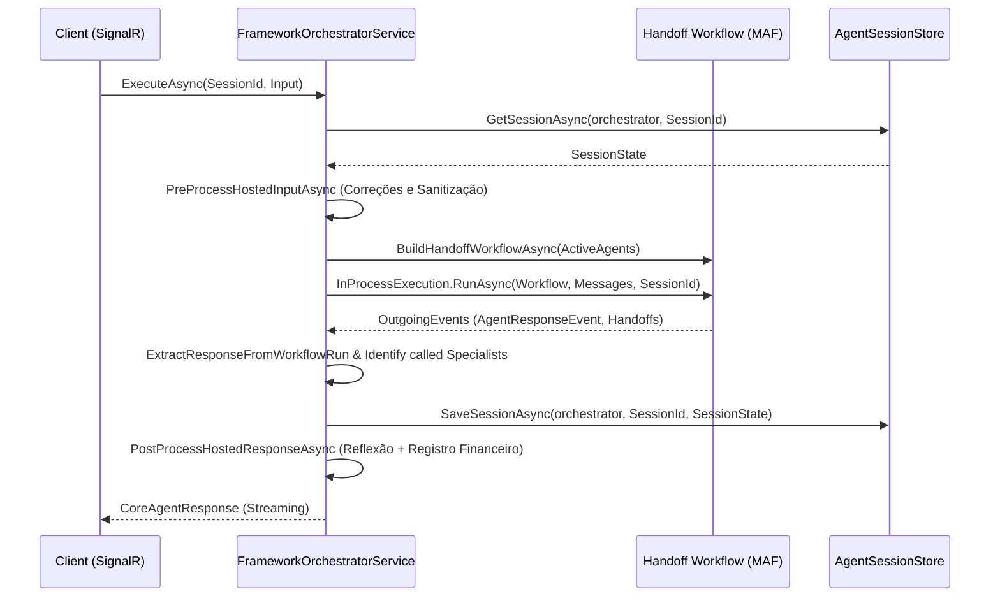

# AgenticSystem — Backend

O **AgenticSystem Backend** constitui a arquitetura core do sistema. É desenvolvido com base no ecossistema .NET mais recente e foca na orquestração de agentes generativos através de workflows hospedados. Ele abstrai e gerencia LLMs, memória semântica, protocolos de comunicação, integrações de plugins via MCP e aplica camadas vitais de segurança, custos e observabilidade.

## 🚀 Tecnologias e Camadas

- **Core**: .NET 10, ASP.NET Core 10, SignalR 10
- **Inteligência e Orquestração**: Microsoft Agent Framework 1.4+, Microsoft.Extensions.AI
- **Camada de Dados**: PostgreSQL com `pgvector` (via EF Core)
- **Modelos Homologados**: OpenAI (GPTs, Embeddings), Google Gemini, Anthropic Claude, Ollama locais.
- **RAG e Memória**: Hybrid Chunking Strategy, Heuristic Re-Ranker, ML.NET + ONNX, Obsidian vault.

## 📋 Pré-requisitos

- .NET 10 SDK
- PostgreSQL 16+ com extensão `pgvector` (necessário para persistência e memória semântica em modo de produção).
- Chaves de API das provedoras de IA ou uma instância do Ollama rodando localmente.

## 🛠️ Instalação e Execução

### Rodando via CLI (.NET)

1. Crie o seu arquivo de configurações baseando-se no exemplo:
   ```bash
   cp src/AgenticSystem.Api/appsettings.example.json src/AgenticSystem.Api/appsettings.json
   ```
2. Adicione as suas chaves de API desejadas no `appsettings.json`.

3. Restaure, compile e execute o projeto API:
   ```bash
   dotnet restore
   dotnet run --project src/AgenticSystem.Api
   ```
   A API ficará disponível em `https://localhost:5001`.

### Rodando com Docker Compose

Você pode inicializar a stack inteira (PostgreSQL + Aplicação + Ollama) via Docker Compose:
```bash
docker-compose up -d
```

## 📂 Estrutura da Solução

O monorepo está organizado de forma a segregar claramente responsabilidades:

- **`AgenticSystem.Api/`**: A camada de apresentação (Web API). Contém os Controllers REST, inicialização do framework e configurações (Startup/DI), além dos Hubs do SignalR para comunicação bidirecional com os clientes.
- **`AgenticSystem.Core/`**: Contém a Lógica de Negócio e os Modelos de Domínio. Aqui se encontram a definição formal dos Contratos (`ISkill`, `ITool`, etc.), a abstração dos Orquestradores (ex: `MetaAgentOrchestrator`) e a definição pura da comunicação com a camada de IA.
- **`AgenticSystem.Infrastructure/`**: Contém as implementações dos serviços externos, o `AgentFramework` (orquestrador hospedado, bindings de ferramentas), suporte a Banco de Dados (`PostgresSessionStore`, `EF Core Migrations`), conectores nativos, RAG, Service Gateway (telemetria, custos e resiliência) e plugins MCP.
- **`AgenticSystem.Tests/`**: Suíte de testes automatizados unitários usando xUnit, FluentAssertions e NSubstitute.

## 📡 Controllers e Endpoints (API)

A camada de API (`AgenticSystem.Api/Controllers`) contém múltiplos pontos de entrada, organizados por domínio funcional. Abaixo estão os principais *Controllers* e o que cada um gerencia:

- **`ChatController` (`/api/chat`)**  
  Ponto focal para as interações. Recebe e processa mensagens de usuários ou sistemas (`POST /api/chat`), ativando o MetaAgent e retornando metadados da execução. Frequentemente usado para streaming via Server-Sent Events (SSE) se não for via SignalR.
  
- **`AgentManagementController` (`/api/agent/agents`)**  
  Realiza o CRUD de instâncias de agentes (ex: criação, edição de prompt, arquivamento).  
  *Endpoints principais*: `GET /api/agent/agents`, `POST /api/agent/agents`, `DELETE /api/agent/agents/{id}`.

- **`AgentSkillsController` (`/api/agent/skills`) & `AgentToolsController` (`/api/agent/tools`)**  
  Gerenciam recursos modulares e as ferramentas plugáveis atribuídas a um ou mais agentes. Podem ser usados para criar ou atualizar integrações habilitadas.

- **`DocumentController` (`/api/document`)**  
  Controla o pipeline de RAG (Retrieval-Augmented Generation).  
  *Endpoints principais*: `POST /api/document/upload` (ingestão de arquivos), `GET /api/document/stats` (obtem métricas como volume de chunks, pesquisas vetoriais feitas em 24h e status ONNX).

- **`KnowledgeRoomController` (`/api/knowledge/rooms`)**  
  Faz o gerenciamento de "Salas de Conhecimento" onde um contexto documental é isolado por permissões baseadas em Tenants, evitando contaminação de informações entre as equipes.  
  *Endpoints*: CRUD padrão em `/api/knowledge/rooms`.

- **`WorkflowController` (`/api/workflow`)**  
  Permite o registro, visualização e invocação de fluxos de trabalho multicamada, onde sub-agentes são enfileirados ou processados em paralelo.  
  *Endpoints principais*: `POST /api/workflow/executions/start/{id}`, `GET /api/workflow/executions/{id}`, `POST /api/workflow/executions/{id}/cancel`.

- **`GatewayController` (`/api/admin/gateway`)**  
  Exclusivo para funções gerenciais de Service Gateway.  
  *Endpoints principais*: `GET /api/admin/gateway/dashboard` (panorama dos recursos em execução), `GET /api/admin/gateway/costs` e logs de *health/circuit-breaker*.

- **`LLMController` & `LLMProviderApiKeyController` (`/api/admin/llm`)**  
  Mapeiam a troca hot-swap entre os modelos (ex: substituir base URL para rodar Ollama ao invés de OpenAI) e as chaves de acesso.  
  *Endpoints principais*: `GET /api/admin/llm/providers`, `PUT /api/admin/llm/providers/{name}`.

- **`MCPPluginController` (`/api/admin/mcp`)**  
  Regula conexões dinâmicas com servidores de ferramentas via arquitetura MCP (Protocolo de Contexto de Modelo).  
  *Endpoints*: `GET /api/admin/mcp/plugins`, `POST /api/admin/mcp/plugins` (registrar plugin).

- **`SessionController` (`/api/session`)**  
  Persistência e recuperação das conversas passadas e controle das memórias episódicas do Postgres.  
  *Endpoints principais*: `GET /api/session/{id}/messages`, `DELETE /api/session/{id}`.

- **`SettingsController` (`/api/admin/settings`)**  
  Altera limites globais em tempo de execução sem reinicialização. Inclui roteamento para configurações de `gateway`, `memory` e `reranking`.

- **`VoiceController` (`/api/voice`)**  
  Acomoda fluxos rápidos via comando de voz (Alexa, Google Assistant).  
  *Endpoint*: `POST /api/voice/ask` (recebe *text-in* de STT e devolve uma *clean response* textual limitando o processamento a 7 segundos).

- **`ScheduledTasksController` (`/api/admin/scheduled`)**  
  Permite invocar agendamentos periódicos e rotinas de segundo plano associadas aos Agentes, que funcionam de modo autônomo.

## 🤖 Integração com o Microsoft Agent Framework (MAF)

O núcleo de inteligência e orquestração multi-agente do sistema é construído sobre o **Microsoft Agent Framework (MAF)** (`Microsoft.Agents.AI`), integrado aos novos padrões de abstração do `.NET 10` e da biblioteca `Microsoft.Extensions.AI`.

Abaixo está o detalhamento técnico de como o framework é configurado, como os agentes cooperam entre si via workflows dinâmicos de handoff e como o pipeline de execução e middlewares filtram as interações.

---

### 1. Arquitetura de Inicialização (`OrchestratorHostBuilder`)

O `OrchestratorHostBuilder` é o componente nativo responsável por centralizar a montagem do agente orquestrador principal e configurar dinamicamente suas capacidades. Alinhado ao padrão `AddAIAgent` do MAF, ele encapsula a composição declarativa do agente de chat (`ChatClientAgent`), ferramentas de sistema, injeção de contexto e middlewares de governança.

A inicialização e o encadeamento de middlewares declarativos (como RAG e Security Gates) no MAF estão implementados no método `CreateHostedOrchestratorAgent` do arquivo [OrchestratorHostBuilder.cs](file:///c:/Users/Jonathan/Documents/Developer/GitHub/Agent-System/src/AgenticSystem.Infrastructure/AgentFramework/OrchestratorHostBuilder.cs).

---

### 2. Workflows Dinâmicos de Handoff (Topologia Mesh)

Em vez de cascatear chamadas estáticas, o backend adota uma **Adoção Agressiva de Handoffs Autônomos**. O orquestrador atua como um agente de triagem (*Triage Agent*). 
Através do método `BuildHandoffWorkflowAsync`, é montado um grafo de workflow dinâmico utilizando a classe `AgentWorkflowBuilder`. A topologia construída é do tipo **Mesh (Malha)**:
- O **Orquestrador** pode delegar a execução de uma tarefa a qualquer um dos **Agentes Especialistas** ativos (e vice-versa).
- Os **Agentes Especialistas** têm autonomia para transferir o controle entre si ou devolver o controle de volta ao Orquestrador quando terminarem.

A lógica de montagem e enlace dos agentes especialistas em uma topologia mesh está descrita e implementada no método `BuildHandoffWorkflowAsync` do arquivo [OrchestratorHostBuilder.cs](file:///c:/Users/Jonathan/Documents/Developer/GitHub/Agent-System/src/AgenticSystem.Infrastructure/AgentFramework/OrchestratorHostBuilder.cs).

---

### 3. Pipeline de Middlewares Customizados

A extensão do pipeline de execução dos agentes do MAF é feita estendendo o `AIAgentBuilder` com middlewares customizados. Isso permite injetar comportamentos pré e pós-execução de forma limpa e transparente.

Os três principais middlewares de domínio no sistema são:

*   **`UseAIContextProviders` / `RAGContextProvider`**:  
    Intercepta a execução do agente e injeta fragmentos de memória semântica e histórico contextual antes de enviar a chamada para a LLM, realizando o RAG sob demanda com compressão semântica.
*   **`UseQualityGates` / `QualityGateDelegatingAgent`**:  
    Middleware de barreira de segurança. Analisa o prompt de entrada (prevenção contra *Prompt Injection*) e a resposta de saída (prevenção contra vazamento de credenciais ou dados sensíveis).
*   **`UseReflection` / `ReflectionDelegatingAgent`**:  
    Middleware pós-ação. Avalia o score de confiança e a acurácia da resposta gerada, armazenando aprendizados operacionais da execução na memória episódica local.

---

### 4. Ciclo de Vida da Execução (`FrameworkOrchestratorService`)

A execução real das demandas do usuário ocorre dentro do `FrameworkOrchestratorService.cs`. O ciclo de processamento segue os seguintes passos:



1.  **Carregamento de Estado**: O `AgentSessionStore` recupera a sessão do framework vinculada ao `SessionId` (podendo persistir em memória ou no banco PostgreSQL com pgvector).
2.  **Pré-Processamento**: Executa o pipeline de sanitização (`IAgentExecutionPreProcessingPipeline`) para formatar mensagens e corrigir distorções estruturais no input.
3.  **Execução do Workflow**: Invoca a execução assíncrona do grafo de malha construído usando `InProcessExecution.RunAsync(...)` para rodar o Handoff em processo:
    Esta etapa invoca a orquestração nativa em processo mapeada no método `ExecuteAsync` de [FrameworkOrchestratorService.cs](file:///c:/Users/Jonathan/Documents/Developer/GitHub/Agent-System/src/AgenticSystem.Infrastructure/AgentFramework/FrameworkOrchestratorService.cs).
4.  **Extração do Resultado**: O resultado final e as mensagens acumuladas no fluxo são decodificados a partir dos eventos expostos pela execução (como `AgentResponseEvent`, `AgentResponseUpdateEvent` e `WorkflowOutputEvent`).
5.  **Detecção de Handoff / Especialistas**: O serviço analisa os logs de execução para descobrir se houve delegação de contexto identificando assinaturas de chamadas especiais como `handoff_to_[agent]` ou *Tool Calls* específicas do especialista.
6.  **Persistência e Pós-Processamento**: O estado do agente é atualizado no `AgentSessionStore` e a resposta passa pelo pipeline de pós-processamento, que dispara a telemetria, atualiza o balanço de custos e salva os novos metadados da sessão.

---

## 🛡️ Service Gateway e Proteções

Todo o tráfego em direção a serviços de IA ou integrações externas transita pelo **Gateway Unificado**, que garante:
1. **Resiliência**: Implementação pura em C# de um Circuit Breaker com failovers automáticos para evitar falhas em cascata.
2. **Segurança**: Isolamento de dependências. Suporte nativo à contenção de Injeção de Prompt através de Quality Gates. Rate Limiting aplicado por tenant e por roteamento de requisição (evita os 429 diretos para o front).
3. **Custos**: Monitoramento e alerta constante para a utilização e limites financeiros.

## 📡 Hubs do SignalR

- **`/hubs/chat`**: Responsável pelo streaming do texto gerado pelo modelo diretamente para a interface do cliente e por eventos da sessão.
- **`/hubs/gateway`**: Expõe em tempo real telemetria técnica (`CircuitStateChanged`, `CostAlertTriggered`, etc.).
- **`/hubs/external-agent`** & **`/hubs/workflow`**: Hubs para orquestração avançada de passos do agente em sessões complexas e workflows de aprovação.

## 🧪 Testes

O CI assegura uma cobertura mínima de 80% do código (atualmente são mais de 600 testes unitários no core).

Para rodar a suíte de testes do Backend:
```bash
dotnet test
```

## 🗄️ Migrações de Banco de Dados

O banco de dados utiliza migrações automáticas aplicadas ao iniciar o contexto, mas caso seja necessária a adição de novas tabelas ou relacionamentos através do Entity Framework Core, as migrações DEVEM ser geradas no projeto `Infrastructure`:

```bash
dotnet ef migrations add <NomeDaMigracao> --project src/AgenticSystem.Infrastructure --startup-project src/AgenticSystem.Api --output-dir Persistence/Migrations
```
