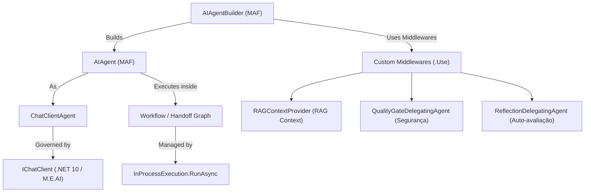
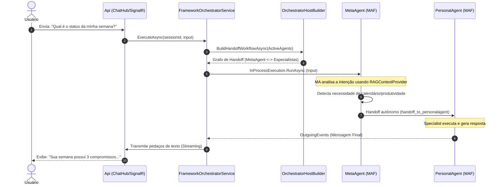
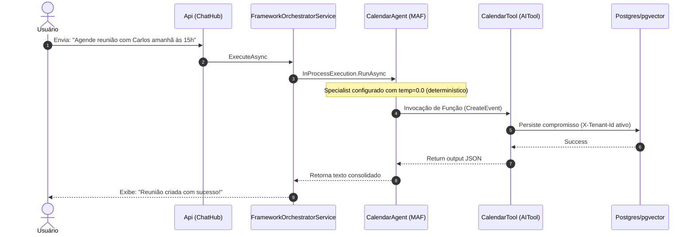
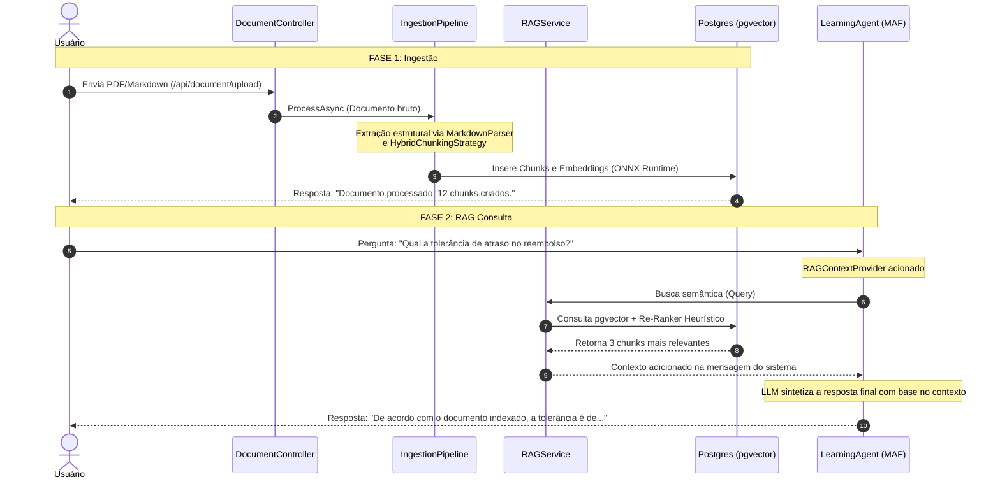
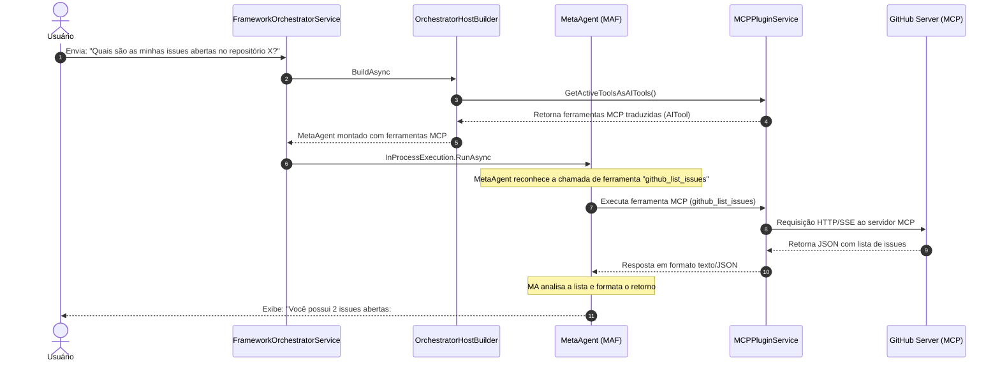
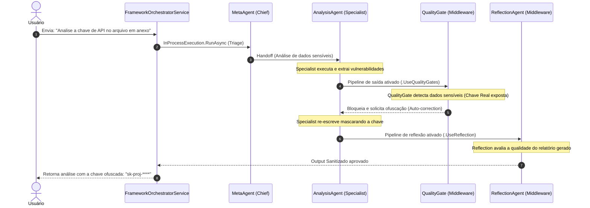
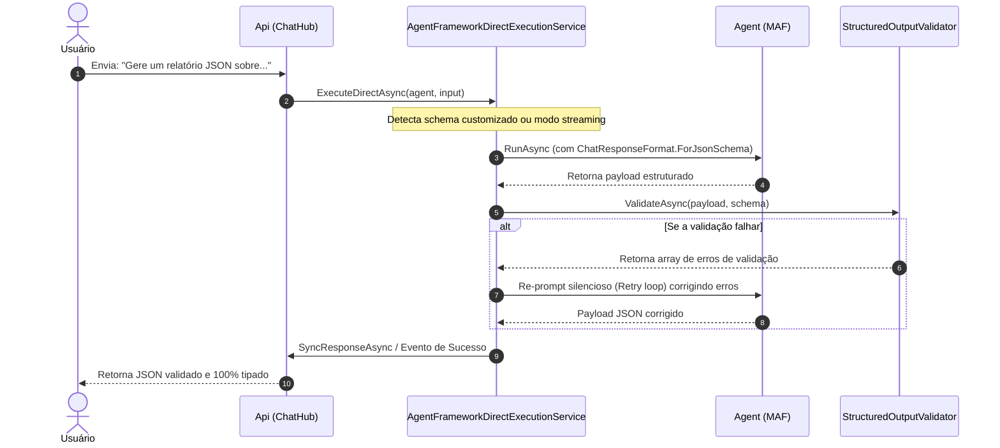

# Microsoft Agent Framework (MAF) — Guia de Arquitetura e Integração

Este documento detalha o uso, conexões, fluxos de dados, componentes e cenários operacionais do **Microsoft Agent Framework (MAF)** (`Microsoft.Agents.AI`) no projeto **AgenticSystem**. 

O sistema aproveita os conceitos nativos do MAF para fornecer uma orquestração multi-agente robusta, extensível e governada por segurança, limites de custos e memória contextual semântica.

---

## 🏗️ Conceitos Fundamentais do MAF no Projeto

O ecossistema MAF se conecta ao projeto através de classes e interfaces integradas de forma declarativa e modular:

### 1. Agentes (`AIAgent` & `ChatClientAgent`)
Os agentes no MAF encapsulam instruções do sistema (prompts de personalidade) e ferramentas ativas. No projeto, usamos o `ChatClientAgent` (que herda de `AIAgent`) alimentado por uma instância de `IChatClient` (proveniente do pacote `Microsoft.Extensions.AI`). Esse design permite alternar dinamicamente o provedor de IA (OpenAI, Gemini, Claude ou Ollama) mantendo as capacidades nativas do agente.

### 2. Workflows e Execuções (`Workflow` & `InProcessExecution`)
Em vez de implementar lógica de controle sequencial, as transições entre agentes são modeladas como grafos de workflow. O `AgentWorkflowBuilder` cria o grafo e a classe de runtime do MAF `InProcessExecution` é responsável por gerenciar a execução ativa das mensagens e disparar eventos.

### 3. Ferramentas (`AITool` & `AgentToolBinding`)
Ferramentas são expostas como instâncias de `AITool` nativas. No backend, criamos uma fachada dinâmica: os agentes especialistas ativos são empacotados como ferramentas de transição de contexto (`AgentToolBinding`), permitindo que a LLM selecione o especialista como se fosse uma chamada de função.

### 4. Ciclo de Vida da Memória (`AgentSessionStore`)
O MAF mantém o histórico e estado da conversação dentro de um objeto de sessão. Nós integramos esse fluxo usando o `AgentSessionStore` com a classe `SimpleSessionStoreAdapter`, que traduz a persistência do MAF para a nossa interface assíncrona `ISessionStore` (com suporte a PostgreSQL pgvector ou memória RAM).

---

## 🔌 Integrações de Domínio

### RAG (Retrieval-Augmented Generation) & Re-ranking
A integração de RAG com o MAF ocorre através do middleware declarativo `UseAIContextProviders` configurado no `AIAgentBuilder`. 
- O arquivo [RAGContextProvider.cs](file:///c:/Users/Jonathan/Documents/Developer/GitHub/Agent-System/src/AgenticSystem.Infrastructure/AgentFramework/RAGContextProvider.cs) estende a classe `AIContextProvider` do MAF.
- Durante a execução, ele intercepta a chamada à LLM, realiza a busca semântica e delega para o `IRAGService`.
- **O Papel do Chunking**: A base de um bom RAG é como o documento é indexado. O projeto utiliza o [HybridChunkingStrategy](file:///c:/Users/Jonathan/Documents/Developer/GitHub/Agent-System/src/AgenticSystem.Infrastructure/Chunking/HybridChunkingStrategy.cs), que respeita fronteiras estruturais (como seções e cabeçalhos de markdown) e aplica um fallback para tamanhos de tokens fixos quando necessário. Isso garante que a preservação do contexto semântico seja mantida antes mesmo do embedding.
- **O Papel do Re-ranking**: Antes dos dados serem injetados no prompt do MAF, o pipeline do `RAGService` realiza a busca vetorial bruta, filtra os candidatos por score mínimo de relevância, e invoca o **Re-Ranker** (`IReRanker` / `HeuristicReRanker`). O Re-ranker reordena os chunks priorizando correspondências semânticas profundas de termos-chave e proximidade temporal (Freshness Score).
- Por fim, a compressão semântica e limpeza de histórico ocorrem sob pressão de limite de tokens (`ContextBudget`) antes da injeção definitiva como mensagens secundárias do sistema.

### MCP (Model Context Protocol)
O sistema expõe e consome ferramentas de forma flexível utilizando servidores MCP.
- O arquivo [MCPPluginController.cs](file:///c:/Users/Jonathan/Documents/Developer/GitHub/Agent-System/src/AgenticSystem.Api/Controllers/MCPPluginController.cs) gerencia servidores adicionais.
- As ferramentas providas por esses servidores são traduzidas para classes `AITool` do MAF em tempo de execução e acopladas dinamicamente ao orquestrador principal, permitindo que agentes façam consultas na web, leiam arquivos ou operem bancos de dados por comandos externos assíncronos.

### Skills vs Tools
Conceitualmente, o sistema separa as competências em duas categorias:
- **Skills (Prompt-based)**: Injetam diretrizes comportamentais e manuais diretamente no system prompt do agente no momento da sua instanciação. Gerido pelo `ISkillManager`.
- **Tools (Action-based)**: Capacidades executáveis via Gateway, mapeadas em instâncias de `AITool` e passadas como propriedades de chamada na assinatura da LLM.

### Execução Direta e Streaming
Embora os fluxos complexos utilizem o `InProcessExecution` para gerenciar grafos de roteamento, o sistema fornece o [AgentFrameworkDirectExecutionService](file:///c:/Users/Jonathan/Documents/Developer/GitHub/Agent-System/src/AgenticSystem.Infrastructure/AgentFramework/AgentFrameworkDirectExecutionService.cs) para casos de uso singulares onde não há transição de agentes.
- Esta classe executa o agente de forma isolada, sendo a espinha dorsal para **Streaming Direto** (retornando tokens via `AgentStreamEvent`) ou validação estrita de saídas estruturadas JSON (usando `IStructuredOutputValidator`).

### Configuração Declarativa via YAML
A criação de agentes é descentralizada pelo [AgentYamlValidator](file:///c:/Users/Jonathan/Documents/Developer/GitHub/Agent-System/src/AgenticSystem.Infrastructure/AgentFramework/AgentYamlValidator.cs).
- Administradores definem metadados (Tier, AutonomyLevel, AllowedTools) e instruções base em arquivos `.yaml`. 
- Em tempo de execução, essas regras passam por validação semântica estrita (verificando a existência de ferramentas mapeadas) e são convertidas dinamicamente em configurações de agente no MAF.

### Comunicação Inter-Agentes (Pub/Sub)
O [FrameworkAgentChannelService](file:///c:/Users/Jonathan/Documents/Developer/GitHub/Agent-System/src/AgenticSystem.Infrastructure/AgentFramework/FrameworkAgentChannelService.cs) implementa um canal de comunicação nativa (Pub/Sub) entre agentes.
- Atua como um barramento de mensagens sobre o `SessionManager`. 
- Agentes podem publicar mensagens segmentadas (`SourceAgent -> TargetAgent`), e na próxima execução do alvo, essas mensagens são agregadas no prompt como `[Native Agent Channel Context]`.

### Proxy de Escopo para Protocolos Externos
Para garantir que os agentes do MAF conversem de forma segura com protocolos externos (A2A, AG-UI), foi desenvolvido o [ScopedAgentProxy](file:///c:/Users/Jonathan/Documents/Developer/GitHub/Agent-System/src/AgenticSystem.Infrastructure/AgentFramework/ScopedAgentProxy.cs). 
- Ele resolve ciclos de injeção de dependência atuando como um Proxy Singleton, o que permite criar um escopo assíncrono (AsyncScope) sob demanda durante requisições longas de SSE (Server-Sent Events).
---

## 🛡️ Governança, Resiliência e Infraestrutura Auxiliar

Para sustentar o MAF em produção, o sistema conta com uma infraestrutura profunda voltada à resiliência, isolamento e observabilidade.

### 1. Service Gateway (Controle de Custo, Rate Limit e Circuit Breaker)
Todas as chamadas para a LLM passam pelo [ServiceGateway](file:///c:/Users/Jonathan/Documents/Developer/GitHub/Agent-System/src/AgenticSystem.Infrastructure/Gateway/ServiceGateway.cs). Ele atua como um escudo protetor:
- **Rate Limiting**: Utiliza o [RateLimiter](file:///c:/Users/Jonathan/Documents/Developer/GitHub/Agent-System/src/AgenticSystem.Infrastructure/Gateway/RateLimiter.cs) (Sliding Window) para limitar requisições por minuto isoladas por Tenant.
- **Cost Tracking**: O [CostTracker](file:///c:/Users/Jonathan/Documents/Developer/GitHub/Agent-System/src/AgenticSystem.Infrastructure/Gateway/CostTracker.cs) calcula os tokens consumidos em tempo real e bloqueia o tráfego se o Tenant ultrapassar o `DefaultDailyBudget`.
- **Circuit Breaker**: O [CircuitBreaker](file:///c:/Users/Jonathan/Documents/Developer/GitHub/Agent-System/src/AgenticSystem.Infrastructure/Gateway/CircuitBreaker.cs) monitora falhas consecutivas de provedores externos (ex: OpenAI com indisponibilidade) e entra em modo "Open" (Fail-fast) para evitar sobrecarga em cascata no backend.

### 2. Event-Driven Architecture e Outbox Pattern
A comunicação de eventos de domínio é feita através do [PostgresEventBus](file:///c:/Users/Jonathan/Documents/Developer/GitHub/Agent-System/src/AgenticSystem.Infrastructure/Persistence/PostgresEventBus.cs).
- Para evitar a perda de eventos em caso de falha de rede (Dual-Write Problem), o projeto adota o **Outbox Pattern**. Os eventos são salvos no banco de dados na mesma transação da ação principal.
- Um worker rodando em segundo plano, o [OutboxProcessorBackgroundService](file:///c:/Users/Jonathan/Documents/Developer/GitHub/Agent-System/src/AgenticSystem.Infrastructure/Persistence/OutboxProcessorBackgroundService.cs), captura esses eventos e os despacha de forma segura e garantida.

### 3. Isolamento Multi-Tenant Estrito (Data Boundary)
A fundação de dados no `AgenticDbContext` é desenhada para SAAS:
- A camada de acesso aos dados impõe filtros de consulta globais (Global Query Filters) do Entity Framework.
- O Tenant é interceptado no pipeline (via header `X-Tenant-Id` ou Claim JWT) e propagado. Qualquer entidade que implemente `ITenantEntity` tem seus dados filtrados invisivelmente, impossibilitando vazamento de dados entre clientes nas sessões do MAF.

### 4. Processamento Assíncrono (Background Workers)
O processamento pesado foi desacoplado para não bloquear a thread principal da API:
- **[OnnxInferenceBackgroundWorker](file:///c:/Users/Jonathan/Documents/Developer/GitHub/Agent-System/src/AgenticSystem.Infrastructure/BackgroundServices/OnnxInferenceBackgroundWorker.cs)**: Em vez de bloquear o upload de documentos chamando APIs externas, a vetorização e criação de Embeddings ocorre localmente e em background usando a engine ONNX.
- **[SelfImprovementBackgroundJob](file:///c:/Users/Jonathan/Documents/Developer/GitHub/Agent-System/src/AgenticSystem.Infrastructure/BackgroundServices/SelfImprovementBackgroundJob.cs)**: Rotina que avalia periodicamente o desempenho dos agentes e propõe melhorias automáticas nos prompts do sistema com base no histórico de reflexão.
- **[RealTimeConfigReloadBackgroundService](file:///c:/Users/Jonathan/Documents/Developer/GitHub/Agent-System/src/AgenticSystem.Infrastructure/Persistence/RealTimeConfigReloadBackgroundService.cs)**: Recarrega as configurações (ex: budget, timeout) em runtime, dispensando reinicializações do servidor.

### 5. Ferramentas Auxiliares do Orquestrador (Meta-Tools)
O Chief Orchestrator não possui apenas o roteamento embutido, mas um conjunto de capacidades avançadas fornecidas pelas [OrchestratorAuxiliaryTools](file:///c:/Users/Jonathan/Documents/Developer/GitHub/Agent-System/src/AgenticSystem.Infrastructure/AgentFramework/OrchestratorAuxiliaryTools.cs):
- **Criação Dinâmica de Agentes**: A tool `create_dynamic_agent` permite que o orquestrador instancie *novos agentes do zero* em tempo de execução caso a necessidade do usuário não seja atendida por nenhum especialista existente no catálogo.
- **Auto-Consulta (Self-RAG)**: Usando a tool `retrieve_context`, o orquestrador pode consultar ativamente a base de conhecimento *antes* de decidir para quem direcionar a tarefa.
- **Roteamento Matemático (SmartRouter)**: As tools `route_to_best_agent` e `analyze_request` dão ao orquestrador a habilidade de consultar uma engine determinística que calcula "Confidence Scores" para recomendar o melhor agente, construindo uma cadeia de fallback (`Fallback Chain`).
- Tudo isso é montado no prompt mestre dinamicamente pelo [OrchestratorInstructionService](file:///c:/Users/Jonathan/Documents/Developer/GitHub/Agent-System/src/AgenticSystem.Infrastructure/AgentFramework/OrchestratorInstructionService.cs), com um sistema de cache que expira sempre que o pool de agentes ativos for alterado.

---

## 🎬 Cenários Operacionais & Fluxos Detalhados

---

### Cenário A: Conversa Geral e Roteamento Inteligente (Triage)
*O usuário envia uma mensagem genérica sem especificar um agente (ex: "Qual é o status da minha semana?"). O MetaAgent (Chief Orchestrator) assume o controle e roteia a demanda.*

**Descrição do Fluxo:**
1. A API recebe o prompt conversacional através do WebSocket do SignalR (`ChatHub`).
2. O `FrameworkOrchestratorService` carrega as sessões ativas e chama o `OrchestratorHostBuilder` para construir o workflow com todos os agentes cadastrados.
3. O workflow inicia a execução em processo. O `MetaAgent` (agente de triagem) processa as diretrizes iniciais e injeta seu prompt de triagem.
4. O RAG Context Provider realiza a consulta e alimenta o prompt com metadados do calendário.
5. O `MetaAgent` reconhece a menção a "semana" (tempo/compromissos), executa a ferramenta de transição `handoff_to_personalagent`, transferindo o controle do contexto da sessão do MAF para o `PersonalAgent`.
6. O `PersonalAgent` lê o histórico, formata os compromissos, e finaliza a execução retornando uma mensagem final.
7. O SignalR de volta no Api Controller streama a resposta final.

---

### Cenário B: Criação de Lembrete Ativo (CalendarAgent + Tools)
*O usuário ordena uma ação direta de agendamento (ex: "Agende reunião com Carlos amanhã às 15h").*

**Descrição do Fluxo:**
1. O usuário submete a frase imperativa de agendamento.
2. O `FrameworkOrchestratorService` delega a execução. Como a intenção de calendário é óbvia, o fluxo do MAF é iniciado direcionado diretamente ao `CalendarAgent` (pula a triagem).
3. O `CalendarAgent` é carregado com temperatura configurada como `0.0` para evitar alucinações de dados e com acesso à ferramenta `CalendarTool`.
4. O agente analisa os parâmetros de data ("amanhã") e hora ("15h") e dispara uma chamada de função estruturada nativa da ferramenta `CreateEvent`.
5. A ferramenta executa o comando de banco no repositório persistente Postgres, isolado por tenant, e retorna a confirmação de inserção.
6. O `CalendarAgent` recebe a confirmação em JSON e responde ao usuário consolidando o sucesso da ação.

---

### Cenário C: Ingestão de Documentos e Consulta RAG Semântica
*O usuário indexa um arquivo de políticas corporativas no pipeline e depois tira dúvidas sobre ele.*

**Descrição do Fluxo:**
1. **Fase 1 (Ingestão)**: O `DocumentController` recebe o arquivo do usuário, que passa pelo pipeline de processamento:
   - Extrai texto puro estruturado usando os parsers correspondentes (Markdown, PlainText, HTML).
   - Divide o documento em parágrafos coerentes usando o `HybridChunkingStrategy` (mantendo overlap de frases para consistência).
   - Vetoriza os fragmentos gerando embeddings via modelos configurados e armazena os dados semânticos no PostgreSQL.
2. **Fase 2 (Consulta)**: Ao receber a dúvida do usuário, o `LearningAgent` (especializado em pesquisa e síntese) é acionado.
3. O `RAGContextProvider` intercepta e executa a busca de proximidade vetorial no banco usando a extensão `pgvector`.
4. Os resultados são reordenados utilizando o `HeuristicReRanker` (priorizando correspondência exata de termos chaves e restrição de datas) e anexados à pilha de mensagens enviada ao LLM.
5. O `LearningAgent` lê o prompt enriquecido com a documentação extraída e redige a resposta final baseada estritamente nos dados confiáveis.

---

### Cenário D: Orquestração de Ferramentas via Servidor MCP Externo
*O orquestrador precisa consultar dados de repositórios do Github ou ferramentas do sistema, utilizando um plugin de terceiros conectado via Model Context Protocol.*

**Descrição do Fluxo:**
1. O usuário faz uma pergunta relacionada a dados externos gerenciados por servidores MCP conectados.
2. Na montagem do orquestrador, o `OrchestratorHostBuilder` consulta o `MCPPluginService` e converte as ferramentas remotas em instâncias válidas de `AITool` do MAF.
3. O workflow dinâmico do `MetaAgent` inicia. O modelo reconhece que precisa da informação externa e seleciona a ferramenta MCP correspondente (ex: `github_list_issues`).
4. O `MCPPluginService` encaminha a requisição HTTP/SSE ao servidor de ferramenta MCP ativo.
5. O servidor realiza a comunicação externa real com o Github, recupera os dados, e responde ao Gateway.
6. Os dados JSON chegam ao contexto do `MetaAgent` que formata as issues em uma tabela amigável e apresenta a resposta.

---

### Cenário E: Colaboração Avançada entre Agentes e Gateways (Mesh Collaboration)
*O usuário pede para analisar um relatório de segurança. O fluxo passa por múltiplos agentes, validações de qualidade e correções automáticas de barreira.*

**Descrição do Fluxo:**
1. O usuário insere um texto suspeito ou relatórios de seguranças complexos.
2. O `MetaAgent` avalia as responsabilidades e delega a tarefa via Handoff ao `AnalysisAgent`.
3. O `AnalysisAgent` elabora as conclusões técnicas.
4. Ao finalizar a geração, o pipeline intercepta a resposta através do middleware `QualityGateDelegatingAgent` configurado no builder:
   - Ele varre o texto utilizando regras e expressões e detecta a presença de chaves de API secretas reais expostas na resposta.
   - Bloqueia o tráfego de saída, injeta uma instrução corretiva em tempo de execução ao agente e força a regeração sanitizada.
5. O agente ajusta o texto substituindo os dados confidenciais por caracteres ofuscados (ex: `sk-proj-****`).
6. A execução avança pelo `ReflectionDelegatingAgent` que avalia se a resposta final responde a dúvida com confiança alta, salvando o aprendizado no histórico da sessão do Postgres.
7. A resposta limpa e segura é transmitida com sucesso para o usuário final.

---

### Cenário F: Execução Direta com Validação de Esquema e Streaming
*O usuário solicita a extração de dados estruturados onde uma resposta JSON rígida é estritamente exigida (ou no modo Live Streaming).*

**Descrição do Fluxo:**
1. A requisição aciona o `AgentFrameworkDirectExecutionService` ao invés de um grafo de handoff complexo.
2. O framework inspeciona as anotações do agente (ex: `AgenticJsonSchemaAttribute`) e configura as opções do modelo subjacente (`ChatResponseFormat.ForJsonSchema`).
3. O agente aciona a LLM que retorna o payload JSON.
4. O `StructuredOutputValidator` verifica semanticamente o payload contra o schema da plataforma.
5. **Auto-Correção**: Se o modelo alucinar chaves ou formatos, um loop de reprompt automático injeta as falhas e pede correção sem que o usuário perceba.
6. A resposta validada é registrada na sessão e retornada.
